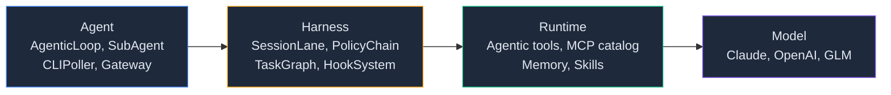

<p align="center">
  
</p>

<p align="center">
  
  
  <a href="https://github.com/mangowhoiscloud/geode/actions"></a>
</p>

<p align="center">
  
  
  
</p>

<p align="center">
  <a href="https://mangowhoiscloud.github.io/geode/docs">문서</a>
  ·
  <a href="https://mangowhoiscloud.github.io/geode/self-improving/">Self-improving 허브</a>
  ·
  <a href="README.md">English</a>
</p>

# GEODE v0.99.243 — A Self-improving Autonomous Execution Agent

자기 자신이 올라탄 scaffold 를 스스로 고쳐쓰는 범용 자율 에이전트. 자연어로 물으면 GEODE 가 계획을 세우고, 도구를 호출해, 결과를 보고합니다. 1회성 프롬프트도, 장시간 세션도 동일하게. 그 아래에서는 outer loop 가 작업을 수행하는 시스템 자체를 계속 다듬습니다.

> **ChatGPT Plus, Pro, Business, Edu, Enterprise 결제 중이신가요?** 그 구독을 GEODE 가 그대로 씁니다. API 키 필요 없습니다. [구독 setup ↓](#path-a--chatgpt-구독-openai-사용자에게-권장)
>
> **Claude Pro / Max 사용자라면** — 2026-01-09 발효된 Anthropic 약관이 Claude Code OAuth 토큰의 외부 도구 재사용을 금지합니다. 그래서 GEODE 는 그 토큰을 읽지 않습니다. 대신 Anthropic API 키 (Path B) 를 쓰시면 됩니다. Console 계정은 같고, 신규 가입자는 $5 무료 크레딧을 받습니다.

---

## Self-improving loop

GEODE 는 **non-parametric** 갈래의 자기진화 에이전트입니다. 모델 가중치가 아니라 자신의 scaffold (시스템 프롬프트, 도구 정책, 작업 분해, reflection, 스킬, 에이전트 계약, 도구 설명) 를 변이시켜 개선합니다. fitness 는 capability 벤치마크가 아니라 적대적 **안전성** audit 입니다. Petri 급, 다차원이며, critical 안전 차원에는 하드 floor 가 걸려 있어 그 차원을 후퇴시키는 변경은 거부됩니다. **선택** seed 는 함께 진화합니다 — co-scientist 파이프라인이 에이전트와 나란히 적대적 seed 를 키웁니다 — 따라서 이들은 고정된 자가 아니라 움직이는 선택 압력을 가합니다. 세대 간 fitness 는 절대 변이하지 않는 별도의 **버전 고정 held-out 벤치** 위에서 측정합니다. 실제 개선의 증거로 인정되는 것은 그 held-out 곡선뿐입니다.

선택은 정직한 **(1+1) 챔피언 체인**입니다. 변이하고, audit 하고, 실제 이득이 있을 때만 promote 하고, 아니면 revert 합니다. 두 개의 loop 가 함께 돕니다. inner agentic loop 는 작업을 수행하고, outer loop 는 작업을 수행하는 시스템을 다듬습니다. 이 loop 계보 (Promptbreeder, STOP, ADAS, DGM, GEPA) 는 이미 잘 정립돼 있습니다. GEODE 는 그것을 capability 에서 safety 로, 가중치에서 scaffold 로, co-evolved 적대적 seed 위로 다시 겨냥합니다. 새 primitive 가 아니라, 비어 있던 칸을 채우는 재조합입니다.

- **[closed loop →](https://mangowhoiscloud.github.io/geode/docs/capabilities/autoresearch)** — autoresearch, 변이 / audit / promote / revert 전 과정
- **[Two loops →](https://mangowhoiscloud.github.io/geode/docs/concepts/two-loops)** — inner 와 outer 의 멘탈 모델
- **[계보와 포지셔닝 →](https://mangowhoiscloud.github.io/geode/docs/capabilities/lineage)** — 기존 self-improving loop 들 사이에서 GEODE 의 위치
- **[Self-improving 허브 →](https://mangowhoiscloud.github.io/geode/self-improving/)** — 실제 generation, 변이, promote 결정
- **[Petri bundle →](https://mangowhoiscloud.github.io/geode/self-improving/petri-bundle/)** — 안전성 audit transcript 를 보는 라이브 뷰어

---

## 무엇을 시킬 수 있나요

복붙해서 바로 시도해보세요:

```
"이번 달 arXiv 의 최신 RAG 논문 요약해줘"
"내 프로필에 맞는 LinkedIn 채용 공고 찾아서 우선순위 매겨줘"
"평일 오전 9시 스탠드업 알림 만들어줘"
"hacker news 에서 LangGraph 관련 글 모니터링하다가 Slack 으로 DM 보내줘"
"코드 리뷰용으로 gpt-5.5 와 claude-opus-4.7 비교해줘"
```

GEODE 는 적합한 도구(웹 검색, 파일 작업, MCP 서버, 서브에이전트)를 골라 실행한 뒤, 출처와 비용까지 포함해 답을 보여줍니다.

---

## 5분 setup

### 사전 준비물

<details>
<summary><strong>이게 뭔지 모르세요?</strong> 클릭하면 1줄 설명이 나옵니다.</summary>

- **Python 3.12 이상** — GEODE 가 작성된 언어. 대부분의 노트북엔 충분히 최신 버전이 안 깔려 있습니다. [python.org/downloads](https://www.python.org/downloads/) 에서 macOS 또는 Windows 인스톨러 다운로드 후 설치.
- **Git** — GitHub 에서 GEODE 소스를 복사해오는 도구. Mac 은 `xcode-select --install`. Windows 는 [git-scm.com](https://git-scm.com/) 인스톨러.
- **uv** — 빠른 Python 패키지 매니저(pip 대체). 아래 `curl` 명령을 터미널/PowerShell 에 그대로 붙여넣기.

이 중 하나라도 안 되면 아래 [트러블슈팅](#트러블슈팅) 참고.
</details>

| 도구 | 설치 | 확인 |
|------|------|------|
| Python 3.12+ | [python.org/downloads](https://www.python.org/downloads/) | `python3 --version` |
| Git | [git-scm.com](https://git-scm.com/) | `git --version` |
| uv | `curl -LsSf https://astral.sh/uv/install.sh \| sh` | `uv --version` |

### 1단계 — GEODE 설치

GEODE 의 PyPI 배포명은 **`geode-agent`** 입니다. 설치되는 실행 명령은 **`geode`** 입니다.

```bash
uv tool install geode-agent
geode version
```

현재 릴리즈가 아직 PyPI 에 공개되지 않았거나 GEODE 자체를 개발하려면 소스 체크아웃으로 설치하세요:

```bash
git clone https://github.com/mangowhoiscloud/geode.git
cd geode
uv sync                              # 의존성 설치 (~30초)
uv tool install -e . --force         # `geode` 를 어디서나 쓸 수 있게 등록
```

### 2단계 — setup wizard 실행

```bash
geode setup
```

Wizard 가 세 가지 경로를 제시합니다: ChatGPT 구독 (이미 `codex auth login` 했다면 자동 감지), API 키 (붙여넣기), dry-run 으로 일단 둘러보기. 본인에 맞는 걸 고르면 됩니다.

GEODE 설치 전에 이미 `codex auth login` 을 해뒀다면 이 단계 건너뛰어도 됩니다 — 다음 `geode` 실행 시 토큰을 자동 감지하고 바로 시작합니다.

### 3단계 — 경로별 수동 안내 (참고용)

위 wizard 가 아래 내용을 다 처리합니다. 이 섹션은 각 경로가 실제로 무엇을 하는지 알고 싶을 때 참고하세요.

---

#### Path A — ChatGPT 구독 (OpenAI 사용자에게 권장)

Codex CLI 로 한 번 로그인하면, GEODE 가 `~/.codex/auth.json` 의 토큰을 그대로 가져다 씁니다. 비용은 구독으로 결제되고, 추가로 설정할 게 없습니다.

```bash
brew install codex                    # macOS  (또는: npm install -g @openai/codex)
codex auth login                      # 브라우저가 열립니다. ChatGPT 계정으로 로그인.
geode                                 # 끝. GEODE 가 토큰을 자동으로 찾습니다.
```

**지원 플랜** ([Codex CLI 공식 문서](https://developers.openai.com/codex/cli/) 기준): Plus, Pro, Business, Edu, Enterprise.

**할당량** (OpenAI 공시 기준, 5시간 윈도): Plus 는 약 15–80 메시지, Pro 20x 는 최대 1,600 메시지. Edu / Enterprise 는 고정 한도 없이 워크스페이스 크레딧으로 정산됩니다. 이 두 플랜은 워크스페이스 관리자가 "Allow members to use Codex Local" 을 켜야 사인인이 작동합니다.

**참고할 점**:
- **gpt-5.5 는 구독 전용입니다.** API 키 (Path B) 는 gpt-5.4 까지만 가능. 5.5 가 필요하면 ChatGPT 구독이 필요합니다.
- **ChatGPT Team 은 현재 Codex CLI 미지원**. Team 사용자는 Path B 로 가세요.
- **Free / Go** 는 OpenAI 가격 페이지엔 있지만 CLI README 엔 없습니다. 동작하면 다행, 보장은 안 합니다.

토큰 만료가 임박하면 GEODE 가 알아서 갱신합니다 (만료 120초 전 + 401 재시도). 사용자가 따로 신경 쓸 일은 없습니다.

**Claude Pro 가 Path A 가 아닌 이유.** 2026-01-09 부로 Anthropic 약관이 바뀌어, 외부 도구가 Claude Code OAuth 토큰을 재사용할 수 없습니다. GEODE 는 사용자 계정 보호를 위해 `~/.claude/.credentials.json` 을 읽지 않습니다. Anthropic 은 API 키 (Path B) 만 받습니다. ([Reference](https://www.theregister.com/2026/02/20/anthropic_clarifies_ban_third_party_claude_access))

---

#### Path B — API 키 (사용량 과금)

Anthropic 사용자 (Claude Pro / Max 포함 — OAuth 안 되니까), ChatGPT Team 사용자, 그리고 OpenAI 유료 구독이 없는 분이 여기 해당. API 크레딧을 직접 충전하는 방식입니다. 신규 Anthropic 계정은 $5 무료 크레딧을 받고, 이걸로 수백 번 프롬프트 가능합니다.

**Anthropic API 키 발급** (4클릭):

1. [console.anthropic.com](https://console.anthropic.com) 가입
2. 우상단 메뉴 → **Settings** → **API Keys**
3. **Create Key** → 이름 "geode" → `sk-ant-...` 문자열 **Copy**
4. GEODE 가 찾을 위치에 저장:

```bash
mkdir -p ~/.geode
echo 'ANTHROPIC_API_KEY=sk-ant-여기에-붙여넣기' > ~/.geode/.env
chmod 600 ~/.geode/.env
```

OpenAI 또는 ZhipuAI GLM 도 쓰고 싶다면 같은 파일에 `OPENAI_API_KEY=sk-proj-...` 또는 `ZAI_API_KEY=...` 추가. GEODE 는 사용 가능한 키를 자동으로 선택합니다.

**실제 비용 감각.** 단일 프롬프트는 약 3,000 토큰, $0.01 정도. 도구 호출 10개 들어간 긴 리서치 세션은 보통 $0.05–$0.30. 무료 $5 크레딧이면 약 500번 프롬프트 가능합니다. 한도를 명시적으로 잠그고 싶으면 `.env` 에 `cost_limit_usd=5` 추가하세요.

---

### 4단계 — 실행

```bash
geode                                                # 인터랙티브 채팅
geode "오늘 AI 새 소식 뭐야?"                         # 1회성 프롬프트
```

이런 모습이 보이면:

```
● AgenticLoop
  ✓ web_search → ok (1.5s)
  ✓ web_fetch → ok (1.1s)

  오늘의 AI 주요 뉴스:
  • Anthropic, 1M 토큰 컨텍스트 Claude Opus 4.8 출시...
  • OpenAI, GPT-5.5 시스템 카드 공개; 가격은 4.6 와 동일...
  • LangGraph 0.6, 도구 호출 네이티브 스트리밍 지원...

  ✢ Worked for 8s · claude-opus-4-8 · ↓2.1k ↑412 · $0.018
```

성공입니다. 에러가 나면 `geode doctor` 로 진단하거나 [트러블슈팅](#트러블슈팅) 으로.

### 그 외 유용한 명령

```bash
geode about           # 버전, 모델, 등록된 auth, 경로, 데몬 상태
geode doctor          # 7-항목 부트스트랩 진단 + fix 힌트
uv tool upgrade geode-agent  # PyPI 로 설치한 CLI 업데이트
geode update          # 소스 체크아웃 업데이트 + editable CLI 갱신
geode uninstall       # 런타임 데이터와 설치된 CLI 제거
geode setup --reset   # ~/.geode/.env 지우고 wizard 재실행
```

---

### 업데이트

PyPI 설치라면 uv 로 CLI 패키지를 업데이트합니다.

```bash
uv tool upgrade geode-agent
geode version
```

소스 체크아웃 설치라면 GEODE가 업데이트 절차를 직접 실행하게 할 수 있습니다.

```bash
geode update
```

이 명령은 `git pull --ff-only`, `uv sync`, `uv tool install -e . --force`, `geode version`을 순서대로 실행합니다.
`geode serve` 데몬이 떠 있었다면 새 코드를 로드하도록 재시작합니다. 변경 없이 절차만 확인하려면:

```bash
geode update --dry-run
```

---

### 삭제

`geode uninstall` 은 GEODE 런타임 데이터를 지우고, 데몬을 중지하며, `geode-agent` uv tool 설치까지 제거합니다. 먼저 어떤 항목이 지워질지 확인할 수 있습니다.

```bash
geode uninstall --dry-run
geode uninstall
```

`~/.geode/` 런타임 데이터는 유지하고 PyPI 로 설치한 CLI 만 제거하려면 uv 를 직접 사용하세요.

```bash
uv tool uninstall geode-agent
```

부분 삭제 모드:

```bash
geode uninstall --keep-config   # .env 와 config.toml 보존
geode uninstall --keep-data     # vault, identity, user profile 보존
geode uninstall --force         # 자동화용 확인 생략
```

제거 확인:

```bash
which geode               # 출력 없어야 함
uv tool list | grep geode # geode-agent 가 없어야 함
pgrep -f "geode serve"    # 출력 없어야 함
```

---

### Optional — Slack / Discord / Telegram 연결

터미널에서 GEODE 가 동작한 뒤에는, 이미 쓰는 메신저 채널에서도 답하게 할 수 있습니다:

```bash
geode serve                          # 백그라운드 Gateway 데몬 시작
```

`.geode/config.toml` 에 채널 바인딩 설정 (Slack 봇 토큰, Discord 웹훅 등). 자세한 setup 은 [docs/setup.md → Gateway](docs/setup.md#gateway) 참고. 설정 후엔 채널에서 봇을 멘션하면 로컬에서 쓰는 그 동일한 에이전트 루프로 메시지가 라우팅됩니다.

### Optional — Self-improving loop 설정 (`~/.geode/config.toml`)

autoresearch / seed-generation / petri audit 드라이버의 model / dim set / banner threshold / PAYG fallback 정책을 조정하려면 [`docs/examples/self_improving_loop.config.toml.example`](docs/examples/self_improving_loop.config.toml.example) 의 `[self_improving_loop.*]` 섹션을 `~/.geode/config.toml` 로 복사하세요. 미설정 섹션은 문서화된 default 로 폴백합니다. 기존 `~/.geode/petri.toml` 의 role 별 entry 를 이전하려면:

```bash
geode config migrate-petri-toml          # dry-run 미리보기
geode config migrate-petri-toml --yes    # [self_improving_loop.petri.*] 를 config.toml 에 append
```

캠페인을 돌리려면 quick-start 부터 시작하세요: [docs/self-improving/campaign-quick-start.md](docs/self-improving/campaign-quick-start.md).

---

## 설정

시크릿은 `.env`에, 동작은 `config.toml`에 둡니다. `.env`는 시크릿 전용, `config.toml`은 동작 전용이라 두 층은 충돌하지 않고 각각 우선순위 규칙이 하나씩 있습니다.

- 전역 `~/.geode/.env`가 권위를 갖는 시크릿 저장소입니다. 프로젝트 `./.env`는 전역에 없는 키만 채우고 전역 키를 덮지 못합니다. `~/.geode/.env`의 `OPENAI_API_KEY`는 프로젝트 `./.env`가 비어 있어도 이깁니다.
- 프로젝트 `./.geode/config.toml`이 전역 `~/.geode/config.toml`을 덮습니다. 동작은 프로젝트마다 조정합니다.

모든 필드는 하나의 사다리를 탑니다. 위가 이깁니다:

```
1. os.environ                      셸 export (세션 한정)
2. 전역  ~/.geode/.env             시크릿: 권위
3. 프로젝트 ./.env                 전역에 없는 키만 채움
4. 프로젝트 ./.geode/config.toml   동작: 프로젝트가 이김
5. 전역  ~/.geode/config.toml
6. 내장 기본값
```

`.env`는 전역이 위, `config.toml`은 프로젝트가 위입니다. 자격 증명은 한 곳에 두고 동작은 프로젝트마다 조정한다는 뜻입니다.

자격 증명 추가/전환:

```bash
geode setup                          # wizard 재실행 (구독 OAuth 또는 API 키)
/login openai                        # 세션 중: 구독 OAuth
/key openai sk-proj-...              # 세션 중: API 키 붙여넣기
echo 'OPENAI_API_KEY=sk-proj-...' >> ~/.geode/.env    # 권위를 갖는 파일 직접 편집
```

설정을 바꿨는데 안 먹으면 `geode config explain <KEY>`를 실행하세요. 층별 후보를 출력하고 winner와 가려진 층을 파일 경로까지 표시해 고칠 줄을 정확히 짚어 줍니다. `geode about`은 실효 모델을 보여줍니다. 전체 레퍼런스: [설정 기초](https://mangowhoiscloud.github.io/geode/docs/config/basics).

---

## 트러블슈팅

먼저 `geode doctor` 부터 실행하세요. Python 버전, `geode` PATH, `~/.geode/.env`, Codex CLI OAuth, ProfileStore, serve 소켓, `~/.local/bin` PATH 까지 확인하고, 실패한 항목마다 fix 명령을 알려줍니다. 아래 expander 들은 같은 내용을 글로 풀어쓴 것입니다.

<details>
<summary><strong>"command not found: python3"</strong> — Python 미설치 또는 PATH 누락.</summary>

Mac: `xcode-select --install` 후 `brew install python@3.12`. Windows: [python.org](https://www.python.org/downloads/) 에서 인스톨러 다운로드, 설치 시 "Add Python to PATH" 체크 필수. `python3 --version` 으로 3.12 이상인지 확인.
</details>

<details>
<summary><strong>"command not found: uv"</strong> — uv 가 PATH 에 안 잡힘.</summary>

설치 스크립트는 uv 를 `~/.local/bin` 에 둡니다. 터미널 재시작 또는 `source ~/.bashrc` (bash) / `source ~/.zshrc` (zsh) 실행. `uv --version` 으로 확인.
</details>

<details>
<summary><strong>"command not found: geode"</strong> — 글로벌 install 미실행.</summary>

PyPI 설치라면 `uv tool install geode-agent` 실행. 소스 체크아웃이라면 `geode/` 디렉토리에서 `uv tool install -e . --force` 실행. 두 경로 모두 `geode` 명령을 `~/.local/bin/` 에 둡니다. 그 경로가 PATH 에 없으면 셸 설정에 `export PATH="$HOME/.local/bin:$PATH"` 추가.
</details>

<details>
<summary><strong>"401 Unauthorized" 또는 "Invalid API key"</strong> — 잘못된 키, 만료된 키, 또는 잘못된 파일 위치.</summary>

`cat ~/.geode/.env` 로 확인 — 키는 `sk-ant-` (Anthropic), `sk-proj-` (OpenAI), `id.secret` (ZhipuAI GLM) 으로 시작해야 함. 공백이나 따옴표 추가되지 않았는지 체크. ChatGPT 구독 경로(Path A)면 `codex auth login` 재실행해서 OAuth 토큰 갱신.
</details>

<details>
<summary><strong>"Address already in use" — `geode serve` 실행 시 포트 충돌.</strong></summary>

`ps aux | grep "geode serve"` 로 PID 찾아 `kill <PID>`. 또는 `geode serve --port <other>` 로 다른 포트 사용.
</details>

<details>
<summary><strong>모델이 도구를 안 쓰거나, 빙빙 도는 느낌.</strong></summary>

`geode model` 로 확인 — 모델마다 도구 사용 능력이 다릅니다. 기본은 `claude-opus-4-8` (가장 강력). `gpt-5.5` 사용 중이면 `.geode/config.toml` 에 `effort: "high"` 설정. `tail -f ~/.geode/logs/serve.log` 로 모델이 실제로 뭘 하고 있는지 관찰.
</details>

<details>
<summary><strong>GEODE 내부 동작을 보고 싶어요.</strong></summary>

`tail -f ~/.geode/logs/serve.log` (또는 `geode serve` 수동 실행 시 리다이렉트한 로그 파일). 모든 LLM 호출, 도구 invocation, 의사결정이 타이밍과 함께 기록됩니다. `core.audit.diagnostics` 의 fa4 채널은 cross-process trace 를 월별 파일 `~/.geode/diagnostics/<YYYY-MM>.log` 에 작성합니다.
</details>

<details>
<summary><strong>업데이트는 어떻게 하나요?</strong></summary>

```bash
uv tool upgrade geode-agent   # PyPI 설치
geode update                  # 소스 체크아웃
```
</details>

---

## 내부 구성

| 기능 | 설명 |
|------|------|
| **`while(tool_use)` 루프** | 모든 자율 행동의 단일 원시 동작. 서브에이전트, 플랜, 배치 모두 같은 루프의 인스턴스 |
| **Self-improving outer loop** | GEODE 자신의 scaffold 를 변이시키고, 각 변경을 적대적 안전성 루브릭으로 audit 한 뒤, 실제 이득이 있을 때만 promote 합니다. [closed loop](https://mangowhoiscloud.github.io/geode/docs/capabilities/autoresearch) 참고 |
| **Agentic tools + MCP 카탈로그** | 웹 검색, 파일 작업, 스케줄링, 메모리, 캘린더, Slack/Discord, 한국 채용공고 검색, 그리고 Anthropic 발행 MCP 레지스트리 (`~/.geode/mcp/registry-cache.json` 에 캐시). 첫 사용 시 자동 설치 |
| **3-프로바이더 페일오버** | Anthropic + OpenAI + ZhipuAI. ChatGPT / Claude 구독 OAuth 자동 감지; 사용량 과금 API 키도 사용 가능; 페일오버는 동일 프로바이더 내에서만 (예상치 못한 vendor 횡단 과금 없음, v0.53.0 거버넌스) |
| **5-tier 메모리** | SOUL (0) → User Profile (0.5) → Organization (1) → Project (2) → Session (3). 영속화, 데몬 재시작 후에도 유지 |
| **Plan-mode + audit trail** | `create_plan` + `approve_plan` + `list_plans` 로 다단계 작업 관리. 디스크 영구화 (`.geode/plans.json`), 재시작 후에도 유지 |
| **MCP 서버 (`geode-mcp`)** | GEODE 자체를 MCP 서버(stdio)로 노출: `run_agent`, `self_improving_status`, `self_improving_propose`/`apply`(2-step 확인 게이트), `query_memory`, `get_health`. repo의 `.mcp.json`으로 Claude Code에 자동 등록 |
| **장시간 데몬** | `geode serve` 가 백그라운드로 상주. Slack / Discord / Telegram 폴러 + 스케줄러 tick + thin CLI 용 IPC |
| **서브에이전트** | 부모 권한 완전 상속, depth/cost 가드, Lane 격리 |
| **턴 검증** | Rule-based 턴 단위 체크 (empty turn, tool error, plan-step 불일치) + opt-in LLM-judge 채점 (`core/agent/verify.py`); verify FAIL 시 리플래닝 트리거 |


### GEODE를 MCP 서버로 쓰기

`geode-mcp`(CLI와 함께 설치)는 stdio로 MCP를 말하므로 Claude Code, Claude Desktop, Cursor 등 어떤 MCP 클라이언트든 GEODE를 도구로 부릴 수 있습니다. 이 repo는 `.mcp.json`을 포함하므로 이 프로젝트에서 연 Claude Code 세션은 서버를 자동 인식합니다. 다른 곳에서는 `claude mcp add geode -- geode-mcp`로 등록합니다.

2026-06-11 라이브 런타임 검증(initialize 핸드셰이크, `tools/list`, 도구 호출):

| 점검 | 결과 |
|------|------|
| 핸드셰이크 + 도구 6종 노출 | 통과 |
| `self_improving_status` / `get_health` / `query_memory` | 통과 (라이브 데이터) |
| 핸드셰이크의 서버 버전 | mcp SDK 버전("1.26.0")으로 오보고되던 것을 GEODE 버전으로 정정 (SDK `FastMCP.__init__`에 `version` kwarg 부재; `tests/core/test_mcp_server_tools.py`로 핀) |
| `get_health` 자격증명 정직성 | `*_configured`가 API 키 유무만 봐서 OAuth/CLI-lane 환경에서 false로 오보고 — `*_credential_source` 병기로 정정 |
| `run_agent`, `self_improving_propose`/`apply` | 자동 점검에서 미실행(토큰 비용/변이 부작용); `apply`는 2-step 확인 게이트 뒤 |

**원격 접근 (v0.99.171):** `geode-mcp --http [--host H] [--port P]`가 같은 도구를 MCP streamable-HTTP 전송으로 서빙합니다. 인증은 `GEODE_MCP_TOKEN` bearer 토큰(시크릿 — `~/.geode/.env`에 기재), 클라이언트는 `Authorization: Bearer <token>` 헤더를 보냅니다. 토큰 없이 비-루프백 바인드는 시작 시 거부됩니다 — `run_agent`가 GEODE 전체 도구면에 닿으므로 무인증 개방은 원격 실행 표면입니다. 개인 기기 간 사용이면 SSH가 무설정 대안입니다: `claude mcp add geode -- ssh <host> geode-mcp`.

---

## GEODE 비교

frontier 하네스 (Claude Code, Codex CLI, OpenClaw) 옆에서 GEODE 가 어디 서 있는지 정성적으로 본 표입니다 (2026 년 5 월 기준). 벤치마크가 아니라 자세에 관한 것입니다. 마커: ✅✅ 해당 축의 리더 · ✅ 지원 · ⚠️ 부분 / 제한적 · ❌ 없음 · n/a 적용 불가.

<details>
<summary><strong>A. 런타임 자세</strong> — 에이전트가 어떻게 떠 있는가</summary>

| | Claude Code | Codex CLI | OpenClaw | **GEODE** |
|---|---|---|---|---|
| 상시 데몬 | ❌ per-invocation | ⚠️ opt-in `codex remote-control` | ✅✅ launchd / systemd 컨트롤 plane | ✅ `geode serve` 데몬 |
| 네이티브 스케줄러 (cron) | ⚠️ scheduled cloud agents (`/schedule`, 클라우드 실행) | ❌ (Codex Cloud Automations 전용 — [issue #8317](https://github.com/openai/codex/issues/8317)) | ✅ `cron add/edit/list` CLI | ✅ cron + 이벤트 트리거 |
| Thin CLI ↔ 데몬 IPC | ❌ | ⚠️ remote-control 서버 모드 | ✅ Gateway / Agent 분리 | ✅ IPC 서버 |
| Sub-agent 격리 | ✅ Agent 도구 + `run_in_background` | ✅ `multi_agent` 기능 | ✅✅ Lane Queue + Session bindings | ✅ Lane + depth / cost 가드 |
| 세션 resume / fork | ✅ JSONL 트랜스크립트 | ✅ `/resume` + `/fork` 슬래시 커맨드 | ✅ Session bindings + TTL | ✅ session resume |

</details>

<details>
<summary><strong>B. 채널 & UX 표면</strong> — 사용자에게 어떻게 닿는가</summary>

| | Claude Code | Codex CLI | OpenClaw | **GEODE** |
|---|---|---|---|---|
| Slack | ❌ (MCP 플러그인 가능) | ⚠️ Codex Cloud 전용, CLI 는 미지원 | ✅ Socket Mode, first-class | ✅ Socket Mode, first-class |
| Discord / Telegram / 기타 chat | ❌ | ❌ | ✅✅ 다수 채널 (Discord, Telegram, WhatsApp, Signal, iMessage, Teams, Matrix, Feishu, LINE, ...) | ✅ Discord + Telegram 폴러 |
| IDE 플러그인 | ✅ VS Code · JetBrains | ✅✅ VS Code · JetBrains · Cursor · Windsurf | ❌ | ❌ |
| Web UI | ✅ claude.ai/code | ✅ Codex Cloud | ⚠️ WebChat 플러그인 | ❌ (문서 사이트만) |
| MCP 서버 카탈로그 | ✅ first-class | ✅ first-class | ✅ first-class | ✅ Anthropic 배포 레지스트리 (`~/.geode/mcp/registry-cache.json` 캐시) |

</details>

<details>
<summary><strong>C. LLM 프로바이더 & 비용 거버넌스</strong></summary>

| | Claude Code | Codex CLI | OpenClaw | **GEODE** |
|---|---|---|---|---|
| 멀티 프로바이더 페일오버 | ✅ Anthropic + AWS Bedrock + Google Vertex (환경변수 라우팅) | ✅✅ OpenAI + Azure + Bedrock + Ollama + OpenAI-호환 엔드포인트 전체 (`model_providers` 설정) | ✅ `auth.order` 쿨다운 기반 자동 페일오버 | ✅ Anthropic + OpenAI + ZhipuAI, in-provider 전용 |
| 구독 OAuth tier | ✅ Pro / Max | ✅✅ Plus · Pro · Business · Edu · Enterprise | ⚠️ OpenAI + Gemini 온보딩 | ⚠️ ChatGPT 만 (Plus / Pro / Business / Edu / Enterprise) — Anthropic 약관 (2026-01-09) 이 3rd-party Claude OAuth 차단 |
| 토큰 / 비용 예산 가드 | ⚠️ 캐시 토큰 추적만 | ⚠️ 재시도 cap 만 (`request_max_retries`) | ⚠️ 부분 | ✅ 명시적 토큰 + 비용 예산 거버넌스 |
| 컨텍스트 overflow 처리 | ✅ 자동 컴팩션 | ⚠️ Skills progressive disclosure + fork | ✅ 컴팩션 + 트랜스크립트 스트리밍 | ✅✅ 계층형 컨텍스트 overflow 처리 |
| 벤더 간 페일오버 정책 | ❌ | ⚠️ `model_providers` 수동 전환 | ✅ 자동 | ❌ 의도적 (예기치 못한 cross-vendor 과금 방지) |

</details>

<details>
<summary><strong>D. 영속성, 메모리 & 검증</strong></summary>

| | Claude Code | Codex CLI | OpenClaw | **GEODE** |
|---|---|---|---|---|
| 메모리 tier | ✅ CLAUDE.md 머지 + auto memory (`~/.claude/projects/*/memory`) | ✅ 계층적 AGENTS.md (전역 `~/.codex/` + repo + nested dirs) | ⚠️ 세션 범위 | ✅✅ **multi-tier** (SOUL · User · Org · Project · Session) |
| 디스크 영구 plan | ✅ TodoWrite 영속화 | ⚠️ resumable 스레드 경유 | ✅ task registry | ✅ `.geode/plans.json` |
| 권한 / 샌드박스 계층 | ✅ default / auto / bypass 모드 + Confirmation UI | ✅ `sandbox_mode` (read-only / workspace-write / danger-full-access) | ✅✅ Policy Chain, 다수 감사 표면 | ✅ Policy Chain + 도구 게이트 |
| 다중 계층 가드레일 | ⚠️ 권한 + hooks | ⚠️ hooks + 샌드박스 | ✅ `audit.runtime` 엔진 | ✅ **턴 검증** (rule-based + opt-in LLM-judge, `core/agent/verify.py`) → FAIL 시 리플랜, self-improving 루프의 safety-axis fitness 게이트 별도 |
| Hook 이벤트 | ✅ PreToolUse / PostToolUse / UserPromptSubmit / Stop / SubagentStop / PreCompact / SessionStart / SessionEnd / Notification | ⚠️ SessionStart / UserPromptSubmit / PreToolUse / PostToolUse / PermissionRequest / Stop | ✅ 여러 이벤트 타입 · 다수 번들 핸들러 | ✅✅ 넓은 이벤트 표면 (`docs/architecture/hook-system.md`) |

</details>

<details>
<summary><strong>E. 확장성 & 관측성</strong></summary>

| | Claude Code | Codex CLI | OpenClaw | **GEODE** |
|---|---|---|---|---|
| 플러그인 / 확장 표면 | ✅ manifest + 마켓플레이스 (user / project / local 스코프) | ✅ `/plugins` 슬래시 커맨드 + 플러그인 공유 | ✅✅ 확장 지점 (Channel · Tool · Skill · Hook) via `@openclaw/plugin-sdk` | ✅ 런타임 SkillRegistry + MCP/tool 표면 |
| Skill 시스템 | ✅ Deferred tools + SKILL.md manifest | ✅ SKILL.md + progressive disclosure (`.agents/skills/`) | ✅ 스킬 필터 + archive 업로드 | ✅ 런타임 `SkillRegistry`, bundled/global/project 스코프 |
| **교체 가능한 파이프라인 DAG** | ❌ | ❌ | ⚠️ flows (channel-setup / doctor / provider — DAG 추상화 아님) | ⚠️ 외부 패키지 책임. GEODE core 는 더 이상 파이프라인 포트를 제공하지 않음 |
| 트레이스 / 리플레이 / Run Log | ✅ `tengu_*` 텔레메트리 + `/insights` HTML | ⚠️ `/status` + `/debug-config` 만 | ✅ ACP 세션 lineage + Task Registry | ✅ 자체 RunLog + Petri eval 통합 |
| Self-improving 안전성 loop | ❌ | ❌ | ❌ | ✅✅ outer loop: scaffold 변이 + 적대적 안전성 audit + (1+1) promote/revert |
| 크로스 프로바이더 리뷰 | ❌ | ❌ | ❌ | ⚠️ self-improving 루프의 멀티-voter 크로스 프로바이더 랭킹 패널 (≥2 providers, `plugins/seed_generation/agents/ranker.py`); 일치도 캘리브레이션은 WIP |

</details>

---

IDE 내부 또는 클라우드 동기화로 짧은 코딩 세션을 돌릴 땐 **Claude Code** / **Codex**. 다수의 메시징 표면에 걸친 멀티 채널 chat 에이전트 fleet 을 운영할 땐 **OpenClaw**. 다중 tier 메모리 + 다중 계층 검증 + 스케줄링 + 데몬 기반 도구 실행으로 몇 시간 / 며칠 작업을 이어가고, 그 에이전트가 안전성 floor 아래에서 자신의 scaffold 를 계속 개선하길 원할 땐 **GEODE**.

> 출처 — Claude Code (역공학 레퍼런스). Codex CLI 릴리즈 노트 + [developers.openai.com/codex/config-reference](https://developers.openai.com/codex/config-reference) + [github.com/openai/codex](https://github.com/openai/codex). OpenClaw (TypeScript). GEODE — `CHANGELOG.md` 와 [self-improving 허브](https://mangowhoiscloud.github.io/geode/self-improving/).

---

<details>
<summary><strong>아키텍처 개요</strong> (기여자용)</summary>

GEODE 는 두 개의 컨트롤 레이어가 있습니다:

- **Scaffold (생산)** — Claude Code + `CLAUDE.md` + 개발 Skills + CI Hooks. GEODE 의 코드를 만들고 품질을 보장하는 외부 하네스. self-improving outer loop 가 이 scaffold 의 일부도 변이시킵니다.
- **GEODE Runtime (에이전트)** — `while(tool_use)` 루프 + agentic tools + native ToolRegistry + 런타임 Skills + 런타임 Hooks + 다중 계층 Verification. 자율 실행 에이전트의 내부 시스템.

4-Layer Stack (Model → Runtime → Harness → Agent) + 서브에이전트 시스템 + 5-Tier 메모리.



| Layer | 핵심 | Entry points |
|-------|------|--------------|
| **Agent** | AgenticLoop, SubAgentManager, CLIPoller, Gateway | `core/cli/`, `core/gateway/` |
| **Harness** | SessionLane, LaneQueue, PolicyChain, TaskGraph, HookSystem | `core/orchestration/`, `core/hooks/` |
| **Runtime** | Agentic tools, native ToolRegistry, MCP Catalog (Anthropic registry + 프로젝트 설정 서버), 런타임 Skills, Memory (multi-tier), PlanStore | `core/tools/`, `core/memory/`, `core/orchestration/plan_store.py` |
| **Model** | ClaudeAdapter, OpenAIAdapter, CodexAdapter, GLMAdapter | `core/llm/` |

`.geode/` — 에이전트 컨텍스트 라이프사이클 (모든 LLM 호출에 5-tier 계층 어셈블):

```
Tier 0    SOUL            GEODE.md — 에이전트 정체성 + 제약
Tier 0.5  User Profile    ~/.geode/user_profile/ — 역할, 전문성, 언어
Tier 1    Organization    크로스-프로젝트 데이터 (시그널, 이력)
Tier 2    Project         .geode/memory/PROJECT.md — 분석 이력 (LRU-50)
Tier 3    Session         메모리 — 대화, 도구 결과, 플랜
```

```
.geode/
├── config.toml         # Gateway, MCP 서버, 모델
├── memory/             # T2: 프로젝트 메모리 (LRU 회전)
├── rules/              # 자동 생성 도메인 규칙
├── vault/              # 영구 산출물 (리포트, 리서치)
├── skills/             # 프로젝트 런타임 스킬 (5-tier discovery)
├── plans.json          # 디스크 영구 PlanStore (v0.53.3)
└── result_cache/       # 파이프라인 LRU (SHA-256, 24h TTL)
```

[전체 아키텍처 →](docs/architecture/) | [Hook System →](docs/architecture/hook-system.md) | [Wiring Audit →](docs/architecture/wiring-audit-matrix.md)

</details>

<details>
<summary><strong>개발 워크플로 (Scaffold)</strong></summary>

CANNOT (가드레일) 이 CAN (자유) 보다 먼저. 7-step 워크플로 + 품질 게이트. CI 래칫 (pytest, mypy, ruff, import-order, test-count) 을 통과해야 머지. 테스트 카운트는 단조 증가만 허용.

| Gate | 명령 | 목표 |
|------|------|------|
| Lint | `uv run ruff check core/ tests/` | 0 에러 |
| Type | `uv run mypy core/` | 0 에러 |
| Test | `uv run pytest tests/ -q` | 전체 통과 |

[CONTRIBUTING.md](CONTRIBUTING.md) 와 [docs/workflow.md](docs/workflow.md) 참고.

</details>

<details>
<summary><strong>Why — 동기</strong></summary>

2026년, AI 코딩 에이전트는 놀랍게 발전했습니다. 코드를 읽고, 쓰고, 고치고, 테스트합니다. 그런데 실제 업무 중 코딩이 차지하는 비중은 얼마나 될까요? 리서치, 문서 분석, 스케줄링, 알림, 데이터 파이프라인, 의사결정용 다축 평가 — 코딩 *너머* 자율 실행이 필요한 공간이 훨씬 넓습니다.

그런데 모든 자율 행동의 핵심은 의외로 단순합니다: LLM 이 도구를 호출하고, 결과를 관찰하고, 다음 행동을 결정하는 것 — `while(tool_use)` 루프. Claude Code, Codex, OpenClaw — 모든 프론티어 하네스가 이 원시 동작 위에 서 있습니다. GEODE 는 이를 장시간 도구 작업을 위한 데몬 기반, 메모리 보유 런타임으로 일반화합니다.

</details>

---

## License

Apache License 2.0 — [LICENSE](./LICENSE)
