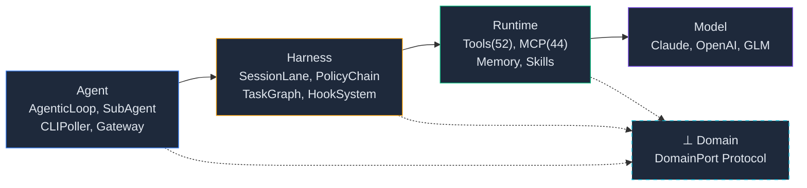
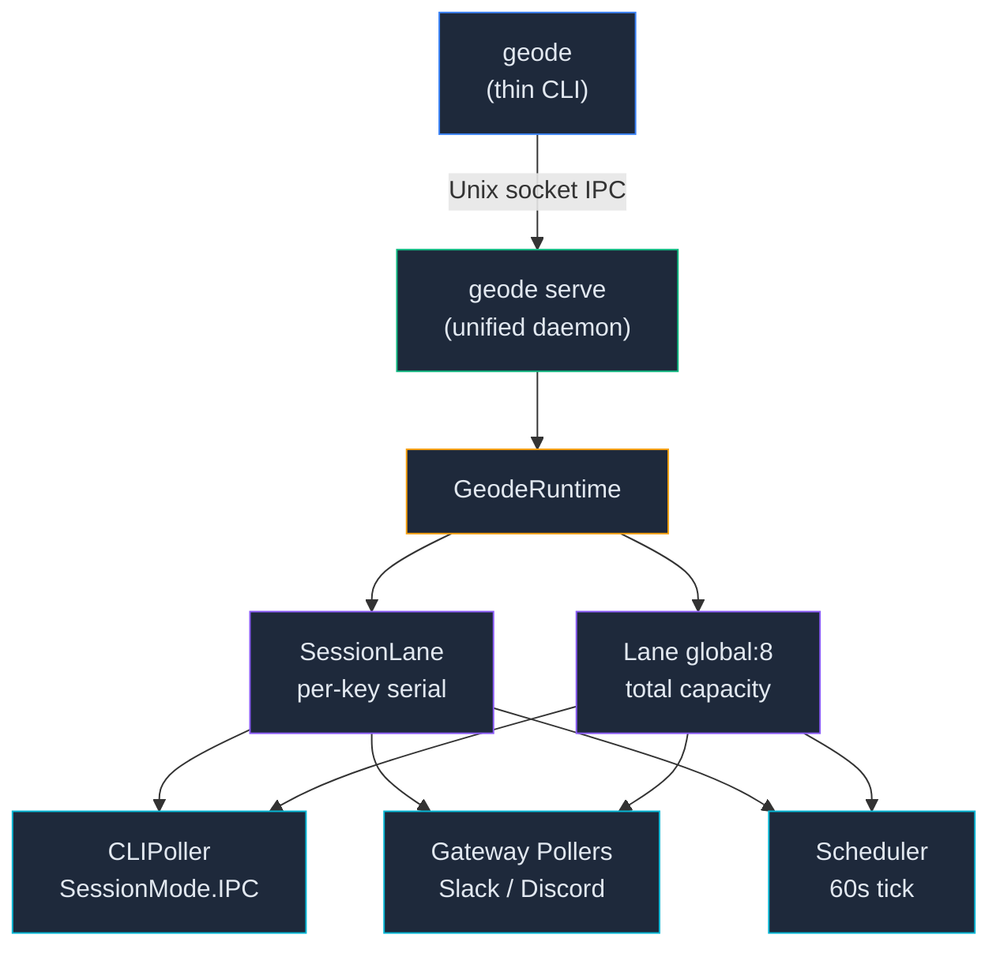

<p align="center">
  
</p>

<p align="center">
  
  
  
  <a href="https://github.com/mangowhoiscloud/geode/actions"></a>
</p>

<p align="center">
  
  
  
  
</p>

[한국어](README.ko.md)

# GEODE v0.46.0 — Long-running Autonomous Execution Harness

A general-purpose autonomous execution agent. Performs research, analysis, automation, and scheduling from a single natural-language command.

**Production**: Claude Code Scaffold (CLAUDE.md + development Skills + CI Hooks) builds GEODE.
**Execution**: GEODE (a `while(tool_use)` loop) autonomously selects from 56 tools + 44 MCP servers. 48 runtime Hooks control the lifecycle, and 5-Layer Verification validates all output.

## Quick Start

### Prerequisites

| Tool | Install | Check |
|------|---------|-------|
| **Python 3.12+** | [python.org/downloads](https://www.python.org/downloads/) | `python3 --version` |
| **Git** | [git-scm.com](https://git-scm.com/) | `git --version` |
| **uv** (Python package manager) | `curl -LsSf https://astral.sh/uv/install.sh \| sh` | `uv --version` |

### Step 1 — Clone and install

```bash
git clone https://github.com/mangowhoiscloud/geode.git
cd geode
uv sync          # installs all dependencies (takes ~30 seconds)
```

### Step 2 — Add your API key

```bash
mkdir -p ~/.geode
echo 'ANTHROPIC_API_KEY=sk-ant-your-key-here' > ~/.geode/.env
chmod 600 ~/.geode/.env
```

Get your key at [console.anthropic.com/settings/keys](https://console.anthropic.com/settings/keys) (free tier available).

> No API key? GEODE still works in **dry-run mode** — all pipeline features run with fixture data, no LLM calls.

### Step 3 — Run

```bash
uv run geode                                       # interactive CLI
uv run geode "summarize the latest AI research"     # one-shot prompt
uv run geode analyze "Cowboy Bebop" --dry-run       # Game IP analysis (no API key needed)
```

### Using an AI coding agent? Even easier.

If you're using **Claude Code**, **Codex**, or any agentic coding tool, just paste this:

```
Clone https://github.com/mangowhoiscloud/geode.git, run uv sync,
then run "uv run geode analyze Berserk --dry-run" to verify it works.
```

The agent reads CLAUDE.md, installs dependencies, and runs the verification — no manual steps needed.

### What you'll see

```
$ uv run geode "what can you do?"

● AgenticLoop
  ⠋ ✢ Thinking...
  ✓ show_help → ok (0.1s)

  I can help with research, analysis, automation, and scheduling.
  Use /help to see all available commands.

  ✢ Worked for 3s · claude-opus-4-6 · ↓1.2k ↑200 · $0.0065
```

### Optional — Install globally

```bash
uv tool install -e . --force
geode version    # now works from any directory
```

> See the [full Setup Guide](docs/setup.md) for Slack Gateway, multi-provider LLM, and advanced configuration.

---

## GEODE in Action

```
> Find job postings that match my profile
  AgenticLoop  glm-5 · in:8.2k out:185 · $0.006
  Found 3 matching job postings.
  - ML Engineer — LangGraph experience preferred
  - Agent Platform Lead — Python, autonomous execution
  - AI Infra — Kubernetes + LLM Ops
  3 rounds · 2 tools · ~4s
```

```
> Find and summarize the latest RAG papers on arXiv
  AgenticLoop  claude-opus-4-6 · in:12.4k out:890 · $0.084
  Summarized 5 papers.
  1. GraphRAG: Knowledge Graph + Retrieval (2026-03)
  2. Adaptive Chunking for Long-Context RAG (2026-02)
  ...
  5 rounds · 3 tools · ~12s
```

```
> Analyze the Berserk IP
  analyze_ip(ip_name="Berserk")
  analyze_ip -> S · 81.3 · conversion_failure
  Strong fandom and game suitability in the Dark Fantasy genre.
  High commercial potential if conversion optimization is prioritized.
  9 nodes · 8 LLM calls · ~45s
```

### Real-World Case — Legacy Migration (REODE)

| Metric | Value |
|--------|-------|
| Codebase | 5,523 files (241 Java + 355 JSP + 47 XML) |
| Migration | Java 1.8 → 22, Spring 4 → 6 |
| Result | 83/83 tests + FE/BE E2E verified |
| Cost | ~$388 (33 sessions, 1,133 LLM rounds) |
| Time | 5h 48m (autonomous, zero human intervention) |

> REODE — a sibling project sharing GEODE's `while(tool_use)` loop with a legacy migration domain plugin. Client feedback: *"exceeded expectations."*

---

## Highlights

| Feature | Description |
|---------|-------------|
| **`while(tool_use)` Loop** | Core primitive for all autonomous behavior. Sub-agents, plan execution, and batch analysis are all AgenticLoop instances |
| **56 Tools + MCP** | 56 native tools + 44 MCP catalog servers auto-installed. Bash execution (41 auto-approved, 9 blocked) |
| **Sub-Agent** | Full inheritance of parent capabilities, Lane("global") gating, depth guard, Token Guard |
| **Multi-Provider LLM** | Anthropic + OpenAI + ZhipuAI 3-provider failover chain |
| **4-Tier Memory** | SOUL --> User Profile --> Organization --> Project --> Session |
| **`.geode/` Context** | Project-local persistent store — journal, vault, rules, cache |
| **Domain Plugin** | Swap pipelines via `DomainPort` Protocol — Game IP analysis included by default |
| **Scaffold (Production)** | Claude Code + CLAUDE.md + development Skills + CI Hooks — the control structure that builds GEODE |
| **20 Runtime Skills** | `.geode/skills/` — inject domain-specific knowledge as prompts. Pipeline, scoring, verification, architecture patterns, etc. |
| **46 Runtime Hooks** | Pipeline/node/verification/memory/sub-agent lifecycle events — GEODE runtime control |
| **5-Layer Verification** | Guardrails G1-G4 + BiasBuster + Cross-LLM (Krippendorff alpha >= 0.67) + Confidence Gate + Rights Risk |
| **Safety** | 4-tier HITL (SAFE/STANDARD/WRITE/DANGEROUS), 9 blocked bash patterns, PolicyChain |

---

## Scaffold

There are two control layers.

**Scaffold (production system)**: Claude Code + CLAUDE.md + development Skills + CI Hooks. The external harness that produces GEODE's code and guarantees quality.

**GEODE Runtime (agent)**: `while(tool_use)` loop + 56 tools + 20 runtime Skills + 48 runtime Hooks + 5-Layer Verification. The internal system of the autonomously executing agent.

### Project Structure

```
geode/
├── core/                          # 195 modules, 4-Layer Stack
│   ├── agent/                     # Agent: AgenticLoop, ToolCallProcessor, SubAgentManager
│   ├── cli/                       # Agent: Commands, UI
│   ├── llm/                       # Model: Claude/OpenAI/GLM Adapters, Router, Prompts
│   ├── memory/                    # Runtime: 4-Tier Memory, Context Assembly, User Profile
│   ├── hooks/                     # HookSystem(48) — cross-cutting lifecycle events
│   ├── orchestration/             # Harness: TaskGraph, PlanMode, SessionLane, LaneQueue(global:8)
│   ├── tools/                     # Runtime: 56 Tool Definitions + Handlers
│   ├── skills/                    # Runtime: Skill Templates
│   ├── mcp/                       # Runtime: MCP Catalog(44) + Manager
│   ├── domains/game_ip/           # Domain: Game IP Domain Plugin (7 pipeline nodes)
│   ├── gateway/                   # Agent: Slack Gateway (geode serve)
│   ├── runtime_wiring/            # Runtime bootstrap modules (5-module split)
│   └── verification/              # Guardrails, BiasBuster, Cross-LLM
├── tests/                         # 3,525+ tests
├── docs/                          # Architecture, Workflow, Plans
│   ├── architecture/              # Hook system, orchestration decisions
│   ├── workflow.md                # CANNOT/CAN, GitFlow, Kanban
│   ├── setup.md                   # Installation, API keys, Slack
│   └── progress.md                # Kanban board (multi-agent shared)
├── .geode/                        # Project-local agent context
├── CLAUDE.md                      # Agent behavior rules (SOT)
└── pyproject.toml                 # uv package config
```

[Hook System -->](docs/architecture/hook-system.md)

### `.geode/` -- Agent Context Lifecycle

Every LLM call receives a 5-tier context hierarchy assembled from persistent stores.

```
Tier 0    SOUL            GEODE.md — agent identity + constraints
Tier 0.5  User Profile    ~/.geode/user_profile/ — role, expertise, language
Tier 1    Organization    MonoLake — cross-project data (DAU, revenue, signals)
Tier 2    Project         .geode/memory/PROJECT.md — analysis history (max 50, LRU)
Tier 3    Session         In-memory — conversation, tool results, plans
```

```
.geode/
├── config.toml         # Gateway, MCP servers, model
├── memory/             # T2: Project Memory (LRU rotate)
├── rules/              # Auto-generated domain rules
├── vault/              # Permanent artifacts (reports, research)
├── skills/             # 20 runtime skill prompt injections
└── result_cache/       # Pipeline LRU (SHA-256, 24h TTL)
```

Lower tiers override higher tiers. Budget: SOUL 10% | Org 25% | Project 25% | Session 40%.

[Context Lifecycle (full architecture) -->](docs/architecture/context-lifecycle.md)

### `core/` -- 4-Layer Stack (Model --> Runtime --> Harness --> Agent)



| Layer | Core | Entry Points |
|-------|------|--------------|
| **Agent** | AgenticLoop, SubAgentManager, CLIPoller, Gateway | `core/cli/`, `core/gateway/` |
| **Harness** | SessionLane, LaneQueue(global:8), PolicyChain, TaskGraph, HookSystem(48) | `core/orchestration/`, `core/hooks/` |
| **Runtime** | ToolRegistry(56), MCP Catalog(44), Skills, Memory(4-Tier) | `core/tools/`, `core/memory/` |
| **Model** | ClaudeAdapter, OpenAIAdapter, GLMAdapter (3-provider fallback) | `core/llm/` |
| | | |
| **⊥ Domain** | DomainPort Protocol, GameIPDomain (cross-cutting, binds to Runtime + Harness via Port) | `core/domains/` |

### GitFlow + Worktree

```
alloc --> own(.owner) --> execute(isolated) --> free(worktree remove)
```

```
feature/<task> --PR--> develop --PR--> main
```

**CI Ratchet -- 5-Job Gate**

All PRs must pass 5 CI jobs before merging. On failure, Claude Code automatically analyzes the cause, applies a fix, and retries.
Without human intervention, it loops until pytest, mypy, ruff, import-order, and test-count gates all pass.

Test count is monotonically increasing only (Ratchet). Deleting existing tests causes CI rejection.
This structure has allowed 634+ PRs to be merged with zero regressions.

```
while CI fails:
    Claude Code --> analyze failure --> fix --> push --> re-run CI
```

| Job | Role | On Failure |
|-----|------|------------|
| `pytest` | Run all 3,525+ tests | Auto-fix failing tests and retry |
| `mypy` | Strict mode type checking | Add type hints and retry |
| `ruff` | Lint + formatting | Apply auto-fix and retry |
| `import-order` | Import sorting verification | Apply isort and retry |
| `test-count` | Monotonic test count verification | Restore deleted tests or write replacements |

**3-Checkpoint**: (1) alloc (Backlog --> In Progress) --> (2) merge (PR --> Done, CI 5/5 required) --> (3) verify (cross-check previous state at next session start)

[Development Workflow (Scaffold) -->](docs/workflow.md)

### Kanban (`docs/progress.md`)

```
Backlog --> In Progress --> In Review --> Done
```

main-only edits. 3-Checkpoint required. TaskCreate <-> Kanban task_id 1:1 mapping.

[Kanban rules -->](docs/workflow.md#kanban-board-docsprogress.md)

---

<details>
<summary><strong>Architecture Overview</strong></summary>

4-Layer Stack (Model --> Runtime --> Harness --> Agent) + `while(tool_use)` Agentic Loop + Sub-Agent System + 4-Tier Memory.



Key components:
- **Thin-Only**: `geode` = thin CLI. serve mandatory (auto-start). All execution routes through IPC --> serve.
- **SessionLane**: per-session-key `Semaphore(1)`. Same key serializes, different keys run in parallel. `max_sessions=256`.
- **Agentic Loop**: Claude Opus 4.6 powered `while(tool_use)` loop. 1M context.
- **Tool Hierarchy**: Built-in(56) + MCP(44) + Bash. 4-tier safety (SAFE/STANDARD/WRITE/DANGEROUS).
- **Sub-Agent**: Full parent capability inheritance, Lane("global") gating, depth guard, Token Guard.
- **Memory**: SOUL --> User Profile --> Organization --> Project --> Session. ContextAssembler 280-char compression.
- **Domain Plugin**: Swap pipelines via `DomainPort` Protocol. Game IP included by default (LangGraph 9-node).

</details>

<details>
<summary><strong>Development Workflow (Scaffold)</strong></summary>

CANNOT (guardrails) comes before CAN (freedom). 7-step workflow + quality gates.

See the [Workflow](docs/workflow.md) document for full details.

**Quality Gates:**

| Gate | Command | Target |
|------|---------|--------|
| Lint | `uv run ruff check core/ tests/` | 0 errors |
| Type | `uv run mypy core/` | 0 errors |
| Test | `uv run pytest tests/ -q` | 3525+ pass |
| E2E | `uv run geode analyze "Cowboy Bebop" --dry-run` | A (68.4) |

</details>

<details>
<summary><strong>Why -- Motivation</strong></summary>

**Problem.** In 2026, AI coding agents have made remarkable progress. They read, write, fix, and test code autonomously. But how much of real work is actually coding? Research, document analysis, scheduling, notifications, data pipelines, multi-axis evaluation for decision-making -- the space requiring autonomous execution *beyond* coding is far broader.

**Insight.** Yet the core of all autonomous behavior is surprisingly simple. An LLM calls tools, observes results, and decides the next action -- a `while(tool_use)` loop. Claude Code, Codex, OpenClaw -- all frontier harnesses stand on this primitive.

**Origin.** GEODE began as a Nexon AI engineer assignment. A unidirectional LLM/ML-based DAG that reasons about whether a game IP is undervalued -- the assignment was accepted, but that pipeline was a *workflow*, not an agent.

**Pivot.** So the entire IP analysis pipeline was pushed behind a `DomainPort` Protocol as a plugin. On top of it, a general-purpose autonomous execution harness was built. An agent that performs research, analysis, automation, and scheduling through a single `while(tool_use)` loop. Domains are swappable plugins; the harness is domain-agnostic.

</details>

---

## License

Apache License 2.0 — [LICENSE](./LICENSE)
