<p align="center">
  
</p>

# GEODE v0.13.0 — 범용 자율 실행 에이전트

LangGraph 기반 범용 자율 실행 에이전트. 리서치, 분석, 자동화, 스케줄링을 자율적으로 수행합니다.

## Installation

```bash
uv sync
```

## Quick Start

```bash
# 인터랙티브 모드 (권장)
uv run geode

# IP 분석 (API 키 있으면 LLM 호출, 없으면 자동 dry-run)
uv run geode analyze "Berserk"

# Streaming 분석
uv run geode analyze "Berserk" --stream

# 배치 분석
uv run geode batch --top 5 --dry-run

# 리포트 생성
uv run geode report "Berserk" --format html --output berserk.html
```

### Setup

```bash
# 1. 환경 변수 설정
cp .env.example .env

# 2. .env 편집 — API 키 입력
ANTHROPIC_API_KEY=sk-ant-...

# 3. Full 분석 실행
uv run geode analyze "Cowboy Bebop"
```

API 키 없이 시작하면 자동으로 dry-run 모드로 전환됩니다:

```
  ✓ Dry-Run Analysis
  ✓ IP Search
  ✗ LLM Analysis (ANTHROPIC_API_KEY not set)

  API key not configured — dry-run mode only
```

## Features

| Feature | Description |
|---------|-------------|
| **Agentic Loop** | `while(tool_use)` 멀티 라운드 (max 15), multi-intent chaining, clarification, 적응형 오류 복구 |
| **Sub-Agent** | Full AgenticLoop 상속, 재귀 depth 제어 (max_depth=2), as_completed 결과 수집, Token Guard |
| **Goal Decomposition** | 복합 요청 → 하위 목표 DAG 자동 분해 (Haiku, ~$0.01/호출), 단순 요청 휴리스틱 패스스루 |
| **Grounding Truth** | tool_result 기반 출처 인용 강제, web_fetch/web_search 소스 태깅, 미확인 정보 생성 금지 |
| **HITL Safety** | 4-tier 분류 (SAFE/STANDARD/WRITE/DANGEROUS), MCP 서버별 세션 승인, auto_approve 예외 |
| **38+ Tools** | `definitions.json` 기반 + ToolRegistry 런타임 확장 + MCP 포함 60+ |
| **Skills + MCP** | `.claude/skills/` 자동 발견 + 29개 MCP 카탈로그 자연어 설치 + 도구 핫 리로드 |
| **Orchestration** | HookSystem (30 events), TaskGraph DAG, CoalescingQueue, LaneQueue, PlanMode |
| **Dynamic Graph** | 분석 결과 기반 노드 동적 건너뛰기/enrichment 분기, `ErrorRecoveryStrategy` 자동 복구 체인 |
| **Signal Liveification** | MCP 기반 라이브 시그널 수집 (Steam + Brave), fixture fallback, `signal_source` provenance |
| **Plan Auto-Execute** | 계획 생성→승인→실행 자동 수행, step 실패 시 재시도 + partial success 진행 |
| **NL Router** | 한국어/영어 자유 입력, Multi-turn (20 turns), Multi-intent, Fuzzy matching |
| **Domain Plugin** | `DomainPort` Protocol — 도메인별 analysts/evaluators/scoring 플러그인 (게임 IP: `GameIPDomain`) |
| **Observability** | LangSmith 토큰 추적 + 비용 계산, Claude Code 스타일 상태줄 |
| **Scheduler** | 자연어 스케줄링 ("매일 오전 9시 분석해줘" → AT/EVERY/CRON) |
| **2366+ Tests** | 134 modules, coverage ≥ 75%, pytest + ruff + mypy strict + bandit |

## Usage

### Interactive Mode

```bash
uv run geode
```

**슬래시 커맨드:**

| Command | Alias | Description |
|---------|-------|-------------|
| `/analyze <IP>` | `/a` | IP 분석 (API 키 유무에 따라 자동 모드 결정) |
| `/run <IP>` | `/r` | IP 분석 (동일) |
| `/search <query>` | `/s` | IP 검색 |
| `/report <IP> [fmt]` | `/rpt` | 리포트 생성 (md/html/json) |
| `/list` | | IP 목록 |
| `/generate [count]` | `/gen` | 합성 데모 데이터 생성 |
| `/model` | | LLM 모델 선택 |
| `/key [value]` | | API 키 설정 |
| `/auth` | | 인증 프로필 관리 |
| `/batch [--top N]` | `/b` | 배치 분석 |
| `/status` | | 시스템 상태 (모델, API 키, 메모리) |
| `/compare <A> <B>` | | 두 IP 비교 분석 (Interactive) |
| `/schedule <cron>` | `/sched` | 배치 스케줄 설정 |
| `/trigger <event>` | | 이벤트 트리거 (drift scan 등) |
| `/skills` | | 스킬 목록/상세/reload/add |
| `/mcp status` | | MCP 서버 상태 |
| `/mcp tools` | | MCP 도구 목록 |
| `/mcp reload` | | MCP 설정 재로딩 |
| `/mcp add <name> <cmd>` | | MCP 서버 동적 추가 |
| `/verbose` | | 상세 출력 토글 |
| `/help` | | 도움말 |
| `/quit` | `/q` | 종료 |

**자연어 입력:**

```
> Berserk 분석해           → LLM 분석 (API 키 있을 때) / dry-run (없을 때)
> 소울라이크 찾아줘         → 장르 검색
> Berserk vs Cowboy Bebop  → 비교 분석
> Berserk 리포트 생성해     → 리포트 생성
> 뭐가 있어?               → IP 목록
> 시스템 상태              → 상태 확인
> API 키 설정해            → API 키 설정
> LinkedIn MCP 달아줘      → MCP 자동설치
> 스케줄 걸어줘            → 배치 스케줄
```

### CLI Mode

```bash
# 분석
uv run geode analyze "Berserk"                    # CLI 분석
uv run geode "Berserk 분석해줘"                    # 자연어 분석 (동일)
uv run geode "Berserk 분석해줘" --stream           # 스트리밍 출력

# 검색·목록
uv run geode search "사이버펑크"                   # 장르 검색
uv run geode "소울라이크 게임 찾아줘"               # 자연어 검색
uv run geode list                                 # IP 목록

# 리포트
uv run geode report "Berserk"                     # Markdown 리포트
uv run geode report "Berserk" -f html -o out.html # HTML 파일 저장

# 배치
uv run geode batch --top 5                        # 상위 5개 배치 분석

# 범용 자연어 (인터랙티브 모드에서도 동일)
uv run geode "오늘 AI 뉴스 정리해줘"               # 웹 리서치
uv run geode "이 URL 요약해줘 https://..."         # URL 요약
```

---

## Architecture — Autonomous Core

### 6-Layer Architecture

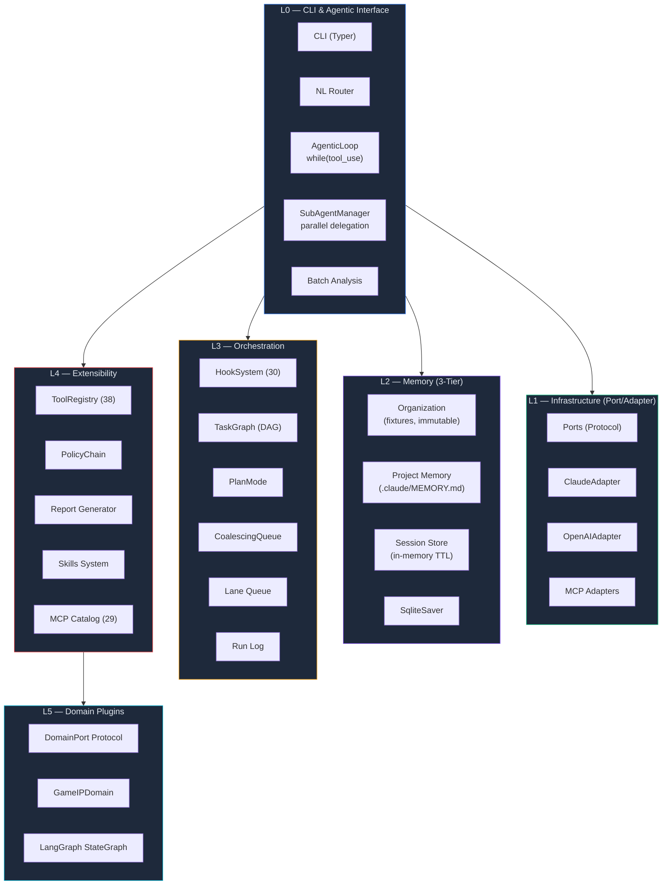

| Layer | 구성 요소 | 설명 |
|-------|----------|------|
| **L0** CLI & Agent | Typer CLI, NL Router, AgenticLoop, SubAgentManager, Batch | 사용자 인터페이스 + 자율 실행 코어 — 멀티라운드 tool use, 서브에이전트 병렬 위임 |
| **L1** Infra | Ports (Protocol), ClaudeAdapter, OpenAIAdapter, MCP Adapters | Port/Adapter DI — `contextvars` 주입, LLM 클라이언트 교체 가능 |
| **L2** Memory | Organization (fixture), Project (.claude/MEMORY.md), Session (TTL), SqliteSaver | 3-Tier 메모리 + LangGraph 체크포인트 영속화 |
| **L3** Orchestration | HookSystem (30 events), TaskGraph DAG, PlanMode, CoalescingQueue, LaneQueue, RunLog | 라이프사이클 이벤트, 중복 요청 제거, 동시성 제어 |
| **L4** Extensibility | ToolRegistry (38+), PolicyChain, Report Generator, Skills System, MCP Catalog (29) | 런타임 tool 확장, 노드별 접근 제어, 스킬 자동 주입, MCP 자동설치 |
| **L5** Domain Plugins | DomainPort Protocol, GameIPDomain, LangGraph StateGraph | 도메인별 파이프라인 플러그인 — analysts/evaluators/scoring 교체 가능 |

### Agentic Loop

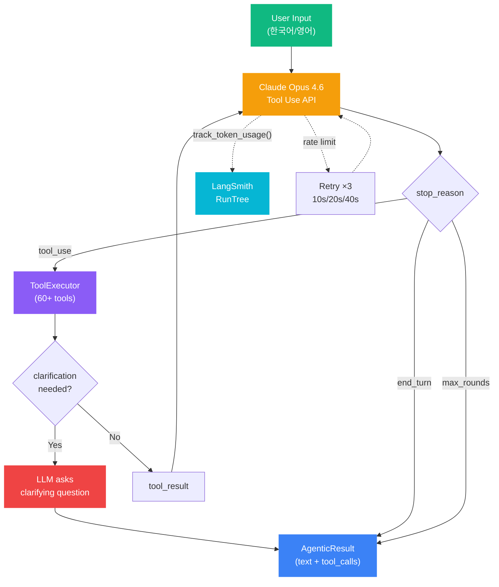

> **Note:** Retry 10s/20s/40s는 AgenticLoop 레벨의 rate limit 재시도입니다. 파이프라인 내부 LLM 호출(`core/llm/client.py`)은 별도의 1s/2s/4s exponential backoff를 사용합니다.

| 구성 요소 | 설명 |
|----------|------|
| **LLM Tool Use** | Claude Opus 4.6 `tool_use` API — base 38 + MCP 20+ tool 정의 전달, `stop_reason` 기반 루프 제어 |
| **ToolExecutor** | 3-tier safety: SAFE (7종, 무조건 실행) / STANDARD (일반) / DANGEROUS (bash, 사용자 승인 필수) |
| **Clarification** | 필수 파라미터 누락 시 `clarification_needed` 반환 → LLM이 사용자에게 되묻기 |
| **max_rounds** | 기본 15 라운드 (`DEFAULT_MAX_ROUNDS=15`) — 마지막 2라운드(`WRAP_UP_HEADROOM`)에서 텍스트 응답 강제 |
| **LangSmith** | `track_token_usage()` — 토큰 수/비용을 RunTree.extra.metrics에 기록, `LLMUsageAccumulator`로 세션 합산 |
| **Retry** | AgenticLoop: `2^attempt × 10`s (10/20/40s) — Pipeline: `min(1.0 × 2^attempt, 30.0)`s (1/2/4s) |

### Sub-Agent System

GEODE의 서브에이전트는 부모 AgenticLoop의 전체 역량(tools, MCP, skills, memory)을 상속받아 독립 컨텍스트에서 병렬 실행됩니다. 재귀 위임, 에러 분류, 토큰 가드를 통해 안전하고 효율적인 멀티태스킹을 지원합니다.

#### Architecture

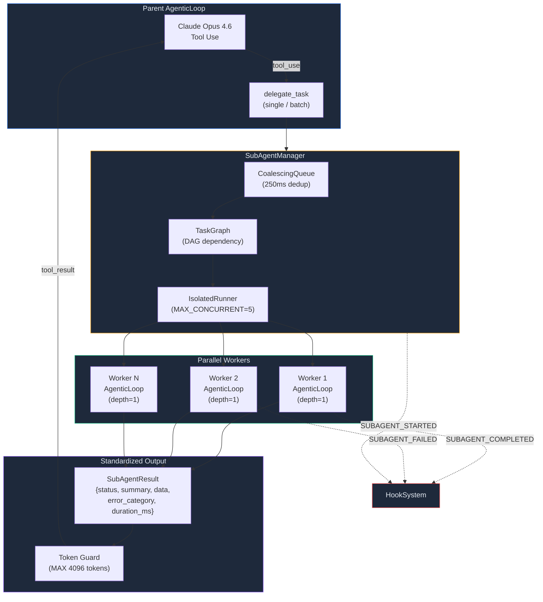

#### Delegation Flow

```
User: "병렬로 3개 IP 분석해: Berserk, Cowboy Bebop, Ghost in the Shell"

 1. REPL → AgenticLoop.run(user_input)
    └─ NL Router가 아닌 AgenticLoop이 직접 Claude Tool Use API 호출
 2. Claude Opus 4.6 → delegate_task tool call 결정 (batch mode)
    └─ LLM이 "병렬" 키워드 + 복수 IP를 인식하여 delegate_task 선택
 3. ToolExecutor.execute("delegate_task", {tasks: [...]})
    └─ HITL 게이트: delegate_task는 STANDARD — 승인 없이 통과
 4. SubAgentManager.delegate([task1, task2, task3])
    ├─ CoalescingQueue → 250ms 윈도우 내 중복 제거
    ├─ TaskGraph → DAG 초기화 (의존관계 없음 → 전부 병렬)
    └─ IsolatedRunner.run_async() × 3 → 최대 5개 워커 스레드 병렬
 5. 각 워커 스레드:
    ├─ ContextVar 전파 (memory, org)
    ├─ 독립 ConversationContext (max_turns=10)
    ├─ 부모 tools/MCP/skills 상속한 ToolExecutor (auto_approve=True)
    │   └─ 단, DANGEROUS(bash)/WRITE(memory_save 등)는 항상 사용자 승인 필수
    ├─ 독립 AgenticLoop.run("분석: Berserk\nParameters: {ip_name: Berserk}")
    │   └─ 자식 Claude가 analyze_ip("Berserk") 호출 → 파이프라인 실행
    └─ SubAgentResult 반환 (summary[:500] 필수 보존)
 6. SubAgentManager._wait_for_result() × 3 (polling, 120s timeout)
 7. Token Guard → 4096 토큰 초과 시 summary만 보존하여 부모 컨텍스트 보호
 8. Hook: SUBAGENT_STARTED(×3) / SUBAGENT_COMPLETED 또는 FAILED(×3)
 9. 부모 AgenticLoop으로 통합 결과 반환 → Claude가 3개 결과 종합 응답
```

#### Core Components

| 구성 요소 | 설명 |
|----------|------|
| **SubAgentManager** | 병렬 위임 오케스트레이터. 부모의 `action_handlers`, `mcp_manager`, `skill_registry`를 자식에게 전달. 재귀 depth 제어 (max_depth=2, max_total=15) |
| **SubTask** | 입력 스펙 — `task_id`, `description`, `task_type` (analyze/search/compare), `args`, 선택적 `agent` 오버라이드 |
| **SubAgentResult** | 표준 출력 스키마 — `status` (ok/error/timeout/partial), 필수 `summary` 필드, `error_category`, `duration_ms`, `token_usage`, `children_count` |
| **IsolatedRunner** | 스레드 풀 기반 격리 실행. `MAX_CONCURRENT=5` 동시 워커 제한. 타임아웃 + 에러 격리 |
| **CoalescingQueue** | 250ms 윈도우 내 동일 task_id 중복 요청 병합. dedup key 기반 |
| **TaskGraph** | DAG 기반 실행 순서 결정. 순환 감지, 완료 상태 추적, 실패 전파 (`propagate_failure`) |
| **AgentRegistry** | 에이전트 컨텍스트 해석기. 3개 기본 에이전트 (anime_expert, game_analyst, market_researcher) |

#### Recursion & Safety

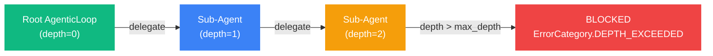

| 제어 | 값 | 설명 |
|------|-----|------|
| **max_depth** | 2 | 재귀 위임 최대 깊이. Root=0 → depth 2까지 허용, depth 3+ 차단 |
| **max_total** | 15 | 세션당 최대 서브에이전트 수 |
| **MAX_CONCURRENT** | 5 | 동시 병렬 워커 수 (asyncio.Semaphore) |
| **timeout_s** | 120s (delegate) / 300s (build) | 개별 태스크 타임아웃 |
| **auto_approve** | True | 서브에이전트는 HITL 승인 생략 (DANGEROUS 제외) |
| **Token Guard** | 4096 tokens | tool_result 크기 제한. 초과 시 `summary` + 경량 필드만 보존 |

#### Error Classification

서브에이전트 실패 시 자동으로 에러를 분류하여 재시도 가능 여부를 판단합니다:

| ErrorCategory | 조건 | Retryable |
|---------------|------|-----------|
| `TIMEOUT` | "timeout", "timed out" | Yes |
| `API_ERROR` | "api", "rate limit", "authentication" | Yes |
| `VALIDATION` | "validation", "required", "invalid" | No |
| `RESOURCE` | "memory", "disk", "resource" | No |
| `DEPTH_EXCEEDED` | "depth" | No |
| `UNKNOWN` | 기타 | No |

#### Parent-Child Tracking

```python
SubagentRunRecord(
    run_id="a1b2c3d4e5f6",        # UUID[:12]
    task_id="delegate_17..._0",
    child_session_key="ip:berserk:analyze",
    parent_session_key="root",
    task_type="analyze",
    started_at=1710...,
    completed_at=1710...,
    outcome="ok"                   # pending | ok | error
)
```

> OpenClaw Spawn+Announce 패턴 기반. `get_run_records()`로 부모-자식 관계 조회 가능. LangSmith 트레이스와 연동하여 전체 실행 흐름 추적.

### Tool & MCP Architecture

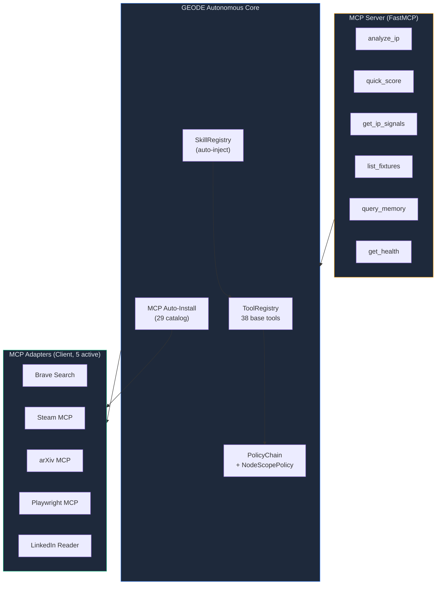

**MCP Adapters (Client, 5 active)** — 외부 데이터 소스 연결:

| Adapter | 패키지 | 용도 |
|---------|--------|------|
| **Brave Search** | `@brave/brave-search-mcp-server` | 웹 검색 기반 시그널 수집 (`BRAVE_API_KEY` 필요) |
| **Steam** | `steam-mcp-server` | Steam API 게임 데이터 (가격, 리뷰, 태그, 동접) |
| **arXiv** | `@fre4x/arxiv` | 학술 논문 검색/조회 (게임 연구 시그널) |
| **Playwright** | `@playwright/mcp` | 브라우저 자동화 (웹 크롤링, 스크린샷) |
| **LinkedIn Reader** | `linkedin-scraper-mcp` | LinkedIn 프로필/채용 정보 검색 (Patchright 브라우저, 인증 필요) |

> `MCPServerManager`는 env var가 빈 문자열이면 연결 시도 없이 graceful skip.

**MCP Server (FastMCP)** — GEODE를 외부 에이전트에서 호출:

```bash
uv run python -m core.mcp_server
```

| Tool | 설명 |
|------|------|
| `analyze_ip` | IP 전체 분석 실행 |
| `quick_score` | 빠른 점수 산출 (scoring only) |
| `get_ip_signals` | 외부 시그널 데이터 조회 |
| `list_fixtures` | 사용 가능한 IP fixture 목록 |
| `query_memory` | 프로젝트 메모리 검색 |
| `get_health` | 시스템 상태 점검 |

**Resources**: `geode://fixtures` (IP 목록), `geode://soul` (시스템 영혼 프롬프트)

### LangSmith Observability

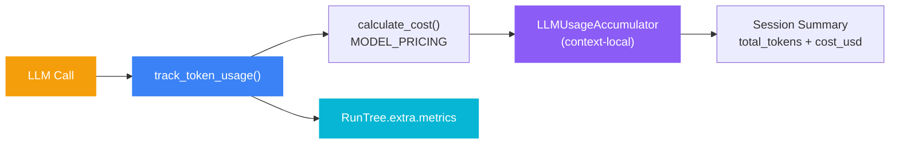

| 항목 | 설명 |
|------|------|
| **track_token_usage()** | 각 LLM 호출 후 input/output 토큰 수 + cache hit 기록 |
| **calculate_cost()** | `MODEL_PRICING` dict 기반 비용 산출 (input/output/cache 단가 × 토큰) |
| **LLMUsageAccumulator** | `contextvars` 기반 — 세션 내 전체 토큰/비용 누적, context-local 격리 |
| **RunTree.extra.metrics** | LangSmith 트레이스에 토큰 수/비용 메타데이터 첨부 |
| **조건부 활성화** | `LANGCHAIN_TRACING_V2=true` + `LANGCHAIN_API_KEY` 설정 시만 tracing 활성 |

### CLI Input & Terminal Management

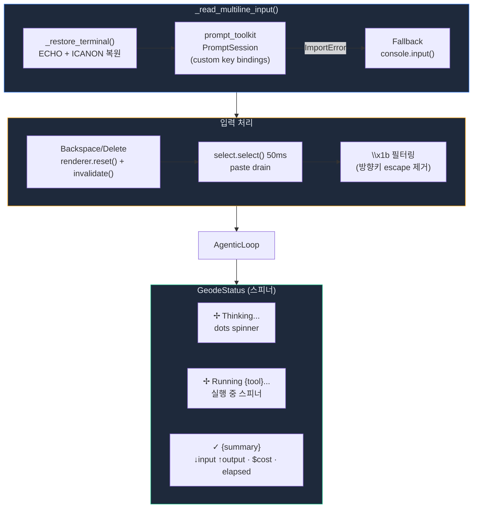

| 구성 요소 | 설명 |
|----------|------|
| **`_restore_terminal()`** | Rich Status/Live 후 손상된 termios 상태 복원. `ECHO` + `ICANON` 플래그를 `TCSANOW`로 즉시 적용 |
| **`PromptSession`** | `~/.geode_history` 파일 기반 히스토리. Arrow-up/down으로 이전 명령 탐색, Ctrl+R 역방향 검색. Backspace/Delete 커스텀 키 바인딩 |
| **Backspace/Delete 키 바인딩** | `renderer.reset()` + `invalidate()` 강제 redraw — 와이드 문자(한글) 백스페이스 시 디스플레이 잔상 해소 |
| **Paste drain** | `select.select()` 50ms timeout으로 붙여넣기 버퍼 수집. `\x1b` 포함 라인(방향키 escape) 필터링 |
| **GeodeStatus** | `contextmanager`로 LLM 호출 구간 측정. 진입 시 `_UsageSnapshot` 캡처, 종료 시 delta 계산 |
| **OperationLogger** | 처음 5개 tool call은 `▸/✓/✗` 마커로 개별 렌더링. 5개 초과 시 `+{n} more tool uses` 접기 |
| **Session Summary** | REPL 종료 시 누적 비용 렌더링: `Calls: N · Tokens: ↓Xk ↑Yk · Total: $Z.ZZZZ` (모델별 분리) |

### Additional Architecture Details

<details>
<summary>Prompt Caching / Checkpoint / Dynamic Tools / Pipeline Flexibility</summary>

**Prompt Caching**: Anthropic `cache_control: {"type": "ephemeral"}` 적용. 시스템 프롬프트와 루브릭 데이터를 캐시하여 반복 호출 시 40-60% 비용 절감. `ClaudeAdapter`에서 자동 적용.

**Checkpoint**: `SqliteSaver` (LangGraph 내장)로 파이프라인 상태 영속화. 각 노드 실행 후 자동 체크포인트. 장애 시 마지막 체크포인트부터 재개. `GEODE_CHECKPOINT_DB` 환경변수로 DB 경로 지정.

**Dynamic Tools (ToolRegistry)**:

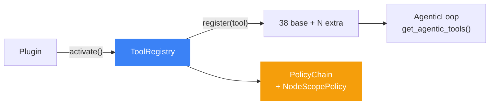

**Pipeline Flexibility (C2-C5)**:

| 항목 | 방식 |
|------|------|
| **Analyst 타입** | `evaluator_axes.yaml` → `ANALYST_TYPES = list(ANALYST_SPECIFIC.keys())` — YAML에 키 추가만으로 analyst 확장 |
| **중간 개입** | `GEODE_INTERRUPT_NODES=verification,scoring` → 해당 노드 전에 파이프라인 일시 중단 |
| **동적 Tool** | `ToolRegistry` + `get_agentic_tools()` — 플러그인 런타임 등록 |
| **MCP 자동설치** | `install_mcp_server` tool → 29개 카탈로그 검색 + 설치 + `refresh_tools()` 핫 리로드 |

</details>

<details>
<summary>Tool 목록 (38종)</summary>

| # | Tool | 용도 | Safety |
|---|------|------|--------|
| 1 | `list_ips` | IP 목록 조회 | SAFE |
| 2 | `analyze_ip` | IP 분석 실행 | STANDARD |
| 3 | `search_ips` | IP 검색 | SAFE |
| 4 | `compare_ips` | 두 IP 비교 (clarification) | STANDARD |
| 5 | `show_help` | 도움말 표시 | SAFE |
| 6 | `generate_report` | 리포트 생성 (clarification) | STANDARD |
| 7 | `batch_analyze` | 배치 분석 | STANDARD |
| 8 | `check_status` | 시스템 상태 | SAFE |
| 9 | `switch_model` | LLM 모델 전환 | SAFE |
| 10 | `memory_search` | 메모리 검색 | SAFE |
| 11 | `memory_save` | 메모리 저장 | STANDARD |
| 12 | `manage_rule` | 룰 관리 | SAFE |
| 13 | `set_api_key` | API 키 설정 | STANDARD |
| 14 | `manage_auth` | 인증 프로필 관리 | STANDARD |
| 15 | `generate_data` | 합성 데이터 생성 | STANDARD |
| 16 | `schedule_job` | 스케줄 관리 (NL 생성/삭제/상태) | STANDARD |
| 17 | `trigger_event` | 이벤트 트리거 | STANDARD |
| 18 | `run_bash` | 셸 명령 실행 | DANGEROUS |
| 19 | `delegate_task` | 서브에이전트 위임 | STANDARD |
| 20 | `create_plan` | 분석 계획 생성 | STANDARD |
| 21 | `approve_plan` | 계획 승인/실행 | STANDARD |
| 22 | `youtube_search` | YouTube 시그널 | STANDARD |
| 23 | `reddit_sentiment` | Reddit 감성 분석 | STANDARD |
| 24 | `steam_info` | Steam 게임 정보 | STANDARD |
| 25 | `google_trends` | Google 트렌드 | STANDARD |
| 26 | `web_fetch` | URL 콘텐츠 수집 | SAFE |
| 27 | `general_web_search` | 웹 검색 | SAFE |
| 28 | `read_document` | 로컬 파일 읽기 | SAFE |
| 29 | `note_save` | 사용자 메모 저장 | STANDARD |
| 30 | `note_read` | 저장된 메모 조회 | SAFE |
| 31 | `reject_plan` | 계획 거부 | STANDARD |
| 32 | `modify_plan` | 계획 수정 | STANDARD |
| 33 | `list_plans` | 계획 목록 조회 | SAFE |
| 34 | `rate_result` | 분석 결과 평가 | STANDARD |
| 35 | `accept_result` | 결과 수락 | STANDARD |
| 36 | `reject_result` | 결과 거부 | STANDARD |
| 37 | `rerun_node` | 파이프라인 노드 재실행 | STANDARD |
| 38 | `install_mcp_server` | MCP 서버 자동설치 | STANDARD |

</details>

<details>
<summary>HITL Bash 차단 패턴 (9종)</summary>

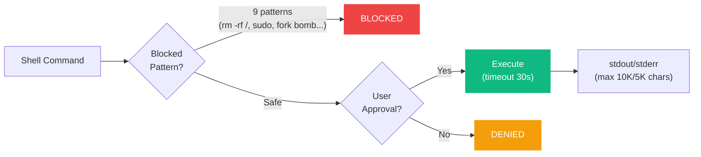

| # | 패턴 | 위험 |
|---|------|------|
| 1 | `rm -rf /` | 루트 파일시스템 삭제 |
| 2 | `sudo` | 권한 상승 |
| 3 | `> /etc/` | 시스템 설정 덮어쓰기 |
| 4 | `curl \| sh` | 원격 코드 실행 |
| 5 | `wget \| sh` | 원격 코드 실행 |
| 6 | `mkfs.` | 디스크 포맷 |
| 7 | `dd if=... of=/dev/` | 디스크 직접 쓰기 |
| 8 | `chmod -R 777 /` | 전역 권한 개방 |
| 9 | Fork bomb `:(){ :\|:& };:` | 시스템 리소스 고갈 |

**실행 제약**: timeout 30초, stdout 최대 10K / stderr 최대 5K chars 제한.

</details>

<details>
<summary>Multi-turn Context</summary>

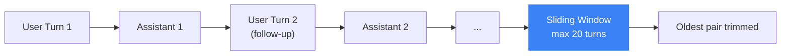

> `ConversationContext` — 슬라이딩 윈도우 (max 20 turns). 대명사 해석("그거 다시 분석해")과 follow-up 쿼리 지원. 각 턴은 user/assistant/tool_result 메시지 포함.

</details>

---

## Domain Plugin: Game IP Pipeline

> GEODE는 `DomainPort` Protocol을 통해 도메인별 분석 파이프라인을 플러그인으로 교체할 수 있습니다. 아래는 기본 탑재된 **Game IP** 도메인 플러그인의 상세 구조입니다. 4 Analysts → 3 Evaluators → PSM Scoring → Verification 파이프라인으로 저평가 IP를 발굴합니다.

### Pipeline Flow

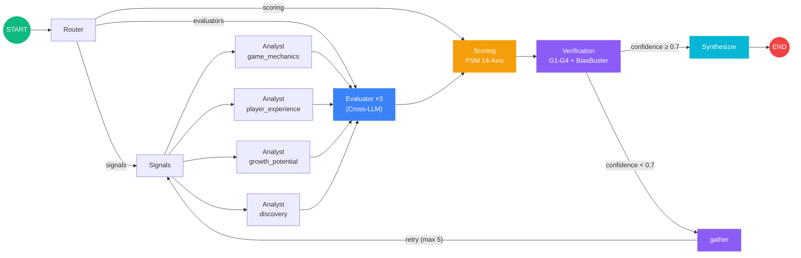

| Node | 역할 | 입출력 |
|------|------|--------|
| **Router** | 파이프라인 모드 결정 (6종), fixture 로딩, 메모리 조합 | `→ pipeline_mode`, `signals`/`evaluators`/`scoring` 라우팅 |
| **Signals** | 외부 시그널 데이터 fixture 주입 | `→ external_signals` |
| **Analyst ×4** | Send API 병렬 실행 — `game_mechanics`, `player_experience`, `growth_potential`, `discovery` | `→ analyses[]` (Clean Context: `analyses` 필드 제외) |
| **Evaluator ×3** | 14-Axis 루브릭 평가 — `quality_judge` (8축), `hidden_value` (3축), `community_momentum` (3축) | `→ evaluations[]` (Typed Pydantic Output) |
| **Scoring** | PSM 6-Weighted Composite + Confidence Multiplier → Tier S/A/B/C | `→ final_score`, `tier`, `cause` |
| **Verification** | Guardrails G1-G4 + BiasBuster (6 bias) + Confidence Gate | `→ confidence ≥ 0.7` 통과 or loopback |
| **Gather** | 재분석 상태 수집 (confidence < 0.7, max 5 iterations) | `→ signals` loopback |
| **Synthesizer** | Decision Tree 분류 + 내러티브 생성 | `→ recommendation`, `narrative` |

### Cross-LLM Ensemble

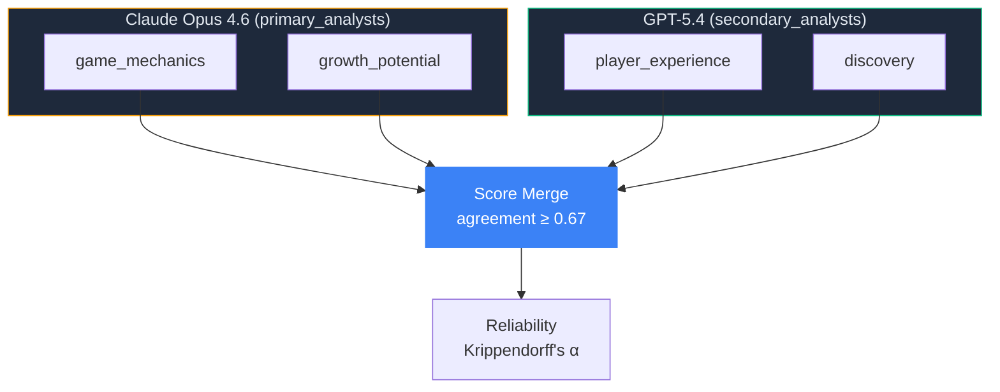

> `ensemble_mode=cross` 시 `primary_analysts`/`secondary_analysts` 설정으로 모델 분배 결정. `primary_only` 모드에서는 모든 analyst가 Claude 사용.

| 항목 | 값 |
|------|-----|
| **Primary model** | Claude Opus 4.6 (`ClaudeAdapter`) |
| **Secondary model** | GPT-5.4 (`OpenAIAdapter`) |
| **Primary analysts** | `game_mechanics`, `growth_potential` (설정: `GEODE_PRIMARY_ANALYSTS`) |
| **Secondary analysts** | `player_experience`, `discovery` (설정: `GEODE_SECONDARY_ANALYSTS`) |
| **합의 임계값** | `agreement ≥ 0.67` (`GEODE_AGREEMENT_THRESHOLD`) |
| **신뢰도 지표** | Krippendorff's α (순서형 데이터 기반 평가자 간 일치도) |
| **모드 전환** | `GEODE_ENSEMBLE_MODE`: `cross` (듀얼) / `primary_only` (Claude 단독) |

### 14-Axis Rubric (PSM Engine)

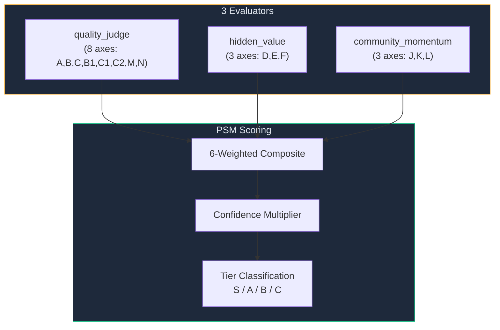

> 각 축은 1-5점 한국어 루브릭 앵커 사용. `evaluator_axes.yaml`에서 SSOT 관리. Prospect IP용 9-axis 확장 루브릭도 지원.

**Evaluator별 축 배분:**

| Evaluator | 축 | 평가 영역 |
|-----------|-----|----------|
| `quality_judge` | A (Narrative Depth), B (Visual Adaptation), C (Gameplay Potential), B1 (Character Appeal), C1 (World Building), C2 (Lore Consistency), M (Market Fit), N (Innovation Score) | 품질 8축 |
| `hidden_value` | D (Discovery Gap), E (Exploitation Gap), F (Fandom Resilience) | 숨겨진 가치 3축 |
| `community_momentum` | J (Community Activity), K (Content Creation), L (Cross-media Traction) | 커뮤니티 모멘텀 3축 |

**Scoring Formula**: `Final = (0.25×PSM + 0.20×Quality + 0.18×Recovery + 0.12×Growth + 0.20×Momentum + 0.05×Dev) × (0.7 + 0.3 × Confidence/100)`

**Tier 기준**: S ≥ 80, A ≥ 60, B ≥ 40, C < 40

### Verification & Feedback Loop

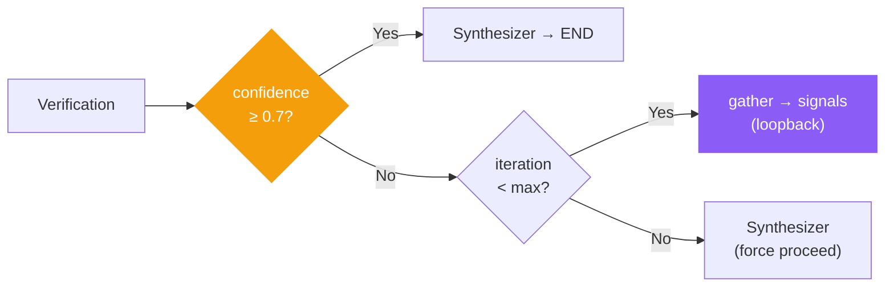

> Confidence < 0.7이면 `gather` 노드가 상태를 수집하고 `signals`로 loopback. `GEODE_MAX_ITERATIONS` (기본 5)회까지 재시도 후 강제 진행.

| 항목 | 값 |
|------|-----|
| **Confidence 임계값** | 0.7 (`GEODE_CONFIDENCE_THRESHOLD`) |
| **최대 반복** | 5회 (`GEODE_MAX_ITERATIONS`) |
| **Loopback 경로** | `verification → gather → signals → analyst → evaluator → scoring → verification` |
| **강제 진행** | 최대 반복 도달 시 현재 점수로 Synthesizer 진행 |
| **Confidence Multiplier** | `final = base × (0.7 + 0.3 × confidence/100)` — 신뢰도에 따라 최종 점수 30% 범위 내 조정 |

### BiasBuster Fast Path

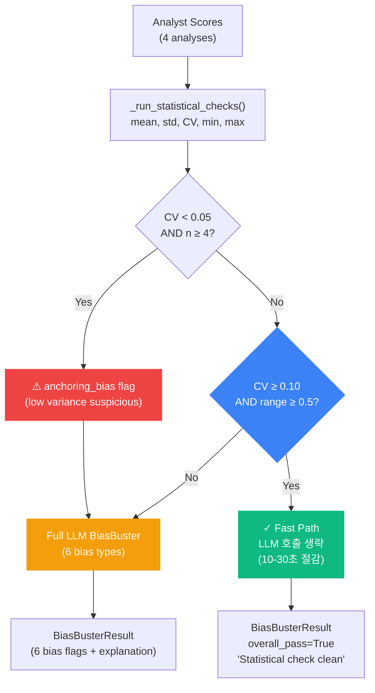

| 조건 | 의미 | 결과 |
|------|------|------|
| **CV < 0.05 AND n ≥ 4** | 점수 분산이 의심스럽게 낮음 (동조 패턴) | `anchoring_bias` 플래그 → LLM 호출 |
| **CV ≥ 0.10 AND range ≥ 0.5** | 건강한 분산 (1-5점 스케일에서 충분한 스프레드) | Fast path → LLM 생략, `overall_pass=True` |
| **그 외** | 경계 영역 (0.05 ≤ CV < 0.10 또는 range < 0.5) | Full LLM 6-bias 탐지 실행 |

### External IP Signal Fallback

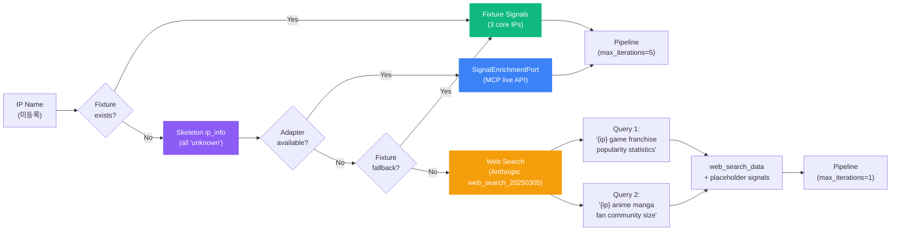

| 단계 | 소스 | 설명 |
|------|------|------|
| **Stage 1** | `SignalEnrichmentPort` 어댑터 | MCP Steam/Brave 등 라이브 API로 시그널 수집. `adapter.is_available()` 체크 후 호출 |
| **Stage 2** | Fixture fallback | 3개 core IP (Berserk, Cowboy Bebop, Ghost in the Shell) JSON fixture 직접 로딩 |
| **Stage 3** | Web Search | Anthropic `web_search_20250305` 도구로 2개 쿼리 실행, 결과를 `web_search_data` 키에 raw text로 전달 |

- **외부 IP 스켈레톤**: `media_type="unknown"`, `genre="unknown"` 등 기본값으로 `ip_info` 생성. Analysts가 `web_search_data` 텍스트에서 맥락을 추출
- **`max_iterations=1`**: 외부 IP는 동일 웹 검색 데이터로 재분석해도 confidence 개선 불가하므로 feedback loop 1회로 제한
- **placeholder signals**: `youtube_views=0`, `reddit_subscribers=0` 등 downstream 스키마 호환을 위한 기본 수치. `_enrichment_source="web_search"` 마커로 출처 구분

### Available IPs

**Core Fixtures** (hand-crafted, golden set):

| IP | Tier | Score | Genre |
|----|------|-------|-------|
| Berserk | S | 81.3 | Dark Fantasy |
| Cowboy Bebop | A | 68.4 | SF Noir |
| Ghost in the Shell | B | 51.6 | Cyberpunk |

**Steam Fixtures**: 201개 추가 게임 데이터 (`core/fixtures/steam/`), `/generate` 명령으로 합성 데이터 생성 가능.

---

## Configuration

`.env` 파일로 설정합니다 (전체 목록: `core/config.py`):

| Variable | Default | Description |
|----------|---------|-------------|
| **LLM** | | |
| `ANTHROPIC_API_KEY` | | Claude API 키 |
| `OPENAI_API_KEY` | | GPT API 키 (Cross-LLM) |
| `GEODE_MODEL` | `claude-opus-4-6` | 기본 LLM 모델 |
| `GEODE_ENSEMBLE_MODE` | `primary_only` | 앙상블 모드 (`primary_only` / `cross`) |
| `GEODE_ROUTER_MODEL` | `claude-opus-4-6` | NL Router 모델 |
| `GEODE_AGREEMENT_THRESHOLD` | `0.67` | Cross-LLM 합의 임계값 |
| **Pipeline** | | |
| `GEODE_CONFIDENCE_THRESHOLD` | `0.7` | 신뢰도 게이트 (미달 시 재분석) |
| `GEODE_MAX_ITERATIONS` | `5` | 최대 재분석 반복 횟수 |
| `GEODE_INTERRUPT_NODES` | | 중간 개입 노드 (쉼표 구분, e.g. `verification,scoring`) |
| `GEODE_CHECKPOINT_DB` | `geode_checkpoints.db` | Checkpoint DB 경로 |
| **MCP** | | |
| `GEODE_STEAM_MCP_URL` | | Steam MCP 서버 URL |
| `GEODE_BRAVE_MCP_URL` | | Brave Search MCP 서버 URL |
| `GEODE_BRAVE_API_KEY` | | Brave Search API 키 |
| **Observability** | | |
| `LANGCHAIN_TRACING_V2` | `false` | LangSmith tracing 활성화 |
| `LANGCHAIN_API_KEY` | | LangSmith API 키 |
| `LANGCHAIN_PROJECT` | `geode` | LangSmith 프로젝트명 |
| **General** | | |
| `GEODE_VERBOSE` | `false` | 상세 출력 |

## Testing

```bash
# 전체 테스트
uv run pytest

# Live E2E (실제 LLM 호출)
uv run pytest tests/test_e2e_live_llm.py -v -m live

# 품질 검사
uv run ruff check core/ tests/
uv run mypy core/
uv run bandit -r core/ -c pyproject.toml
```

## Project Structure

```
core/
├── cli/                        # CLI + NL Router + Agentic Loop + Sub-Agent
│   ├── __init__.py             # Typer app, REPL, pipeline execution
│   ├── agentic_loop.py         # while(tool_use) multi-round execution + Token Guard
│   ├── bash_tool.py            # Shell execution + HITL safety gate
│   ├── batch.py                # Batch analysis (ThreadPoolExecutor)
│   ├── commands.py             # Slash command dispatch (17 commands)
│   ├── conversation.py         # Multi-turn sliding-window context
│   ├── error_recovery.py       # ErrorRecoveryStrategy (retry → alternative → fallback → escalate)
│   ├── nl_router.py            # Natural language intent classification
│   ├── search.py               # IP search engine (synonym expansion)
│   ├── startup.py              # Readiness check, Graceful Degradation
│   ├── sub_agent.py            # SubAgentManager + SubAgentResult + ErrorCategory
│   └── tool_executor.py        # Tool dispatch + HITL approval gate
├── auth/                       # Auth profile management + rotation
├── automation/                 # Feedback loop, drift detection, triggers
├── config/                     # Externalized domain config (YAML)
│   ├── evaluator_axes.yaml     # 14-Axis rubric definitions + anchors
│   └── cause_actions.yaml      # Cause→Action mappings
├── config.py                   # Settings (pydantic-settings, 30+ vars)
├── data/                       # Synthetic data generation
├── domains/                    # Domain plugin adapters (GameIPDomain)
├── extensibility/              # Report generation + Skills + templates
│   ├── skills.py               # SkillLoader + SkillRegistry + SkillDefinition
│   ├── _frontmatter.py         # Shared YAML frontmatter parser
│   ├── agents.py               # SubagentLoader + AgentRegistry (3 defaults)
│   └── templates/              # HTML/Markdown report templates
├── fixtures/                   # Fixture data (3 core IPs + 201 Steam)
├── graph.py                    # LangGraph StateGraph definition
├── infrastructure/
│   ├── ports/                  # LLMClientPort, SignalEnrichmentPort, DomainPort
│   └── adapters/
│       ├── llm/                # ClaudeAdapter, OpenAIAdapter
│       └── mcp/                # Steam, Brave, LinkedIn MCP adapters + CompositeSignalAdapter + catalog (29 entries)
├── llm/                        # LLM client (prompt caching, streaming)
│   ├── client.py               # Anthropic wrapper + token tracking + cost
│   ├── token_tracker.py        # TokenTracker singleton (model pricing)
│   └── prompts/                # Prompt templates (.md) + axes config
├── mcp_server.py               # FastMCP server (6 tools, 2 resources)
├── memory/                     # 3-Tier memory system
├── nodes/                      # Pipeline nodes (8: router, signals, analyst, evaluator, scoring, verification, gather, synthesizer)
├── orchestration/
│   ├── hooks.py                # HookSystem (30 events + async atrigger)
│   ├── goal_decomposer.py     # GoalDecomposer (compound request → sub-goal DAG)
│   ├── hook_discovery.py       # Plugin-based hook loading
│   ├── isolated_execution.py   # IsolatedRunner (MAX_CONCURRENT=5, thread pool)
│   ├── task_system.py          # TaskGraph DAG (dependency, cycle detection)
│   ├── coalescing.py           # CoalescingQueue (250ms dedup window)
│   ├── plan_mode.py            # DRAFT → APPROVED → EXECUTING workflow
│   ├── lane_queue.py           # Concurrency control lanes
│   ├── run_log.py              # Structured execution logging
│   └── ...                     # planner, bootstrap, stuck_detection, etc.
├── runtime.py                  # GeodeRuntime (production wiring)
├── state.py                    # GeodeState (TypedDict + Pydantic models)
├── tools/                      # Tool Protocol + Registry + Policy
├── ui/                         # Rich console + Claude Code-style agentic UI
└── verification/               # Guardrails + BiasBuster + Rights Risk
```

## License

Internal use only.
