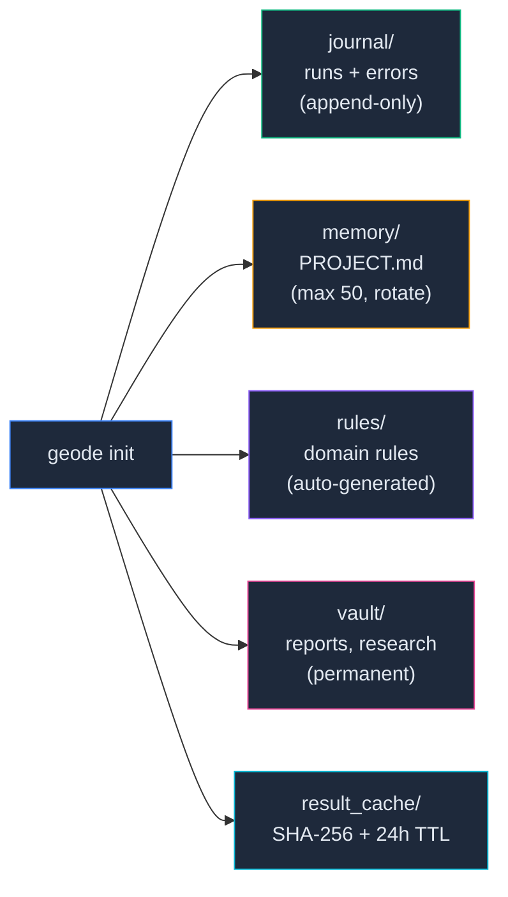
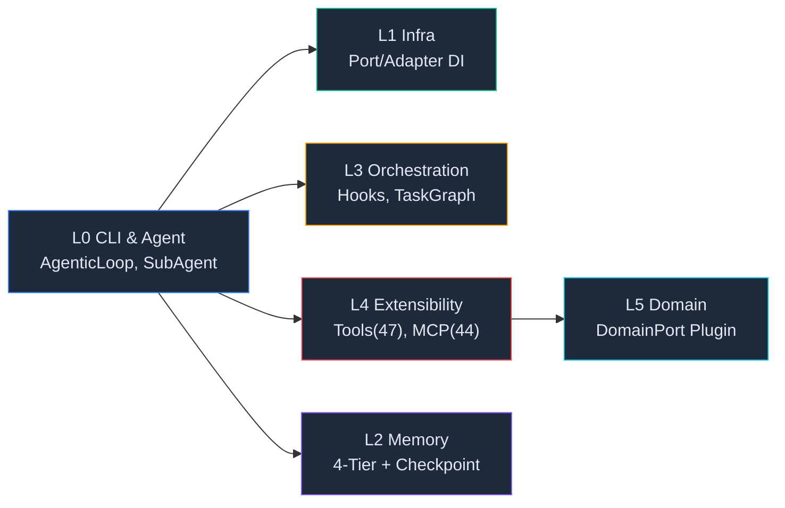

<p align="center">
  
</p>

<p align="center">
  
  
  
  
  <a href="https://github.com/mangowhoiscloud/geode/actions"></a>
</p>

# GEODE v0.28.1 — Autonomous Execution Harness

자연어 한 줄로 리서치, 분석, 자동화, 스케줄링을 자율 수행하는 범용 에이전트.

## Quick Start

```bash
uv sync && uv run geode
```

> API 키 없이 시작하면 dry-run 모드로 자동 전환됩니다.
> 상세 설치는 [Setup Guide](docs/setup.md)를 참고하세요.

---

## GEODE in Action

```
❯ 나와 어울리는 채용 공고 찾아줘
● AgenticLoop  ✢ glm-5 · ↓8.2k ↑185 · $0.006
  3건의 채용 공고를 찾았습니다.
  • ML Engineer — LangGraph 경험 우대
  • Agent Platform Lead — Python, 자율 실행
  • AI Infra — Kubernetes + LLM Ops
  3 rounds · 2 tools · ~4s
```

```
❯ arXiv에서 RAG 관련 최신 논문 찾아서 요약해줘
● AgenticLoop  ✢ claude-opus-4-6 · ↓12.4k ↑890 · $0.084
  5편의 논문을 찾아 요약했습니다.
  1. GraphRAG: Knowledge Graph + Retrieval (2026-03)
  2. Adaptive Chunking for Long-Context RAG (2026-02)
  ...
  5 rounds · 3 tools · ~12s
```

```
❯ Berserk IP 분석해줘
▸ analyze_ip(ip_name="Berserk")
✓ analyze_ip → S · 81.3 · conversion_failure
  Dark Fantasy 장르의 강력한 팬덤과 게임 적합성.
  전환 최적화에 집중하면 상업적 성공 가능성 높음.
  9 nodes · 8 LLM calls · ~45s
```

---

## Highlights

| 기능 | 설명 |
|------|------|
| **`while(tool_use)` Loop** | 모든 자율 행동의 핵심 프리미티브. 서브에이전트, 계획 실행, 배치 분석 전부 AgenticLoop 인스턴스 |
| **47 Tools + MCP** | 네이티브 47개 도구 + MCP 카탈로그 44종 자동 설치. Bash 실행 (41종 자동승인, 9종 차단) |
| **Sub-Agent** | 부모 역량 전체 상속, 최대 5 병렬, Token Guard, DAG 의존성 |
| **Multi-Provider LLM** | Anthropic + OpenAI + ZhipuAI 3-provider failover chain |
| **4-Tier Memory** | SOUL → User Profile → Organization → Project → Session |
| **`.geode/` Context** | 프로젝트-로컬 영속 저장소 — journal, vault, rules, cache |
| **Domain Plugin** | `DomainPort` Protocol로 파이프라인 교체 — Game IP 분석 기본 탑재 |
| **Safety** | 4-tier HITL, 9종 bash 차단, Grounding Truth |

---

## Scaffold

### Project Structure

```
geode/
├── core/                          # 221 modules, 6-Layer Architecture
│   ├── agent/                     # L0: AgenticLoop, ToolCallProcessor, SubAgentManager
│   ├── cli/                       # L0: REPL, Commands, UI
│   ├── infrastructure/            # L1: Port/Adapter (Claude, OpenAI, GLM, MCP)
│   ├── memory/                    # L2: 4-Tier Memory, Context Assembly, User Profile
│   ├── orchestration/             # L3: HookSystem(36), TaskGraph, PlanMode, Queue
│   ├── tools/                     # L4: 47 Tool Definitions + Handlers
│   ├── skills/                    # L4: Skill Templates
│   ├── mcp/                       # L4: MCP Catalog(44) + Manager
│   ├── domains/game_ip/           # L5: Game IP Domain Plugin (7 pipeline nodes)
│   ├── gateway/                   # Slack Gateway (geode serve)
│   ├── llm/                       # LLM Client + Prompts
│   └── verification/              # Guardrails, BiasBuster, Cross-LLM
├── tests/                         # 3181+ tests
├── docs/                          # Architecture, Workflow, Plans
│   ├── architecture.md            # 6-Layer + Mermaid diagrams
│   ├── workflow.md                # CANNOT/CAN, GitFlow, Kanban
│   ├── setup.md                   # Installation, API keys, Slack
│   └── progress.md                # Kanban board (multi-agent shared)
├── .geode/                        # Project-local agent context
├── CLAUDE.md                      # Agent behavior rules (SOT)
└── pyproject.toml                 # uv package config
```

[Architecture details →](docs/architecture.md) | [Full source tree →](docs/architecture.md#project-structure)

### `.geode/` -- Agent Context Lifecycle



### `core/` -- 6-Layer Architecture



| Layer | 핵심 | 진입점 |
|-------|------|--------|
| **L0** | CLI, AgenticLoop, SubAgentManager | `core/cli/agentic_loop.py` |
| **L1** | Protocol ports + contextvars DI | `core/infrastructure/ports/` |
| **L2** | SOUL → User → Org → Project → Session | `core/memory/` |
| **L3** | HookSystem(36), TaskGraph DAG, PlanMode | `core/orchestration/` |
| **L4** | ToolRegistry(47), MCP Catalog(44), Skills | `core/tools/` |
| **L5** | DomainPort Protocol, GameIPDomain | `core/domains/` |

[Architecture details →](docs/architecture.md)

### GitFlow + Worktree

```
alloc → own(.owner) → execute(isolated) → free(worktree remove)
```

```
feature/<task> ──PR──▸ develop ──PR──▸ main
```

**CI Ratchet — 5-Job Gate**

PR은 CI 5개 Job이 모두 통과해야 머지됩니다. 실패 시 Claude Code가 자동으로 원인을 분석하고 수정한 뒤 재시도합니다.
사람이 개입하지 않아도 pytest, mypy, ruff, import-order, test-count 게이트를 반복적으로 통과할 때까지 루프합니다.

테스트 수는 단조증가만 허용됩니다(Ratchet). 기존 테스트를 삭제하면 CI가 거부합니다.
이 구조 덕분에 436 PR을 24 세션에 걸쳐 머지하면서 회귀를 한 건도 발생시키지 않았습니다.

```
while CI fails:
    Claude Code → analyze failure → fix → push → re-run CI
```

| Job | 역할 | 실패 시 |
|-----|------|---------|
| `pytest` | 3,181 테스트 전체 실행 | 실패 테스트 자동 수정 후 재시도 |
| `mypy` | 타입 체크 strict 모드 | 타입 힌트 추가 후 재시도 |
| `ruff` | 린트 + 포매팅 | auto-fix 적용 후 재시도 |
| `import-order` | 임포트 정렬 검증 | isort 적용 후 재시도 |
| `test-count` | 테스트 수 단조증가 검증 | 삭제된 테스트 복원 또는 대체 작성 |

**3-Checkpoint**: (1) alloc (Backlog→In Progress) → (2) merge (PR→Done, CI 5/5 필수) → (3) verify (다음 세션 시작 시 이전 상태 교차 검증)

[Development Workflow →](docs/workflow.md)

### Kanban (`docs/progress.md`)

```
Backlog → In Progress → In Review → Done
```

main-only 수정. 3-Checkpoint 필수. TaskCreate ↔ 칸반 task_id 1:1 매핑.

[Kanban rules →](docs/workflow.md#kanban-board-docsprogress.md)

---

<details>
<summary><strong>Architecture Overview</strong></summary>

6-Layer Architecture + `while(tool_use)` Agentic Loop + Sub-Agent System + 4-Tier Memory.

모든 상세 내용과 Mermaid 다이어그램은 [Architecture](docs/architecture.md) 문서를 참고하세요.

주요 구성:
- **Agentic Loop**: Claude Opus 4.6 기반 `while(tool_use)` 루프. max 50 rounds, 1M context.
- **Tool Hierarchy**: Built-in(46) + MCP(44) + Bash. 4-tier safety (SAFE/STANDARD/WRITE/DANGEROUS).
- **Sub-Agent**: 부모 역량 전체 상속, MAX_CONCURRENT=5, Token Guard.
- **Memory**: SOUL → User Profile → Organization → Project → Session. ContextAssembler 280자 압축.
- **Domain Plugin**: `DomainPort` Protocol로 파이프라인 교체. Game IP 기본 탑재 (LangGraph 9-node).

</details>

<details>
<summary><strong>Development Workflow</strong></summary>

CANNOT(가드레일)이 CAN(자유도)보다 먼저 온다. 7단계 워크플로우 + 품질 게이트.

모든 상세 내용은 [Workflow](docs/workflow.md) 문서를 참고하세요.

**Quality Gates:**

| Gate | Command | Target |
|------|---------|--------|
| Lint | `uv run ruff check core/ tests/` | 0 errors |
| Type | `uv run mypy core/` | 0 errors |
| Test | `uv run pytest tests/ -q` | 3109+ pass |
| E2E | `uv run geode analyze "Cowboy Bebop" --dry-run` | A (68.4) |

</details>

<details>
<summary><strong>Why -- 왜 만들었는가</strong></summary>

**문제.** 2026년 현재, AI 코딩 에이전트는 눈부시게 발전했습니다. 코드를 읽고, 쓰고, 고치고, 테스트까지 자율적으로 수행합니다. 그런데 실제 업무에서 코딩이 차지하는 비중은 얼마나 될까요? 리서치, 문서 분석, 일정 관리, 알림 전송, 데이터 파이프라인, 의사결정을 위한 다축 평가 -- 코딩 *이외의* 자율 실행이 필요한 영역이 훨씬 넓습니다.

**인사이트.** 그런데 이 모든 자율 행동의 핵심은 놀라울 만큼 단순합니다. LLM이 도구를 호출하고, 결과를 관찰하고, 다음 행동을 결정하는 `while(tool_use)` 루프. Claude Code, Codex, OpenClaw -- 프론티어 하네스들이 모두 이 프리미티브 위에 서 있습니다.

**출발점.** GEODE는 넥슨 AI 엔지니어 과제에서 시작했습니다. 게임 IP의 저평가 여부를 추론하는 단방향 LLM/ML 기반 DAG -- 과제는 합격했지만, 이 파이프라인은 에이전트가 아니라 *워크플로우*였습니다.

**전환.** 그래서 IP 분석 파이프라인 전체를 `DomainPort` Protocol 뒤의 플러그인으로 내렸습니다. 그리고 그 위에 범용 자율 실행 하네스를 올렸습니다. `while(tool_use)` 루프 하나로 리서치, 분석, 자동화, 스케줄링을 수행하는 에이전트. 도메인은 교체 가능한 플러그인이고, 하네스는 도메인을 가리지 않습니다.

</details>

---

## License

Apache License 2.0 — [LICENSE](./LICENSE)
