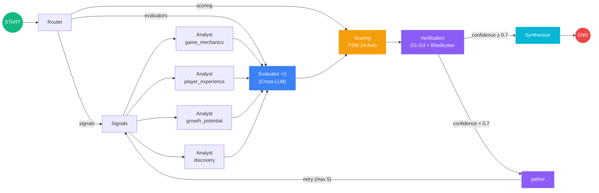
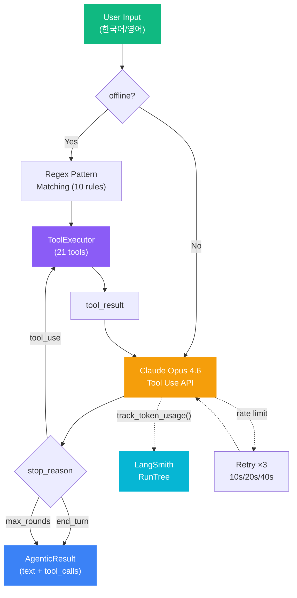
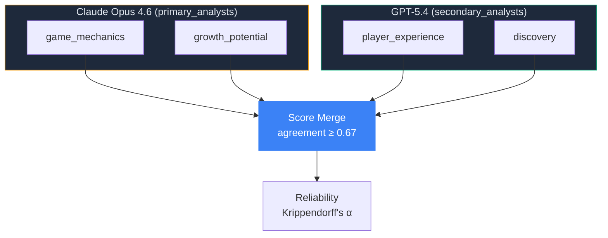
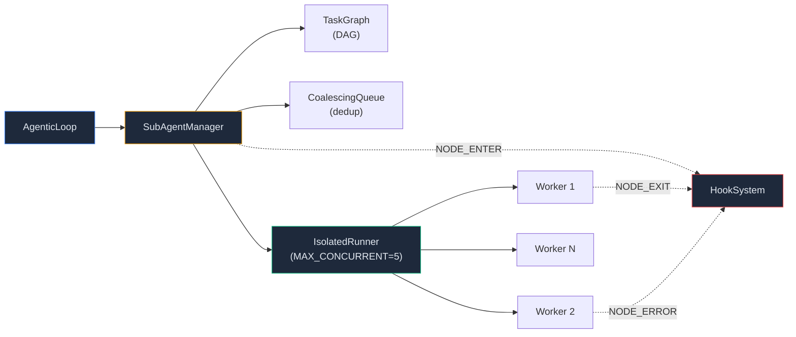
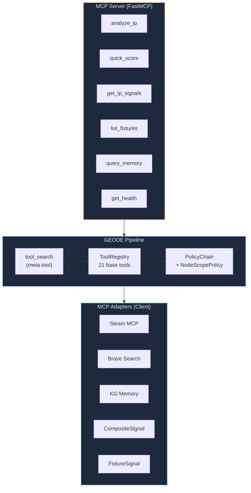
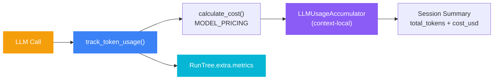
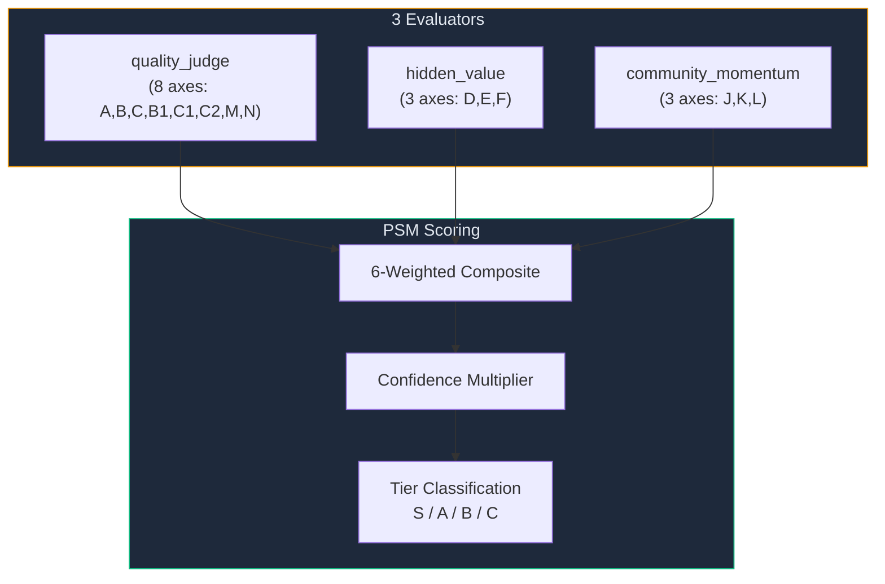
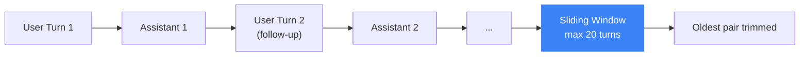
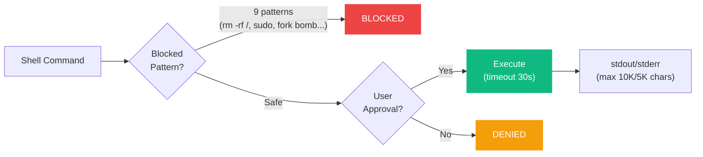
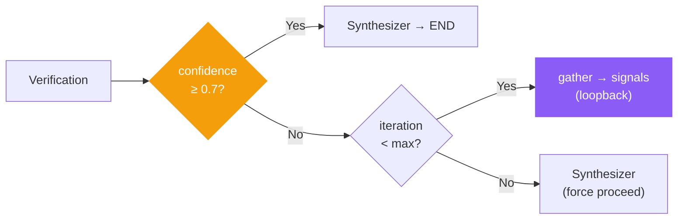

<p align="center">
  
</p>

# GEODE v0.7.0 — Undervalued IP Discovery Agent

LangGraph 기반 게임화 IP 도메인 자율 에이전트입니다. 주요 기능은 아래와 같습니다.
- 미디어 IP(애니메이션, 만화 등)의 게임화 잠재력을 6-Layer 아키텍처로 분석하고, PSM 14-Axis 루브릭으로 분석/평가 루프와 리포트 생성을 지원합니다.
- Runtime Orchestration, Tool-Registry/Tool-Use, Bash, Hook-System으로 Agentic Loop(Gather->Action->Verify)를 구성, 자율 행동이 가능합니다.
- 사용자의 의도와 맥락을 파악하기 위한 NL Router(Multi-turn, Multi-intent), 메모리 시스템, HITL이 내장되어 있습니다.
- Sub-Agent Manager(pre-release)로 병렬 작업을 지원합니다.
- Observability는 LangSmith, Evaluation은 루브릭 기반 LLM-as-Judge, CUSUM Drift 감지를 지원합니다.
- 에이전틱 엔지니어링으로 제작되며 코딩 에이전트가 E2E를 진행, Context/Observability/Eval/CI 가드레일을 기반으로 재귀 개선 루프를 형성합니다.
- 다음 업데이트는 Swiss Cheese Model based Eval Pipeline 구축으로 예정되어 있습니다.

## Features

| Feature | Description |
|---------|-------------|
| **6-Layer Pipeline** | Router → Signals → Analysts → Evaluators → Scoring → Verification → Gather/Synthesizer (8 nodes) |
| **Agentic Loop** | `while(tool_use)` 멀티 라운드 실행 (max 10 rounds), multi-intent 자동 chaining, offline mode |
| **Multi-turn Context** | 슬라이딩 윈도우 대화 기록 (max 20 turns), 대명사 해석 + follow-up |
| **HITL Bash** | 셸 명령 실행 + 위험 패턴 차단 (9종) + 사용자 승인 게이트 |
| **Sub-Agent** | 병렬 태스크 위임 (`IsolatedRunner`, MAX_CONCURRENT=5), TaskGraph DAG, CoalescingQueue 중복 제거 |
| **14-Axis Rubric** | PSM(Prospect Scoring Model) 기반 정량 평가 |
| **Cross-LLM Ensemble** | Claude Opus 4.6 + GPT-5.4 듀얼 평가, `cross` / `primary_only` 모드 |
| **Prompt Caching** | Anthropic `cache_control` 적용, 40-60% 비용 절감 |
| **21 Tool Definitions** | `definitions.json` 기반 + ToolRegistry 런타임 확장 + PolicyChain 접근 제어 |
| **MCP Adapters** | Steam, Brave Search, KG Memory 외부 데이터 소스 연결 |
| **MCP Server** | FastMCP 기반 6 tools + 2 resources (다른 에이전트에서 GEODE 호출) |
| **Prompt Templates** | `.md` 템플릿 8종 + YAML/JSON 설정 분리 (content/code separation) |
| **Batch Analysis** | 멀티 IP 동시 분석, Rich 테이블 렌더링 |
| **Streaming Output** | `--stream` 플래그로 실시간 진행 표시 |
| **자연어 입력** | 한국어/영어 자유 입력 (NL Router intent classification) |
| **Report Generation** | HTML/JSON/Markdown 다중 포맷, 외부 템플릿 |
| **Graceful Degradation** | API 키 없으면 자동 dry-run, 있으면 LLM 분석 |
| **Project Memory** | `.claude/MEMORY.md` + `rules/`로 분석 맥락 유지 |
| **Checkpoint** | SqliteSaver 기반 파이프라인 상태 영속화 |
| **Feedback Loop** | Confidence < 0.7이면 자동 재분석 (최대 5회, `GEODE_MAX_ITERATIONS`) |
| **LangSmith Observability** | 토큰 추적 + 비용 계산, RunTree 메트릭, 조건부 tracing |
| **Dynamic Tools** | ToolRegistry 기반 런타임 tool 추가, plugin activate → 즉시 반영 |
| **Pipeline Flexibility** | Analyst 타입 YAML 동적 로드, `interrupt_before` 사용자 개입 |
| **Pre-commit Hooks** | ruff lint/format + mypy + bandit + standard hooks |
| **2000+ Tests** | 118 modules, coverage ≥ 75%, pytest + ruff + mypy strict + bandit 전체 통과 |

## Architecture

### 6-Layer Architecture


| Layer | 구성 요소 | 설명 |
|-------|----------|------|
| **L0** CLI | Typer CLI, NL Router, AgenticLoop, IP Search, Batch | 사용자 인터페이스 — 슬래시 커맨드 17종, 자연어 intent 분류, while(tool_use) 멀티라운드 |
| **L1** Infra | Ports (Protocol), ClaudeAdapter, OpenAIAdapter, MCP Adapters | Port/Adapter DI — `contextvars` 주입, LLM 클라이언트 교체 가능 |
| **L2** Memory | Organization (fixture), Project (.claude/MEMORY.md), Session (TTL), SqliteSaver | 3-Tier 메모리 + LangGraph 체크포인트 영속화 |
| **L3** Pipeline | StateGraph, 8 Pipeline Nodes, GeodeState (TypedDict) | LangGraph `graph.stream()` 단계별 실행, Send API 병렬 분석 |
| **L4** Orchestration | HookSystem (23 events), TaskGraph DAG, PlanMode, CoalescingQueue, LaneQueue, RunLog | 라이프사이클 이벤트, 중복 요청 제거, 동시성 제어 |
| **L5** Extensibility | ToolRegistry (21), PolicyChain, Report Generator, Prompt Skills | 런타임 tool 확장, 노드별 접근 제어, HTML/JSON/MD 리포트 |

### Pipeline Flow



| Node | 역할 | 입출력 |
|------|------|--------|
| **Router** | 파이프라인 모드 결정 (6종), fixture 로딩, 메모리 조합 | `→ pipeline_mode`, `signals`/`evaluators`/`scoring` 라우팅 |
| **Signals** | 외부 시그널 데이터 fixture 주입 | `→ external_signals` |
| **Analyst ×4** | Send API 병렬 실행 — `game_mechanics`, `player_experience`, `growth_potential`, `discovery` | `→ analyses[]` (Clean Context: `analyses` 필드 제외) |
| **Evaluator ×3** | 14-Axis 루브릭 평가 — `quality_judge` (8축), `hidden_value` (3축), `community_momentum` (3축) | `→ evaluations[]` (Typed Pydantic Output) |
| **Scoring** | PSM 6-Weighted Composite + Confidence Multiplier → Tier S/A/B/C | `→ final_score`, `tier`, `cause` |
| **Verification** | Guardrails G1-G4 + BiasBuster (6 bias) + Confidence Gate | `→ confidence ≥ 0.7` 통과 or loopback |
| **Gather** | 재분석 상태 수집 (confidence < 0.7, max 5 iterations) | `→ signals` loopback |
| **Synthesizer** | Decision Tree 분류 + 내러티브 생성 | `→ recommendation`, `narrative` |

### Agentic Loop



> **Note:** 위 다이어그램의 Retry 10s/20s/40s는 AgenticLoop 레벨의 rate limit 재시도입니다. 파이프라인 내부 LLM 호출(`core/llm/client.py`)은 별도의 1s/2s/4s exponential backoff를 사용합니다.

| 구성 요소 | 설명 |
|----------|------|
| **offline mode** | `_offline_fallback()` — 10개 regex 패턴 기반 intent 매칭, LLM 호출 없이 1-round 결정론적 실행 |
| **LLM Tool Use** | Claude Opus 4.6 `tool_use` API — `definitions.json` 21개 tool 정의 전달, `stop_reason` 기반 루프 제어 |
| **ToolExecutor** | 3-tier safety: SAFE (7종, 무조건 실행) / STANDARD (일반) / DANGEROUS (bash, 사용자 승인 필수) |
| **max_rounds** | 기본 10 라운드 — `end_turn` 또는 라운드 초과 시 종료 |
| **LangSmith** | `track_token_usage()` — 토큰 수/비용을 RunTree.extra.metrics에 기록, `LLMUsageAccumulator`로 세션 합산 |
| **Retry** | AgenticLoop: `2^attempt × 10`s (10/20/40s) — Pipeline: `min(1.0 × 2^attempt, 30.0)`s (1/2/4s) |

### Cross-LLM Ensemble



> `ensemble_mode=cross` 시 `primary_analysts`/`secondary_analysts` 설정으로 모델 분배 결정. `primary_only` 모드에서는 모든 analyst가 Claude 사용.

| 항목 | 값 |
|------|-----|
| **Primary model** | Claude Opus 4.6 (`ClaudeAdapter`) |
| **Secondary model** | GPT-5.4 (`OpenAIAdapter`) |
| **Primary analysts** | `game_mechanics`, `growth_potential` (설정: `GEODE_PRIMARY_ANALYSTS`) |
| **Secondary analysts** | `player_experience`, `discovery` (설정: `GEODE_SECONDARY_ANALYSTS`) |
| **합의 임계값** | `agreement ≥ 0.67` (`GEODE_AGREEMENT_THRESHOLD`) |
| **신뢰도 지표** | Krippendorff's α (순서형 데이터 기반 평가자 간 일치도) |
| **모드 전환** | `GEODE_ENSEMBLE_MODE`: `cross` (듀얼) / `primary_only` (Claude 단독) |

### Sub-Agent Orchestration



| 구성 요소 | 설명 |
|----------|------|
| **SubAgentManager** | 태스크 위임 + 결과 수집 — `delegate_task` tool로 AgenticLoop에서 호출 |
| **TaskGraph (DAG)** | 의존 관계 기반 실행 순서 결정, 순환 감지, 완료 상태 추적 |
| **CoalescingQueue** | 동일 IP 중복 분석 요청 병합 (dedup key: IP name + mode) |
| **IsolatedRunner** | `asyncio.Semaphore(MAX_CONCURRENT=5)` — 최대 5개 워커 병렬 실행 |
| **HookSystem** | 23개 라이프사이클 이벤트 — `NODE_ENTER`/`NODE_EXIT`/`NODE_ERROR` 등 실시간 모니터링 |

### MCP & Tool Architecture



**MCP Adapters (Client)** — 외부 데이터 소스 연결:

| Adapter | 용도 | Port |
|---------|------|------|
| Steam MCP | Steam API 게임 데이터 (가격, 리뷰, 태그) | `SignalEnrichmentPort` |
| Brave Search | 웹 검색 기반 시그널 수집 | `SignalEnrichmentPort` |
| KG Memory | Knowledge Graph 기반 IP 관계 검색 | `MemoryPort` |
| CompositeSignal | 다중 소스 시그널 통합 | `SignalEnrichmentPort` |
| FixtureSignal | 로컬 fixture JSON 기반 시그널 (dry-run) | `SignalEnrichmentPort` |

**MCP Server (FastMCP)** — GEODE를 외부 에이전트에서 호출:

| Tool | 설명 |
|------|------|
| `analyze_ip` | IP 전체 분석 실행 |
| `quick_score` | 빠른 점수 산출 (scoring only) |
| `get_ip_signals` | 외부 시그널 데이터 조회 |
| `list_fixtures` | 사용 가능한 IP fixture 목록 |
| `query_memory` | 프로젝트 메모리 검색 |
| `get_health` | 시스템 상태 점검 |

**Resources**: `geode://fixtures` (IP 목록), `geode://soul` (시스템 영혼 프롬프트)

### LangSmith Observability



| 항목 | 설명 |
|------|------|
| **track_token_usage()** | 각 LLM 호출 후 input/output 토큰 수 + cache hit 기록 |
| **calculate_cost()** | `MODEL_PRICING` dict 기반 비용 산출 (input/output/cache 단가 × 토큰) |
| **LLMUsageAccumulator** | `contextvars` 기반 — 세션 내 전체 토큰/비용 누적, context-local 격리 |
| **RunTree.extra.metrics** | LangSmith 트레이스에 토큰 수/비용 메타데이터 첨부 |
| **조건부 활성화** | `LANGCHAIN_TRACING_V2=true` + `LANGCHAIN_API_KEY` 설정 시만 tracing 활성 |

### 14-Axis Rubric (PSM Engine)



> 각 축은 1-5점 한국어 루브릭 앵커 사용. `evaluator_axes.yaml`에서 SSOT 관리. Prospect IP용 9-axis 확장 루브릭도 지원.

**Evaluator별 축 배분:**

| Evaluator | 축 | 평가 영역 |
|-----------|-----|----------|
| `quality_judge` | A (Narrative Depth), B (Visual Adaptation), C (Gameplay Potential), B1 (Character Appeal), C1 (World Building), C2 (Lore Consistency), M (Market Fit), N (Innovation Score) | 품질 8축 |
| `hidden_value` | D (Discovery Gap), E (Exploitation Gap), F (Fandom Resilience) | 숨겨진 가치 3축 |
| `community_momentum` | J (Community Activity), K (Content Creation), L (Cross-media Traction) | 커뮤니티 모멘텀 3축 |

**Scoring Formula**: `Final = (0.25×PSM + 0.20×Quality + 0.18×Recovery + 0.12×Growth + 0.20×Momentum + 0.05×Dev) × (0.7 + 0.3 × Confidence/100)`

**Tier 기준**: S ≥ 80, A ≥ 60, B ≥ 40, C < 40

### Multi-turn Context



> `ConversationContext` — 슬라이딩 윈도우 (max 20 turns). 대명사 해석("그거 다시 분석해")과 follow-up 쿼리 지원. 각 턴은 user/assistant/tool_result 메시지 포함.

### HITL Bash



> `BashTool` — 9개 위험 패턴 사전 차단, 나머지 명령은 사용자 승인 후 실행.

**차단 패턴 (9종):**

| # | 패턴 | 위험 |
|---|------|------|
| 1 | `rm -rf /` | 루트 파일시스템 삭제 |
| 2 | `sudo` | 권한 상승 |
| 3 | `> /etc/` | 시스템 설정 덮어쓰기 |
| 4 | `curl \| sh` | 원격 코드 실행 |
| 5 | `wget \| sh` | 원격 코드 실행 |
| 6 | `mkfs.` | 디스크 포맷 |
| 7 | `dd if=... of=/dev/` | 디스크 직접 쓰기 |
| 8 | `chmod -R 777 /` | 전역 권한 개방 |
| 9 | Fork bomb `:(){ :\|:& };:` | 시스템 리소스 고갈 |

**실행 제약**: timeout 30초, stdout 최대 10K / stderr 최대 5K chars 제한.

### Feedback Loop



> Confidence < 0.7이면 `gather` 노드가 상태를 수집하고 `signals`로 loopback. `GEODE_MAX_ITERATIONS` (기본 5)회까지 재시도 후 강제 진행.

| 항목 | 값 |
|------|-----|
| **Confidence 임계값** | 0.7 (`GEODE_CONFIDENCE_THRESHOLD`) |
| **최대 반복** | 5회 (`GEODE_MAX_ITERATIONS`) |
| **Loopback 경로** | `verification → gather → signals → analyst → evaluator → scoring → verification` |
| **강제 진행** | 최대 반복 도달 시 현재 점수로 Synthesizer 진행 |
| **Confidence Multiplier** | `final = base × (0.7 + 0.3 × confidence/100)` — 신뢰도에 따라 최종 점수 30% 범위 내 조정 |

### Prompt Caching

> Anthropic `cache_control: {"type": "ephemeral"}` 적용. 시스템 프롬프트와 루브릭 데이터를 캐시하여 반복 호출 시 40-60% 비용 절감. `ClaudeAdapter`에서 자동 적용.

### Checkpoint (State Persistence)

> `SqliteSaver` (LangGraph 내장)로 파이프라인 상태 영속화. 각 노드 실행 후 자동 체크포인트. 장애 시 마지막 체크포인트부터 재개. `GEODE_CHECKPOINT_DB` 환경변수로 DB 경로 지정.

### Dynamic Tools (ToolRegistry)


> `definitions.json` 21개 기본 도구 + `ToolRegistry.register()` 런타임 확장. `get_agentic_tools(registry)` 호출 시 base + plugin 도구 병합. `PolicyChain`으로 노드별 도구 접근 제어.

**기본 Tool 목록 (19종):**

| # | Tool | 용도 | Safety |
|---|------|------|--------|
| 1 | `list_ips` | IP 목록 조회 | SAFE |
| 2 | `analyze_ip` | IP 분석 실행 | STANDARD |
| 3 | `search_ips` | IP 검색 | SAFE |
| 4 | `compare_ips` | 두 IP 비교 | STANDARD |
| 5 | `show_help` | 도움말 표시 | SAFE |
| 6 | `generate_report` | 리포트 생성 | STANDARD |
| 7 | `batch_analyze` | 배치 분석 | STANDARD |
| 8 | `check_status` | 시스템 상태 | SAFE |
| 9 | `switch_model` | LLM 모델 전환 | SAFE |
| 10 | `memory_search` | 메모리 검색 | SAFE |
| 11 | `memory_save` | 메모리 저장 | STANDARD |
| 12 | `manage_rule` | 룰 관리 | SAFE |
| 13 | `set_api_key` | API 키 설정 | STANDARD |
| 14 | `manage_auth` | 인증 프로필 관리 | STANDARD |
| 15 | `generate_data` | 합성 데이터 생성 | STANDARD |
| 16 | `schedule_job` | 스케줄 등록 | STANDARD |
| 17 | `trigger_event` | 이벤트 트리거 | STANDARD |
| 18 | `run_bash` | 셸 명령 실행 | DANGEROUS |
| 19 | `delegate_task` | 서브에이전트 위임 | STANDARD |
| 20 | `create_plan` | 분석 계획 생성 | STANDARD |
| 21 | `approve_plan` | 계획 승인/실행 | STANDARD |

### Pipeline Flexibility (C2-C5)

| 항목 | 방식 |
|------|------|
| **Analyst 타입** | `evaluator_axes.yaml` → `ANALYST_TYPES = list(ANALYST_SPECIFIC.keys())` — YAML에 키 추가만으로 analyst 확장 |
| **중간 개입** | `GEODE_INTERRUPT_NODES=verification,scoring` → 해당 노드 전에 파이프라인 일시 중단 |
| **동적 Tool** | `ToolRegistry` + `get_agentic_tools()` — 플러그인 런타임 등록 |
| **오프라인 모드** | `AgenticLoop(offline_mode=True)` → regex 기반 10-패턴 라우팅, LLM 불필요 |

## Installation

```bash
uv sync
```

## Quick Start

```bash
# 인터랙티브 모드 (권장)
uv run geode

# IP 분석 (API 키 있으면 LLM 호출, 없으면 자동 dry-run)
uv run geode analyze "Berserk"

# 명시적 dry-run (API 키 있어도 LLM 호출 안 함)
uv run geode analyze "Berserk" --dry-run

# Streaming 분석
uv run geode analyze "Berserk" --stream

# 배치 분석 (--dry-run 권장, batch는 기본 --live 모드)
uv run geode batch --top 5 --dry-run

# 리포트 생성
uv run geode report "Berserk" --format html --output berserk.html

# MCP 서버 실행
uv run python -m core.mcp_server
```

## Setup

```bash
# 1. 환경 변수 설정
cp .env.example .env

# 2. .env 편집 — API 키 입력
ANTHROPIC_API_KEY=sk-ant-...

# 3. Full 분석 실행
uv run geode analyze "Cowboy Bebop"
```

API 키 없이 시작하면 자동으로 dry-run 모드로 전환됩니다 (API 키 설정 시 LLM 분석 자동 활성화):

```
  ✓ Dry-Run Analysis
  ✓ IP Search
  ✗ LLM Analysis (ANTHROPIC_API_KEY not set)

  API key not configured — dry-run mode only
```

## Usage

### Interactive Mode

```bash
uv run geode
```

**슬래시 커맨드:**

| Command | Alias | Description |
|---------|-------|-------------|
| `/analyze <IP>` | `/a` | IP 분석 (API 키 유무에 따라 자동 모드 결정) |
| `/run <IP>` | `/r` | IP 분석 (동일) |
| `/search <query>` | `/s` | IP 검색 |
| `/report <IP> [fmt]` | `/rpt` | 리포트 생성 (md/html/json) |
| `/list` | | IP 목록 |
| `/generate [count]` | `/gen` | 합성 데모 데이터 생성 |
| `/model` | | LLM 모델 선택 |
| `/key [value]` | | API 키 설정 |
| `/auth` | | 인증 프로필 관리 |
| `/batch [--top N]` | `/b` | 배치 분석 |
| `/status` | | 시스템 상태 (모델, API 키, 메모리) |
| `/compare <A> <B>` | | 두 IP 비교 분석 (Interactive) |
| `/schedule <cron>` | `/sched` | 배치 스케줄 설정 |
| `/trigger <event>` | | 이벤트 트리거 (drift scan 등) |
| `/verbose` | | 상세 출력 토글 |
| `/help` | | 도움말 |
| `/quit` | `/q` | 종료 |

**자연어 입력:**

```
> Berserk 분석해           → LLM 분석 (API 키 있을 때) / dry-run (없을 때)
> 소울라이크 찾아줘         → 장르 검색
> Berserk vs Cowboy Bebop  → 비교 분석
> Berserk 리포트 생성해     → 리포트 생성
> 뭐가 있어?               → IP 목록
> 시스템 상태              → 상태 확인
> API 키 설정해            → API 키 설정
> 스케줄 걸어줘            → 배치 스케줄
```

### CLI Mode

```bash
geode analyze "Berserk"                          # LLM 분석 (API 키 있을 때)
geode analyze "Berserk" --dry-run                 # 명시적 dry-run
geode analyze "Berserk" --stream                  # streaming output
geode analyze "Berserk" --verbose                 # 상세 출력
geode analyze "Cowboy Bebop" --skip-verification  # 검증 생략
geode batch --top 5                               # 상위 5개 배치 분석
geode batch --genre "Dark Fantasy"                # 장르 필터 배치
geode report "Berserk"                            # Markdown summary
geode report "Berserk" -f html -o berserk.html    # HTML 파일 저장
geode search "사이버펑크"                          # 검색
geode list                                        # 목록
```

### MCP Server

GEODE를 MCP 서버로 실행하여 다른 에이전트에서 호출할 수 있습니다:

```bash
uv run python -m core.mcp_server
```

**제공 도구:** `analyze_ip`, `quick_score`, `get_ip_signals`, `list_fixtures`, `query_memory`, `get_health`

**리소스:** `geode://fixtures`, `geode://soul`

## Available IPs

**Core Fixtures** (hand-crafted, golden set):

| IP | Tier | Score | Genre |
|----|------|-------|-------|
| Berserk | S | 81.3 | Dark Fantasy |
| Cowboy Bebop | A | 68.4 | SF Noir |
| Ghost in the Shell | B | 51.6 | Cyberpunk |

**Steam Fixtures**: 201개 추가 게임 데이터 (`core/fixtures/steam/`), `/generate` 명령으로 합성 데이터 생성 가능.

## Project Structure

```
core/
├── cli/                        # CLI + NL Router + Agentic Loop
│   ├── __init__.py             # Typer app, REPL, pipeline execution
│   ├── agentic_loop.py         # while(tool_use) multi-round execution
│   ├── bash_tool.py            # Shell execution + HITL safety gate
│   ├── batch.py                # Batch analysis (ThreadPoolExecutor)
│   ├── commands.py             # Slash command dispatch (17 commands)
│   ├── conversation.py         # Multi-turn sliding-window context
│   ├── nl_router.py            # Natural language intent classification
│   ├── search.py               # IP search engine (synonym expansion)
│   ├── startup.py              # Readiness check, Graceful Degradation
│   ├── sub_agent.py            # Parallel task delegation (SubAgentManager)
│   └── tool_executor.py        # Tool dispatch + HITL approval gate
├── auth/                       # Auth profile management + rotation
├── automation/                 # Feedback loop, drift detection, triggers
├── config/                     # Externalized domain config (YAML)
│   ├── evaluator_axes.yaml     # 14-Axis rubric definitions + anchors
│   └── cause_actions.yaml      # Cause→Action mappings
├── config.py                   # Settings (pydantic-settings, 30+ vars)
├── data/                       # Synthetic data generation
├── extensibility/              # Report generation + templates
│   └── templates/              # HTML/Markdown report templates
├── fixtures/                   # Fixture data (3 core IPs + 201 Steam)
├── graph.py                    # LangGraph StateGraph definition
├── infrastructure/
│   ├── ports/                  # LLMClientPort, SignalEnrichmentPort, etc.
│   └── adapters/
│       ├── llm/                # ClaudeAdapter, OpenAIAdapter
│       └── mcp/                # Steam, Brave, KGMemory MCP adapters
├── llm/                        # LLM client (prompt caching, streaming)
│   ├── client.py               # Anthropic wrapper + token tracking + cost
│   └── prompts/                # Prompt templates (.md) + axes config
│       ├── analyst.md          # Analyst system prompt template
│       ├── evaluator.md        # Evaluator prompt template
│       ├── synthesizer.md      # Synthesizer prompt template
│       ├── cross_llm.md        # Cross-LLM verification prompts
│       ├── axes.py             # Axis definitions (loads from YAML)
│       └── ...                 # biasbuster, commentary, router, tool_augmented
├── mcp_server.py               # FastMCP server (6 tools, 2 resources)
├── memory/                     # 3-Tier memory system
├── nodes/                      # Pipeline nodes (8: router, signals, analyst, evaluator, scoring, verification, gather, synthesizer)
├── orchestration/
│   ├── hooks.py                # HookSystem (23 events)
│   ├── hook_discovery.py       # Plugin-based hook loading
│   ├── isolated_execution.py   # Concurrent runner (semaphore)
│   ├── task_system.py          # DAG-based task graph
│   ├── coalescing.py           # Duplicate request coalescing
│   ├── plan_mode.py            # DRAFT → APPROVED → EXECUTING workflow
│   ├── lane_queue.py           # Concurrency control lanes
│   ├── run_log.py              # Structured execution logging
│   └── ...                     # planner, bootstrap, stuck_detection, etc.
├── runtime.py                  # GeodeRuntime (production wiring)
├── state.py                    # GeodeState (TypedDict + Pydantic models)
├── tools/                      # Tool Protocol + Registry + Policy
│   ├── registry.py             # ToolRegistry (21 tools + runtime extensions)
│   ├── definitions.json        # Centralized tool definitions (21 tools)
│   ├── tool_schemas.json       # Parameter schemas for signal/analysis tools
│   ├── policy.py               # PolicyChain + NodeScopePolicy
│   └── ...                     # analysis, signal_tools, data_tools, etc.
├── ui/                         # Rich console + Claude Code-style agentic UI
│   ├── agentic_ui.py           # ▸/✓/✗/✢/● markers (tool call/result/token rendering)
│   └── console.py              # Rich Console singleton (width=120, GEODE theme)
└── verification/               # Guardrails + BiasBuster + Rights Risk
```

## Testing

```bash
# 전체 테스트
uv run pytest

# 상세 출력
uv run pytest -v

# 특정 모듈
uv run pytest tests/test_graph.py
uv run pytest tests/test_batch.py
uv run pytest tests/test_mcp_server.py

# Live E2E (실제 LLM 호출)
uv run pytest tests/test_e2e_live_llm.py -v -m live

# 17-Tool Audit (실제 LLM 라우팅 검증)
uv run python tests/_live_audit_runner.py info

# 품질 검사
uv run ruff check core/ tests/
uv run ruff format --check core/ tests/
uv run mypy core/
uv run bandit -r core/ -c pyproject.toml

# Pre-commit (전체 검사)
uv run pre-commit run --all-files
```

## Configuration

`.env` 파일로 설정합니다 (전체 목록: `core/config.py`):

| Variable | Default | Description |
|----------|---------|-------------|
| **LLM** | | |
| `ANTHROPIC_API_KEY` | | Claude API 키 |
| `OPENAI_API_KEY` | | GPT API 키 (Cross-LLM) |
| `GEODE_MODEL` | `claude-opus-4-6` | 기본 LLM 모델 |
| `GEODE_ENSEMBLE_MODE` | `primary_only` | 앙상블 모드 (`primary_only` / `cross`) |
| `GEODE_ROUTER_MODEL` | `claude-opus-4-6` | NL Router 모델 |
| `GEODE_AGREEMENT_THRESHOLD` | `0.67` | Cross-LLM 합의 임계값 |
| **Pipeline** | | |
| `GEODE_CONFIDENCE_THRESHOLD` | `0.7` | 신뢰도 게이트 (미달 시 재분석) |
| `GEODE_MAX_ITERATIONS` | `5` | 최대 재분석 반복 횟수 |
| `GEODE_INTERRUPT_NODES` | | 중간 개입 노드 (쉼표 구분, e.g. `verification,scoring`) |
| `GEODE_CHECKPOINT_DB` | `geode_checkpoints.db` | Checkpoint DB 경로 |
| **MCP** | | |
| `GEODE_STEAM_MCP_URL` | | Steam MCP 서버 URL |
| `GEODE_BRAVE_MCP_URL` | | Brave Search MCP 서버 URL |
| `GEODE_BRAVE_API_KEY` | | Brave Search API 키 |
| `GEODE_KG_MEMORY_MCP_URL` | | KG Memory MCP 서버 URL |
| **Observability** | | |
| `LANGCHAIN_TRACING_V2` | `false` | LangSmith tracing 활성화 |
| `LANGCHAIN_API_KEY` | | LangSmith API 키 |
| `LANGCHAIN_PROJECT` | `geode` | LangSmith 프로젝트명 |
| **General** | | |
| `GEODE_VERBOSE` | `false` | 상세 출력 |

## License

Internal use only.
