<p align="center">
  
</p>

<p align="center">
  
  
  
  
  <a href="https://github.com/mangowhoiscloud/geode/actions"></a>
</p>

# GEODE v0.18.1 — Autonomous Research Harness

범용 자율 실행 에이전트. `while(tool_use)` 루프를 핵심 프리미티브로 하여 리서치, 분석, 자동화, 스케줄링을 자연어 한 줄로 수행합니다.

> *"AI 에이전트 트렌드 조사해줘", "이 URL 요약해줘", "매주 월요일 뉴스 브리핑 잡아줘" -- 자연어로 요청하면 LLM이 도구를 호출하고, 결과를 관찰하고, 다음 행동을 결정하는 루프를 반복합니다. 복합 요청은 자동 분해하고, 실패는 자동 복구하며, 도메인별 분석 파이프라인은 플러그인으로 교체됩니다.*

### Highlights

- **Natural Language Interface** -- 자연어 한 줄로 리서치, 분석, 자동화, 스케줄링 수행
- **`while(tool_use)` Loop** -- 모든 자율 행동의 핵심 프리미티브. 도구를 호출하고, 관찰하고, 반복
- **42 Built-in Tools** -- web_fetch, general_web_search, run_bash 등 42개 네이티브 도구
- **MCP Auto-Discovery** -- MCPRegistry가 환경변수 기반 자동 탐지 (DEFAULT 5종 + AUTO_DISCOVER 18종), 카탈로그 39종
- **Bash Execution** -- shell 명령 실행. SAFE_BASH_PREFIXES 41종 읽기 전용 자동승인, 9종 위험 패턴 차단, 그 외 HITL 승인
- **Goal Decomposition** -- 복합 요청을 하위 목표 DAG로 자동 분해 (Haiku, ~$0.01/호출)
- **Error Recovery** -- 실패 시 retry → alternative → fallback → escalate 4단계 자동 복구
- **Sub-Agent** -- 부모 역량 전체 상속, 병렬 위임, Token Guard, as_completed 수집
- **4-Tier Memory** -- SOUL → User Profile (Tier 0.5) → Organization → Project → Session 계층적 맥락 조합
- **Domain Plugin** -- `DomainPort` Protocol로 도메인별 파이프라인 교체 (Game IP 기본 탑재)
- **Safety** -- 4-tier HITL (SAFE/STANDARD/WRITE/DANGEROUS), Grounding Truth, 9종 bash 차단

### Tool Execution Hierarchy

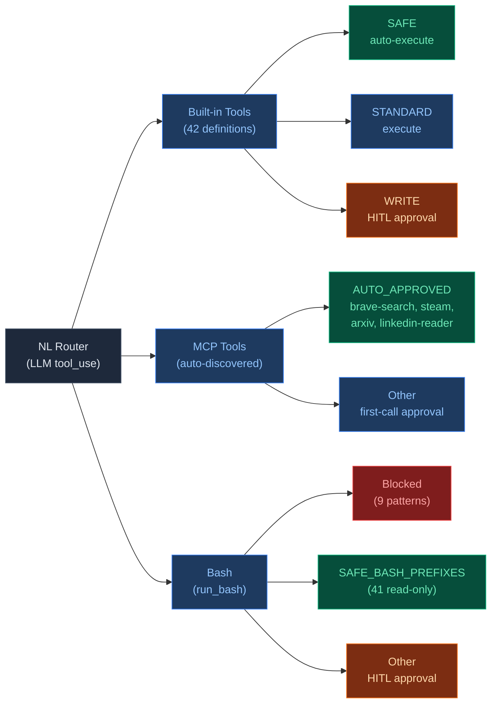

NL Router가 LLM의 tool_use 응답을 3가지 경로로 디스패치합니다:

| 경로 | 도구 수 | 승인 방식 |
|------|--------|----------|
| Built-in Tools | 42 | SAFE 자동승인, STANDARD 실행, WRITE HITL 승인 |
| MCP Tools | 카탈로그 39종 | AUTO_APPROVED 서버 4종 자동승인, 그 외 초회 승인 |
| Bash | shell 명령 | SAFE_BASH_PREFIXES 41종 자동승인, 9종 차단, 그 외 HITL |

## Installation

```bash
uv sync
```

## Quick Start

```bash
# 인터랙티브 REPL (권장) — 자연어로 무엇이든 요청
uv run geode

# 자연어 쿼리 (CLI에서 직접)
uv run geode "최근 AI 에이전트 프레임워크 트렌드 조사해줘"

# 웹 리서치
uv run geode "이 URL 내용 요약해줘: https://example.com/article"

# 스케줄링
uv run geode "매주 월요일 AI 뉴스 브리핑 스케줄 잡아줘"

# Domain Plugin: 게임 IP 분석 (API 키 있으면 LLM 호출, 없으면 자동 dry-run)
uv run geode analyze "Berserk"
```

### Setup

```bash
# 1. 환경 변수 설정
cp .env.example .env

# 2. .env 편집 — API 키 입력
ANTHROPIC_API_KEY=sk-ant-...

# 3. REPL 시작
uv run geode
```

API 키 없이 시작하면 자동으로 dry-run 모드로 전환됩니다.

---

## Architecture Overview

### 6-Layer Architecture

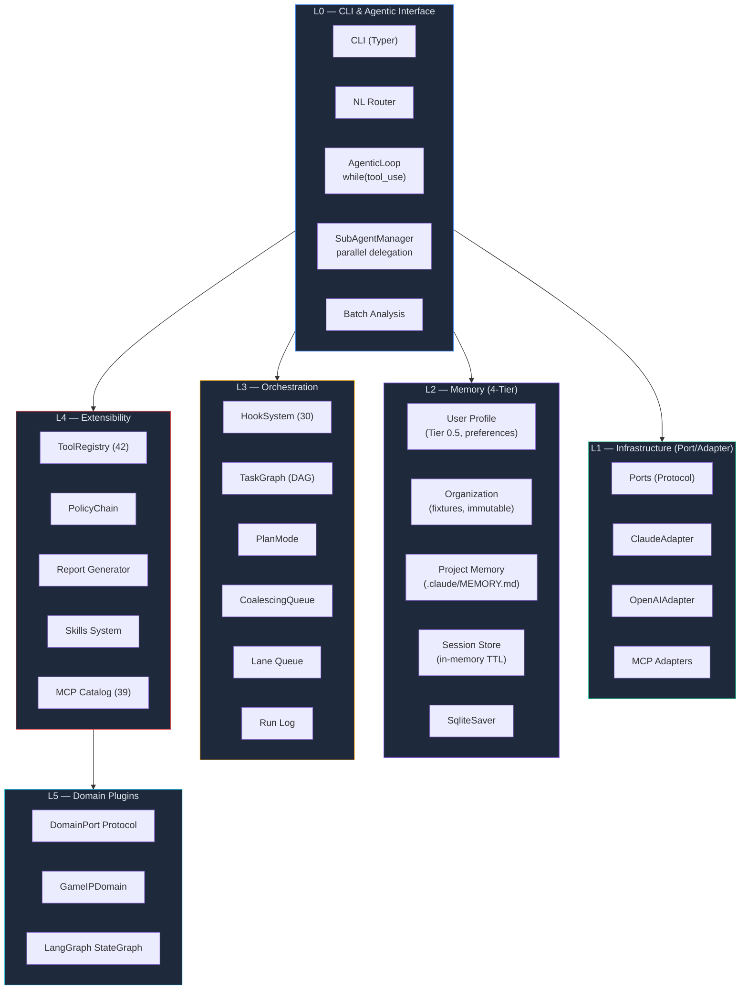

| Layer | 구성 요소 | 설명 |
|-------|----------|------|
| **L0** CLI & Agent | Typer CLI, NL Router, AgenticLoop, SubAgentManager, Batch | 사용자 인터페이스 + 자율 실행 코어 |
| **L1** Infra | Ports (Protocol), ClaudeAdapter, OpenAIAdapter, MCP Adapters | Port/Adapter DI — `contextvars` 주입 |
| **L2** Memory | SOUL → User Profile → Organization → Project → Session (4-Tier), SqliteSaver | 계층적 메모리 + LangGraph 체크포인트 |
| **L3** Orchestration | HookSystem (30 events), TaskGraph DAG, PlanMode, CoalescingQueue | 라이프사이클 이벤트, 동시성 제어 |
| **L4** Extensibility | ToolRegistry (42), PolicyChain, Skills, MCP Catalog (39) | 런타임 tool/skill 확장, MCP 자동설치 |
| **L5** Domain Plugins | DomainPort Protocol, GameIPDomain, LangGraph StateGraph | 도메인별 파이프라인 플러그인 교체 |

---

## Autonomous Core

### Agentic Loop

모든 자율 실행의 핵심 프리미티브. LLM이 `tool_use`를 반환하는 한 루프를 계속합니다.

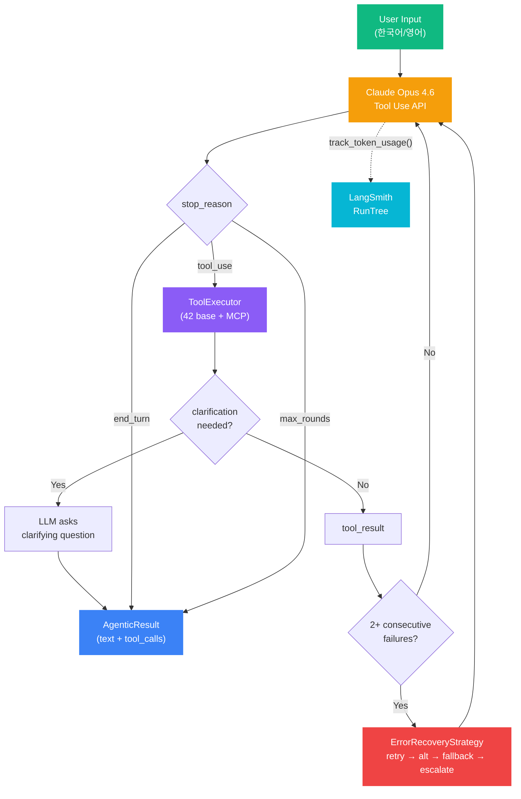

| 구성 요소 | 설명 |
|----------|------|
| **LLM Tool Use** | Claude Opus 4.6 — base 42 + MCP 20+ tool 정의 전달, `stop_reason` 기반 루프 제어 |
| **ToolExecutor** | 4-tier safety: SAFE / STANDARD / WRITE / DANGEROUS (bash 사용자 승인 필수) |
| **Clarification** | 필수 파라미터 누락 시 LLM이 사용자에게 되묻기 |
| **max_rounds** | 기본 50 라운드 — 마지막 2라운드에서 텍스트 응답 강제 (1M 컨텍스트 + `clear_tool_uses` 활용) |
| **Multi-turn** | 슬라이딩 윈도우 (max 200 turns) — 서버측 `clear_tool_uses`가 주 컨텍스트 관리, 클라이언트 제한은 안전망 |
| **LangSmith** | 토큰 수/비용을 RunTree에 기록, 세션 합산 |

### Goal Decomposition

복합 요청을 하위 목표 DAG로 자동 분해합니다. 단순 요청은 LLM 호출 없이 통과시켜 비용을 최소화합니다.

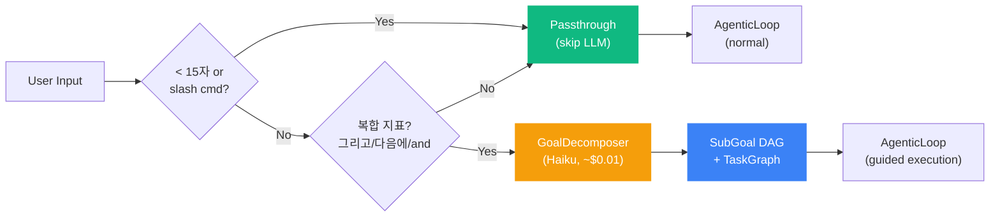

| 단계 | 동작 | 비용 |
|------|------|------|
| **Heuristic 1** | `_is_clearly_simple()` — slash 명령, 15자 미만 → 즉시 패스스루 | 0 |
| **Heuristic 2** | `_has_compound_indicators()` — "그리고", "다음에", "and then" 등 복합 지표 탐지 | 0 |
| **LLM Decompose** | Haiku 모델로 SubGoal 리스트 생성, 의존관계 포함 | ~$0.01 |
| **TaskGraph 변환** | SubGoal → TaskGraph DAG, 의존성 기반 실행 순서 결정, 실패 전파 | 0 |

### Error Recovery

도구 실행 연속 실패 시 4단계 전략 체인으로 자동 복구합니다.

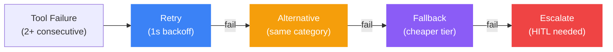

| 전략 | 동작 | 예시 |
|------|------|------|
| **Retry** | 동일 도구 재실행 (1s backoff) | `web_fetch` 재시도 |
| **Alternative** | 같은 `category` 다른 도구 (`definitions.json`) | `web_fetch` → `general_web_search` |
| **Fallback** | 더 낮은 `cost_tier` 도구 | `expensive` → `cheap` → `free` |
| **Escalate** | 사용자 개입 요청 (terminal) | HITL 승인 |

**안전 제외**: `run_bash`, `memory_save`, `set_api_key` 등 DANGEROUS/WRITE 도구는 자동 복구 대상에서 제외.

Hook: `TOOL_RECOVERY_ATTEMPTED` / `SUCCEEDED` / `FAILED` — 복구 수명주기 관측.

### Dynamic Graph

파이프라인 토폴로지를 분석 결과에 따라 실행 시점에 동적으로 변형합니다.

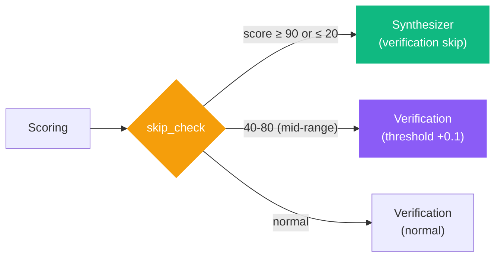

| 점수 범위 | 동작 | 이유 |
|-----------|------|------|
| **≥ 90 또는 ≤ 20** | verification 건너뛰기 → 바로 synthesizer | 극단 점수는 검증 불필요 (높은 확신) |
| **40 ~ 80** | `enrichment_needed=True`, confidence 임계값 +0.1 | 모호한 중간 점수 → 재평가 유도 |
| **그 외** | 정상 verification 경로 | 표준 흐름 |

`skipped_nodes` 필드에 건너뛴 노드를 누적 기록하여 감사 추적(audit trail) 가능.

### Signal Liveification

MCP 어댑터 우선 호출 → fixture fallback 전략으로 시그널을 수집합니다.

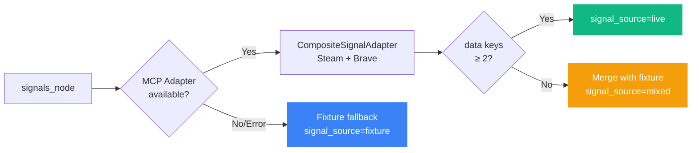

| signal_source | 조건 | 설명 |
|---------------|------|------|
| `live` | MCP 반환 데이터 키 ≥ 2개 | 충분한 라이브 데이터 |
| `mixed` | MCP 반환 1개 + fixture 존재 | live 값이 fixture를 override |
| `fixture` | MCP 미연결/에러 | 자동 fallback |

`CompositeSignalAdapter`는 여러 MCP 어댑터(Steam, Brave 등)를 체이닝하며, `_enrichment_sources` 리스트로 provenance를 추적합니다.

### Plan Auto-Execute

계획 생성 → 승인 → 실행을 사용자 개입 없이 자동 수행합니다.

| 모드 | 흐름 | 설정 |
|------|------|------|
| **MANUAL** (기본) | create → present → [사용자 승인] → execute | `plan_auto_execute=false` |
| **AUTO** | create → auto_execute (승인+실행 일괄) | `GEODE_PLAN_AUTO_EXECUTE=true` |

- **Partial Success**: step 실패 시 1회 재시도 후 `failed`로 마킹하고 나머지 step 계속 진행
- **HITL 보존**: AUTO 모드에서도 DANGEROUS/WRITE 도구는 사용자 승인 필수 (ToolExecutor 레이어에서 별도 게이트)

### Sub-Agent System

부모 AgenticLoop의 전체 역량(tools, MCP, skills, memory)을 상속받아 독립 컨텍스트에서 병렬 실행합니다.

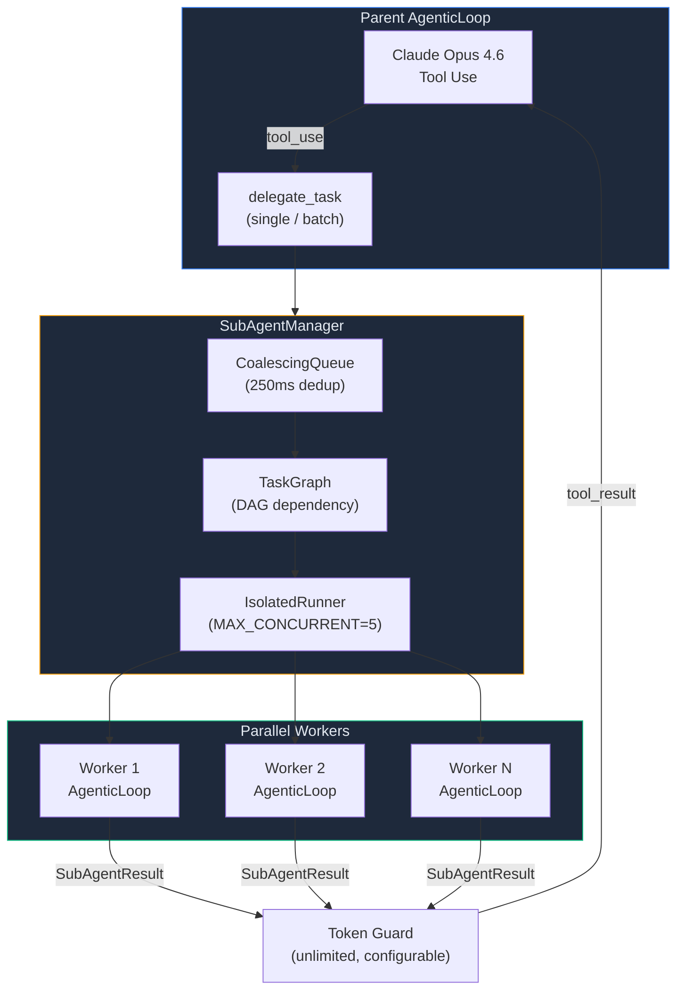

| 제어 | 값 | 설명 |
|------|-----|------|
| **max_depth** | 2 | 재귀 위임 최대 깊이 (Root=0 → depth 2) |
| **max_total** | 15 | 세션당 최대 서브에이전트 수 |
| **MAX_CONCURRENT** | 5 | 동시 병렬 워커 수 |
| **timeout_s** | 120s | 개별 태스크 타임아웃 |
| **Token Guard** | unlimited (0), configurable via GEODE_MAX_TOOL_RESULT_TOKENS | tool_result 제한 시 `summary`만 보존 |
| **as_completed** | polling round-robin | 먼저 끝난 태스크 결과 즉시 반환 |

에러 분류: `TIMEOUT`, `API_ERROR` (retryable) / `VALIDATION`, `RESOURCE`, `DEPTH_EXCEEDED` (non-retryable).

### 4-Tier Memory

계층적 메모리 시스템으로 분석 맥락을 조합합니다. 상위 tier의 값은 하위 tier에 의해 override됩니다.

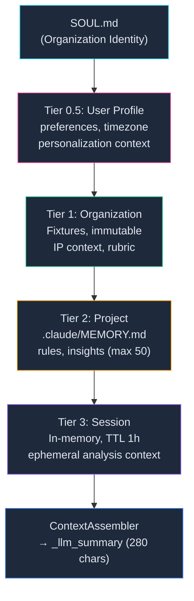

| Tier | 소스 | 영속성 | 용도 |
|------|------|--------|------|
| **SOUL** | `.claude/SOUL.md` | 영구 | 조직 미션, 원칙 |
| **User Profile** (0.5) | `~/.geode/user_profile/` | 파일 기반 | 사용자 선호, 타임존, 개인화 맥락 |
| **Organization** | `core/fixtures/*.json` | Read-only | IP context, rubric, 기대 결과 |
| **Project** | `.claude/MEMORY.md`, `.claude/rules/` | 파일 기반 | 학습된 규칙, 인사이트 (최대 50개, 회전) |
| **Session** | In-memory dict | TTL 1h | 현재 분석 컨텍스트, 체크포인트 |

`ContextAssembler`가 4-tier를 조합하여 `_llm_summary` (280자, SOUL 10% / Org 25% / Project 25% / Session 40% 예산)로 압축합니다.

### Prompt Assembly Pipeline

모든 노드(Analyst, Evaluator, Synthesizer, BiasBuster)는 동일한 5단계 조합 파이프라인(ADR-007)을 거쳐 LLM을 호출합니다.

```mermaid
graph LR
    T["Base Template<br/>prompts/*.md<br/>(10 templates)"] --> P0["Phase 0<br/>.format(**kwargs)"]
    P0 --> P1["Phase 1<br/>Prompt Override"]
    P1 --> P2["Phase 2<br/>Skill Injection<br/>(top 3, ≤500c)"]
    P2 --> P3["Phase 3<br/>Memory Context<br/>(_llm_summary, ≤300c)"]
    P3 --> P4["Phase 4<br/>Bootstrap Extra<br/>(5 × 100c)"]
    P4 --> Budget["Token Budget<br/>(hard limit 6000c)"]
    Budget --> AP["AssembledPrompt<br/>+ SHA-256[:12] hash"]
    AP --> Cache["cache_control:<br/>ephemeral"]
    Cache --> LLM["call_llm_parsed()<br/>→ Pydantic model"]

    style T fill:#1e293b,stroke:#3b82f6,color:#e2e8f0
    style P0 fill:#1e293b,stroke:#3b82f6,color:#e2e8f0
    style P1 fill:#1e293b,stroke:#8b5cf6,color:#e2e8f0
    style P2 fill:#1e293b,stroke:#10b981,color:#e2e8f0
    style P3 fill:#1e293b,stroke:#f59e0b,color:#e2e8f0
    style P4 fill:#1e293b,stroke:#06b6d4,color:#e2e8f0
    style Budget fill:#7c2d12,stroke:#f97316,color:#fed7aa
    style AP fill:#1e293b,stroke:#ec4899,color:#e2e8f0
    style Cache fill:#064e3b,stroke:#10b981,color:#6ee7b7
    style LLM fill:#f59e0b,stroke:#f59e0b,color:#fff
```

| 단계 | 입력 | 제한 | 설명 |
|------|------|------|------|
| **Phase 0** | `prompts/*.md` (9개 `.md` + `axes.py`) | — | `=== SYSTEM ===` / `=== USER ===` 구분자로 분리, `.format(**kwargs)` 렌더링 |
| **Phase 1** | `state._prompt_overrides` | append-only (기본) | 노드별 프롬프트 오버라이드. full replace opt-in |
| **Phase 2** | `SkillRegistry` | top 3, 500c/skill | `.claude/skills/` YAML frontmatter 기반 자동 발견, `node` + `role_type` 필터, priority 정렬 |
| **Phase 3** | `ContextAssembler._llm_summary` | 300c | 4-tier 메모리 압축 요약 주입 |
| **Phase 4** | `BootstrapManager._extra_instructions` | 5개 × 100c | 노드 사전 실행 컨텍스트 (pre-execution injection) |
| **Budget** | 전체 조합 결과 | hard limit 6000c, warning 4000c | 초과 시 truncation, 이벤트 기록 |

**노드 호출 패턴** — 모든 노드가 동일한 3단계를 따릅니다:

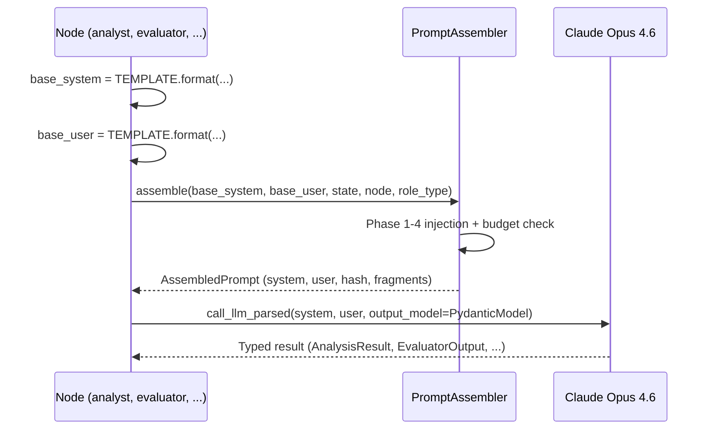

| 호출 함수 | 출력 타입 | 용도 |
|-----------|----------|------|
| `call_llm_parsed()` | Pydantic model | **주력** — Anthropic `messages.parse()` 구조화 출력 |
| `call_llm()` | `str` | 텍스트 생성 (내러티브, 코멘터리) |
| `call_llm_json()` | `dict` | 레거시 JSON 파싱 (fallback) |

**무결성 보장**: 모든 템플릿에 SHA-256[:12] 핀 해시 저장. CI `verify_prompt_integrity()`로 의도치 않은 변경 감지 (Karpathy P4 Ratchet).

---

## Safety & HITL

자율 에이전트의 안전을 보장하는 다층 게이트 시스템.

| 계층 | 메커니즘 | 설명 |
|------|----------|------|
| **Tool 분류** | SAFE / STANDARD / WRITE / DANGEROUS | 4-tier safety classification (`definitions.json`) |
| **HITL 승인** | DANGEROUS 도구 실행 전 사용자 확인 | `run_bash` 등 위험 명령 차단 |
| **MCP 세션 승인** | 서버별 최초 1회 승인, 세션 내 캐시 | `_mcp_approved_servers` |
| **Bash 차단** | 9종 위험 패턴 자동 거부 | `rm -rf /`, `sudo`, fork bomb 등 |
| **서브에이전트** | `auto_approve=True`이나 DANGEROUS/WRITE 제외 | 자식도 위험 도구는 승인 필수 |
| **Error Recovery 제외** | DANGEROUS/WRITE 도구 자동 복구 안 함 | 안전 게이트 우회 방지 |
| **Grounding Truth** | tool_result 기반 출처 인용 강제 | 미확인 정보 생성 금지 |

---

## Extensibility

### Tool & MCP

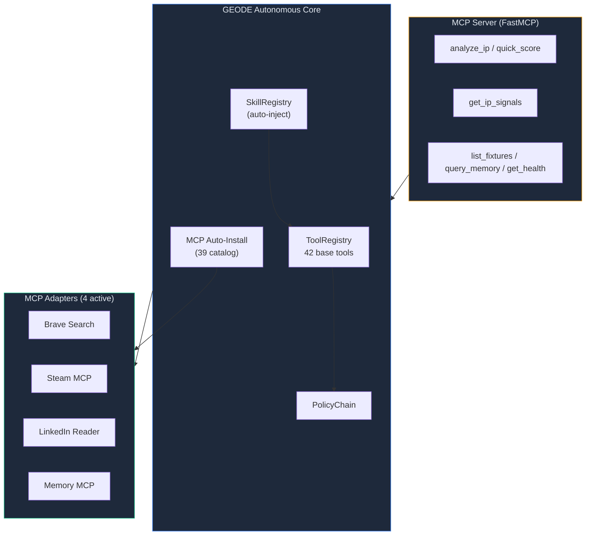

- **42 base tools** — `web_fetch`, `general_web_search`, `youtube_search`, `read_document` 등 범용 도구 + `category`/`cost_tier` 메타데이터
- **MCP Adapters** — Brave Search, Steam, LinkedIn, Memory (env var 비어있으면 graceful skip)
- **MCP Server** — `uv run python -m core.mcp_server` 로 GEODE를 외부 에이전트에서 호출 가능 (6 tools, 2 resources)
- **Skills** — `.claude/skills/` 자동 발견 + YAML frontmatter 기반 도구 핫 리로드
- **MCP 자동설치** — `install_mcp_server` tool → 39개 카탈로그 검색 + 설치 + `refresh_tools()`

### Domain Plugin

`DomainPort` Protocol로 도메인별 분석 파이프라인을 플러그인으로 교체합니다. 동일한 자율 실행 하네스 위에 게임 IP, 금융, 콘텐츠 등 다양한 도메인 파이프라인을 탑재할 수 있습니다.

```python
# DomainPort Protocol — 도메인 플러그인 인터페이스
class DomainPort(Protocol):
    name: str; version: str; description: str
    def get_analyst_types(self) -> list[str]: ...
    def get_evaluator_types(self) -> list[str]: ...
    def get_scoring_weights(self) -> dict[str, float]: ...
    def get_tier_thresholds(self) -> dict[str, float]: ...
    def get_cause_values(self) -> list[str]: ...
    # ... 12 methods total
```

- **ContextVar 주입**: `set_domain()` / `get_domain()` — 런타임에 도메인 교체
- **동적 로딩**: `load_domain_adapter(name)` — 레지스트리 기반 임포트
- **확장**: `register_domain(name, path)` 후 `DomainPort` Protocol 구현체 교체

### Game IP Domain (Default Plugin)

기본 탑재된 게임 IP 가치 평가 파이프라인. LangGraph StateGraph 기반 9-node 토폴로지.

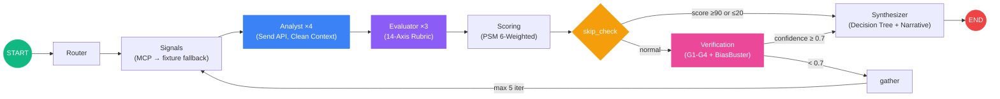

#### 4 Analysts (Send API 병렬)

| Analyst | 역할 | Clean Context |
|---------|------|---------------|
| `game_mechanics` | 게임 메커니즘 적합성 평가 | `analyses` 필드 제외 (앵커링 방지) |
| `player_experience` | 플레이어 경험/감성 분석 | 동일 |
| `growth_potential` | 성장 잠재력/시장 확장성 | 동일 |
| `discovery` | 발견 가능성/접근성 분석 | 동일 |

#### 3 Evaluators (14-Axis Rubric)

| Evaluator | 축 | 축 ID |
|-----------|-----|-------|
| `quality_judge` | 8축 | A, B, C, B1, C1, C2, M, N |
| `hidden_value` | 3축 | D (Discovery), E (Exposure), F (Fandom) |
| `community_momentum` | 3축 | J, K, L |

Prospect Mode (비게임화 IP): `prospect_judge` 1개 (9축: G, H, I, O, P, Q, R, S, T).

#### Scoring Formula

```
Final = (0.25×PSM + 0.20×Quality + 0.18×Recovery + 0.12×Growth + 0.20×Momentum + 0.05×Dev)
        × (0.7 + 0.3 × Confidence/100)

Tier: S ≥ 80, A ≥ 60, B ≥ 40, C < 40
```

#### Cause Classification (Decision Tree)

D-E-F 축 기반 코드 분류 (LLM이 아닌 룰 기반):

| 조건 | 분류 | 권장 조치 |
|------|------|----------|
| D≥3, E≥3 | `conversion_failure` | 전환 최적화 |
| D≥3, E<3 | `undermarketed` | 마케팅 강화 |
| D≤2, E≥3 | `monetization_misfit` | 수익 모델 재설계 |
| D≤2, E≤2, F≥3 | `niche_gem` | 니치 커뮤니티 육성 |
| D≤2, E≤2, F≤2 | `discovery_failure` | 노출 확대 |

#### Verification (5-Layer)

| Layer | 메커니즘 | 기준 |
|-------|----------|------|
| **G1-G4** | Schema, Range, Grounding, 2σ Consistency | 구조적 무결성 |
| **BiasBuster** | 6 bias types (REAE framework), CV-based fast path | CV < 0.05 → anchoring flag |
| **Cross-LLM** | Claude Opus 4.6 + GPT-5.4, Krippendorff's α | agreement ≥ 0.67 |
| **Confidence Gate** | 신뢰도 판정 | ≥ 0.7 → proceed, else loopback (max 5) |
| **Rights Risk** | IP 권리 리스크 | CLEAR / NEGOTIABLE / RESTRICTED |

#### Core Fixtures (golden set)

| IP | Tier | Score | Cause | Genre |
|----|------|-------|-------|-------|
| Berserk | S | 81.3 | conversion_failure | Dark Fantasy |
| Cowboy Bebop | A | 68.4 | undermarketed | SF Noir |
| Ghost in the Shell | B | 51.6 | discovery_failure | Cyberpunk |

**Steam Fixtures**: 201개 추가 게임 데이터 (`core/fixtures/steam/`).

### LangSmith Observability

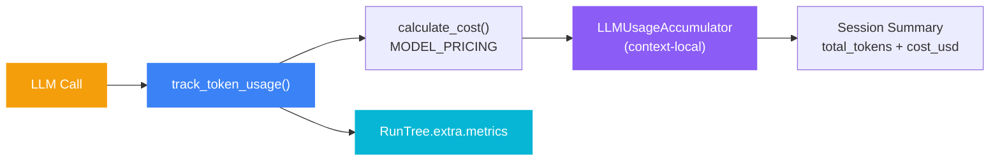

| 항목 | 설명 |
|------|------|
| **track_token_usage()** | 각 LLM 호출 후 input/output 토큰 수 + cache hit 기록 |
| **calculate_cost()** | `MODEL_PRICING` dict 기반 비용 산출 (input/output/cache 단가 × 토큰) |
| **LLMUsageAccumulator** | `contextvars` 기반 세션 내 토큰/비용 누적, context-local 격리 |
| **조건부 활성화** | `LANGCHAIN_TRACING_V2=true` + `LANGCHAIN_API_KEY` 설정 시만 tracing 활성 |

<details>
<summary>Prompt Caching / Checkpoint / Dynamic Tools</summary>

**Prompt Caching**: Anthropic `cache_control: {"type": "ephemeral"}` 적용. 시스템 프롬프트와 루브릭 캐시로 40-60% 비용 절감.

**Checkpoint**: `SqliteSaver`로 파이프라인 상태 영속화. 장애 시 마지막 체크포인트부터 재개.

**Dynamic Tools**: `ToolRegistry` + `get_agentic_tools()` — 플러그인 런타임 등록. MCP 자동설치 후 `refresh_tools()` 핫 리로드.

</details>

---

## Usage

### Interactive Mode

```bash
uv run geode
```

**슬래시 커맨드:**

| Command | Alias | Description |
|---------|-------|-------------|
| `/analyze <IP>` | `/a` | IP 분석 (Domain Plugin) |
| `/search <query>` | `/s` | 검색 |
| `/report <IP> [fmt]` | `/rpt` | 리포트 생성 (md/html/json) |
| `/list` | | IP 목록 (Domain Plugin) |
| `/batch [--top N]` | `/b` | 배치 분석 |
| `/compare <A> <B>` | | 비교 분석 |
| `/schedule <cron>` | `/sched` | 작업 스케줄 |
| `/mcp status\|tools\|reload\|add` | | MCP 관리 |
| `/skills` | | 스킬 목록/상세 |
| `/status` | | 시스템 상태 |
| `/model` | | LLM 모델 선택 |
| `/verbose` | | 상세 출력 토글 |
| `/quit` | `/q` | 종료 |

**자연어 입력 (리서치 에이전트):**

```
> 최근 AI 에이전트 프레임워크 트렌드 조사해줘       → 웹 리서치 + 요약
> 이 사람 LinkedIn 프로필 분석해줘                  → LinkedIn MCP 호출
> YouTube에서 LangGraph 관련 영상 찾아서 요약해줘    → youtube_search + 요약
> 이 URL 내용 요약하고 핵심 포인트 정리해줘          → web_fetch + 분석
> 매주 월요일 AI 뉴스 브리핑 스케줄 잡아줘           → NL 스케줄 생성
> arXiv에서 RAG 관련 최신 논문 찾아줘               → arXiv MCP 검색
> LinkedIn MCP 달아줘                              → MCP 자동설치
```

**자연어 입력 (Game IP Domain Plugin):**

```
> Berserk 분석해           → LLM 분석 / dry-run
> 소울라이크 찾아줘         → 장르 검색
> Berserk vs Cowboy Bebop  → 비교 분석
```

### CLI Mode

```bash
# 범용 리서치 쿼리
uv run geode "최근 AI 에이전트 프레임워크 트렌드 조사해줘"
uv run geode "이 URL 요약해줘: https://example.com/article"
uv run geode "매주 월요일 AI 뉴스 브리핑 스케줄 잡아줘"

# Domain Plugin: 게임 IP 분석
uv run geode analyze "Berserk"                    # CLI 분석
uv run geode search "사이버펑크"                   # 장르 검색
uv run geode report "Berserk" -f html -o out.html # HTML 리포트
uv run geode batch --top 5                        # 배치 분석
```

---

## Configuration

`.env` 파일로 설정합니다 (전체 목록: `core/config.py`):

| Variable | Default | Description |
|----------|---------|-------------|
| **LLM** | | |
| `ANTHROPIC_API_KEY` | | Claude API 키 |
| `OPENAI_API_KEY` | | GPT API 키 (Cross-LLM) |
| `GEODE_MODEL` | `claude-opus-4-6` | 기본 LLM 모델 |
| `GEODE_ENSEMBLE_MODE` | `primary_only` | 앙상블 모드 (`primary_only` / `cross`) |
| **Pipeline** | | |
| `GEODE_CONFIDENCE_THRESHOLD` | `0.7` | 신뢰도 게이트 |
| `GEODE_MAX_ITERATIONS` | `5` | 최대 재분석 반복 |
| `GEODE_PLAN_AUTO_EXECUTE` | `false` | 계획 자율 실행 모드 |
| `GEODE_INTERRUPT_NODES` | | 중간 개입 노드 |
| `GEODE_CHECKPOINT_DB` | `geode_checkpoints.db` | Checkpoint DB 경로 |
| **MCP** | | |
| `GEODE_STEAM_MCP_URL` | | Steam MCP 서버 URL |
| `GEODE_BRAVE_API_KEY` | | Brave Search API 키 |
| **Observability** | | |
| `LANGCHAIN_TRACING_V2` | `false` | LangSmith tracing |
| `LANGCHAIN_API_KEY` | | LangSmith API 키 |

## Testing

```bash
uv run pytest                                        # 전체 (2530+ passed)
uv run pytest tests/test_e2e_live_llm.py -v -m live  # Live E2E
uv run ruff check core/ tests/                       # Lint
uv run mypy core/                                    # Type check (134 files)
uv run bandit -r core/ -c pyproject.toml             # Security
```

## Project Structure

```
core/
├── cli/                        # CLI + NL Router + Agentic Loop + Sub-Agent
│   ├── __init__.py             # Typer app, REPL, pipeline execution
│   ├── agentic_loop.py         # while(tool_use) multi-round execution + Token Guard
│   ├── error_recovery.py       # ErrorRecoveryStrategy (retry → alternative → fallback → escalate)
│   ├── sub_agent.py            # SubAgentManager + SubAgentResult + ErrorCategory
│   ├── tool_executor.py        # Tool dispatch + HITL approval gate
│   ├── nl_router.py            # Natural language intent classification
│   ├── conversation.py         # Multi-turn sliding-window (max 200 turns, server-side clear_tool_uses)
│   ├── bash_tool.py            # Shell execution + HITL safety gate
│   ├── batch.py                # Batch analysis (ThreadPoolExecutor)
│   ├── commands.py             # Slash command dispatch (20 actions)
│   ├── search.py               # IP search engine (synonym expansion)
│   └── startup.py              # Readiness check, Graceful Degradation
├── config.py                   # Settings (pydantic-settings, 57 vars)
├── state.py                    # GeodeState (TypedDict + Pydantic models)
├── graph.py                    # LangGraph StateGraph + skip_check node
├── runtime.py                  # GeodeRuntime (production DI wiring)
├── infrastructure/
│   ├── ports/                  # LLMClientPort, SignalEnrichmentPort, DomainPort
│   └── adapters/
│       ├── llm/                # ClaudeAdapter, OpenAIAdapter
│       └── mcp/                # Steam, Brave, LinkedIn + CompositeSignalAdapter + catalog (39)
├── llm/                        # LLM client (prompt caching, streaming, cost tracking)
├── memory/                     # 4-Tier: SOUL → User Profile → Organization → Project → Session
├── nodes/                      # Pipeline nodes (router, signals, analyst, evaluator, scoring, verification, gather, synthesizer)
├── orchestration/
│   ├── hooks.py                # HookSystem (30 events + async atrigger)
│   ├── goal_decomposer.py      # GoalDecomposer (compound request → sub-goal DAG)
│   ├── plan_mode.py            # DRAFT → APPROVED → EXECUTING (MANUAL / AUTO)
│   ├── task_system.py          # TaskGraph DAG (dependency, cycle detection)
│   ├── coalescing.py           # CoalescingQueue (250ms dedup window)
│   ├── isolated_execution.py   # IsolatedRunner (MAX_CONCURRENT=5)
│   └── ...                     # planner, bootstrap, lane_queue, run_log, etc.
├── automation/                 # Feedback loop, drift detection, scheduler, triggers
├── domains/                    # Domain plugin adapters (GameIPDomain)
├── tools/                      # Tool Protocol + Registry + Policy + definitions.json
├── verification/               # Guardrails (G1-G4) + BiasBuster + Rights Risk
├── extensibility/              # Report generation + Skills + AgentRegistry
├── fixtures/                   # Fixture data (3 core IPs + 201 Steam)
├── auth/                       # API key rotation, cooldown, profiles
├── ui/                         # Rich console + Claude Code-style agentic UI
└── mcp_server.py               # FastMCP server (6 tools, 2 resources)
```

## Design Choices

- **Natural language first.** 자연어 한 줄이 입력이고, 에이전트가 도구 선택부터 결과 종합까지 자율적으로 수행한다. 리서치, 요약, 스케줄링, 분석 -- 도메인을 가리지 않는다.
- **`while(tool_use)` as primitive.** 모든 자율 행동은 하나의 루프에서 나온다. 서브에이전트도, 계획 실행도, 배치 분석도 전부 AgenticLoop 인스턴스. 추상화가 아닌 구체적 실행 단위.
- **Port/Adapter DI.** 모든 인프라는 `Protocol` 포트 + `contextvars` 주입. LLM, 메모리, MCP 전부 교체 가능. 테스트에서 mock 주입, 프로덕션에서 실제 어댑터.
- **도메인은 플러그인.** `DomainPort` Protocol 구현체를 교체하면 게임 IP, 금융, 의료, 콘텐츠 등 어떤 도메인이든 동일한 자율 하네스 위에 탑재할 수 있다.
- **Safety by default.** 자율 에이전트는 위험하다. DANGEROUS 도구는 항상 사용자 승인, Error Recovery에서도 제외, 서브에이전트에서도 제외. 안전 게이트 우회 경로가 없다.
- **Graceful degradation.** API 키 없으면 dry-run, MCP 미연결이면 fixture fallback, LLM 실패하면 retry chain. 어떤 상태에서든 에이전트는 멈추지 않는다.

## Development Workflow

기능 구현 시 **재귀개선 루프**를 따릅니다. 각 단계에서 실패/품질 저하 발견 시 이전 단계로 돌아갑니다.

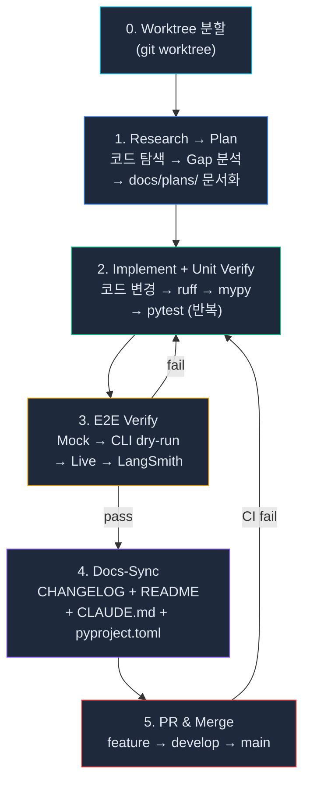

| 단계 | 활동 | 재귀 조건 |
|------|------|-----------|
| **0. Worktree** | `git worktree add`로 격리된 작업 공간 생성 | — |
| **1. Research → Plan** | 기존 코드 탐색, 외부 패턴 참조, Gap 분석, `docs/plans/`에 계획 문서 | — |
| **2. Implement + Unit Verify** | 최소 단위 코드 변경 → `ruff check` → `mypy` → `pytest` | 테스트 실패 시 수정 후 반복 |
| **3. E2E Verify** | Mock E2E → CLI `--dry-run` → Live E2E → LangSmith 트레이스 확인 | 어떤 단계든 실패 시 **2번으로 복귀** |
| **4. Docs-Sync** | CHANGELOG, README, CLAUDE.md, pyproject.toml 수치/버전 동기화 | — |
| **5. PR & Merge** | feature → develop → main (GitFlow). CI 실패 시 수정 루프 | CI 실패 시 **2번으로 복귀** |

**품질 게이트** (모두 통과 필수):

| 게이트 | 명령어 | 기준 |
|--------|--------|------|
| Lint | `uv run ruff check core/ tests/` | 0 errors |
| Type | `uv run mypy core/` | 0 errors |
| Test | `uv run pytest tests/ -q` | 2530+ pass |
| Live | `uv run pytest tests/test_e2e_live_llm.py -v -m live` | All pass |

## License

Internal use only.
