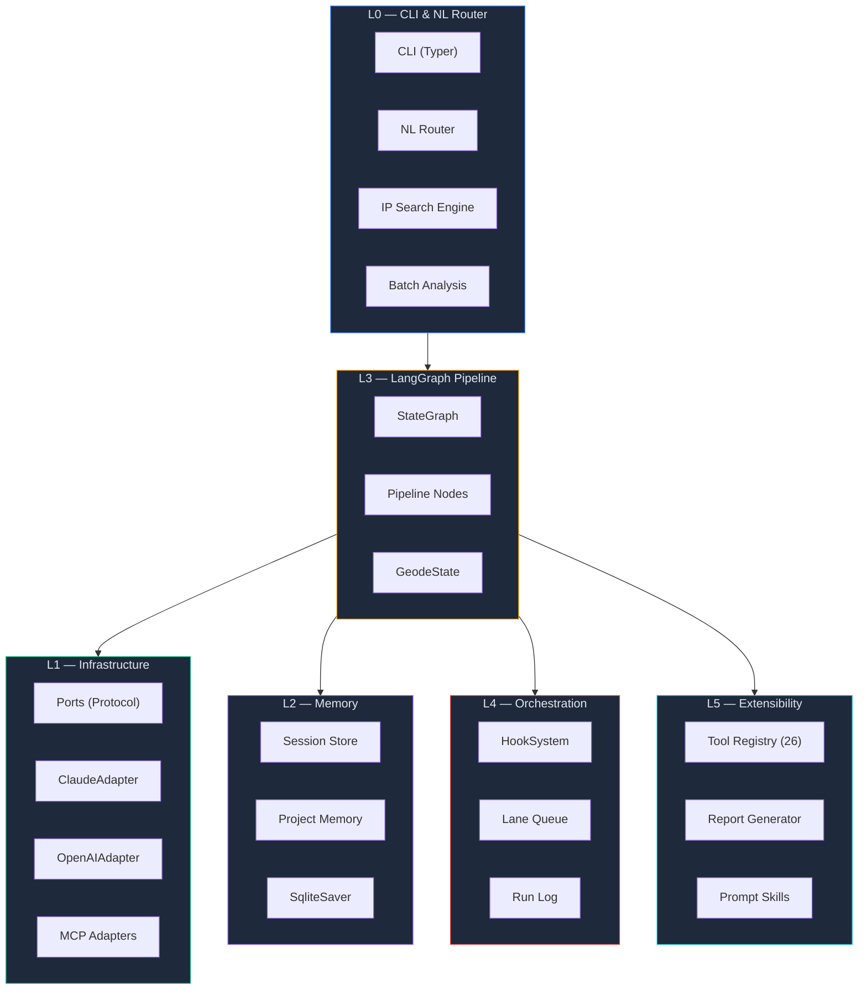
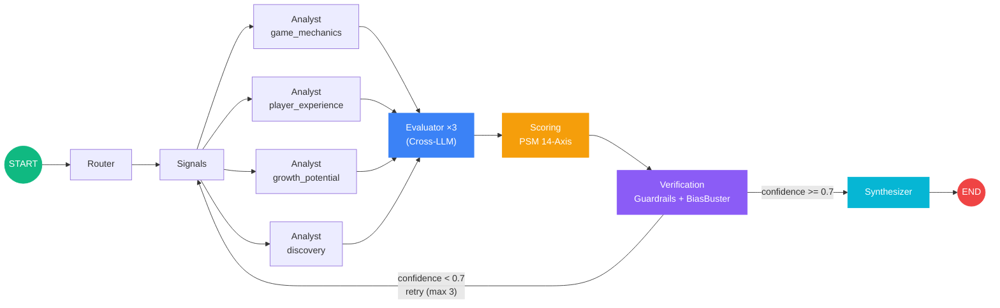
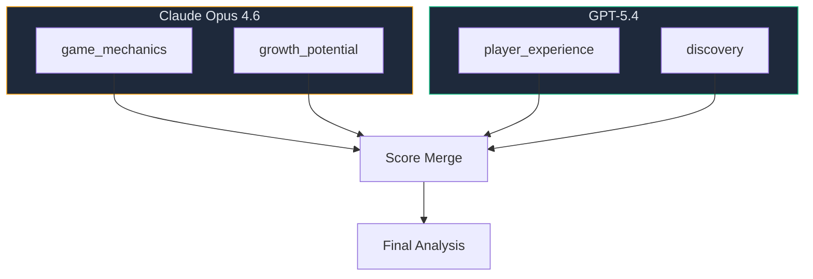
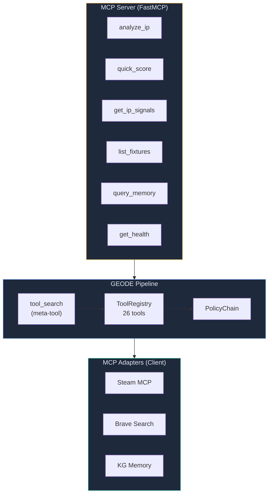

# GEODE v0.7.0 — Undervalued IP Discovery Agent

LangGraph 기반 저평가 IP 발굴 에이전트.
미디어 IP(애니메이션, 만화 등)의 게임화 잠재력을 6-Layer 아키텍처로 분석하고, PSM 14-Axis 루브릭으로 평가합니다.

## Features

| Feature | Description |
|---------|-------------|
| **6-Layer Pipeline** | Router → Signals → Analysts → Evaluators → Scoring → Verification → Synthesis |
| **Agentic Loop** | `while(tool_use)` 멀티 라운드 실행 (max 10 rounds), multi-intent 자동 chaining |
| **Multi-turn Context** | 슬라이딩 윈도우 대화 기록 (max 20 turns), 대명사 해석 + follow-up |
| **HITL Bash** | 셸 명령 실행 + 위험 패턴 차단 (9종) + 사용자 승인 게이트 |
| **Sub-Agent** | 병렬 태스크 위임 (`IsolatedRunner`, MAX_CONCURRENT=5) |
| **14-Axis Rubric** | PSM(Prospect Scoring Model) 기반 정량 평가 |
| **Cross-LLM Ensemble** | Claude Opus 4.6 + GPT-5.4 듀얼 평가, `cross` / `primary_only` 모드 |
| **Prompt Caching** | Anthropic `cache_control` 적용, 40-60% 비용 절감 |
| **26 Tool Protocol** | ToolRegistry + PolicyChain + NodeScopePolicy + `run_bash` + `delegate_task` |
| **MCP Adapters** | Steam, Brave Search, KG Memory 외부 데이터 소스 연결 |
| **MCP Server** | FastMCP 기반 6 tools + 2 resources (다른 에이전트에서 GEODE 호출) |
| **Prompt Templates** | `.md` 템플릿 8종 + YAML/JSON 설정 분리 (content/code separation) |
| **Batch Analysis** | 멀티 IP 동시 분석, Rich 테이블 렌더링 |
| **Streaming Output** | `--stream` 플래그로 실시간 진행 표시 |
| **자연어 입력** | 한국어/영어 자유 입력 (NL Router intent classification) |
| **Report Generation** | HTML/JSON/Markdown 다중 포맷, 외부 템플릿 |
| **Graceful Degradation** | API 키 없으면 자동 dry-run, 있으면 LLM 분석 |
| **Project Memory** | `.claude/MEMORY.md` + `rules/`로 분석 맥락 유지 |
| **Checkpoint** | SqliteSaver 기반 파이프라인 상태 영속화 |
| **Feedback Loop** | Confidence < 0.7이면 자동 재분석 (최대 3회) |
| **Pre-commit Hooks** | ruff lint/format + mypy + bandit + standard hooks |
| **1879 Tests** | 115 modules, pytest + ruff + mypy strict + bandit 전체 통과 |

## Architecture

### 6-Layer Architecture



### Pipeline Flow



### Cross-LLM Ensemble



### MCP & Tool Architecture



## Installation

```bash
uv sync
```

## Quick Start

```bash
# 인터랙티브 모드 (권장)
uv run geode

# IP 분석 (API 키 있으면 LLM 호출, 없으면 자동 dry-run)
uv run geode analyze "Berserk"

# 명시적 dry-run (API 키 있어도 LLM 호출 안 함)
uv run geode analyze "Berserk" --dry-run

# Streaming 분석
uv run geode analyze "Berserk" --stream

# 배치 분석
uv run geode batch --top 5

# 리포트 생성
uv run geode report "Berserk" --format html --output berserk.html

# MCP 서버 실행
uv run python -m core.mcp_server
```

## Setup

```bash
# 1. 환경 변수 설정
cp .env.example .env

# 2. .env 편집 — API 키 입력
ANTHROPIC_API_KEY=sk-ant-...

# 3. Full 분석 실행
uv run geode analyze "Cowboy Bebop"
```

API 키 없이 시작하면 자동으로 dry-run 모드로 전환됩니다 (API 키 설정 시 LLM 분석 자동 활성화):

```
  ✓ Dry-Run Analysis
  ✓ IP Search
  ✗ LLM Analysis (ANTHROPIC_API_KEY not set)

  API key not configured — dry-run mode only
```

## Usage

### Interactive Mode

```bash
uv run geode
```

**슬래시 커맨드:**

| Command | Alias | Description |
|---------|-------|-------------|
| `/analyze <IP>` | `/a` | IP 분석 (API 키 유무에 따라 자동 모드 결정) |
| `/run <IP>` | `/r` | IP 분석 (동일) |
| `/search <query>` | `/s` | IP 검색 |
| `/report <IP> [fmt]` | `/rpt` | 리포트 생성 (md/html/json) |
| `/list` | | IP 목록 |
| `/generate [count]` | `/gen` | 합성 데모 데이터 생성 |
| `/model` | | LLM 모델 선택 |
| `/key [value]` | | API 키 설정 |
| `/auth` | | 인증 프로필 관리 |
| `/batch [--top N]` | `/b` | 배치 분석 |
| `/status` | | 시스템 상태 (모델, API 키, 메모리) |
| `/compare <A> <B>` | | 두 IP 비교 분석 |
| `/schedule <cron>` | | 배치 스케줄 설정 |
| `/trigger <event>` | | 이벤트 트리거 (drift scan 등) |
| `/verbose` | | 상세 출력 토글 |
| `/help` | | 도움말 |
| `/quit` | `/q` | 종료 |

**자연어 입력:**

```
> Berserk 분석해           → LLM 분석 (API 키 있을 때) / dry-run (없을 때)
> 소울라이크 찾아줘         → 장르 검색
> Berserk vs Cowboy Bebop  → 비교 분석
> Berserk 리포트 생성해     → 리포트 생성
> 뭐가 있어?               → IP 목록
> 시스템 상태              → 상태 확인
> API 키 설정해            → API 키 설정
> 스케줄 걸어줘            → 배치 스케줄
```

### CLI Mode

```bash
geode analyze "Berserk"                          # LLM 분석 (API 키 있을 때)
geode analyze "Berserk" --dry-run                 # 명시적 dry-run
geode analyze "Berserk" --stream                  # streaming output
geode analyze "Berserk" --verbose                 # 상세 출력
geode analyze "Cowboy Bebop" --skip-verification  # 검증 생략
geode batch --top 5                               # 상위 5개 배치 분석
geode batch --genre "Dark Fantasy"                # 장르 필터 배치
geode report "Berserk"                            # Markdown summary
geode report "Berserk" -f html -o berserk.html    # HTML 파일 저장
geode search "사이버펑크"                          # 검색
geode list                                        # 목록
```

### MCP Server

GEODE를 MCP 서버로 실행하여 다른 에이전트에서 호출할 수 있습니다:

```bash
uv run python -m core.mcp_server
```

**제공 도구:** `analyze_ip`, `quick_score`, `get_ip_signals`, `list_fixtures`, `query_memory`, `get_health`

**리소스:** `geode://fixtures`, `geode://soul`

## Available IPs

| IP | Tier | Score | Genre |
|----|------|-------|-------|
| Berserk | S | 82.2 | Dark Fantasy |
| Cowboy Bebop | A | 69.4 | SF Noir |
| Ghost in the Shell | B | 54.0 | Cyberpunk |

## Project Structure

```
core/
├── cli/                        # CLI + NL Router + Agentic Loop
│   ├── __init__.py             # Typer app, REPL, pipeline execution
│   ├── agentic_loop.py         # while(tool_use) multi-round execution
│   ├── bash_tool.py            # Shell execution + HITL safety gate
│   ├── batch.py                # Batch analysis (ThreadPoolExecutor)
│   ├── commands.py             # Slash command dispatch
│   ├── conversation.py         # Multi-turn sliding-window context
│   ├── nl_router.py            # Natural language intent classification
│   ├── search.py               # IP search engine (synonym expansion)
│   ├── startup.py              # Readiness check, Graceful Degradation
│   ├── sub_agent.py            # Parallel task delegation
│   └── tool_executor.py        # Tool dispatch + HITL approval gate
├── auth/                       # Auth profile management + rotation
├── automation/                 # Feedback loop, confidence gating
├── config/                     # Externalized domain config (YAML)
│   ├── evaluator_axes.yaml     # 14-Axis rubric definitions + anchors
│   └── cause_actions.yaml      # Cause→Action mappings
├── config.py                   # Settings (pydantic-settings)
├── data/                       # Synthetic data generation
├── extensibility/              # Report generation + templates
│   └── templates/              # HTML/Markdown report templates
├── fixtures/                   # Fixture data (3 core IPs + 200 Steam)
├── graph.py                    # LangGraph StateGraph definition
├── infrastructure/
│   ├── ports/                  # LLMClientPort, SignalEnrichmentPort, etc.
│   └── adapters/
│       ├── llm/                # ClaudeAdapter, OpenAIAdapter
│       └── mcp/                # Steam, Brave, KGMemory MCP adapters
├── llm/                        # LLM client (prompt caching, streaming)
│   └── prompts/                # Prompt templates (.md) + axes config
│       ├── analyst.md          # Analyst system prompt template
│       ├── evaluator.md        # Evaluator prompt template
│       ├── synthesizer.md      # Synthesizer prompt template
│       ├── cross_llm.md        # Cross-LLM verification prompts
│       ├── axes.py             # Axis definitions (loads from YAML)
│       └── ...                 # biasbuster, commentary, router, tool_augmented
├── mcp_server.py               # FastMCP server (6 tools, 2 resources)
├── memory/                     # 3-Tier memory system
├── nodes/                      # Pipeline nodes (7 stages)
├── orchestration/
│   ├── hooks.py                # HookSystem (23 events)
│   ├── hook_discovery.py       # Plugin-based hook loading
│   ├── isolated_execution.py   # Concurrent runner (semaphore)
│   ├── task_system.py          # DAG-based task graph
│   └── ...                     # lane_queue, run_log, plan_mode, etc.
├── runtime.py                  # GeodeRuntime (production wiring)
├── state.py                    # GeodeState (TypedDict + Pydantic models)
├── tools/                      # Tool Protocol + Registry + Policy
│   ├── registry.py             # ToolRegistry (26 tools + tool_search)
│   ├── definitions.json        # Centralized tool definitions (19 tools)
│   ├── tool_schemas.json       # Parameter schemas for signal/analysis tools
│   ├── policy.py               # PolicyChain + NodeScopePolicy
│   └── ...                     # analysis, signal_tools, data_tools, etc.
├── ui/                         # Rich console + panels + streaming
└── verification/               # Guardrails + BiasBuster + Rights Risk
```

## Testing

```bash
# 전체 테스트
uv run pytest

# 상세 출력
uv run pytest -v

# 특정 모듈
uv run pytest tests/test_graph.py
uv run pytest tests/test_batch.py
uv run pytest tests/test_mcp_server.py

# 품질 검사
uv run ruff check core/ tests/
uv run ruff format --check core/ tests/
uv run mypy core/
uv run bandit -r core/ -c pyproject.toml

# Pre-commit (전체 검사)
uv run pre-commit run --all-files
```

## Configuration

`.env` 파일로 설정합니다:

| Variable | Default | Description |
|----------|---------|-------------|
| `ANTHROPIC_API_KEY` | | Claude API 키 |
| `OPENAI_API_KEY` | | GPT API 키 (Cross-LLM) |
| `GEODE_MODEL` | `claude-opus-4-6` | 기본 LLM 모델 |
| `GEODE_ENSEMBLE_MODE` | `primary_only` | 앙상블 모드 (`primary_only` / `cross`) |
| `GEODE_VERBOSE` | `false` | 상세 출력 |
| `GEODE_CHECKPOINT_DB` | `geode_checkpoints.db` | Checkpoint DB 경로 |
| `GEODE_STEAM_MCP_URL` | | Steam MCP 서버 URL |
| `GEODE_BRAVE_MCP_URL` | | Brave Search MCP 서버 URL |
| `GEODE_BRAVE_API_KEY` | | Brave Search API 키 |
| `GEODE_KG_MEMORY_MCP_URL` | | KG Memory MCP 서버 URL |

## License

Internal use only.
