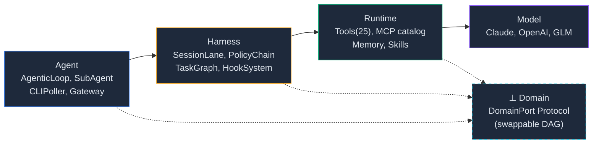

<p align="center">
  
</p>

<p align="center">
  
  
  
  <a href="https://github.com/mangowhoiscloud/geode/actions"></a>
</p>

<p align="center">
  
  
  
  
</p>

<p align="center">
  <a href="https://mangowhoiscloud.github.io/geode/portfolio">Portfolio</a>
  ·
  <a href="https://mangowhoiscloud.github.io/geode/docs">Docs</a>
  ·
  <a href="README.ko.md">한국어</a>
</p>

# GEODE v0.95.0 — Long-running Autonomous Execution Harness

A general-purpose autonomous agent for exploratory research and signal prediction. You ask in plain language. GEODE plans, calls tools, and reports — for one prompt or a long-running session.

> **Have a ChatGPT Plus, Pro, Business, Edu, or Enterprise plan?** Route GEODE through that subscription. No API key. [Subscription setup ↓](#path-a--chatgpt-subscription-the-recommended-path-for-openai-users)
>
> **Claude Pro / Max?** Anthropic's terms (effective 2026-01-09) forbid third-party harness from using the Claude Code OAuth token, so GEODE doesn't read it. Use an Anthropic API key instead (Path B). Your Console account is the same; new accounts get $5 free credit.

---

## What you can ask it

Copy-paste these to see what it does:

```
"Summarize the latest RAG papers on arXiv from this month"
"Find LinkedIn job postings that match my profile and rank them"
"Schedule a 9 AM standup reminder every weekday"
"Watch hacker news for posts about LangGraph and DM me on Slack"
"Compare gpt-5.5 vs claude-opus-4.7 for code review"
```

GEODE chooses the right tools (web search, file ops, MCP servers, sub-agents), runs them, and shows you the answer with sources and cost.

---

## Setup in 5 minutes

### Prerequisites — what you need first

<details>
<summary><strong>Don't know what these are?</strong> Click here for a 1-line explainer of each.</summary>

- **Python 3.12+** — the language GEODE is written in. Most laptops don't have a recent enough version. Install from [python.org/downloads](https://www.python.org/downloads/) (download the macOS or Windows installer, click through).
- **Git** — how you copy GEODE's source code from GitHub. Mac: comes with Xcode Command Line Tools (`xcode-select --install`). Windows: [git-scm.com](https://git-scm.com/) installer.
- **uv** — a fast Python package manager (replaces pip). One-line install: copy the `curl` command below into Terminal/PowerShell.

If any of these fail, see [Troubleshooting](#troubleshooting) below.
</details>

| Tool | Install | Verify |
|------|---------|--------|
| Python 3.12+ | [python.org/downloads](https://www.python.org/downloads/) | `python3 --version` |
| Git | [git-scm.com](https://git-scm.com/) | `git --version` |
| uv | `curl -LsSf https://astral.sh/uv/install.sh \| sh` | `uv --version` |

### Step 1 — Get the code

```bash
git clone https://github.com/mangowhoiscloud/geode.git
cd geode
uv sync                              # installs dependencies (~30s)
uv tool install -e . --force         # makes `geode` available everywhere
```

### Step 2 — Run the setup wizard

```bash
geode setup
```

The wizard offers three paths: ChatGPT subscription (auto-detects `codex auth login` if you've already done it), API key (paste and go), or skip into dry-run mode for now. Pick whichever fits.

If you already ran `codex auth login` before installing GEODE, you can skip this step entirely — the next `geode` invocation will detect the token and start.

### Step 3 — Pick a path (manual reference)

The wizard above covers everything below; this section exists as a manual reference for what each path actually does.

---

#### Path A — ChatGPT subscription (the recommended path for OpenAI users)

Codex CLI signs you in once. GEODE picks up the token from `~/.codex/auth.json` and uses it for every call. Your subscription pays the bill; nothing extra to set up.

```bash
brew install codex                    # macOS  (or: npm install -g @openai/codex)
codex auth login                      # opens a browser; sign in with your ChatGPT account
geode                                 # done. GEODE finds the token automatically.
```

**Plans that work** (per the [official Codex CLI docs](https://developers.openai.com/codex/cli/)): Plus, Pro, Business, Edu, Enterprise.

**Quotas** (OpenAI-published, per 5-hour window): roughly 15–80 messages on Plus, up to 1,600 on Pro 20x. Edu and Enterprise have no fixed cap; usage scales with your workspace credits. Your admin needs to flip "Allow members to use Codex Local" before sign-in works on those tiers.

**Tier notes**:
- **gpt-5.5 is subscription-only.** API-key users (Path B) top out at gpt-5.4. If you want 5.5, you need ChatGPT.
- **ChatGPT Team is not currently supported** by Codex CLI. Team users should use Path B.
- **Free / Go** appear on OpenAI's pricing page but aren't listed in the CLI README. Treat them as best-effort; if it works, great, but no promises.

When the token nears expiry, GEODE refreshes it on its own (120 seconds before, plus a 401 retry). You shouldn't see this happen.

**Why Claude Pro isn't a Path A option.** Anthropic's terms changed on 2026-01-09: third-party tools may no longer reuse the Claude Code OAuth token. GEODE doesn't read `~/.claude/.credentials.json` to keep your account safe. The only Anthropic path GEODE accepts is an API key (Path B). ([Reference](https://www.theregister.com/2026/02/20/anthropic_clarifies_ban_third_party_claude_access))

---

#### Path B — API key (pay-as-you-go)

For Anthropic users (any tier, including Claude Pro / Max — OAuth isn't available), ChatGPT Team users, and anyone without a paid OpenAI subscription. You buy API credits directly. New Anthropic accounts get $5 in free credits, enough for hundreds of prompts.

**Get an Anthropic API key** (4 clicks):

1. Sign up at [console.anthropic.com](https://console.anthropic.com)
2. Top-right menu → **Settings** → **API Keys**
3. Click **Create Key** → name it "geode" → **Copy** the `sk-ant-...` string
4. Save it where GEODE will find it:

```bash
mkdir -p ~/.geode
echo 'ANTHROPIC_API_KEY=sk-ant-paste-your-key-here' > ~/.geode/.env
chmod 600 ~/.geode/.env
```

Want OpenAI or ZhipuAI GLM instead? Add `OPENAI_API_KEY=sk-proj-...` or `ZAI_API_KEY=...` to the same file. GEODE picks whichever is available.

**What it costs in practice.** A single prompt runs around 3,000 tokens, about $0.01. A research session with ten tool calls usually lands between $0.05 and $0.30. Your $5 free credit lasts roughly 500 prompts. Set `cost_limit_usd=5` in `.env` if you want a hard cap.

---

### Step 4 — Run

```bash
geode                                                # interactive chat
geode "what's new in AI today?"                      # one-shot prompt
```

You should see something like:

```
● AgenticLoop
  ✓ web_search → ok (1.5s)
  ✓ web_fetch → ok (1.1s)

  Today's top AI stories:
  • Anthropic released Claude Opus 4.7 with 1M-token context...
  • OpenAI's GPT-5.5 system card published; pricing matches 4.6...
  • LangGraph 0.6 ships native streaming for tool calls...

  ✢ Worked for 8s · claude-opus-4-7 · ↓2.1k ↑412 · $0.018
```

If you see this, you're done. If you see an error, run `geode doctor` for a diagnosis or jump to [Troubleshooting](#troubleshooting).

### Other useful commands

```bash
geode about           # version, model, registered auth, paths, daemon status
geode doctor          # 7-check bootstrap diagnosis with fix hints
geode setup --reset   # wipe ~/.geode/.env and re-run the wizard
```

---

### Updating

Pull the latest code, sync dependencies, then re-install the editable binary so `geode` resolves to the new source:

```bash
git pull                              # from inside the geode/ directory
uv sync                               # update dependencies
uv tool install -e . --force          # rebuild the `geode` console-script
```

If `geode serve` was running, restart it so the daemon loads the new code:

```bash
pgrep -f "geode serve" | xargs -r kill   # stop the running daemon
geode serve &                            # restart in the background
geode version                            # confirm the new version
```

---

### Uninstalling

Removes the `geode` console-script and its tool environment. The `geode/` source folder and `~/.geode/` config + runtime directory are kept — delete them separately if you want a clean wipe.

```bash
# 1) Stop the daemon (skip if you never ran `geode serve`)
pgrep -f "geode serve" | xargs -r kill

# 2) Remove the console-script + tool environment
uv tool uninstall geode

# 3) (optional) wipe config + runtime data
rm -rf ~/.geode                                 # everything: .env, config.toml, auth.toml,
                                                # diagnostics/, logs/, mcp/, projects/, runs/, …

# 4) (optional) drop the source clone
rm -rf path/to/geode
```

Verify the removal:

```bash
which geode               # should print nothing
uv tool list | grep geode # should print nothing
pgrep -f "geode serve"    # should print nothing
```

---

### Optional — Hook into Slack / Discord / Telegram

Once GEODE works in your terminal, you can let it answer on the messaging channels you already use:

```bash
geode serve                          # starts the always-on Gateway daemon
```

Configure channel bindings in `.geode/config.toml` (Slack bot token, Discord webhook, etc.). See [docs/setup.md → Gateway](docs/setup.md#gateway) for the full setup. After that, mentioning the bot in a channel routes the message into the same agent loop you use locally.

---

## Troubleshooting

Run `geode doctor` first. It checks Python version, `geode` PATH, `~/.geode/.env`, Codex CLI OAuth, ProfileStore, the serve socket, and `~/.local/bin` PATH — and prints a concrete fix command for each failure. The expanders below cover the same ground in narrative form.

<details>
<summary><strong>"command not found: python3"</strong> — Python isn't installed or isn't on your PATH.</summary>

Mac: `xcode-select --install` then `brew install python@3.12`. Windows: download the installer from [python.org](https://www.python.org/downloads/) and check "Add Python to PATH" during setup. Verify with `python3 --version` — must be 3.12 or higher.
</details>

<details>
<summary><strong>"command not found: uv"</strong> — uv isn't on your PATH yet.</summary>

The install script writes uv to `~/.local/bin`. Either restart your terminal, or run `source ~/.bashrc` (bash) / `source ~/.zshrc` (zsh). Verify with `uv --version`.
</details>

<details>
<summary><strong>"command not found: geode"</strong> — the global install hasn't run.</summary>

Run `uv tool install -e . --force` from the `geode/` directory. This puts the `geode` command in `~/.local/bin/`. If that directory isn't on your PATH, add `export PATH="$HOME/.local/bin:$PATH"` to your shell config.
</details>

<details>
<summary><strong>"401 Unauthorized" or "Invalid API key"</strong> — wrong key, expired key, or wrong file location.</summary>

Check `cat ~/.geode/.env` and confirm the key starts with `sk-ant-` (Anthropic), `sk-proj-` (OpenAI), or `id.secret` (ZhipuAI GLM). Make sure there are no extra spaces or quote characters. If you used the ChatGPT subscription path (Path A), re-run `codex auth login` to refresh the OAuth token.
</details>

<details>
<summary><strong>"Address already in use" when running `geode serve`</strong> — daemon is already running.</summary>

`ps aux | grep "geode serve"` to find the PID, then `kill <PID>`. Or use `geode serve --port <other>` to pick a different port.
</details>

<details>
<summary><strong>The model doesn't seem to use my tools / runs in circles.</strong></summary>

Check `geode model` — some models are better at tool use than others. Default is `claude-opus-4-7` (best). If you're on `gpt-5.5`, set `effort: "high"` in `.geode/config.toml`. Run `tail -f /tmp/geode-serve.log` to see what the model is actually doing.
</details>

<details>
<summary><strong>I want to see what GEODE is doing under the hood.</strong></summary>

`tail -f ~/.geode/logs/serve.log` (or whichever log file you redirected when starting `geode serve` manually). Every LLM call, tool invocation, and decision is logged with timing. The `core.audit.diagnostics` fa4 channel writes per-month files under `~/.geode/diagnostics/<YYYY-MM>.log` for cross-process traces.
</details>

<details>
<summary><strong>How do I update?</strong></summary>

```bash
cd geode
git pull origin main
uv sync
uv tool install -e . --force
```
</details>

---

## What's inside

| Feature | What it does |
|---------|-------------|
| **`while(tool_use)` loop** | The single primitive every behavior is built on. Sub-agents, plans, batches — all instances of the same loop |
| **25 tools + MCP catalog** | Web search, file ops, scheduling, memory, calendar, Slack/Discord, Korean job-board search, plus the Anthropic-published MCP registry (200+ servers, cached at `~/.geode/mcp/registry-cache.json`). Auto-installed on first use |
| **3-provider failover** | Anthropic + OpenAI + ZhipuAI. Subscription OAuth (Codex) auto-detected; pay-as-you-go API keys also work; failover is in-provider only (no surprise cross-vendor charges, v0.53.0 governance) |
| **5-tier memory** | SOUL (0) → User Profile (0.5) → Organization (1) → Project (2) → Session (3). Persistent, survives daemon restarts |
| **Plan-mode + audit trail** | `create_plan` + `approve_plan` + `list_plans` for multi-step work. Disk-persistent (`.geode/plans.json`), survives restarts |
| **Long-running daemon** | `geode serve` runs as background daemon. Slack / Discord / Telegram pollers + scheduler tick + IPC for the thin CLI |
| **Sub-agents** | Full inheritance of parent capability, depth/cost guards, isolation by Lane |
| **5-layer verification** | Guardrails G1-G4 + BiasBuster + Cross-LLM (Krippendorff α ≥ 0.67) + Confidence Gate + Rights Risk |
| **Domain-specific DAG (swappable)** | Pipelines (research, multi-axis evaluation, synthesis) plug in via the `DomainPort` Protocol. Ships with one reference DAG out-of-the-box; replace it for any exploratory-research / signal-prediction problem |

---

## How GEODE compares

Grounded against the actual state of each frontier harness as of May 2026: **Claude Code v2.1.72** (build 2026-03-09), **Codex CLI v0.130.0** (released 2026-05-08), **OpenClaw v2026.5.12-beta.1**, **GEODE v0.95.0**. Marker legend: ✅✅ leader on the axis · ✅ supported · ⚠️ partial / qualified · ❌ absent · n/a not applicable.

### A. Runtime posture — how the agent stays alive

| | Claude Code | Codex CLI | OpenClaw | **GEODE** |
|---|---|---|---|---|
| Always-on daemon | ❌ per-invocation | ⚠️ opt-in `codex remote-control` (v0.130+) | ✅✅ launchd / systemd control plane | ✅ `geode serve` daemon |
| Native scheduler (cron) | ❌ (claude.ai web-only) | ❌ (Codex Cloud Automations only — [issue #8317](https://github.com/openai/codex/issues/8317)) | ✅ `cron add/edit/list` CLI | ✅ cron + event triggers |
| Thin CLI ↔ daemon IPC | ❌ | ⚠️ remote-control server mode | ✅ Gateway / Agent split | ✅ IPC server (v0.48+) |
| Sub-agent isolation | ✅ Agent tool + `run_in_background` | ✅ `multi_agent` feature, default `max_threads=6` | ✅✅ Lane Queue + Session bindings | ✅ Lane + depth / cost guard |
| Session resume / fork | ✅ JSONL transcripts | ✅ `/resume` + `/fork` slash commands | ✅ Session bindings with TTL | ✅ session resume (v0.21+) |

### B. Channels & UX surfaces — how it reaches users

| | Claude Code | Codex CLI | OpenClaw | **GEODE** |
|---|---|---|---|---|
| Slack | ❌ (MCP plugin possible) | ⚠️ Codex Cloud only, not CLI | ✅ Socket Mode, first-class | ✅ Socket Mode, first-class |
| Discord / Telegram / other chat | ❌ | ❌ | ✅✅ 23+ channels (Discord, Telegram, WhatsApp, Signal, iMessage, Teams, Matrix, Feishu, LINE, ...) | ✅ Discord + Telegram pollers |
| IDE plugin | ❌ (Chrome MCP extension only) | ✅✅ VS Code · JetBrains · Cursor · Windsurf | ❌ | ❌ |
| Web UI | ✅ claude.ai/code | ✅ Codex Cloud | ⚠️ WebChat plugin | ❌ (docs site only) |
| MCP server catalog | ✅ first-class | ✅ first-class | ✅ first-class | ✅ Anthropic-published registry (200+ servers, cached at `~/.geode/mcp/registry-cache.json`) |

### C. LLM provider & cost governance

| | Claude Code | Codex CLI | OpenClaw | **GEODE** |
|---|---|---|---|---|
| Multi-provider failover | ✅ Anthropic + AWS Bedrock + Google Vertex (env routing) | ✅✅ OpenAI + Azure + Bedrock + Ollama + any OpenAI-compatible (`model_providers` config) | ✅ `auth.order` cooldown-based auto-failover | ✅ Anthropic + OpenAI + ZhipuAI, in-provider only |
| Subscription OAuth tier | ✅ Pro / Max | ✅✅ Plus · Pro · Business · Edu · Enterprise | ⚠️ OpenAI + Gemini onboarding | ⚠️ ChatGPT only (Plus / Pro / Business / Edu / Enterprise) — Anthropic ToS (2026-01-09) blocks third-party Claude OAuth |
| Token / cost budget guard | ⚠️ cache token tracking only | ⚠️ retry caps (`request_max_retries`) | ⚠️ partial | ✅ **200K token guard** (v0.40), explicit budget governance |
| Context overflow handling | ✅ autocompaction | ⚠️ skills progressive disclosure (~2% budget) + fork | ✅ compaction + transcript streaming (252 MB → 27 MB peak) | ✅✅ **5-layer context overflow** (v0.39+) |
| Cross-vendor failover policy | ❌ | ⚠️ manual `model_providers` switch | ✅ automatic | ❌ by design (v0.53 governance — no surprise cross-vendor charges) |

### D. Persistence, memory & verification

| | Claude Code | Codex CLI | OpenClaw | **GEODE** |
|---|---|---|---|---|
| Memory tiers | ⚠️ 3 (user / project / local settings merge) | ✅ hierarchical AGENTS.md (global `~/.codex/` + repo + nested dirs) | ⚠️ session-scoped | ✅✅ **5-tier** (SOUL · User · Org · Project · Session) |
| Disk-persistent plans | ✅ TodoWrite persistence | ⚠️ via resumable threads | ✅ task registry | ✅ `.geode/plans.json` |
| Permission / sandbox layers | ✅ 3-mode (default / auto / bypass) + Confirmation UI | ✅ `sandbox_mode` 3-level (read-only / workspace-write / danger-full-access) | ✅✅ Policy Chain (40+ audit surfaces) | ✅ Policy Chain + tool gates |
| Multi-layer guardrails | ⚠️ permission + hooks | ⚠️ hooks + sandbox | ✅ `audit.runtime` engine | ✅✅ **5-layer verification** (G1-G4 + BiasBuster + Cross-LLM Krippendorff α ≥ 0.67 + Confidence Gate + Rights Risk) |
| Hook event count | ⚠️ 5 (PreToolUse / PostToolUse / SessionStart / Notification / ConfigChange) | ⚠️ 6 (SessionStart / UserPromptSubmit / PreToolUse / PostToolUse / PermissionRequest / Stop) | ✅ 5 event types · many bundled handlers | ✅✅ **58 events** (`docs/architecture/hook-system.md`) |

### E. Extensibility & observability

| | Claude Code | Codex CLI | OpenClaw | **GEODE** |
|---|---|---|---|---|
| Plugin / extension surfaces | ✅ manifest + marketplace (user / project / local scopes) | ✅ `/plugins` slash command + plugin sharing (v0.130+) | ✅✅ 4 extension points (Channel · Tool · Skill · Hook) via `@openclaw/plugin-sdk` | ✅ `DomainPort` Protocol + plugin loader |
| Skill system | ✅ Deferred tools + SKILL.md manifest | ✅ SKILL.md + progressive disclosure (`.agents/skills/`) | ✅ skill filter + archive upload | ✅ runtime `SkillRegistry` (13 runtime skills) |
| **Swappable domain DAG** | ❌ | ❌ | ⚠️ flows (channel-setup / doctor / provider — not a DAG abstraction) | ✅✅ `DomainPort` Protocol — pipeline is a first-class extension point |
| Trace / replay / Run Log | ✅ `tengu_*` telemetry + `/insights` HTML | ⚠️ `/status` + `/debug-config` only | ✅ ACP session lineage + Task Registry | ✅ Run Log + Petri eval integration (v0.90+, replaces LangSmith) |
| Cross-LLM verification | ❌ | ❌ | ❌ | ✅✅ Krippendorff α ≥ 0.67 inter-rater agreement gate |

---

Use **Claude Code** or **Codex** for short coding sessions inside an IDE or via cloud sync. Use **OpenClaw** to run a multi-channel chat agent fleet across 23+ messaging surfaces. Use **GEODE** when an agent must work over hours or days on a non-coding domain with multi-tier memory, multi-layer verification, and a swappable domain pipeline.

> Sources — Claude Code v2.1.72 (build 2026-03-09, reverse-engineered reference). Codex CLI v0.130.0 release notes + [developers.openai.com/codex/config-reference](https://developers.openai.com/codex/config-reference) + [github.com/openai/codex](https://github.com/openai/codex). OpenClaw v2026.5.12-beta.1 (1.8M LoC TypeScript). GEODE — `CHANGELOG.md` (`v0.39` context overflow, `v0.40` 200K guard, `v0.85` 4-layer stack, `v0.90` Petri observability).

---

<details>
<summary><strong>Architecture overview</strong> (for contributors)</summary>

GEODE has two control layers:

- **Scaffold (production)** — Claude Code + `CLAUDE.md` + development Skills + CI Hooks. The external harness that produces GEODE's code and guarantees quality.
- **GEODE Runtime (agent)** — `while(tool_use)` loop + 25 tools + 13 runtime Skills + 58 runtime Hooks + 5-Layer Verification. The internal system of the autonomously executing agent.

4-Layer Stack (Model → Runtime → Harness → Agent) + Sub-Agent System + 5-Tier Memory.



| Layer | Core | Entry points |
|-------|------|--------------|
| **Agent** | AgenticLoop, SubAgentManager, CLIPoller, Gateway | `core/cli/`, `core/gateway/` |
| **Harness** | SessionLane, LaneQueue(global:8), PolicyChain, TaskGraph, HookSystem(58) | `core/orchestration/`, `core/hooks/` |
| **Runtime** | ToolRegistry(25), MCP Catalog (200+ via Anthropic registry, 5 locally configured by default), Skills(13), Memory(5-Tier), PlanStore | `core/tools/`, `core/memory/`, `core/orchestration/plan_store.py` |
| **Model** | ClaudeAdapter, OpenAIAdapter, CodexAdapter, GLMAdapter | `core/llm/` |
| **⊥ Domain** | `DomainPort` Protocol — domain-specific DAG plugged in via Port (cross-cutting). One reference DAG ships in the repo; replace for any exploratory-research / signal-prediction domain | `core/domains/` |

`.geode/` — agent context lifecycle (5-tier hierarchy assembled into every LLM call):

```
Tier 0    SOUL            GEODE.md — agent identity + constraints
Tier 0.5  User Profile    ~/.geode/user_profile/ — role, expertise, language
Tier 1    Organization    Cross-project data (signals, history)
Tier 2    Project         .geode/memory/PROJECT.md — analysis history (LRU-50)
Tier 3    Session         In-memory — conversation, tool results, plans
```

```
.geode/
├── config.toml         # Gateway, MCP servers, model
├── memory/             # T2: Project Memory (LRU rotate)
├── rules/              # Auto-generated domain rules
├── vault/              # Permanent artifacts (reports, research)
├── skills/             # 15 runtime skills (3-tier visibility)
├── plans.json          # Disk-persistent PlanStore (v0.53.3)
└── result_cache/       # Pipeline LRU (SHA-256, 24h TTL)
```

[Full architecture →](docs/architecture/) | [Hook System →](docs/architecture/hook-system.md) | [Wiring Audit →](docs/architecture/wiring-audit-matrix.md)

</details>

<details>
<summary><strong>Development workflow (Scaffold)</strong></summary>

CANNOT (guardrails) before CAN (freedom). 7-step workflow + quality gates. CI ratchet — 5 jobs (pytest, mypy, ruff, import-order, test-count) must pass before any merge. Test count is monotonically increasing only.

| Gate | Command | Target |
|------|---------|--------|
| Lint | `uv run ruff check core/ tests/` | 0 errors |
| Type | `uv run mypy core/` | 0 errors |
| Test | `uv run pytest tests/ -q` | 4700+ pass |

See [CONTRIBUTING.md](CONTRIBUTING.md) and [docs/workflow.md](docs/workflow.md).

</details>

<details>
<summary><strong>Why — motivation</strong></summary>

In 2026, AI coding agents have made remarkable progress. They read, write, fix, and test code autonomously. But how much of real work is actually coding? Research, document analysis, scheduling, notifications, data pipelines, multi-axis evaluation for decision-making — the space requiring autonomous execution *beyond* coding is far broader.

Yet the core of all autonomous behavior is surprisingly simple: an LLM calls tools, observes results, decides the next action — a `while(tool_use)` loop. Claude Code, Codex, OpenClaw — all frontier harnesses stand on this primitive. GEODE generalizes it: domain-agnostic harness, swappable `DomainPort` DAGs for whatever exploratory or signal-prediction problem you're solving.

</details>

---

## License

Apache License 2.0 — [LICENSE](./LICENSE)
