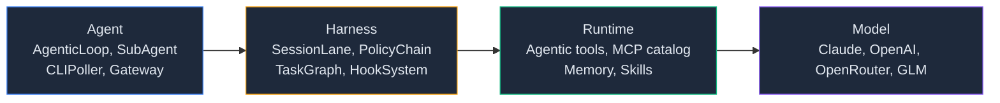

<p align="center">
  
</p>
<p align="center">
  <sub>Geodi · 22×12 dot sprite · <code>core/ui/geodi_art.py</code></sub>
</p>

<p align="center">
  
  
  <a href="https://github.com/mangowhoiscloud/geode/actions"></a>
  <a href="https://github.com/mangowhoiscloud/geode/releases/latest"></a>
</p>

<p align="center">
  
  <a href="https://github.com/mangowhoiscloud/geode-eval-artifacts/tree/a32abcbf78ab6100ea1e85540a2ace9436dc6f76/terminalbench/results-smoke/terminalbench21-astra-high-openssl-smoke-20260904t202725z"></a>
  
  
</p>

<p align="center">
  <a href="https://mangowhoiscloud.github.io/geode/">Landing</a>
  ·
  <a href="https://mangowhoiscloud.github.io/geode/docs">Docs</a>
  ·
  <a href="https://mangowhoiscloud.github.io/geode/self-improving/">Self-improving hub</a>
  ·
  <a href="https://github.com/mangowhoiscloud/geode-eval-artifacts">Eval artifacts</a>
  ·
  <a href="README.ko.md">한국어</a>
</p>

# GEODE v1.0.27 — Autonomous Agent Runtime + Evaluation Substrate

A general-purpose runtime for autonomous tool work. You ask in plain language;
GEODE plans, calls tools, and reports, for one prompt or a long-running session.
An experimental outer loop mutates scaffold candidates and admits them only
through evidence-bound safety gates; the public record does not yet establish
sustained self-improvement.

> **Experimental status:** SIL (Self-Improving Loop) and Crucible are active
> experiments, not stable production features. Their protocols, promotion
> gates, schemas, and reported results may change as validation continues.

> **Have a ChatGPT Plus, Pro, Business, Edu, or Enterprise plan?** Route GEODE through that subscription. No API key. [Subscription setup ↓](#path-a-chatgpt-subscription-the-recommended-path-for-openai-users)
>
> **Using Anthropic?** GEODE's built-in Anthropic route requires
> `ANTHROPIC_API_KEY`. The former Claude CLI subscription integration is retired;
> legacy settings fail before dispatch with a migration hint.

---

## One distribution, three boundaries

The `geode-agent` wheel ships four commands without turning the installed
package into a writable workspace:

| Boundary | Responsibility | Commands |
|---|---|---|
| `core` | Runtime, operator CLI, daemon, MCP server | `geode`, `geode-mcp` |
| `evals` | Audits, benchmark adapters, evidence production | `geode-eval` |
| `evolve` | Experimental scaffold search and Crucible | `geode-evolve` |

Installed code and bundled assets are immutable. Runtime and experiment output
lives under `~/.geode/` (or an explicit state override), while mutation and
promotion require a writable GEODE Git checkout. See the
[distribution lifecycle](docs/architecture/immutable-distribution-lifecycle.md).

## Evaluation evidence

GEODE does not collapse unlike runs into one product score. Every published
result stays bound to its harness revision, task set, model route, effort,
timeout, and attempt lineage.

| Track | Public evidence boundary |
|---|---|
| [Tau2](https://mangowhoiscloud.github.io/geode/docs/benchmarks/tau2) | Native-user and GEODE-user tracks remain separate; incomplete or quota-contaminated runs are retained without receiving aggregate-score authority. |
| [MCPMark](https://mangowhoiscloud.github.io/geode/docs/benchmarks/mcpmark) | Service coverage, historical available-services results, corrected paired observations, and full-Verified limitations remain explicit. |
| [Terminal-Bench 2.1](https://mangowhoiscloud.github.io/geode/docs/benchmarks/terminal-bench) | The GPT-6 Astra subscription E2E is a one-task, one-repetition smoke: reward 1/1 and verifier 6/6, with no suite, rank, or general-availability claim. |

Raw receipts and privacy-reviewed trajectories live in the
[evaluation artifact repository](https://github.com/mangowhoiscloud/geode-eval-artifacts).

---

## Experimental scaffold-optimization loop

GEODE includes an experimental **non-parametric scaffold-optimization loop**.
It mutates candidates across the system prompt, tool policy, task decomposition,
reflection, skills, agent contracts, and tool descriptions; it never updates
model weights. Fitness is an adversarial **safety** audit, not a capability
benchmark: Petri-grade, multi-dimensional, with a hard floor on critical safety
dimensions, so any change that regresses one is rejected. The public evidence
currently demonstrates rejection and invalidation discipline, not repeated
core promotion or monotonic improvement.

The selection contract is a **(1+1) champion chain**: mutate, audit, permit
promotion on a real gain, otherwise revert. Two loops run together. An inner
agentic loop runs a task; an outer loop evaluates scaffold candidates. The loop
lineage (Promptbreeder, STOP, ADAS, DGM, GEPA) is well established. GEODE
re-aims it from capability to safety and from weights to scaffolding. It is a
recombination of known mechanisms, not a new primitive.

- **[The closed loop →](https://mangowhoiscloud.github.io/geode/docs/capabilities/autoresearch)**: autoresearch, mutate / audit / promote / revert end to end
- **[Two loops →](https://mangowhoiscloud.github.io/geode/docs/concepts/two-loops)**: the inner-vs-outer mental model
- **[Lineage and positioning →](https://mangowhoiscloud.github.io/geode/docs/capabilities/lineage)**: where GEODE sits among prior self-improving loops
- **[Self-improving hub →](https://mangowhoiscloud.github.io/geode/self-improving/)**: live generations, mutations, and promotion decisions
- **[Petri bundle →](https://mangowhoiscloud.github.io/geode/self-improving/petri-bundle/)**: the live safety-audit transcript viewer

---

## What you can ask it

Copy-paste these to see what it does:

```
"Summarize the latest RAG papers on arXiv from this month"
"Find LinkedIn job postings that match my profile and rank them"
"Schedule a 9 AM standup reminder every weekday"
"Watch hacker news for posts about LangGraph and DM me on Slack"
"Compare gpt-5.5 vs claude-opus-4.7 for code review"
"Find launch emails, summarize them, and add the follow-up to my Calendar"
```

GEODE chooses the right tools (web search, file ops, MCP servers, sub-agents), runs them, and shows you the answer with sources and cost.

---

## Setup in 5 minutes

### Prerequisites: what you need first

<details>
<summary><strong>Don't know what these are?</strong> Click here for a 1-line explainer of each.</summary>

- **Python 3.12+**: the language GEODE is written in. Most laptops don't have a recent enough version. Install from [python.org/downloads](https://www.python.org/downloads/) (download the macOS or Windows installer, click through).
- **Git**: how you copy GEODE's source code from GitHub. Mac: comes with Xcode Command Line Tools (`xcode-select --install`). Windows: [git-scm.com](https://git-scm.com/) installer.
- **uv**: a fast Python package manager (replaces pip). One-line install: copy the `curl` command below into Terminal/PowerShell.

If any of these fail, see [Troubleshooting](#troubleshooting) below.
</details>

| Tool | Install | Verify |
|------|---------|--------|
| Python 3.12+ | [python.org/downloads](https://www.python.org/downloads/) | `python3 --version` |
| Git | [git-scm.com](https://git-scm.com/) | `git --version` |
| uv | `curl -LsSf https://astral.sh/uv/install.sh \| sh` | `uv --version` |

### Step 1: Install GEODE

GEODE's PyPI distribution is **`geode-agent`**. It installs the **`geode`** command.

```bash
uv tool install geode-agent
geode version
```

If the current release has not been published to PyPI yet, or you are developing GEODE itself, install from source instead:

```bash
git clone https://github.com/mangowhoiscloud/geode.git
cd geode
uv sync                              # installs dependencies (~30s)
uv tool install -e . --force         # makes `geode` available everywhere
```

### Step 2: Run the setup wizard

```bash
geode setup
```

The wizard offers three paths: ChatGPT subscription, API key (paste and go), or skip into dry-run mode for now. It can also import an existing `~/.codex/auth.json` credential, but GEODE does not execute Codex CLI for inference.

If Codex CLI has already signed in with ChatGPT, the next `geode` invocation
can detect that token. Codex CLI is otherwise optional.

### Step 3: Pick a path (manual reference)

The wizard above covers everything below; this section exists as a manual reference for what each path actually does.

---

#### Path A: ChatGPT subscription (the recommended path for OpenAI users)

GEODE signs in directly through `/login openai` and calls the Codex backend with
ChatGPT OAuth through its in-process `codex-oauth` adapter. It can also read an
existing `~/.codex/auth.json` credential without spawning the Codex CLI executable.

```bash
geode                                 # start GEODE
# inside the session: /login openai   # ChatGPT device-code login
```

**Plans that work** (per the [official Codex pricing page](https://developers.openai.com/codex/pricing/)): Plus, Pro, Business, Edu, Enterprise.

**Quotas** (OpenAI-published, per 5-hour window): roughly 15–80 messages on
Plus and up to 1,600 on Pro 20x. Enterprise and Edu limits depend on whether
the workspace uses flexible credits or legacy per-seat limits.

**Tier notes**:
- **[GPT-6 Astra](https://developers.openai.com/api/docs/models/gpt-6-astra) is rollout-gated.** GEODE recognizes `gpt-6-astra` on both the
  ChatGPT subscription and Platform API lanes. On 2026-09-05, the current
  subscription account completed one canonical Terminal-Bench 2.1 task with
  reward 1/1 and no retry or fallback. The
  [immutable E2E smoke](https://github.com/mangowhoiscloud/geode-eval-artifacts/tree/a32abcbf78ab6100ea1e85540a2ace9436dc6f76/terminalbench/results-smoke/terminalbench21-astra-high-openssl-smoke-20260904t202725z)
  proves this account-scoped route, not general account availability.
- **gpt-5.5 is subscription-only.** GPT-5.6 Sol/Terra/Luna and GPT-5.4 are dual-lane: GEODE uses ChatGPT OAuth when a subscription profile is active and the Platform API when an API-key profile is selected. If you want 5.5, you need ChatGPT.
- Existing Codex CLI credentials remain importable, but `codex-cli` is not a GEODE inference backend.
- **Free / Go** appear on OpenAI's pricing page but aren't listed in the CLI README. Treat them as best-effort; if it works, great, but no promises.

When the token nears expiry, GEODE refreshes it on its own (120 seconds before, plus a 401 retry). You shouldn't see this happen.

**Anthropic API-key path.** `/login anthropic` now configures
`ANTHROPIC_API_KEY`. Legacy `claude-cli` or Anthropic `oauth` settings are read
only to emit a migration error; GEODE never launches the Claude CLI.

---

#### Path B: API key (pay-as-you-go)

For Anthropic users who want the recommended third-party integration path,
ChatGPT Team users, and anyone without a paid OpenAI subscription. You buy API
credits directly.

**Get an Anthropic API key** (4 clicks):

1. Sign up at [console.anthropic.com](https://console.anthropic.com)
2. Top-right menu → **Settings** → **API Keys**
3. Click **Create Key** → name it "geode" → **Copy** the `sk-ant-...` string
4. Save it where GEODE will find it:

```bash
mkdir -p ~/.geode
echo 'ANTHROPIC_API_KEY=sk-ant-paste-your-key-here' > ~/.geode/.env
chmod 600 ~/.geode/.env
```

Want OpenAI, OpenRouter, or ZhipuAI GLM instead? Add
`OPENAI_API_KEY=sk-proj-...`, `OPENROUTER_API_KEY=sk-or-v1-...`, or
`ZAI_API_KEY=...` to the same file. Select an OpenRouter model with an exact
reference such as `/model openrouter/anthropic/claude-sonnet-4`.

**Cost control.** Provider prices vary by model and workload. Check the
provider's current pricing, then set a hard cap in `~/.geode/config.toml`:

```toml
[cost]
limit_usd = 5
```

---

### Step 4: Run

```bash
geode                                                # interactive chat
# Then type: what's new in AI today?
```

You should see something like:

```
  ✓ web_search → ok (1.5s)
  ✓ web_fetch → ok (1.1s)

  Today's top AI stories:
  • Anthropic released Claude Opus 4.8 with 1M-token context...
  • OpenAI's GPT-5.5 system card published; pricing matches 4.6...
  • LangGraph 0.6 ships native streaming for tool calls...

  ✢ Worked for 8s · claude-opus-4-8 · ↓2.1k ↑412 · $0.018
```

If you see this, you're done. If you see an error, run `geode doctor` for a diagnosis or jump to [Troubleshooting](#troubleshooting).

### Other useful commands

```bash
geode about           # version, model, registered auth, paths, daemon status
geode doctor          # 7-check bootstrap diagnosis with fix hints
geode update          # uv install: latest patch; source install: pull + rebuild
geode update --latest # explicitly allow minor/major uv package upgrades
geode uninstall       # remove runtime data and the installed CLI
geode setup --reset   # wipe ~/.geode/.env and re-run the wizard
```

Optional integration: connect Gmail, Calendar, Drive, Docs, Sheets, Tasks,
and Contacts with `/login google`; see [Connect Google Workspace](https://mangowhoiscloud.github.io/geode/docs/run/google-workspace).

---

### Updating

GEODE detects whether it is a persistent uv tool or an editable source install:

```bash
geode update
geode version
```

For a standard registry-backed uv tool, this replaces the stored install request
with a compatible-release constraint and installs the newest patch in the
current major/minor series. Minor and major upgrades require an explicit opt-in:

```bash
geode update --latest
```

For an editable source checkout, `geode update` instead runs `git pull
--ff-only`, `uv sync`, `uv tool install -e . --force`, then `geode version`.
It resolves the actual GEODE checkout from install metadata rather than using
an unrelated current repository; missing metadata is an error, never a cwd
fallback. If `geode serve` was running, GEODE verifies the update before
replacing the live install, leaves it stopped on any update failure, then
confirms the restarted daemon and installed CLI report the same version. Preview either path
without changing files:

```bash
geode update --dry-run
```

Custom uv tool receipts with extras, `--with` packages, constraints, an explicit
Python, or resolver settings stop with a manual-update hint so those settings
are never discarded silently. The hint identifies the receipt and preserves a
recorded source reference instead of silently switching it to PyPI.

---

### Uninstalling

`geode uninstall` removes GEODE runtime data, stops the daemon, and removes the `geode-agent` uv tool install. Preview first if you want to see exactly what would be removed:

```bash
geode uninstall --dry-run
geode uninstall
```

If you only want to remove the PyPI-installed CLI and keep runtime data under `~/.geode/`, use uv directly:

```bash
uv tool uninstall geode-agent
```

Useful partial removal modes:

```bash
geode uninstall --keep-config   # keep .env and config.toml
geode uninstall --keep-data     # keep vault, identity, and user profile data
geode uninstall --force         # skip confirmations for automation
```

Verify removal:

```bash
which geode               # should print nothing
uv tool list | grep geode # should not list geode-agent
pgrep -f "geode serve"    # should print nothing
```

---

### Optional: Hook into Slack / Discord / Telegram

Once GEODE works in your terminal, you can let it answer on the messaging channels you already use:

```bash
geode serve                          # starts the always-on Gateway daemon
```

Put Slack's `SLACK_BOT_TOKEN` (`xoxb-`) and Socket Mode `SLACK_APP_TOKEN` (`xapp-`) in `~/.geode/.env`; put channel bindings, receiver choices, and project-specific Gateway behavior in `.geode/config.toml`. See [Slack Gateway setup](docs/setup.md#slack-gateway) for the full setup. After that, mentioning the bot in a bound channel routes the pushed event into the same agent loop you use locally; later replies in that thread continue the same checkpoint without another mention.

Remote desktop control stays disabled in Gateway sessions unless the operator
explicitly sets `[gateway] allow_computer_use = true`; see the
[computer-use guide](docs/setup.md#optional-computer-use-from-a-bound-channel)
before enabling it for a restricted binding.

The [live Slack E2E receipt](https://github.com/mangowhoiscloud/geode-eval-artifacts/blob/41e15ca262d5953d1c88f4767777331875c57c9f/reports/e2e-validation/2026-08-17-slack-gateway-live-e2e.json)
shows ordinary conversation and a browser-DOM UI task completing through Socket
Mode. Strict pixel `computer_use` captured the desktop but stopped when the
active OpenAI subscription source had no compatible visual grounding; it did
not guess coordinates or silently switch providers. The primary answers used
the subscription route, while post-turn processing also made an auxiliary GLM
PAYG call, so the complete lifecycle is not advertised as subscription-only.

### Optional: Self-improving loop config (`~/.geode/config.toml`)

Tune the autoresearch / seed-generation / petri audit drivers, model picks, dim set, banner thresholds, PAYG fallback policy, by copying the `[self_improving_loop.*]` sections from [`docs/examples/self_improving_loop.config.toml.example`](docs/examples/self_improving_loop.config.toml.example) into `~/.geode/config.toml`. Absent sections fall back to documented defaults. To migrate per-role entries from the legacy `~/.geode/petri.toml`:

```bash
geode config migrate-petri-toml          # dry-run preview
geode config migrate-petri-toml --yes    # append [self_improving_loop.petri.*] to config.toml
```

To run a campaign, start with the quick-start: [docs/self-improving/campaign-quick-start.md](docs/self-improving/campaign-quick-start.md).

---

## Configuration

Secrets live in `.env`, behavior lives in `config.toml`. The two never collide, because `.env` is secrets-only and `config.toml` is behavior-only, so each has a single precedence rule. The detailed path design is in [docs/architecture/storage-hierarchy.md](docs/architecture/storage-hierarchy.md), with a standalone diagram at [docs/diagrams/geode-context-config-paths.html](docs/diagrams/geode-context-config-paths.html).

- The global `~/.geode/.env` is the authoritative secret store. A project `./.env` fills only the keys it lacks and never shadows a global key. An `OPENAI_API_KEY` in `~/.geode/.env` wins even when a project `./.env` leaves it blank.
- The project `./.geode/config.toml` overrides the global `~/.geode/config.toml`. Behavior is tuned per project.
- `~/.geode/auth.toml` stores LLM-provider credential profiles, plan metadata, and provider OAuth account state. Raw API keys still live in `~/.geode/.env`.
- Google Workspace is separate: non-secret account and scope metadata lives in `~/.geode/google/accounts.json`, long-lived secrets in the OS keyring service `geode.google.oauth`, and access tokens only in process memory.
- Runtime history, usage, diagnostics, daemon logs, and per-project private data live under `~/.geode/`. Project context that should travel with a workspace lives under `./.geode/`.

Every field rides one ladder. Higher wins:

```
1. os.environ                      shell exports (session-scoped)
2. global  ~/.geode/.env           secrets: authoritative
3. project ./.env                  fills only the keys global lacks
4. project ./.geode/config.toml    behavior: project wins
5. global  ~/.geode/config.toml
6. built-in defaults
```

`.env` ranks the global file higher, `config.toml` ranks the project file higher. The asymmetry is deliberate: credentials have one home, behavior is tuned per project.

Add or switch a credential:

```bash
geode setup                          # re-run the wizard (subscription OAuth or API key)
/login openai                        # in a session: subscription OAuth
/login google                        # in a session: Google Workspace OAuth
/key openai sk-proj-...              # in a session: paste an API key
/key openrouter sk-or-v1-...         # in a session: OpenRouter credits
echo 'OPENAI_API_KEY=sk-proj-...' >> ~/.geode/.env    # edit the authoritative file
```

When a change does not take effect, run `geode config explain <KEY>`. It prints every layer, marks the winner and any masked layers with file paths, and points at the exact line to edit. `geode about` shows the effective model. Full reference: [Configuration basics](https://mangowhoiscloud.github.io/geode/docs/config/basics).

---

## Troubleshooting

Run `geode doctor` first. It checks Python version, `geode` PATH, `~/.geode/.env`, Codex CLI OAuth, ProfileStore, the serve socket, and `~/.local/bin` PATH, and prints a concrete fix command for each failure. The expanders below cover the same ground in narrative form.

<details>
<summary><strong>"command not found: python3"</strong>, Python isn't installed or isn't on your PATH.</summary>

Mac: `xcode-select --install` then `brew install python@3.12`. Windows: download the installer from [python.org](https://www.python.org/downloads/) and check "Add Python to PATH" during setup. Verify with `python3 --version`, must be 3.12 or higher.
</details>

<details>
<summary><strong>"command not found: uv"</strong>, uv isn't on your PATH yet.</summary>

The install script writes uv to `~/.local/bin`. Either restart your terminal, or run `source ~/.bashrc` (bash) / `source ~/.zshrc` (zsh). Verify with `uv --version`.
</details>

<details>
<summary><strong>"command not found: geode"</strong>, the global install hasn't run.</summary>

For a PyPI install, run `uv tool install geode-agent`. For a source checkout, run `uv tool install -e . --force` from the `geode/` directory. Both paths put the `geode` command in `~/.local/bin/`. If that directory isn't on your PATH, add `export PATH="$HOME/.local/bin:$PATH"` to your shell config.
</details>

<details>
<summary><strong>"401 Unauthorized" or "Invalid API key"</strong>, wrong key, expired key, or wrong file location.</summary>

Inspect the provider entry in `~/.geode/.env` privately in an editor; do not print or paste credentials into logs, chat, or issues. Check for accidental whitespace and verify the key's status in the provider console. If you used the ChatGPT subscription path (Path A), run `/login openai` again inside GEODE.
</details>

<details>
<summary><strong>"Address already in use" when running `geode serve`</strong>, daemon is already running.</summary>

Check which process owns the configured IPC socket and whether it serves another session. Reuse a healthy daemon; stop only a confirmed owned process when a restart is authorized. GEODE uses Unix-socket IPC, not a `serve --port` option. See the [daemon guide](docs/setup.md#geode-serve--unified-daemon).
</details>

<details>
<summary><strong>The model doesn't seem to use my tools / runs in circles.</strong></summary>

Check `geode model`, some models are better at tool use than others. Default is `claude-opus-4-8` (best). If you're on `gpt-5.5`, set `effort: "high"` in `.geode/config.toml`. Run `tail -f ~/.geode/logs/serve.log` to see what the model is actually doing.
</details>

<details>
<summary><strong>I want to see what GEODE is doing under the hood.</strong></summary>

`tail -f ~/.geode/logs/serve.log` (or whichever log file you redirected when starting `geode serve` manually). Every LLM call, tool invocation, and decision is logged with timing. The `core.audit.diagnostics` fa4 channel writes per-month files under `~/.geode/diagnostics/<YYYY-MM>.log` for cross-process traces.
</details>

<details>
<summary><strong>How do I update?</strong></summary>

```bash
geode update          # uv tool: latest patch; source: pull + rebuild
geode update --latest # uv tool: explicitly allow minor/major upgrades
```
</details>

---

## What's inside

| Feature | What it does |
|---------|-------------|
| **`while(tool_use)` loop** | The single primitive every behavior is built on. Sub-agents, plans, batches are all instances of the same loop |
| **Experimental scaffold-optimization loop** | Mutates scaffold candidates, audits each change against an adversarial safety rubric, and permits promotion only on a real gain. The public record currently shows gate discipline, not sustained improvement. See [the closed loop](https://mangowhoiscloud.github.io/geode/docs/capabilities/autoresearch) |
| **Agentic tools + MCP catalog** | Web search, file ops, scheduling, memory, Slack/Discord, the Anthropic-published MCP registry, and optional [Google Workspace](https://mangowhoiscloud.github.io/geode/docs/run/google-workspace) integration. MCP metadata is cached at `~/.geode/mcp/registry-cache.json` |
| **Explicit provider routes** | Anthropic + OpenAI + OpenRouter + ZhipuAI. OpenRouter keeps a separate identity while reusing the Chat Completions transport; its reported charge and serving route are recorded. GEODE never silently crosses providers |
| **5-tier memory** | SOUL (0) → User Profile (0.5) → Organization (1) → Project (2) → Session (3). Persistent, survives daemon restarts |
| **Durable goals + advisory plans** | `/goal` owns explicit empty, active, paused, blocked, and complete states; `/plan` installs an observation-conditioned checklist. Neither grants execution authority, while cognitive replanning remains available after verification failure |
| **Typed decision + visibility controls** | `/grill` admits only acyclic dependency-frontier updates; `/geo` records fetch, retrieval, citation, placement, absorption, quality, and outcome as separate evidence stages without inventing one GEO score |
| **MCP server (`geode-mcp`)** | Exposes GEODE itself as an MCP server (stdio): `run_agent`, `self_improving_status`, `self_improving_propose`/`apply` (2-step confirm gate), `query_memory`, `get_health`. Registered for Claude Code via the repo-shipped `.mcp.json` |
| **Long-running daemon** | `geode serve` runs as background daemon. Slack Socket Mode + Discord / Telegram pollers + scheduler tick + IPC for the thin CLI |
| **Sub-agents** | Full inheritance of parent capability, depth/cost guards, isolation by Lane |
| **Turn verification** | Rule-based per-turn checks (empty turn, tool errors, plan-step mismatch) + opt-in LLM-judge scoring (`core/agent/verify.py`); a verify FAIL triggers replanning |


### Using GEODE as an MCP server

`geode-mcp` (installed with the CLI) speaks MCP over stdio, so any MCP client, Claude Code, Claude Desktop, Cursor, can drive GEODE as a tool. This repo ships `.mcp.json`, so Claude Code sessions opened in this project pick the server up automatically; elsewhere register it with `claude mcp add geode -- geode-mcp`.

Verified 2026-06-11 against the live runtime (initialize handshake, `tools/list`, tool calls):

| Check | Result |
|-------|--------|
| Handshake + 6 tools listed | pass |
| `self_improving_status` / `get_health` / `query_memory` | pass (live data) |
| Server version in handshake | was the mcp SDK's "1.26.0", now reports GEODE's version (the SDK's `FastMCP.__init__` exposes no `version` kwarg; pinned by `tests/core/test_mcp_server_tools.py`) |
| `get_health` credential honesty | `*_configured` only meant "API key present" and read false on OAuth/CLI-lane setups, now also reports `*_credential_source` |
| `run_agent`, `self_improving_propose`/`apply` | not exercised in the automated check (token cost / mutation side effects); `apply` is gated behind a 2-step proposal confirm |

**Remote access (v0.99.171):** `geode-mcp --http [--host H] [--port P]` serves the same tools over the MCP streamable-HTTP transport. Auth is a bearer token from `GEODE_MCP_TOKEN` (a secret, put it in `~/.geode/.env`); clients pass `Authorization: Bearer <token>`. A non-loopback bind without a token is refused at startup, `run_agent` reaches GEODE's full tool surface, so an open bind is a remote-execution surface. For personal cross-device use, SSH needs no setup at all: `claude mcp add geode -- ssh <host> geode-mcp`.

---

## How GEODE compares

A qualitative read on where GEODE sits next to the frontier harnesses (Claude Code, Codex CLI, OpenClaw) as of May 2026. This is about posture, not benchmarks. Marker legend: ✅✅ leader on the axis · ✅ supported · ⚠️ partial / qualified · ❌ absent · n/a not applicable.

<details>
<summary><strong>A. Runtime posture</strong>, how the agent stays alive</summary>

| | Claude Code | Codex CLI | OpenClaw | **GEODE** |
|---|---|---|---|---|
| Always-on daemon | ❌ per-invocation | ⚠️ opt-in `codex remote-control` | ✅✅ launchd / systemd control plane | ✅ `geode serve` daemon |
| Native scheduler (cron) | ⚠️ scheduled cloud agents (`/schedule`, cloud-executed) | ❌ (Codex Cloud Automations only, [issue #8317](https://github.com/openai/codex/issues/8317)) | ✅ `cron add/edit/list` CLI | ✅ cron + event triggers |
| Thin CLI ↔ daemon IPC | ❌ | ⚠️ remote-control server mode | ✅ Gateway / Agent split | ✅ IPC server |
| Sub-agent isolation | ✅ Agent tool + `run_in_background` | ✅ `multi_agent` feature | ✅✅ Lane Queue + Session bindings | ✅ Lane + depth / cost guard |
| Session resume / fork | ✅ JSONL transcripts | ✅ `/resume` + `/fork` slash commands | ✅ Session bindings with TTL | ✅ session resume |

</details>

<details>
<summary><strong>B. Channels & UX surfaces</strong>, how it reaches users</summary>

| | Claude Code | Codex CLI | OpenClaw | **GEODE** |
|---|---|---|---|---|
| Slack | ❌ (MCP plugin possible) | ⚠️ Codex Cloud only, not CLI | ✅ Socket Mode, first-class | ✅ Socket Mode, first-class |
| Discord / Telegram / other chat | ❌ | ❌ | ✅✅ many channels (Discord, Telegram, WhatsApp, Signal, iMessage, Teams, Matrix, Feishu, LINE, ...) | ✅ Discord + Telegram pollers |
| IDE plugin | ✅ VS Code · JetBrains | ✅✅ VS Code · JetBrains · Cursor · Windsurf | ❌ | ❌ |
| Web UI | ✅ claude.ai/code | ✅ Codex Cloud | ⚠️ WebChat plugin | ❌ (docs site only) |
| MCP server catalog | ✅ first-class | ✅ first-class | ✅ first-class | ✅ Anthropic-published registry (cached at `~/.geode/mcp/registry-cache.json`) |

</details>

<details>
<summary><strong>C. LLM provider & cost governance</strong></summary>

| | Claude Code | Codex CLI | OpenClaw | **GEODE** |
|---|---|---|---|---|
| Multi-provider routing | ✅ Anthropic + AWS Bedrock + Google Vertex (env routing) | ✅✅ OpenAI + Azure + Bedrock + Ollama + any OpenAI-compatible (`model_providers` config) | ✅ `auth.order` cooldown-based auto-failover | ✅ Anthropic + OpenAI + OpenRouter + ZhipuAI; no silent cross-provider failover |
| Subscription OAuth tier | ✅ Pro / Max | ✅✅ Plus · Pro · Business · Edu · Enterprise | ⚠️ OpenAI + Gemini onboarding | ChatGPT only; Anthropic uses API keys |
| Token / cost budget guard | ⚠️ cache token tracking only | ⚠️ retry caps (`request_max_retries`) | ⚠️ partial | ✅ explicit token + cost budget governance |
| Context overflow handling | ✅ autocompaction | ⚠️ skills progressive disclosure + fork | ✅ compaction + transcript streaming | ✅✅ layered context-overflow handling |
| Cross-vendor failover policy | ❌ | ⚠️ manual `model_providers` switch | ✅ automatic | ❌ by design (no surprise cross-vendor charges) |

</details>

<details>
<summary><strong>D. Persistence, memory & verification</strong></summary>

| | Claude Code | Codex CLI | OpenClaw | **GEODE** |
|---|---|---|---|---|
| Memory tiers | ✅ CLAUDE.md merge + auto memory (`~/.claude/projects/*/memory`) | ✅ hierarchical AGENTS.md (global `~/.codex/` + repo + nested dirs) | ⚠️ session-scoped | ✅✅ **multi-tier** (SOUL · User · Org · Project · Session) |
| Progress / review plans | ✅ TodoWrite persistence | ✅ turn plan updates | ✅ task registry | ✅ advisory `update_plan` + durable session events |
| Permission / sandbox layers | ✅ default / auto / bypass modes + Confirmation UI | ✅ `sandbox_mode` (read-only / workspace-write / danger-full-access) | ✅✅ Policy Chain across many audit surfaces | ✅ Policy Chain + tool gates |
| Multi-layer guardrails | ⚠️ permission + hooks | ⚠️ hooks + sandbox | ✅ `audit.runtime` engine | ✅ **turn verify** (rule-based + opt-in LLM-judge, `core/agent/verify.py`) → replan on FAIL, plus safety-axis fitness gate in the self-improving loop |
| Hook events | ✅ PreToolUse / PostToolUse / UserPromptSubmit / Stop / SubagentStop / PreCompact / SessionStart / SessionEnd / Notification | ⚠️ SessionStart / UserPromptSubmit / PreToolUse / PostToolUse / PermissionRequest / Stop | ✅ several event types · many bundled handlers | ✅✅ broad event surface (`docs/architecture/hook-system.md`) |

</details>

<details>
<summary><strong>E. Extensibility & observability</strong></summary>

| | Claude Code | Codex CLI | OpenClaw | **GEODE** |
|---|---|---|---|---|
| Plugin / extension surfaces | ✅ manifest + marketplace (user / project / local scopes) | ✅ `/plugins` slash command + plugin sharing | ✅✅ extension points (Channel · Tool · Skill · Hook) via `@openclaw/plugin-sdk` | ✅ runtime SkillRegistry + MCP/tool surfaces |
| Skill system | ✅ Deferred tools + SKILL.md manifest | ✅ SKILL.md + progressive disclosure (`.agents/skills/`) | ✅ skill filter + archive upload | ✅ runtime `SkillRegistry` across bundled/global/project scopes |
| **Swappable pipeline DAG** | ❌ | ❌ | ⚠️ flows (channel-setup / doctor / provider, not a DAG abstraction) | ⚠️ external package responsibility; GEODE core no longer ships a pipeline port |
| Trace / replay / Run Log | ✅ `tengu_*` telemetry + `/insights` HTML | ⚠️ `/status` + `/debug-config` only | ✅ ACP session lineage + Task Registry | ✅ Native RunLog + Petri eval integration |
| Safety-gated scaffold optimization | ❌ | ❌ | ❌ | ⚠️ experimental outer loop: scaffold mutation + adversarial safety audit + (1+1) promote/revert contract; zero public core promotions |
| Cross-provider review | ❌ | ❌ | ❌ | ⚠️ multi-voter cross-provider ranking panel (≥2 providers, `evals/seed_generation/agents/ranker.py`) in the self-improving loop; agreement calibration is WIP |

</details>

---

Use **Claude Code** or **Codex** for short coding sessions inside an IDE or via
cloud sync. Use **OpenClaw** to run a multi-channel chat agent fleet across many
messaging surfaces. Use **GEODE** when an agent must work over hours or days
with multi-tier memory, multi-layer verification, scheduling, and daemon-backed
tool execution, or when you want to experiment with scaffold candidates under
an evidence-bound safety floor.

> Sources, Claude Code (reverse-engineered reference). Codex CLI release notes + [developers.openai.com/codex/config-reference](https://developers.openai.com/codex/config-reference) + [github.com/openai/codex](https://github.com/openai/codex). OpenClaw (TypeScript). GEODE, `CHANGELOG.md` and the [self-improving hub](https://mangowhoiscloud.github.io/geode/self-improving/).

---

<details>
<summary><strong>Architecture overview</strong> (for contributors)</summary>

GEODE has two control layers:

- **Scaffold (production)**: Claude Code + `CLAUDE.md` + development Skills + CI Hooks. The external harness that produces GEODE's code and guarantees quality. The self-improving outer loop also mutates parts of this scaffold.
- **GEODE Runtime (agent)**: `while(tool_use)` loop + agentic tools + native ToolRegistry + runtime Skills + runtime Hooks + multi-layer Verification. The internal system of the autonomously executing agent.

4-Layer Stack (Model → Runtime → Harness → Agent) + Sub-Agent System + 5-Tier Memory.


```mermaid
graph LR
    AG["Agent<br/>AgenticLoop, SubAgent<br/>CLIPoller, Gateway"] --> HA["Harness<br/>SessionLane, PolicyChain<br/>TaskGraph, HookSystem"]
    HA --> RT["Runtime<br/>Agentic tools, MCP catalog<br/>Memory, Skills"]
    RT --> MD["Model<br/>Claude, OpenAI, OpenRouter, GLM"]

    style AG fill:#1e293b,stroke:#3b82f6,color:#e2e8f0
    style HA fill:#1e293b,stroke:#f59e0b,color:#e2e8f0
    style RT fill:#1e293b,stroke:#10b981,color:#e2e8f0
    style MD fill:#1e293b,stroke:#8b5cf6,color:#e2e8f0
```

| Layer | Core | Entry points |
|-------|------|--------------|
| **Agent** | AgenticLoop, SubAgentManager, CLIPoller, Gateway wiring | `core/cli/`, `core/server/`, `core/messaging/`, `core/integrations/messaging/`, `core/wiring/` |
| **Harness** | SessionLane, LaneQueue, PolicyChain, TaskGraph, HookSystem | `core/orchestration/`, `core/hooks/` |
| **Runtime** | Agentic tools, native ToolRegistry, MCP Catalog (Anthropic registry plus project-configured servers), runtime Skills, Memory (multi-tier), advisory Plan | `core/tools/`, `core/memory/`, `core/agent/plan.py` |
| **Model** | Immutable-generation adapter registry: 5 built-ins plus supported package entry points | `core/llm/adapters/` |

`.geode/`, agent context lifecycle (5-tier hierarchy assembled into every LLM call):

```
Tier 0    SOUL            GEODE.md, agent identity + constraints
Tier 0.5  User Profile    ~/.geode/user_profile/, role, expertise, language
Tier 1    Organization    Cross-project data (signals, history)
Tier 2    Project         .geode/memory/PROJECT.md, analysis history (LRU-50)
Tier 3    Session         In-memory, conversation, tool results, plans
```

```
.geode/
├── config.toml         # Gateway, MCP servers, model
├── memory/             # T2: Project Memory (LRU rotate)
├── rules/              # Auto-generated project rules
├── vault/              # Permanent artifacts (reports, research)
├── skills/             # project runtime skills (5-tier discovery)
└── result_cache/       # Pipeline LRU (SHA-256, 24h TTL)
```

[Full architecture →](docs/architecture/) | [Hook System →](docs/architecture/hook-system.md) | [Wiring Audit →](docs/architecture/wiring-audit-matrix.md)

</details>

<details>
<summary><strong>Development workflow (Scaffold)</strong></summary>

CANNOT (guardrails) before CAN (freedom). Follow the evidence-first workflow.
The CI gates (pytest with coverage, mypy, Ruff, and dependency/import checks)
must pass before any merge. Test deletion requires a surviving behavior
invariant; a raw test count is not a quality signal.

The [verification reference](.agents/skills/geode-workflow/references/verification-gates.md)
owns current commands and check selection. Live tests require explicit approval.

See [CONTRIBUTING.md](CONTRIBUTING.md) and [docs/workflow.md](docs/workflow.md).

</details>

<details>
<summary><strong>Why, motivation</strong></summary>

In 2026, AI coding agents have made remarkable progress. They read, write, fix, and test code autonomously. But how much of real work is actually coding? Research, document analysis, scheduling, notifications, data pipelines, multi-axis evaluation for decision-making, the space requiring autonomous execution *beyond* coding is far broader.

Yet the core of all autonomous behavior is surprisingly simple: an LLM calls tools, observes results, decides the next action, a `while(tool_use)` loop. Claude Code, Codex, OpenClaw, all frontier harnesses stand on this primitive. GEODE generalizes it into a daemon-backed, memoryful runtime for long-running tool work.

</details>

---

## License

Apache License 2.0, [LICENSE](./LICENSE)
