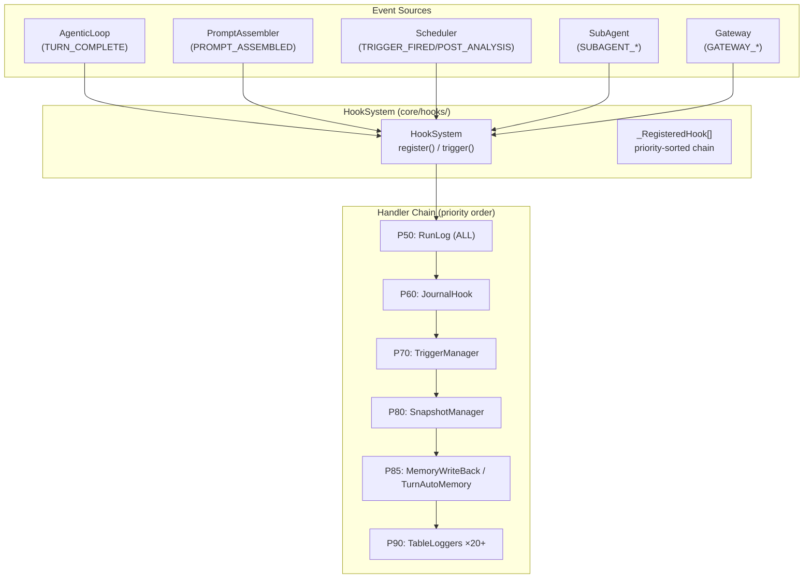

# GEODE Hook System — Event-Driven Lifecycle Control

> **English** | [한국어](hook-system.md)

> **Module**: `core/hooks/` (cross-cutting concern, accessible from all layers L0-L5)
> **Entry point**: `from core.hooks import HookSystem, HookEvent`
> **Events**: 81 | **Registered handlers**: 60+ (table count) | **Plugins**: YAML + class-based
> **Verified**: last doc ↔ code consistency audit — 2026-05-13 (PR feature/hook-doc-verify)

---

## Hook Maturity Model

The Hook System evolves beyond simple event logging through 4 stages: **Observe, React, Decide, Autonomy**.

```
┌─────────────────────────────────────────────────────────────────┐
│  L4 AUTONOMY   Autonomous rule learning from patterns           │
│                                                                 │
│  ○ hook-tool-approval    HITL approval history → auto-approve   │
│  ○ hook-model-switched   Switch reason logging → auto policy    │
│                          (L1 ✓)                                 │
│  ○ hook-filesystem-plugin  .geode/hooks/ auto-discovery +       │
│                            registration                         │
├─────────────────────────────────────────────────────────────────┤
│  L3 DECIDE     Hooks determine action direction                 │
│                                                                 │
│  ○ hook-context-action   CONTEXT_CRITICAL → delegate            │
│                          compression strategy                   │
│  ○ hook-session-start    SESSION_START → dynamic prompt          │
│                          enrichment                              │
├─ ─ ─ ─ ─ ─ ─ ─ ─ ─ ─ ─ ─ ─ ─ ─ ─ ─ ─ ─ ─ ─ ─ ─ ─ ─ ─ ─ ─ ─┤
│                          ▲ CURRENT FRONTIER                     │
│  L2 REACT      Automatic reaction to events                     │
│                                                                 │
│  ✓ turn_auto_memory        P85  TURN_COMPLETE → save insights   │
├─────────────────────────────────────────────────────────────────┤
│  L1 OBSERVE    Record only, no state changes                    │
│                                                                 │
│  ✓ RunLog             P50  ALL 63 events → JSONL                │
│  ✓ JournalHook        P60  END/ERROR/SUBAGENT → journal         │
│  ✓ NotificationHook  P200  SUBAGENT_FAILED → Slack             │
│  ✓ TableLoggers ×20+  P90  tool exec / llm / cost → struct log  │
│  ✓ hook-llm-lifecycle  P55 LLM_CALL_END latency/cost aggregation│
└─────────────────────────────────────────────────────────────────┘

✓ = Implemented    ○ = Kanban Backlog    ▲ = Current Frontier
```

> **Diagram**: [`docs/diagrams/hook-maturity-model.mmd`](../diagrams/hook-maturity-model.mmd)

### Key Insight

Adding a new hook item means **attaching a higher-maturity handler to an existing event**.
The event itself does not change; the handler chain deepens.

---

## Ripple Pattern — A Single Event Penetrates Multiple Levels

The same event triggers L1 (Observe) + L2 (React) handlers simultaneously.
They execute in priority order, so observation comes first, reaction after.

```
SUBAGENT_COMPLETED ─┬─ P50 RunLog      ─── L1 OBSERVE  (record)
                    └─ P60 JournalHook ─── L1 OBSERVE  (runs.jsonl)

TURN_COMPLETE ─┬─ P50 RunLog         ─── L1 OBSERVE  (event record)
               └─ P85 TurnAutoMemory ─── L2 REACT    (save insights)

CONTEXT_CRITICAL ─┬─ P50 RunLog      ─── L1 OBSERVE  (event record)
                  └─ P70 ContextAction ── L3 DECIDE   (compression strategy) ← planned
```

> **Diagram**: [`docs/diagrams/hook-ripple-chains.mmd`](../diagrams/hook-ripple-chains.mmd)

---

## Architecture



---

## HookEvent Enum (63 events)

| Category | Event | Source | Handler | Maturity |
|---|---|---|---|---|
| | `TRIGGER_FIRED` | TriggerManager | Logger | L1 |
| | `POST_ANALYSIS` | (reserved) | — | — |
| **Memory** | `MEMORY_SAVED` | (planned) | — | — |
| | `RULE_CREATED/UPDATED/DELETED` | (planned) | — | — |
| **Feedback** | `RESULT_FEEDBACK` | rate/accept/reject_result tools | RunLog | L1 |
| **Prompt** | `PROMPT_ASSEMBLED` | PromptAssembler | RunLog | L1 |
| | `PROMPT_DRIFT_DETECTED` | (reserved) | — | — |
| **SubAgent** | `SUBAGENT_STARTED` | SubAgentManager | RunLog | L1 |
| | `SUBAGENT_COMPLETED` | SubAgentManager | Journal, RunLog | L1 |
| | `SUBAGENT_FAILED` | SubAgentManager | RunLog | L1 |
| **Tool Recovery** | `TOOL_RECOVERY_*` (3) | ToolCallProcessor | RunLog | L1 |
| **Gateway** | `GATEWAY_MESSAGE_RECEIVED` | (planned) | — | — |
| | `GATEWAY_RESPONSE_SENT` | (planned) | — | — |
| **MCP** | `MCP_SERVER_STARTED/STOPPED` | (reserved) | RunLog | L1 |
| **Turn** | `TURN_COMPLETE` | AgenticLoop | RunLog, TurnAutoMemory | L1+L2 |
| **Context** | `CONTEXT_WARNING` | (reserved) | RunLog | L1 |
| | `CONTEXT_CRITICAL` | (planned) | ContextAction | L3 |
| | `CONTEXT_OVERFLOW_ACTION` | ContextManager | ContextAction | L3 |
| **Session** | `SESSION_START` | AgenticLoop | session_start_logger | L1 |
| | `SESSION_END` | AgenticLoop | session_end_logger | L1 |
| **Model** | `MODEL_SWITCHED` | AgenticLoop | model_switch_logger | L1 |
| **LLM Call** | `LLM_CALL_START` | LLM Router | RunLog | L1 |
| | `LLM_CALL_END` | LLM Router | llm_slow_logger, RunLog | L1 |
| **Tool Approval** | `TOOL_APPROVAL_REQUESTED` | ToolCallProcessor | RunLog | L1 |
| | `TOOL_APPROVAL_GRANTED` | ToolCallProcessor | ApprovalTracker | L1 |
| | `TOOL_APPROVAL_DENIED` | ToolCallProcessor | ApprovalTracker | L1 |

---

## Event Firing Order

AgenticLoop turn boundary:

```
1. user_input received
2. LLM call → tool_use loop
3. Turn end determination
4. TURN_COMPLETE          (text, user_input, tool_calls, rounds)
```

---

## Full Registered Handler List

| P | Handler Name | Subscribed Events | Registration Location | Maturity |
|---|---|---|---|---|
| **50** | `run_log_writer` | **All 63 events** | `bootstrap.build_hooks()` | L1 |
| **60** | `journal_subagent` | `SUBAGENT_COMPLETED` | `bootstrap.build_hooks()` | L1 |
| **85** | `turn_auto_memory` | `TURN_COMPLETE` | `bootstrap.build_hooks()` | L2 |
| **90** | `trigger_logger` | `TRIGGER_FIRED` | `scheduling.build_scheduling()` | L1 |
| **90** | `model_switch_logger` | `MODEL_SWITCHED` | `bootstrap.build_hooks()` | L1 |
| **200** | `notification_*` (1) | `SUBAGENT_FAILED` | `notification_hook plugin` (`register_notification_hooks`) | L1 |

> **Verification note (2026-05-13)**: This table reflects actual `hooks.register(...)` sites grepped from `core/wiring/bootstrap.py:build_hooks()`, `core/wiring/automation.py:wire_automation_hooks()`, `core/hooks/plugins/notification_hook/hook.py:register_notification_hooks()`, and `core/orchestration/{task_bridge,stuck_detection}.py`. Key references:
> - RunLog wildcard registration: `bootstrap.py:169-170` (`for event in HookEvent: hooks.register(event, ..., priority=50)`)
> - audit_loggers 19-event coverage: `bootstrap.py:406-484` (`_AL` table) + `bootstrap.py:494` (P90)
> - notification priority: `notification_hook/hook.py:142` (`priority=200`)

> **Note**: The Korean doc (`hook-system.md`) carries the fully-enumerated 30-row handler table. This English version retains the abridged headline list above — sync deferred until the bilingual doc-build pipeline is in place.

---

## Plugin Extension

External plugins can be added via `core/hooks/discovery.py`:

### Class-based Plugin

```python
# .geode/hooks/my_hook/hook.py
from core.hooks.system import HookEvent
from core.hooks.discovery import HookPlugin, HookPluginMetadata

class MyHook:
    @property
    def metadata(self) -> HookPluginMetadata:
        return HookPluginMetadata(
            name="my_hook",
            events=[HookEvent.SESSION_END],
            priority=75,
        )

    def handle(self, event: HookEvent, data: dict) -> None:
        # Custom logic
        pass
```

### YAML-based Plugin

```yaml
# .geode/hooks/my_hook/hook.yaml
name: my_hook
events: [session_end, subagent_failed]
priority: 75
handler: my_hook.handler  # Python module path
```

---

## Activity row schema + timeline mirror (63/63 typed)

Every `trigger*()` call mirrors as one **typed Activity row** into the active
`RunTranscript` (`core/observability/activity.py` + `activity_registry.py`,
spec `docs/plans/2026-05-24-hookevent-activity-schema.md`) — the equivalent of
openclaw's `z.discriminatedUnion("type")`, with `action` as the discriminator.

| Item | Policy |
|------|--------|
| **Coverage** | All 63 events map to a concrete typed row (19 lifecycle + 44 K-group). `GenericActivityRow` is a *fail-soft fallback only*, never a routine destination |
| **details schema** | 24 shared details models (one per family: `CognitivePhaseDetails`×6, `MutationDetails`×4, `AutoTriggerDetails`×6, ...), `frozen=True` + `extra="forbid"` |
| **Centralization** | The 44 K-group rows are built from a single declarative `_TYPED_ROW_SPECS` table + one `_build_from_spec` builder (not 44 functions); details field names match emit payload keys → key-intersection pull |
| **Mirror parity** | Mirrors from all 4 trigger variants — `trigger(_async)` AND `trigger_with_result(_async)` / `trigger_interceptor(_async)` — so feedback/interceptor events (e.g. USER_INPUT_RECEIVED) also land in the timeline |
| **schema_version** | Every row carries `schema_version: int`; bump on field add/rename/retype so JSONL re-readers branch on shape, not key presence |

### Error / privacy policy (silent fallback = anti-pattern)

| Situation | Handling |
|-----------|----------|
| Typed builder meets a malformed payload | Fail-soft to `GenericActivityRow` carrying `_fallback_reason` — a forced-generic row is distinguishable from an intentional one in the timeline itself, not only the daemon log |
| Mirror / dispatch / learning-save failure | **Once-per-event `WARNING`** (dedup set, no hot-loop spam). No debug-swallow — a dead observability sink must be visible |
| Missing identifier key | No silent empty-identifier ship — warn once on the emit-site key error |
| **Raw content** | Raw `user_input` / `cognitive_state` snapshots / full tool results are NEVER written to the timeline JSONL — only derived scalars (`input_len`) via `_derive_input_len` (privacy + size) |

> "Always emit a row" contract: the timeline stays complete even when typing
> fails (paperclip `logActivity` swallow-and-warn equivalent) — but the swallow
> must be VISIBLE: a `WARNING` + `_fallback_reason`, never silent.

---

## Design Principles

1. **Non-blocking execution**: One handler's exception does not interrupt other handlers
2. **Priority-sorted**: Lower number = higher priority (30 → 90)
3. **Metadata-only emission**: `PROMPT_ASSEMBLED` passes only hashes and statistics (security)
4. **`HookResult` return**: Introspection of success/failure results from all handlers
5. **Cross-cutting**: `core/hooks/` is an independent module — importable from any layer
6. **Maturity evolution**: Progressively add L1 (Observe) → L2 (React) → L3 (Decide) → L4 (Autonomy) handlers to the same event
7. **Plugin extension**: External extension via `.geode/hooks/` directory without core modification

---

## Coverage Matrix

> **Diagram**: [`docs/diagrams/hook-coverage-matrix.mmd`](../diagrams/hook-coverage-matrix.mmd)

| Event Group | L1 OBSERVE | L2 REACT | L3 DECIDE | L4 AUTONOMY |
|---|:---:|:---:|:---:|:---:|
| Pipeline (3) | ✓ 5 handlers | ✓ 2 handlers | — | — |
| Automation (5) | ✓ 6 handlers | ✓ 2 handlers | — | — |
| Turn (1) | ✓ RunLog | ✓ AutoMemory | — | — |
| SubAgent (3) | ✓ 2 handlers | — | — | — |
| Context (2) | ✓ RunLog | — | ○ planned | — |
| Gateway (2) | — | — | — | — |
| MCP (2) | ✓ RunLog | — | — | — |
| Tool Recovery (3) | ✓ RunLog | — | — | — |
| Memory (4) | — | — | — | — |
| Prompt (2) | ✓ RunLog | — | — | — |
