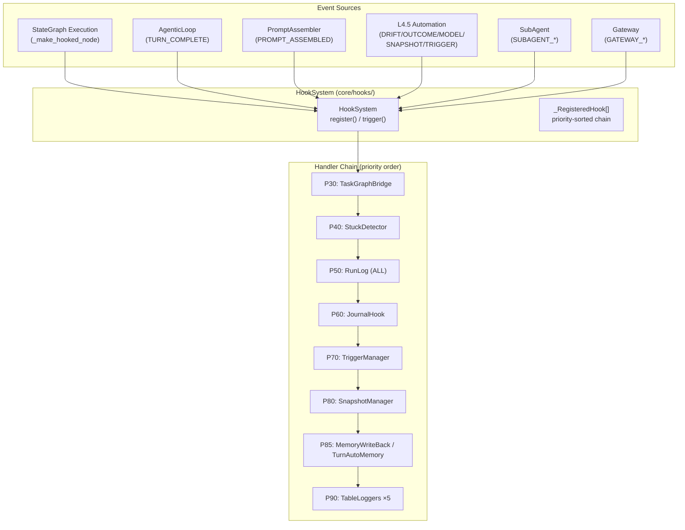

# GEODE Hook System — Event-Driven Lifecycle Control

> **English** | [한국어](hook-system.md)

> **Module**: `core/hooks/` (cross-cutting concern, accessible from all layers L0-L5)
> **Entry point**: `from core.hooks import HookSystem, HookEvent`
> **Events**: 58 | **Registered handlers**: 38+ | **Plugins**: YAML + class-based

---

## Hook Maturity Model

The Hook System evolves beyond simple event logging through 4 stages: **Observe, React, Decide, Autonomy**.

```
┌─────────────────────────────────────────────────────────────────┐
│  L4 AUTONOMY   Autonomous rule learning from patterns           │
│                                                                 │
│  ○ hook-tool-approval    HITL approval history → auto-approve   │
│  ○ hook-model-switched   Switch reason logging → auto policy    │
│                          (L1 ✓)                                 │
│  ○ hook-filesystem-plugin  .geode/hooks/ auto-discovery +       │
│                            registration                         │
├─────────────────────────────────────────────────────────────────┤
│  L3 DECIDE     Hooks determine action direction                 │
│                                                                 │
│  ○ hook-context-action   CONTEXT_CRITICAL → delegate            │
│                          compression strategy                   │
│  ○ hook-session-start    SESSION_START → dynamic prompt          │
│                          enrichment                              │
├─ ─ ─ ─ ─ ─ ─ ─ ─ ─ ─ ─ ─ ─ ─ ─ ─ ─ ─ ─ ─ ─ ─ ─ ─ ─ ─ ─ ─ ─┤
│                          ▲ CURRENT FRONTIER                     │
│  L2 REACT      Automatic reaction to events                     │
│                                                                 │
│  ✓ turn_auto_memory        P85  TURN_COMPLETE → save insights   │
│  ✓ drift_auto_snapshot     P80  DRIFT → state capture           │
│  ✓ pipeline_end_snapshot   P80  PIPELINE_END → snapshot          │
│  ✓ drift_pipeline_trigger  P70  DRIFT → re-analysis pipeline    │
├─────────────────────────────────────────────────────────────────┤
│  L1 OBSERVE    Record only, no state changes                    │
│                                                                 │
│  ✓ TaskGraphBridge    P30  NODE_ENTER/EXIT/ERROR                │
│  ✓ StuckDetector      P40  PIPELINE_START/END/ERROR             │
│  ✓ RunLog             P50  ALL 58 events → JSONL                │
│  ✓ JournalHook        P60  END/ERROR/SUBAGENT → journal         │
│  ✓ NotificationHook   P75  END/ERROR → Slack/external alert     │
│  ✓ TableLoggers ×5    P90  Automation events → structured log   │
│  ✓ hook-llm-lifecycle  P55 LLM_CALL latency/cost aggregation    │
└─────────────────────────────────────────────────────────────────┘

✓ = Implemented    ○ = Kanban Backlog    ▲ = Current Frontier
```

> **Diagram**: [`docs/diagrams/hook-maturity-model.mmd`](../diagrams/hook-maturity-model.mmd)

### Key Insight

Adding a new hook item means **attaching a higher-maturity handler to an existing event**.
The event itself does not change; the handler chain deepens.

---

## Ripple Pattern — A Single Event Penetrates Multiple Levels

The same event triggers L1 (Observe) + L2 (React) handlers simultaneously.
They execute in priority order, so observation comes first, reaction after.

```
PIPELINE_END ─┬─ P50 RunLog          ─── L1 OBSERVE  (record)
              ├─ P60 JournalHook     ─── L1 OBSERVE  (runs.jsonl)
              ├─ P80 SnapshotCapture ─── L2 REACT    (auto snapshot)
              └─ P85 MemoryWriteBack ─── L2 REACT    (MEMORY.md)

DRIFT_DETECTED ─┬─ P70 DriftTrigger  ─── L2 REACT   (re-analysis trigger)
                ├─ P80 DriftSnapshot  ─── L2 REACT   (debug capture)
                └─ P90 DriftLogger   ─── L1 OBSERVE  (structured log)

TURN_COMPLETE ─┬─ P50 RunLog         ─── L1 OBSERVE  (event record)
               └─ P85 TurnAutoMemory ─── L2 REACT    (save insights)

CONTEXT_CRITICAL ─┬─ P50 RunLog      ─── L1 OBSERVE  (event record)
                  └─ P70 ContextAction ── L3 DECIDE   (compression strategy) ← planned
```

> **Diagram**: [`docs/diagrams/hook-ripple-chains.mmd`](../diagrams/hook-ripple-chains.mmd)

---

## Architecture



---

## HookEvent Enum (58 events)

| Category | Event | Source | Handler | Maturity |
|---|---|---|---|---|
| **Pipeline** | `PIPELINE_START` | `_make_hooked_node` | StuckDetector, RunLog | L1 |
| | `PIPELINE_END` | `_make_hooked_node` | RunLog, Journal, Snapshot, Memory | L1+L2 |
| | `PIPELINE_ERROR` | `_make_hooked_node` | StuckDetector, Journal, RunLog | L1 |
| **Node** | `NODE_BOOTSTRAP` | `BootstrapManager` | RunLog | L1 |
| | `NODE_ENTER` | `_make_hooked_node` | TaskBridge, RunLog | L1 |
| | `NODE_EXIT` | `_make_hooked_node` | TaskBridge, RunLog | L1 |
| | `NODE_ERROR` | `_make_hooked_node` | TaskBridge, RunLog | L1 |
| **Analysis** | `ANALYST_COMPLETE` | Node completion mapping | RunLog | L1 |
| | `EVALUATOR_COMPLETE` | Node completion mapping | RunLog | L1 |
| | `SCORING_COMPLETE` | Node completion mapping | RunLog | L1 |
| **Verification** | `VERIFICATION_PASS` | Guardrails pass | RunLog | L1 |
| | `VERIFICATION_FAIL` | Guardrails fail | RunLog | L1 |
| **Automation** | `DRIFT_DETECTED` | CUSUMDetector | Trigger, Snapshot, Logger | L1+L2 |
| | `OUTCOME_COLLECTED` | OutcomeTracker | Logger | L1 |
| | `MODEL_PROMOTED` | ModelRegistry | Logger | L1 |
| | `SNAPSHOT_CAPTURED` | SnapshotManager | Logger | L1 |
| | `TRIGGER_FIRED` | TriggerManager | Logger | L1 |
| | `POST_ANALYSIS` | (reserved) | — | — |
| **Memory** | `MEMORY_SAVED` | (planned) | — | — |
| | `RULE_CREATED/UPDATED/DELETED` | (planned) | — | — |
| **Prompt** | `PROMPT_ASSEMBLED` | PromptAssembler | RunLog | L1 |
| | `PROMPT_DRIFT_DETECTED` | (reserved) | — | — |
| **SubAgent** | `SUBAGENT_STARTED` | SubAgentManager | RunLog | L1 |
| | `SUBAGENT_COMPLETED` | SubAgentManager | Journal, RunLog | L1 |
| | `SUBAGENT_FAILED` | SubAgentManager | RunLog | L1 |
| **Tool Recovery** | `TOOL_RECOVERY_*` (3) | ToolCallProcessor | RunLog | L1 |
| **Gateway** | `GATEWAY_MESSAGE_RECEIVED` | (planned) | — | — |
| | `GATEWAY_RESPONSE_SENT` | (planned) | — | — |
| **MCP** | `MCP_SERVER_STARTED/STOPPED` | (reserved) | RunLog | L1 |
| **Turn** | `TURN_COMPLETE` | AgenticLoop | RunLog, TurnAutoMemory | L1+L2 |
| **Context** | `CONTEXT_WARNING` | (reserved) | RunLog | L1 |
| | `CONTEXT_CRITICAL` | (planned) | ContextAction | L3 |
| | `CONTEXT_OVERFLOW_ACTION` | ContextManager | ContextAction | L3 |
| **Session** | `SESSION_START` | AgenticLoop | session_start_logger | L1 |
| | `SESSION_END` | AgenticLoop | session_end_logger | L1 |
| **Model** | `MODEL_SWITCHED` | AgenticLoop | model_switch_logger | L1 |
| **LLM Call** | `LLM_CALL_START` | LLM Router | RunLog | L1 |
| | `LLM_CALL_END` | LLM Router | llm_slow_logger, RunLog | L1 |
| **Tool Approval** | `TOOL_APPROVAL_REQUESTED` | ToolCallProcessor | RunLog | L1 |
| | `TOOL_APPROVAL_GRANTED` | ToolCallProcessor | ApprovalTracker | L1 |
| | `TOOL_APPROVAL_DENIED` | ToolCallProcessor | ApprovalTracker | L1 |

---

## Event Firing Order

Inside the `_make_hooked_node()` wrapper:

```
1. NODE_BOOTSTRAP        (if bootstrap_mgr exists)
2. PromptAssembler injection   (state["_prompt_assembler"])
3. NODE_ENTER
4. PIPELINE_START         (router node only)
5. node_fn(state) execution
6-a. NODE_EXIT            (success)
6-b. {ANALYST|EVALUATOR|SCORING}_COMPLETE  (matching node)
6-c. VERIFICATION_PASS/FAIL  (verification node)
6-d. PIPELINE_END         (synthesizer)
--- or ---
6-e. NODE_ERROR + PIPELINE_ERROR  (exception — both trigger)
```

AgenticLoop turn boundary:

```
1. user_input received
2. LLM call → tool_use loop
3. Turn end determination
4. TURN_COMPLETE          (text, user_input, tool_calls, rounds)
```

---

## Full Registered Handler List

| P | Handler Name | Subscribed Events | Registration Location | Maturity |
|---|---|---|---|---|
| **30** | `task_bridge_*` | `NODE_ENTER/EXIT/ERROR` | `TaskGraphHookBridge` | L1 |
| **40** | `stuck_tracker` | `PIPELINE_START/END/ERROR` | `bootstrap.build_hooks()` | L1 |
| **50** | `run_log_writer` | **All 58 events** | `bootstrap.build_hooks()` | L1 |
| **60** | `journal_pipeline_end` | `PIPELINE_END` | `bootstrap.build_hooks()` | L1 |
| **60** | `journal_pipeline_error` | `PIPELINE_ERROR` | `bootstrap.build_hooks()` | L1 |
| **60** | `journal_subagent` | `SUBAGENT_COMPLETED` | `bootstrap.build_hooks()` | L1 |
| **70** | `drift_pipeline_trigger` | `DRIFT_DETECTED` | `automation.wire_hooks()` | L2 |
| **75** | `notification_*` | `PIPELINE_END/ERROR` | `notification_hook plugin` | L1 |
| **80** | `drift_auto_snapshot` | `DRIFT_DETECTED` | `automation.wire_hooks()` | L2 |
| **80** | `pipeline_end_snapshot` | `PIPELINE_END` | `automation.wire_hooks()` | L2 |
| **85** | `turn_auto_memory` | `TURN_COMPLETE` | `bootstrap.build_hooks()` | L2 |
| **90** | `drift_logger` | `DRIFT_DETECTED` | `automation.wire_hooks()` | L1 |
| **90** | `snapshot_logger` | `SNAPSHOT_CAPTURED` | `automation.wire_hooks()` | L1 |
| **90** | `trigger_logger` | `TRIGGER_FIRED` | `automation.wire_hooks()` | L1 |
| **90** | `outcome_logger` | `OUTCOME_COLLECTED` | `automation.wire_hooks()` | L1 |
| **90** | `model_promotion_logger` | `MODEL_PROMOTED` | `automation.wire_hooks()` | L1 |
| **90** | `model_switch_logger` | `MODEL_SWITCHED` | `bootstrap.build_hooks()` | L1 |

---

## Plugin Extension

External plugins can be added via `core/hooks/discovery.py`:

### Class-based Plugin

```python
# .geode/hooks/my_hook/hook.py
from core.hooks.system import HookEvent
from core.hooks.discovery import HookPlugin, HookPluginMetadata

class MyHook:
    @property
    def metadata(self) -> HookPluginMetadata:
        return HookPluginMetadata(
            name="my_hook",
            events=[HookEvent.PIPELINE_END],
            priority=75,
        )

    def handle(self, event: HookEvent, data: dict) -> None:
        # Custom logic
        pass
```

### YAML-based Plugin

```yaml
# .geode/hooks/my_hook/hook.yaml
name: my_hook
events: [pipeline_end, pipeline_error]
priority: 75
handler: my_hook.handler  # Python module path
```

---

## Design Principles

1. **Non-blocking execution**: One handler's exception does not interrupt other handlers
2. **Priority-sorted**: Lower number = higher priority (30 → 90)
3. **Metadata-only emission**: `PROMPT_ASSEMBLED` passes only hashes and statistics (security)
4. **`HookResult` return**: Introspection of success/failure results from all handlers
5. **Cross-cutting**: `core/hooks/` is an independent module — importable from any layer
6. **Maturity evolution**: Progressively add L1 (Observe) → L2 (React) → L3 (Decide) → L4 (Autonomy) handlers to the same event
7. **Plugin extension**: External extension via `.geode/hooks/` directory without core modification

---

## Coverage Matrix

> **Diagram**: [`docs/diagrams/hook-coverage-matrix.mmd`](../diagrams/hook-coverage-matrix.mmd)

| Event Group | L1 OBSERVE | L2 REACT | L3 DECIDE | L4 AUTONOMY |
|---|:---:|:---:|:---:|:---:|
| Pipeline (3) | ✓ 5 handlers | ✓ 2 handlers | — | — |
| Node (4) | ✓ 2 handlers | — | — | — |
| Analysis (3) | ✓ RunLog | — | — | — |
| Verification (2) | ✓ RunLog | — | — | — |
| Automation (5) | ✓ 6 handlers | ✓ 2 handlers | — | — |
| Turn (1) | ✓ RunLog | ✓ AutoMemory | — | — |
| SubAgent (3) | ✓ 2 handlers | — | — | — |
| Context (2) | ✓ RunLog | — | ○ planned | — |
| Gateway (2) | — | — | — | — |
| MCP (2) | ✓ RunLog | — | — | — |
| Tool Recovery (3) | ✓ RunLog | — | — | — |
| Memory (4) | — | — | — | — |
| Prompt (2) | ✓ RunLog | — | — | — |
