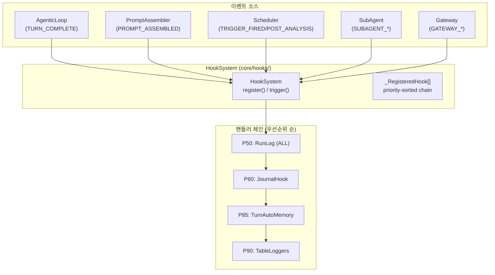

# GEODE Hook System — 이벤트 기반 라이프사이클 제어

> [English](hook-system.en.md) | **한국어**

> **모듈**: `core/hooks/` (cross-cutting concern, L0~L5 전 레이어에서 접근)
> **진입점**: `from core.hooks import HookSystem, HookEvent`
> **이벤트**: 64개 | **등록 핸들러**: 50+ (table count) | **플러그인**: YAML + class-based
> **검증**: 마지막 doc ↔ 코드 정합성 audit — 2026-06-10 (PR-DEAD-PIPELINE: 죽은 분석-파이프라인 이벤트 패밀리 15종 + L4.5 자동화 체인 + StuckDetector/TaskGraphHookBridge 제거, 82 → 67; PR-AUDIT-AB 2026-06-10: VERIFICATION_PASS/FAIL + FALLBACK_CROSS_PROVIDER 삭제, 67 → 64)

---

## Hook 성숙도 모델

Hook System은 단순한 이벤트 로깅을 넘어 **관측 → 반응 → 판단 → 자율**의 4단계로 진화한다.

```
┌─────────────────────────────────────────────────────────────────┐
│  L4 AUTONOMY   패턴에서 규칙을 자율 학습                          │
│                                                                 │
│  ○ hook-tool-approval    HITL 승인 이력 → 자동 승인 룰 학습       │
│  ○ hook-model-switched   전환 사유 기록 → 자동 전환 정책 (L1 ✓)  │
│  ○ hook-filesystem-plugin  .geode/hooks/ 자동 발견 + 등록        │
├─────────────────────────────────────────────────────────────────┤
│  L3 DECIDE     Hook이 행동 방향을 결정                            │
│                                                                 │
│  ✓ hook-context-action   CONTEXT_OVERFLOW_ACTION → 압축 전략 위임│
│  ✓ hook-tool-exec-start  TOOL_EXEC_START interceptor (차단/수정) │
│  ✓ hook-tool-exec-end    TOOL_EXEC_END feedback (결과 변환)      │
│  ✓ hook-tool-transform   TOOL_RESULT_TRANSFORM (결과 변환 분리)  │
│  ○ hook-session-start    SESSION_START → 동적 프롬프트 보강       │
├─ ─ ─ ─ ─ ─ ─ ─ ─ ─ ─ ─ ─ ─ ─ ─ ─ ─ ─ ─ ─ ─ ─ ─ ─ ─ ─ ─ ─ ─┤
│                          ▲ CURRENT FRONTIER                     │
│  L2 REACT      이벤트에 자동 반응                                │
│                                                                 │
│  ✓ turn_auto_memory        P85  TURN_COMPLETE → 인사이트 저장    │
├─────────────────────────────────────────────────────────────────┤
│  L1 OBSERVE    기록만, 상태 변경 없음                             │
│                                                                 │
│  ✓ RunLog             P50  ALL 64 events → JSONL                │
│  ✓ JournalHook        P60  END/ERROR/SUBAGENT → journal         │
│  ✓ NotificationHook  P200  SUBAGENT_FAILED → 알림               │
│  ✓ TableLoggers ×20+  P90  tool exec / llm / cost → 구조화 로깅 │
│  ✓ hook-llm-lifecycle  P55 LLM_CALL_END latency/cost 집계        │
└─────────────────────────────────────────────────────────────────┘

✓ = 구현 완료    ○ = 칸반 Backlog    ▲ = 현재 프론티어
```

> **다이어그램**: [`docs/diagrams/hook-maturity-model.mmd`](../diagrams/hook-maturity-model.mmd)

### 핵심 인사이트

새 hook 항목을 추가한다는 것은 **기존 이벤트에 더 높은 성숙도의 핸들러를 붙이는 것**이다.
이벤트 자체는 변하지 않고, 핸들러 체인이 깊어진다.

---

## 리플 패턴 — 하나의 이벤트가 여러 레벨을 동시에 관통

같은 이벤트가 L1(관측) + L2(반응) 핸들러를 동시에 트리거한다.
Priority 순서로 실행되므로 관측이 먼저, 반응이 나중.

```
SUBAGENT_COMPLETED ─┬─ P50 RunLog      ─── L1 OBSERVE  (기록)
                    └─ P60 JournalHook ─── L1 OBSERVE  (runs.jsonl)

TURN_COMPLETE ─┬─ P50 RunLog         ─── L1 OBSERVE  (이벤트 기록)
               └─ P85 TurnAutoMemory ─── L2 REACT    (인사이트 저장)

CONTEXT_CRITICAL ─── P50 RunLog         ─── L1 OBSERVE  (이벤트 기록)

CONTEXT_OVERFLOW_ACTION ── P50 ContextAction ── L3 DECIDE (압축 전략 위임)

TOOL_EXEC_START ─┬─ P90 AuditLogger     ─── L1 OBSERVE  (시작 기록)
                 └─ Pxx Interceptor      ─── L3 DECIDE   (차단/입력 수정)

TOOL_EXEC_END ─┬─ P90 AuditLogger       ─── L1 OBSERVE  (완료 기록)
               └─ Pxx Feedback           ─── L3 DECIDE   (결과 변환)
```

> **다이어그램**: [`docs/diagrams/hook-ripple-chains.mmd`](../diagrams/hook-ripple-chains.mmd)

---

## 아키텍처



---

## HookEvent 열거형 (64개)

| 카테고리 | 이벤트 | 소스 | 핸들러 | 트리거 모드 | 성숙도 |
|---|---|---|---|---|---|
| **Scheduler** | `TRIGGER_FIRED` | TriggerManager, Scheduler | Logger | `trigger()` | L1 |
| | `POST_ANALYSIS` | Triggers | RunLog | `trigger()` | L1 |
| **Memory** | `MEMORY_SAVED` | MemorySaveTool | RunLog | `trigger()` | L1 |
| | `RULE_CREATED` | RuleCreateTool | RunLog | `trigger()` | L1 |
| | `RULE_UPDATED` | RuleUpdateTool | RunLog | `trigger()` | L1 |
| | `RULE_DELETED` | RuleDeleteTool | RunLog | `trigger()` | L1 |
| **Prompt** | `PROMPT_ASSEMBLED` | PromptAssembler | RunLog | `trigger()` | L1 |
| **SubAgent** | `SUBAGENT_STARTED` | SubAgentManager | RunLog | `trigger()` | L1 |
| | `SUBAGENT_COMPLETED` | SubAgentManager, IsolatedExec | Journal, RunLog | `trigger()` | L1 |
| | `SUBAGENT_FAILED` | SubAgentManager | RunLog, Notification | `trigger()` | L1 |
| **Tool Exec** | `TOOL_EXEC_START` | ToolCallProcessor | AuditLogger | `trigger_interceptor()` | **L3** |
| | `TOOL_EXEC_END` | ToolCallProcessor | AuditLogger | `trigger_with_result()` | **L3** |
| | `TOOL_RESULT_OFFLOADED` | ToolCallProcessor | RunLog | `trigger()` | L1 |
| **Tool Recovery** | `TOOL_RECOVERY_ATTEMPTED` | ToolCallProcessor | RunLog | `trigger()` | L1 |
| | `TOOL_RECOVERY_SUCCEEDED` | ToolCallProcessor | Metrics, RunLog | `trigger()` | L1 |
| | `TOOL_RECOVERY_FAILED` | ToolCallProcessor | RunLog | `trigger()` | L1 |
| **Tool Approval** | `TOOL_APPROVAL_REQUESTED` | ApprovalWorkflow | AuditLogger | `trigger()` | L1 |
| | `TOOL_APPROVAL_GRANTED` | ApprovalWorkflow | ApprovalTracker | `trigger()` | L1 |
| | `TOOL_APPROVAL_DENIED` | ApprovalWorkflow | ApprovalTracker | `trigger()` | L1 |
| **Turn** | `TURN_COMPLETE` | AgenticLoop | RunLog, AutoMemory, AutoLearn, LLMExtract | `trigger()` | L1+L2 |
| **Context** | `CONTEXT_CRITICAL` | ContextWindowManager | AuditLogger, RunLog | `trigger()` | L1 |
| | `CONTEXT_OVERFLOW_ACTION` | ContextWindowManager | ContextActionHandler | `trigger_with_result()` | **L3** |
| **Session** | `SESSION_START` | AgenticLoop | SessionLifecycle, RunLog | `trigger()` | L1 |
| | `SESSION_END` | AgenticLoop | SessionLifecycle, ToolOffloadCleanup, RunLog | `trigger()` | L1 |
| **Model** | `MODEL_SWITCHED` | AgenticLoop | ModelSwitchLogger | `trigger()` | L1 |
| **LLM Call** | `LLM_CALL_START` | LLM Router | AuditLogger, RunLog | `trigger()` | L1 |
| | `LLM_CALL_END` | LLM Router | LLMSlowLogger, RunLog | `trigger()` | L1 |
| | `LLM_CALL_FAILED` | AgenticLoop | AuditLogger, RunLog | `trigger()` | L1 |
| | `LLM_CALL_RETRY` | AgenticLoop | AuditLogger, RunLog | `trigger()` | L1 |
| **Cost** | `COST_WARNING` | AgenticLoop | AuditLogger, RunLog | `trigger()` | L1 |
| | `COST_LIMIT_EXCEEDED` | AgenticLoop | AuditLogger, RunLog | `trigger()` | L1 |
| **User Input** | `USER_INPUT_RECEIVED` | AgenticLoop | AuditLogger | `trigger_interceptor()` | **L3** |
| **Serve** | `SHUTDOWN_STARTED` | CLI | AuditLogger, RunLog | `trigger()` | L1 |
| | `CONFIG_RELOADED` | Bootstrap | AuditLogger, RunLog | `trigger()` | L1 |
| **MCP** | `MCP_SERVER_CONNECTED` | MCP Manager | AuditLogger, RunLog | `trigger()` | L1 |
| | `MCP_SERVER_FAILED` | MCP Manager | AuditLogger, RunLog | `trigger()` | L1 |
| **Execution** | `EXECUTION_CANCELLED` | IsolatedExecution | AuditLogger, RunLog | `trigger()` | L1 |
| **Reasoning** | `REASONING_METRICS` | AgenticLoop | AuditLogger, RunLog | `trigger()` | L1 |

---

## 이벤트 발생 순서

AgenticLoop 턴 경계:

```
1. USER_INPUT_RECEIVED    (interceptor — 차단 가능)
2. SESSION_START           (session_id, model, provider)
3. LLM_CALL_START → LLM_CALL_END (또는 LLM_CALL_FAILED → LLM_CALL_RETRY)
4. TOOL_EXEC_START        (interceptor — 차단/입력 수정 가능)
5. tool 실행
6. TOOL_EXEC_END          (feedback — 결과 변환 가능)
7. (tool 연속 실패 시) TOOL_RECOVERY_ATTEMPTED → SUCCEEDED | FAILED
8. TURN_COMPLETE          (text, user_input, tool_calls, rounds)
9. SESSION_END            (session_id, total_cost)
```

---

## 등록 핸들러 전체 목록

| P | 핸들러명 | 구독 이벤트 | 등록 위치 | 성숙도 |
|---|---|---|---|---|
| **45** | `metrics_*` (2) | `LLM_CALL_END / TOOL_RECOVERY_SUCCEEDED` | `SessionMetrics` | L1 |
| **50** | `run_log_writer` | **전체 64개** | `bootstrap.build_hooks()` | L1 |
| **50** | `context_action_handler` | `CONTEXT_OVERFLOW_ACTION` | `bootstrap._reg_context_action()` | **L3** |
| **55** | `llm_slow_logger` | `LLM_CALL_END` | `bootstrap.build_hooks()` | L1 |
| **60** | `journal_subagent` | `SUBAGENT_COMPLETED` | `bootstrap.build_hooks()` | L1 |
| **65** | `approval_tracker` (2) | `TOOL_APPROVAL_GRANTED/DENIED` | `bootstrap.build_hooks()` | L1 |
| **82** | `turn_llm_extract` | `TURN_COMPLETE` | `llm_extract_learning` | L2 |
| **84** | `turn_auto_learn` | `TURN_COMPLETE` | `auto_learn` | L2 |
| **85** | `turn_auto_memory` | `TURN_COMPLETE` | `bootstrap.build_hooks()` | L2 |
| **90** | `session_lifecycle` (2) | `SESSION_START/END` | `bootstrap.build_hooks()` | L1 |
| **90** | `model_switch_logger` | `MODEL_SWITCHED` | `bootstrap.build_hooks()` | L1 |
| **90** | `audit_loggers` (19) | 19 events (`_AL` table — context/subagent/llm/recovery/fallback/timeout/post_analysis/shutdown/config/mcp/user_input/tool_exec×4/cost×2) | `bootstrap.build_hooks()` | L1 |
| **90** | `trigger_logger` | `TRIGGER_FIRED` | `scheduling.build_scheduling()` | L1 |
| **95** | `tool_offload_cleanup` | `SESSION_END` | `bootstrap.build_hooks()` | L1 |
| **200** | `notification_*` (1) | `SUBAGENT_FAILED` | `notification_hook plugin` (`register_notification_hooks`) | L1 |

> **검증 메모 (2026-06-10)**: 위 표는 `core/wiring/bootstrap.py:build_hooks()`, `core/wiring/scheduling.py:build_scheduling()`, `core/hooks/plugins/notification_hook/hook.py:register_notification_hooks()` 의 실제 `hooks.register(...)` 사이트를 grep 으로 확인한 결과. drift 가 발견되면 본 표를 갱신할 것. 핵심 reference:
> - RunLog wildcard 등록: `bootstrap.py:169-170` (`for event in HookEvent: hooks.register(event, ..., priority=50)`)
> - audit_loggers 19 이벤트 등록: `bootstrap.py:406-484` (`_AL` table) + `bootstrap.py:494` (P90)
> - notification priority: `notification_hook/hook.py:142` (`priority=200`)

---

## 플러그인 확장

`core/hooks/discovery.py`를 통해 외부 플러그인 추가 가능:

### Class-based Plugin

```python
# .geode/hooks/my_hook/hook.py
from core.hooks.system import HookEvent
from core.hooks.discovery import HookPlugin, HookPluginMetadata

class MyHook:
    @property
    def metadata(self) -> HookPluginMetadata:
        return HookPluginMetadata(
            name="my_hook",
            events=[HookEvent.SESSION_END],
            priority=75,
        )

    def handle(self, event: HookEvent, data: dict) -> None:
        # Custom logic
        pass
```

### YAML-based Plugin

```yaml
# .geode/hooks/my_hook/hook.yaml
name: my_hook
events: [session_end, subagent_failed]
priority: 75
handler: my_hook.handler  # Python module path
```

---

## 트리거 모드 (3종)

| 모드 | 메서드 | 반환값 | 용도 | 사용 이벤트 |
|------|--------|--------|------|------------|
| **L1 Observe** | `trigger()` | `list[HookResult]` (성공/실패만) | Fire-and-forget 관찰 | 대부분 (60+개) |
| **L3 Feedback** | `trigger_with_result()` | `list[HookResult]` (data 포함) | 핸들러가 전략/값 반환 | `CONTEXT_OVERFLOW_ACTION`, `TOOL_EXEC_END` |
| **L3 Interceptor** | `trigger_interceptor()` | `InterceptResult` (block/modify) | 실행 차단 또는 데이터 수정 | `USER_INPUT_RECEIVED`, `TOOL_EXEC_START` |

### Interceptor 프로토콜 (Claude Code PreToolUse 패턴)

```python
# 핸들러가 반환할 수 있는 값:
{"block": True, "reason": "..."}           # 실행 차단
{"modify": {"tool_input": {새 입력}}}       # 입력 수정
None                                        # 통과 (관찰만)
```

### Feedback 프로토콜 (Claude Code PostToolUse 패턴)

```python
# 핸들러가 반환할 수 있는 값:
{"updated_result": {변환된 결과}}            # 결과 교체
{"additional_context": "추가 맥락"}          # 결과에 context 주입
None                                        # 통과 (관찰만)
```

---

## 설계 원칙

1. **비차단 실행**: 한 핸들러의 예외가 다른 핸들러를 중단하지 않음 (interceptor 예외도 비차단)
2. **우선순위 정렬**: 낮은 수 = 높은 우선순위 (30 → 95)
3. **메타데이터 전용 방출**: `PROMPT_ASSEMBLED`는 해시와 통계만 전달 (보안)
4. **`HookResult` 반환**: 모든 핸들러의 성공/실패 결과 인트로스펙션 가능
5. **Cross-cutting**: `core/hooks/`는 독립 모듈 — 어느 레이어에서든 import 가능
6. **성숙도 진화**: 같은 이벤트에 L1(관측) → L2(반응) → L3(판단) → L4(자율) 핸들러를 점진 추가
7. **플러그인 확장**: 코어 수정 없이 `.geode/hooks/` 디렉토리로 외부 확장
8. **3종 트리거**: observe(기록) / feedback(값 반환) / interceptor(차단+수정) 용도에 맞게 선택

---

## 커버리지 매트릭스

> **다이어그램**: [`docs/diagrams/hook-coverage-matrix.mmd`](../diagrams/hook-coverage-matrix.mmd)

| 이벤트 그룹 | L1 OBSERVE | L2 REACT | L3 DECIDE | L4 AUTONOMY |
|---|:---:|:---:|:---:|:---:|
| Scheduler (2) | ✓ Logger, RunLog | — | — | — |
| Memory (4) | ✓ RunLog | — | — | — |
| Prompt (1) | ✓ RunLog | — | — | — |
| SubAgent (3) | ✓ Journal, RunLog, Notification | — | — | — |
| Tool Exec (3) | ✓ AuditLogger | — | ✓ Interceptor, Feedback | — |
| Tool Recovery (3) | ✓ RunLog, Metrics | — | — | — |
| Tool Approval (3) | ✓ ApprovalTracker, AuditLogger | — | — | — |
| Turn (1) | ✓ RunLog | ✓ AutoMemory, AutoLearn, LLMExtract | — | — |
| Context (2) | ✓ AuditLogger | — | ✓ ContextActionHandler | — |
| Session (2) | ✓ SessionLifecycle, RunLog | — | — | — |
| Model (1) | ✓ ModelSwitchLogger | — | — | — |
| LLM Call (4) | ✓ LLMSlowLogger, AuditLogger | — | — | — |
| Cost (2) | ✓ AuditLogger | — | — | — |
| User Input (1) | ✓ AuditLogger | — | ✓ Interceptor | — |
| Cross-Provider (1) | ✓ AuditLogger | — | — | — |
| Serve (2) | ✓ AuditLogger | — | — | — |
| MCP (2) | ✓ AuditLogger | — | — | — |
| Execution (1) | ✓ AuditLogger | — | — | — |
| Reasoning (1) | ✓ AuditLogger | — | — | — |
