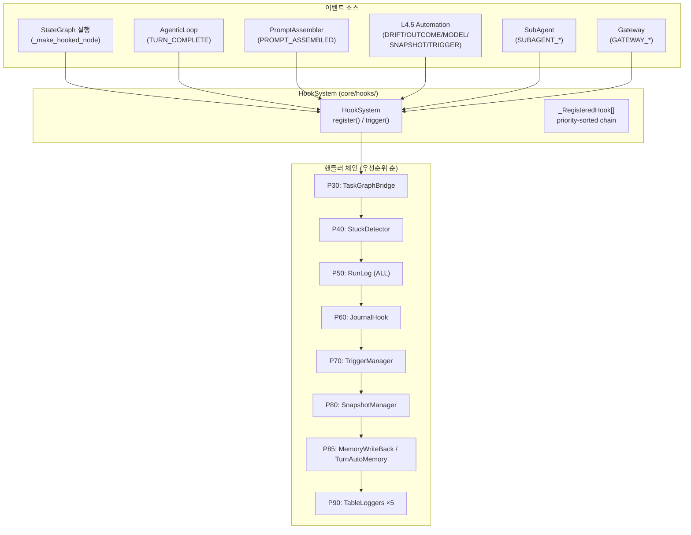

# GEODE Hook System — 이벤트 기반 라이프사이클 제어

> [English](hook-system.en.md) | **한국어**

> **모듈**: `core/hooks/` (cross-cutting concern, L0~L5 전 레이어에서 접근)
> **진입점**: `from core.hooks import HookSystem, HookEvent`
> **이벤트**: 46개 | **등록 핸들러**: 18개 | **플러그인**: YAML + class-based

---

## Hook 성숙도 모델

Hook System은 단순한 이벤트 로깅을 넘어 **관측 → 반응 → 판단 → 자율**의 4단계로 진화한다.

```
┌─────────────────────────────────────────────────────────────────┐
│  L4 AUTONOMY   패턴에서 규칙을 자율 학습                          │
│                                                                 │
│  ○ hook-tool-approval    HITL 승인 이력 → 자동 승인 룰 학습       │
│  ○ hook-model-switched   전환 사유 기록 → 자동 전환 정책 (L1 ✓)  │
│  ○ hook-filesystem-plugin  .geode/hooks/ 자동 발견 + 등록        │
├─────────────────────────────────────────────────────────────────┤
│  L3 DECIDE     Hook이 행동 방향을 결정                            │
│                                                                 │
│  ○ hook-context-action   CONTEXT_CRITICAL → 압축 전략 위임       │
│  ○ hook-session-start    SESSION_START → 동적 프롬프트 보강       │
├─ ─ ─ ─ ─ ─ ─ ─ ─ ─ ─ ─ ─ ─ ─ ─ ─ ─ ─ ─ ─ ─ ─ ─ ─ ─ ─ ─ ─ ─┤
│                          ▲ CURRENT FRONTIER                     │
│  L2 REACT      이벤트에 자동 반응                                │
│                                                                 │
│  ✓ turn_auto_memory        P85  TURN_COMPLETE → 인사이트 저장    │
│  ✓ drift_auto_snapshot     P80  DRIFT → 상태 캡처               │
│  ✓ pipeline_end_snapshot   P80  PIPELINE_END → 스냅샷            │
│  ✓ drift_pipeline_trigger  P70  DRIFT → 재분석 파이프라인         │
├─────────────────────────────────────────────────────────────────┤
│  L1 OBSERVE    기록만, 상태 변경 없음                             │
│                                                                 │
│  ✓ TaskGraphBridge    P30  NODE_ENTER/EXIT/ERROR                │
│  ✓ StuckDetector      P40  PIPELINE_START/END/ERROR             │
│  ✓ RunLog             P50  ALL 40 events → JSONL                │
│  ✓ JournalHook        P60  END/ERROR/SUBAGENT → journal         │
│  ✓ NotificationHook   P75  END/ERROR → Slack/외부 알림           │
│  ✓ TableLoggers ×5    P90  Automation events → 구조화 로깅       │
│  ✓ hook-llm-lifecycle  P55 LLM_CALL latency/cost 집계            │
└─────────────────────────────────────────────────────────────────┘

✓ = 구현 완료    ○ = 칸반 Backlog    ▲ = 현재 프론티어
```

> **다이어그램**: [`docs/diagrams/hook-maturity-model.mmd`](../diagrams/hook-maturity-model.mmd)

### 핵심 인사이트

새 hook 항목을 추가한다는 것은 **기존 이벤트에 더 높은 성숙도의 핸들러를 붙이는 것**이다.
이벤트 자체는 변하지 않고, 핸들러 체인이 깊어진다.

---

## 리플 패턴 — 하나의 이벤트가 여러 레벨을 동시에 관통

같은 이벤트가 L1(관측) + L2(반응) 핸들러를 동시에 트리거한다.
Priority 순서로 실행되므로 관측이 먼저, 반응이 나중.

```
PIPELINE_END ─┬─ P50 RunLog          ─── L1 OBSERVE  (기록)
              ├─ P60 JournalHook     ─── L1 OBSERVE  (runs.jsonl)
              ├─ P80 SnapshotCapture ─── L2 REACT    (자동 스냅샷)
              └─ P85 MemoryWriteBack ─── L2 REACT    (MEMORY.md)

DRIFT_DETECTED ─┬─ P70 DriftTrigger  ─── L2 REACT   (재분석 트리거)
                ├─ P80 DriftSnapshot  ─── L2 REACT   (디버깅 캡처)
                └─ P90 DriftLogger   ─── L1 OBSERVE  (구조화 로그)

TURN_COMPLETE ─┬─ P50 RunLog         ─── L1 OBSERVE  (이벤트 기록)
               └─ P85 TurnAutoMemory ─── L2 REACT    (인사이트 저장)

CONTEXT_CRITICAL ─┬─ P50 RunLog      ─── L1 OBSERVE  (이벤트 기록)
                  └─ P70 ContextAction ── L3 DECIDE   (압축 전략) ← planned
```

> **다이어그램**: [`docs/diagrams/hook-ripple-chains.mmd`](../diagrams/hook-ripple-chains.mmd)

---

## 아키텍처



---

## HookEvent 열거형 (46개)

| 카테고리 | 이벤트 | 소스 | 핸들러 | 성숙도 |
|---|---|---|---|---|
| **Pipeline** | `PIPELINE_START` | `_make_hooked_node` | StuckDetector, RunLog | L1 |
| | `PIPELINE_END` | `_make_hooked_node` | RunLog, Journal, Snapshot, Memory | L1+L2 |
| | `PIPELINE_ERROR` | `_make_hooked_node` | StuckDetector, Journal, RunLog | L1 |
| **Node** | `NODE_BOOTSTRAP` | `BootstrapManager` | RunLog | L1 |
| | `NODE_ENTER` | `_make_hooked_node` | TaskBridge, RunLog | L1 |
| | `NODE_EXIT` | `_make_hooked_node` | TaskBridge, RunLog | L1 |
| | `NODE_ERROR` | `_make_hooked_node` | TaskBridge, RunLog | L1 |
| **Analysis** | `ANALYST_COMPLETE` | 노드 완료 매핑 | RunLog | L1 |
| | `EVALUATOR_COMPLETE` | 노드 완료 매핑 | RunLog | L1 |
| | `SCORING_COMPLETE` | 노드 완료 매핑 | RunLog | L1 |
| **Verification** | `VERIFICATION_PASS` | guardrails 통과 | RunLog | L1 |
| | `VERIFICATION_FAIL` | guardrails 실패 | RunLog | L1 |
| **Automation** | `DRIFT_DETECTED` | CUSUMDetector | Trigger, Snapshot, Logger | L1+L2 |
| | `OUTCOME_COLLECTED` | OutcomeTracker | Logger | L1 |
| | `MODEL_PROMOTED` | ModelRegistry | Logger | L1 |
| | `SNAPSHOT_CAPTURED` | SnapshotManager | Logger | L1 |
| | `TRIGGER_FIRED` | TriggerManager | Logger | L1 |
| | `POST_ANALYSIS` | (reserved) | — | — |
| **Memory** | `MEMORY_SAVED` | (planned) | — | — |
| | `RULE_CREATED/UPDATED/DELETED` | (planned) | — | — |
| **Prompt** | `PROMPT_ASSEMBLED` | PromptAssembler | RunLog | L1 |
| | `PROMPT_DRIFT_DETECTED` | (reserved) | — | — |
| **SubAgent** | `SUBAGENT_STARTED` | SubAgentManager | RunLog | L1 |
| | `SUBAGENT_COMPLETED` | SubAgentManager | Journal, RunLog | L1 |
| | `SUBAGENT_FAILED` | SubAgentManager | RunLog | L1 |
| **Tool Recovery** | `TOOL_RECOVERY_*` (3) | ToolCallProcessor | RunLog | L1 |
| **Gateway** | `GATEWAY_MESSAGE_RECEIVED` | (planned) | — | — |
| | `GATEWAY_RESPONSE_SENT` | (planned) | — | — |
| **MCP** | `MCP_SERVER_STARTED/STOPPED` | (reserved) | RunLog | L1 |
| **Turn** | `TURN_COMPLETE` | AgenticLoop | RunLog, TurnAutoMemory | L1+L2 |
| **Context** | `CONTEXT_WARNING` | (reserved) | RunLog | L1 |
| | `CONTEXT_CRITICAL` | (planned) | ContextAction | L3 |
| | `CONTEXT_OVERFLOW_ACTION` | ContextManager | ContextAction | L3 |
| **Session** | `SESSION_START` | AgenticLoop | session_start_logger | L1 |
| | `SESSION_END` | AgenticLoop | session_end_logger | L1 |
| **Model** | `MODEL_SWITCHED` | AgenticLoop | model_switch_logger | L1 |
| **LLM Call** | `LLM_CALL_START` | LLM Router | RunLog | L1 |
| | `LLM_CALL_END` | LLM Router | llm_slow_logger, RunLog | L1 |
| **Tool Approval** | `TOOL_APPROVAL_REQUESTED` | ToolCallProcessor | RunLog | L1 |
| | `TOOL_APPROVAL_GRANTED` | ToolCallProcessor | ApprovalTracker | L1 |
| | `TOOL_APPROVAL_DENIED` | ToolCallProcessor | ApprovalTracker | L1 |

---

## 이벤트 발생 순서

`_make_hooked_node()` 래퍼 내부:

```
1. NODE_BOOTSTRAP        (bootstrap_mgr 존재 시)
2. PromptAssembler 주입   (state["_prompt_assembler"])
3. NODE_ENTER
4. PIPELINE_START         (router 노드일 때만)
5. node_fn(state) 실행
6-a. NODE_EXIT            (성공)
6-b. {ANALYST|EVALUATOR|SCORING}_COMPLETE  (해당 노드)
6-c. VERIFICATION_PASS/FAIL  (verification 노드)
6-d. PIPELINE_END         (synthesizer)
--- 또는 ---
6-e. NODE_ERROR + PIPELINE_ERROR  (예외 — 둘 다 trigger)
```

AgenticLoop 턴 경계:

```
1. user_input 수신
2. LLM 호출 → tool_use 반복
3. 턴 종료 판단
4. TURN_COMPLETE          (text, user_input, tool_calls, rounds)
```

---

## 등록 핸들러 전체 목록

| P | 핸들러명 | 구독 이벤트 | 등록 위치 | 성숙도 |
|---|---|---|---|---|
| **30** | `task_bridge_*` | `NODE_ENTER/EXIT/ERROR` | `TaskGraphHookBridge` | L1 |
| **40** | `stuck_tracker` | `PIPELINE_START/END/ERROR` | `bootstrap.build_hooks()` | L1 |
| **50** | `run_log_writer` | **전체 45개** | `bootstrap.build_hooks()` | L1 |
| **60** | `journal_pipeline_end` | `PIPELINE_END` | `bootstrap.build_hooks()` | L1 |
| **60** | `journal_pipeline_error` | `PIPELINE_ERROR` | `bootstrap.build_hooks()` | L1 |
| **60** | `journal_subagent` | `SUBAGENT_COMPLETED` | `bootstrap.build_hooks()` | L1 |
| **70** | `drift_pipeline_trigger` | `DRIFT_DETECTED` | `automation.wire_hooks()` | L2 |
| **75** | `notification_*` | `PIPELINE_END/ERROR` | `notification_hook plugin` | L1 |
| **80** | `drift_auto_snapshot` | `DRIFT_DETECTED` | `automation.wire_hooks()` | L2 |
| **80** | `pipeline_end_snapshot` | `PIPELINE_END` | `automation.wire_hooks()` | L2 |
| **85** | `turn_auto_memory` | `TURN_COMPLETE` | `bootstrap.build_hooks()` | L2 |
| **90** | `drift_logger` | `DRIFT_DETECTED` | `automation.wire_hooks()` | L1 |
| **90** | `snapshot_logger` | `SNAPSHOT_CAPTURED` | `automation.wire_hooks()` | L1 |
| **90** | `trigger_logger` | `TRIGGER_FIRED` | `automation.wire_hooks()` | L1 |
| **90** | `outcome_logger` | `OUTCOME_COLLECTED` | `automation.wire_hooks()` | L1 |
| **90** | `model_promotion_logger` | `MODEL_PROMOTED` | `automation.wire_hooks()` | L1 |
| **90** | `model_switch_logger` | `MODEL_SWITCHED` | `bootstrap.build_hooks()` | L1 |

---

## 플러그인 확장

`core/hooks/discovery.py`를 통해 외부 플러그인 추가 가능:

### Class-based Plugin

```python
# .geode/hooks/my_hook/hook.py
from core.hooks.system import HookEvent
from core.hooks.discovery import HookPlugin, HookPluginMetadata

class MyHook:
    @property
    def metadata(self) -> HookPluginMetadata:
        return HookPluginMetadata(
            name="my_hook",
            events=[HookEvent.PIPELINE_END],
            priority=75,
        )

    def handle(self, event: HookEvent, data: dict) -> None:
        # Custom logic
        pass
```

### YAML-based Plugin

```yaml
# .geode/hooks/my_hook/hook.yaml
name: my_hook
events: [pipeline_end, pipeline_error]
priority: 75
handler: my_hook.handler  # Python module path
```

---

## 설계 원칙

1. **비차단 실행**: 한 핸들러의 예외가 다른 핸들러를 중단하지 않음
2. **우선순위 정렬**: 낮은 수 = 높은 우선순위 (30 → 90)
3. **메타데이터 전용 방출**: `PROMPT_ASSEMBLED`는 해시와 통계만 전달 (보안)
4. **`HookResult` 반환**: 모든 핸들러의 성공/실패 결과 인트로스펙션 가능
5. **Cross-cutting**: `core/hooks/`는 독립 모듈 — 어느 레이어에서든 import 가능
6. **성숙도 진화**: 같은 이벤트에 L1(관측) → L2(반응) → L3(판단) → L4(자율) 핸들러를 점진 추가
7. **플러그인 확장**: 코어 수정 없이 `.geode/hooks/` 디렉토리로 외부 확장

---

## 커버리지 매트릭스

> **다이어그램**: [`docs/diagrams/hook-coverage-matrix.mmd`](../diagrams/hook-coverage-matrix.mmd)

| 이벤트 그룹 | L1 OBSERVE | L2 REACT | L3 DECIDE | L4 AUTONOMY |
|---|:---:|:---:|:---:|:---:|
| Pipeline (3) | ✓ 5 handlers | ✓ 2 handlers | — | — |
| Node (4) | ✓ 2 handlers | — | — | — |
| Analysis (3) | ✓ RunLog | — | — | — |
| Verification (2) | ✓ RunLog | — | — | — |
| Automation (5) | ✓ 6 handlers | ✓ 2 handlers | — | — |
| Turn (1) | ✓ RunLog | ✓ AutoMemory | — | — |
| SubAgent (3) | ✓ 2 handlers | — | — | — |
| Context (2) | ✓ RunLog | — | ○ planned | — |
| Gateway (2) | — | — | — | — |
| MCP (2) | ✓ RunLog | — | — | — |
| Tool Recovery (3) | ✓ RunLog | — | — | — |
| Memory (4) | — | — | — | — |
| Prompt (2) | ✓ RunLog | — | — | — |
