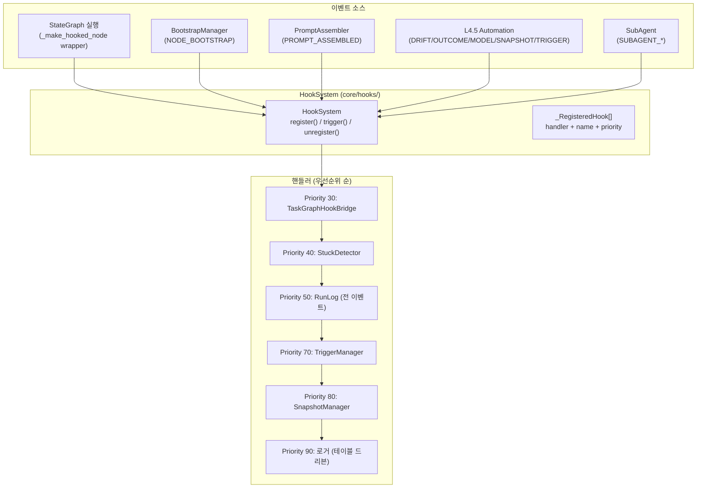

# GEODE Hook System — 이벤트 기반 라이프사이클 제어

> **모듈**: `core/hooks/` (cross-cutting concern, L0~L5 전 레이어에서 접근)
> **진입점**: `from core.hooks import HookSystem, HookEvent`

---

## 아키텍처



---

## HookEvent 열거형 (36개 이벤트)

`core/hooks/__init__.py`의 `HookEvent` 전체 목록.

| 카테고리 | 이벤트 | 값 | 소스 |
|---|---|---|---|
| **Pipeline** | `PIPELINE_START` | `"pipeline_start"` | `_make_hooked_node` (router 진입) |
| | `PIPELINE_END` | `"pipeline_end"` | `_make_hooked_node` (synthesizer 완료) |
| | `PIPELINE_ERROR` | `"pipeline_error"` | `_make_hooked_node` (노드 예외) |
| **Node** | `NODE_BOOTSTRAP` | `"node_bootstrap"` | `BootstrapManager.prepare_node()` |
| | `NODE_ENTER` | `"node_enter"` | `_make_hooked_node` (매 노드 진입) |
| | `NODE_EXIT` | `"node_exit"` | `_make_hooked_node` (매 노드 완료) |
| | `NODE_ERROR` | `"node_error"` | `_make_hooked_node` (매 노드 예외) |
| **Analysis** | `ANALYST_COMPLETE` | `"analyst_complete"` | 노드 완료 이벤트 |
| | `EVALUATOR_COMPLETE` | `"evaluator_complete"` | 노드 완료 이벤트 |
| | `SCORING_COMPLETE` | `"scoring_complete"` | 노드 완료 이벤트 |
| **Verification** | `VERIFICATION_PASS` | `"verification_pass"` | guardrails + biasbuster 통과 |
| | `VERIFICATION_FAIL` | `"verification_fail"` | guardrails/biasbuster 실패 |
| **Automation** | `DRIFT_DETECTED` | `"drift_detected"` | CUSUMDetector |
| | `OUTCOME_COLLECTED` | `"outcome_collected"` | OutcomeTracker |
| | `MODEL_PROMOTED` | `"model_promoted"` | ModelRegistry |
| | `SNAPSHOT_CAPTURED` | `"snapshot_captured"` | SnapshotManager |
| | `TRIGGER_FIRED` | `"trigger_fired"` | TriggerManager |
| **Prompt** | `PROMPT_ASSEMBLED` | `"prompt_assembled"` | PromptAssembler |
| **Context** | `CONTEXT_WARNING` | `"context_warning"` | 80% 임계 |
| | `CONTEXT_CRITICAL` | `"context_critical"` | 95% 임계 |
| **SubAgent** | `SUBAGENT_*` | 서브에이전트 라이프사이클 | SubAgentManager |
| **MCP** | `MCP_SERVER_STARTED` | MCP 서버 시작 | McpServerManager |
| | `MCP_SERVER_STOPPED` | MCP 서버 종료 | McpServerManager |
| **Tool Recovery** | `TOOL_RECOVERY_*` | 도구 실패 복구 | ToolCallProcessor |

---

## 이벤트 발생 순서

`_make_hooked_node()` 래퍼 내부:

```
1. NODE_BOOTSTRAP        (bootstrap_mgr 존재 시)
2. PromptAssembler 주입   (state["_prompt_assembler"])
3. NODE_ENTER
4. PIPELINE_START         (router 노드일 때만)
5. node_fn(state) 실행
6-a. NODE_EXIT            (성공)
6-b. {ANALYST|EVALUATOR|SCORING}_COMPLETE  (해당 노드)
6-c. VERIFICATION_PASS/FAIL  (verification 노드)
6-d. PIPELINE_END         (synthesizer)
--- 또는 ---
6-e. NODE_ERROR + PIPELINE_ERROR  (예외 — 둘 다 trigger)
```

---

## 등록된 핸들러

`runtime_wiring/bootstrap.py` + `runtime_wiring/automation.py`에서 등록.

| 우선순위 | 핸들러명 | 구독 이벤트 | 등록 위치 |
|---|---|---|---|
| **30** | `task_bridge_enter/exit/error` | `NODE_ENTER/EXIT/ERROR` | `TaskGraphHookBridge` |
| **40** | `stuck_tracker` | `PIPELINE_START/END/ERROR` | `bootstrap.build_hooks()` |
| **50** | `run_log_writer` | **전체 36개** | `bootstrap.build_hooks()` |
| **50** | `drift_scan_on_scoring` | `SCORING_COMPLETE` | `graph.py` (조건부) |
| **70** | `drift_pipeline_trigger` | `DRIFT_DETECTED` | `automation.build_automation()` |
| **80** | `drift_auto_snapshot` | `DRIFT_DETECTED` | `automation.wire_automation_hooks()` |
| **80** | `pipeline_end_snapshot` | `PIPELINE_END` | `automation.wire_automation_hooks()` |
| **85** | `memory_write_back` | `PIPELINE_END` | `automation.wire_automation_hooks()` |
| **90** | 로거 5종 (테이블 드리븐) | drift/snapshot/trigger/outcome/model | `automation.wire_automation_hooks()` |

---

## 설계 원칙

1. **비차단 실행**: 한 핸들러의 예외가 다른 핸들러를 중단하지 않음
2. **우선순위 정렬**: 낮은 수 = 높은 우선순위 (30 → 90)
3. **메타데이터 전용 방출**: `PROMPT_ASSEMBLED`는 해시와 통계만 전달 (보안)
4. **`HookResult` 반환**: 모든 핸들러의 성공/실패 결과 반환
5. **Cross-cutting**: `core/hooks/`는 독립 모듈 — L0~L5 어디서든 `from core.hooks import` 가능
