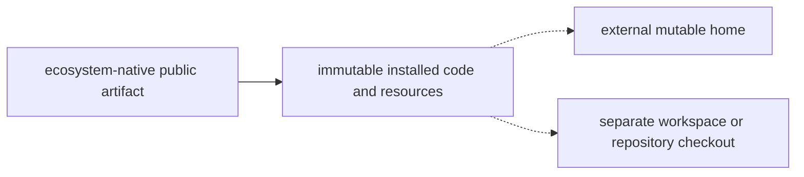

# Immutable distribution lifecycle audit

> Design evidence, not a status ledger. R10.1 and DIST-001–004 in
> `extensibility-roadmap.md` own execution status and closure evidence.

## Decision

Python wheel is the right public artifact for GEODE's Python runtime, four
console entry points, and immutable resources. It is not a data wheel, agent
workspace, Git checkout, state store, sandbox image, or generated-output root.

Keep one `geode-agent` wheel. Split a second distribution only after an
independent embedding contract, dependency budget, or release cadence is
measured. The current kernel wheel remains a CI-only architecture projection.

## Frontier distribution boundary

Audit date: 2026-08-25. External claims below use primary documentation or
source.

The artifact type follows the implementation ecosystem. The shared rule is
that the installed artifact is not the mutable state root or the workspace.

| System | Public artifact | Wheel role | Mutable state / workspace | GEODE decision |
|--------|-----------------|------------|---------------------------|----------------|
| Prime Agent (`06860844`) | A checksum-verified npm tarball ships the TypeScript product, skills, documentation, and bundled `prime-agent-runtime` Python source. [release packer](https://github.com/PrimeIntellect-ai/prime-agent/blob/06860844e13e46a599320fa2828629391f6f2ffd/scripts/pack-prime-agent-release.mjs#L281-L337), [package payload](https://github.com/PrimeIntellect-ai/prime-agent/blob/06860844e13e46a599320fa2828629391f6f2ffd/packages/coding-agent/package.json#L25-L45) | The Python package is an internal kernel-install input, not the public product artifact. Bootstrap installs the bundled source into a user-owned `~/.prime/agent/kernel-venv`. [runtime package](https://github.com/PrimeIntellect-ai/prime-agent/blob/06860844e13e46a599320fa2828629391f6f2ffd/prime-agent-runtime/pyproject.toml#L1-L18), [kernel bootstrap](https://github.com/PrimeIntellect-ai/prime-agent/blob/06860844e13e46a599320fa2828629391f6f2ffd/packages/coding-agent/src/core/kernel/bootstrap.ts#L659-L745) | Sessions and configuration live under `~/.prime/agent`; project packages and work remain outside the global install. [sessions](https://github.com/PrimeIntellect-ai/prime-agent/blob/06860844e13e46a599320fa2828629391f6f2ffd/packages/coding-agent/docs/sessions.md#L3-L18), [packages](https://github.com/PrimeIntellect-ai/prime-agent/blob/06860844e13e46a599320fa2828629391f6f2ffd/packages/coding-agent/docs/packages.md#L18-L60) | Adopt the immutable-artifact/user-owned-runtime boundary. Reject an npm wrapper: Python and uv already provide GEODE's native product installation path. |
| Codex CLI (`2e467591`) | Installer, Homebrew, and an npm launcher deliver a target-native executable and helpers. [install](https://github.com/openai/codex/blob/2e4675919ee9c90a0b1360e0826fe7117d71cebb/README.md#L15-L48), [package builder](https://github.com/openai/codex/blob/2e4675919ee9c90a0b1360e0826fe7117d71cebb/codex-cli/scripts/build_npm_package.py#L229-L303) | None; its implementation is a native binary rather than a Python product. | Prompts and system skills are embedded or fingerprint-installed, while config, threads, history, logs, and SQLite state live under `CODEX_HOME`; the Git checkout stays separate. [skills](https://github.com/openai/codex/blob/2e4675919ee9c90a0b1360e0826fe7117d71cebb/codex-rs/skills/src/lib.rs#L55-L99), [config](https://github.com/openai/codex/blob/2e4675919ee9c90a0b1360e0826fe7117d71cebb/codex-rs/core/src/config/mod.rs#L4694-L4703) | Adopt immutable code/assets plus an external mutable home. |
| Codex Cloud | The public contract is a managed task environment with a selected repository checkout, setup phase, agent phase, diff, and optional PR. [cloud environments](https://learn.chatgpt.com/docs/environments/cloud-environment), [AGENTS.md](https://learn.chatgpt.com/docs/agent-configuration/agents-md), [skills](https://learn.chatgpt.com/docs/build-skills) | No public wheel or internal package-layout contract is exposed; do not infer one. | The task container and checkout are the execution and mutation boundary. Repository instructions and repo/user skills retain their own scopes. | Require a real GEODE checkout for git-as-optimizer mutation and promotion. Keep image and sandbox policy outside the wheel. |
| OpenClaw (`935c555c`) | One npm product package ships runtime and bundled skills; candidate updates are verified in a temporary prefix before replacement. [install](https://github.com/openclaw/openclaw/blob/935c555c98d6b38af76faa6a0b1370353d1828df/README.md#L22-L64), [updater](https://github.com/openclaw/openclaw/blob/935c555c98d6b38af76faa6a0b1370353d1828df/docs/install/updating.md#L204-L216) | None; it is a Node product. | Mutable configuration, credentials, sessions, SQLite, managed skills, and the agent workspace remain outside the package. [workspace](https://github.com/openclaw/openclaw/blob/935c555c98d6b38af76faa6a0b1370353d1828df/docs/concepts/agent-workspace.md#L13-L27), [state](https://github.com/openclaw/openclaw/blob/935c555c98d6b38af76faa6a0b1370353d1828df/docs/concepts/agent-workspace.md#L104-L140) | Adopt one product artifact, exact bundled defaults, and external workspace/state tiers. Adapt updater sequencing; do not copy its plugin manager. |
| autoresearch (`228791fb`) | There is no published product package: users clone the repository and create its dependency environment with `uv sync`. [setup](https://github.com/karpathy/autoresearch/blob/228791fb499afffb54b46200aca536f79142f117/README.md#L21-L65), [project metadata](https://github.com/karpathy/autoresearch/blob/228791fb499afffb54b46200aca536f79142f117/pyproject.toml#L1-L27) | No published wheel; `pyproject.toml` describes the source environment. | The experiment loop creates a Git branch, mutates `train.py`, commits kept candidates, and leaves result state outside the package. [program](https://github.com/karpathy/autoresearch/blob/228791fb499afffb54b46200aca536f79142f117/program.md#L7-L17) | Preserve Git as promotion authority. Do not reinterpret installed package data as the repository. |

## Local writer-reader audit

| GAP | Before | Resolved boundary |
|-----|--------|-------------------|
| DIST-001 | `core.paths` derived the scaffold SoT from installed `core/paths.py`; ledger, policy, epoch, mutation, and promotion writers could change `site-packages` and attempt Git operations there. | Reads may use packaged reference inputs. Every mutation/promotion writer calls `require_evolve_workspace()` before its first side effect. Rolling ledgers are excluded from wheel/sdist. Installed smoke hashes all distribution files, attempts a write, and requires byte-identical `RECORD` ownership afterward. |
| DIST-002 | The helper build script and runtime lookup defaulted to `<distribution>/.geode/ComputerUseHelper`. | Packaged Swift/build sources remain read-only. `geode setup`, the script default, and runtime lookup share `GEODE_HOME/helpers/computer-use`. |
| DIST-003 | Hatch force-included all `.geode/skills`; several entries required repository files, missing scripts, or one operator's filesystem. | Hatch and artifact gates list eight self-contained built-ins exactly. Repository and personal skills remain external tiers. Installed smoke loads the exact set and its companion files. |
| DIST-004 | The updater replaced a live uv-tool before stopping the old daemon, and the tracked distribution skill repeated that obsolete order. | Source and uv-tool paths plus operator guidance share stop-before-replace. Stop failure prevents installation, install failure leaves serve stopped, `--no-restart` remains stopped, and a restart succeeds only when CLI output and IPC greeting versions match. |

## Invariants

- Package data is immutable and reproducible; user and experiment state is not
  package data.
- A wheel may expose `geode-evolve`, but real mutation/promotion requires an
  explicit writable GEODE Git checkout (`GEODE_EVOLVE_WORKSPACE` when not
  launched inside it).
- Worker `GEODE_STATE_ROOT` remains a per-worker scratch override; it does not
  become promotion authority.
- Built-in skills are exact release inputs. Project and personal skills keep
  their existing higher-precedence external roots.
- Upgrades never run old daemon code against newly replaced package files.

## Rejected additions

- no second public core/eval/evolve wheel;
- no workspace manager or package-state registry;
- no public kernel-wheel SKU;
- no candidate-install/atomic-swap framework until zero-downtime rollback is a
  measured requirement;
- no new plugin manager.
