# Storage Hierarchy — root vs project decision

Where does each piece of GEODE state live, and why? This document captures
the **decision rules** synthesized from three frontier harnesses (Claude
Code, Hermes Agent by NousResearch, OpenClaw) and applied to GEODE's
two-tier layout (`~/.geode/` + `{workspace}/.geode/`).

The decision drives both writers (where new data lands) and the
migration runner at `core/wiring/layout_migrator.py` (where legacy data
gets moved on the next boot).

## Agent context / config graph

```mermaid
flowchart TB
    shell["os.environ\nsession override\nnever written by GEODE"]

    subgraph home["User-global: GEODE_HOME (default ~/.geode)"]
        env[".env\nsecrets only\nAPI keys, channel tokens"]
        config["config.toml\nglobal behavior defaults"]
        auth["auth.toml\nplans, profiles, OAuth metadata"]
        profile["identity/ + user_profile/\ncross-project user context"]
        runtime["usage/, diagnostics/, logs/,\ntranscripts/, projects/<id>/,\nself-improving runtime"]
    end

    subgraph workspace["Workspace: <project>/.geode"]
        project_config["config.toml\nproject behavior overrides"]
        memory["memory/, rules/, skills/\nproject context"]
        project_runtime["reports/, scheduler logs,\nresult_cache/"]
    end

    subgraph repo["Repo-tracked source"]
        geode_md["GEODE.md / AGENTS.md\nagent + contributor constraints"]
        sot["core/self_improving/state/\ntracked autoresearch SoT"]
    end

    shell --> settings["Settings / Context assembly"]
    env --> settings
    project_config --> settings
    config --> settings
    auth --> settings
    profile --> context["LLM context tiers"]
    memory --> context
    geode_md --> context
    sot --> context
    runtime --> observe["diagnostics + history"]
    project_runtime --> observe

    settings --> loop["AgenticLoop"]
    context --> loop
```



Standalone SVG version: [`docs/diagrams/geode-context-config-paths.html`](../diagrams/geode-context-config-paths.html).

Read order and write targets are intentionally asymmetric:

- Shell exports are the highest-precedence session override. GEODE never
  writes them.
- `~/.geode/.env` is the authoritative secret store. `./.env` is an explicit
  advanced fallback that only fills missing global secrets.
- `./.geode/config.toml` overrides `~/.geode/config.toml` for behavior because
  behavior is often project-specific.
- Runtime data that is user-private or machine-local stays under
  `~/.geode/`. Project context that may travel with a workspace stays under
  `<workspace>/.geode/`.

## Three frontier patterns

| Harness | Policy | Reference |
|---------|--------|-----------|
| **Claude Code** | Dual — `~/.claude/` for user-private state (sessions, auto memory keyed by project hash) + `.claude/` for team-shareable items (`settings.json`, `CLAUDE.md`, `skills/`, `hooks/`). 5-source priority: policy > flag > local > project > user. | `claude-code/src/config/settings.ts:1-26`, `claude-code/src/session/manager.ts:11-48`, `claude-code/src/core/system-prompt.ts:36-97` |
| **Hermes Agent** | Single — `~/.hermes/` only. Project-local rejected. Profiles (`~/.hermes/profiles/<name>/`) replace per-project isolation. Justified by: cross-platform messaging (Telegram / Discord / Slack have no cwd notion), cron jobs that aren't bound to a project, project move/delete safety. | `hermes-agent/hermes_cli/profiles.py:1-9, 35-50`, `hermes-agent/hermes_constants.py:14-68, 165-188` |
| **OpenClaw** | Single — `~/.openclaw/agents/<agentId>/`. Gateway-centric. 4-level session keys (`agent:<id>:<scope>:<rest>`) handle isolation as routing concern, not directory nesting. | `openclaw/src/config/paths.ts:60-89`, `openclaw/src/infra/state-migrations.ts:517-661`, `openclaw/src/routing/session-key.ts` |

**Frontier consensus** — 2 of 3 reject project-local entirely. The one that
keeps it (Claude Code) uses project-local only for **explicitly
team-shareable items intended to be committed to git**.

## GEODE's hybrid

GEODE is closer to Claude Code than Hermes/OpenClaw because:

- It is a **per-workspace agent runtime** — the IP analysis plugin, the
  scheduler, the `CLAUDE.md` scaffold are all bound to a specific
  project tree.
- A workspace can be cloned, archived, or moved — project-local state
  that follows the workspace is sometimes the correct mental model
  (e.g., a project-specific cron schedule, project-specific rules).
- But many concerns (session transcripts, snapshots, result caches,
  embedding caches) are user-private and should not pollute the
  workspace.

The split is therefore deliberate, not accidental.

## Decision rules

| Question | Answer | Tier |
|----------|--------|------|
| Is it a credential / OAuth token? | yes | `~/.geode/auth.toml` |
| Is it a raw API key or channel token? | yes | `~/.geode/.env` |
| Is it a project-only secret fallback? | yes | `./.env` (explicit scope only; never shadows global) |
| Is it cross-project user identity (career, preferences, learned memory)? | yes | `~/.geode/identity/`, `~/.geode/user_profile/` |
| Is it agent operating state (LLM usage, session transcript, diagnostics)? | yes | `~/.geode/` top-level (`usage/`, `diagnostics/`, `approval_history.jsonl`) |
| Is it project-bound but user-private (per-project session, snapshot, cache)? | yes | `~/.geode/projects/<encoded-cwd>/` (Claude Code parity) |
| Is it project-bound + meant to be committed / team-shareable? | yes | `{workspace}/.geode/` (rules, skills, custom config) |
| Is it project-bound + user-generated output? | yes | `{workspace}/.geode/reports/` |
| Is it a project-scoped scheduled job? | yes | `{workspace}/.geode/scheduled_tasks.json` (the schedule travels with the workspace) |

## Writer contract

All new writers should import constants from `core.paths` instead of
reconstructing path literals.

| Writer intent | API / constant | Default target |
|---------------|----------------|----------------|
| Save API keys or channel tokens | `core.config.env_io.upsert_env()` | `~/.geode/.env` |
| Save project-only secret fallback | `upsert_env(..., scope="project")` | `./.env` |
| Remove stale dotenv masks | `core.config.env_io.remove_env()` | both `~/.geode/.env` and `./.env` |
| Save behavior globally | `upsert_config_toml(..., scope="global")` | `~/.geode/config.toml` |
| Save behavior for this workspace | `upsert_config_toml(..., scope="project")` | `./.geode/config.toml` |
| Add new durable state | `core.paths.<NAMED_CONSTANT>` | choose by decision rules above |

## Concrete GEODE layout (current — verified correct)

```
~/.geode/                                  user-private state
├── auth.toml                              # credentials + plans + routing
├── config.toml                            # global config overrides
├── cli.sock                               # thin-CLI ↔ serve IPC
├── .env                                   # secrets
├── .layout-version                        # migration marker (v0.95.x+)
│
├── identity/career.toml                   # cross-project user identity
├── user_profile/{learned,preferences,profile}.md
├── skills/                                # personal skills (user-tier)
│
├── usage/<YYYY-MM>.jsonl                  # LLM cost time-series
├── diagnostics/<YYYY-MM>.log              # fa4 cross-process append-only
├── approval_history.jsonl                 # HITL audit
├── logs/serve.log                         # serve daemon log
│
├── mcp/                                   # MCP state (registry cache + traces)
│   ├── registry-cache.json
│   └── <server>/trace-runs/run-<id>/
├── petri/logs/*.eval                      # Petri evaluation raw
│
├── projects/<encoded-cwd>/                # per-project user-private state
│   ├── journal/{runs,errors}.jsonl        # execution journal
│   ├── sessions/                          # session transcripts
│   ├── snapshots/snap-*.json              # langgraph checkpoints
│   └── result_cache/                      # tool result memoization
│
├── runs/geode-<hash>.jsonl                # per-run log (TODO: bucket by YYYY-MM)
├── workers/<task>.{result.json,stderr.log} # delegate worker output
├── scheduler/                             # legacy global scheduler (predates project-local)
├── vault/{general,research}/              # accumulated agent outputs (TTL TODO)
│
└── models/                                # reserved (empty)


{workspace}/.geode/                        project-bound, potentially team-shareable
├── config.toml                            # project-level config overrides
├── memory/PROJECT.md                      # project insights (`G4` tier in system prompt)
├── rules/*.md                             # project rules (loaded by tag)
├── skills/                                # project-specific skills
├── reports/                               # generated reports (user output)
├── scheduled_tasks.json + .lock           # project-scoped cron jobs
└── scheduler_logs/                        # scheduler run history
```

## Migration policy

Migrations live in `core/wiring/layout_migrator.py` and run at every
bootstrap via `core.paths.ensure_directories()` (idempotent — module-level
once-flag, dotfile marker `~/.geode/.layout-version`).

| Version | Step | Status |
|---------|------|--------|
| v0 → v1 | Path reconciliation — `serve.log`, `approve_history.json`, `mcp-registry-cache.json` to canonical locations | done |
| v1 → v2 | Vestigial constant cleanup — `PROJECT_EMBEDDING_CACHE` has no writer; remove if confirmed unused after one release window | this PR (marker bump only) |
| v2 → v3 | TBD — bucket `~/.geode/runs/geode-*.jsonl` by `<YYYY-MM>/` (currently flat at 600+ files) | backlog |
| v3 → v4 | TBD — vault TTL policy (`~/.geode/vault/{general,research}/` currently 1800+ flat files) | backlog |

Pattern for adding a new migration (mirrors Hermes
`SessionDB._init_schema` at `hermes-agent/hermes_state.py:550-678`):

1. Bump `GEODE_LAYOUT_VERSION`.
2. Append a step to `_run_pending_migrations` under
   `if current_version < N:`.
3. Each step must be **idempotent** (safe to re-run partially) and
   **lossless** (no file ever disappears mid-move).
4. Conflicts (both source and destination present) → leave source in
   place + warn; never overwrite user data.

## Reference

- `core/paths.py` — current path constants
- `core/wiring/layout_migrator.py` — migration runner (v0.95.x+)
- `core/memory/project.py` — project memory cascade (project → global)
- `core/cli/cmd_lifecycle.py` — `/clean` / `/uninstall` consumers (must
  honour the same tier rules)
