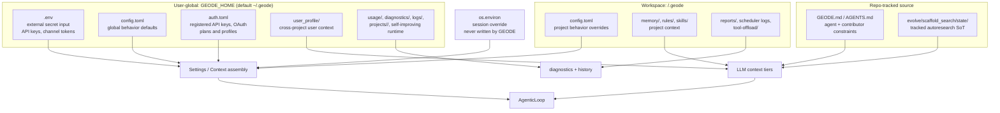

# Storage Hierarchy — root vs project decision

Where does each piece of GEODE state live, and why? This document captures
the **decision rules** synthesized from three frontier harnesses (Claude
Code, Hermes Agent by NousResearch, OpenClaw) and applied to GEODE's
two-tier layout (`~/.geode/` + `{workspace}/.geode/`).

The decision drives both writers (where new data lands) and the
migration runner at `core/wiring/layout_migrator.py` (where legacy data
gets moved on the next boot).

## Agent context / config graph


```mermaid
flowchart TB
    shell["os.environ\nsession override\nnever written by GEODE"]

    subgraph home["User-global: GEODE_HOME (default ~/.geode)"]
        env[".env\nexternal secret input\nAPI keys, channel tokens"]
        config["config.toml\nglobal behavior defaults"]
        auth["auth.toml\nregistered API keys, OAuth\nplans and profiles"]
        profile["user_profile/\ncross-project user context"]
        runtime["usage/, diagnostics/, logs/,\nprojects/<id>/, self-improving runtime"]
    end

    subgraph workspace["Workspace: <project>/.geode"]
        project_config["config.toml\nproject behavior overrides"]
        memory["memory/, rules/, skills/\nproject context"]
        project_runtime["reports/, scheduler logs,\ntool-offload/"]
    end

    subgraph repo["Repo-tracked source"]
        geode_md["GEODE.md / AGENTS.md\nagent + contributor constraints"]
        sot["evolve/scaffold_search/state/\ntracked autoresearch SoT"]
    end

    shell --> settings["Settings / Context assembly"]
    env --> settings
    project_config --> settings
    config --> settings
    auth --> settings
    profile --> context["LLM context tiers"]
    memory --> context
    geode_md --> context
    sot --> context
    runtime --> observe["diagnostics + history"]
    project_runtime --> observe

    settings --> loop["AgenticLoop"]
    context --> loop
```

Standalone SVG version: [`docs/diagrams/geode-context-config-paths.html`](../diagrams/geode-context-config-paths.html).

Read order and write targets are intentionally asymmetric:

- Shell exports are the highest-precedence session override. GEODE never
  writes them.
- `auth.toml` owns GEODE-registered LLM credentials. Environment variables and
  `~/.geode/.env` remain external secret inputs; in a trusted folder `./.env`
  fills missing global environment values. Registered profile selection
  follows the routing owner, not the precedence rules for environment-backed
  settings alone.
- `./.geode/config.toml` overrides `~/.geode/config.toml` for behavior because
  behavior is often project-specific. Its MCP servers, `[gateway]` table and
  keys that widen capability apply only in a trusted folder;
  `geode config trust` records trust in the global `config.toml` under
  `[projects."<path>"]` (see
  [project trust](https://mangowhoiscloud.github.io/geode/docs/config/basics/#project-trust)).
- Runtime data that is user-private or machine-local stays under
  `~/.geode/`. Project context stays under `<workspace>/.geode/`, which
  bootstrap adds to the workspace `.gitignore`.

## Three frontier patterns

| Harness | Policy | Reference |
|---------|--------|-----------|
| **Claude Code** | Dual — `~/.claude/` for user-private state (sessions, auto memory keyed by project hash) + `.claude/` for team-shareable items (`settings.json`, `CLAUDE.md`, `skills/`, `hooks/`). 5-source priority: policy > flag > local > project > user. | `claude-code/src/config/settings.ts:1-26`, `claude-code/src/session/manager.ts:11-48`, `claude-code/src/core/system-prompt.ts:36-97` |
| **Hermes Agent** | Single — `~/.hermes/` only. Project-local rejected. Profiles (`~/.hermes/profiles/<name>/`) replace per-project isolation. Justified by: cross-platform messaging (Telegram / Discord / Slack have no cwd notion), cron jobs that aren't bound to a project, project move/delete safety. | `hermes-agent/hermes_cli/profiles.py:1-9, 35-50`, `hermes-agent/hermes_constants.py:14-68, 165-188` |
| **OpenClaw** | Single — `~/.openclaw/agents/<agentId>/`. Gateway-centric. 4-level session keys (`agent:<id>:<scope>:<rest>`) handle isolation as routing concern, not directory nesting. | `openclaw/src/config/paths.ts:60-89`, `openclaw/src/infra/state-migrations.ts:517-661`, `openclaw/src/routing/session-key.ts` |

**Frontier consensus** — 2 of 3 reject project-local entirely. The one that
keeps it (Claude Code) uses project-local only for **explicitly
team-shareable items intended to be committed to git**.

## GEODE's hybrid

GEODE is closer to Claude Code than Hermes/OpenClaw because:

- It is a **per-workspace agent runtime** — the IP analysis plugin, the
  scheduler, the `CLAUDE.md` scaffold are all bound to a specific
  project tree.
- A workspace can be cloned, archived, or moved — project-local state
  that follows the workspace is sometimes the correct mental model
  (e.g., a project-specific cron schedule, project-specific rules).
- But many concerns (session records, snapshots, result caches,
  embedding caches) are user-private and should not pollute the
  workspace.

The split is therefore deliberate, not accidental.

## Decision rules

| Question | Answer | Tier |
|----------|--------|------|
| Is it a GEODE-registered LLM API key / OAuth credential? | yes | `~/.geode/auth.toml` |
| Is it an externally supplied API key or channel token? | yes | environment / `~/.geode/.env` |
| Is it a project-only secret fallback? | yes | `./.env` (explicit scope only; read only in trusted folders; never shadows global) |
| Is it cross-project user identity (career, preferences, learned memory)? | yes | `~/.geode/user_profile/` |
| Is it queryable project runtime state or an operational event? | yes | `~/.geode/projects/<encoded-cwd>/sessions/sessions.db` |
| Is it a portable, bounded run projection? | yes | owning run directory `events.jsonl` |
| Is it an immutable evaluation trajectory? | yes | owning artifact bundle `trajectory.json` |
| Is it a reviewed public trajectory release? | yes | external `geode-eval-artifacts/trajectories/<content-id>/` |
| Is it an append-only cost series or diagnostic log? | yes | owning JSONL/log directory under `~/.geode/` |
| Is it project-bound but user-private (per-project session, snapshot, cache)? | yes | `~/.geode/projects/<encoded-cwd>/` (Claude Code parity) |
| Is it project-bound config or context (rules, skills, project settings)? | yes | `{workspace}/.geode/` (project-local; gitignored by default) |
| Is it project-bound + user-generated output? | yes | `{workspace}/.geode/reports/` |
| Is it a project-scoped scheduled job? | yes | `{workspace}/.geode/scheduled_tasks.json` (scoped to that workspace) |

## Writer contract

`core/auth/auth_toml.py` owns credential-plan serialization and reload. Explicit
profile pins and ordered choices are persisted alongside profiles and routing;
legacy files without those tables have no file-owned preference. Reload validates
the complete candidate before changing live stores. A missing or invalid file
leaves them unchanged; a valid file removes only entries that it still owns.
Reading never creates or rewrites the file. Managed CLI credentials and
environment fallbacks stay with their original owner: environment API keys remain
in `~/.geode/.env` and appear only as runtime `origin=environment` profiles.
Unchanged profiles retain cooldown/health state, while a replaced credential does
not mutate objects already borrowed by running work. Every change runs through
`auth_file_transaction`: under an exclusive lock it edits a candidate read from
the current file, writes it atomically and only then reloads the live stores, so
a stale process copy cannot revive removed entries or restore rotated tokens and a
failed write changes neither the file nor the live state. Thin clients change
login state through the daemon except for terminal key entry and browser logins,
which write the file locally and send the value-free `/login refresh` signal.

Explicit `/key`, PAYG `/login add`, `/login set-key` and `/login anthropic`
entries select the entered profile through `ProfileStore`'s existing pin/order
owner before persistence. Hydration alone does not override an operator's choice.
`core/llm/routing.py` is the shared route owner. New sessions resolve an explicit
credential setting and `forced_login_method` as compatible constraints; conflicts
fail admission. A composed provider-routing policy supplies the model plan chain
before the stored auth plan order. With no explicit choice, registered plan kind
priority selects the source before account availability. Missing or expired
subscription accounts never authorize PAYG fallback.

`SessionModelConfig` retains the concrete source for the primary model and
explicit reflection/judge overrides. Future default changes do not re-infer it.
Within that source, the SDK selects the requested model's available plan account
and endpoint, then honors profile pin/order inside the allowed plan chain.
Unavailable explicit plans fail; only an unconfigured same-source route may use
its existing settings/environment credential fallback. The model picker, billing
context and effort probe consume the same route owner. Declared external adapter
routes remain explicit; a family name alone does not register a provider.

`/login source` validates future policy before saving. A connected client submits
its source-only session candidate and requires an applied acknowledgment before
saving defaults. Without a client the command changes future defaults only.
The runtime `manage_login source` tool uses that same source candidate builder
and the loop's model-selection admission. It reports pending until the complete
tool batch ends, updates matching primary/auxiliary roles together and leaves
persisted defaults unchanged; an absent owning session or unused provider is rejected.
`/login use` and `/login route` change plan order: requests can select another
account inside the already concrete source, but cannot switch billing sources.
`/login refresh` reconciles credentials before subsequent SDK account selection.
Their loop-owned cache compares key/endpoint identity under its existing lock;
replacement clients serve new requests while prior clients remain open until the
owning loop drains them. A failed reload preserves the published selection;
a failed client construction keeps the previous cached client owned.

`core/config/toml_edit.py` owns resolved config-TOML reads and writes; the Settings
loader, CLI role reader and config explainer reuse it. Schema owners stay separate.
An explicit empty dotenv role value masks lower TOML values and means inheritance;
the explainer reports that actual winner instead of treating empty as absent.

All new writers should import constants from `core.paths` instead of
reconstructing path literals.

| Writer intent | API / constant | Default target |
|---------------|----------------|----------------|
| Register an LLM API key | `core.auth.auth_toml.save_api_key()` | `~/.geode/auth.toml` |
| Save channel tokens / external environment input | `core.config.env_io.upsert_env()` | `~/.geode/.env` |
| Save project-only secret fallback | `upsert_env(..., scope="project")` | `./.env` |
| Remove stale dotenv masks | `core.config.env_io.remove_env()` | both `~/.geode/.env` and `./.env` |
| Save behavior globally | `upsert_config_toml(..., scope="global")` | `~/.geode/config.toml` |
| Save behavior for this workspace | `upsert_config_toml(..., scope="project")` | `./.geode/config.toml` |
| Add new durable state | `core.paths.<NAMED_CONSTANT>` | choose by decision rules above |

Hook persistence follows the more specific
[`event-persistence.md`](event-persistence.md) contract: queryable events go
to SQLite; JSONL remains only for ordered artifacts, bounded job tails, and
git-reviewable evidence ledgers.

## Concrete GEODE layout (current — verified correct)

```
~/.geode/                                  user-private state
├── auth.toml                              # credentials + plans + routing
├── .auth.toml.lock                        # serializes auth.toml changes
├── config.toml                            # global config; also records project trust
├── routing.toml                           # user override of core/config/routing.toml
├── extension-policy.json                  # grants for non-bundled MCP, hooks, skills, adapters
├── cli.sock                               # thin-CLI ↔ serve IPC
├── .env                                   # secrets
├── .layout-version                        # migration marker (v0.95.x+)
├── prompt_history                         # REPL input history (0600, secrets redacted)
│
├── user_profile/                          # cross-project user identity
│   ├── {profile,learned}.md
│   ├── preferences.json
│   └── career.toml                        # moved from identity/ by layout v5
├── skills/                                # personal skills (user-tier)
│
├── usage/<YYYY-MM>.jsonl                  # LLM cost time-series
├── evidence/<session>.jsonl               # v2 judgment rows; session/turn/call joins
├── diagnostics/<YYYY-MM>.log              # fa4 cross-process append-only
├── approval_history.jsonl                 # legacy archive; runtime writer retired
├── logs/serve.log                         # serve daemon log
│
├── mcp/                                   # MCP state (registry cache + traces)
│   ├── registry-cache.json
│   └── <server>/trace-runs/run-<id>/
├── petri/logs/*.eval                      # Petri evaluation raw
│
├── projects/<encoded-cwd>/                # per-project user-private state
│   ├── journal/runs.jsonl                 # execution journal
│   ├── sessions/
│   │   └── sessions.db                    # checkpoints + session_events + hook_events SoT
│   └── result_cache/                      # pipeline result LRU cache
│
├── runs/{*.jsonl,_archive/}               # retired global archives; no new session history
├── workers/<task>.{result.json,stderr.log} # delegate worker output
├── scheduler/                             # legacy global scheduler (predates project-local)
├── vault/{general,research}/              # accumulated agent outputs (TTL TODO)
│
└── models/                                # reserved (empty)


{workspace}/.geode/                        project-local, gitignored by default
├── config.toml                            # project config overrides (capability keys need trust)
├── memory/PROJECT.md                      # project insights (`G4` tier in system prompt)
├── rules/*.md                             # project rules (loaded by tag)
├── skills/                                # project-specific skills
├── hooks/                                 # project hook plugins (need an extension-policy grant)
├── user_profile/                          # project overrides of ~/.geode/user_profile/
├── reports/                               # generated reports (user output)
├── tool-offload/<session>/                # large tool results kept out of context
├── scheduled_tasks.json + .lock           # project-scoped cron jobs
└── scheduler_logs/                        # scheduler run history


<owning run directory>/                     bounded portable/evaluation artifacts
├── events.jsonl                           # geode.run-event@1 projection
├── sub_agents/<session>/events.jsonl      # correlated sub-agent projection
└── trajectory.json                        # geode.trajectory@1 immutable export


<evaluation artifact release>/              public, append-only after review
├── manifest.json                           # admission, privacy attestation, file/source digests
└── *.json                                  # schema-valid geode.trajectory@1 files
```

## Migration policy

Migrations live in `core/wiring/layout_migrator.py` and run at every
bootstrap via `core.paths.ensure_directories()` (idempotent — module-level
once-flag, dotfile marker `~/.geode/.layout-version`). The current target is
v5 (`GEODE_LAYOUT_VERSION`).

| Version | Step | Status |
|---------|------|--------|
| v0 → v1 | Path reconciliation — `serve.log` → `logs/serve.log`, `approve_history.json` → `approval_history.jsonl`, `mcp-registry-cache.json` → `mcp/registry-cache.json` | done |
| v1 → v2 | Vestigial directory archival — the current workspace's `.geode/embedding-cache/` and `.geode/vectors/` move to `.geode/_archive/<name>-<UTC>/`; empty ones are removed | done |
| v2 → v3 | TTL archival — entries in `runs/`, `vault/general/`, `vault/research/` and `projects/` not modified for 30 days (`GEODE_ARCHIVE_TTL_DAYS`) move to that directory's `_archive/<YYYY-MM>/` | done |
| v3 → v4 | Messages backfill — each session's `messages.json` is copied into the `messages` table of its `sessions.db` | done |
| v4 → v5 | Career profile — `identity/career.toml` → `user_profile/career.toml`; an empty `identity/` is removed | done |
| schema-only | Add `sessions.db:hook_events`; leave legacy run JSONL untouched | additive `CREATE IF NOT EXISTS` (no layout marker bump) |
| schema-only | Add `sessions.db:session_events` + `session_event_imports`; retire new global transcript writes | additive, explicit digest-backed import |

Pattern for adding a new migration (mirrors Hermes
`SessionDB._init_schema` at `hermes-agent/hermes_state.py:550-678`):

1. Bump `GEODE_LAYOUT_VERSION`.
2. Append a step to `_run_pending_migrations` under
   `if current_version < N:`.
3. Each step must be **idempotent** (safe to re-run partially) and
   **lossless** (no file ever disappears mid-move).
4. Conflicts (both source and destination present) → leave source in
   place + warn; never overwrite user data.

## Reference

- `core/paths.py` — current path constants
- `core/wiring/layout_migrator.py` — migration runner (v0.95.x+)
- `core/observability/session_timeline.py` — canonical session record and import
- `core/observability/record_paths.py` — `events.jsonl` compatibility reader
- `core/observability/trajectory.py` — validated evaluation export
- `core/observability/trajectory_release.py` — public staging, scan, digest, read-back
- `core/memory/project.py` — project memory cascade (project → global)
- `core/cli/commands/lifecycle.py` — `/clean` / `/uninstall` consumers (must
  honour the same tier rules)
