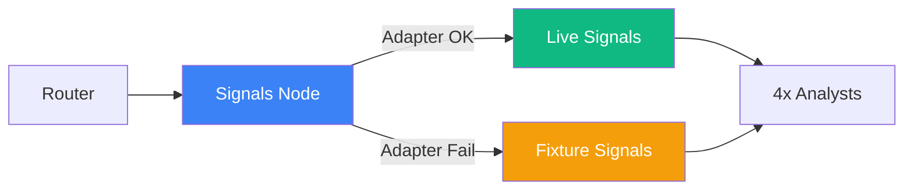

# MCP Adapter와 Composite Signal — 외부 데이터 소스 통합 설계

> Date: 2026-03-09 | Author: geode-team | Tags: MCP, adapter, composite-signal, graceful-degradation, signal-enrichment

## 목차

1. 도입: Agent에게 실시간 데이터가 필요하다
2. MCP Client Base — 타임아웃과 연결 관리
3. Signal Adapter 구현체
4. Composite Signal Adapter — 체인 병합과 Fallback
5. Pipeline 통합 — Adapter-First 실행
6. 마무리

---

## 1. 도입: Agent에게 실시간 데이터가 필요하다

AI Agent가 정확한 분석을 수행하려면 정적 fixture 데이터를 넘어 실시간 외부 시그널이 필요합니다. Steam 동시접속자, Reddit 감성, YouTube 조회수 등이 IP의 현재 가치를 판단하는 핵심 지표입니다.

GEODE는 MCP(Model Context Protocol)를 통해 외부 데이터 소스에 접근하고, Composite Signal Adapter(복합 시그널 어댑터)로 여러 소스를 체인 병합합니다.

## 2. MCP Client Base — 타임아웃과 연결 관리

```python
# geode/infrastructure/adapters/mcp/base.py
class MCPTimeoutError(TimeoutError):
    """MCP 도구 호출이 설정된 타임아웃을 초과했을 때 발생합니다."""

class MCPClientBase:
    """MCP 클라이언트 기반 클래스. 연결 관리와 타임아웃 강제."""

    def __init__(self, server_url: str, *, timeout_s: float = 30.0) -> None:
        self._server_url = server_url
        self._timeout_s = timeout_s
        self._connected = False

    def connect(self) -> bool:
        """MCP 서버 연결. 성공 시 True."""

    def call_tool(self, tool_name: str, arguments: dict[str, Any]) -> dict[str, Any]:
        """타임아웃이 적용된 도구 호출.

        Raises:
            ConnectionError: 미연결.
            MCPTimeoutError: 타임아웃 초과.
        """
        if hasattr(signal, "SIGALRM"):
            old_handler = signal.signal(signal.SIGALRM, _timeout_handler)
            signal.alarm(int(self._timeout_s))
        try:
            # MCP SDK 호출
            ...
        finally:
            if hasattr(signal, "SIGALRM"):
                signal.alarm(0)  # 알람 취소
```

> Unix SIGALRM 기반 타임아웃으로 응답 없는 MCP 서버로 인한 파이프라인 행을 방지합니다. 기본 30초로 설정되며, 파이프라인 전체 타임아웃(120초)과 독립적으로 동작합니다.

## 3. Signal Adapter 구현체

### Steam MCP Adapter

```python
# geode/infrastructure/adapters/mcp/steam_adapter.py
class SteamMCPSignalAdapter:
    """Steam 게임 시그널 MCP 어댑터. SignalEnrichmentPort 구현."""

    def fetch_signals(self, ip_name: str) -> dict[str, Any]:
        if not self._client.is_connected():
            return {}
        try:
            result = self._client.call_tool("get_game_info", {"query": ip_name})
            return {
                "steam_players_current": result.get("player_count", 0),
                "steam_review_score": result.get("review_score", 0),
                "steam_review_count": result.get("review_count", 0),
                "_enrichment_source": "steam_mcp",
            }
        except Exception as exc:
            log.warning("Steam MCP failed for %s: %s", ip_name, exc)
            return {}

    def is_available(self) -> bool:
        return self._client.is_connected()
```

### Brave Search Adapter

```python
# geode/infrastructure/adapters/mcp/brave_adapter.py
class BraveSearchAdapter:
    """Brave Search MCP 어댑터. 웹 검색 결과 제공."""

    def search(self, query: str, *, count: int = 5) -> list[dict[str, Any]]:
        if not self._client.is_connected():
            return []
        result = self._client.call_tool("brave_web_search", {"query": query, "count": count})
        return result.get("results", [])
```

### Knowledge Graph Memory Adapter

```python
# geode/infrastructure/adapters/mcp/memory_adapter.py
class KGMemoryAdapter:
    """Knowledge Graph Memory MCP 어댑터. 교차 세션 분석 기억."""

    def create_entities(self, entities: list[dict[str, Any]]) -> bool: ...
    def search(self, query: str) -> list[dict[str, Any]]: ...
    def add_observations(self, observations: list[dict[str, Any]]) -> bool: ...
```

> 각 Adapter는 `is_available()`로 연결 상태를 확인하고, 실패 시 빈 결과를 반환합니다. 모든 예외는 내부에서 처리되어 호출자에게 전파되지 않습니다.

## 4. Composite Signal Adapter — 체인 병합과 Fallback

여러 시그널 소스를 하나의 인터페이스로 통합합니다.

```python
# geode/infrastructure/adapters/mcp/composite_signal.py
class CompositeSignalAdapter:
    """다중 시그널 어댑터를 체인으로 병합. SignalEnrichmentPort 구현."""

    def __init__(self, adapters: list[SignalEnrichmentPort]) -> None:
        self._adapters = adapters

    def fetch_signals(self, ip_name: str) -> dict[str, Any]:
        """어댑터를 순서대로 실행하고 결과를 병합합니다.

        - 사용 가능한 어댑터만 실행
        - 키 충돌 시 후순위가 덮어씀 (경고 로그)
        - _enrichment_sources로 출처 추적
        - 전체 실패 시 빈 dict (fixture fallback)
        """
        merged: dict[str, Any] = {}
        sources: list[str] = []

        for adapter in self._adapters:
            if not adapter.is_available():
                continue
            try:
                signals = adapter.fetch_signals(ip_name)
                if signals:
                    for key in signals:
                        if key in merged and not key.startswith("_"):
                            log.debug("Signal key '%s' overwritten by %s",
                                      key, type(adapter).__name__)
                    merged.update(signals)
                    sources.append(signals.get("_enrichment_source", type(adapter).__name__))
            except Exception as exc:
                log.warning("Signal adapter %s failed: %s", type(adapter).__name__, exc)

        if sources:
            merged["_enrichment_sources"] = sources
        return merged

    def is_available(self) -> bool:
        return any(a.is_available() for a in self._adapters)
```

> 체인의 한 어댑터가 실패해도 나머지는 계속 실행됩니다. `_enrichment_sources` 메타데이터로 어떤 소스가 기여했는지 추적합니다. 키 충돌은 후순위 어댑터가 우선하며 debug 로그로 기록됩니다.

```
CompositeSignalAdapter
  ├── SteamMCPSignalAdapter    → steam_players, steam_reviews
  ├── BraveSearchAdapter       → web_results
  └── KGMemoryAdapter          → knowledge_graph

  결과: merged dict + _enrichment_sources: ["steam_mcp", "brave", "kg_memory"]
```

## 5. Pipeline 통합 — Adapter-First 실행

Signals Node는 Adapter를 우선 시도하고, 실패 시 fixture로 fallback합니다.

```python
# geode/nodes/signals.py
_signal_adapter_ctx: ContextVar[SignalEnrichmentPort | None] = ContextVar(
    "signal_adapter", default=None
)

def signals_node(state: GeodeState) -> dict[str, Any]:
    """Adapter-First + Fixture Fallback 시그널 로드."""
    ip_name = state["ip_name"]

    # 1. 주입된 어댑터 시도 (live API)
    adapter = _signal_adapter_ctx.get()
    if adapter is not None and adapter.is_available():
        try:
            signals = adapter.fetch_signals(ip_name)
            if signals:
                return {"signals": signals}
        except Exception as exc:
            log.warning("Signal adapter failed: %s — fixture 사용", exc)

    # 2. Fixture fallback (항상 동작)
    fixture = load_fixture(ip_name)
    return {"signals": fixture["signals"]}
```

> ContextVar로 어댑터를 주입하므로, 테스트에서 Mock 어댑터를 쉽게 교체할 수 있습니다. Fixture는 항상 존재하므로 외부 API 장애가 파이프라인 전체를 중단시키지 않습니다.

### Pipeline 위치



## 6. 마무리

### 핵심 정리

| 항목 | 값/설명 |
|---|---|
| MCP 프로토콜 | stdio/SSE 기반 연결, 30초 타임아웃 |
| Signal Adapter | Steam, Brave Search, KG Memory |
| Composite 패턴 | 순서 실행, 병합, 충돌 시 후순위 우선 |
| Fallback 전략 | Adapter-First → Fixture (항상 동작) |
| 출처 추적 | `_enrichment_sources` 메타데이터 |
| DI 방식 | ContextVar (스레드 안전, 테스트 교체 용이) |

### 체크리스트

- [ ] MCPClientBase 타임아웃(SIGALRM) 구현
- [ ] Signal Adapter별 is_available() + 예외 처리
- [ ] CompositeSignalAdapter 체인 병합 + 충돌 로그
- [ ] _enrichment_sources 메타데이터 추적
- [ ] Signals Node Adapter-First + Fixture Fallback
- [ ] ContextVar 주입으로 테스트 어댑터 교체
