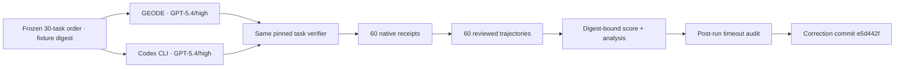

# GPT-5.4 GEODE × Codex MCPMark filesystem/standard corrected observation

## 판정

같은 30개 task, GPT-5.4 subscription, effort `high`, upstream state와
verifier를 사용한 1회 paired run에서 GEODE는 **21/30(70.0%)**, Codex CLI는
**20/30(66.7%)**를 기록했다. 차이는 **+1/30, +3.33%p**다.

60개 native arm과 verifier receipt는 완전하지만, 사후 source audit에서 두 arm의
1,200초 timeout 시작 경계가 같지 않았음이 확인됐다. 따라서 원래 prospective
analysis의 `hypothesis_status=supported`는 append-only correction에서
**invalidated**로 대체됐다. 21/30 대 20/30은 retrospective descriptive observation
으로만 남으며, 인과 비교·효율·가설 지지·승격 권한은 없다. 127-task MCPMark
Verified leaderboard 점수도 아니다.

## Research contract

| Field | Frozen value |
|---|---|
| Research question | 같은 30개 `filesystem/standard` task에서 GPT-5.4/high를 쓰는 GEODE와 Codex는 어떻게 다른가? |
| Research gap | shared-fixture race, runner argument 오류, false convergence, exception-shaped verifier, model-execution timeout ownership을 정리한 완전한 paired run이 없었다. |
| Hypothesis | GEODE accuracy가 Codex보다 10%p 이상 낮지 않고 native-reported input이 더 적다. |
| Primary metric | `(GEODE passes - Codex passes) / 30` |
| Decision rule | 30쌍이 모두 infrastructure-valid이고 delta ≥ -0.10이며 GEODE native input이 더 적을 때 문자 그대로의 가설을 지지한다. |
| Invalidation | route/model/effort/revision/task order/reset/verifier 불일치, native result·trajectory·verifier receipt 누락, escaped runtime exception |
| Interpretation limit | 1회 반복이며 pass@k·신뢰구간·runtime 인과·과금 효율을 주장하지 않는다. |
| Post-run correction | GEODE는 `loop.arun`, Codex는 `process.communicate`를 timed surface로 삼아 equal-hard-deadline 조건을 충족하지 못했다. 가설 판정은 invalidated다. |

점수와 native input의 산술 조건만 보면 가설 문구와 맞지만, preregistered timeout
조건이 깨졌으므로 가설은 무효다. Native input도 서로 다른 cache accounting의
영향을 받으므로 결과를 “GEODE가 token-efficient하다”로 해석하지 않는다.

## Frozen identity

| Field | Value |
|---|---|
| Run ID | `mcpmark-filesystem-standard-gpt54-high-geode-codex-k1-boundary-aligned-20260813` |
| Execution | 2026-08-13 04:06:31–08:15:16 KST, 4:08:45 elapsed |
| Tasks | MCPMark Verified `filesystem/standard`, 30, `k=1` |
| Workload SHA-256 | `50483308573ce407abaf0700885d56c6df0453557669dddce9edcece83710433` |
| GEODE | `a8f45f3c9f05860656ced8c57f12fbc7d3b49159` |
| Codex | CLI 0.145.0, source `dad1db87bb5ad4b92af6b0f58502d12453681f81` |
| Harness | `eval-sys/mcpmark@cd45b7f57923b9b3985467f5139927575f83141c` |
| Task tree | `7b8c71786a427e1d58e2fc5b0fba5d1fefa43054` |
| Verifier compatibility patch | SHA-256 `04a34e664f590c36bc85765581318c0887000f6ca79213efd97705795ca4dac4` |
| Model route | GPT-5.4, subscription, effort `high` |
| Order | task당 두 arm 직렬 실행, task index에 따라 선행 arm 교대 |
| GEODE timeout boundary | 1,200초가 MCP setup·`list_tools`·loop build 뒤 `loop.arun`만 감쌌다. |
| Codex timeout boundary | subprocess 생성 뒤 `process.communicate` 1,200초; Codex 내부 MCP startup은 이 구간 안이다. |

Verifier patch는 성공 조건을 바꾸지 않는다. 결과 directory가 없거나 file인
경우 세 verifier가 traceback을 내던 네 `iterdir()` 호출에 `.is_dir()` guard를
추가해 ordinary FAIL receipt를 만들 뿐이다. 30개 empty-state verifier와 네
wrong-type case가 모두 traceback 없이 exit 1임을 model call 전에 확인했다.

## Descriptive result

| Metric | GEODE | Codex CLI |
|---|---:|---:|
| Passed | **21 / 30** | **20 / 30** |
| Accuracy | **70.0%** | **66.7%** |
| Native input | 7,740,631 | 14,750,143 |
| Cache-read | 3,535,872 | 13,305,216 |
| Cache-excluded input | **4,204,759** | **1,444,927** |
| Output | 316,284 | 271,945 |
| Reasoning | 206,200 | 123,431 |
| Task wall | 7,842.4s | 6,970.2s |
| MCP call/result pairs | 703 / 703 | 727 / 727 |
| Tool-result errors | 46 | 16 |
| Score-bearing execution timeout | 1 | 1 |

Paired bucket은 `both-pass=17`, `both-fail=6`, `GEODE-only=4`,
`Codex-only=3`이다. GEODE는 MCP call 수가 3.3% 적었지만 cache-excluded input은
2.91배, output은 16.3%, reasoning은 67.1%, wall은 12.5% 많았다. Native input
총합만 보면 반대 결론이 나오므로 cache accounting을 분리하지 않은 효율 비교는
허용하지 않는다. Codex의 `turn_count=1/task`는 outer exec 단위이고 GEODE inner
round와 같은 단위가 아니어서 비교하지 않는다.

## Failure taxonomy

| Bucket | Task | Grounded outcome |
|---|---|---|
| GEODE only | `desktop_template/contact_information` | 같은 전화번호를 join해 Charlie Davis를 Dentist로 찾았다. |
| GEODE only | `folder_structure/structure_analysis` | 최대 depth 7을 맞췄고 Codex는 6으로 계산했다. 단 GEODE는 훨씬 많은 wall/reasoning을 사용했다. |
| GEODE only | `folder_structure/structure_mirror` | 제거 대상 부모의 자식을 함께 pruning했다. |
| GEODE only | `student_database/gradebased_score` | Math의 A/D와 pass/fail 집계를 정확히 계산했다. |
| Codex only | `legal_document/individual_comments` | GEODE가 네 대형 법률문서의 셀을 오계수했다. |
| Codex only | `student_database/english_talent` | GEODE가 19명 중 Sarah Wilson을 누락했다. |
| Codex only | `votenet/requirements_writing` | GEODE가 명시된 dependency `networkx`를 누락했다. Codex는 작성 후 다시 읽었다. |
| Both fail | `desktop_template/budget_computation` | 두 arm 모두 같은 세 `Business` 행을 제외했다. 자연어 지시와 verifier 기대 사이 모호성이 있다. |
| Both fail | `desktop_template/file_arrangement` | 서로 다른 개인 파일을 work로 오분류했다. |
| Both fail | `papers/author_folders` | GEODE는 128 calls 뒤 timeout, Codex는 150 calls 뒤 불완전한 폴더만 남겼다. |
| Both fail | `threestudio/output_analysis` | 둘 다 요구된 시작 line 323/324를 보고서에 쓰지 않았다. |
| Both fail | `threestudio/requirements_completion` | GEODE는 73 calls 뒤 `openai` 누락, Codex는 첫 tool call 전 1,200초 timeout이었다. |
| Both fail | `votenet/debugging` | 두 arm 모두 verifier가 인정하는 line-72 bug가 아닌 뒤쪽 `fp2_inds` bug를 수정했다. |

동일 bucket이 동일 원인을 뜻하지 않는다. 예를 들어
`requirements_completion`은 GEODE의 search/stop failure와 Codex의 pre-action
timeout이 한 행에 모인 경우다. `budget_computation`과 `votenet/debugging`은
runtime 회귀보다 benchmark 계약 품질을 별도 조사해야 한다.

## Runtime findings

### 1. Convergence repair가 실제 false stop을 제거했다

이전 invalid pilot은 `project_management`의 한 parallel batch에서 공통 prefix를
가진 parent-missing 오류를 세 번으로 세어 `convergence_detected`로 종료했다.
현재 구현은 observation round마다 input-aware fingerprint 하나만 적재하고
success/mixed round에서 streak를 끊는다. 이번 run은 첫 all-error batch 6개와
다음 mixed batch(error 3 + success 1)를 관측한 뒤 parent-first 순서로 복구해
53 calls로 PASS했다.

### 2. 반복 오류는 모델 지능보다 action contract 쪽에 집중됐다

GEODE의 46개 tool error completion은 모두 계약·순서형이었다.

- parent 없는 nested `create_directory`: 25
- `read_text_file`에서 상호 배타적인 `head`와 `tail` 동시 지정: 20
- 초기 working-directory 거부: 1

Codex는 16개(초기 working-directory 12, parent 누락 4)였고 `head+tail` 오류는
0이었다. 다음 우선순위는 새 planner보다 MCP schema에서 mutual exclusion을
정확히 노출하고, 성공 검색·재독 반복을 측정하는 것이다. 의미를 바꿀 수 있는
자동 argument 삭제는 하지 않는다.

### 3. 공개된 25K tool-result 정책이 비교 표면의 차이로 관측됐다

GEODE의 공개 runtime 계약은 MCP result를 전역 기본값 25,000 tokens로 제한한다.
Large context tier의 `0`은 이 직렬화 경로에서 “전역 상한보다 더 작은 모델별
override 없음”으로 합성된다. 일반 runtime은 대형 결과를 먼저 offload하지만,
이번 MCPMark adapter는 `AgenticLoop`를 직접 만들고 offload store를 연결하지 않아
25K guard가 그대로 적용됐다.

실제로 5/30 task의 observation 5건이 이 경로를 탔다.

| Task | Guard 전 추정 tokens | Outcome |
|---|---:|---|
| `legal_document/dispute_review` | 69,912 | PASS |
| `legal_document/individual_comments` | 93,239 | FAIL |
| `legal_document/solution_tracing` | 139,720 | PASS |
| `papers/author_folders` | 283,935 | timeout FAIL |
| `papers/organize_legacy_papers` | 195,694 | PASS |

이는 양 runtime이 실제로 가진 input-surface 차이이며, retrospective description에
포함된다. 세 task는 절삭 후에도 PASS했으므로
절삭이 실패의 원인이라고 단정할 수 없다. 다만 `author_folders`는 143 read
reference 중 67개가 반복됐고 128 calls 동안 mutation 없이 timeout됐다. 다음
실험은 제품 정책을 바꾸기 전에 기존 설정으로 가능한 `25K / unlimited(0) /
offload+chunk hint`를 별도 사전등록해 비교한다.

평가 후 내부 helper 계약은 large/standard tier가 `None`으로 전역 상한에
위임한다고 명시하도록 정리했다. 직렬화 동작과 이번 score는 바뀌지 않는다.

### 4. PostVerify는 token 팽창 원인이 아니다

이번 MCPMark verifier는 agent가 종료한 뒤 Stage 3에서 별도 실행됐고 결과가
행동 루프로 되먹임되지 않았다. Cache-excluded input 팽창의 직접 관측 원인은
Stage 2의 대형 bulk read 후 재독, 성공 검색 반복, schema-invalid call이다.

## Trajectory and publication

| Quality | GEODE | Codex |
|---|---:|---:|
| Reviewed trajectories | 30 | 30 |
| Canonical events | 1,646 | 1,735 |
| Exact tool pairs | 703 | 727 |
| Orphan / missing call IDs | 0 | 0 |
| Missing required turn IDs | 0 | 0 |
| Scope-complete | 30 / 30 | 30 / 30 |
| Replay-complete | 0 / 30 | 0 / 30 |

원 measurement bundle은 72 files, 3,032,207 bytes다. Raw `messages.json`,
`meta.json`, execution logs, raw trajectory, provider diagnostics, local fixture
state와 세 invalid pilot의 원문은 402개 withheld entry로 digest만 결속했다.
공개 72개와 withheld 402개는 합계 474-entry publication receipt에서 누락 없이
분류됐고, correction commit은 기존 bytes를 바꾸지 않고 정정 sidecar 2개를
추가했다.

- [Corrected comparison bundle](https://github.com/mangowhoiscloud/geode-eval-artifacts/tree/e5d442f25c9fb4861e28744dbe924a36325c746b/mcpmark/results-paired/mcpmark-filesystem-standard-gpt54-high-geode-codex-k1-boundary-aligned-20260813)
- [Superseding analysis](https://github.com/mangowhoiscloud/geode-eval-artifacts/blob/e5d442f25c9fb4861e28744dbe924a36325c746b/mcpmark/results-paired/mcpmark-filesystem-standard-gpt54-high-geode-codex-k1-boundary-aligned-20260813/analysis.superseding-2026-08-13.json) and [correction receipt](https://github.com/mangowhoiscloud/geode-eval-artifacts/blob/e5d442f25c9fb4861e28744dbe924a36325c746b/mcpmark/results-paired/mcpmark-filesystem-standard-gpt54-high-geode-codex-k1-boundary-aligned-20260813/correction.json)
- [GEODE trajectory release](https://github.com/mangowhoiscloud/geode-eval-artifacts/tree/e5d442f25c9fb4861e28744dbe924a36325c746b/trajectories/mcpmark-geode-gpt54-high-mcpmark-filesystem-standard-gpt54-high-geode-codex--818b13fe1039-20260812T231820Z-ed26f124b9c7), manifest SHA-256 `ed26f124b9c781b32aafc7d4dd8183c8666aa5d9214ee52dc8e9def3d657928f`
- [Codex trajectory release](https://github.com/mangowhoiscloud/geode-eval-artifacts/tree/e5d442f25c9fb4861e28744dbe924a36325c746b/trajectories/mcpmark-codex-gpt54-high-mcpmark-filesystem-standard-gpt54-high-geode-codex--f749317fe281-20260812T231820Z-828560273a4e), manifest SHA-256 `828560273a4e5fdc0c029a171c40384102b497dfd867ae934d1687eba4ba4c04`
- [Original publication disclosure receipt](2026-08-13-mcpmark-geode-codex-gpt54-filesystem-standard.publication.json)
  (the artifact correction above supersedes its interpretation)

Artifact PR #22의 원 공개 72개 파일은 exact merge commit `c5683ea5...`에서
byte/SHA를 검증했다. PR #23은 기존 파일을 바꾸지 않고 correction sidecar 두 개를
추가했으며, merge commit `e5d442f25c9fb4861e28744dbe924a36325c746b`에서 두
SHA와 supersession decision을 원격 재검증했다. 두 trajectory release는 불변이다.

## Attempt lineage

원 analysis는 30-pair attempt 하나를 선택했다. Correction은 새 execution attempt를
만들거나 기존 row를 고치지 않고, 동일 evidence 위에 superseding analysis를
추가했다. 그 전에 보존된 세 run은 서로 다른 run ID의 infrastructure-invalid
lineage이며 분모에 합치지 않았다.

1. parallel k3 pilot: shared lazy fixture unzip race
2. first sequential pilot: runner word-splitting, false convergence, exception-shaped verifier
3. boundary-fixed partial pilot: 18 pairs 뒤 pair 19에서 operator abort

마지막 pilot의 provider error는 ordinary retry state에 흡수됐지만, recovery 여부가
확정되기 전에 operator가 중단했다. 따라서 transport-fatal score도, 유효한 18-task
score도 만들지 않았다.

## Next measurement

동일 비교를 다시 주장하려면 먼저 양 arm의 setup/execution을 같은 deadline
contract로 감싸고 실행 가능한 runner를 공개해야 한다. 그 뒤 전체 30-task
재실행보다 아래 작은 ablation을 먼저 수행한다.

1. 위 대형 결과 5개 task: `25K / unlimited(0) / offload+chunk hint`, 각 k≥3
2. `english_talent`, `individual_comments`: 현재 batch 대 10-file chunk, 각 k≥3
3. `votenet/requirements_writing`: 작성 후 requirement re-read/checklist 유무, k≥3

공통 측정값은 verifier accuracy, cache-excluded input, 재독 수, wall, tool-error
rate다. 이 실험 없이 이번 +3.33%p를 일반 성능 우위나 runtime 승격 근거로 쓰지
않는다.

## Verification

- 30/30 pairs and 60/60 native arms produced complete score evidence.
- 60/60 meta, summary, verifier, log digest, model/route/effort, and task hash joins passed.
- 60/60 trajectory integrity checks passed with zero orphan tool events.
- Post-run source audit found the frozen equal-timeout condition was not implemented; the original supported analysis is superseded and invalidated.
- Two trajectory releases passed manifest-pinned local and remote read-back verification.
- Original publication allowlist, 72 public byte/SHA checks, 402 withheld disclosure checks, and identity/secret scans passed; two append-only correction sidecars passed remote read-back.
