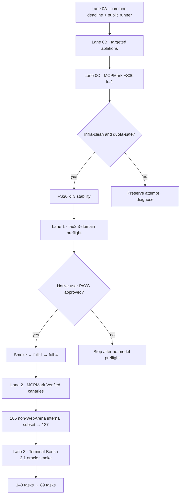

# Sequential agent benchmark execution plan

작성일: 2026-08-13
최종 갱신: 2026-08-14
기준 코드: GEODE `origin/main@f4b3760488a80dad1186d54458f63bbb08768719`
상태: **Lane 0C k=1 complete · artifact published. k=3 live blocked by WHAM=80%; Tau2 no-model preflight may proceed.**

## 1. 권한과 범위

이 문서는 현재 benchmark queue의 **순서, 진입·종료 조건, 실행 상태**만
소유한다. 점수 정본은 각 native harness result, 행동 증거는 reviewed trajectory,
판정 증거는 verifier receipt, 공개 무결성은 eval-artifact manifest가 계속
소유한다.

2026-08-12의
[리더보드 정렬 계획](../plans/2026-08-12-leaderboard-aligned-agent-benchmarks.md)은
당시 설계 근거로 보존한다. 그 문서의 실행 순서와 모델 선택은 이 문서가
대체한다. 기존 결과와 artifact는 수정하지 않는다.

다음은 이번 사이클의 비목표다.

- suite 점수를 하나의 종합 점수로 합치지 않는다.
- 일부 task를 official leaderboard headline으로 부르지 않는다.
- `geode_user` 결과를 tau native user-simulator 결과로 바꾸어 부르지 않는다.
- 측정 전에 새 범용 benchmark framework를 만들지 않는다.
- infrastructure-invalid attempt를 0점이나 valid prefix로 재해석하지 않는다.

## 2. 현재 근거

| 근거 | 현재 판정 | 다음에 닫을 GAP |
|---|---|---|
| [GPT-5.4 MCPMark Gate 0C corrective FS30](2026-08-14-mcpmark-gate0c-filesystem30-gpt54-high.md) | Prospective common-deadline k=1 direct pair: GEODE 23/30, Codex 21/30, signed delta +2/30 = +6.67%p supported. One GEODE score-bearing timeout; token coverage 29/30 vs 30/30 | Fresh k=3 stability is still required; live launch blocked while WHAM=80%; no promotion authority |
| [GPT-5.4 MCPMark Gate 0B tool-cap ablation](2026-08-14-mcpmark-gate0b-tool-cap-gpt54-high.md) | Prospective k=3 direct diagnostic: `guard-25000` 7/15, `unlimited-0` 10/15, signed delta +0.20 supported. Four matched score-bearing timeouts; token totals exact on 13/15 per arm only | Product-default change is not authorized; proceed to common-deadline FS30 k=1 |
| [GPT-5.4 MCPMark FS30 observation](2026-08-13-mcpmark-geode-codex-gpt54-filesystem-standard.md) | GEODE 21/30, Codex 20/30. Timeout 시작 경계가 달라 retrospective description만 허용 | 동일 timed surface와 공개 runner |
| GPT-5.4 Tau2 base 3-domain | `geode_agent + geode_user` 200/278 | native GPT-5.2-low user와 4 trials는 별도 official-profile 측정 |
| MCPMark Verified | GEODE는 여러 service 경로가 있으나 Codex pair는 filesystem만 검증 | service canary, credential/reset, Codex service contract |
| Terminal-Bench | 정본 문서가 2.0이며 GEODE adapter 없음 | 2.1 pin, Harbor/Docker oracle, 최소 adapter |

이전 FS30 결과에서 관측된 `+3.33%p`는 새 run의 baseline이지 승격 근거가
아니다. Native total input도 cache accounting이 달라 효율 지표로 사용하지
않는다.

## 3. 순차 실행 그래프

한 lane이 exit gate를 통과하기 전에는 다음 lane의 model call을 시작하지 않는다.
문서·adapter·fixture 준비는 병렬로 조사할 수 있지만 score-bearing 실행은 위
순서를 따른다.

## 4. 실행 상태

| Lane | 상태 | 다음 행동 | Exit gate |
|---|---|---|---|
| 0A Common deadline | **COMPLETE · MAIN** | None; contract is the basis for 0B/0C | setup/action boundary, timeout·cancel·cleanup tests and no-model preflight PASS |
| 0B Targeted ablation | **COMPLETE · PUBLISHED** | Preserve 7/15 vs 10/15 as diagnostic-only; no cap-default change | 30/30 valid arms, primary +3/15 = +0.20 supported, six releases/26 admitted trajectories, four timeout trajectories withheld |
| 0C MCPMark FS30 | **K=1 COMPLETE · PUBLISHED · K=3 LIVE-BLOCKED (WHAM=80%)** | Preserve k=1 as diagnostic-only; launch fresh k=3 only after five-hour quota headroom is safe | k=1: 60/60 valid arms, exact task/reset/verifier joins, primary +2/30; k=3 remains separate |
| 1 Tau2 base | **NO-MODEL PREFLIGHT READY · LIVE BLOCKED** | 278 IDs/pin/user/budget no-model preflight may proceed; no model calls yet | Gate 0C stability and PAYG approval before smoke→full-1→4 trials |
| 2 MCPMark Verified | PENDING | service별 no-model canary | FS30 pair와 full127 headline 분리 |
| 3 Terminal-Bench 2.1 | PENDING | 2.1 profile 정렬·oracle smoke | adapter/evidence path clean 후 89 tasks |

## 5. Lane 0 — MCPMark corrective comparison

### 5.1 Research contract

| Field | Frozen intent |
|---|---|
| Question | 동일한 task/state/verifier/model/effort와 동일 timed action surface에서 GEODE와 Codex의 verifier accuracy와 행동 비용은 어떻게 다른가? |
| Gap | 이전 run은 GEODE가 `loop.arun`만, Codex가 process communication을 재어 prospective timeout equality가 깨졌다. Exact runner도 공개되지 않았다. |
| Hypothesis | Corrective FS30에서 GEODE accuracy가 Codex보다 10%p 이상 낮지 않다. |
| Primary | `(GEODE passes - Codex passes) / 30` |
| Secondary | arm accuracy, cache-excluded input, output/reasoning, task wall, MCP error rate, repeated reads/searches |
| Authority | `diagnostic`, `promotion_authority=none` until the timed surface and k≥3 stability are proven |

### 5.2 Common freeze matrix

| Axis | Required value |
|---|---|
| Harness | `eval-sys/mcpmark@cd45b7f57923b9b3985467f5139927575f83141c` plus digest-bound verifier compatibility patch |
| Workload | `filesystem/standard` 30 ordered IDs; compact JSON SHA-256 `50483308573ce407abaf0700885d56c6df0453557669dddce9edcece83710433` |
| Model | GPT-5.4 subscription, effort `high`, both arms |
| Order | task별 두 arm 직렬, 선행 arm 교대; task 간 overlap 없음 |
| Deadline | adapter `execute` entry부터 MCP startup/list-tools 또는 process spawn과 action 종료까지의 단일 monotonic deadline; timeout은 이 owner가 발생시킨 경우만 score-bearing |
| State | serial fixture seed, exact task tree/reset receipt, no shared lazy extraction |
| Verifier | same pinned `verify.py` digest per task; verifier runs after agent action and is not fed back into the loop |
| Retry | provider/runtime retry surfaces recorded; infrastructure retry is a new append-only attempt |
| Evidence | native result, verifier index, normalized trajectory, exact task/tool-schema/reset digests |

“End-to-end”는 evaluator 전체를 과장해 부르지 않는다. 구현 후 실제로 동일하게
감싼 구간을 run spec에 이름 붙이고, fixture setup이나 verifier가 범위 밖이면
그 사실과 bounded cleanup grace를 명시한다.

### 5.3 Gate 0A — no-model deadline proof

최소 구현만 허용한다.

1. 기존 두 adapter가 공유할 수 있는 가장 작은 absolute deadline boundary를 사용한다.
2. setup hang, action hang, inner `TimeoutError`, cancellation, cleanup을 synthetic
   subprocess/MCP로 검증한다.
3. 실행 순서·task hash·arm alternation·sentinel을 고정한 redacted runner를
   repository 또는 artifact에 공개한다.
4. 기존 native evaluator와 verifier는 재구현하지 않는다.

Action deadline은 evidence 보존과 fixture cleanup을 잘라내지 않는다. Deadline
후에는 별도 고정 grace에서 session terminal, child kill/reap, log flush,
trajectory/receipt를 보존한다. 이 finalization이 실패하거나 grace를 넘으면
semantic FAIL이 아니라 infrastructure-invalid다. Upstream fixture setup과
Stage-3 verifier는 공통 action deadline 밖에 있으며 별도 receipt로 결속한다.

다음 중 하나면 model call 전 중단한다.

- 두 arm에서 deadline start/stop 의미가 다름
- timeout이 partial JSON/trajectory를 valid complete로 승격함
- cancel/exception에서 child process나 fixture가 남음
- runner가 exact order/reset/verifier identity를 결속하지 못함

### 5.4 Gate 0B — targeted ablations

현재 제품 동작을 바꾸지 않고 실행할 수 있는 intervention은
`max_tool_result_tokens`뿐이다. 아래 30회만 prospective spec으로 동결한다.
여기서 `k=3`은 measurement replication이며 best-of-3가 아니다.

| Axis | Frozen value |
|---|---|
| Question | `Does removing the 25K tool-result guard on the same large-result MCP tasks increase verifier accuracy and change rereads, fresh input tokens, and wall time?` |
| Hypothesis | `Across 15 task-repetitions per arm, unlimited-0 produces more verifier passes than guard-25000.` |
| Tasks, ordered | `legal_document/dispute_review`, `legal_document/individual_comments`, `legal_document/solution_tracing`, `papers/author_folders`, `papers/organize_legacy_papers` |
| Workload SHA-256 | compact ordered JSON `b0953abbe11808bd25a03ef97355380ae2a58f0086025cd2557f1cacf32f3a00` |
| Arm A | GEODE GPT-5.4/high/subscription; `GEODE_MAX_TOOL_RESULT_TOKENS=25000` |
| Arm B | 같은 route; `GEODE_MAX_TOOL_RESULT_TOKENS=0` |
| Replication | task별 arm당 3개의 fresh attempt, labels `upstream-run-1..3`: `5 tasks × 2 arms × k=3 = 30` |
| Order | repetition별 task 순서는 고정하고, task index와 repetition parity로 선행 arm을 교대한다. Arm 간 fixture·session·process를 재사용하지 않는다. |
| Constants | Gate 0A의 1,200초 action deadline, `budget={"kind":"wall-time","limit":1200,"unit":"seconds"}`, harness/task tree/verifier patch, instruction, schema, reset, model, effort를 동일하게 고정한다. MCPMark adapter에는 offload store가 없음을 receipt에 기록한다. |
| Primary | `verifier-pass-rate arm delta`, unit `ratio`, direction `target`, aggregation `(sum(unlimited-0 passes) - sum(guard-25000 passes)) / 15`, denominator `15` |
| Secondary | cache-excluded input, output/reasoning, wall, MCP calls/errors, repeated read references, truncation count |
| Decision | `supported if unlimited-0 passes exceed guard-25000 passes; mixed if equal; not-supported if lower` |
| Invalidation | `Invalidate the run if any attempt changes the frozen deadline or identity contract, cannot bind the arm cap or reconstruct truncation, fails fixture cleanup or reset, lacks native result, verifier, or trajectory evidence, or exits on an unrecovered provider quota or transport error.` |
| Analysis | `Select all 30 fresh attempts; compute the signed verifier-pass-rate arm delta as (unlimited-0 passes - guard-25000 passes) / 15; report secondary token, wall-time, MCP call/error, reread, and truncation metrics for explanation only; preserve infrastructure-invalid attempts and do not replace or score them.` |
| Authority | diagnostic only; `promotion_authority=none` |

Arm order까지 포함한 exact matrix는 다음과 같다. 각 셀은 독립 process 두 개이며
왼쪽 arm을 먼저 실행한다.

| # | Task | Rep 1 | Rep 2 | Rep 3 |
|---:|---|---|---|---|
| 1 | `legal_document/dispute_review` | A→B | B→A | A→B |
| 2 | `legal_document/individual_comments` | B→A | A→B | B→A |
| 3 | `legal_document/solution_tracing` | A→B | B→A | A→B |
| 4 | `papers/author_folders` | B→A | A→B | B→A |
| 5 | `papers/organize_legacy_papers` | A→B | B→A | A→B |

즉시 중단하고 해당 attempt를 infrastructure-invalid로 보존한다.

- Gate 0A의 동일 deadline 계약이나 frozen identity가 한 attempt라도 달라짐
- arm 환경값이 native receipt에 결속되지 않거나 truncation 여부를 재구성할 수 없음
- fixture cleanup·reset 실패, escaped exception, native result·verifier·trajectory 누락
- provider quota/transport 오류가 ordinary recovered retry 밖으로 탈출함

`offload+chunk hint`, `10-file chunk`, `write→requirement re-read/checklist`는 현재
설정 arm이 아니다. MCPMark adapter에는 offload store와 `recall_tool_result`가
연결돼 있지 않고, batch 크기 및 mandatory re-read 정책 knob도 없다. 이 셋은
이번 run에서 구현하거나 prompt로 흉내 내지 않고, 독립 intervention 계약과
제품 변경 필요성이 생길 때만 후속 실험으로 연다.

Gate 0B는 2026-08-14 완료됐다. 같은 다섯 task를 arm별 k=3로 실행한 결과
`guard-25000`은 7/15, `unlimited-0`은 10/15였고 frozen primary delta는
`(10-7)/15 = +0.20`이므로 diagnostic hypothesis는 supported다. Paired bucket은
`both-pass=7`, `both-fail=5`, `unlimited-only=3`, `guard-only=0`이다.

Secondary full-arm behavior도 unlimited 쪽이 짧았다: action wall
6,076.699→4,910.217초, MCP calls 443→255, errors 75→27, repeated reads
211→63, truncations 15→0. 다만 `author_folders` repetition 2·3의 양 arm에서
발생한 네 1,200초 score-bearing timeout은 native token usage를 완성하지 못했다.
따라서 token 합계는 arm별 exact 13/15에만 적용하며, 제품 기본 cap 변경이나
MCPMark headline 승격 권한은 없다.

선택된 current attempt는 valid/mixed이며 30/30 arms를 완료했다. 앞선 별도 run
ID의 attempt-000은 timeout outcome classification 결함으로 sequence 14에서
중단된 infrastructure-invalid lineage이고 current denominator 기여는 0이다.
공개 artifact: `mangowhoiscloud/geode-eval-artifacts@17133f0c8e893b6d765fcef69712ba0867bd573a`의
`mcpmark/results-paired/mcpmark-gate0b-tool-cap-gpt54-high-20260813t142345z/`.

### 5.5 Gate 0C — corrective FS30

1. 한 frozen task를 양 arm에서 실행해 identity/reset/verifier/trajectory를 확인한다.
2. smoke가 clean이면 fresh run root에서 30 tasks, `k=1`을 실행한다.
3. Infrastructure defect가 하나라도 나오면 즉시 중단하고 attempt를 보존한다.
4. `k=1`이 clean이고 quota가 안전하면 같은 계약으로 `k=3` stability lane을
   실행한다. 이미 끝난 k=1을 k=3의 일부로 사후 편입하지 않는다.

Gate 0C `k=1`은 2026-08-14 완료됐다. 공통 adapter-owned 1,200초 action
deadline과 score-bearing semantic fixture를 결속한 30-task pair에서 GEODE는
23/30, Codex는 21/30이었고 frozen primary delta는
`(23-21)/30 = +0.066667 = +6.67%p`이므로 diagnostic hypothesis는 supported다.
Paired bucket은 `both-pass=17`, `both-fail=3`, `GEODE-only=6`, `Codex-only=4`다.

선택된 `attempt-001-complete`는 valid/mixed이며 60/60 arms를 완료했다. GEODE
`papers/author_folders` 한 건은 common owner가 증명한 score-bearing timeout이고,
cleanup·verifier가 완결돼 infrastructure-invalid가 아니다. 그 row의 native token
usage는 null이므로 exact token coverage는 GEODE 29/30, Codex 30/30이다.

Native execution log는 GEODE 644 calls/51 errors, Codex 678/17을 기록했다.
Normalized trajectory는 GEODE internal recovery 한 건을 별도 projection해
645 attempts이며 Codex는 678이다. Read/repeated-read references는 GEODE
798/81, Codex 838/213이다. 이 secondary behavior와 unmatched token coverage는
효율·인과·제품 정책 권한을 만들지 않는다.

59개 scope-complete trajectory를 공개하고 GEODE timeout trajectory 한 개는
withheld했다. Artifact:
`mangowhoiscloud/geode-eval-artifacts@1160fecfe4447f0a3f4cf30a414f29c61776d012/mcpmark/results-paired/mcpmark-gate0c-filesystem30-gpt54-high-20260813t190922z/`.
`promotion_authority=none`이며 fresh `k=3` stability가 남아 있다.

현재 machine `WHAM=80%`에서는 `k=3` live launch를 시작하지 않는다. Tau2의
278-ID/pin/user/budget no-model preflight는 병행할 수 있지만, Tau2 score-bearing
model call은 Gate 0C stability와 별도 PAYG 승인을 기다린다.

## 6. Lane 1 — tau2 base three-domain

공식 base workload는 Airline 50 + Retail 114 + Telecom 114 = **278 tasks per
trial**이다. 공식 submission profile은 같은 agent/user arguments와 4 trials를
요구하므로 arm당 1,112 simulations이다.

| Gate | Action | Stop condition |
|---|---|---|
| 1A | current upstream pin, 278 ordered IDs/hash, reset, seed schedule, GPT-5.4/high agent route를 no-model freeze | task/version drift |
| 1B | domain당 1 task smoke | route/user/state/verifier mismatch |
| 1C | 278-task full-1 | infra defect, missing receipt, quota boundary |
| 1D | 4 trials total | trial merge without exact per-trial lineage |

Native headline에는 upstream GPT-5.2-low user simulator가 필요해 PAYG 승인을
별도 확인한다. 승인이 없으면 1A에서 멈춘다. Subscription `geode_user` run을
native headline으로 재명명하지 않는다.

## 7. Lane 2 — MCPMark Verified

Current Verified standard는 Filesystem 30, GitHub 23, Notion 28, Playwright 4,
WebArena 21, Postgres 21로 총 127 tasks다.

1. service별 credential/reset/schema canary를 model call 없이 통과한다.
2. Codex paired arm은 현재 filesystem-only이므로, 확장 전에는 FS30만 paired
   claim을 가진다.
3. 먼저 non-WebArena 106 tasks를 **internal subset**으로 k=1 실행한다.
   이를 official `Core-106`으로 부르지 않는다.
4. 충분한 storage/VM/reset isolation을 확보한 뒤 full 127 k=1을 실행한다.
5. k=1이 clean할 때만 k=3 stability를 검토한다.

## 8. Lane 3 — Terminal-Bench 2.1

현재 GEODE 정본은 2.0이고 adapter가 없다. 실행보다 profile 정렬이 먼저다.

1. Terminal-Bench 2.1 primary source와 immutable dataset reference를 고정한다.
2. Harbor/Docker 환경에서 model-free oracle task가 pass하는지 확인한다.
3. GEODE adapter는 native post-run test와 transcript를 그대로 보존하는 최소
   wrapper만 만든다.
4. GPT-5.4/high 1–3 tasks smoke 후 clean하면 89-task run을 검토한다.
5. Official publication은 5 attempts/task를 요구하므로 내부 k=1 결과와
   official-style k=5를 분리한다.

공개 Codex GPT-5.4 77.3%는 structural reference다. Dataset, sandbox, resources,
network, timeout, attempts가 같기 전에는 direct comparison이 아니다.

## 9. 공통 evidence와 publication gate

각 score-bearing run은 model call 전에 `run-spec.json`을 동결하고 다음을 남긴다.

- append-only `attempts.jsonl`
- digest-bound native `runner-result.json`
- native harness result와 verifier/state receipt
- normalized trajectory release와 manifest
- workload, reset, tool-schema, runner digests
- digest-bound `analysis.json`
- privacy review와 publication manifest
- artifact merge SHA 원격 read-back

Invalid/aborted attempt가 선택되면 primary metric은 `not-measurable`이다. 점수
문구는 native numerator/denominator를 JSON Pointer로 참조해야 하며, trajectory는
점수 authority를 대체하지 않는다.

## 10. 중단·재개 규칙

즉시 중단:

- auth/429/quota 또는 provider transport가 run contract 밖으로 탈출함
- task order, state, verifier, model, effort, deadline identity 불일치
- partial output을 complete trajectory로 표기함
- fixture cleanup 실패나 다른 arm과 state collision
- artifact digest 또는 privacy 검증 실패

재개:

- 기존 output directory를 덮어쓰지 않는다.
- 새 attempt와 fresh run root를 만들고 parent lineage를 기록한다.
- frozen primary denominator를 partial shard로 채우지 않는다.
- 수정이 연구 조건을 바꾸면 새 run ID와 새 prospective spec을 만든다.

## 11. Deferred queue

`banking_knowledge`, BFCL V4, BrowseComp/DeepResearch는 위 네 lane이 안정된 뒤
검토한다. 현재는 adapter나 공통 추상화를 미리 만들지 않는다.

## 12. 변경 이력

| Date | Change |
|---|---|
| 2026-08-14 | Gate 0C prospective common-deadline FS30 k=1 완료·게시: GEODE 23/30 대 Codex 21/30, primary +2/30=+6.67%p supported diagnostic-only. 60/60 valid arms, paired buckets 17/3/6/4, one GEODE score-bearing timeout, exact token coverage 29/30 vs 30/30, 59 admitted trajectories/one withheld 보존. `promotion_authority=none`; fresh k=3 live는 WHAM=80%에서 차단하고 Tau2 no-model preflight만 허용 |
| 2026-08-14 | Gate 0B prospective k=3 완료·게시: `guard-25000` 7/15 대 `unlimited-0` 10/15, primary +3/15=+0.20 supported diagnostic-only. Four matched score-bearing timeouts, exact token coverage 13/15 per arm, prior invalid attempt denominator 0, six reviewed releases/26 admitted trajectories 보존. Lane 0C를 NEXT로 승격 |
| 2026-08-13 | Gate 0B runner implementation: 기존 serial runner에 5-task×2-cap×3-repeat profile, effective cap/offload receipt, direct `CallToolResult` truncation reconstruction, dependency/import preflight를 연결. Live run과 score/artifact는 아직 없음 |
| 2026-08-13 | Gate 0A main release: PR #2973 구현을 PR #2975로 main에 승격 |
| 2026-08-13 | Gate 0A local exit: 독립 안전 검토의 partial MCP enter, Codex descendant cleanup, late-return expiry, GEODE right-censor trajectory 4개 P1을 모두 수정. Adapter/runner 42 tests, 전체 CI mirror 10,471 passed/22 skipped, coverage 81.17%, Ruff/mypy/import/baseline/site gate 통과 |
| 2026-08-13 | Gate 0A local implementation: 공통 absolute deadline, bounded cleanup, immutable receipt, 공개 FS30 serial runner와 regression tests 추가. 병합·no-model preflight 전에는 live call 금지 |
| 2026-08-13 | Gate 0B code-surface audit: 현재 실행 가능한 arm을 `25K` 대 `unlimited(0)` 30회로 동결하고, offload/chunk/re-read 제안은 비존재 intervention으로 보류 |
| 2026-08-13 | 기존 MCPMark observation의 timeout correction과 targeted ablation 요구를 반영해 새 sequential execution SOT 생성. Lane 0A no-model audit 시작 |
