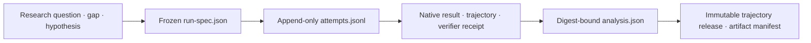

# GEODE Evaluation Index and Roadmap

> Action/tool-execution 4종 벤치마크. GEODE의 quality ratchet(P4)에 통합 예정.
> 각 문서는 **사례 + 필요 인프라 + 4-Phase 진행 시나리오**를 담음.
> 마지막 갱신: 2026-08-26

## LLM entry contract

평가 작업은 전체 디렉터리를 grep하는 대신 생성 색인
[`index.json`](index.json)에서 시작한다. 사람은 이 README를 읽고, Codex와
Claude Code는 동일한 정본인 [`.agents/skills/geode-eval/SKILL.md`](../../.agents/skills/geode-eval/SKILL.md)를
통해 필요한 문서만 점진적으로 연다.



이 계층은 기존 저장소를 대체하지 않는다. native harness 결과는 점수
정본, session/trajectory는 행동 증거, verifier receipt/state diff는 판정
증거, release manifest는 공개 무결성 정본이다. 새 sidecar는 그 앞뒤의
연구 의도와 시도 계보를 연결할 뿐 raw evidence를 복제하지 않는다.

새 실행은 모델 호출 전에
[`eval-run-spec.template.json`](eval-run-spec.template.json)을 복사해 질문,
GAP, 가설, 1차 지표, 판정·무효화 규칙, 재현 조건을 동결한다. 각 실행은
[`eval-attempt.template.json`](eval-attempt.template.json) 형태의 한 줄을
`attempts.jsonl`에 append하고, 분석은
[`eval-analysis.template.json`](eval-analysis.template.json)으로 frozen spec과
attempts의 SHA-256을 결속한다. 검증 명령은
[`benchmark-publishing-cycle.md`](benchmark-publishing-cycle.md)에 있다.
`exact` 시각은 알려진 timezone offset을 가져야 하며 `-00:00`은 허용하지
않는다. 선택된 시도에 invalid/aborted가 포함되면 1차 지표는
`not-measurable`과 null count로 남고 승격·기각 근거가 될 수 없다.
측정 가능한 1차 지표는 digest-bound native JSON의 value·numerator·denominator를
JSON Pointer로 직접 역참조하고, 분모는 run spec에 동결한 값과도 일치해야 한다.
2차 지표는 증거 digest를 반드시 유지하되, 텍스트·CSV 등 비 JSON 증거라면
`source_locator`를 null로 둘 수 있다.

## Raw artifact repository

Heavy verifier output, transcripts, and Crucible campaign state live in the
separate append-only
[`mangowhoiscloud/geode-eval-artifacts`](https://github.com/mangowhoiscloud/geode-eval-artifacts)
repository. GEODE keeps interpretation, comparison boundaries, and digest
pointers under `docs/eval/`; the artifact repository keeps the bytes behind
those claims. See [External Evaluation Artifact Repository](external-artifact-repository.md)
for path mappings, disclosure rules, and the publication manifest scaffold.

The latest prospective paired-skill diagnostic is pinned to artifact commit
[`1efee3d`](https://github.com/mangowhoiscloud/geode-eval-artifacts/commit/1efee3d0f4bfda3464b23b298a36f9a97f5fa691):
after closing SA-GAP-01 through SA-GAP-03, the frozen 12-case synthetic matrix
was repeated three times with GPT-5.6 Sol/max. All 72 arms were valid, but the
repetition deltas were +4/12, -3/12, and -1/12. With-skill and without-skill
each passed 18/36, for an aggregate signed delta of **0/36 = 0.0**; the
preregistered positive-lift hypothesis is not supported. All 18 negative-
control arms had zero activation and zero tool calls. This remains a synthetic,
limited-tool diagnostic with `promotion_authority=none`, not a runtime or
package release claim. See the
[run record](2026-08-26-skill-attribution-sol-max-paired-r3.md).

The latest prospective paired-runtime diagnostic is pinned to artifact commit
[`1160fec`](https://github.com/mangowhoiscloud/geode-eval-artifacts/commit/1160fecfe4447f0a3f4cf30a414f29c61776d012):
on all 30 pinned MCPMark `filesystem/standard` tasks with GPT-5.4 subscription,
effort `high`, and a common adapter-owned action deadline, GEODE scored
**23/30** and Codex CLI **21/30**, for a signed delta of
**+2/30 = +6.67 percentage points**. The paired buckets were 17 both-pass,
3 both-fail, 6 GEODE-only, and 4 Codex-only. One GEODE timeout remained a
score-bearing FAIL; exact token coverage is 29/30 for GEODE and 30/30 for
Codex. This is one direct `k=1` diagnostic with `promotion_authority=none`,
not a stability, efficiency, API-key leaderboard, or full 127-task Verified
claim. See the
[run record](2026-08-14-mcpmark-gate0c-filesystem30-gpt54-high.md).

The preceding targeted runtime diagnostic is pinned to artifact commit
[`17133f0`](https://github.com/mangowhoiscloud/geode-eval-artifacts/commit/17133f0c8e893b6d765fcef69712ba0867bd573a):
on five large-result MCPMark tasks at k=3, GPT-5.4/high scored
`guard-25000` **7/15** and `unlimited-0` **10/15**, so the frozen signed delta
was **+3/15 = +0.20**. This is a direct matched diagnostic with
`promotion_authority=none`, not an MCPMark suite headline or a product-default
change. See the [run record](2026-08-14-mcpmark-gate0b-tool-cap-gpt54-high.md).

The latest corrected runtime observation is pinned to artifact commit
[`e5d442f`](https://github.com/mangowhoiscloud/geode-eval-artifacts/commit/e5d442f25c9fb4861e28744dbe924a36325c746b):
on all 30 pinned MCPMark `filesystem/standard` tasks with GPT-5.4 subscription /
effort `high`, GEODE scored **21/30** and Codex CLI **20/30**. Its 60 reviewed
trajectories contain 3,381 events and 1,430 exact tool pairs with zero orphans.
Post-run source audit invalidated the original prospective hypothesis because
the adapter timeout boundaries were not equal: GEODE timed `loop.arun`, while
Codex timed its process communication window. The outcomes remain retrospective
descriptions only, not a causal, efficiency, promotion, or full 127-task
Verified claim. The exact runner is withheld, so the public bundle is not
independently executable. See the
[run record](2026-08-13-mcpmark-geode-codex-gpt54-filesystem-standard.md).

The latest route-contract diagnostic is the immutable
[2026-08-11 GPT-5.6 effort-surface record](https://github.com/mangowhoiscloud/geode-eval-artifacts/blob/7a788211c2194f7118b40b63e19f071b6e7091fb/reports/e2e-validation/2026-08-11-gpt56-luna-terra-sol-effort-surface.md):
all 18 Luna/Terra/Sol × six-effort combinations passed on the OpenAI
subscription route. Its six retained transient overloads are transport
evidence, not a quality comparison; `promotion_authority=none`.

The latest runtime-contract record is the immutable
[2026-08-10 Goal/deep-research behavior release](https://github.com/mangowhoiscloud/geode-eval-artifacts/tree/abad7de44a23cd0756fe1edb5b61a86ed715cc8f/trajectories/geode-agenticloop-goal-deep-research-gpt56-luna-max-2026-08-10-20260809T191233Z-a19174d30764):
two GPT-5.6-Luna/max trajectories, 38 canonical events, 4/4 tool pairs, Goal
create→continue→complete, and one bounded research batch retaining one typed
child failure. It is a release-validation probe, not a scored benchmark.

The latest scored behavior record is pinned to artifact commit
[`86dcbba`](https://github.com/mangowhoiscloud/geode-eval-artifacts/commit/86dcbba3d15f1979b71a501780bf66fea4b450b5):
the GPT-5.4 subscription Tau2 base full cycle scores Airline **42/50**,
Retail **79/114**, and Telecom **79/114**, for **200/278 = 0.7194** at GEODE
`22789ee2`. Its
[run report](https://github.com/mangowhoiscloud/geode-eval-artifacts/blob/86dcbba3d15f1979b71a501780bf66fea4b450b5/reports/e2e-validation/2026-08-03-gpt54-tau2-full-cycle.md)
links privacy-reviewed native copies and one three-domain trajectory release
with 51,985 canonical events and 3,964 exact tool pairs. This is a
`geode_agent + geode_user` diagnostic, not the native Tau2 user-simulator
headline; `promotion_authority=none`.

The latest released-package regression is pinned to artifact commit
[`04ff1c4`](https://github.com/mangowhoiscloud/geode-eval-artifacts/commit/04ff1c4a1fee0cd1a3d837ad3a5f5239f1fd9acd):
GEODE `v1.0.12@f99cea63` with GPT-5.4 subscription / effort `high` scored
MCPMark filesystem/easy **9/10**, Tau2 mock **0/1**, and Tau2 Telecom-small
**0/1**. The twelve scope-complete/replay-incomplete trajectories preserve 416
events and 72 exact tool pairs. These release smokes retain their failures and
do not replace the 278-task Tau2 full-cycle authority.

## 채택 4종

| 벤치 | Trust | 측정 | GEODE에서의 역할 | 문서 |
|---|---|---|---|---|
| τ²-bench | HIGH | conversational tool-use + DB state-diff (native pass@k) | **accuracy 헤드라인** | [tau2-bench.md](tau2-bench.md) |
| Terminal-Bench 2.0 | HIGH | shell 자동화 (Docker + tmux + post-run test) | **frontier 시스템 카드 비교 신호** | [terminal-bench-2.md](terminal-bench-2.md) |
| Toolathlon | HIGH | 32 real apps × 604 MCP tools × 20턴 long-horizon | **야심 신호 (현 SOTA 38.6%)** | [toolathlon.md](toolathlon.md) |
| HAL Reliability | HIGH | accuracy 위에 consistency/robustness/safety 레이어 | **차별화 — LangGraph reliability 스토리** | [hal-reliability.md](hal-reliability.md) |

## GEODE 자체 평가 레이어

| 레이어 | 측정 | 역할 |
|---|---|---|
| GUI Trajectory Eval | observation coverage, classified failures, coordinate sanity, final screenshot availability | `computer`/`computer_use` trajectory rows를 모델 prose와 분리해 사후 평가 |
| Capability/Evidence Preflight | provider/source/tool support, required evidence classes | 작업 시작 전 route mismatch를 드러내고 evidence ledger에 남김 |
| Frontier agentic tool-use benchmark cases | MCPMark/BFCL V4/tau2 공개 사례와 GEODE 측정 계약 | GPT-5.5 subscription 결과를 공개 baseline과 섞기 전 비교 가능성 분리 |
| Agent-World comparison contract | Agent-World v1 공개 열 + `mean_accuracy@8` + matched runtime control | paper reference와 GEODE scaffold 인과 비교를 분리 |
| Benchmark Publishing Cycle | live benchmark run -> internal ledger -> official docs -> PR -> Pages deploy | 실측과 공식문서 배포를 하나의 반복 가능한 사이클로 고정 |

참고: [frontier-agentic-tool-use-benchmark-cases.md](frontier-agentic-tool-use-benchmark-cases.md)
Agent-World 비교 정본: [agent-world-comparison-contract.md](agent-world-comparison-contract.md),
[agent-world-run-manifest.template.json](agent-world-run-manifest.template.json)
운영 스캐폴드: [benchmark-publishing-cycle.md](benchmark-publishing-cycle.md),
[benchmark-run-record.template.md](benchmark-run-record.template.md)

## 다음 측정 큐

현재 순서·게이트·실행 상태는
[`2026-08-13-sequential-agent-benchmark-plan.md`](2026-08-13-sequential-agent-benchmark-plan.md)가
소유한다. Gate 0C FS30 `k=1`은 완료됐고 다음 score-bearing 단계는 별도 fresh
root의 **FS30 `k=3` stability**다. 현재 `WHAM=80%`에서는 live launch를
차단한다. Tau2 Lane 1A의 278-ID/pin/user/budget no-model freeze는
[artifact merge `dbfd948b`](tau2-bench.md#2026-08-14-lane-1a-no-model-freeze)에
게시해 완료했다. 모델·계정 호출과 score는 0이고 `promotion_authority=none`이다.
Tau2 live call은 Gate 0C `k=3`
stability, 별도 PAYG 승인, quota headroom을 기다린다. MCPMark
Verified와 Terminal-Bench 2.1은 앞선 lane이 clean할 때만 진행한다.

## Public benchmark serving contract

사용자가 검토한 `MCPMark: filesystem/easy` 페이지 구성을 표준으로 삼는다.
benchmark navigation은 짧은 suite label만 보여도 되지만, 본문은 숫자만
보여주는 dashboard가 아니라 재현 가능한 run record여야 한다.

| Section | Required content |
|---|---|
| Result summary | benchmark, suite/domain, run date, harness revision, model route, task count, headline score |
| Comparability | directly comparable / directional / not comparable targets separated |
| Run command | command, auth placeholder, subscription/API caveat |
| Artifact | raw result directory, transcript/log, verifier output |
| Task/domain rows | PASS/FAIL, reward, termination, duration, rounds/tokens when available |
| Interpretation | failure cause, adapter limitation, next measurement |

Current public routes:

| Route | Role |
|---|---|
| `/docs/benchmarks/mcpmark` | MCPMark: Verified available-services headline, service coverage/blockers, run ledger, raw-log links |
| `/docs/benchmarks/tau2` | Tau2: native user-simulator headline, run ledger, raw-log links |

Raw run logs live in the `geode-eval-artifacts` repository
(https://github.com/mangowhoiscloud/geode-eval-artifacts); each docs page
links the matching directory.

## 의존성 그래프

```
τ²-bench 어댑터 (Phase 1)
    ↓ 재사용
HAL Reliability (τ-bench airline rerun) ← 절반 무료
```

τ² 어댑터를 먼저 만들면 HAL Reliability의 tau-bench 부분이 그대로 따라옴.
장기 로드맵의 lift 순서는 **τ² → HAL Reliability → Terminal-Bench →
Toolathlon**이지만, 현재 agentic tool-use 3종 측정 큐에서는 MCPMark
Verified 다음에 τ²-bench를 둔다.

## 채택 안 한 것

| 벤치 | 사유 |
|---|---|
| AgentBench (THUDM) | 2024 이후 신규 task 없음, 사실상 죽음 |
| WebArena / VWA | 2026-04 UC Berkeley CRDI가 8개 web-agent 벤치 모두 `file://` reward-hack 입증 |
| SWE-Lancer | 2025-07 이후 commit 없음, OpenAI도 GDPval로 이전 |
| MLE-Bench | 2026-04-24 v2 대비로 leaderboard 일시 중단 |
| AppWorld | 2026-02 이후 maintenance only, frontier 거의 풀어버림 |
| BrowseComp / GAIA / SimpleQA | QA — GEODE 행동 기반 루프와 미스핏 |
| OSWorld-Verified | GUI trajectory schema added; adapter pending live sandbox/browser-desktop E2E |
| BFCL V4 | 보조 회귀 게이트 후보 — 1차 4종에서 제외, 필요 시 5번째로 |
| GDPval / MCP-Atlas | OpenAI/Anthropic 내부 전용, 못 돌림 |

## Cross-Bench Cost & CI 요약

| 벤치 | Smoke 비용 | Full run 비용 | CI 적합도 |
|---|---|---|---|
| τ²-bench | <$3 | $200-400 | GHA (smoke), VM (full) |
| Terminal-Bench 2.0 | <$5 | $30-400 | VM (Docker 필요) |
| Toolathlon | <$1 | $80-200+ | **VM only** (32 MCP + real creds) |
| HAL Reliability | <$2 | $150-500 (5×) | VM (full), GHA (single rerun) |

## Quality Ratchet 통합 안 (Phase 3 통합 후)

| 트리거 | 실행 | 임계 |
|---|---|---|
| Per-PR | τ² airline 5-task smoke | pass^1 −3pp 시 차단 |
| Weekly (develop) | τ² 4-domain × 1 trial | telecom −3pp 시 알림 |
| Monthly (main) | HAL Reliability 5-rerun + Toolathlon 15-task | accuracy −3pp / consistency −0.05 / robustness −0.05 시 release block |
| Quarterly | Terminal-Bench 2.0 89-task full + Toolathlon 109-task full | 베이스라인 갱신 |

## 변경 이력

| 일자 | 변경 |
|---|---|
| 2026-08-26 | GPT-5.6 Sol/max runtime-skill attribution 12-case paired diagnostic 게시: 24/24 valid, with-skill 6/12 vs without-skill 2/12, frozen delta +4/12 supported. Explicit with-skill 0/3, `deep-researcher` positive 0/3, negative-control activation을 승격 blocker로 보존하고 111 public files / 502,060 bytes와 reviewed digest trajectory를 artifact commit `fa352cb`에서 원격 재검증 |
| 2026-08-14 | Tau2 Lane 1A 278-ID/pin/user/budget no-model freeze 완료·게시. 모델/계정 호출과 score는 0이며 exact receipt bytes를 artifact merge `dbfd948b`에서 원격 재검증; Gate 1B는 Gate 0C k=3, PAYG 승인, quota headroom 대기 |
| 2026-08-14 | GPT-5.4/high MCPMark Gate 0C common-deadline FS30 k=1 게시: GEODE 23/30, Codex 21/30, frozen delta +2/30=+6.67%p supported diagnostic-only. 60/60 valid arms, paired buckets 17/3/6/4, one GEODE score-bearing timeout, exact token coverage 29/30 vs 30/30, 59 admitted trajectories/one withheld를 artifact commit `1160fec`에서 원격 재검증. `promotion_authority=none`; fresh k=3 live는 WHAM=80%에서 차단 |
| 2026-08-14 | GPT-5.4/high MCPMark Gate 0B k=3 direct diagnostic 게시: `guard-25000` 7/15, `unlimited-0` 10/15, frozen delta +3/15=+0.20 supported. 30/30 valid arms와 six reviewed releases/26 admitted trajectories를 artifact commit `17133f0`에서 원격 재검증; 제품 기본값 변경 권한은 없음 |
| 2026-08-13 | GPT-5.4/high MCPMark filesystem/standard native outcome 21/30 vs 20/30과 3,381 events / 1,430 exact pairs를 보존. 사후 source audit에서 equal-hard-deadline preregistration 위반을 찾아 prospective hypothesis를 invalidated로 정정하고, append-only correction을 artifact commit `e5d442f`에서 원격 재검증. 점수는 retrospective description만 허용 |
| 2026-08-12 | GPT-5.4 subscription `high` matched MCPMark filesystem/easy 재실행: 9/10 유지, 입력 447,376→314,219(−29.8%), 출력 25,157→20,385(−19.0%), 188 events / 54 exact tool pairs. 검토된 trajectory release와 보고서를 artifact commit `2c2d1f0`에 게시하고 원격 read-back 검증 |
| 2026-08-03 | 배포된 GEODE `v1.0.12@f99cea63` / GPT-5.4 subscription `high` post-release 검증: MCPMark filesystem/easy 9/10, Tau2 mock 0/1, Telecom-small 0/1. 실패를 재시도 없이 보존하고 416 events / 72 exact tool pairs, 두 stable manifests, 비식별 native receipts를 artifact commit `04ff1c4`에 게시한 뒤 원격 read-back 검증 |
| 2026-08-03 | GEODE `22789ee2` / GPT-5.4 subscription `high`로 Tau2 base 278-task full cycle 완료: Airline 42/50, Retail 79/114, Telecom 79/114, aggregate 200/278. SQLite와 exact-join한 51,985 events / 3,964 tool pairs, 비식별 native receipts, retry-lineage 제한을 artifact commit `86dcbba`에 게시하고 원격 read-back 검증 |
| 2026-07-31 | 배포된 GEODE `v1.0.11@686ff372` 재측정: MCPMark filesystem/easy 10/10, tau2 mock 0/1, Telecom-small 1-task 1/1. SQLite와 exact-join한 368 events / 87 tool pairs, stable manifests와 비식별 native receipts를 artifact commit `16a54f0`에 게시하고 원격 read-back 검증 |
| 2026-07-31 | GEODE `edb74602b` / GPT-5.6 subscription `high` 측정: MCPMark filesystem/easy 9/10, tau2 mock 0/1, Telecom-small 1-task 0/1. Raw receipts와 12개 정규화 trajectory를 artifact commit `9c00ecf`에 게시 |
| 2026-07-10 | MCPMark blocked 사례 해소: notion 세션 만료 원인 확정·재발급 후 easy smoke 1/1, github `GITHUB_EVAL_ORG` 영속화(State Duplication Error 6건 원인 제거), postgres 컨테이너 복구, `--agent geode` 커밋 런처 추가, playwright 실행 준비 확인. 잔여 blocked=`playwright_webarena`(WebArena 이미지 ~100GB, 로컬 디스크 초과). Agent-World 비교 런북 추가 |
| 2026-07-03 | 남은 벤치마크 측정 큐를 추가하고 `tau2-bench`를 2순위로 승격 |
| 2026-07-04 | MCPMark standard available-services run 추가: filesystem 25/30, postgres 20/21, github 19/23, measured total 64/74 |
| 2026-07-03 | Benchmark serving page contract와 MCPMark/tau2 coverage 페이지 계획 추가 |
| 2026-07-03 | 최신 tau2 하네스의 `gpt-5.2` user simulator 권장 설정을 별도 비교군으로 보정 |
| 2026-07-03 | Benchmark Publishing Cycle 스캐폴드와 run-record 템플릿 추가 |
| 2026-07-03 | MCPMark filesystem easy에서 GEODE + GPT-5.5 xhigh 10/10 실측 및 EOF offload 결과 기록 |
| 2026-07-02 | GPT-5.5 subscription 측정 준비용 MCPMark/BFCL V4/tau2 공개 사례 ledger 추가 |
| 2026-05-07 | 초기 작성 — 4종 채택, 각 벤치별 사례/인프라/시나리오 |
