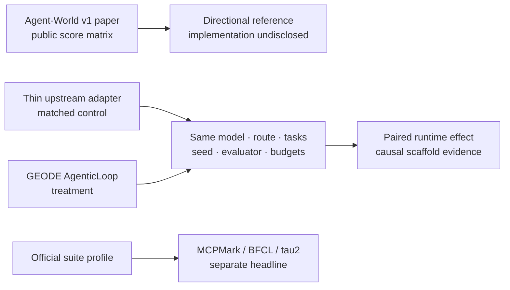

# Agent-World Comparison Contract

Status: canonical GEODE comparison specification, 2026-08-08.

This contract defines how GEODE may compare agentic tool-use results with
Agent-World v1. It does not claim to reproduce Agent-World's private evaluation
runtime or training system.

Scope is Dong et al.'s Agent-World (`arXiv:2604.18292`), not Qwen's distinct
[Qwen-AgentWorld-35B-A3B](https://huggingface.co/Qwen/Qwen-AgentWorld-35B-A3B)
world-model project and `AgentWorldBench` (`arXiv:2606.24597`).

Primary sources:

- [Agent-World arXiv 2604.18292v1](https://arxiv.org/abs/2604.18292v1),
  submitted 2026-04-20
- [Agent-World Table 1 and experimental settings](https://arxiv.org/html/2604.18292v1#S4.T1)
- [Agent-World project page](https://agent-tars-world.github.io/-/)

As checked on 2026-08-08, the paper labels itself work in progress, says all
baselines were evaluated in an in-house framework with results aligned to
official scores, and publishes no code link on its project page. The exact
harness revisions, prompts, frontier-model route, task selections, seeds,
budgets, tau2 user simulator, and environment reset implementation are not
public. Every Agent-World Table 1 comparison is therefore directional.

## 1. What The Benchmark Measures

Agent-World Table 1 supplies a useful three-suite capability surface:



The paper reference and paired runtime experiment answer different questions:

| Track | Question | Promotion authority |
|---|---|---|
| `agent-world-v1-paper-reference` | Is GEODE in the same broad capability band as published Agent-World rows? | None; directional only |
| `geode-paired-runtime-v1` | What changes when the GEODE runtime replaces a named thin upstream adapter? | Eligible when every non-runtime field matches |
| suite-native headline | What score does GEODE obtain under the suite's own frozen protocol? | Owned by that suite only |
| smoke/diagnostic | Does wiring, state reset, scoring, and artifact flow work? | None |

The Agent-World GPT-5.2 High row is not a demonstrated "no-loop" baseline.
The paper says it used an in-house evaluation framework but does not disclose
the wrapper. Existing GEODE copy that called it `vanilla · no loop` is retired.

## 2. Public Agent-World V1 Surface

Agent-World reports accuracy across these columns:

| Suite | Required columns | Paper reference rows |
|---|---|---|
| MCP-Mark | File, GitHub, Notion, Play, Post, official Avg. | GPT-5.2 High 53.1; Agent-World-8B 8.9; Agent-World-14B 13.3 |
| BFCL V4 | WebSearch, Memory, Multi-Turn, Non-Live, Live, Relevant, Irrelevant, official Avg. | GPT-5.2 High 62.9; Agent-World-8B 51.4; Agent-World-14B 55.8 |
| tau2-bench | Retail, Telecom, Airline, official Avg. | GPT-5.2 High 80.2; Agent-World-8B 61.8; Agent-World-14B 65.4 |

The experimental settings state `temperature=1.0`, `top_p=1.0`, eight
repetitions, and average accuracy. GEODE names this statistic
`mean_accuracy@8`. It is not `pass@8` or `pass^8`.

Do not reconstruct the suite aggregate by averaging displayed rounded
subcolumns. Use the official harness aggregate for a GEODE run and preserve the
paper's published aggregate as an opaque reference value.

## 3. Frozen GEODE Profile

Every run manifest uses schema `geode.agent-world-comparison-profile.v1` and
binds the following fields before any live execution:

Start from
[`agent-world-run-manifest.template.json`](agent-world-run-manifest.template.json)
and use one manifest per arm. The template is a preregistration scaffold, not a
published run until every placeholder is replaced and artifact references are
resolved.

One paired experiment has a shared `comparison_id` and two unique `run_id`
values. Build the shared ID from suite, profile, model, route, reasoning, and a
UTC timestamp; append arm role and runtime to obtain each run ID. This prevents
same-day arms or reasoning variants from overwriting the same artifact path.

| Boundary | Required fields |
|---|---|
| Reference | Agent-World arXiv version, table/figure, retrieval date |
| GEODE | commit, branch, dirty state |
| Harness | repository, commit/package, task suite, ordered task IDs plus their canonical hash, task-pack hash, image versions |
| Model | exact label, provider, API/subscription/local route, reasoning setting, decoding surface |
| Runtime | arm-specific adapter/prompt/policy identity; exact shared tool execution path, tool-schema artifact/hash, server versions, timeout, step/error/retry budgets, concurrency |
| Environment | initial-state identity, reset strategy and receipt, external-service account isolation |
| tau2 user | implementation, model, provider/route, reasoning, prompt hash, wall/token/round budgets |
| Sampling | actual repetition count, stable task/trial identities, seed schedule; eight repetitions for Agent-World alignment |
| Retry | retryable classes, stable seed rule, attempt lineage, final-attempt selection |
| Scoring | native score authority, suite aggregation, paired statistics, invalid-attempt handling |
| Evidence | raw results, trajectories, tool pairs, verifier receipts, state diffs, checksums, publication manifest |

### 3.1 Suite versions

Agent-World v1 does not disclose enough version information for exact
reproduction. GEODE must therefore use a dated named profile rather than claim
identity:

- MCPMark: pin the selected upstream revision and state the exact task-set
  generation, including `Verified` where applicable. Never place MCPMark
  Verified in the paper's version-unspecified column without a qualifier.
- BFCL V4: pin the official code/data checkpoint and native-function-calling
  versus prompt-based mode. Preserve the official weighted aggregate.
- tau2-bench: pin harness commit, domain split, native user implementation,
  user model, `max_steps`, `max_errors`, timeout, task order, and trial count.
  Keep native-user and GEODE-owned `geode_user` results in separate profiles.

### 3.2 Decoding and product routes

The Agent-World-aligned target is `temperature=1.0`, `top_p=1.0`. Keep that
target separate from the effective route values. When a subscription product
does not expose these parameters, record both effective values as `null`, set
their source to `unavailable`, and classify the paper comparison as
directional. Do not write the target values into the effective fields. A paired
runtime experiment remains useful only if both arms use the same
unavailable/default product surface.

## 4. Paired Runtime Control

The paired control must be an inspectable, named implementation such as
`thin-upstream`, not the Agent-World score row. Treatment and control share:

```text
model + provider route + reasoning/decoding surface
task objects/order/hash + initial states + seeds
tool execution path + schemas/servers + evaluator + user simulator
simulation timeout + max steps/errors/retries + concurrency
agent/user wall-clock + token + round budgets
```

Only the agent runtime/scaffold may differ:

```text
thin upstream adapter  ↔  GEODE AgenticLoop
```

Before execution, diff the two manifests after ignoring only `run_id`, the
whole `arm` object, and arm-specific evidence destinations. Adapter,
prompt/policy hashes, and runtime commit belong inside `arm` because they are
the intended treatment. `comparison_id`, ordered task list, tool-surface hash,
model/route/decoding surface, every budget, and every scoring field must be
byte-for-byte equal. The task-list hash is an integrity check, not a substitute
for the ordered IDs: retain the IDs inline and optionally mirror them in an
artifact when the list is large.

If the upstream suite itself requires a loop, preserve that minimal loop and
name its exact behavior. `No loop` is not a meaningful tool-agent control.

For each suite report:

- mean accuracy across eight complete repetitions and a 95% confidence
  interval using a preregistered estimator and sampling unit;
- per-domain/category accuracy and raw numerator/denominator;
- paired task-level wins, losses, and ties under matched trials;
- infrastructure-invalid attempts separately from semantic failures;
- time, tokens, tool calls, retries, and termination distribution.

Do not create one promotion score by averaging MCPMark, BFCL, and tau2. A
visual cross-suite profile is allowed, but each suite retains its own ruler and
promotion decision.

Sampling is claim-specific. An Agent-World-aligned measurement requires eight
seeds and `mean_accuracy@8`; a smoke records its actual smaller repetition
count and `diagnostic`; a directional paper comparison records the actual GEODE
run count and statistic rather than copying the paper's eight repetitions.
`paired_task_trials=true` is valid only when matched arms exist. The seed
schedule length must equal `repetitions`. A paper row without a GEODE execution
belongs in the reference catalog, not in a run manifest. For tau2, a user
simulator is always required and its identity plus wall/token/round budgets
cannot be `na`.

Freeze uncertainty before execution. At minimum record coverage, exact
estimator, sampling unit, and any paired method, resample count, and RNG seed.
Both arms use the identical uncertainty block; `95%` alone is not an
estimator.

## 5. Attempt And Artifact Contract

An attempt is infrastructure-invalid when quota exhaustion, authentication,
missing services, corrupted/reset state, harness faults, transport exhaustion,
or incomplete coverage prevents semantic scoring. Invalid work is neither a
zero nor a partial headline. Retry only preregistered infrastructure classes,
keep the task/trial seed stable, and preserve the full attempt lineage.

The evidence flow is:

```text
native harness result (score authority)
    + GEODE session/trajectory (behavior evidence)
    + verifier receipt/state diff (judgement evidence)
    -> immutable eval bundle + publication manifest
    -> geode-eval-artifacts commit
```

The immutable bundle must include profile and task-pack hashes, environment
reset receipts, every attempt, selected final attempts, raw native results,
exact tool call-result pairing, terminal reasons, verifier outputs, aggregate
derivation, redaction report, and checksums. Missing trajectory detail does not
change a native score but blocks behavioral or training-data claims.

## 6. Execution Gates

1. Validate sources and freeze a manifest without model calls.
2. Run a no-model state-reset and verifier test.
3. Run one task per environment as a wiring smoke.
4. Run one complete repetition and reject infrastructure contamination.
5. Run eight complete repetitions for an Agent-World-aligned result.
6. Publish raw public artifacts append-only, then pin their repository commit
   in the GEODE ledger and public page.

Live model/account/service calls still require explicit user approval. A smoke
or interrupted run may be published as a diagnostic but never promoted into
the paper-reference table.

## 7. Current GAPs

| GAP | Current state | Closure evidence |
|---|---|---|
| AW-COMP-01 Paper implementation identity | Agent-World harness code and exact suite configs are not public | Upstream release or author-provided manifest |
| AW-COMP-02 Paired thin control | GEODE has MCPMark and tau2 adapters, no BFCL adapter, and no frozen three-suite thin-control arm | Same manifest accepted by both arms; only runtime identity differs |
| AW-COMP-03 Eight-repetition cluster | Existing GEODE rows are mostly `k=1` or partial-service runs | Eight complete valid repetitions per suite |
| AW-COMP-04 BFCL execution | Evidence ledger exists; current cross-suite full-cycle artifact is absent | Pinned BFCL V4 run with native aggregate and immutable bundle |
| AW-COMP-05 MCP version parity | GEODE's strongest run is MCPMark Verified while Agent-World reports version-unspecified MCP-Mark | Explicit versioned lanes or an upstream mapping |
| AW-COMP-06 Tau2 causal isolation | Recent runs changed model, user simulator, error budget, and runtime together | Paired matrix isolating model, user simulator, and `max_errors` |

AW-COMP-01 is not locally solvable and does not block directional comparison.
AW-COMP-02 through AW-COMP-06 block causal or headline claims until closed.

## 8. Migration Map

| Retired label | Replacement |
|---|---|
| `Agent-World vanilla` | `Agent-World v1 paper reference` |
| `no loop` for the paper row | `in-house evaluation wrapper undisclosed` |
| `avg@8` | `mean_accuracy@8` |
| mixed version-unspecified MCP-Mark/Verified average | versioned suite lanes |
| tau2 `geode_user` compared as native | separate `geode-dual-runtime` diagnostic |
| incomplete quota run divided by scheduled tasks | infrastructure-invalid attempt, no headline |

Use `.claude/skills/agent-world-benchmark/` for future design, execution,
audit, and publication work under this contract.
