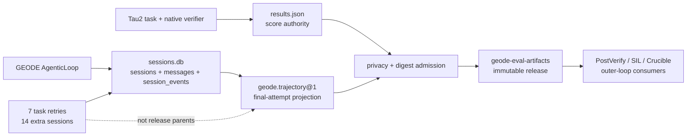
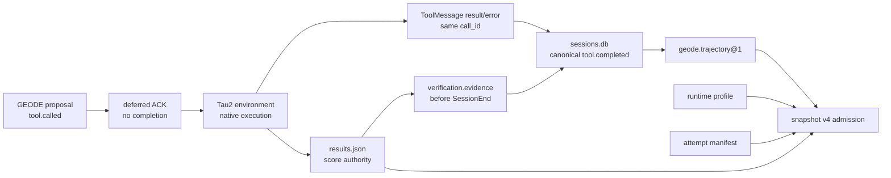

# τ²-bench (Sierra)

## 개요

Multi-turn tool-agent-user 시뮬레이션 벤치. 에이전트와 LLM 시뮬 유저가 공유 world state를 tool로 변경하며 대화. **pass^k의 발상지**.

- **Repo**: [sierra-research/tau2-bench](https://github.com/sierra-research/tau2-bench)
- **현재 측정 핀**: `668d3bcd135c02aa3438f987ef45735b7c163ee3`, `tau2==1.0.1` (2026-08-12 확인)
- **라이센스**: MIT (`LICENSE`)
- **현재 공개 surface**: airline / retail / telecom / telecom-workflow / banking-knowledge와 text / voice runner. 과거 `1901a30`, `tau2==1.0.0` 기록은 해당 실행의 역사적 핀으로만 유지한다.
- **Frontier 인용**: GPT-5.5 system card (**telecom 98.0%**), Anthropic 인용

## 2026-08-12 OpenAI/Codex 기준 정렬

공개 Codex 저장소 `dad1db87bb5ad4b92af6b0f58502d12453681f81`에는
Tau2 runner, task manifest, prompt 또는 실행 설정이 없다. OpenAI가 공개한
것은 GPT-5.4의 **research-environment model evaluation**이다. 따라서 아래
수치는 Codex CLI 재현 설정이 아니라 `paper-reference` 비교군이다.

| 공개 행 | 도메인 | effort | 점수 | 공개되지 않은 항목 |
|---|---|---|---:|---|
| OpenAI GPT-5.4 headline | Telecom | `xhigh` | 98.9% | harness/task revision, prompt, user simulator, trials, seed, limits, retry, timeout, concurrency |
| OpenAI GPT-5.4 no-reasoning | Telecom | `none` | 64.3% | 위와 동일 |

[OpenAI 발표](https://openai.com/index/introducing-gpt-5-4/)는 기본 평가를
`xhigh`로 실행했다고 밝히고, 별도 no-reasoning 표에 `none` 결과를 싣는다.
또한 production ChatGPT와 출력이 다를 수 있는 연구 환경임을 명시한다.

재현 가능한 최신 GPT-5.4 공식 제출은 Sierra의 **다른 레인**이다.
`tau2==1.0.1`, banking-knowledge 97개 전체, GPT-5.4 `xhigh`, native
`user_simulator=gpt-5.2` / effort `low`, 4 trials, seed 300, AllTools,
standard scaffold이며 pass^1은 39.43%다. Telecom/Codex 결과가 아니므로
OpenAI 98.9%와 합치거나 대체하지 않는다. 원본은
[Sierra submission](https://github.com/sierra-research/tau2-bench/blob/main/web/leaderboard/public/submissions/gpt-5-4_sierra_2026-03-25/submission.json)과
[submission guide](https://github.com/sierra-research/tau2-bench/blob/main/docs/leaderboard-submission.md)에 있다.

GEODE 측정 계약과 실행 게이트는
[`2026-08-12-gpt54-tau2-openai-reference-alignment.md`](../plans/2026-08-12-gpt54-tau2-openai-reference-alignment.md)에 고정한다.
핵심 판정은 다음과 같다.

- OpenAI 행과 GEODE 결과의 비교는 `paper-reference`, directional only다.
- PAYG 없는 subscription 측정은 evaluator-owned `crucible_user`를 쓰며,
  Sierra의 native GPT-5.2 user와는 별도 profile이다.
- `none`과 `xhigh` GEODE arm은 user, task order, limits, seed를 동일하게
  고정해 effort 효과만 측정한다.
- 2026-08-03의 200/278 결과는 이전 harness와 `geode_user`를 쓴
  longitudinal diagnostic이므로 새 결과와 직접 증감 비교하지 않는다.

## 사례

### Case 1 — Sierra가 발견한 user-simulator drift (NeurIPS '24 → v² 2025)

원래 τ-bench는 GPT-4o를 user simulator로 사용. SOTA GPT-4o 자체가 retail에서 ~61%, airline에서 ~35%. Sierra autopsy 결과 **점수 분산의 절반이 simulator 모델 선택에서 옴**. v²의 telecom dual-control 도메인은 agent와 user가 같은 world state를 함께 변경하게 만들어 이 문제를 차단.

출처: [τ-bench paper](https://arxiv.org/pdf/2406.12045), [τ²-bench paper](https://arxiv.org/pdf/2506.07982)

### Case 2 — Telecom 리더보드 역전 — Z.ai GLM-4.7-Flash 1위

[Artificial Analysis tau²-bench](https://artificialanalysis.ai/evaluations/tau2-bench) (2026-05 기준):
- **Z.ai GLM-4.7-Flash (Reasoning) 98.8%**
- GLM 5V Turbo / GLM-5-Turbo 98.5%
- GPT-5.x, Opus 4.x는 telecom에서 더 낮음

Sierra 분석: telecom은 **patient diagnostic dialog**를 보상 — Chinese reasoning model이 tool call 전 long step-by-step plan을 emit하기 때문에 이김. **공격적 tool-caller는 telecom에서 손해**라는 교훈.

### Case 3 — HAL Generalist + Claude 3.7 Sonnet — airline 1위 56% / $42

[HAL tau-bench airline](https://hal.cs.princeton.edu/taubench_airline) Pareto:
- **HAL Generalist + Sonnet 3.7**: 56% / $42.11
- **o4-mini High**: 56% / $11.36
- TAU-bench Tool Calling baseline + Opus 4.1: 50% / $69.78

교훈: **얇은 generalist scaffold가 hand-tuned tool-calling loop을 이김**. "Opus에 더 쓰기"는 reliability 안 사줌. airline은 50-56%가 천장 — 50대 후반에 정체.

## 필요 Eval 인프라

| 항목 | 값 |
|---|---|
| Install | `git clone … && uv sync` (텍스트 only) / `uv sync --all-extras` (voice+banking) |
| macOS extras | `brew install portaudio ffmpeg` (voice 옵션) |
| Python | `>=3.12,<3.14` |
| Sandbox | **순수 Python in-process** — Docker 불필요 |
| Scoring | Pydantic world state diff (oracle) — LLM judge 미사용 |
| Trace | `results/<run_id>/` JSONL (메시지+tool call+task reward) |
| External | GEODE subscription route for `geode_agent` + `geode_user`; native tau2 `user_simulator` still needs LiteLLM credentials |
| Cost — smoke | 5-task airline @ Sonnet 4.5 ≈ **<$3** |
| Cost — full | 4-domain × 4 trial @ Sonnet 4.5 ≈ **$200-400** |
| CI 적합도 | 5-task smoke GHA 가능 (~10-15분), full은 VM |

### Agent Contract

[`src/tau2/agent/README.md`](https://github.com/sierra-research/tau2-bench/blob/main/src/tau2/agent/README.md):

```python
class HalfDuplexAgent:
    def __init__(self, tools, domain_policy): ...
    def get_init_state(self, message_history) -> StateType: ...
    def generate_next_message(
        self, message, state
    ) -> tuple[AssistantMessage, StateType]: ...

def create_agent(tools, domain_policy, **kwargs) -> HalfDuplexAgent: ...
```

`LLMAgent`는 reference impl이지 강제 base 아님. `tools`는 domain tool registry, `domain_policy`는 system prompt prefix.

## GEODE 진행 시나리오

### Phase 0 — Smoke (≤30분, cost <$1)

```bash
python scripts/eval/tau2_geode_agent.py --domain mock --num-tasks 1 --num-trials 1
```

`mock` 도메인은 LLM cost 거의 없이 `core/agent/loop.py::AgenticLoop` 와이어업만 검증.

**Pass criteria**: results/ 폴더에 JSONL 생성, agent contract 호출 trace 확인.

### Phase 1 — GEODE runner adapter

Repository script:
- `scripts/eval/tau2_geode_agent.py`

매핑:
- `generate_next_message(message, state)` → 한 번의 `AgenticLoop.arun()`
- tau2 `tools` constructor 인자 → GEODE `ToolRegistry` + `ToolExecutor`
  handler로 wrap
- tau2 `user_simulator` 대신 기본 `geode_user` 등록 → user side도
  `source=subscription`으로 실행
- `domain_policy` → `AgenticLoop(system_prompt_override=...)`
- `state` → per-task `ConversationContext`와 `AgenticLoop` 보존

GEODE smoke command:

```bash
python scripts/eval/tau2_geode_agent.py \
  --harness-dir artifacts/eval/harnesses/tau2-bench \
  --domain mock \
  --num-tasks 1 \
  --num-trials 1 \
  --model gpt-5.5 \
  --provider openai \
  --source subscription \
  --effort xhigh \
  --user geode_user \
  --user-llm gpt-5.5 \
  --user-source subscription \
  --save-to geode-gpt-5-5-xhigh-mock-smoke-20260703
```

### Phase 2 — First Real Run

- **대상**: telecom small/base slice × 1 trial × **GPT-5.5 xhigh**
- **선정 사유**: dual-control 도메인이 Slack/MCP execution path에 가장 가까움
- **예상 baseline**: **35-45% pass^1** (비특화 scaffold 평균치 기준)
- **예상 cost**: $25-40
- **출력 보관**: `artifacts/eval/tau2/<date>/`
- **비교 분리**: subscription-only 기본 run은 `user=geode_user`로 기록한다.
  legacy GPT-5.5 공개 수치와 맞추는 native `user_simulator` +
  `user-llm=gpt-4.1` run, 현재 tau2 leaderboard 권장 native
  `user_simulator` + `user-llm=gpt-5.2` run과 평균내지 않는다.
- **Auth caveat**: `geode_user` 경로는 GEODE subscription route를 사용한다.
  native tau2 `user_simulator`를 선택한 경우에만 LiteLLM provider
  credential이 별도로 필요하다.

### Phase 3 — CI / 운영 Ratchet

| 트리거 | 실행 | 임계 | 비용 |
|---|---|---|---|
| Per-PR | airline 5-task smoke | pass^1 −3pp → 차단 | <$3 |
| Weekly (develop) | 4-domain × 1 trial | telecom −3pp → Slack 알림 | ~$50 |
| Monthly (main) | telecom × 4 trial pass^k | pass^4 −5pp → release block | ~$80 |

선정 사유: telecom = GEODE Slack-ops day job에 가장 근접.

## 2026-07-03 GEODE subscription-only mock smoke

| Field | Value |
|---|---|
| Run ID | `geode-gpt-5-5-xhigh-geode-user-mock-smoke-20260703-r5` |
| GEODE revision | `6db5b7ade3410eff6ea7718d2f65347fce164eff` plus local runner/doc changes |
| Harness | `sierra-research/tau2-bench` `1901a30`, package `tau2==1.0.0` |
| Domain / task | `mock`, `create_task_1`, `num_trials=1`, `num_tasks=1` |
| Agent route | `geode_agent`, `gpt-5.5`, provider `openai`, source `subscription`, effort `xhigh` |
| User route | `geode_user`, `gpt-5.5`, provider `openai`, source `subscription`, effort `high` |
| Result | **1 / 1**, reward `1.0`, pass^1 `1.000` |
| DB check | `1.0` |
| Action check | `create_task` write action `1.0` |
| Termination | `user_stop` |
| Duration | `54.90s` |
| Artifact | `artifacts/eval/harnesses/tau2-bench/data/simulations/geode-gpt-5-5-xhigh-geode-user-mock-smoke-20260703-r5/results.json` |

Command:

```bash
uv run python scripts/eval/tau2_geode_agent.py \
  --harness-dir artifacts/eval/harnesses/tau2-bench \
  --domain mock \
  --num-tasks 1 \
  --num-trials 1 \
  --max-concurrency 1 \
  --max-steps 8 \
  --timeout 900 \
  --model gpt-5.5 \
  --provider openai \
  --source subscription \
  --effort xhigh \
  --time-budget-s 180 \
  --user geode_user \
  --user-llm gpt-5.5 \
  --user-provider openai \
  --user-source subscription \
  --user-effort high \
  --user-time-budget-s 120 \
  --save-to geode-gpt-5-5-xhigh-geode-user-mock-smoke-20260703-r5 \
  --log-level INFO \
  --verbose-logs
```

Adapter calibration notes:

- r1 exposed GEODE default tools (`grep_files`) to the tau2 agent surface.
- r2 restricted visible tools to tau2 domain tools.
- r3 projected GEODE internal tool logs back to tau2 `ToolCall` messages.
- r4 made mutating tools dry-run inside GEODE so tau2 orchestrator applies the
  official state mutation exactly once.
- r5 strips absent (`None`) arguments before projection. Explicit empty values
  remain because some tau2 tools require them; the agent policy therefore
  forbids inventing optional descriptions or metadata.

Comparability:

- This is a GEODE-owned subscription-only smoke, not a tau2 leaderboard score.
- It should not be averaged with native tau2 `user_simulator` runs using
  `gpt-4.1` or `gpt-5.2`.
- It proves the full tau2 cycle wiring: GEODE agent route, GEODE user route,
  tau2 tool projection, tau2 DB diff, artifact preservation, and docs
  publication.

## 2026-07-03 GEODE subscription-only domain smoke matrix

These rows are adapter calibration records, not tau2 leaderboard scores. The
default rows run both agent and simulated user through GEODE's `gpt-5.5`
subscription route. The published telecom GPT-5.2 row is a separate PAYG
user-route retry, not averaged with the subscription-only smoke rows.

| Domain | Task ID / case | Reward | Termination | Duration | Reading |
|---|---|---:|---|---:|---|
| `mock` | `create_task_1` | 1.0 | `user_stop` | 65.69s | DB diff and assistant write action passed |
| `airline` | `task_id=0` | 1.0 | `user_stop` | 134.86s | DB/communicate reward passed |
| `retail` | `task_id=0` | 1.0 | `user_stop` | 283.61s | 5 expected action checks passed |
| `telecom` | `mobile_data_issue`, `gpt-5.2/payg user` | 1.0 | `user_stop` | 219.12s | `max_steps=200` passed; `toggle_airplane_mode` and `toggle_roaming` write actions matched |
| `banking_knowledge` | `task_001` | 0.0 | `user_stop` | 360.77s | `--retrieval-config bm25` avoided the shell sandbox dependency, but user-side write action did not fire |

Artifacts:

```text
artifacts/eval/harnesses/tau2-bench/data/simulations/geode-gpt-5-5-xhigh-geode-user-*/results.json
artifacts/eval/harnesses/tau2-bench/data/simulations/geode-gpt-5-5-xhigh-geode-user-gpt-5-2-payg-telecom-mobile-data-20260703-max200/results.json
```

Adapter notes:

- `banking_knowledge` default `alltools` retrieval requires the upstream
  agentic shell sandbox. GEODE runner now exposes `--retrieval-config` and
  `--retrieval-config-kwargs` so `bm25` and other tau2 retrieval configs can be
  selected explicitly.
- `telecom` did not recover when the step budget was raised to 30. Repetitive
  tool policy and empty-output recovery for subscription-backed routes need
  work before it is useful as a quality ratchet.
- The same telecom `mobile_data_issue` task passed with `gpt-5.2` on the PAYG
  user route and `max_steps=200`, including both expected user write actions.
  The failed `gpt-5.2` subscription attempt is excluded because the Codex
  subscription backend rejected that model for this account.
- GEODE now registers `gpt-5.2` in the OpenAI model spec, pricing catalogue,
  and context-window catalogue so PAYG benchmark runs use the GPT-5-family
  request shape instead of the legacy fallback.

GPT-5.2 PAYG telecom retry command:

```bash
uv run python scripts/eval/tau2_geode_agent.py \
  --harness-dir artifacts/eval/harnesses/tau2-bench \
  --domain telecom \
  --task-ids '[mobile_data_issue]airplane_mode_on|user_abroad_roaming_enabled_off[PERSONA:None]' \
  --num-trials 1 \
  --max-concurrency 1 \
  --max-steps 200 \
  --timeout 3600 \
  --model gpt-5.5 \
  --provider openai \
  --source subscription \
  --effort xhigh \
  --time-budget-s 600 \
  --user geode_user \
  --user-llm gpt-5.2 \
  --user-provider openai \
  --user-source payg \
  --user-effort high \
  --user-time-budget-s 300 \
  --save-to geode-gpt-5-5-xhigh-geode-user-gpt-5-2-payg-telecom-mobile-data-20260703-max200 \
  --log-level INFO
```

## 2026-07-31 GPT-5.6 subscription diagnostics

These are scored behavior diagnostics on GEODE
`edb74602bb2e1e4d627cb6aa1f0b94072a57da62`, not native-user leaderboard
rows. Both the agent and simulated user used `gpt-5.6-sol`, OpenAI
subscription, effort `high`. Harness:
`sierra-research/tau2-bench@1901a301961cbbe3fd11f3e84a2a376530c759e3`
(`tau2==1.0.0`).

| Scope | Reward / pass^1 | Duration | Termination | Failure |
|---|---:|---:|---|---|
| `mock/create_task_1` | 0.0 / 0.000 | 14.58s | `user_stop` | `create_task` executed with inferred optional `description=""`; exact action and DB checks failed |
| Telecom `small`, first task | 0.0 / 0.000 | 51.91s | `user_stop` | customer/line diagnostics passed, then the agent transferred to a human instead of guiding the user-side roaming/device workflow |

Neither run contained a provider, quota, or adapter exception. The mock
trajectory proves that the dynamic `create_task` schema reached execution; its
failure is the model's extra argument. The Telecom trajectory contains five
correct assistant-side reads before the premature transfer, but no required
user-side `toggle_roaming` action or environment assertion.

The measured Telecom command must use the official split name rather than the
`telecom_small` task-set alias:

```bash
python scripts/eval/tau2_geode_agent.py \
  --harness-dir artifacts/eval/harnesses/tau2-bench \
  --domain telecom \
  --task-split-name small \
  --task-ids '[mobile_data_issue]user_abroad_roaming_enabled_off[PERSONA:None]' \
  --num-tasks 1 \
  --num-trials 1 \
  --max-concurrency 1 \
  --max-steps 50 \
  --timeout 1800 \
  --model gpt-5.6-sol \
  --provider openai \
  --source subscription \
  --effort high \
  --user geode_user \
  --user-llm gpt-5.6-sol \
  --user-source subscription \
  --user-effort high \
  --save-to geode-gpt56-sol-high-edb74602b-geode-user-telecom-small-01-20260731
```

Artifacts are immutable at
[`geode-eval-artifacts@9c00ecf`](https://github.com/mangowhoiscloud/geode-eval-artifacts/commit/9c00ecf4a3b5a68ee65db9afe185b2271da46b49):

- raw public copies:
  [`tau2/simulations`](https://github.com/mangowhoiscloud/geode-eval-artifacts/tree/9c00ecf4a3b5a68ee65db9afe185b2271da46b49/tau2/simulations);
- normalized paired dialogue/tool trajectories:
  [`4ec1c13434d1`](https://github.com/mangowhoiscloud/geode-eval-artifacts/tree/9c00ecf4a3b5a68ee65db9afe185b2271da46b49/trajectories/tau2-geode-gpt56-edb74602b-mock-telecom-small-20260731T034305Z-4ec1c13434d1).

The failed `--task-set-name telecom_small` preflight exposed a compatibility
GAP: that upstream loader does not accept the generic `task_split_name`
keyword used by GEODE's ordered-task preflight. It produced no scored run and
is not included in the two results above.

## 2026-07-31 v1.0.11 release regression

These runs use the public `geode-agent==1.0.11` wheel at GEODE revision
`686ff37257fc7dd655025049dccee7a10d6ef340`, not an editable checkout. A
preflight rejected the harness environment's stale editable `1.0.9` install
before measurement. Both the agent and simulated user used `gpt-5.6-sol`,
OpenAI subscription, effort `high`, and tau2-bench
`1901a301961cbbe3fd11f3e84a2a376530c759e3` (`tau2==1.0.0`).

| Scope | Reward / pass^1 | Duration | Termination | Reading |
|---|---:|---:|---|---|
| `mock/create_task_1` | 0.0 / 0.000 | 9.03s | `user_stop` | Genuine repeat failure: `description=""` was not requested, so the native exact action and DB comparators rejected the write |
| Telecom `small`, first task | 1.0 / 1.000 | 78.52s | `user_stop` | DB, `toggle_roaming`, mobile-data state, and excellent-speed assertions all passed |

The stable trajectory join was checked against an isolated `sessions.db` for
each run:

| Scope | Events | Exact tool pairs | Missing IDs / orphan pairs |
|---|---:|---:|---:|
| mock | 25 | 1 | 0 / 0 |
| Telecom | 117 | 8 | 0 / 0 |

Tau2 `results.json` remains the scoring authority. The associated
`crucible_tau2_trajectory_snapshot.v3` records are diagnostic with
`promotion_authority=none` and `candidate_surface=unfrozen_git`; the
`geode.trajectory@1` files are replay/correlation sidecars, not a way to
promote an unfrozen arm.

The authoritative raw native receipt SHA-256 values are:

- mock:
  `eb0e8eea5516b2cbb6b95385846bb8b6cbcdae42a4fb48e1fa447939d2d0e369`;
- Telecom:
  `eda3cdbdb9cd0c2f993db3f9fe2e813cdbc06fe9cf112e23ba60c7ea9d98a45b`.

The public Telecom copy removes synthetic phone/email fields and therefore has
the distinct digest
`506f906cfa1d6e8e4320ba284be1aa0f7ec26ea2fc47b43e7b36f69e3643a9d4`.
That transformation is explicit; it is not presented as the raw Crucible
receipt.

Artifacts are immutable at
[`geode-eval-artifacts@16a54f0`](https://github.com/mangowhoiscloud/geode-eval-artifacts/commit/16a54f08450db771c02e30c73bdc3867f6282f83):

- [native receipt copies](https://github.com/mangowhoiscloud/geode-eval-artifacts/tree/16a54f08450db771c02e30c73bdc3867f6282f83/tau2/simulations);
- [stable trajectory release](https://github.com/mangowhoiscloud/geode-eval-artifacts/tree/16a54f08450db771c02e30c73bdc3867f6282f83/trajectories/tau2-geode-gpt56-v1.0.11-686ff372-mock-telecom-small-20260731T105713Z-a71155f7006c);
- [validation report](https://github.com/mangowhoiscloud/geode-eval-artifacts/blob/16a54f08450db771c02e30c73bdc3867f6282f83/reports/e2e-validation/2026-07-31-gpt56-v1011-benchmark.md).

Manifest SHA-256
`a71155f7006c8dd412af8d1471e7d2380e5f072cc8f0495924fa86f26d69a9a2`
was independently revalidated after downloading the exact merge commit from
GitHub.

## 2026-08-02 GPT-5.4 subscription cycle

This cycle exercises the newly exposed GPT-5.4 subscription route at GEODE
revision `afaab52ba2fc0ee8b0ffcdf251371e65be6f0933`. Both the agent and
`geode_user` used `gpt-5.4`, OpenAI subscription, effort `high`. The harness is
`sierra-research/tau2-bench@1901a301961cbbe3fd11f3e84a2a376530c759e3`
(`tau2==1.0.0`).

| Scope | Reward / pass^1 | Duration | Termination | Reading |
|---|---:|---:|---|---|
| `mock/create_task_1` | 0.0 / 0.000 | 25.33s | `user_stop` | `create_task` included unrequested `description=""`; exact action and DB checks rejected the extra argument |
| Telecom `small`, first task | 1.0 / 1.000 | 119.83s | `user_stop` | DB, `toggle_roaming`, mobile-data state, and excellent-speed checks all passed |

Neither run contained a route, provider, adapter, quota, agent, or
simulated-user exception. The SQLite-backed trajectory join also closed
without missing correlation IDs or orphaned calls:

| Scope | Events | Exact tool pairs | Missing IDs / orphan pairs |
|---|---:|---:|---:|
| mock | 31 | 2 | 0 / 0 |
| Telecom | 127 | 8 | 0 / 0 |

Tau2 `results.json` remains the score authority. These two rows are a fixed
GEODE-user route regression, not a native `user_simulator` aggregate and not a
frontier leaderboard claim. The Crucible snapshots retain
`candidate_surface=unfrozen_git` and `promotion_authority=none`. Their source
stage is the runner's historical default `train`; that label is preserved in
the immutable receipt and grants no training or promotion authority. Future
benchmark commands should pass `--trajectory-stage benchmark` explicitly.

The authoritative local native receipt SHA-256 values are:

- mock: `f576aa91e5631f2fd85e33a8a4867becda91af45f12befa81eefe86f03742615`;
- Telecom: `75264b7c86d44f958061ee7f1939153ed9d135e4355eca9b54c0380cb152309a`.

The public Telecom copy redacts synthetic phone and email fields, so its
digest is
`d2d8e1ca9296e7f044a2be5062f1c14c8427107bf5a66c74929a2d878538297f`.
Artifacts are immutable at
[`geode-eval-artifacts@f588ce9`](https://github.com/mangowhoiscloud/geode-eval-artifacts/commit/f588ce9fd23b9123732b45c4dbe202136691d3fe):

- [native receipt copies](https://github.com/mangowhoiscloud/geode-eval-artifacts/tree/f588ce9fd23b9123732b45c4dbe202136691d3fe/tau2/simulations);
- [stable trajectory release](https://github.com/mangowhoiscloud/geode-eval-artifacts/tree/f588ce9fd23b9123732b45c4dbe202136691d3fe/trajectories/tau2-geode-gpt54-afaab52b-mock-telecom-small-20260801T173245Z-2dc79cb569f0);
- [validation report](https://github.com/mangowhoiscloud/geode-eval-artifacts/blob/f588ce9fd23b9123732b45c4dbe202136691d3fe/reports/e2e-validation/2026-08-02-gpt54-tau2-benchmark.md).

Manifest SHA-256
`2dc79cb569f03e5f44ce008b32fd8af86f8388ab04341ee8f91c74fdffb6aa6b`
and both public native copies were independently revalidated through GitHub
read-back at the exact merge commit.

## 2026-08-03 GPT-5.4 subscription base full cycle

The full cycle runs all 278 base tasks at GEODE revision
`22789ee28e87ba03580beec3db6e919f5cef5178`. Both participants use
`gpt-5.4`, provider `openai`, source `subscription`, effort `high`.
The harness remains
`sierra-research/tau2-bench@1901a301961cbbe3fd11f3e84a2a376530c759e3`
(`tau2==1.0.0`).

| Domain | Tasks | Passes | Reward | Termination |
|---|---:|---:|---:|---|
| Airline | 50 | 42 | **0.8400** | user stop 50 |
| Retail | 114 | 79 | **0.6930** | user stop 96, too-many-errors 18 |
| Telecom | 114 | 79 | **0.6930** | user stop 98, max-steps 14, too-many-errors 2 |
| **Weighted** | **278** | **200** | **0.7194** | — |

This is the complete GEODE-user diagnostic surface, not the native Tau2
`user_simulator` track. It does not replace the native-user headline matrix
and has `promotion_authority=none`.

The measured contract is one trial, concurrency 2, `max_steps=200`,
`max_errors=1`, per-simulation timeout 3600s, agent/user wall budgets
600s/180s, seed 300, and `trajectory_stage=benchmark`. Airline used no task
retry; Retail and Telecom allowed one transport-only retry. No behavior-score
failure was retried.

### Behavior and verifier reading

| Domain | Read | Write | Generic | Environment | DB |
|---|---:|---:|---:|---:|---:|
| Airline | 85/91 | 33/49 | 1/2 | — | 43/50 |
| Retail | 265/307 | 114/141 | 4/14 | — | 80/96 |
| Telecom | — | 308/377 | 20/20 | 155/181 | 22/98 |

Telecom separates into service 28/29, mobile-data 30/36, and MMS 21/49.
The hard persona scores 21/36, versus Easy 29/38 and no-persona 29/40.
Latency also has a material long tail: mean 351.65s, p50 261.84s, p95
957.65s, max 995.78s. Fourteen runs reach `MAX_STEPS`.

Seven Telecom trajectories contain a GEODE no-progress supervisor stop; six
fail and one passes. Some failed runs emit `USER_STOP` after only 2/11 or
6/10 required actions. Conversely, complex 8–9 action runs can pass when the
full action set closes. This is measured evidence for keeping `Stop` as a
protocol/lifecycle hook while exposing `PostVerify` to an outer loop:
`PostVerify` can turn missing action, environment, or DB evidence into
`revise` or `escalate` instead of equating a normal stop with success.

### SQLite, trajectory, and retry scope

| Domain | Parent sessions | SQLite events | Normalized events | Messages | Exact tool pairs |
|---|---:|---:|---:|---:|---:|
| Airline | 100 | 4,924 | 4,924 | 1,474 | 369 |
| Retail | 228 | 10,718 | 10,718 | 3,299 | 827 |
| Telecom | 228 | 36,343 | 36,343 | 4,375 | 2,768 |
| **Total** | **556** | **51,985** | **51,985** | **9,148** | **3,964** |

Every event ID is unique, ordinals are contiguous, and no tool call/result is
orphaned. The released trajectories are `scope_complete=true` for the 278
final task attempts and `replay_complete=false`: 41,520 event bodies are
bounded, redacted, or represented by source hashes.

Telecom observed seven task-level provider transport retries and one
adapter-internal streamed-read retry. The task retries created exactly 14 extra
SQLite sessions (agent + user per attempt). The final trajectory parents select
the 228 final Telecom sessions and do not include the discarded transport
attempts. SQLite therefore remains the complete local execution authority,
while the public trajectory is the final-attempt portable view. Future work
should promote retry-attempt lineage into a structured run record instead of
reconstructing it from the time-bounded SQLite scope.

The Tau2 participant builder intentionally creates an isolated
`AgenticLoop` without a `HookSystem`; these sessions therefore contain zero
`hook_events` and no project-local JSONL. This cycle validates runtime
lifecycle and model behavior trajectories, not public-hook dispatch. The
separate 13-hook / four-middleware behavior E2E remains the hook authority.



Artifacts are immutable at
[`geode-eval-artifacts@86dcbba`](https://github.com/mangowhoiscloud/geode-eval-artifacts/commit/86dcbba3d15f1979b71a501780bf66fea4b450b5):

- [native receipt copies](https://github.com/mangowhoiscloud/geode-eval-artifacts/tree/86dcbba3d15f1979b71a501780bf66fea4b450b5/tau2/simulations);
- [stable trajectory release](https://github.com/mangowhoiscloud/geode-eval-artifacts/tree/86dcbba3d15f1979b71a501780bf66fea4b450b5/trajectories/tau2-geode-gpt54-22789ee2-geode-user-airline-retail-telecom-base-full-20260803T091257Z-13162f7bcff9);
- [human report](https://github.com/mangowhoiscloud/geode-eval-artifacts/blob/86dcbba3d15f1979b71a501780bf66fea4b450b5/reports/e2e-validation/2026-08-03-gpt54-tau2-full-cycle.md);
- [machine report](https://github.com/mangowhoiscloud/geode-eval-artifacts/blob/86dcbba3d15f1979b71a501780bf66fea4b450b5/reports/e2e-validation/2026-08-03-gpt54-tau2-full-cycle.json).

Manifest SHA-256
`13162f7bcff9ade1194f41af06549f0b0f239847f59630d5223386e2ca6362b3`
was independently revalidated before merge; GitHub API read-back confirmed the
manifest, reports, and all three public native receipt paths at the exact merge
commit.

## 2026-08-03 v1.0.12 GPT-5.4 post-release smoke

After the public `v1.0.12` distribution was independently verified, the fixed
mock and Telecom-small diagnostic tasks ran against release commit
`f99cea63dd39eb3f49fb00ac36e2e2804518c100` with GPT-5.4 subscription /
effort `high` for both `geode_agent` and `geode_user`.

| Scope | Result | Duration | Termination | Measured behavior |
|---|---:|---:|---|---|
| `mock/create_task_1` | **0/1** | 13.75s | `USER_STOP` | Communication 1.0; DB and required action 0.0 |
| Telecom-small roaming task | **0/1** | 236.73s | `MAX_STEPS` | 50 steps and 14 paired tool calls; native component scoring skipped after premature termination |

The Telecom trace repeats customer, line, network, usage, restriction, and VPN
diagnostics. This is model behavior, not a missing event or transport defect:
all 16 calls across both runs have exactly one result. No authentication,
quota, provider-adapter, or harness exception occurred, and neither failure was
retried.

This pair is a post-release route smoke, not a second full cycle. It neither
invalidates nor replaces the 278-task **200/278** diagnostic above. It instead
shows why an external loop needs `PostVerify`: a normal protocol stop and a
scope-complete trajectory can still fail an executable task verifier.

Artifacts are immutable at
[`geode-eval-artifacts@04ff1c4`](https://github.com/mangowhoiscloud/geode-eval-artifacts/commit/04ff1c4a1fee0cd1a3d837ad3a5f5239f1fd9acd):

- [native result copies](https://github.com/mangowhoiscloud/geode-eval-artifacts/tree/04ff1c4a1fee0cd1a3d837ad3a5f5239f1fd9acd/tau2/simulations);
- [stable two-task trajectory release](https://github.com/mangowhoiscloud/geode-eval-artifacts/tree/04ff1c4a1fee0cd1a3d837ad3a5f5239f1fd9acd/trajectories/tau2-geode-gpt54-v1.0.12-f99cea63-geode-user-mock-telecom-small-20260803T104819Z-fd524ce7a3cb);
- [post-release report](https://github.com/mangowhoiscloud/geode-eval-artifacts/blob/04ff1c4a1fee0cd1a3d837ad3a5f5239f1fd9acd/reports/e2e-validation/2026-08-03-gpt54-v1012-post-release-benchmark.md).

The release contains 234 canonical events, 16 exact tool pairs, zero orphans,
and two scope-complete/replay-incomplete trajectories. Manifest SHA-256
`fd524ce7a3cb1f1088f0e7a1531130d6302fb9f43d57a734303071bf6fd72288`
was recomputed from the remote bytes after the artifact PR merged.

## 2026-08-04 runtime-faithful adapter contract

The current adapter replaces the two limitations measured in the 2026-08-03
artifacts: an isolated loop with no hook composition, and retry lineage inferred
after the run. Those older artifacts remain immutable and their claims stay
revision-scoped; they are not retroactively upgraded.

One process-owned benchmark-safe runtime now supplies the same
`RuntimeEventBus`, `HookRegistry`, and `MiddlewareRegistry` instances to every
Tau2 `ToolExecutor` and `AgenticLoop`. All four trusted join points are wired.
All 13 public hooks are registered, but conditional hooks are not manufactured:
an unvisited hook is `not_exercised`, not `passed`. Plugin/MCP discovery,
scheduler, gateway, and auto-learning remain explicitly disabled so benchmark
trials cannot acquire production cross-session state.

Tool projection now preserves the official environment boundary. A GEODE
wrapper returns `external_execution=deferred`; this ACK creates `tool.called`
but not `tool.completed`. The pinned Tau2 orchestrator executes the call, and
its `ToolMessage.id` closes the original call with the native result/error.
Unknown result IDs and sessions with pending calls fail closed. When Tau2
terminates directly after an environment step, the binder joins the final
native ToolMessage from the receipt before testing for pending calls.
An external half-duplex proposal also returns to Tau2 immediately after the
tool round, before GEODE's post-tool convergence guards can mistake the deferred
ACK for completed local work.

After Tau2 finalizes `results.json`, GEODE hashes the receipt and records typed
`verification.evidence` on every selected participant session before
`SessionEnd`. The evidence keeps reward/components, native and runtime
termination, semantic/infrastructure validity, participant role, task/trial,
attempt ID, and `promotion_authority=none`. A normal `USER_STOP` with reward 0
therefore remains runtime-complete and task-failed at the same time.

Every new snapshot uses `crucible_tau2_trajectory_snapshot.v4` and digest-binds
two sibling companions:

| Companion | Contents |
|---|---|
| `<run>.runtime-profile.json` | revision; route/profile; assembled prompt hash/block inventory; tool schema digest/allowlist; exercised hook/middleware/event surfaces; SQLite/native receipt references |
| `<run>.attempt-manifest.json` | every task/trial attempt; retry predecessor/reason; participant session IDs; native simulation ID; selected final result |

The verifier rejects companion path traversal, byte/schema/run-ID drift,
runtime-revision or native-receipt mismatch, broken retry ancestry, and final
selection coverage that differs from native simulations. It independently
hashes and validates the sibling normalized trajectory, checks its receipt and
companion bindings, and recomputes `scope_complete=true`; a declared but orphaned
tool call therefore cannot enter promotion. `tau2-native-user` and
`geode-dual-runtime` are separate serialized profiles and cannot be combined
into one headline or used as each other's baseline.

The legacy `crucible.cached-row.v1` cache stores native simulation rows but not
these two companions. Snapshot v4 runs therefore disable it with an explicit
state marker and execute fresh. Existing cache bytes are retained for a future
schema migration; GEODE does not synthesize a runtime profile from them.

Frozen contract runs do not permit auto-resume. A diagnostic resume can retain
completed native rows from an earlier process, but labels them
`resumed_native_unattested`; it does not claim that the current process
observed their hook, middleware, prompt, or retry surfaces.



The executable design and migration ledger are in
[`docs/plans/2026-08-04-runtime-faithful-tau2.md`](../plans/2026-08-04-runtime-faithful-tau2.md).
Live measurements must proceed mock → one task per domain → paired failure pack;
the 278-task cycle is justified only after the v4 contract itself is reviewable.

The 2026-08-04 full-cycle attempt at GEODE `f08e7d6f` reached the complete
278-task schedule, but subscription quota exhaustion contaminated 99 rows (2
Airline, 16 Retail, 81 Telecom). Those rows are missing work, not zero rewards,
so the attempt has no aggregate score authority. It also exposed six pre-quota
Telecom calls that remained unpaired under the original convergence ordering;
the corrected runtime yields external proposals before those guards, and
snapshot admission now rejects the captured scope-incomplete trajectory. A
clean rerun is required before publishing a replacement headline.

The privacy-reviewed diagnostic evidence is pinned to
[`geode-eval-artifacts@40be847`](https://github.com/mangowhoiscloud/geode-eval-artifacts/blob/40be847f7c12004b1e70673808fa95bfd8646b59/reports/e2e-validation/2026-08-04-gpt54-runtime-faithful-tau2-diagnostic.md).
Its 12-file manifest SHA-256 is
`40206ed181f69bd15bc4dd4b986ec99b921ba1afd9b15b14c2d9b64a637af317`.
This is invalidation evidence, not a stable score release.

## 참고

- [τ-bench paper (NeurIPS '24)](https://arxiv.org/pdf/2406.12045)
- [τ²-Bench paper](https://arxiv.org/pdf/2506.07982)
- [GitHub repo](https://github.com/sierra-research/tau2-bench)
- [Live leaderboard](https://taubench.com/)
- [Artificial Analysis mirror](https://artificialanalysis.ai/evaluations/tau2-bench)
- [HAL airline dashboard (cost-aware)](https://hal.cs.princeton.edu/taubench_airline)
