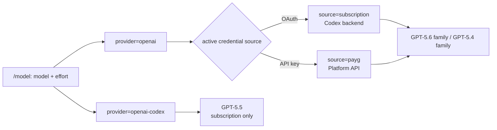

# OpenAI model surface alignment and GPT-5.4 Tau2 cycle

Status: implementation and live evidence complete; merge and deployment pending.
Date: 2026-08-01.

## Objective

Expose the current OpenAI/Codex model set through one coherent GEODE surface,
prove GPT-5.4 over the ChatGPT subscription route, and publish a Tau2 regression
cycle without conflating product-route evidence with native-user-simulator
leaderboard results.

Primary references:

- [Codex models](https://developers.openai.com/codex/models)
- [GPT-5.4 API model](https://developers.openai.com/api/docs/models/gpt-5.4)
- [GPT-5.6 Luna API model](https://developers.openai.com/api/docs/models/gpt-5.6-luna)

## Grounded surface

| Picker order | Model | Canonical provider | Sources | Picker effort |
|---:|---|---|---|---|
| 1 | `gpt-5.6-sol` | `openai` | subscription + PAYG | none–max |
| 2 | `gpt-5.6-terra` | `openai` | subscription + PAYG | none–max |
| 3 | `gpt-5.6-luna` | `openai` | subscription + PAYG | none–max |
| 4 | `gpt-5.5` | `openai-codex` | subscription only | none–xhigh |
| 5 | `gpt-5.4` | `openai` | subscription + PAYG | none–xhigh |
| 6 | `gpt-5.4-mini` | `openai` | subscription + PAYG | none–xhigh |
| 7 | `gpt-5.3-codex` | `openai-codex` | subscription, legacy | none–xhigh |

`gpt-5.3-codex` remains at the tail as an explicit legacy row because existing
`GEODE_MODEL` and `config.toml` values still need model management and
`/login use` plan pinning during the compatibility window. The current Codex
catalog marks that generation deprecated, so it is not part of the active six
models above. Spark is omitted because it is a Pro-only research preview, not a
stable general surface.

## GAP audit and changes

| GAP | Before | Resolution | Evidence |
|---|---|---|---|
| Visible ordering | GPT-5.5 preceded the 5.6 tiers | Current Sol/Terra/Luna-first order | picker contract test |
| Deprecated row | `gpt-5.3-codex` was mixed with active models | retain a labelled tail row and login pinning for persisted installs | picker/login contract tests |
| Effort drift | picker independently allowed `minimal` for GPT-5.4/5.5 | reuse `OpenAIModelSpec.reasoning_effort_values` | exact effort tests |
| Login pinning | `/login use` omitted 5.6 and GPT-5.4 subscription hints | route every visible compatible model | command contract test |
| Default override collision | GPT-5.5 picker identity followed mutable `OPENAI_PRIMARY` | pin the subscription-only row to `gpt-5.5`; keep routing defaults out of picker identity | reload regression test |
| Legacy effort migration | persisted OpenAI `minimal` could be rewritten on no-op Enter or move opposite the first arrow input | preserve no-op Enter; migrate ← to `none` and → to `low` | interactive picker regression tests |
| Operator docs | GPT-5.4 described as PAYG-only | document its dual-lane source selection | README + public docs |

The existing routing manifest, adapter specs, pricing catalog, and context
catalog already cover GPT-5.4 and GPT-5.6 Luna. They are reused, not duplicated.
The broader pre-existing distinction between plan-level explicit routing and
runtime source inference is left unchanged because the default OAuth/API-key
paths agree and it is not required to expose either model.

## Tau2 full-cycle scope

This cycle deliberately repeats the most recent GPT-5.6 release-regression
shape so the behavioral comparison is interpretable:

1. `mock/create_task_1`, one trial, for schema/executor/verifier wiring.
2. Telecom `small` fixed first task, one trial, for multi-turn read/write and
   simulated-user action coverage.
3. Agent and `geode_user`: `gpt-5.4`, `source=subscription`, effort `high`.
4. Harness: `sierra-research/tau2-bench@1901a301`, `tau2==1.0.0`.
5. Preserve native `results.json`, Crucible snapshot, and normalized trajectory;
   validate score authority, event/tool pairing, privacy, and digests.
6. Publish reviewed copies append-only through `geode-eval-artifacts`, update
   the internal ledger and public Tau2 page, merge through `develop` and `main`,
   then verify the deployed page.

This is a GEODE subscription-route regression, not a native tau2
`user_simulator` score and not a leaderboard claim. Failures remain data unless
the harness or provider route itself is invalid.

## Acceptance gates

- Current picker order and exact per-model effort contracts pass.
- `/login use` pins GPT-5.4 for both subscription and PAYG plans.
- Python static checks and all non-live tests pass.
- Both live Tau2 runs finish without provider/adapter/setup exceptions.
- Native receipts and trajectory snapshots are structurally valid and hashed.
- The artifact PR and GEODE PRs merge with green CI.
- The deployed Tau2 page names model, source, effort, scope, result, immutable
  artifact revision, and comparability boundary.

## Measured result

The live cycle used GEODE revision
`afaab52ba2fc0ee8b0ffcdf251371e65be6f0933`,
`sierra-research/tau2-bench@1901a301961cbbe3fd11f3e84a2a376530c759e3`
(`tau2==1.0.0`), and `gpt-5.4` through the OpenAI subscription route at
effort `high` for both the agent and GEODE user.

| Scope | Reward / pass | Events | Exact tool pairs | Route error |
|---|---:|---:|---:|---:|
| `mock/create_task_1` | 0.0 / 0.000 | 31 | 2 | 0 |
| Telecom `small`, first task | 1.0 / 1.000 | 127 | 8 | 0 |

The mock failure is behavioral: `create_task` included the unrequested optional
`description=""`, so Tau2's exact action and DB comparators rejected it. The
Telecom task passed its DB, `toggle_roaming`, mobile-data, and speed assertions.
Neither run had a provider, adapter, quota, agent, or simulated-user exception.

The reviewed public evidence merged through
[`geode-eval-artifacts#10`](https://github.com/mangowhoiscloud/geode-eval-artifacts/pull/10)
at commit
[`f588ce9`](https://github.com/mangowhoiscloud/geode-eval-artifacts/commit/f588ce9fd23b9123732b45c4dbe202136691d3fe).
Its manifest SHA-256 is
`2dc79cb569f03e5f44ce008b32fd8af86f8388ab04341ee8f91c74fdffb6aa6b`.
Remote read-back revalidated the manifest and both public native copies.
These are two diagnostic rows, not a native-user leaderboard aggregate; the
snapshots retain `promotion_authority=none`.
