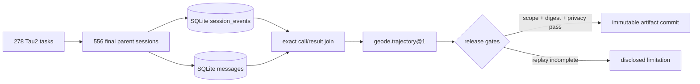

# Handoff — GPT-5.4, Tau2 full cycle, and v1.0.12

Date: 2026-08-03

Release authority: `v1.0.12`. When this document is read from that annotated
tag, the tag target is the exact runtime source. If the tag or public package
does not exist, the release is incomplete regardless of local or PR state.

Read §1 for the outcome, §2 for the final runtime surfaces, §3 for the Tau2
evidence, §4 for storage and artifact ownership, and §5 for the remaining
GAPs. §6 is the recovery checklist.

## 1. Outcome and evidence chain

The implementation and evidence are split across reviewable merge vehicles:

| Scope | Authority |
|---|---|
| GPT-5.4/Luna model surface and diagnostic Tau2 path | [GEODE #2857](https://github.com/mangowhoiscloud/geode/pull/2857) |
| concurrent `session_events` bootstrap | [GEODE #2858](https://github.com/mangowhoiscloud/geode/pull/2858) |
| failed Tau2 tool-call projection | [GEODE #2859](https://github.com/mangowhoiscloud/geode/pull/2859) |
| full-cycle official documentation | [GEODE #2860](https://github.com/mangowhoiscloud/geode/pull/2860) |
| v1.0.12 promotion to `main` | [GEODE #2863](https://github.com/mangowhoiscloud/geode/pull/2863), merge `f99cea63dd39eb3f49fb00ac36e2e2804518c100` |
| immutable full-cycle evidence | [`geode-eval-artifacts@86dcbba`](https://github.com/mangowhoiscloud/geode-eval-artifacts/commit/86dcbba3d15f1979b71a501780bf66fea4b450b5) |
| stable trajectory manifest | [`manifest.json`](https://github.com/mangowhoiscloud/geode-eval-artifacts/blob/86dcbba3d15f1979b71a501780bf66fea4b450b5/trajectories/tau2-geode-gpt54-22789ee2-geode-user-airline-retail-telecom-base-full-20260803T091257Z-13162f7bcff9/manifest.json) |
| v1.0.12 post-release behavior evidence | [`geode-eval-artifacts#12`](https://github.com/mangowhoiscloud/geode-eval-artifacts/pull/12), merge [`04ff1c4`](https://github.com/mangowhoiscloud/geode-eval-artifacts/commit/04ff1c4a1fee0cd1a3d837ad3a5f5239f1fd9acd) |
| public distribution | GitHub release and PyPI package `geode-agent==1.0.12` |

The manifest SHA-256 is
`13162f7bcff9ade1194f41af06549f0b0f239847f59630d5223386e2ca6362b3`.
The artifact repository was read back at the exact commit after merge; the
manifest, machine report, human report, and all three public native receipts
matched the reviewed publication.

### 1.1 Post-release closure

The annotated `v1.0.12` tag, GitHub release assets, PyPI files, checksum
ledger, clean `uvx --no-cache --from geode-agent==1.0.12 geode version`, and
public distribution verifier all resolve to `f99cea63`. The release workflow
completed successfully; the package is not merely PR-complete.

The exact released tree then ran GPT-5.4 subscription / effort `high` through
MCPMark filesystem/easy and two Tau2 diagnostics:

| Scope | Result | Behavior evidence |
|---|---:|---|
| MCPMark filesystem/easy | **9/10** | `file_context/uppercase` created all files but did not fully uppercase `file_01.txt` |
| Tau2 mock | **0/1** | `USER_STOP`; communication 1.0, DB/action 0.0 |
| Tau2 Telecom-small | **0/1** | `MAX_STEPS`; 14 paired calls repeated diagnostics before verifier scoring |

No failure was retried or relabeled. The two stable release manifests retain
416 events and 72 exact tool pairs across 12 scope-complete,
replay-incomplete trajectories. Their independently anchored hashes are
`9636b39c16fb494b5c7e97b8052451e521055ef08e17fddeb5a129b9e367d267`
(MCPMark) and
`fd524ce7a3cb1f1088f0e7a1531130d6302fb9f43d57a734303071bf6fd72288`
(Tau2); both were recomputed from GitHub bytes at artifact commit `04ff1c4`.

These release smokes do not replace the 278-task full cycle. MCPMark's
v1.0.11-to-v1.0.12 comparison is model-confounded, and the two Tau2 tasks are
diagnostic samples rather than a new aggregate.

## 2. Final runtime surfaces

### 2.1 OpenAI model surface

The curated picker order is:

1. `gpt-5.6-sol` — subscription and PAYG; effort `none` through `max`
2. `gpt-5.6-terra` — subscription and PAYG; effort `none` through `max`
3. `gpt-5.6-luna` — subscription and PAYG; effort `none` through `max`
4. `gpt-5.5` — subscription; effort `none` through `xhigh`
5. `gpt-5.4` — subscription and PAYG; effort `none` through `xhigh`
6. `gpt-5.4-mini` — subscription and PAYG; effort `none` through `xhigh`
7. `gpt-5.3-codex` — legacy management row for persisted installations

The provider remains `openai`. Credential-source inference selects the Codex
subscription backend for OAuth and the PAYG backend for API-key profiles.
Off-catalog configured defaults and active role selections appear once as
`Configured` rows; this preserves operator control without claiming that the
model is part of the curated catalog. Picker effort values come from the
adapter's `OpenAIModelSpec`, not a second CLI enum.

### 2.2 Hook, middleware, and runtime-event planes

| Plane | Surface | Authority |
|---|---|---|
| public control | 13 `HookName` values | versioned ABI; bounded/redacted payloads and closed decisions |
| trusted execution | 4 middleware join points | immutable request transforms or exactly-once async wrappers |
| internal observation | 57 `RuntimeEvent` members | telemetry/wiring vocabulary, not a public compatibility promise |

The public hooks are `UserPromptSubmit`, `PreToolUse`, `PermissionRequest`,
`PostToolUse`, `PreCompact`, `PostCompact`, `SessionStart`, `SessionEnd`,
`SubagentStart`, `SubagentStop`, `PreVerify`, `PostVerify`, and `Stop`.

The trusted join points are `tool_request`, `tool_execution`, `llm_request`,
and `llm_execution`. `MiddlewareKind` was deliberately not added: the registry
already exposes four type-specific protocols and registration/execution
methods, so an enum would duplicate the type system and fragment naming.

`PostVerify` lets an owning outer loop accept, revise, or escalate a candidate
after executable verification. Revision is monotone and bounded; it does not
replay completed tool side effects. Escalation withholds the candidate and
parks the session as `external_verification_required`, which is the useful
boundary for SIL, Crucible, and other external loops.

## 3. Tau2 full-cycle evidence

### 3.1 Contract

- runtime revision: `22789ee28e87ba03580beec3db6e919f5cef5178`
- upstream harness: `1901a301961cbbe3fd11f3e84a2a376530c759e3`
  (`tau2==1.0.0`)
- agent and user: `gpt-5.4`, subscription, effort `high`
- agent/user pair: `geode_agent + geode_user`
- domains: Airline 50, Retail 114, Telecom 114; 278 tasks total
- concurrency: 2; one final trial; maximum 200 steps
- task transport retries: Airline 0, Retail/Telecom at most 1
- promotion authority: none

`geode_user` is a GEODE external-loop diagnostic route, not Tau2's native user
simulator. The aggregate must not replace the native-user headline or be
presented as a leaderboard result.

### 3.2 Result

| Domain | Passed | Score |
|---|---:|---:|
| Airline | 42 / 50 | 0.8400 |
| Retail | 79 / 114 | 0.6930 |
| Telecom | 79 / 114 | 0.6930 |
| **Weighted total** | **200 / 278** | **0.7194** |

The final attempts comprise 556 parent sessions (agent plus user), 51,985
canonical `session_events`, 9,148 SQLite messages, and 3,964 exact tool
call/result pairs. Event IDs are unique, per-session ordinals are contiguous,
and there are no orphan calls or results. All three release scopes are
complete and all three source digests match.

The three native-result source SHA-256 digests are:

- Airline: `f15dc8b6798009161e0b14fbd2a86ededf82f08980a1447475aab5ecd43c7f51`
- Retail: `4cbd04b3e847aabb0f96c5cf5b50318cb36d6e35c65c230cc7f044bbdbe0d97f`
- Telecom: `6ac4f16c4954705dc87b17cae520f9ac882f7fafd4085a54c700716bfeaea9df`

The public copies are separately hashed after the reviewed synthetic
phone/email/home-address disclosure transform. They are not represented as
byte-identical raw receipts.

### 3.3 What the cycle does and does not prove

This cycle validates provider routing, agent behavior, durable lifecycle
history, failed tool-call projection, exact tool pairing, privacy review, and
artifact publication. It does not validate public hook dispatch: the Tau2
adapter intentionally constructs an isolated `AgenticLoop` without a
`HookRegistry`, so `hook_events == 0` is expected. The separate subscription
hook behavior E2E at artifact commit
[`b979268`](https://github.com/mangowhoiscloud/geode-eval-artifacts/commit/b979268d7e64c99ca27b51c025a2cd25022cc1a5)
is the authority for all 13 hooks and four middleware seams.

## 4. Persistence and artifact ownership

| Concern | Canonical store | Role |
|---|---|---|
| resumable current state | `sessions.db:sessions/messages` | mutable checkpoint and conversation reconstruction |
| behavioral history | `sessions.db:session_events` | append-only, versioned lifecycle/tool/message evidence |
| runtime telemetry | `sessions.db:hook_events` | bounded hook/middleware/runtime diagnostics |
| portable run projection | run-local `events.jsonl` | bounded, rebuildable serialization; not resume truth |
| reviewed trajectory | `geode.trajectory@1` | immutable normalized evaluation projection |
| public evidence | `geode-eval-artifacts` Git commit + release manifest | reviewed disclosure, digests, and remote read-back |
| verifier authority | SIL / Crucible native evidence | independent promotion decision; never overwritten by GEODE |

New runtime sessions do not create global transcript JSONL. `SessionTranscript`,
`RunTranscript`, the `run_transcript` re-export, and automatic legacy filename
fallbacks were deprecated in v1.0.11. v1.0.12 is the single post-deprecation
grace release: new integrations use `SessionTimeline`, `RunTimeline`, and
`events.jsonl`; old files should be migrated explicitly with
`geode session migrate-records`.

The external repository is a Git-backed evidence Artifactory, not a second hot
runtime database. Publication is append-only and reviewed by PR. Native Tau2,
SIL, and Crucible artifacts keep their own authority and are joined by digest
and evidence reference instead of being copied into `sessions.db` as verdicts.

## 5. Remaining GAPs

1. **Retry-attempt lineage is not normalized.** Seven Telecom task-level
   provider transport retries created fourteen extra SQLite sessions (agent and
   user) outside the 556 final parents. Final-attempt evidence is complete, but
   the retry graph is reconstructed from the bounded time window rather than a
   general trajectory lineage table. Existing `run_lineage` is seed-generation
   specific and correctly has zero Tau2 rows; do not overload it silently.
2. **Replay is not complete.** The release reports `scope_complete=true` for
   all three domains and `replay_complete=false` for all three. It is valid for
   behavioral review and exact tool pairing, not deterministic environment
   replay.
3. **Hook authority is separate.** Tau2's isolated loop has no public hook
   registry. Do not infer 13-hook coverage from the 51,985-event trajectory.
4. **Comparator boundary remains.** `geode_user` is useful for the outer-loop
   system but cannot be mixed into the native-user benchmark headline.
5. **Transcript grace must close.** Before the release after v1.0.12, register
   the compatibility-removal GAP, migrate remaining tests/callers, remove the
   deprecated constructors and re-export module, and retain only an explicit
   historical import path where archival migration requires it.
6. **Optional `sharp` advisories remain upstream-bound.** The full npm install
   reports two high advisories through optional `sharp<0.35.0`; the deployed
   static export omits optional native tooling and `npm audit --omit=optional`
   is clean. Do not describe the full dependency graph as advisory-free.
7. **The user-local `geode-ci` mirror is stale.** Its current script still
   passes the removed `autoresearch/` path to ruff and mypy and retains the old
   pytest-summary parser. The repository's GitHub workflow is fixed in this
   release and the current direct gates pass; update the separately installed
   local mirror before treating `geode-ci --fast` as authoritative again.
8. **Tau2 does not yet consume `PostVerify`.** The public hook and middleware
   E2E proves the contract, while the benchmark intentionally constructs an
   isolated loop without a hook registry. The retained `USER_STOP` and
   `MAX_STEPS` failures demonstrate the integration value, but a future
   adapter change must explicitly wire verifier output into `PostVerify`
   before claiming an executable outer-loop revise/escalate cycle.
9. **The release smoke is not a causal regression study.** MCPMark changes
   both release and model, and each Tau2 row has k=1. Use a frozen model,
   harness, task set, and repeated trial contract before promoting these
   deltas into a release gate.

## 6. Release and recovery checklist

The normal path is:

1. release PR into `develop`, all CI green;
2. `develop -> main` PR, merge commit, all CI green;
3. dispatch `release.yml` from `main` with `version=1.0.12`,
   `publish_stable=true`, and no hand-created tag;
4. require the annotated tag, GitHub assets, PyPI files, checksums, clean
   `uvx`, and public distribution verifier to agree on one main SHA;
5. verify Pages and official Tau2 links by public read-back;
6. remove only task-owned worktrees, harness copies, build directories, and
   local Tau2 databases after every immutable remote receipt is verified.

If the release workflow partially succeeds, rerun the same version against the
unchanged tag target. Never delete or move a published tag, overwrite a PyPI
file, or create a replacement release with different bytes.

Do not rerun 278 paid tasks merely to reconstruct state. The immutable artifact
commit, native source hashes, manifest, privacy review, and anchored remote
read-back are the completion evidence. A new full cycle is warranted only for
a runtime/provider/harness change or an explicitly versioned regression study.
