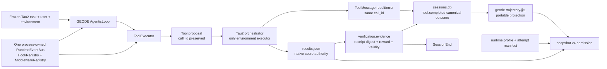

# Runtime-faithful Tau2 execution contract

Date: 2026-08-04
Source feedback: `lg-ai/presentation/wiki/geode-runtime-faithful-tau2-handoff-2026-08-04.md`
Status: implemented and merged in `baf170d70`; staged live verification
complete; full-cycle attempt infrastructure-invalid after subscription quota
exhaustion; diagnostic evidence published at `geode-eval-artifacts@40be847`;
clean rerun pending subscription capacity

## 1. Outcome

Tau2 continues to own its task, shared environment, tool execution, retry
policy, native termination, and reward. GEODE now runs each Tau2 participant
through the same process-owned hook/event/middleware composition used by
production and binds the native outcome back to the append-only session record
before the session closes.

The benchmark-safe profile deliberately excludes MCP/plugin discovery,
scheduler, gateway, and auto-learning. A disabled surface is serialized as
`disabled` or `not_exercised`, never as `passed`.



## 2. Authority and storage boundary

| Record | Mutability | Store | Authority |
|---|---|---|---|
| Active checkpoint | mutable | session checkpoint store | resume only |
| Session events | append-only | `sessions.db:session_events` plus local JSONL projection | GEODE execution history |
| Runtime events / extension dispatch | append-only, retention-bounded | `sessions.db:hook_events` | operational observability |
| Tau2 native receipt | immutable after finalization | upstream `results.json` plus copied trajectory receipt | task reward and native termination |
| Runtime profile | immutable companion | `<run>.runtime-profile.json` | runtime revision, route, prompt/tool digests, exercised surfaces |
| Attempt manifest | immutable companion | `<run>.attempt-manifest.json` | retry/session/final-selection lineage |
| Normalized trajectory | immutable projection | `<run>.geode-trajectory.json` | replay/correlation sidecar; no score authority |
| Snapshot v4 | immutable commit marker | `<run>.snapshot.json` | digest admission across the preceding artifacts |

`results.json` is not copied into `tool.completed`, and GEODE's built-in
`PostVerify` does not impersonate the episode-native Tau2 verifier. The native
verdict enters the session as typed `verification.evidence` and retains
`promotion_authority=none` until Crucible independently admits it.

## 3. Runtime profile

The runner creates one `Tau2RuntimeContract` per process and gives its exact
`RuntimeEventBus`, `HookRegistry`, and `MiddlewareRegistry` instances to every
Tau2 `ToolExecutor` and `AgenticLoop`.

The four trusted middleware surfaces are concretely registered and observed:

- `tool_request`
- `tool_execution`
- `llm_request`
- `llm_execution`

All 13 public hooks are registered without adding policy decisions. Hooks that
the run never reaches remain `not_exercised`. The manifest stores only bounded
contract facts: the assembled prompt SHA-256 and XML block inventory, canonical
tool-schema SHA-256 and allowlist, route identity, counts, runtime revision,
SQLite paths, and native receipt digest. It does not persist raw system prompts,
credentials, hidden reasoning, or private tool bodies.

Runtime profiles remain disjoint:

| Serialized profile | Participant ownership | Permitted reading |
|---|---|---|
| `tau2-native-user` | GEODE agent + upstream fixed user simulator | external comparison/runtime regression |
| `geode-dual-runtime` | GEODE agent + GEODE user simulator | two-sided runtime stress diagnostic |

They may not be averaged, pooled into one headline, or used as each other's
baseline.

## 4. External tool correlation

The former adapter executed read tools locally and returned a dry-run ACK for
mutating tools. Both paths could be recorded as a completed GEODE tool before
Tau2 applied the official environment transition.

The current path is uniform:

```text
provider tool_use id
  -> GEODE tool.called
  -> deferred projection ACK (not tool.completed)
  -> Tau2 ToolCall.id
  -> Tau2 environment result/error
  -> Tau2 ToolMessage.id
  -> GEODE tool.completed with the original id
```

An unknown result ID fails the attempt as infrastructure contamination. A
session with a still-pending call cannot be admitted or closed as successful.
If Tau2 terminates on the environment step before invoking the participant
again, the binder reconciles the final native `ToolMessage` from `results.json`
before applying that pending-call check.
No generic external transport abstraction was added; the join stays in the
Tau2 adapter until a second harness proves the same seam is needed.

## 5. Native verdict and close ordering

Terminal tokens and simulation deadlines no longer close a participant
immediately. After `run_domain()` finalizes `results.json`, the runner:

1. reads and hashes the native receipt;
2. joins each simulation to session IDs embedded in native messages;
3. records task, trial, participant, attempt, reward components, native/runtime
   termination and semantic/infrastructure validity as verification evidence;
4. records retry-exclusion evidence for sessions absent from the final receipt;
5. closes only selected receipt-bound sessions as completed and closes failed
   attempts as error.

`USER_STOP + reward=0` is therefore represented as a normal runtime completion
with a failed native task score. Stop protocol success and evaluator success are
not aliases.

## 6. Attempt manifest

The adapter temporarily observes the pinned Tau2 `run_with_retry` boundary; it
does not change retry count, delay, exception policy, seed, or final selection.
Every attempted task/trial records:

- stable attempt ID and retry predecessor;
- seed, status, bounded retry reason;
- assistant/user participant session IDs;
- native simulation ID;
- selected-final flag and final selection outcome.

This is a run-local JSON companion, not a new SQLite table. Session SQLite
remains complete local history; the manifest makes exclusion and selection
portable and machine-verifiable.

Contract-backed score runs forbid `--auto-resume`. Diagnostic auto-resume may
include native rows produced by an earlier process; those rows are retained as
`resumed_native_unattested` rather than being attributed to the current
runtime profile. They cannot satisfy snapshot-v4 promotion admission.

## 7. Snapshot v3 to v4 migration

| v3 field/behavior | v4 replacement | Compatibility rule |
|---|---|---|
| raw receipt digest only | raw receipt + runtime profile + attempt manifest digests | new score-bearing runs require v4 |
| projection ACK paired as completion | deferred ACK plus native result join | no alias; historical v3 remains immutable |
| retry sessions inferred from SQLite time scope | explicit retry/selection manifest | old runs remain diagnostic |
| native receipt joined after SessionEnd | `verification.evidence` before SessionEnd | old events are not rewritten |
| isolated loop without hook composition | shared benchmark-safe hook/middleware composition | historical claims remain revision-scoped |
| one undifferentiated GEODE route label | `tau2-native-user` / `geode-dual-runtime` | cross-profile aggregation forbidden |

The v4 verifier rejects missing companion references, sibling-path traversal,
companion digest changes, schema/run-ID drift, runtime revision drift, native
receipt digest drift, broken retry ancestry, and a final selection that does
not exactly cover native simulations. It also verifies the hash-bound normalized
trajectory itself: schema and run identity, raw-receipt/profile/attempt digest
bindings, and recomputed `scope_complete=true` are admission requirements.

`crucible.cached-row.v1` predates both companions. Crucible therefore leaves
existing cache shards intact but refuses them observably with
`row-cache-disabled.json`; it runs fresh rather than synthesize a false runtime
profile. Row reuse can return only after a new cache schema digest-binds the
source runtime profile and attempt fragment for every cached simulation.

## 8. Acceptance ledger

| Gate | Evidence | Status |
|---|---|---|
| Shared event bus/hook/middleware pair | loop/executor object-identity test | verified |
| Prompt block/hash and tool schema/allowlist | LLM request capture + runtime profile | verified |
| ACK is not completion | processor lifecycle test | verified |
| Exact result/error join; orphan rejection | supervisor join tests | verified |
| `USER_STOP + reward=0` split | before-close native evidence test | verified |
| Receipt/companion digest admission | v4 verifier tamper tests | verified |
| Normalized trajectory scope admission | recomputed integrity + incomplete-scope rejection | verified |
| Retry lineage and final selection | retry wrapper manifest test | verified |
| Disabled is not passed | typed runtime profile states | verified |
| Native/dual profile separation | snapshot/verifier profile check | verified |

## 9. Verification and rollout

Non-live order:

1. targeted Tau2 adapter, verifier, and tool lifecycle tests;
2. ruff, mypy, import boundaries;
3. complete non-live suite and repository hygiene;
4. independent Codex review.

Completed evidence on 2026-08-04:

- targeted runtime-faithful Tau2 set: 120 passed;
- complete non-live suite: 10,438 passed, 23 skipped, 1 deselected;
- ruff check/format, mypy (543 source files), four import contracts, and
  architecture-baseline check: passed;
- public site lint (0 errors) and static build (237 pages): passed;
- `uv build`: sdist and wheel built for GEODE 1.0.12.

The independent GPT-5.6 Codex review found three source-level gaps that the
initial suite missed: terminal-step ToolMessage reconciliation, explicit
diagnostic auto-resume provenance, and the final exhausted post-run attempt
state. All three were fixed and covered by the focused post-review suite.

The full suite still emits pre-existing scheduler teardown logging noise and
deprecation warnings; neither changed the zero exit status.

The staged live order completed through the paired known-failure case:

```text
mock × 1
-> Airline / Retail / Telecom × 1 each
-> known-failure paired pack
-> full 278 only because this change alters the runtime/artifact contract
```

The live report must publish the snapshot v4 commit marker and both companion
manifests with the native receipt and normalized trajectory. A run lacking any
required digest, containing infrastructure-contaminated rows, or carrying a
scope-incomplete normalized trajectory is infrastructure-invalid and cannot
enter promotion.

The subsequent three-domain full-cycle attempt scheduled all 278 base tasks at
revision `f08e7d6f5c785f76881ea2f9dfc2983ced8556d8`. The subscription quota was
exhausted during the run, leaving 48/50 Airline, 98/114 Retail, and 33/114
Telecom reward-bearing rows; the remaining 99 rows are infrastructure errors,
not task failures. Consequently this attempt has no aggregate score authority
and does not replace the earlier admitted 200/278 diagnostic.

The live attempt exposed a second defect before quota exhaustion: six Telecom
tool calls were recorded as `tool.called` but suppressed by a post-tool
convergence guard before Tau2 received the proposals. The follow-up moves the
external half-duplex yield immediately after the cognitive/tool round, before
those guards. It also makes infrastructure contamination an incomplete
snapshot state and makes Crucible recompute normalized-trajectory integrity;
the captured Airline and Retail artifacts admit, while the scope-incomplete
Telecom artifact is rejected. A clean 278-task rerun remains required after
subscription capacity returns.

The privacy-reviewed diagnostic report is immutable at
[`geode-eval-artifacts@40be847`](https://github.com/mangowhoiscloud/geode-eval-artifacts/blob/40be847f7c12004b1e70673808fa95bfd8646b59/reports/e2e-validation/2026-08-04-gpt54-runtime-faithful-tau2-diagnostic.md),
with the three-domain companions under
[`runtime-faithful-20260804`](https://github.com/mangowhoiscloud/geode-eval-artifacts/tree/40be847f7c12004b1e70673808fa95bfd8646b59/crucible/runs/trajectory-snapshots/runtime-faithful-20260804).
The remote manifest SHA-256 is
`40206ed181f69bd15bc4dd4b986ec99b921ba1afd9b15b14c2d9b64a637af317`.

## 10. Deliberate non-goals and remaining boundary

- The benchmark does not discover production plugins, skills, MCP servers,
  scheduler jobs, gateways, or auto-learning state.
- Conditional hooks are not artificially triggered to manufacture coverage.
- Raw prompts, credentials, private bodies, and hidden reasoning remain absent;
  `replay_complete=false` may therefore be the truthful public state.
- Tau2 episode reward is not converted into a `PostVerify` decision. A future
  explicit external-verification ingress requires evidence that a live outer
  loop must resume the same episode after native judgment.
- The Tau2-specific deferred-result join is promoted into core only after a
  second external harness demonstrates the same ownership boundary.
- Legacy `cached-row.v1` is retained for migration evidence but is not admitted
  into snapshot v4 runs because it cannot prove prompt/tool/runtime or retry
  lineage.
