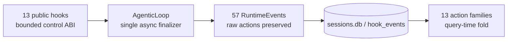

# Handoff — action-family query contract and finalizer cleanup

Date: 2026-08-05

Release authority: `v1.0.14`. The tag, GitHub release, and public
`geode-agent==1.0.14` package must exist before distribution is considered
complete. The full hook, middleware, trajectory, and Tau2 handoff remains
[`2026-08-05-runtime-faithful-hooks-release-handoff.md`](2026-08-05-runtime-faithful-hooks-release-handoff.md).

## 1. What landed

- PR [#2877](https://github.com/mangowhoiscloud/geode/pull/2877) removed the
  orphaned unary `eval_response_recorded` DPO precursor. Historical RunTimeline
  JSONL remains readable; no migration is required.
- PR [#2878](https://github.com/mangowhoiscloud/geode/pull/2878) removed the
  unreachable synchronous AgenticLoop finalizer chain. The exported synchronous
  `verify_turn()` library API remains available.
- Production finalization remains one asynchronous path with the monotonic
  public-hook sequence `PreVerify -> PostVerify -> Stop`.

## 2. `action_family` means analytics, not public hooks

`core.hooks.catalog.action_family(action)` takes the first segment of an
internal `RuntimeEvent.action` string and maps legacy heads into one of 13
query families:

```text
cognitive  context  cost  improve  llm  mcp  memory
mutation   policy   session  subagent  tool  turn
```

Compatibility folds are:

```text
adapter | prompt | model | reasoning        -> llm
user | execution | result | post            -> turn
shutdown | handoff                           -> session
rule | config | extension | program          -> policy
trigger | self | baseline                    -> improve
```

The raw `action` value is never rewritten. `HookEventStore.read(
family_filter=...)` expands the same alias table in SQLite, so old and canonical
rows remain query-compatible. A previous report that this policy lacked
production wiring was incorrect; no new projector or migration was added.

## 3. Final hook surface

The public ABI remains exactly 13 hooks:

```text
UserPromptSubmit
PreToolUse -> PermissionRequest -> PostToolUse
PreCompact -> PostCompact
SessionStart -> SessionEnd
SubagentStart -> SubagentStop
PreVerify -> PostVerify
Stop
```

These are separate from the 57-member internal `RuntimeEvent` vocabulary and
the 13 action families used to query that vocabulary. No public hook or runtime
event was added or removed in v1.0.14.



## 4. Verification and next work

The feature branch passed the full non-live suite (`10,418 passed`, `23
skipped`, `1 deselected`), Ruff, mypy, import contracts, architecture baseline,
site build, package install checks, and an independent GPT subscription review
with no actionable finding.

No new policy/search/reward abstraction was added. Trajectory preference and
agentic-RL export remain a future outer-loop concern; add them only when a real
training consumer defines the pair and credit-assignment contract. The next
operational work is the quota-reset Tau2 full cycle and MCPMark run described in
the v1.0.13 handoff, not another hook taxonomy change.
