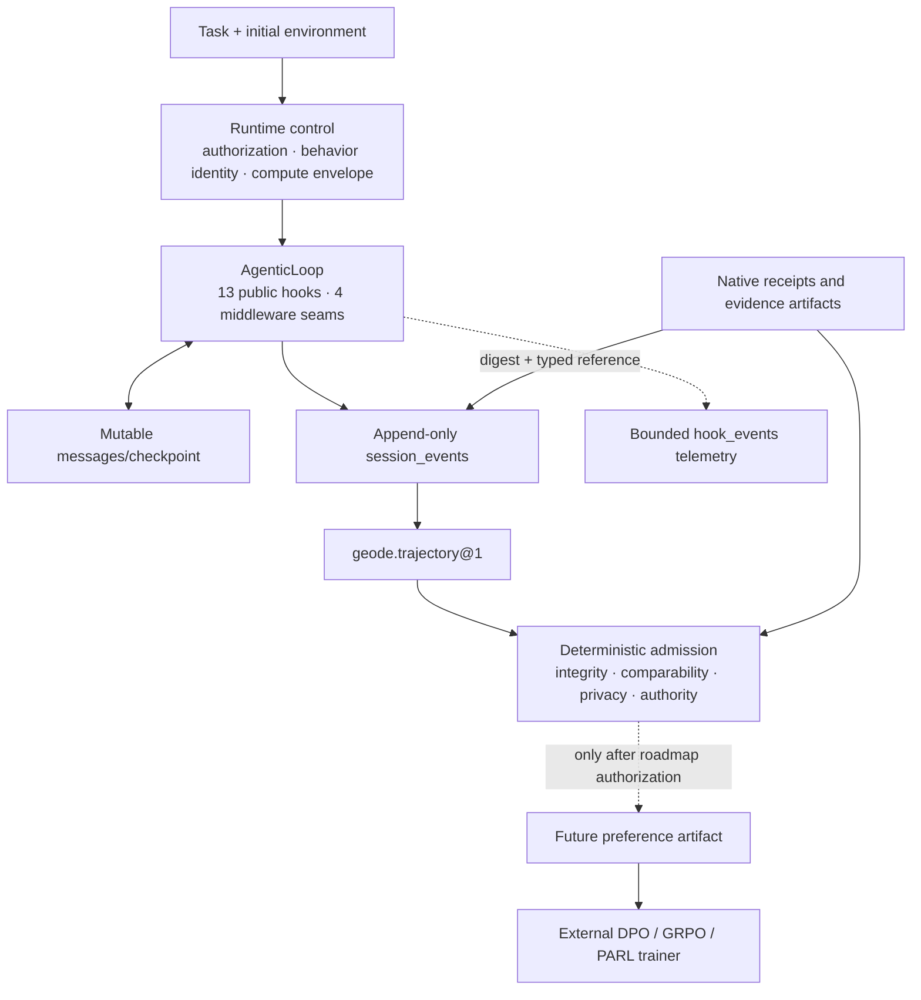

# Agentic learning data horizon

> Status: future-direction evidence, not an active implementation package.
> Execution status and authorization remain exclusively in
> [`../architecture/extensibility-roadmap.md`](../architecture/extensibility-roadmap.md).

Date: 2026-08-05

## 1. Decision

GEODE remains a runtime harness and execution ledger. It does not become a
DPO, GRPO, PARL, reward-model, or distributed rollout trainer.

The future boundary is:

```text
runtime control
    -> append-only session record
    -> evidence-bound trajectory projection
    -> deterministic dataset admission
    -> external post-training system
```

The model, scaffold, and compute policy may evolve outside the runtime. Hard
authorization, approval, privacy, and verifier-validity gates are not learned
or automatically rewritten from evaluation outcomes.

This decision keeps the useful part of the operator-provided
`Compute–Grounding–Trajectory` framing while rejecting a linear history in
which GRPO causes every later agentic-RL system. DPO and GRPO are sibling
optimization routes; asynchronous rollout, multi-agent credit assignment,
long-context execution, and resumable environments are separate system axes.

## 2. Research method

Mode: source-verification / fact-check.

Claims were checked against primary papers and official trainer documentation.
Secondary summaries were not used as authority. The code audit searched full
module paths and event names across production code, tests, scripts, plugins,
and active documentation. Historical changelog and ADR references were treated
as evidence of past intent, not as current consumers.

### 2.1 Source quality matrix

| Source | Authority for this plan | Grade | Limitation |
|---|---|---:|---|
| [DPO paper](https://arxiv.org/abs/2305.18290) | Direct preference objective, reference-policy relationship | A | Single-response experiments do not define a complete long-horizon agent data contract |
| [DeepSeekMath](https://arxiv.org/abs/2402.03300) | GRPO origin and group-relative PPO variant | A | Mathematics-focused rollout setting |
| [Stanford CS329A Part 4](https://cs329a.stanford.edu/) | ReAct, RLEF, and Constitutional AI as three different feedback/update surfaces | A | Lecture framing is secondary to the cited papers for algorithm details |
| [RLEF](https://proceedings.mlr.press/v267/gehring25a.html) | Public execution feedback, private-test reward, and PPO update contract | A | Short, single-program CodeContests tasks; training system and checkpoints are not public |
| [DeepSeek-R1](https://arxiv.org/abs/2501.12948) | Rule-verifiable reasoning reward and the boundary against neural reward models | A | Long-horizon tool environments are not the primary setting |
| [DAPO](https://arxiv.org/abs/2503.14476) | Dynamic sampling and optimization stability for outcome-reward RL | A | Token-level loss is not process-level reward |
| [Hugging Face TRL DPO](https://github.com/huggingface/trl/blob/main/docs/source/dpo_trainer.md) | Current tool-calling preference dataset shape | A | Trainer-specific materialization format, not a universal storage standard |
| [NVIDIA NeMo RL DPO](https://docs.nvidia.com/nemo/rl/nightly/guides/dpo.html) | Independent implementation evidence for ranked and binary preference inputs | A | Trainer-specific configuration and preprocessing |
| [GLM-5](https://arxiv.org/abs/2602.15763) | Asynchronous agent-RL and train/inference alignment | A | Training infrastructure disclosure is not a requirement for inference-only runtimes |
| [Kimi K2.5](https://arxiv.org/abs/2602.02276) | PARL orchestrator/subagent credit boundary | A | System report; not an interchangeable DPO recipe |
| [Kimi K3 report](https://github.com/MoonshotAI/Kimi-K3/blob/main/k3_tech_report.pdf) | Multi-effort RL, partial rollout, persistent sandbox state | A | Frontier training infrastructure exceeds GEODE's present role |
| [Agent-World](https://arxiv.org/abs/2604.18292) | Executable environment and verifier co-evolution | A | The outer benchmark must stay fixed while the training arena evolves |
| [Qwen-UI-Agent](https://arxiv.org/abs/2607.28227) | Separate local action feedback and delayed terminal environment reward | A | Very recent self-report without independent replication |

The reviewed sources do not require an inference harness to own a trainer.
They instead make exact context, action, observation, environment, verifier,
and policy/compute identity material to training quality.

### 2.2 Verified corrections

1. DPO removes an explicit reward-model-plus-PPO training stage; it does not
   make reward semantics disappear. Preference induces an implicit reward
   relative to a reference policy.
2. DPO's update is offline, but candidate generation can still explore before
   the preference dataset is assembled.
3. Tool-calling DPO requires the conversation, tool calls and results, and the
   available tool schemas. A verdict summary is not a substitute.
4. Stored rollout log-probabilities are not required by ordinary DPO. They
   become relevant when a real online/asynchronous RL backend requires them.
5. A successful final outcome does not identify which subagent step deserved
   credit. K2.5 therefore trains the orchestrator while treating frozen
   subagent outputs as observations.

### 2.3 Feedback is not one object

The Part 4 lineage fixes four terms that must remain separate:

| Surface | Signal | Consumer | Update target |
|---|---|---|---|
| ReAct | tool or environment observation | next inference turn | context only |
| RLEF public tests | execution diagnostics | next code-generation turn | context during rollout |
| RLEF private tests | terminal task reward | PPO trainer | policy weights and value model |
| Constitutional critique | critique and revision | SFT data construction | response policy |
| Constitutional preference | pairwise AI/human preference | preference model and RL | preference model and policy weights |
| GEODE Verify/PostVerify | verdict and bounded repair instruction | runtime finalization | next attempt or delivery state |
| SIL/Crucible | artifact-bound comparison verdict | external search controller | behavior SoT or private search ref |

RLEF's task reward is not a generic binary `0/1` field. It uses `+1` when all
tests pass, `-1` when any test fails at termination, and `-0.2` for an
intermediate response without valid code, plus a reference-policy KL penalty
with `beta=0.05`. Public test output is an observation; private tests are the
privileged reward oracle. The policy is token-level, the value estimate and
advantage are turn-level, and the optimizer is PPO. Calling this runtime retry,
process reward, GSPO, or hill climbing would collapse different operators.

The current Chinese frontier reports reinforce the same boundary:

- DeepSeek-R1 prefers rule-verifiable accuracy and format rewards for
  verifiable reasoning because neural reward models create a reward-hacking
  surface.
- DAPO changes sampling and policy-loss stability around outcome reward; its
  token-level loss does not create step labels.
- GLM-5 preserves token IDs, policy version, sandbox failure attribution, and
  train/inference alignment before applying asynchronous agent RL.
- Kimi K2.5 updates the orchestrator and treats frozen child trajectories as
  observations instead of inventing child credit from the parent outcome.
- Kimi K3 and Qwen-UI-Agent ground delayed reward in final environment state,
  while public diagnostics or local action checks support repair.

These are requirements on evidence identity and ownership. They do not require
GEODE to add a trainer.

## 3. Current GEODE evidence

### 3.1 Runtime and storage planes

| Plane | Current authority | Learning relevance |
|---|---|---|
| Mutable resume | `sessions.db:sessions/messages` and checkpoints | Re-enter execution; never publish as immutable history |
| Behavioral history | `sessions.db:session_events` | Canonical append-only source for trajectory projection |
| Runtime telemetry | `sessions.db:hook_events` | Bounded diagnostics; not behavior ground truth |
| Portable run view | `<run>/events.jsonl` | Rebuildable projection |
| Evaluation view | `geode.trajectory@1` | Immutable derived behavior/evidence view |
| Native receipts | Harness-owned files | Verifier authority; SQLite stores typed references and digests |
| Public artifact | `geode.trajectory-release@1` plus eval-artifact repository | Privacy-reviewed immutable publication |

The raw native receipt remains outside SQLite. Copying it into another table
would create two authorities. The session record should retain its identity,
digest, semantic/infrastructure validity, and correlation keys.

### 3.2 Hook and middleware surface

The public surface remains exactly 13 lifecycle hooks:

```text
UserPromptSubmit
PreToolUse / PermissionRequest / PostToolUse
PreCompact / PostCompact
SessionStart / SessionEnd
SubagentStart / SubagentStop
PreVerify / PostVerify
Stop
```

Trusted runtime interception remains four middleware join points:

```text
tool_request -> tool_execution
llm_request  -> llm_execution
```

These are control and observation seams, not new training-event taxonomies.
Learning views are projected from accepted execution records after correlation
and evidence checks.

### 3.3 Policy census

`policy` currently names several independent authorities:

| Current surface | Canonical meaning |
|---|---|
| `core.tools.policy.PolicyChain` | Tool authorization and registry filtering |
| `core.agent.tool_policy` | Model-visible behavioral tool surface |
| `.geode/model-policy.toml` / `ModelPolicy` | Model governance and route eligibility |
| round/time/cost/effort/context limits | Compute envelope |
| PreVerify/verifier/PostVerify/Crucible gate | Verification and admission |
| Model checkpoint plus effective prompt/tools/skills/harness | Trainable behavior-policy identity |

The production `AgenticLoop` tool surface is not derived solely from
`PolicyChain`; it is also shaped by `_tool_factory`, `allowed_tool_names`,
headless denial, approval, and `ToolExecutor`. A universal `Policy` class would
hide this difference rather than fix it.

### 3.4 Hill-climbing census

`AgenticLoop` is not hill climbing. It performs observation-conditioned tool
execution and, after a terminal candidate, runs
`PreVerify -> verifier -> PostVerify -> Stop`. A retryable failure starts a
bounded continuation and may trigger replanning on the next `arun`, but the
runtime keeps no scored incumbent, compares no local challenger, and updates
no model weights.

Two external surfaces are in the hill-climbing family:

| Surface | Exact current operator | Mutable target | Classification |
|---|---|---|---|
| SIL | one mutation, compare with prior baseline, keep or revert | one behavior SoT section | elitist `(1+1)-ES` local search |
| Crucible train | candidate child of current head, paired gate, KEEP-only ref advance | loop-local private search ref | gated single-lineage local search |

Crucible `REJECT` and `INVALID` leave the search head unchanged, and every
`PromotionVerdict` has `promotion_authority="none"`. It is therefore a bounded
scaffold search protocol, not policy-gradient RL or product release. RLEF,
DeepSeek-R1, DAPO, GLM-5, and Kimi training update model weights and should not
be grouped with these frozen-model search loops merely because all optimize a
score.

## 4. Dead-code finding and immediate action

### 4.1 Consumer census

`core.self_improving.loop.observe.eval_journaling` had:

| Kind | Count | Evidence |
|---|---:|---|
| Production producers | 1 | `core/self_improving/train.py` |
| Semantic readers/pair builders | 0 | The M4.x DPO pack chain was deleted in PR-CLEANUP-D3A |
| Dedicated test files | 2 | Tests pinned the producer itself, not a consumer outcome |
| Historical documentation | multiple | ADR/changelog evidence only |

The producer emitted a synthetic audit description as `prompt`, a verdict and
aggregate-count summary as `response`, and inferred `rollback_flag` from
fitness/verdict. Different commits usually produced different prompts. These
rows therefore could not prove a comparable `chosen`/`rejected` pair and were
not valid DPO examples.

### 4.2 Pruning contract

- Stop writing `eval_response_recorded`.
- Delete the producer module and tests that only preserve it.
- Preserve the promoted-audit `few_shot_pool` writer; it is an in-context
  scaffold input, not weight-training data.
- Do not migrate or relabel historical JSONL rows. Generic RunTimeline readers
  continue to tolerate them as historical event strings.
- Do not infer preference from rollback, promotion, scalar fitness, or final
  reward alone.

## 5. Future structure



### 5.1 Admission, not collection, is the hard boundary

A future preference projector may admit a pair only when it can prove:

- the same task and initial environment state;
- the same model-visible prompt/context and available tool schemas;
- the same harness and verifier contract;
- which policy or compute axis was intentionally varied;
- complete action/observation correlation;
- decision authority and evidence references;
- semantic validity independent of infrastructure success;
- privacy review, content lineage, and dataset split ownership.

Infrastructure failures are quarantined, not labeled `rejected`. Human
preference and executable correctness remain separate decision authorities.

For multi-agent runs, the default training view is the orchestrator-visible
trajectory. Child session lineage remains available through parent/call IDs,
but GEODE does not invent per-subagent credit. A later trainer may opt into a
separate child-policy dataset only with its own verifier contract.

## 6. Existing roadmap ownership

No new `LEARN-*`, `POLICY-*`, or trainer package is registered. Existing GAPs
already own the prerequisites:

| GAP | Future responsibility |
|---|---|
| `CAP-002` | One immutable effective `ToolPlan` and hash for every consumer |
| `LOOP-001` | `StepSnapshot` freezing route, policy, tool plan, and trace identity |
| `BND-005` | Neutral policy source/snapshot and run identity outside self-improving code |
| `PROTO-001` | Public projection separated from internal runtime events |
| `STORE-003` | Dataset identity, writers/readers, roots, retention, redaction, migration, rollback, and rebuild |

The future preference projection must wait for these owners rather than
introducing parallel snapshots or another canonical log. This document does
not move any GAP to `READY` or `IN_PROGRESS`.

## 7. Evolution gates

### Stage A — current cleanup

- remove the false DPO producer and self-tests;
- keep canonical audit, session, trajectory, and native receipt paths;
- document the evidence and migration rule;
- run targeted plus non-live repository gates.

### Stage B — runtime identity prerequisites

Start only after roadmap authorization for `CAP-002`, `LOOP-001`, and
`BND-005`. Reuse `ToolPlan`, `StepSnapshot`, and neutral run identity. Do not
create a learning-only snapshot hierarchy.

### Stage C — evaluation admission

Strengthen typed provenance and verifier/evidence correlation without changing
native receipt authority. Reward stays a component vector plus hard gates;
scalarization is a versioned derived decision.

The first admitted view has four non-compensable groups:

```text
outcome    = native task completion and final-state checks
process    = action validity, tool/result pairing, verify misses, repair effect
cost       = tokens, latency, tool calls, critical-path depth
constraints= permission, safety, privacy, evaluator validity, infrastructure health
```

Each value remains a typed `RewardAtom` with a target episode or transition,
source/version, evidence digest, and validity status. Constraint failures are
vetoes, not negative numbers that a high task score can outweigh. Domain-owned
views may derive a versioned scalar or pairwise order offline, but the runtime
does not own a universal reward table.

The smallest validating experiment uses existing Tau2 and Crucible artifacts:

1. select same-contract baseline/candidate pairs plus semantic, infrastructure,
   and false-terminal failures;
2. project the four groups without another live model call;
3. verify that infrastructure rows are quarantined, native success remains the
   terminal authority, and safety/identity failures cannot be compensated;
4. measure ranking stability under weight perturbation and agreement with the
   native verdict;
5. publish only the derived manifest and receipt digests, never duplicate the
   native receipt bytes.

This experiment tests whether the evidence contract can support later search
or training. It does not claim that the derived score is a learned reward
model.

### Stage D — preference projection

Start only when a named external trainer consumer exists. Add one immutable,
content-addressed pair manifest and a deterministic exporter to that trainer's
format. Do not add a daemon, database table, or online service.

### Stage E — online/asynchronous RL

Add token IDs, rollout log-probabilities, trainable masks, partial rollout, or
environment snapshots only when an owned backend demonstrates that DPO-style
offline materialization is insufficient. Until then these fields are YAGNI.

## 8. Verification contract

The current cleanup closes when:

1. full-path search finds no production import or call of
   `eval_response_recorded`;
2. promoted audits still append the existing few-shot exemplar;
3. historical RunTimeline records remain readable without migration;
4. targeted tests, Ruff, format, mypy for touched production code, import
   contracts, and the full non-live suite pass;
5. the committed diff receives the workflow-required second-opinion review.

Future stages require their own roadmap claim, privacy tests, tamper tests,
cross-policy comparability fixtures, and external-trainer round-trip evidence.

## 9. Limitations and research disclosure

The K2.5, GLM-5, and K3 reports describe systems at scales and with training
access that GEODE does not own. Their architecture is evidence for data
boundaries, not a feature checklist. TRL and NeMo formats can change and are
export targets, not GEODE's canonical schema. No actual preference dataset or
trainer round trip was measured in this cleanup.

This fact-check and plan were assembled with AI-assisted code search and source
verification. All external technical claims above link to their primary paper
or official implementation documentation.
