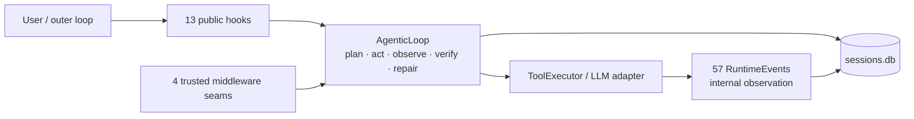
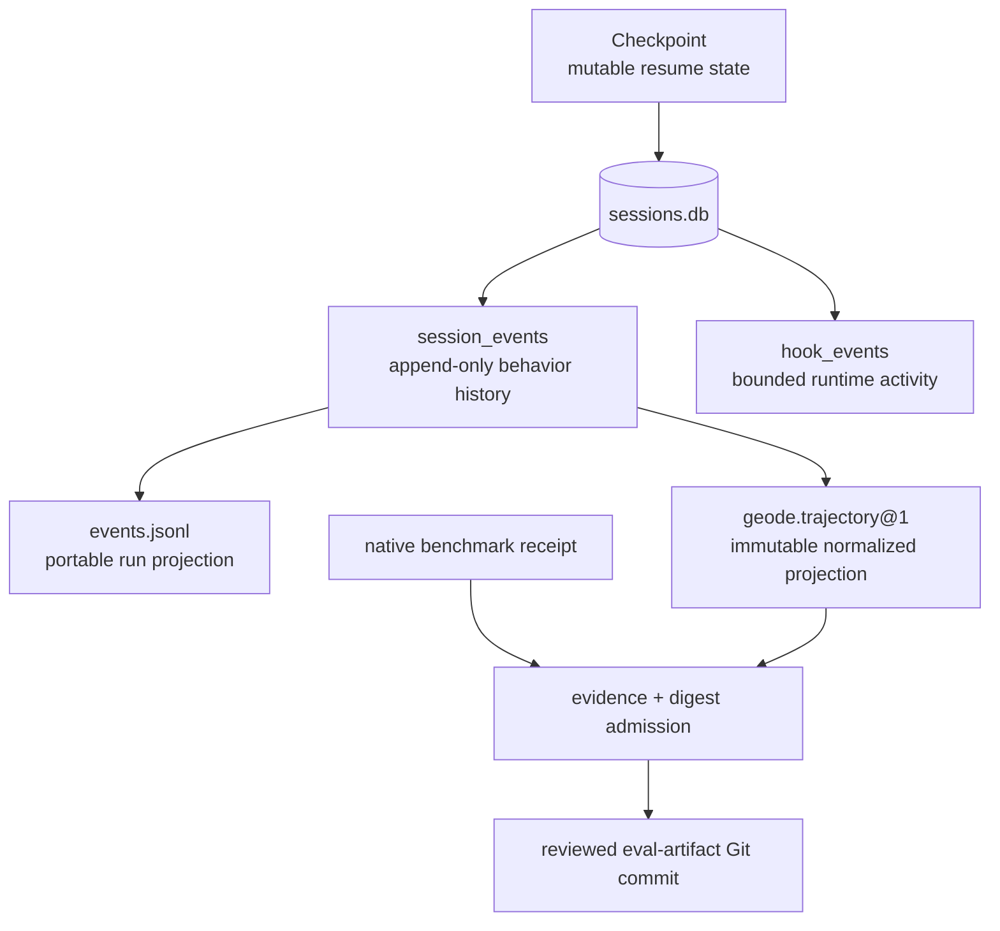

# Handoff — runtime-faithful hooks, trajectories, and v1.0.13

Date: 2026-08-05

Release authority: `v1.0.13`. When this document is read from that annotated
tag, its target is the exact runtime source. If the tag, GitHub release, or
public package is absent, release completion must not be inferred from this
document or a merged PR.

Read §1 for the result, §2 for the final hook/middleware surface, §3 for the
record and artifact boundaries, §4 for Tau2 evidence, and §5 for remaining
work.

## 1. Result and evidence chain

GEODE is not only a recording system. `AgenticLoop` already owns the
plan/act/observe/verify/repair control cycle; this release makes the execution
and evidence boundaries explicit enough for an external loop to inspect or
intervene without taking over native verifier authority.

| Scope | Authority |
|---|---|
| 13 public hooks, four trusted middleware seams, versioned session/trajectory contract | [GEODE #2868](https://github.com/mangowhoiscloud/geode/pull/2868), merge `f08e7d6f5c785f76881ea2f9dfc2983ced8556d8` |
| external-tool yield ordering and fail-closed trajectory admission | [GEODE #2869](https://github.com/mangowhoiscloud/geode/pull/2869), merge `baf170d70e235419528ade3f07910ce862c87d2b` |
| immutable artifact links in official docs | [GEODE #2870](https://github.com/mangowhoiscloud/geode/pull/2870), merge `3cca7d2e8d507c62f45e00e7af810dc245f784db` |
| privacy-reviewed invalidation evidence | [`geode-eval-artifacts@40be847`](https://github.com/mangowhoiscloud/geode-eval-artifacts/commit/40be847f7c12004b1e70673808fa95bfd8646b59) |
| machine/human diagnostic report | [report](https://github.com/mangowhoiscloud/geode-eval-artifacts/blob/40be847f7c12004b1e70673808fa95bfd8646b59/reports/e2e-validation/2026-08-04-gpt54-runtime-faithful-tau2-diagnostic.md) |
| public distribution | GitHub release and PyPI package `geode-agent==1.0.13` |

The remote 12-file diagnostic manifest SHA-256 is
`40206ed181f69bd15bc4dd4b986ec99b921ba1afd9b15b14c2d9b64a637af317`.
The bundle is invalidation evidence, not a score release.

## 2. Final extension surface

### 2.1 Three planes

| Plane | Stable surface | Role |
|---|---|---|
| public control | 13 `HookName` values, `geode.public-hook.v1` | bounded/redacted external decisions |
| trusted execution | four typed middleware protocols | immutable request transforms and exactly-once execution wrappers |
| runtime observation | 57 `RuntimeEvent` members | internal telemetry and lifecycle vocabulary, not public ABI |

The public hooks are:

```text
UserPromptSubmit
PreToolUse -> PermissionRequest -> PostToolUse
PreCompact -> PostCompact
SessionStart -> SessionEnd
SubagentStart -> SubagentStop
PreVerify -> PostVerify
Stop
```

`PostVerify` accepts only the closed `accept`, `revise`, and `escalate`
decisions. This gives SIL, Crucible, and other owning outer loops a stable seam
to retain evidence, request a bounded revision, or pause for external judgment
without replaying completed side effects. Tau2's native episode verdict is not
silently converted into a PostVerify decision; it enters the durable record as
typed `verification.evidence` and remains subject to Crucible admission.

The trusted middleware seams are exactly:

```text
tool_request     # transform a cloned ToolCallRequest before approval
tool_execution   # wrap the approved executor through next_call
llm_request      # transform a cloned LlmCallRequest before dispatch
llm_execution    # wrap provider execution through next_call
```

There is no `MiddlewareKind` enum. The four protocols and four registration
methods are already the type-level vocabulary; adding a parallel enum would
create a second registry without improving dispatch.

### 2.2 Runtime ownership



`HookRegistry`, `MiddlewareRegistry`, and `RuntimeEventBus` are process-owned
and shared by a runtime. Tau2's benchmark-safe runtime now passes those exact
instances to every participant loop and tool executor.

## 3. Record, trajectory, and artifact boundaries



| Data | Store | Authority |
|---|---|---|
| current session/messages | `sessions.db:sessions/messages` | resume and conversation reconstruction |
| behavioral history | `sessions.db:session_events` | append-only execution record |
| hook/middleware/runtime activity | `sessions.db:hook_events` | operational observation with retention |
| portable run projection | run-local `events.jsonl` | rebuildable JSONL, never resume truth |
| normalized trajectory | `geode.trajectory@1` | correlation/replay/evaluation sidecar |
| native Tau2 result | upstream `results.json` | reward and native termination |
| public evidence | `geode-eval-artifacts` commit + manifest | reviewed disclosure and immutable read-back |

New runtime sessions do not create global transcript JSONL. The schema-backed
`SessionTimeline`, `RunTimeline`, `session_events`, and `events.jsonl` are the
new path. Deprecated transcript constructors and legacy filenames remain only
as read/import compatibility; explicit `geode session migrate-records` imports
old bytes idempotently without rewriting them.

## 4. Runtime-faithful Tau2 cycle

### 4.1 Frozen contract

- GEODE runtime revision: `f08e7d6f5c785f76881ea2f9dfc2983ced8556d8`
- Tau2 revision: `1901a301961cbbe3fd11f3e84a2a376530c759e3`
  (`tau2==1.0.0`)
- agent and user: GPT-5.4 subscription, effort `high`
- profile: `geode-dual-runtime`
- base tasks: Airline 50, Retail 114, Telecom 114; 278 scheduled
- native environment executor: Tau2 only
- promotion authority: none

### 4.2 Admission result

| Domain | Reward-bearing rows | Passed rows | Infrastructure rows | Trajectory |
|---|---:|---:|---:|---|
| Airline | 48 / 50 | 42 | 2 | admitted |
| Retail | 98 / 114 | 76 | 16 | admitted |
| Telecom | 33 / 114 | 30 | 81 | rejected: six orphan calls |
| Total | 179 / 278 | 148 | 99 | no aggregate score authority |

Subscription capacity exhausted in the tail. The 99 rows are missing work,
not zero rewards, so no weighted score may be computed or compared with the
earlier 200/278 diagnostic.

Before quota exhaustion, six Telecom calls exposed an ordering defect:
`AgenticLoop` applied local convergence/repetition guards after a deferred ACK
but before returning the external proposal to Tau2. The adapter then emitted a
terminal response, leaving calls without results. The fix yields immediately
after the cognitive/tool round, before local guards. Crucible now verifies the
normalized trajectory's schema, digests, run identity, and recomputed
`scope_complete=true`; the captured Telecom artifact therefore fails closed.

## 5. Remaining work and recovery order

1. After subscription capacity resets, rerun the clean 278-task Tau2 contract
   on the released `v1.0.13` tree. Publish a score only if every scheduled row
   is native-receipt-bound and all three normalized trajectories are
   scope-complete.
2. Run MCPMark from the same released tree and account window. Keep its native
   verifier/result authority and publish through the same privacy/digest gate.
3. Remove the deprecated `SessionTranscript`/`RunTranscript` import aliases and
   automatic legacy filename fallback in a dedicated compatibility-removal GAP.
   Keep explicit archival migration; do not rewrite old artifacts.
4. Tau2 currently records native verdicts as `verification.evidence`; it does
   not consume `PostVerify`. Wire that only when an owning external loop must
   resume the same episode after accept/revise/escalate.
5. A general search-space graph and continuously learned reward policy remain
   domain-owned rather than being invented in the core runtime. Add either only
   when a second production loop proves a shared contract.

Release recovery order is release PR to `develop`, CI-gated `develop -> main`,
manual `release.yml` dispatch with `publish_stable=true`, then annotated tag,
GitHub assets, PyPI files, checksums, clean install, public distribution
verifier, Pages read-back, and finally task-owned worktree cleanup. Never move a
published tag or replace PyPI bytes.
