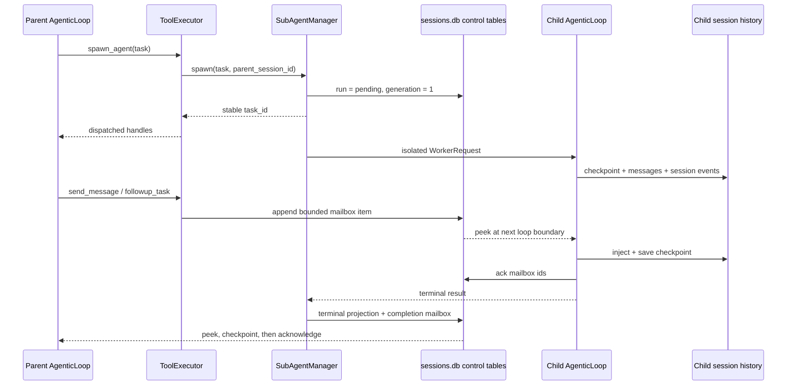
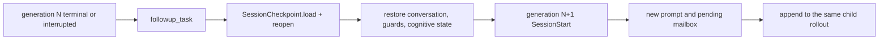
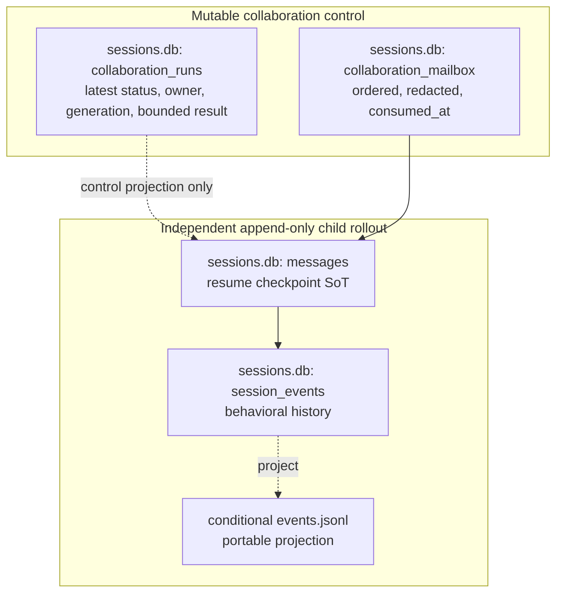

# Durable sub-agent collaboration: research, design, and implementation plan

Date: 2026-08-06
Roadmap package: R6.5
GAPs: COLLAB-001, COLLAB-002, COLLAB-003

## 1. Decision

GEODE keeps its depth-one, isolated `SubAgentManager` runtime and separates
foreground delegation from durable collaboration:

- `delegate_task` remains the blocking fan-out / best-of-N operation;
- `spawn_agent` returns one stable child handle immediately;
- `list_agents`, `wait_agent`, `interrupt_agent`, `send_message`, and
  `followup_task` expose one explicit contract per lifecycle operation;
- mutable run status and mailbox delivery use additive tables in the existing
  project-local `sessions.db`;
- the child checkpoint, messages, runtime/session events, and trajectory remain
  the independent rollout and replay source.

This is not a general thread manager. It does not add nesting, a planner,
residency/LRU management, automatic crash restart, or a second transcript.

## 2. Grounded frontier findings

The audit used current primary source, not prose summaries.

| System | Audited revision | What is mature | Boundary retained in GEODE |
|---|---|---|---|
| Hermes Agent | `01a1037d1e6d7b6eb96a786ef282c3aea4818194` | Top-level delegation is background-first; completion re-enters only at a legal conversation boundary; `async_delegations` persists routing, terminal delivery, claims, and bounded retention; a plugin-safe lifecycle API exposes immutable handles and explicit cancellation states | Preserve Hermes's background completion and legal-boundary delivery, while keeping foreground `delegate_task` compatible and avoiding its gateway-specific wake/claim machinery |
| Codex | `7a0e974e08c798d1e8d59d407aeb6e24db1313af` | Child threads own independent rollouts; V2 separates `send_message` from turn-triggering `followup_task`; `wait_agent`, `interrupt_agent`, status, completion mailbox, and bounded rollout materialization form a coherent lifecycle. Its durable user-input queue removes a row only after admission is persisted | Absorb explicit tool names, message/follow-up distinction, wait/interrupt, same-child continuation, and persist-before-ack without importing the full `ThreadManager`, residency cache, or multi-level agent tree |
| OpenClaw | `c37ba84f662aca1b2d384846ee59654e88ddfc50` | SQLite `subagent_runs` makes routing, retries, cleanup, delivery, and terminal state durable | Reuse the durability lesson only; its broad multi-channel run schema is not needed for GEODE's depth-one local worker contract |

Relevant Codex V2 source paths are
`codex-rs/core/src/tools/handlers/multi_agents_v2/`,
`codex-rs/core/src/agent/control.rs`,
`codex-rs/core/src/agent/control/residency.rs`, and
`codex-rs/thread-store/src/local/rollout_migration/subagent.rs`.
Relevant Hermes source paths are `tools/delegate_tool.py`,
`tools/async_delegation.py`, and `agent/subagent_lifecycle.py`.

## 3. Pre-change GEODE audit

| Capability | Current code | Finding |
|---|---|---|
| isolated child rollout | `SubAgentManager` → `IsolatedRunner` → `WorkerRequest` | EXISTS: process isolation, depth guard, session cap, Lane cap, role/tool narrowing |
| foreground fan-out | `SubAgentManager.adelegate()` | EXISTS: async fan-out, but the tool awaits the whole gather |
| stable control handle | in-memory `SubagentRunRecord` | MISFIT: not durable and not returned before completion |
| completion delivery | module-level five-minute `_announce_queue` | MISFIT: volatile and unused by direct `delegate_task` (`announce=False`) |
| interrupt | `IsolatedRunner.cancel(session_id)` | EXISTS but unwired to a public child-control surface |
| resume | `SessionCheckpoint.load/reopen` + `AgenticLoop.restore_from_checkpoint` | PARTIAL: top-level paths use it; worker invocations always create a fresh conversation |
| independent trajectory | child `session_id=task_id`, worker hooks, `SessionTimeline` | EXISTS: child messages and append-only events already survive independently |
| mailbox | none | ABSENT |

Three adjacent defects are in scope: mailbox rows were acknowledged before the
child checkpoint was saved, a follow-up could race the terminal transition and
be stranded, and the per-manager spawn counter reset when a session rebuilt its
manager during durable collaboration. The implementation fixes those shared
boundaries rather than adding caller-specific retries.

## 4. Target lifecycle

Resume is a new generation of the same child session:

No completed tool call is replayed. Resume restores the post-call checkpoint
and appends a new user turn.

## 5. Data contract

`collaboration_runs` stores one latest-state row per stable `task_id` and a
monotone `generation`. `collaboration_mailbox` stores bounded JSON payloads
with sender, recipient, kind, order, and `consumed_at`. Delivery is
persist-before-ack: the loop peeks rows, injects a stable `mailbox_id` marker,
saves the child checkpoint, and only then acknowledges those ids. A crash
before save leaves the row unread; a crash after save is deduplicated by the
marker. Parent messages are stable child input, not generation-scoped data, so
a terminal-boundary race cannot discard them. Secrets and oversized values are
removed by the existing session payload policy before insertion.

The run row intentionally does not duplicate prompts, transcripts, tool calls,
hidden reasoning, evidence, or trajectory. Those remain in the child session.
A process-owner token containing PID and OS-recorded process birth time lets a
later process turn orphaned `pending/running` rows into `interrupted` exactly
once and enqueue an observable completion without mistaking a reused PID for
the original live owner.

## 6. Public surface and migration map

| Previous surface | Final surface | Migration |
|---|---|---|
| `delegate_task(...)` | `delegate_task(...)` | foreground fan-out and best-of-N response stay unchanged |
| `delegate_task(..., background=true)` | `spawn_agent(...)` | one durable handle is returned as `task`; background flag is removed |
| `manage_subagents(action=list)` | `list_agents()` | parent ownership remains scoped to `ToolContext.session_id` |
| `manage_subagents(action=wait)` | `wait_agent(task_id, timeout_seconds)` | wait timeout never cancels the child |
| `manage_subagents(action=interrupt)` | `interrupt_agent(task_id)` | live local worker cancellation only |
| `manage_subagents(action=send_message)` | `send_message(task_id, message)` | queues context without forcing a turn |
| `manage_subagents(action=follow_up/resume)` | `followup_task(task_id, message)` | running child receives input; terminal child resumes generation N+1 |
| volatile announce queue | durable completion mailbox | legacy queue and duplicate `SubAgentResult` are deleted |
| fresh worker only | `WorkerRequest.resume=true` | false remains the default; true requires an existing checkpoint |

The extra tool names are deliberate: each has one schema and one effect, matching
Codex's public contract and removing an action enum whose validation depended on
cross-field prose. Subagents are denied `delegate_task` and every collaboration
tool from one shared deny-set.

## 7. Implementation slices

1. Add the two SQLite tables and bounded store operations. **Done.**
2. Reuse `adelegate`, `IsolatedRunner.cancel`, hooks, caps, and roles for
   durable child control. **Done.**
3. Replace the overloaded public controls with explicit collaboration tools.
   **Done.**
4. Restore worker checkpoints on continuation and use persist-before-ack at the
   existing per-round boundary. **Done.**
5. Delete the volatile announce queue, duplicate result contract, unused
   TaskGraph overlay, and inert manager dependencies. **Done.**
6. Update public documentation, generated inventory, and verification evidence.
   **Done.**

## 8. Verification gates

- store schema, redaction, ownership, order, persist-before-ack, and stale-owner recovery;
- foreground parity and immediate background return;
- list/wait timeout without cancellation, interrupt terminality, and foreign-parent rejection;
- live-child message delivery and terminal-child follow-up/resume generation;
- worker request round-trip and checkpoint restore;
- exact `SubagentStart`/`SubagentStop` cardinality and independent child session history;
- ruff, format, mypy, import boundaries, architecture baseline, targeted pytest,
  then the full non-live suite;
- independent committed-diff review before push.

## 9. Deliberately deferred

- nested/orchestrator children;
- automatic restart of work that may already have produced side effects;
- arbitrary sibling/cross-parent messaging;
- durable in-flight process adoption across OS restart;
- a general thread residency/LRU layer;
- DPO/reward/policy training consumers over collaboration runs.

These require separate evidence. R6.5 only makes the current depth-one runtime
controllable, resumable, and honest about its persisted state.

## 10. E2E characterization: idempotency and delegation depth

The deterministic public-surface scenario in
`tests/core/agent/test_subagent_collaboration.py` executes the production
`WorkerRequest -> _run_agentic -> AgenticLoop -> ToolExecutor ->
SessionCheckpoint` lifecycle in-process with scripted LLM responses. It uses
`spawn_agent` and the explicit collaboration tools rather than calling the
store directly. OS subprocess transport and a paid model call are intentionally
outside this contract test.

| Probe | Observed result | Decision |
|---|---|---|
| parent `research -> verify` stages | the parent inserted the completed research summary into the verifier's actual worker prompt; both children completed | parent-orchestrated depth one is sufficient for this measured dependency shape |
| child attempts `delegate_task` | the real worker deny rail rejected the research and verifier attempts; both denial results remained in their checkpoints | the child boundary is effective; nested delegation remains deferred |
| completed mutation, then explicit resume | the same generated tool call produced two commits under one stable task id | cross-generation side-effect deduplication is absent |
| checkpoint continuity | generation 2's actual LLM request contained generation 1's tool call and committed result | the duplicate is not checkpoint loss; a model can reissue a visible completed action |

The runtime therefore does not add nested children or automatic crash restart.
The test directly characterizes explicit resume; it does not simulate an OS
crash. The result nevertheless makes automatic restart unsafe to add until a
side-effecting tool has a caller-supplied operation key and a durable receipt
lookup that returns the prior committed result instead of executing again.
Read-only tools do not need this contract.

## 11. Closure evidence

| Gate | Result |
|---|---|
| targeted collaboration, hook, and memory tests | 51 passed |
| public trajectory release regression | 15 passed, including a symlink-root containment case found by live publication on macOS |
| full non-live suite | passed after updating the intentional Crucible source attestation for `agent_loop.py` |
| static gates | ruff lint/format, mypy (543 files), four import contracts, dependency drift, architecture baseline (84 tools / 57 `RuntimeEvent` members), and `geode version` all passed |
| public site | lint completed with 45 pre-existing warnings; static build generated 237 pages; 74 Markdown twins exported |
| GPT-5.4 collaboration E2E | `spawn_agent → send_message → wait_agent → followup_task → wait_agent → list_agents` passed through a real isolated worker on the subscription route; one stable child advanced from generation 1 to 2, both generations completed, five checkpoint messages survived, and the child mailbox ended empty |
| GPT-5.4 hook/middleware E2E | 13/13 public hooks and 4/4 middleware surfaces passed in 24.641 seconds; one tool call executed once, LLM request/execution stayed paired at 4/4, and SQLite/JSONL each retained 24 extension rows |
| public evidence | [eval-artifacts PR #14](https://github.com/mangowhoiscloud/geode-eval-artifacts/pull/14) carries only the two reviewed normalized trajectories and manifests; secret scans are zero and raw databases, checkpoints, prompts, tool bodies, and encrypted reasoning remain withheld |
| independent review | two read-only Codex MCP review attempts reached the 300-second transport timeout without a verdict; this is recorded as unavailable, not as approval |

The collaboration artifact is
`geode-agenticloop-durable-subagent-collaboration-e2e-20260806T110257Z-fd7d71b2fbde`
(14 events; manifest SHA-256
`fd7d71b2fbde77d0ffcd0eb8ca7c4d40302e3dd1d8eaf791a71d904d7b8935b3`).
The hook artifact is
`geode-agenticloop-hook-middleware-behavior-e2e-20260806T110501Z-a0feaf423373`
(29 events; manifest SHA-256
`a0feaf4233736b5b5273aa8af03893825c5fa24b511f00e3b308bd144669cde4`),
and correctly supersedes the stable-contract release from 2026-07-31.

Two failed attempts remain diagnostic rather than positive evidence. The first
hook run exposed the invalid fixed assumption that every model performs exactly
three LLM middleware calls; the gate now requires paired calls and a minimum of
two. The first collaboration probe injected a non-default test database that
the production child process does not share; the production-default-store rerun
above passed and is the only collaboration run published.
