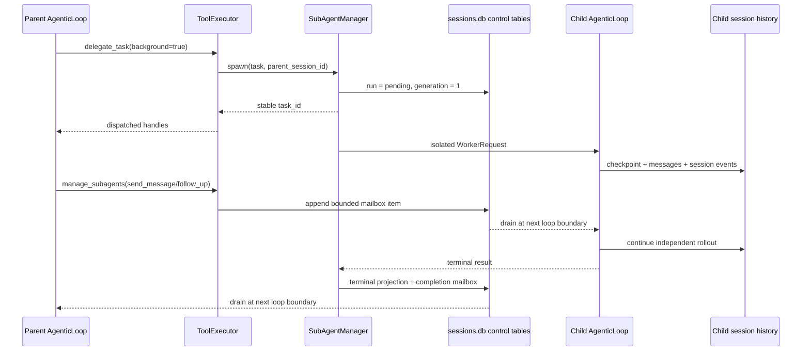
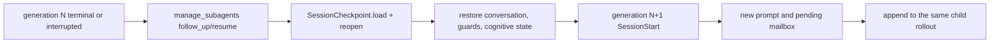
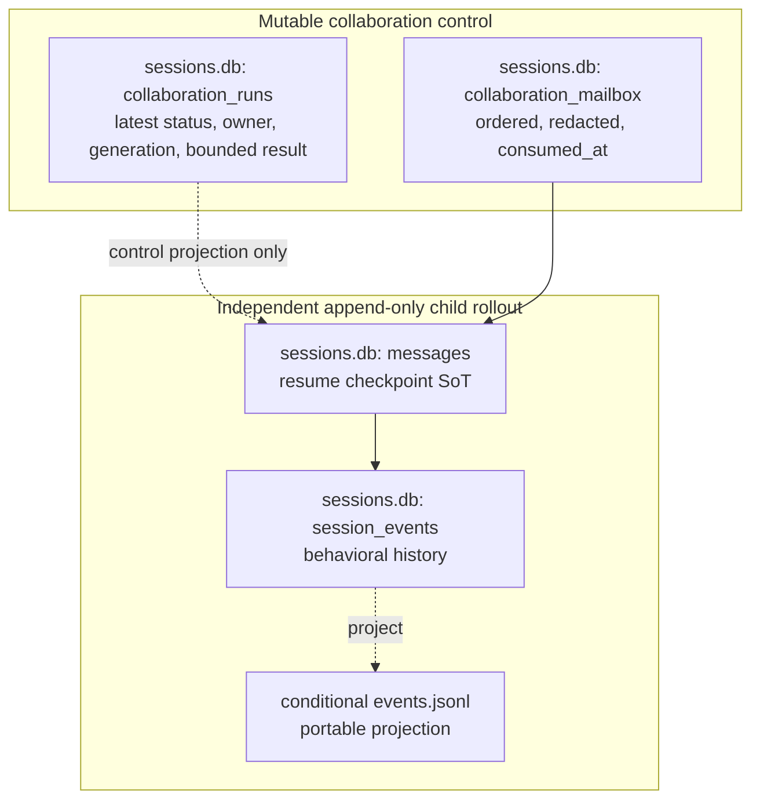

# Durable sub-agent collaboration: research, design, and implementation plan

Date: 2026-08-06
Roadmap package: R6.5
GAPs: COLLAB-001, COLLAB-002, COLLAB-003

## 1. Decision

GEODE will keep its current depth-one, isolated `SubAgentManager` runtime and
add only the missing collaboration controls:

- `delegate_task(background=true)` returns stable task handles immediately;
- `manage_subagents` provides parent-scoped `list`, `wait`, `interrupt`,
  `send_message`, `follow_up`, and `resume` actions;
- mutable run status and mailbox delivery use additive tables in the existing
  project-local `sessions.db`;
- the child checkpoint, messages, runtime/session events, and trajectory remain
  the independent rollout and replay source.

This is not a general thread manager. It does not add nesting, a planner,
residency/LRU management, automatic crash restart, or a second transcript.

## 2. Grounded frontier findings

The audit used current primary source, not prose summaries.

| System | Audited revision | What is mature | Boundary retained in GEODE |
|---|---|---|---|
| Hermes Agent | `01a1037d1e6d7b6eb96a786ef282c3aea4818194` | Top-level delegation is background-first; completion re-enters only at a legal conversation boundary; `async_delegations` persists routing, terminal delivery, claims, and bounded retention; a plugin-safe lifecycle API exposes immutable handles and explicit cancellation states | Preserve Hermes's background completion and legal-boundary delivery, but keep background opt-in for compatibility and do not copy its gateway-specific wake/claim machinery |
| Codex | `aac9f842473ac6a05d417dd76ce8b89bdb3b707d` | Child threads own independent rollouts; V2 separates `send_message` from turn-triggering `followup_task`; `wait_agent`, `interrupt_agent`, status, completion mailbox, and bounded rollout materialization form a coherent lifecycle | Absorb message/follow-up distinction, wait/interrupt, and same-child continuation without importing the full `ThreadManager`, residency cache, or multi-level agent tree |
| OpenClaw | `c37ba84f662aca1b2d384846ee59654e88ddfc50` | SQLite `subagent_runs` makes routing, retries, cleanup, delivery, and terminal state durable | Reuse the durability lesson only; its broad multi-channel run schema is not needed for GEODE's depth-one local worker contract |

Relevant Codex V2 source paths are
`codex-rs/core/src/tools/handlers/multi_agents_v2/`,
`codex-rs/core/src/agent/control.rs`,
`codex-rs/core/src/agent/control/residency.rs`, and
`codex-rs/thread-store/src/local/rollout_migration/subagent.rs`.
Relevant Hermes source paths are `tools/delegate_tool.py`,
`tools/async_delegation.py`, and `agent/subagent_lifecycle.py`.

## 3. Current GEODE audit

| Capability | Current code | Finding |
|---|---|---|
| isolated child rollout | `SubAgentManager` → `IsolatedRunner` → `WorkerRequest` | EXISTS: process isolation, depth guard, session cap, Lane cap, role/tool narrowing |
| foreground fan-out | `SubAgentManager.adelegate()` | EXISTS: async fan-out, but the tool awaits the whole gather |
| stable control handle | in-memory `SubagentRunRecord` | MISFIT: not durable and not returned before completion |
| completion delivery | module-level five-minute `_announce_queue` | MISFIT: volatile and unused by direct `delegate_task` (`announce=False`) |
| interrupt | `IsolatedRunner.cancel(session_id)` | EXISTS but unwired to a public child-control surface |
| resume | `SessionCheckpoint.load/reopen` + `AgenticLoop.restore_from_checkpoint` | PARTIAL: top-level paths use it; worker invocations always create a fresh conversation |
| independent trajectory | child `session_id=task_id`, worker hooks, `SessionTimeline` | EXISTS: child messages and append-only events already survive independently |
| mailbox | none | ABSENT |

One adjacent defect is in scope: `core.agent.loop._sub_agent_announce` imports
`core.agent.sub_agent` eagerly, which creates an import cycle when
`core.agent.sub_agent` is imported directly. Moving that import to the single
call site fixes the root cause and is required for the mailbox drain.

## 4. Target lifecycle

Resume is a new generation of the same child session:

No completed tool call is replayed. Resume restores the post-call checkpoint
and appends a new user turn.

## 5. Data contract

`collaboration_runs` stores one latest-state row per stable `task_id` and a
monotone `generation`. `collaboration_mailbox` stores bounded JSON payloads
with sender, recipient, kind, order, and `consumed_at`. Transactional drain is
at-most-once. Secrets and oversized values are removed by the existing session
payload policy before insertion. A resumed child consumes only mailbox messages
for its current generation; unread messages from an interrupted generation are
discarded at the loop boundary.

The run row intentionally does not duplicate prompts, transcripts, tool calls,
hidden reasoning, evidence, or trajectory. Those remain in the child session.
A process-owner token containing PID and OS-recorded process birth time lets a
later process turn orphaned `pending/running` rows into `interrupted` exactly
once and enqueue an observable completion without mistaking a reused PID for
the original live owner.

## 6. Public surface and migration map

| Existing surface | Additive target | Compatibility |
|---|---|---|
| `delegate_task(...)` | `delegate_task(..., background=false)` | existing synchronous response is unchanged |
| none | `delegate_task(..., background=true)` | returns `{status, tasks:[{task_id,status,generation}]}` before completion; `best_of` remains foreground-only |
| in-memory run records | `manage_subagents(action=list/wait/interrupt/...)` | task ownership is scoped to `ToolContext.session_id`; unknown/foreign task IDs fail closed |
| volatile announce queue | durable completion mailbox | legacy queue remains for existing non-tool callers during this change |
| fresh worker only | `WorkerRequest.resume=true` | false remains the default; true requires an existing checkpoint |

`manage_subagents` is one action-oriented tool rather than six new tool names.
This keeps the model surface compact while retaining explicit action values.
Subagents are denied both `delegate_task` and `manage_subagents`.

## 7. Implementation slices

1. Add the two SQLite tables and bounded store operations.
2. Add background spawn/control to `SubAgentManager`, reusing
   `adelegate`, `IsolatedRunner.cancel`, existing hooks, caps, and roles.
3. Extend `ToolExecutor` and `definitions.json` with the two compact public
   entry points.
4. Restore checkpoints in a worker only when `WorkerRequest.resume` is true;
   drain durable mailbox items at the existing per-round boundary.
5. Update the orchestration and persistence documentation, CHANGELOG, and
   generated architecture inventory.

## 8. Verification gates

- store schema, redaction, ownership, order, at-most-once drain, and stale-owner recovery;
- foreground parity and immediate background return;
- list/wait timeout without cancellation, interrupt terminality, and foreign-parent rejection;
- live-child message delivery and terminal-child follow-up/resume generation;
- worker request round-trip and checkpoint restore;
- exact `SubagentStart`/`SubagentStop` cardinality and independent child session history;
- ruff, format, mypy, import boundaries, architecture baseline, targeted pytest,
  then the full non-live suite;
- independent committed-diff review before push.

## 9. Deliberately deferred

- nested/orchestrator children;
- automatic restart of work that may already have produced side effects;
- arbitrary sibling/cross-parent messaging;
- durable in-flight process adoption across OS restart;
- a general thread residency/LRU layer;
- DPO/reward/policy training consumers over collaboration runs.

These require separate evidence. R6.5 only makes the current depth-one runtime
controllable, resumable, and honest about its persisted state.
