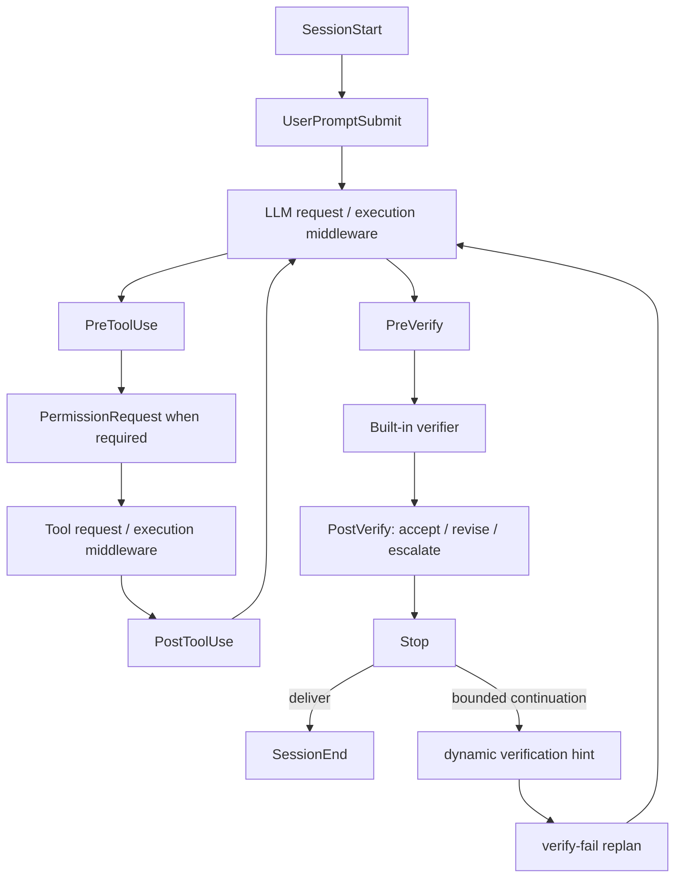
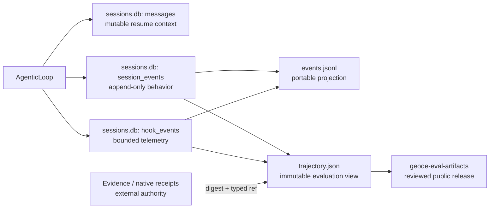

# Handoff — runtime memory authority and behavior evidence

> Date: 2026-08-07
> Runtime release: `v1.0.16`
> Status: implementation, release, roadmap closure, and branch synchronization complete

Start with this document, then use
[`2026-08-07-runtime-memory-trajectory-convergence.md`](2026-08-07-runtime-memory-trajectory-convergence.md)
for the audit, migration map, and future trajectory-v2 design. The canonical
delivery ledger remains
[`extensibility-roadmap.md`](../architecture/extensibility-roadmap.md).

## 1. Current state

| Outcome | Evidence |
|---|---|
| Memory authority cleanup | [#2903](https://github.com/mangowhoiscloud/geode/pull/2903), develop merge `a7a59b69f18589bec82eb515b482355924ac9467` |
| Main promotion | [#2906](https://github.com/mangowhoiscloud/geode/pull/2906), release source `c28d06910f8044beb96eadea241fcc31b88fc936` |
| Public distribution | [v1.0.16](https://github.com/mangowhoiscloud/geode/releases/tag/v1.0.16), PyPI `geode-agent==1.0.16` |
| `MEM-001` closure | [#2907](https://github.com/mangowhoiscloud/geode/pull/2907), main commit `32f94bd94481b1236c96f0905136879790a1ae0d` |
| Main → develop sync | [#2908](https://github.com/mangowhoiscloud/geode/pull/2908), develop commit `41d0522b0b6299a3dcfc6345fb9fce8fad6ec477` |
| Immutable behavior evidence | [eval-artifact #15](https://github.com/mangowhoiscloud/geode-eval-artifacts/pull/15), commit `4903c31abf983b7be076fd1e35775190fd6f4718` |

The cleanup was deletion-first: 217 insertions and 353 deletions. The default
prompt now reads the wired global/project user profile; the implicit
`TURN_COMPLETED` turn-trace memory writer and caller-free checkpoint/journal
write APIs are gone. Historical profile, session, and journal files were not
rewritten or deleted, and no durable schema migration was introduced.

## 2. Final control surface

The public ABI is exactly 13 names. Internal `RuntimeEvent` growth does not
expand it.

| Group | Public hooks |
|---|---|
| Session | `SessionStart`, `SessionEnd` |
| Input | `UserPromptSubmit` |
| Tool | `PreToolUse`, `PermissionRequest`, `PostToolUse` |
| Compaction | `PreCompact`, `PostCompact` |
| Delegation | `SubagentStart`, `SubagentStop` |
| Verification | `PreVerify`, `PostVerify`, `Stop` |

Four trusted middleware seams remain separate from that public lifecycle:
`tool_request`, `tool_execution`, `llm_request`, and `llm_execution`. Request
middleware transforms immutable envelopes in order; execution middleware wraps
the accepted terminal call with a single-use `next_call`.

`PostVerify` cannot erase a built-in failure. Retryable failures revise and
enter the existing replan path; non-retryable failures become pending external
verification; invalid failure-plus-accept decisions escalate. Continuation is
bounded to two attempts and does not replay completed tool side effects.

## 3. Records, telemetry, and artifacts

`session_events` and `hook_events` are intentionally separate. The former says
what behavior durably happened and survives for replay/evaluation; the latter
records extension invocation, middleware timing, blocking, errors, and policy
telemetry under shorter retention. Native Tau2/MCPMark receipts, SIL ledgers,
and Crucible evidence stay byte-authoritative outside SQLite and join the
trajectory by digest and stable reference. Copying them into SQLite would
create a second promotion authority.

The published Luna/max run produced 22 SQLite rows and the same 22 JSONL rows,
then projected 27 normalized trajectory events. Scope completeness passed;
replay completeness is deliberately false because private payloads were
redacted. The release manifest is
`aba8839af72cd4d96e7e22979affac98e04cbe027fff41e3b67732e75720103d`.

## 4. Verification

- Local non-live suite: 10,407 passed, 23 skipped, 1 deselected.
- Full lint, format, mypy, import contracts, dependency, architecture, roadmap,
  official-doc, package-content, and clean-wheel gates passed.
- Live `gpt-5.6-luna`, effort `max`: all 13 public hooks, all four middleware
  seams, deny/block/error/cancel/timeout/short-circuit/double-`next_call`
  behavior, SQLite/JSONL parity, trajectory projection, and secret scan passed.
- Public `uvx --no-cache --from geode-agent==1.0.16 geode version` returned
  `GEODE v1.0.16`.
- GitHub and PyPI wheel SHA-256:
  `865d49d6c7838018e1cdc3687a3a389bc5f48864c6a84962497f0a42fb3cada6`.
- GitHub and PyPI sdist SHA-256:
  `00e15285a414ed3e06182b0f1e1bb0f47022bf96c0a2ede97726a7c022a00495`.

## 5. Deliberately unfinished

Do not reopen `MEM-001`. The remaining trajectory-v2 work is a separate future
GAP: causal `parent_event_id` propagation, parent/child rollout edges,
best-of-N group/rank metadata, call-linked usage metering, large-payload content
references, and evidence-bound reward atoms. Add those only through the
architecture roadmap; do not add a reward database, policy framework, or a
second runtime writer in anticipation.

Operational follow-ups are non-blocking: the public site dependency audit still
reports five pre-existing lockfile advisories, GitHub Actions warns that two
pinned actions target deprecated Node.js 20, and Hugging Face publication was
intentionally skipped to avoid duplicating the canonical release artifacts.
