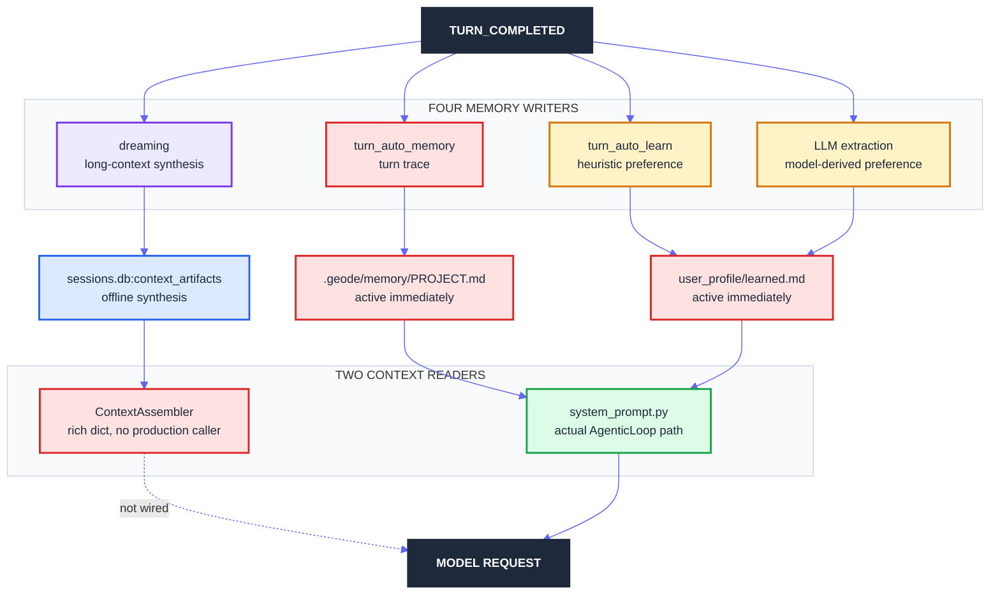
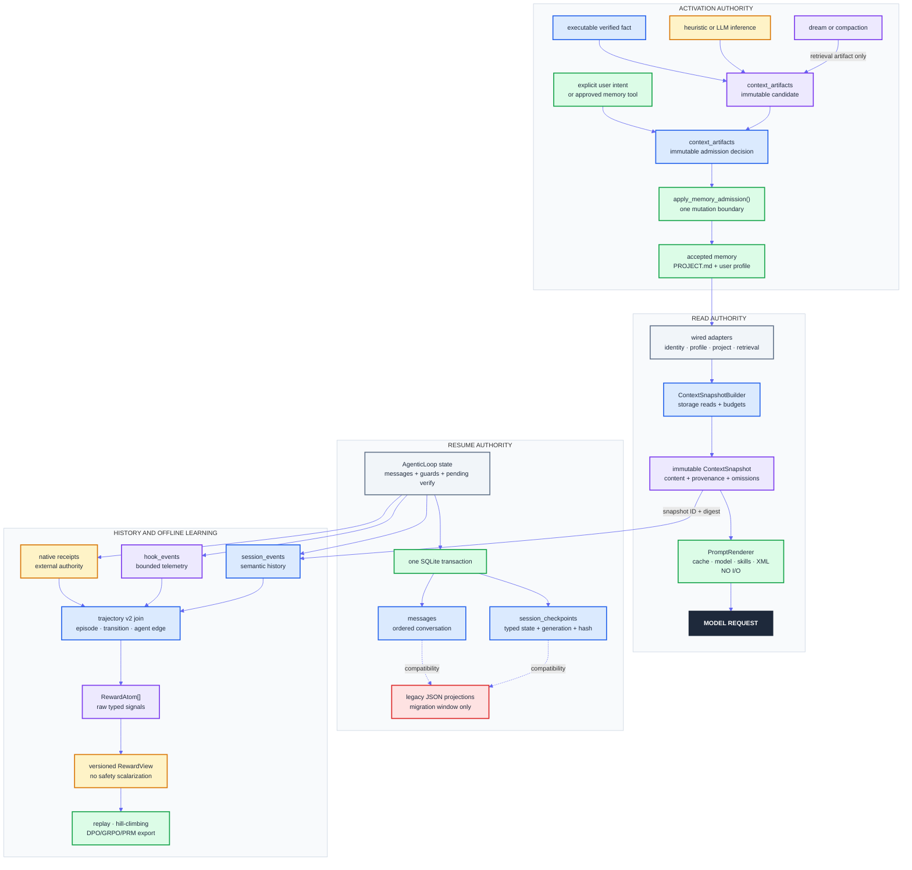
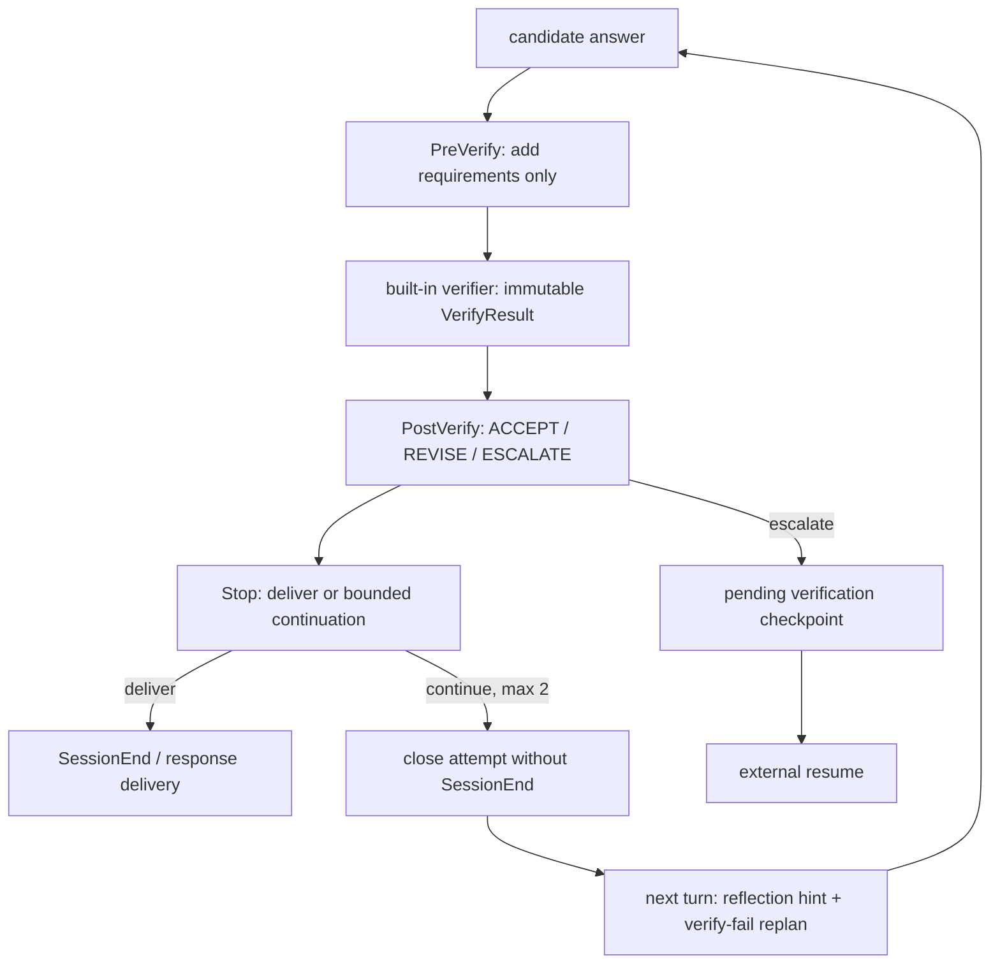

# Runtime memory · session record · trajectory convergence

> Date: 2026-08-07
> Status: MEM-001 authority-cleanup slice implemented and release-validated;
> later convergence phases remain planned
> GEODE baseline: `origin/develop@bd9d8ccfea63dfc35b3fd1e1da30cbe7f2e89aae`
> Comparison baselines: Codex `main@0bdce9f424eb9b39d7b3a8811742d10b6fbf8d54`,
> Hermes `main@eb8421ba9864cd58b0cf246cdffc6d45f6949372`

This document persists the 2026-08-07 audit of memory admission, duplicate
storage, session records, trajectories, and reward-ready execution signals. It
also incorporates the follow-up review performed against `main@03ef7999`, then
re-grounded against the newer `origin/develop` baseline named above. It is
design evidence, not a competing delivery ledger. Implementation must first
register any untracked architecture GAP through
[`extensibility-roadmap.md`](../architecture/extensibility-roadmap.md) and
follow that ledger's claim protocol.

## Delivery checkpoint

The MEM-001 slice implements only the measured deletion-first boundary:

- the default prompt path now reuses the wired global plus project profile;
- the implicit `turn_auto_memory` project-memory writer is removed;
- caller-free duplicate checkpoint and project-journal write APIs are removed;
- historical learned files remain readable without migration or rewrite;
- the public context documentation now distinguishes the default prompt path
  from the explicit `GeodeRuntime.assemble_context()` facade.

The full snapshot, admission, transactional-checkpoint, and reward-projection
phases below are not implied by this slice. Implementation PR
[`#2903`](https://github.com/mangowhoiscloud/geode/pull/2903) passed the full
non-live suite locally. Its live `gpt-5.6-luna` / subscription / effort `max`
run covered all 13 public hooks and four trusted middleware seams, with 22
SQLite rows matching 22 JSONL rows. The privacy-reviewed 27-event trajectory
is pinned to
[`geode-eval-artifacts@4903c31`](https://github.com/mangowhoiscloud/geode-eval-artifacts/commit/4903c31abf983b7be076fd1e35775190fd6f4718).
The slice reached `main` through
[`#2906`](https://github.com/mangowhoiscloud/geode/pull/2906) at
`c28d06910f8044beb96eadea241fcc31b88fc936`, shipped as
[`v1.0.16`](https://github.com/mangowhoiscloud/geode/releases/tag/v1.0.16),
closed `MEM-001` through
[`#2907`](https://github.com/mangowhoiscloud/geode/pull/2907), and synchronized
the closure back to `develop` through
[`#2908`](https://github.com/mangowhoiscloud/geode/pull/2908).

## 1. Decision

The attached assessments are directionally correct. The architectural problem
is best stated as three unresolved authorities, not as “too many stores”:

| Authority | Question | Current split |
|---|---|---|
| **Read authority** | What exactly reaches the model? | the live `system_prompt.py` path reads stores directly while the richer `ContextAssembler` is bypassed |
| **Activation authority** | Which observation may change future behavior, and when? | explicit, heuristic, LLM-derived, and dream paths have different quality but no shared admission contract |
| **Resume authority** | Which state reconstructs the loop after interruption? | SQLite messages, JSON metadata/tool caches, and SQLite projections are committed independently |

Three corrections follow from that framing.

1. Do not choose the current `ContextAssembler` or `system_prompt.py` as a
   monolithic winner. Split collection from formatting: a typed snapshot
   builder owns storage reads; a pure prompt renderer owns cache layout and XML.
2. The four `TURN_COMPLETED` handlers do not write identical bytes, and their
   outputs must not share one default gate. Explicit user intent, executable
   evidence, heuristic/LLM inference, and dream synthesis need source-specific
   admission.
3. `session_events`, `hook_events`, native receipts, and evaluation
   trajectories should not be collapsed. They have different retention and
   authority. They need complete correlation and immutable export, not one
   giant database.
4. A checkpoint is mutable resume state, not a replay of session events. Its
   field-complete authority should converge on one SQLite transaction; JSON
   files become temporary projections and migration inputs.

The convergence rule is:

> Preserve canonical facts once; derive caches and evaluation views from those
> facts; let only explicit writes or promoted candidates change model-visible
> memory.

The smallest target that satisfies that rule is:

- one read authority: a frozen `ContextSnapshot` built from wired adapters;
- one pure renderer: `core.agent.system_prompt.build_system_prompt(snapshot=...)`
  performs no filesystem or database access;
- one accepted project-memory file: `.geode/memory/PROJECT.md`;
- one injected `FileBasedUserProfile` instance per runtime;
- explicit user intent may activate directly after scope, permission, and
  capacity checks; executable facts, inferences, and dream artifacts follow
  distinct admission rules;
- SQLite atomically keeps field-complete resumable state and messages, while
  semantic/runtime events remain separate tables with separate retention;
- JSONL remains only where portability, billing, or an external domain ledger
  requires it;
- trajectory v2 performs the causal and reward joins without creating another
  hot runtime store.

### 1.1 Follow-up feedback disposition

| Feedback | Decision | Reason |
|---|---|---|
| typed context snapshot plus pure renderer | **accept** | fixes both profile-scope drift and hidden storage reads without injecting the current assembler's journal/vault/dream bundle |
| source-specific memory admission | **accept** | explicit user intent should not wait for three-session repetition; model inference must not activate directly |
| SQLite transactional checkpoint | **accept** | current save order spans independent commits and cannot prove an all-or-nothing resume generation |
| all ProjectJournal data as a projection | **reject as stated** | run/cost/error may be read models; learned/accepted memory is domain state, never an execution projection |
| `memory-decisions.jsonl` plus `MemoryPromoter` class | **simplify** | reuse `context_artifacts` for immutable candidate and decision records; one `apply_memory_admission()` function is enough until multiple backends appear |
| rename `preferences.toml` to `tool-policy.toml` | **correct to `permissions.toml`** | GEODE already has a distinct self-improving `tool-policy.json`; reusing the name would preserve ambiguity |

## 2. Current system: the measured divergence



### 2.1 The default loop bypasses `ContextAssembler`

| Fact | Code evidence |
|---|---|
| The loop builds its prompt through the loop helper and `core.agent.system_prompt` | `core/agent/loop/_context.py:74-100`, `core/agent/system_prompt.py:241-375` |
| The actual prompt path reads `.geode/MEMORY.md`, learned profile rows, `.geode/memory/PROJECT.md`, rules, and user context directly | `core/agent/system_prompt.py:348-361`, `635-761` |
| `ContextAssembler` can additionally read journal, vault, run history, dream, and compaction artifacts | `core/memory/context.py:32-300` |
| The sole production-looking wrapper is `GeodeRuntime.assemble_context()` | `core/runtime.py:388-394` |
| An exhaustive production caller search found no caller of that wrapper or of `ContextAssembler.assemble()` | `rg "assemble_context\\(|context_assembler\\.assemble\\(" core plugins` |

Therefore the published statement that every LLM request is assembled through
the five-tier `ContextAssembler` is false on the default runtime path. Routing
the loop through that rich dictionary is not the fix: it would automatically
inject low-quality journal, vault, and dream material. Keeping storage access
inside `system_prompt.py` is also not the fix. Reuse the wired dependencies and
only the measured useful collection logic to replace the loose assembler with
a typed `ContextSnapshotBuilder`; then reduce the existing system-prompt path
to a pure renderer. The current `ContextAssembler.assemble() -> dict` API and
its unconditional journal/vault/dream injectors still retire.

### 2.2 The same prompt can read two user-profile scopes

`build_memory()` constructs one profile with the configured global directory
and project overlay, then injects it through `profile_tools`
(`core/wiring/bootstrap.py:734-831`). `_build_learning_context()` uses that
instance (`core/agent/system_prompt.py:690-723`). `_build_user_context()` instead
constructs a fresh `FileBasedUserProfile()` (`:526-575`), dropping configured
and project-local scope.

This is a concrete defect, not an architectural preference. Both builders must
use `get_user_profile()`.

### 2.3 Four turn-completion handlers cross one admission boundary

`core/wiring/bootstrap.py:414-482` registers:

| Handler | Writes | Current quality control | Correct target |
|---|---|---|---|
| `turn_auto_memory` | `.geode/memory/PROJECT.md` | handler length check plus generic insight gate; still stores `[turn] input → tools` | delete; the canonical session record already owns this trace |
| `turn_auto_learn` | `user_profile/learned.md` | pattern heuristic, cooldown, local dedup | candidate unless the detector proves explicit quoted user intent |
| `turn_llm_extract` | the same `learned.md` | every-N-turn gate, model parse, local dedup; excludes explicit memory-tool turns | candidate only |
| `turn_dreaming` | `context_artifacts(kind="dream")` | source range, content hash, background generation | derived retrieval artifact only; never direct active memory |

The heuristic and LLM writers do not coordinate with each other. Their local
dedup is substring/input based, not a shared provenance or promotion contract.
Dreaming is launched after every completed turn with at least one round
(`core/memory/dreaming.py:310-329`), although its output is available only to
artifact search, the unused assembler, and the project-memory lifecycle.

The corrected admission statement is therefore not “all four become
`memory_candidate`.” `turn_auto_memory` stops; dream remains a dream; and the
two learning paths first classify whether they are replaying explicit intent
or inferring a preference.

### 2.4 Project memory has a deprecated reader that is still live

- `.geode/MEMORY.md` is called a deprecated meta-index in the architecture
  documentation, but `_build_geode_memory_context()` still injects it.
- `.geode/memory/PROJECT.md` is the active `ProjectMemory` store and is also
  injected by `_build_project_memory_context()`.
- `.geode/journal/learned.md` has an API and an unused assembler reader, but no
  production writer.

The convergence target is not a rename carousel. Finish the already-declared
migration: `.geode/memory/PROJECT.md` remains the sole accepted project-memory
file, `.geode/MEMORY.md` gets a lossless compatibility migration and then loses
its prompt reader, and journal `learned.md` is removed.

## 3. Storage authority audit

### 3.1 Current authority matrix

| Plane | Current destination | What it really owns | Verdict |
|---|---|---|---|
| Resume conversation | `sessions.db:messages` | full model-visible message history | **keep canonical** |
| Resume machine metadata | `<session>/state.json` | status, round, model/provider, guards, pending verification | **current required fragment; migrate to SQLite checkpoint** |
| Session query index | `sessions.db:sessions` | list/search projection plus verify/handoff columns | **keep, declare projection vs owned columns** |
| Message compatibility | `<session>/messages.json` | full duplicate of SQLite messages plus legacy fallback | **retire after global parity migration** |
| Tool-log compatibility | `<session>/tools.json` | last 50 processor log rows | **retire; resume never restores it into the processor** |
| Active pointer | `sessions/active.json` | latest session pointer | **retire after latest-resumable SQLite query parity** |
| Session state transitions | `sessions/transitions.jsonl` | legal, reopen, implicit, and refused edges | **migrate into canonical semantic events, then retire** |
| Semantic execution | `sessions.db:session_events` | append-only user/assistant/tool/subagent/verify history | **keep canonical** |
| Runtime/policy telemetry | `sessions.db:hook_events` | bounded hook, middleware, lifecycle, correlation and latency | **keep separate** |
| Portable run view | run-local `events.jsonl` | bounded rebuildable projection | **keep projection only** |
| Evaluation | immutable `trajectory.json` | reviewed/replayable derived view | **keep immutable** |
| Judgment | `~/.geode/evidence/*.jsonl` and native receipts | claims, verifier decisions, external authority | **keep external; bind by digest and stable key** |
| Billing | `~/.geode/usage/YYYY-MM.jsonl` | portable monthly cost ledger | **keep only if it remains billing authority** |
| Project run journal | `.geode/journal/runs.jsonl` | subagent start/stop/failure summary | **retire after parity; do not silently relabel as fully rebuildable** |
| Project journal cost/error/learned | `.geode/journal/{costs,errors}.jsonl`, `learned.md` | APIs with no production callers | **remove APIs; preserve old files as user data** |
| Ephemeral session dictionary | `InMemorySessionStore` | current runtime/tool context | **keep** |
| Duplicate checkpoint API | `InMemorySessionStore.save_checkpoint/load_checkpoint` | no production callers | **remove** |

`state.json` and `sessions.db:sessions` currently call themselves “both SoTs”
in `SessionCheckpoint._write_status()` (`core/memory/session_checkpoint.py:430-457`).
That phrase should disappear. More importantly, `SessionCheckpoint.save()`
currently writes status JSON, cognitive state, messages, compatibility JSON,
the active pointer, and session metadata through separate atomic writes or
SQLite commits (`:136-221`, `:573-644`). This means the current implementation
has field-level authorities but no atomic checkpoint generation.

The target is a typed `session_checkpoints` row plus ordered `messages`, written
in one SQLite transaction. `state.json`, `messages.json`, `tools.json`, and
`active.json` then become compatibility projections or one-time migration
inputs—not independent recovery requirements.

### 3.2 Local storage measurement

A metadata-only scan of the complete local `~/.geode` tree on 2026-08-07 read
file sizes and SQLite row counts, not message or memory content.

| Surface | Files / databases | Bytes | Rows where applicable |
|---|---:|---:|---:|
| `sessions.db` | 479 | 911,618,048 | `sessions`: 21,414 across 474 DBs |
| `messages.json` | 21,415 | 523,302,337 | — |
| `tools.json` | 5,453 | 273,801,641 | — |
| `state.json` | 21,416 | 38,019,313 | — |
| SQLite `messages` | 409 DBs | included above | 170,122 |
| SQLite `session_events` | 15 DBs | included above | 58,330 |
| SQLite `hook_events` | 67 DBs | included above | 13,146 |
| SQLite `context_artifacts` | 95 DBs | included above | 72 |
| journal `runs.jsonl` | 423 | 838,294 | — |

Interpretation:

- `messages.json` is almost one-for-one with the 21,414 indexed sessions and
  occupies about 499 MiB. `tools.json` adds about 261 MiB. This is a material
  compatibility tax, not theoretical duplication.
- The 479 databases span historical projects/worktrees and schema generations.
  Only databases opened by newer runtimes necessarily have every additive
  table. The table-count difference is migration coverage, not proof of data
  corruption.
- Deleting the caches now would be unsafe: 70 databases do not yet expose a
  `messages` table. A global, idempotent backfill and parity report must precede
  cache deletion.
- ProjectJournal's disk cost is small; its removal is justified by duplicate
  authority and dead code, not storage savings.

`session_events` currently deletes terminal-session history after 180 days
(`core/observability/session_timeline.py:39,491-532`). Therefore any future
project-wide run view kept longer than 180 days is an independently retained
materialized history, not a perpetually rebuildable projection. The default
plan is still to remove the unconsumed ProjectJournal rather than create that
view. If a measured external consumer requires it, each row must carry its
source event ID and projection watermark.

### 3.3 Current policy boundary

GEODE already has effect policy; it does not yet have memory-admission policy.

| Policy | Current owner | Semantics |
|---|---|---|
| tool exposure/effects | `core/tools/policy.py` | six-layer allow/deny chain; every applicable rule must pass |
| public hook decision | `core/hooks/public.py` | permission/block/revise decisions at declared lifecycle seams |
| verification continuation | PostVerify + pending verification checkpoint | accept, revise/replan, or hold external delivery |
| benchmark promotion | SIL/Crucible/native contract | evidence and non-exchangeable vetoes; GEODE trajectory has no promotion authority |
| memory admission | none shared | heuristic and model-derived writes can currently become active directly |
| personalization | `user_profile/preferences.json` | model-visible language/output preferences |
| tool permission | `user_profile/preferences.toml` | external effect authorization; despite the filename, not personalization |

The missing contract should stay narrow: it decides only whether a derived
memory is candidate or accepted. It must not become a second general
`PolicyChain`, and reward weights must never override an effect denial,
PostVerify hold, executable-check failure, or Crucible veto.

The two preference filenames also need semantic separation. Rename the effect
authorization file to `permissions.toml`, not `tool-policy.toml`: the latter
would collide with GEODE's existing self-improving `tool-policy.json` mutation
surface (`core/agent/tool_policy.py`).

## 4. What is duplication and what is not

### Delete or migrate

1. `turn_auto_memory`: it promotes a low-information trace already represented
   by user/tool/session events.
2. `ContextAssembler.assemble() -> dict` plus `GeodeRuntime.assemble_context()`:
   dead model-input API. Reuse only required wired reads in the typed snapshot
   builder; delete unconditional journal/vault/dream injection.
3. `ProjectJournal` learned-write/cost/error APIs: no production callers. The
   historical learned reader remains referenced by the explicit assembler
   facade and retires with that facade, not in the first cleanup.
4. ProjectJournal subagent hooks and `runs.jsonl`: duplicate subagent lifecycle
   after parity with `session_events` is proven.
5. `InMemorySessionStore.save_checkpoint/load_checkpoint` and the matching
   protocol methods: dead competing checkpoint vocabulary.
6. `tools.json`: loaded into `SessionState.tool_log`, but no resume path restores
   it into `ToolProcessor`; no replacement store is needed.
7. `messages.json`: remove writer after global SQLite parity; retain one
   read-only compatibility window, then remove reader and reclaim files.
8. `.geode/MEMORY.md` prompt reader: finish migration into
   `.geode/memory/PROJECT.md`.
9. `preferences.toml` permission filename: migrate to `permissions.toml` so it
   is not confused with personalization `preferences.json` or the existing
   self-improving `tool-policy.json`.
10. `transitions.jsonl`: first import transition/refusal facts into an explicit
    session-event kind, then stop the JSONL writer.
11. field-fragmented JSON resume authority: migrate to one versioned SQLite
    checkpoint transaction, then retire the JSON writers by parity gate.

### Keep separate

1. `session_events` and `hook_events`. The former is durable behavioral
   history; the latter is bounded operational/policy telemetry.
2. checkpoint state and messages. They have different schemas but must share
   one resume generation and commit boundary; co-location is not conflation.
3. native receipts/evidence and trajectories. A receipt is promotion authority;
   a trajectory is a normalized view. Copying raw receipts into SQLite would
   create a second authority and inflate the hot store.
4. accepted memory and session search. Always-on curated context and on-demand
   historical recall solve different problems.
5. `personalization.json` (migrated from `preferences.json`) and
   `permissions.toml` (migrated from `preferences.toml`). One personalizes
   output; the other authorizes effects. The existing `tool-policy.json` is a
   third, self-improving tool-surface policy and remains separately named.
6. JSONL usage ledger if billing/export consumes it independently. If no such
   consumer remains, it should be reclassified and removed in a separate
   measured change.

Accepted memory and learning candidates are never ProjectJournal projections.
If a run/cost/error read model survives because an external consumer is found,
it is explicitly marked with its source event, watermark, and independent
retention; otherwise deletion is smaller and safer.

## 5. Frontier comparison

### 5.1 Hermes: few active memories, one prompt reader

At `eb8421b`, Hermes has two bounded active files:

- `MEMORY.md`, default 2,200 characters;
- `USER.md`, default 1,375 characters.

`MemoryStore` loads and deduplicates them once, scans prompt-bound content for
threat patterns, and freezes the system-prompt snapshot while keeping live
tool state separate (`tools/memory_tool.py:148-240`). One prompt builder reads
that snapshot (`agent/system_prompt.py:515-524`). Writes use file locks, refuse
unreadable/drifted files, reject duplicates and overflow, and may be staged by
the documented memory-write approval gate. Full message history and FTS search
live in SQLite; compaction soft-archives old rows instead of deleting them
(`hermes_state.py:7144-7216`). Batch/RL trajectories remain separate from the
interactive session database.

Applied lesson: GEODE does not need Hermes's exact two filenames, but it needs
the same properties—bounded accepted memory, one reader, a stable snapshot
boundary, explicit write authority, and on-demand history outside the prompt.

### 5.2 Codex: raw rollout, candidate memory, and promoted memory are distinct

At `0bdce9f`, Codex separates the memory read and write crates. The write path
has two explicit stages:

1. eligible idle root rollouts are leased, filtered, redacted, and extracted
   into `raw_memory` plus `rollout_summary`;
2. a globally locked consolidation selects a bounded, usage/recency-ranked set,
   materializes a Git-diffable workspace, and lets a network-disabled,
   non-recursive subagent update consolidated memory.

External-context use can mark a thread's memory mode `polluted`, excluding it
from memory generation (`codex-rs/core/src/stream_events_utils.rs:141-157`).
Memory citations update per-source usage (`:174-185`). Current Codex also uses
six physically separate runtime SQLite files—including state, logs, goals,
memories, queue, and thread history—rather than forcing all state into one DB
(`codex-rs/state/src/sqlite.rs:29-106`). Migration 0035 removes memory tables
from the state DB and `memory_migrations/0001_memories.sql` recreates them under
the memory DB.

Applied lesson: physical consolidation is not maturity. Explicit ownership,
eligibility, leases, pollution state, selection, promotion, and migration are.
GEODE can obtain the relevant benefit with existing `context_artifacts` and
memory-lifecycle; it does not need Codex's full two-agent consolidation system.

### 5.3 Comparison matrix

| Concern | Hermes | Codex | GEODE now | GEODE target |
|---|---|---|---|---|
| Active memory | two bounded files | consolidated memory workspace | multiple prompt files + auto writers | one project memory + one user-profile owner |
| Prompt read/render | frozen store snapshot + one builder | read crate/instruction injection | system prompt performs I/O + unused assembler | typed snapshot builder + pure renderer |
| Automatic extraction | optional gated memory writes | leased phase 1 candidates | heuristic/LLM direct activation | `context_artifacts` candidates |
| Promotion | explicit tool/approval | bounded phase 2 consolidation | partial cross-session proposal for dreams | existing lifecycle + HITL/explicit write |
| Resume/history | SQLite messages + FTS | rollout JSONL + SQLite projection | SQLite messages/events + required JSON fragments | transactional SQLite checkpoint/messages; events remain append-only history |
| Pollution | scan + refuse unsafe memory | thread `memory_mode=polluted` | sanitizers but no common admission | provenance/scope/pollution metadata on candidates |
| RL/eval | separate batch/RL systems | rollout is replay source | immutable trajectory v1 | trajectory v2 reward projection |

## 6. Target architecture



### 6.1 Context snapshot and rendering contract

The current `ContextAssembler` class is not promoted as-is. Replace its loose
dictionary API in `core/memory/context.py` with the smallest typed contract:

```text
ContextSection
  name, content, source_refs, content_hash, scope,
  trust_class, admission_class, freshness,
  retrieval_reason, omitted_reason

ContextSnapshot
  schema_version, snapshot_id, memory_generation,
  token_budget, sections[]
```

`ContextSnapshotBuilder` is constructed from the already wired organization,
profile, project-memory, session, and artifact adapters. It collects only
declared sections. Journal, vault inventory, dream, compaction, and historical
sessions are absent unless an explicit retrieval decision supplies a reason
and budget. Missing, stale, rejected, or over-budget sources are represented by
bounded omission metadata rather than silently disappearing.

`PromptRenderer` keeps the valuable parts of `system_prompt.py`: cache
boundary, model card, provider/surface guidance, skills, audit/persona gates,
and XML layout. It receives no path or storage object and performs no I/O.
Determinism is defined over both inputs:

```text
ContextSnapshot
+ RenderConfig(model, surface, audit mode, skill digest, renderer version)
→ identical prompt hash
```

Snapshots are immutable per LLM request and keyed by an accepted-memory
generation. An explicit admitted write advances that generation and appears in
the next request. Background heuristic, LLM, and dream work cannot advance it.
The snapshot ID and section digests are recorded in session history so an eval
can prove what the model saw without storing the full prompt twice.

### 6.2 Memory admission contract

No new memory framework or table is required initially.

| Source | Admission | Activation |
|---|---|---|
| exact user preference/correction with source span | sanitize, scope, conflict, sensitivity, capacity; emit accepted decision | next request |
| approved `memory_save` / `profile_learn` | existing permission plus the same admission function and durable receipt | next request |
| executable-tool-verified project fact | candidate by default; TTL auto-admit only for an allowlisted claim class with immutable evidence | decision-dependent |
| regex inference | candidate; repeated evidence or confirmation required | never direct |
| LLM extraction | candidate with model/provider/prompt hash and `derived=true` | never direct |
| dream/compaction | keep its own artifact kind and source range | retrieval only; never direct |
| `turn_auto_memory` trace | semantic turn/tool event | not memory |
| project rule or runtime policy | explicit human approval and effect-policy check | accepted rule generation |

Candidate payload and decision are separate immutable rows in the existing
`context_artifacts` table:

```text
memory_candidate
  claim_type, scope, producer, source_event_refs, evidence_refs,
  confidence, sensitivity, expires_at, conflicts_with, supersedes

memory_admission_decision
  candidate_id, verdict, reason, reviewer/source, target_digest, decided_at
```

The semantic session event records the transition for timeline joins. Accepted
memory frontmatter retains the candidate and decision IDs so its provenance
survives the 180-day session-event retention. There is no new JSONL ledger and
no `MemoryPromoter` class. A single `apply_memory_admission()` function routes
accepted decisions through the existing `ProjectMemory` or
`FileBasedUserProfile` writer and increments the memory generation. Explicit
tools call the same function with an explicit-source decision; background
producers can only write candidates.

The existing cross-session memory lifecycle remains useful for repeated
project insight, not as a universal gate. Dream scheduling moves from every
completed turn to session end, idle, compaction, explicit request, or measured
token/context-pressure thresholds. Generation cost, later retrieval,
proposal-use, and acceptance are counted before adding any smarter scheduler.

### 6.3 Transactional checkpoint contract

Do not derive resume from `session_events`. Add one versioned mutable table to
the existing `sessions.db`, not a new database:

```text
session_checkpoints
  session_id PRIMARY KEY
  generation
  schema_version
  state_json
  state_hash
  message_count
  messages_hash
  updated_at
```

`state_json` is validated by the existing typed `SessionState` serializer and
contains round/model/provider/status, loop guards, pending verification,
cognitive state, and only tool state proven necessary for resumption. One
`BEGIN IMMEDIATE` transaction replaces ordered `messages` and upserts the next
checkpoint generation plus its hashes. The query-oriented `sessions` row may
be updated in that same transaction, but remains an index/read model rather
than the resume contract.

Required invariants after migration:

```text
delete state.json     → resume succeeds from SQLite
delete messages.json  → resume succeeds from SQLite
delete tools.json     → resume succeeds or the unused tool_log field is gone
delete active.json    → latest resumable session query recovers the pointer
hash/count mismatch   → load fails loud; it never mixes in a JSON fallback
```

Legacy JSON is a digest-backed, idempotent migration input. It is not an
indefinite read fallback. This transaction changes resume authority only;
`session_events` continues to answer what happened, and `hook_events`
continues to answer how runtime/policy middleware behaved.

### 6.4 Evidence and receipts

Native Tau2/MCPMark receipts, SIL ledgers, Crucible evidence, screenshots, and
large tool outputs should **not** be copied into SQLite. SQLite should persist
the stable locator, digest, media type, producer schema, and correlation key.
The immutable trajectory/export must snapshot every reward-relevant normalized
fact before bounded hook telemetry expires. Raw receipt authority remains with
the native store.

This produces one-way ownership:

```text
native receipt bytes --SHA-256/reference--> trajectory evidence_ref
                                    |
                                    +--> RewardAtom(normalized fact)
```

The reverse direction is forbidden: a trajectory score cannot rewrite or
upgrade a native receipt.

### 6.5 Public hook loop and PostVerify control contract

The public ABI is already the intended finite surface. Production call-site
census confirms all 13 names are wired:

```text
UserPromptSubmit
PreToolUse, PermissionRequest, PostToolUse
PreCompact, PostCompact
SessionStart, SessionEnd
SubagentStart, SubagentStop
PreVerify, PostVerify, Stop
```

The finalization path is one monotone control chain rather than independent
hook pipelines:



`PreVerify` can only strengthen the built-in result. `PostVerify` cannot turn a
failed verifier result into a pass: `ESCALATE` wins, an invalid `ACCEPT` on a
failure becomes escalation, and the first priority-ordered `REVISE` supplies
the continuation instruction. `Stop` runs last and may request continuation
only when verification has not escalated. The shared continuation budget is
two attempts, so the state machine cannot loop indefinitely or replay a
completed tool side effect.

The retry path is real, including replan. A revision closes the current verify
attempt, persists its candidate and completion event, checkpoints, and starts
a correlated `arun()` without emitting `SessionEnd`. The next run consumes the
stored reflection hint; a failed built-in result trips the existing
`verify_fail` replan gate before the next provider call. A revision of an
otherwise passing result follows the explicit policy instruction without
claiming that verification failed.

The three measured hook-control gaps were closed by
[`#2892`](https://github.com/mangowhoiscloud/geode/pull/2892) and released in
`v1.0.15`:

1. **Production fallback.** An empty decision set now maps pass to `accept`, a
   retryable failure to `revise`, and a non-retryable failure to `escalate`.
2. **Typed continuation context.** Revision enters the bounded dynamic system
   hint while the original root request remains the task input.
3. **Policy attribution.** `verification.decided` retains the candidate digest
   and bounded per-handler action, reason, and evidence references.

The delivered repair reuses the existing registry, finalization state machine,
runtime-hint injection, session timeline, and attempt budget:

| Gap | Minimal behavior | Deliberate non-goal |
|---|---|---|
| empty PostVerify decision set | deterministic fallback: pass → accept, retryable fail → revise, non-retryable fail → escalate | no new policy engine or fourth hook plane |
| continuation role spoofing | one-shot typed verification hint in the dynamic system block; do not re-submit it through user history or task decomposition | no new prompt template or conversation-message role |
| flattened policy evidence | bounded `verification.decided` semantic event with root turn, attempt, candidate digest, handler, action, reason, and evidence refs | no raw candidate duplication or mutable reward table |

The candidate digest is the current stable target. Trajectory v2 may assign a
`transition_id` while projecting it, but the runtime must not invent a dangling
transition identifier before that projection exists. Optional hook failures
remain observable and fail open. A fail-closed `required` handler flag is
deferred until a real SIL/Crucible deployment needs mixed optional and
authoritative handlers; otherwise one timeout branch would add a general
extension-policy framework without a measured consumer.

Required control E2E:

```text
pass                  -> accept -> deliver once
retryable failure     -> revise -> system hint -> verify_fail replan -> retry
non-retryable failure -> pending external verification -> resume
invalid fail+accept   -> escalation
third continuation    -> budget exhaustion, no side-effect replay
```

## 7. Signal preservation and reward readiness

GEODE already records many useful signals, but it does not yet guarantee the
join:

```text
state -> action -> observation -> judgement -> reward
```

There are three distinct failure modes:

1. **actual loss**: a value is emitted but dropped or renamed before durable
   storage;
2. **distributed isolation**: values survive in separate stores but lack a
   stable join key;
3. **early aggregation**: only a winner, scalar, count, or summary survives,
   erasing alternative branches and process attribution.

### 7.1 Confirmed flattened, dangling, or recently closed signals

| Signal | Current failure | Minimum repair |
|---|---|---|
| event causality | `session_events.parent_event_id` exists, but `SessionTimeline._record()` cannot accept it | wire parent ID through the one shared recorder |
| LLM latency | loop emits `latency_ms`; lifecycle activity builder reads `duration_ms` | align the typed event contract once |
| middleware mutation | original/effective request hashes are emitted, but typed durable details omit them | persist bounded hashes and middleware IDs |
| cognitive reflection | rich `CognitiveState` changes do not survive the generic typed activity projection | persist before/after state digest and changed fields, not hidden reasoning |
| verification | hot-path gap closed in #2892: deterministic fallback, dynamic system hint, and candidate-digest-bound per-handler decisions are durable | assign a transition ID only in trajectory v2 projection; do not add another runtime writer |
| hook retention | trajectory stores a cohort digest/count while `hook_events` later expires | snapshot required normalized facts into immutable trajectory v2 |
| large tool evidence | payload over 256 KiB becomes a hash/truncation marker with no content locator | add content-addressed artifact reference before bounding |
| benchmark reward | Tau2 breakdown stays inside native evidence refs | normalize each component as a RewardAtom without replacing the receipt |
| child causality | control DB knows parent/generation, but trajectory needs manually supplied session IDs | emit parent/child/branch edge in canonical history |
| best-of-N | all `SubResult`s and winner survive, but no group, branch, rank, criterion, or judge confidence | add sampling-group and selection metadata |
| usage | usage rows are not reliably call-linked; `0` conflates actual zero and unmetered | require call/attempt ID and metering status |
| session transitions | refusal/reopen facts remain isolated in `transitions.jsonl` | migrate to a semantic event and trajectory transition edge |

`action_family()` is not a loss: the original action remains and the family is
an additive taxonomy. The loss happens only if a downstream view retains the
family and discards the original action.

### 7.2 Trajectory v2 projection

Trajectory v2 is an immutable projection, not a new writer on the hot path.
It adds four normalized objects:

| Object | Required identity | Purpose |
|---|---|---|
| `Episode` | episode/session/root-task ID, environment and contract digests | reproducible initial conditions |
| `AgentEdge` | parent agent/session, child agent/session, generation, branch/group | hierarchical rollout causality |
| `Transition` | transition ID, state digest, action, observation/evidence refs, terminal state | step-level replay and process attribution |
| `RewardAtom` | atom ID, target episode/transition, source, type, value/status, evidence digest | lossless reward inputs before weighting |

A `RewardView` is a versioned offline configuration over atoms. Hard
permission, safety, verifier, and promotion contracts remain vetoes; they are
not converted into a compensable scalar. This supports:

- external scaffold hill-climbing: compare artifact-bound candidate runs under
  the same contract; the runtime `AgenticLoop` itself has no incumbent update;
- DPO: export controlled chosen/rejected trajectory pairs;
- GRPO: export same-initial-state sampling groups and relative rewards;
- process reward modeling: target atoms to `transition_id` rather than only the
  final response;
- outcome reward: retain Tau2/MCPMark/Crucible terminal checks independently.

Weight-level RL remains an external trainer concern. Subscription models are
not updateable policies; GEODE supplies reproducible rollouts, typed feedback,
and promotion decisions.

## 8. Migration map

| Current surface | Target | Compatibility and deletion gate |
|---|---|---|
| `_build_user_context(): FileBasedUserProfile()` | injected `get_user_profile()` | direct bug fix; no data migration |
| `ContextAssembler.assemble() -> dict` and `GeodeRuntime.assemble_context()` | typed `ContextSnapshotBuilder` in the existing memory context module | shadow parity first; retain only declared wired sources; remove loose API after exhaustive non-test caller census |
| storage reads inside `system_prompt.py` | pure `PromptRenderer(snapshot, render_config)` | shadow-render prompt sections, token count, and hash before cutover; enforce no storage imports/I/O |
| `.geode/MEMORY.md` | `.geode/memory/PROJECT.md` | if only old exists, lossless import; if both exist, warn and require explicit merge; stop reader one release later |
| `turn_auto_memory` | canonical session/tool events | delete handler; do not migrate low-quality turn strings into memory |
| heuristic/LLM direct `learned.md` writes | `context_artifacts(memory_candidate)` | exact explicit intent may use fast admission; inference never writes active memory |
| candidate decision state | `context_artifacts(memory_admission_decision)` + accepted-file provenance | immutable row, semantic event, and target digest must agree; no new JSONL ledger |
| ProjectJournal `runs.jsonl` | deletion by default | prove start/stop/failure/status parity, preserve historical file; add an independently retained materialized view only for a measured external consumer |
| ProjectJournal learned-write/cost/error APIs | none | remove caller-free writers/aggregate code; keep the historical learned reader until the explicit assembler facade retires; never delete historical user files automatically |
| `SessionStorePort` checkpoint methods | `SessionCheckpoint` | remove dead protocol/class methods and tests |
| independent checkpoint/metadata writes | SQLite `session_checkpoints` + messages in one transaction | typed schema, generation, state/message hashes, crash-injection tests |
| `messages.json` writer | SQLite messages | global backfill, per-session count/hash parity, stop writer; legacy file is one-time migration input, then cleanup |
| `tools.json` | none; canonical events for diagnostics | prove no non-test consumer and resume parity; stop writer/reader and remove `SessionState.tool_log` if unused |
| `state.json` + SQLite status “both SoTs” | SQLite checkpoint authority | transactional cutover, projection parity, then remove JSON read requirement |
| `active.json` | latest-resumable SQLite query | prove deterministic selection and compatibility pointer parity |
| `transitions.jsonl` | semantic session transition event | import with digest/idempotency, then stop writer |
| `preferences.json` | `personalization.json` | read new first, migrate exact JSON, warn on old, one release fallback |
| `preferences.toml` | `permissions.toml` | read new first, migrate exact TOML, warn on old, one release fallback; do not touch self-improving `tool-policy.json` |
| trajectory v1 runtime refs | trajectory v2 normalized joins | v1 remains immutable/readable; v2 exporter is additive |

No migration deletes source data in the same release that flips authority.
Every destructive cleanup is a separate, count/hash-verified step with a dry
run and byte-reclamation report.

## 9. Implementation sequence

### Phase 0 — authority matrix, ledger registration, and frozen baseline

- Register the newly measured memory/read-authority, cache-retirement, and
  causal-reward residuals through the roadmap protocol. `STORE-001/002` are
  already `DONE`; silently reopening them would falsify the ledger.
- Record one owner for model-visible context, active user/project memory,
  candidates/decisions, tool permission, resume state/messages, execution
  events, usage, and evaluation evidence.
- Freeze current file/table counts, compatibility consumers, and sample
  trajectory quality metrics.
- Add no feature code in the registration PR.

### Phase 1 — repair concrete defects and dead competitors

- fix `_build_user_context()` to use the wired profile;
- delete `turn_auto_memory`;
- remove dead `SessionStorePort` checkpoint methods;
- remove dead ProjectJournal learned-write/cost/error methods while retaining
  the historical learned reader used by the explicit assembler facade;
- correct documentation that claims every LLM call uses `ContextAssembler`;
- keep the current live prompt path unchanged beyond the profile bug so the
  next shadow comparison has a stable baseline.

Acceptance: one profile scope appears in both prompt blocks; no automatic turn
trace enters accepted memory; caller census is zero for removed APIs.

### Phase 2 — Context Snapshot shadow mode

- replace the loose assembler output with typed `ContextSection` and
  `ContextSnapshot` values built from wired adapters;
- build the old live prompt and the new snapshot/render result side by side,
  while sending only the old prompt to the model;
- compare source inclusion/omission, project overlay, token count, section
  digests, cache boundary, and prompt hash;
- add no journal, vault, dream, or history section without a declared retrieval
  reason and budget.

Acceptance: the shadow report explains every mismatch; identical snapshot and
render config reproduce the same prompt hash; project-local profile scope is
the same in every user/learning section.

### Phase 3 — read cutover and source-specific admission

- make `system_prompt.py` a pure renderer of snapshot plus render config and
  enforce that it imports no memory/storage adapter;
- write heuristic and LLM extractions as context artifacts with provenance;
- write admission decisions as separate immutable context artifacts and route
  active writes through one `apply_memory_admission()` function;
- keep dream as a synthesis artifact and gate it by idle/context pressure rather
  than every successful turn;
- extend the existing lifecycle just enough to consume candidates and create a
  review proposal;
- retire the loose `ContextAssembler` API, its runtime wrapper, ProjectJournal
  injection, and the deprecated `.geode/MEMORY.md` reader after migration;
- migrate `preferences.json` to `personalization.json` and
  `preferences.toml` to `permissions.toml`, leaving self-improving
  `tool-policy.json` untouched.

Acceptance: a background extraction cannot change the active prompt; an
explicit approved preference appears in the next request; regex/LLM inference
requires evidence or reviewer decision; dream never becomes a user preference;
accepted files cite immutable candidate/decision IDs.

### Phase 4 — transactional checkpoint and duplicate-ledger pruning

- add the versioned SQLite checkpoint row and atomic checkpoint/messages save;
- run global v4 backfill over every project DB and emit count/hash parity;
- migrate legacy JSON once by digest, then stop `state.json`, `messages.json`,
  `tools.json`, and `active.json` runtime dependence in that order;
- remove `tools.json` after consumer/resume tests;
- fail loud on checkpoint/message hash mismatch; an interrupted transaction
  rolls back and therefore leaves the prior generation intact;
- migrate transition facts and subagent journal facts before retiring their
  JSONL writers;
- remove ProjectJournal by default; if an external long-retention consumer is
  measured, give its read model source IDs and a projection watermark rather
  than calling it fully rebuildable.

Acceptance: resume, gateway continuation, pending verification, follow-up,
session listing, search, and subagent restart pass with compatibility files
absent. Cleanup dry-run reports eligible file count and bytes; apply mode never
touches a file whose SQLite parity is unproven. Crash injection at every write
boundary yields either the previous or next complete generation, never a mix.

### Phase 5 — causal trajectory and reward atoms

- close PostVerify control first: deterministic fallback, system-level
  continuation hint, and bounded candidate-digest-bound decision records;
- fix parent-event, LLM duration, middleware hash, reflection digest, subagent
  edge, best-of group, and usage-metering contracts;
- emit trajectory v2 from canonical sessions plus bounded telemetry/native
  evidence joins;
- normalize Tau2 reward components first, then MCPMark and SIL/Crucible
  promotion evidence;
- add DPO pair, GRPO group, and transition-reward exports only after the shared
  trajectory objects are exercised by real E2E runs.

Acceptance: one E2E parent/child run reconstructs every transition and tool
pair; no required runtime reference dangles after hook retention; every reward
atom resolves to immutable evidence; hard-contract failures cannot be outweighed
by positive scalar atoms.

### Phase 6 — release and storage cleanup

- update architecture, context, memory, observability, trajectory publication,
  and external-loop documentation;
- build the package and public site;
- run non-live CI, then explicitly approved subscription E2E;
- publish a privacy-reviewed eval-artifact trajectory and verify remote digest;
- perform compatibility cleanup only in the subsequent release.

## 10. Required E2E scenarios

| Scenario | What must be observed |
|---|---|
| context read parity | project preference appears identically in learning and user context, from the same source digest |
| snapshot determinism | same snapshot plus render config produces the same section order and prompt hash |
| renderer no-I/O | renderer has no memory/storage import and succeeds from an in-memory snapshot with filesystem access denied |
| project override scope | project-local profile overrides every applicable global section consistently |
| unadmitted-memory isolation | heuristic/LLM candidate is durable/searchable but current snapshot generation and prompt are unchanged |
| explicit preference fast path | exact user preference or approved tool write produces a decision/receipt and appears in the next request |
| verified fact policy | evidence-bound fact follows its declared candidate/TTL policy; an unallowlisted fact never auto-activates |
| single mutation boundary | production caller census shows all accepted project/profile/rule writes cross `apply_memory_admission()` |
| policy separation | personalization changes cannot expand permissions; permissions cannot become model-visible prose |
| polluted external context | candidate is marked polluted/excluded from promotion |
| dream value accounting | generation cost, later retrieval, proposal use, and accepted-memory count remain separately observable |
| checkpoint without each JSON projection | deleting state/messages/tools/active JSON independently still restores CLI/gateway/pending verification from SQLite |
| checkpoint crash matrix | interruption before/after message and checkpoint writes yields one complete generation and detects all digest mismatches |
| legacy backfill | old `messages.json` imports once, digest matches, rerun is idempotent |
| subagent hierarchy | parent, child, generation, follow-up, interrupt, terminal result, and independent rollout all join |
| best-of-N | all candidates, group ID, winner, rank, criteria, evidence, cost, and latency survive |
| PostVerify accept/revise/escalate | fallback policy is deterministic; revise enters the dynamic system context and reaches `verify_fail` replan; candidate digest, decision, next plan edge, and bounded-attempt outcome are reconstructable |
| Tau2 full cycle | native reward breakdown becomes evidence-bound atoms without modifying receipt bytes |
| retention simulation | delete an expired hook cohort; exported trajectory remains self-contained for normalized facts |
| hard-policy veto | high scalar outcome cannot promote a run that violated permission or verifier contract |

## 11. Over-engineering guard

Do not add:

- a new memory database or generic event bus;
- a `MemoryPromoter` interface/class or separate `memory-decisions.jsonl`;
- embeddings before FTS/candidate selection is measured insufficient;
- a universal `Policy`/`MemoryKind` framework for four concrete sources;
- a snapshot section for every available store merely because it exists;
- mutable reward tables on the runtime hot path;
- automatic scalarization of safety, permission, correctness, or promotion;
- hidden chain-of-thought capture;
- raw receipt/blob duplication in SQLite;
- DPO/GRPO training orchestration before controlled pairs/groups exist.

Use existing components:

- `core/memory/context.py` for the replacement typed snapshot builder rather
  than adding a parallel context package;
- `context_artifacts` for content-addressed candidate, synthesis, and immutable
  admission-decision records;
- memory-lifecycle for evidence clustering and review proposals;
- one function over existing project/profile writers for accepted mutations;
- existing `sessions.db` and one checkpoint table/transaction, not a new DB;
- `session_events` for semantic facts;
- `hook_events` for bounded operational detail;
- content-addressed external references for large/native evidence;
- trajectory export for reward normalization.

Deletion is the primary implementation outcome: one read contract, one
renderer, fewer direct writers, fewer compatibility files, and fewer unowned
JSONL ledgers.

## 12. Documentation correction scope

The following documents currently overstate `ContextAssembler` or retain old
storage claims and must be corrected with the implementation:

- `docs/architecture/context-lifecycle.md` and `.ko.md`;
- `site/src/app/docs/runtime/context/page.tsx`;
- `site/src/app/docs/runtime/memory/5-tier/page.tsx`;
- `site/src/app/docs/architecture/system-index/page.tsx`;
- `site/src/app/docs/explanation/self-hosting/page.tsx`;
- `docs/scaffold-architecture.md`;
- `docs/architecture/storage-hierarchy.md`;
- `docs/architecture/event-persistence.md`;
- `docs/architecture/session-state-machine.md`;
- public/user-profile and tool-permission references that currently overload
  the two `preferences.*` names;
- `docs/plans/2026-07-31-session-record-contract.md` only through a dated
  supersession note; do not rewrite its historical release evidence.

Until implementation lands, the accurate public sentence is:

> Session restore, search, and memory extraction are each wired. The remaining
> convergence is to make model-visible context, automatic-memory activation,
> and field-complete resume state explicit through a Context Snapshot Contract,
> Memory Admission Contract, and Checkpoint Authority Contract.

## 13. Primary sources

### Frontier runtimes

- [Hermes memory guide](https://hermes-agent.nousresearch.com/docs/user-guide/features/memory/)
- [Codex memory pipeline at the audited commit](https://github.com/openai/codex/blob/0bdce9f424eb9b39d7b3a8811742d10b6fbf8d54/codex-rs/memories/README.md)
- [Codex memory runtime at the audited commit](https://github.com/openai/codex/blob/0bdce9f424eb9b39d7b3a8811742d10b6fbf8d54/codex-rs/state/src/runtime/memories.rs)

### Learning and process supervision

- [Direct Preference Optimization](https://arxiv.org/abs/2305.18290)
- [DeepSeekMath / GRPO](https://arxiv.org/abs/2402.03300)
- [Let's Verify Step by Step](https://arxiv.org/abs/2305.20050)
- [Agent Lightning](https://arxiv.org/abs/2508.03680)
- [WebAgent-R1](https://arxiv.org/abs/2505.16421)

These papers motivate offline preference/group/process projections. They do not
justify adding training infrastructure to GEODE before its causal execution
contract is complete.
