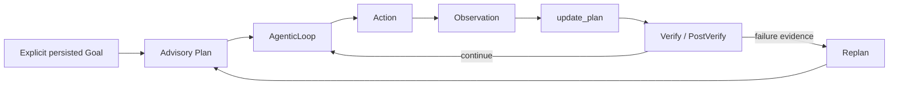
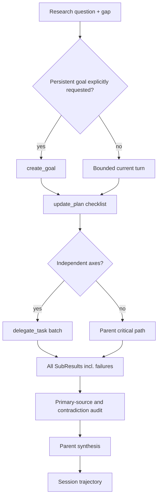
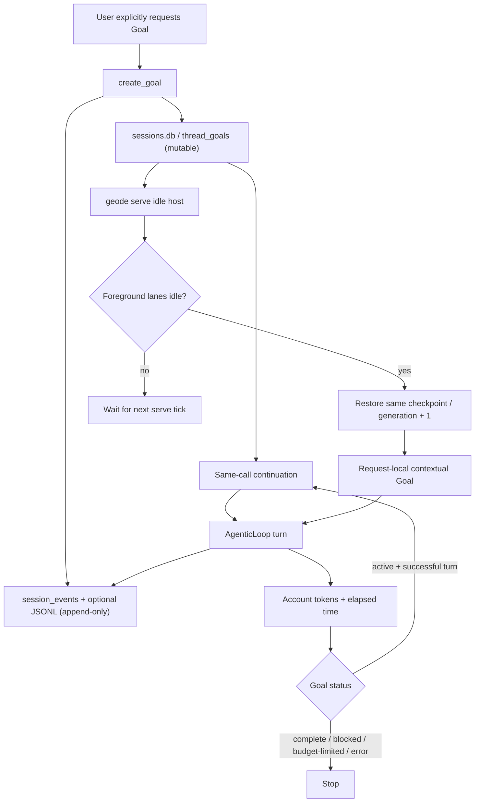

# Stanford Part 5 정렬 — advisory plan과 deep research

작성: 2026-08-10
상태: v1.0.18 baseline + Goal/DeepResearch 후속 구현 SOT
개념·방법론 기준: Stanford CS329A Part 5, *Planning and Multi-Step Reasoning*
코드 기준: Codex `main@50ef7395faee1d0e2d01730f9636aa06091c7be3`

## 1. 판정

GEODE를 자동 Plan-and-Execute나 LATS 엔진으로 표현하지 않는다. 현재의
정확한 계약은 다음과 같다.

`PlanStep.tool_name`과 `tool_args`는 실행 명령이 아니다. 모델에게 현재
단계를 보여주는 advisory metadata이고, 실제 action은 AgenticLoop가
선택·실행한다. `update_plan`은 관측된 완료만 기록한다.

여기서 Goal도 plan executor가 아니다. Codex의 Goal과 같이 명시적
objective를 여러 turn에 걸쳐 보존하고 사용량을 계량하며, 성공한 turn이
끝나도 목표가 active이면 다음 turn을 여는 **turn persistence envelope**다.
GEODE의 기존 `CognitiveState.goal`은 첫 입력을 기억하는 관측 필드이므로
이 계약과 동일시하지 않는다.

## 2. 근거의 층위

| 구분 | 근거 | 적용 |
|---|---|---|
| 강의 직접 근거 | Part 5의 LATS, SPRINT, SWiRL | search·parallel subplan·trajectory learning을 분리 |
| 코드 직접 근거 | Codex `update_plan`, multi-agent handlers, rollout trace | checklist는 실행기가 아니며 독립 side task만 위임 |
| GEODE 직접 근거 | `AgenticLoop`, `Plan`, `delegate_task`, `SessionTimeline` | 기존 primitive를 조합하고 새 엔진은 만들지 않음 |
| 설계 해석 | deep research를 bounded parallel collection으로 구성 | 부모가 critical path·검증·종합을 소유 |

참조:

- Stanford 강의 스캐폴드: `${HOME}/workspace/lg-ai/.agents/skills/apply-self-improving-agent-systems/references/lecture-05-planning-multistep.md`
- [Stanford Part 5 원본](https://www.youtube.com/watch?v=Ml_fp9XkB8Y&list=PLangBM27OtEA&index=5)
- 원본 자막: `${HOME}/workspace/lg-ai/presentation/source/video/Ml_fp9XkB8Y/Ml_fp9XkB8Y.en-j3PyPqV-e1s.vtt`
- [LATS](https://arxiv.org/abs/2310.04406)
- [SPRINT](https://arxiv.org/abs/2506.05745)
- [SWiRL](https://arxiv.org/abs/2504.04736)
- Codex checklist: `${HOME}/workspace/codex/codex-rs/protocol/src/plan_tool.rs`
- Codex delegation policy: `${HOME}/workspace/codex/codex-rs/core/src/tools/handlers/multi_agents_spec.rs`
- Codex rollout edges: `${HOME}/workspace/codex/codex-rs/rollout-trace/src/reducer/tool/agents.rs`
- Codex Goal contract: `${HOME}/workspace/codex/codex-rs/ext/goal/src/spec.rs`
- Codex Goal idle continuation: `${HOME}/workspace/codex/codex-rs/ext/goal/src/extension.rs`

## 3. Part 5 적용 경계

### LATS — 보류

LATS는 대안 action trajectory를 탐색하고 evaluator로 비교한다. GEODE의
파일·shell·외부 도구는 공유 상태와 비가역 부작용을 가질 수 있으며,
현재 일반적인 state clone/rollback 계약이 없다. 따라서 tree search를
추가하면 서로 다른 branch가 같은 환경을 오염시킬 수 있다.

추가 조건은 세 가지다: 복제 가능한 환경 상태, branch별 부작용 격리,
branch를 비교할 신뢰 가능한 verifier. 측정된 수요가 생기기 전에는
구현하지 않는다.

### SPRINT — 채택

독립적인 research axis만 하나의 `delegate_task` batch로 병렬 실행한다.
선행조건이 있거나 쓰기 범위가 겹치는 일, 최종 근거 판정과 종합은
부모가 유지한다.

### SWiRL — 데이터 계약만 채택

학습 루프 자체를 추가하지 않는다. 대신 plan ID·revision·progress,
child 시작/종료, tool action/observation, verify/replan을 같은 session
trajectory에 남겨 추후 step-wise reward와 preference projection의 입력을
보존한다.

## 4. Codex 수렴 형태

Codex의 강점은 별도 deep-research 클래스가 아니라 조합이다. GEODE도
동일하게 기존 checklist, bounded child collaboration, parent synthesis,
typed trajectory를 재사용한다.

짧은 독립 축은 동기식 `delegate_task` batch로 회수한다. 실행 중 steering,
mailbox, wait, follow-up이 필요한 축만 durable `spawn_agent`를 사용한다.
둘 다 depth 1이며, 재귀 research tree는 만들지 않는다.

## 5. Goal 제어·저장 계약

- `create_goal`, `get_goal`, `update_goal`은 Codex와 같은 모델 표면이다.
- 모델은 `complete|blocked`만 확정할 수 있다. budget-limit은 runtime이
  계산한다.
- `blocked|budget_limited|complete`는 이번 계약의 정지 상태다. 사용자가
  다시 명시적으로 `create_goal`을 요청하면 새 goal ID와 예산으로 재시작한다.
- objective 원문은 mutable goal row에만 둔다. trajectory event에는
  `goal_id`, 상태, 사용량, objective digest만 남겨 중복·노출을 줄인다.
- 자동 continuation은 성공 terminal 뒤에만 발생한다. 취소·인프라 오류·
  외부 검증 대기는 계속하지 않고 active 상태를 보존한다.
- continuation 지시는 system prompt나 가짜 인간 transcript가 아니라 Codex와
  같은 request-local contextual-user 입력이다. 동일한 text-only 응답이 반복되거나
  한 번의 public call에서 32회에 도달하면 자동 진행만 멈추고 Goal은 active로 둔다.
- token budget은 hard per-call cap이 아니라 완료된 turn의 input+output 사용량을
  정산해 **다음 continuation을 막는 경계**다. 따라서 마지막 turn만큼 초과할 수
  있으며 `tokens_used`에는 초과분도 숨기지 않고 기록한다.
- `geode serve`가 실행 중이고 foreground Lane이 비어 있으면 가장 오래 기다린
  active Goal 하나를 찾는다. ACTIVE checkpoint만 같은 `session_id`와 새
  `session_generation`으로 복원하며, PAUSED·terminal·missing/corrupt checkpoint는
  실행하지 않는다.
- 한 프로세스는 정상 반환된 같은 Goal projection을 한 번만 admission한다. Goal
  상태나 accounting이 바뀌기 전에는 반복하지 않되, setup/실행 예외는 host의
  1초 tick보다 빠르지 않게 재시도한다. daemon 재시작 시에는 persisted Goal과
  checkpoint에서 다시 발견할 수 있다.
- hosted continuation도 별도 executor가 아니다. 동일한 `_arun_once()`로 들어가
  기존 tool loop, PostVerify revision, verify-fail replan, usage/evidence/session
  event writer를 그대로 통과한다. admission마다 `SessionMetrics`를 새 scope로
  격리해 다른 Goal의 budget·plan·verify 상태를 물려받지 않는다.
- IPC와 gateway foreground도 checkpoint `session_id`를 Lane key로 사용한다.
  IPC resume는 target을 고른 뒤 같은 Lane 안에서 checkpoint를 다시 읽으므로,
  같은 machine의 사용자 turn과 hosted continuation은 직렬화된다. `--continue`
  후보가 Lane 대기 중 terminal이 되면 재개하지 않고, 명시적 resume-by-id만
  기존의 의도된 reopen edge를 유지한다.
- SIGTERM 뒤에는 새 admission을 멈추고 진행 중인 hosted turn을 기존 30초
  session drain 한도 안에서 기다린다. 한도를 넘으면 task를 취소하고 Lane을
  해제하며, exactly-once side effect는 여전히 약속하지 않는다.
- unattended 결과는 별도 inbox에 복제하거나 임의 채널로 push하지 않는다. 같은
  checkpoint와 session record에 남고, 다음 gateway turn은 timestamp로 최신
  history를 고르되 동률이면 durable checkpoint를 우선해 그 결과를 이어받는다.

DeepResearch의 자식 성공은 프로세스 종료만으로 판정하지 않는다. built-in
role의 출력 schema가 `validated=false`이면 `SubResult.success=false`이며 batch
요약의 `succeeded`와 SubagentStop 상태도 실패로 수렴한다. 실패 payload와 raw
excerpt는 부모가 gap으로 종합할 수 있도록 그대로 보존한다.

Codex는 app-level Goal extension이 thread start/resume/idle/stop 이벤트에
기여하고 `ThreadManager.try_start_turn_if_idle()`로 같은 thread를 다시 연다.
GEODE는 일반 ThreadManager를 만들지 않는다. 이미 실행 중인 `geode serve`의
tick과 `SessionCheckpoint`, `LaneQueue`만 조합하며, explicit active Goal이
authorization이다. OS가 종료된 daemon을 깨우지 않고, cross-process lease나
외부 side effect의 exactly-once도 약속하지 않는다.

## 6. GAP과 조치

| GAP | 심각도 | 조치 | 완료 조건 |
|---|---:|---|---|
| `PlanMode`가 executor 없이 completed를 생성 | P0 | 실행 메서드와 auto-execute 설정 삭제 | 승인 결과가 `executed=false` |
| advisory Plan의 stable identity 부재 | P1 | `plan_id`를 revision 전반에 보존 | create→progress→replan join 가능 |
| plan edge가 session trajectory에서 뭉개짐 | P1 | typed plan lifecycle events 추가 | SQLite 정본과 run의 optional JSONL projection에 동일 적재 |
| deep-research skill의 `web_search` 오배선 | P1 | canonical tools와 parent/child 계약으로 교체 | skill tool resolution 통과 |
| 출처 수를 사실성으로 오인 | P1 | entailment·authority·freshness·conflict audit | 결과가 fact/inference/gap 구분 |
| `CognitiveState.goal`을 지속 Goal로 오인 | P0 | 별도 `thread_goals` projection과 명시적 tools | multi-turn 상태·예산·종료가 SQLite에 유지 |
| 일반 research가 무기한 Goal로 승격 | P0 | explicit-create-only 정책 | ordinary deep research는 bounded turn 유지 |
| durable collaboration 도구가 deep-research skill에서 미노출 | P1 | spawn/mailbox/wait/follow-up을 선택 노출 | 장기 child를 실행 중 steering 가능 |
| role schema 실패가 `SubResult.success=true`로 집계 | P0 | parse-site에서 semantic failure로 승격 | batch summary와 terminal hook이 실패를 보고 |
| active Goal이 daemon restart 뒤 실행 소유자를 잃음 | P0 | GOAL-001 / R6.8 serve-owned idle continuation | checkpoint restore·single-process dedup·foreground Lane E2E |
| Codex식 Goal pause/resume·usage-limit 표면 부재 | P2 | 이번 범위에서 보류 | 운영 수요와 별도 권한 정책이 측정될 때 추가 |
| Goal token budget의 turn-granular 초과 | P2 | 사용량과 초과분을 그대로 기록하고 다음 turn 차단 | provider 취소·예약 API가 안정화되면 hard cap 검토 |

계획 본문은 `plan.created`와 `plan.replanned`에만 저장한다. 진행 이벤트는
delta step ID만 남겨 중복을 피한다. 공개 eval-artifact의 digest 투영은
계획 본문을 SHA-256으로 치환하고 plan ID·revision·진행 상태만 공개한다.

## 7. 비목표

- `TaskGraph`와 advisory `Plan` 통합
- 자동 DAG executor
- LATS/MCTS, branch state cloning, 신규 reward model
- 연구 결과의 자동 memory/file 저장
- OS-level background wake-up, cross-process Goal lease, 일반 요청의 자동 Goal 승격

이 항목들은 현재 요청을 해결하지 않거나 부작용 계약 없이 위험하다.
향후 실제 branch search 수요와 replay 가능한 sandbox가 측정될 때 별도
프로그램으로 연다.

## 8. 행동 검증과 공개 증거

| 실행 | 결과 | 발견·조치 |
|---|---|---|
| Goal E2E #3, Luna/max | 실패 | system hint만으로는 모델이 `awaiting continuation`을 반복했다. 7 turn 뒤 50,000 budget을 54,047로 초과해 멈췄다. |
| Goal E2E #4, Luna/max | 통과 | contextual-user steering으로 변경 후 2 turn에서 create→continue→complete, 18,546 tokens. |
| DeepResearch E2E #1, Luna/max | 부분 실패 | invalid role output이 `success=true`, batch `2/2`로 집계되는 거짓 성공을 발견했다. |
| DeepResearch E2E #2, Luna/max | 통과 | 동일 2축 batch가 `1/2`; validated success와 schema failure를 분리하고 부모가 gap을 보존했다. 일반 research의 Goal row는 0건이었다. |
| Hosted Goal restart E2E, deterministic | 통과 | persisted Goal/checkpoint를 새 host가 복원하고 `serve_idle` 내부 turn으로 재진입; 동일 projection 재입장, foreground Lane 충돌, missing/corrupt/terminal checkpoint를 차단했다. |
| GPT-5.6-sol 독립 검토(high→medium) | 7건 수정 | session metrics 격리, Lane 내부 resume reload, bounded shutdown drain, transient retry, gateway history limit, false-completion log를 보강했다. 후속 검토가 `--continue` 후보의 Lane 대기 중 terminal 전이 race를 추가로 찾아 재개 거부 guard로 닫았다. 명시적 `gpt-5.6` MCP는 구독 모델명 제한, MCP max/high는 300초 timeout이어서 로컬 subscription CLI로 검토했다. |

최종 비-live 회귀는 `10,377 passed, 22 skipped, 2 deselected`다. 공개
trajectory는 원문을 digest로 치환한 2개 파일, 38 events, 4/4 paired tool
calls이며 scope 2/2, secret/identity scan 0건이다. eval-artifact
[#16](https://github.com/mangowhoiscloud/geode-eval-artifacts/pull/16)은
[`abad7de`](https://github.com/mangowhoiscloud/geode-eval-artifacts/commit/abad7de44a23cd0756fe1edb5b61a86ed715cc8f)에 병합했고, manifest SHA-256
`a19174d30764118475ec713ba63dc5eb230997259e210beb1ba367040ae493c5`를
원격 병합본에서 다시 검증했다.
