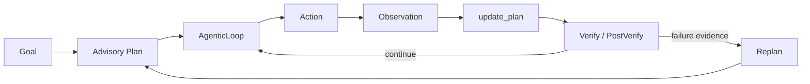
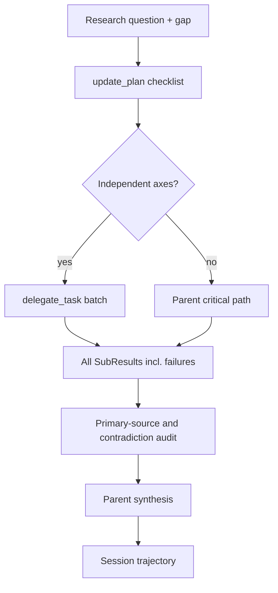

# Stanford Part 5 정렬 — advisory plan과 deep research

작성: 2026-08-10
상태: PR #2925 구현 SOT
개념·방법론 기준: Stanford CS329A Part 5, *Planning and Multi-Step Reasoning*
코드 기준: Codex `main@646f7c0a91b8e327d263335da68ae8ef212895ce`

## 1. 판정

GEODE를 자동 Plan-and-Execute나 LATS 엔진으로 표현하지 않는다. 현재의
정확한 계약은 다음과 같다.

`PlanStep.tool_name`과 `tool_args`는 실행 명령이 아니다. 모델에게 현재
단계를 보여주는 advisory metadata이고, 실제 action은 AgenticLoop가
선택·실행한다. `update_plan`은 관측된 완료만 기록한다.

## 2. 근거의 층위

| 구분 | 근거 | 적용 |
|---|---|---|
| 강의 직접 근거 | Part 5의 LATS, SPRINT, SWiRL | search·parallel subplan·trajectory learning을 분리 |
| 코드 직접 근거 | Codex `update_plan`, multi-agent handlers, rollout trace | checklist는 실행기가 아니며 독립 side task만 위임 |
| GEODE 직접 근거 | `AgenticLoop`, `Plan`, `delegate_task`, `SessionTimeline` | 기존 primitive를 조합하고 새 엔진은 만들지 않음 |
| 설계 해석 | deep research를 bounded parallel collection으로 구성 | 부모가 critical path·검증·종합을 소유 |

참조:

- Stanford 강의 스캐폴드: `/Users/mango/workspace/lg-ai/.agents/skills/apply-self-improving-agent-systems/references/lecture-05-planning-multistep.md`
- 원본 자막: `/Users/mango/workspace/lg-ai/presentation/source/video/Ml_fp9XkB8Y/Ml_fp9XkB8Y.en-j3PyPqV-e1s.vtt`
- [LATS](https://arxiv.org/abs/2310.04406)
- [SPRINT](https://arxiv.org/abs/2506.05745)
- [SWiRL](https://arxiv.org/abs/2504.04736)
- Codex checklist: `/Users/mango/workspace/codex/codex-rs/protocol/src/plan_tool.rs`
- Codex delegation policy: `/Users/mango/workspace/codex/codex-rs/core/src/tools/handlers/multi_agents_spec.rs`
- Codex rollout edges: `/Users/mango/workspace/codex/codex-rs/rollout-trace/src/reducer/tool/agents.rs`

## 3. Part 5 적용 경계

### LATS — 보류

LATS는 대안 action trajectory를 탐색하고 evaluator로 비교한다. GEODE의
파일·shell·외부 도구는 공유 상태와 비가역 부작용을 가질 수 있으며,
현재 일반적인 state clone/rollback 계약이 없다. 따라서 tree search를
추가하면 서로 다른 branch가 같은 환경을 오염시킬 수 있다.

추가 조건은 세 가지다: 복제 가능한 환경 상태, branch별 부작용 격리,
branch를 비교할 신뢰 가능한 verifier. 측정된 수요가 생기기 전에는
구현하지 않는다.

### SPRINT — 채택

독립적인 research axis만 하나의 `delegate_task` batch로 병렬 실행한다.
선행조건이 있거나 쓰기 범위가 겹치는 일, 최종 근거 판정과 종합은
부모가 유지한다.

### SWiRL — 데이터 계약만 채택

학습 루프 자체를 추가하지 않는다. 대신 plan ID·revision·progress,
child 시작/종료, tool action/observation, verify/replan을 같은 session
trajectory에 남겨 추후 step-wise reward와 preference projection의 입력을
보존한다.

## 4. Codex 수렴 형태

Codex의 강점은 별도 deep-research 클래스가 아니라 조합이다. GEODE도
동일하게 기존 checklist, bounded child collaboration, parent synthesis,
typed trajectory를 재사용한다.

## 5. GAP과 조치

| GAP | 심각도 | 조치 | 완료 조건 |
|---|---:|---|---|
| `PlanMode`가 executor 없이 completed를 생성 | P0 | 실행 메서드와 auto-execute 설정 삭제 | 승인 결과가 `executed=false` |
| advisory Plan의 stable identity 부재 | P1 | `plan_id`를 revision 전반에 보존 | create→progress→replan join 가능 |
| plan edge가 session trajectory에서 뭉개짐 | P1 | typed plan lifecycle events 추가 | SQLite 정본과 run의 optional JSONL projection에 동일 적재 |
| deep-research skill의 `web_search` 오배선 | P1 | canonical tools와 parent/child 계약으로 교체 | skill tool resolution 통과 |
| 출처 수를 사실성으로 오인 | P1 | entailment·authority·freshness·conflict audit | 결과가 fact/inference/gap 구분 |

계획 본문은 `plan.created`와 `plan.replanned`에만 저장한다. 진행 이벤트는
delta step ID만 남겨 중복을 피한다. 공개 eval-artifact의 digest 투영은
계획 본문을 SHA-256으로 치환하고 plan ID·revision·진행 상태만 공개한다.

## 6. 비목표

- `TaskGraph`와 advisory `Plan` 통합
- 자동 DAG executor
- LATS/MCTS, branch state cloning, 신규 reward model
- 연구 결과의 자동 memory/file 저장

이 항목들은 현재 요청을 해결하지 않거나 부작용 계약 없이 위험하다.
향후 실제 branch search 수요와 replay 가능한 sandbox가 측정될 때 별도
프로그램으로 연다.
