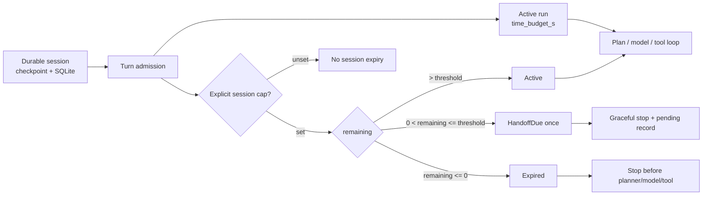

# Session budget boundary correction

Date: 2026-08-11
Branch: `codex/session-budget-boundary`
Base: `origin/develop@cb8182090`

## Research question

Why did an ordinary follow-up turn stop with this message?

```text
Session time budget is in the handoff window
(-79751s remaining of 7200s).
```

The question is split into three reproducible checks:

1. Can the exact negative value be produced from the budget helper?
2. Can one runtime session inherit another session's clock?
3. Is a two-hour durable-session expiry aligned with current frontier runtimes?

## Reproduction and root cause

The exact state was reproduced by starting a 7,200-second budget and moving its
monotonic start 86,951 seconds into the past:

```text
BudgetCheck(expired=True, handoff_due=True, remaining_seconds=-79751...)
```

Three independent defects combined:

| GAP | Code path | Effect |
|---|---|---|
| BUD-1 | `SessionMetrics.is_handoff_due()` accepted every value below the threshold | Negative remaining time latched a handoff |
| BUD-2 | `AgenticLoop` selected handoff before expiry | The wrong terminal and SQLite `pending` side effect won |
| BUD-3 | an unscoped `SessionMetrics` ContextVar was shared by sequential sessions in one task | Session A's clock could terminate session B |
| BUD-4 | unset or invalid env input silently became 7,200 seconds | Durable interactive sessions expired without operator intent |
| BUD-5 | the budget guard ran after decomposition | An already-expired turn could spend a planner call before stopping |

The displayed value itself is arithmetically valid: `7200 - 86951 = -79751`.
What was invalid was calling it a handoff window.

## Frontier grounding

Code was compared at the latest fetched revisions on 2026-08-11.

| Runtime | Durable lifetime | Active execution budget | Idle/provider boundary |
|---|---|---|---|
| Codex `origin/main@41ece455` | thread persists in JSONL/SQLite and can resume | no global two-hour thread expiry; command/tool cancellation is scoped | provider stream inactivity and idle thread unload are separate |
| OpenClaw `origin/main@eb289645` | session reset is policy-controlled, default none | run timeout is separate | model idle, client wait, cron timeout, and session idle reset are distinct |
| GEODE before this change | checkpoint/SQLite session could resume | per-run `time_budget_s` existed | an additional implicit two-hour session wall clock mixed lifetime with execution |
| GEODE after this change | resumable session is unbounded by default | existing per-run `time_budget_s`; optional explicit session cap | provider and gateway limits remain separate |

The earlier historical claim that Codex exposed a `--budget-seconds` session
flag is not present in the current source or history search. It is not used as
a design premise here.

Primary public context:

- [Introducing the Codex app](https://openai.com/index/introducing-the-codex-app/)
- [Work with Codex from anywhere](https://openai.com/index/work-with-codex-from-anywhere/)
- [Codex-maxxing for long-running work](https://openai.com/index/codex-maxxing-long-running-work/)

## Corrected contract



Invariants:

- `Expired` and `HandoffDue` cannot both be true.
- A ContextVar propagates a binding; it does not own a logical session.
- Each ordinary `AgenticLoop` owns its metrics and rebinds them at turn start.
  The explicit autoresearch `gen_tag` scope remains an intentional aggregate.
- Checkpoint resume with a different session identity receives fresh monotonic
  metrics. Monotonic timestamps are never persisted across processes.
- `GEODE_SESSION_TIME_BUDGET_S` is opt-in. Unset, invalid, zero, and negative
  values, including `NaN` and infinity, leave the cap disabled. For caps below
  20 minutes, the handoff window is clamped to half the cap so admission does
  not immediately stop.
- The existing per-run `time_budget_s` remains the normal execution bound.

## Implementation and Action E2E

The implementation deliberately reuses `SessionMetrics` and the existing
guard. It adds no deadline store, lease, watcher, or new budget abstraction.

| Check | Expected evidence |
|---|---|
| Expired boundary | `expired=True`, `handoff_due=False`, latch untouched |
| Valid handoff window | positive remaining time, one-shot handoff |
| Session A then B | distinct metrics; B executes a fake tool once |
| Expired A turn | planner, model, tool, handoff persistence all zero |
| Resume identity change | fresh metrics with no inherited monotonic clock |
| Default policy | no env means no session cap |

## Non-goals

- Persisting a monotonic deadline across restart.
- Building an automatic handoff successor; current handoff remains a graceful
  stop plus a pending record for manual continuation.
- Adding cancellation leases or a second run-budget type.
- Changing the explicit Goal token-budget contract.

Those features require separate measured demand. They are not necessary to
correct this failure.

## Verification record

```text
Targeted budget / AgenticLoop / lifecycle / SharedServices / Goal host: PASS
Action E2E (fake model, real ToolExecutor path): PASS
Ruff check + format: PASS
Mypy: 546 source files, PASS
Import contracts: 4 kept, 0 broken
Architecture baseline: PASS
Next.js static build: 237 pages, PASS
Pytest non-live: 10,388 passed, 22 skipped, 2 deselected
```

No subscription or paid live-model test was required for this deterministic
clock/ownership defect. The Action E2E mocks model output and exercises the
real loop-to-tool execution path without network access.
