# 리더보드 정렬형 agent benchmark 실행 계획

> **Historical design evidence.** 현재 실행 순서·게이트·상태는
> [`2026-08-13-sequential-agent-benchmark-plan.md`](../eval/2026-08-13-sequential-agent-benchmark-plan.md)가
> 소유한다. 이 문서는 당시의 모델·리더보드 정렬 근거로 보존한다.

작성일: 2026-08-12  
기준 코드: GEODE `origin/develop@249cd16c2`  
상태: 실행 전 계약 확정. 유료·구독 호출은 아직 시작하지 않음.

## 1. 결론

이번 출판 사이클은 새 하네스를 만들지 않는다. 현재 GEODE가 이미 가진
MCPMark와 tau 어댑터를 다음 두 publication lane으로 사용한다.

1. **MCPMark Verified**: GPT-5.5 xhigh, standard 127 tasks, 3회 반복.
2. **tau text leaderboard**: GPT-5.6-sol xhigh, Airline/Retail/Telecom/
   Banking Knowledge 전체, task당 4회 반복.

두 결과를 하나의 종합 점수로 합치지 않는다. MCPMark는 실제 MCP 상태 변경,
tau는 사용자 simulator와 공유 환경 안에서의 대화형 정책 준수를 측정한다.

`Tau3 Banking`은 별도 하네스가 아니다. 현재 `tau2-bench==1.0.1`의
`banking_knowledge` domain이며, 논문상의 이름은 tau-Knowledge의
tau-Banking이다. 따라서 `tau3_*` 어댑터를 새로 만드는 일은 중복이다.

## 2. 연구 질문과 판정 단위

주 질문은 다음과 같다.

> 동일한 공개 task와 verifier를 사용할 때 GEODE scaffold가 최신 subscription
> model의 상태 변경 정확도, 대화 정책 준수, 반복 안정성에 어떤 영향을 주는가?

결과의 비교 등급은 기존
[`agent-world-comparison-contract.md`](../eval/agent-world-comparison-contract.md)를
그대로 따른다.

| 등급 | 필요한 동일성 | 이번 사이클 |
|---|---|---|
| direct | suite/version/tasks/model route/user/budget/repetition/evaluator 모두 동일 | 현재 0개; 공통 budget controller가 필요 |
| suite-headline | 공식 suite와 verifier는 같지만 runtime 또는 route가 다름 | 외부 리더보드와 GEODE의 기본 비교 |
| directional | domain 또는 모델 중 일부만 일치 | tau base의 타 모델 행, Agent-World |
| smoke | 일부 task만 실행 | 승격 전 진단 전용 |

공개 리더보드의 숫자를 GEODE의 causal baseline으로 부르지 않는다. 현재 공개
자료만으로 GEODE subscription route와 외부 제출자의 route, hidden defaults,
실패 재시도 조건까지 같다고 증명할 수 없기 때문이다.

## 3. 고정할 upstream

| Suite | Pin | 표준 집합 |
|---|---|---|
| tau | `sierra-research/tau2-bench@668d3bcd135c02aa3438f987ef45735b7c163ee3`, package `1.0.1` | base split: Airline 50, Retail 114, Telecom 114, Banking 97 |
| MCPMark | `eval-sys/mcpmark@cd45b7f57923b9b3985467f5139927575f83141c` | Verified standard 127 |
| BFCL V4 | `ShishirPatil/gorilla@6ea57973c7a6097fd7c5915698c54c17c5b1b6c8` | 후속 native-function-calling 진단 |

tau `1.0.1`은 Banking grading을 변경했다. 그보다 오래된 Banking 결과는
재채점 전에는 비교하지 않는다. Airline/Retail/Telecom은 이 grading 변경의
영향을 받지 않는다.

## 4. 비교군

### 4.1 tau 공식 text leaderboard

모든 값은 pass^1 / pass^4(%), base split, 4 trials이다.

| 비교군 | Airline | Retail | Telecom | Banking AllTools | 용도 |
|---|---:|---:|---:|---:|---|
| GPT-5.2 high | 83.00 / 72.00 | 81.58 / 51.75 | 89.69 / 71.93 | 32.22 / 18.56 | base 3-domain anchor |
| GPT-5.4 xhigh | - | - | - | 39.43 / 21.65 | GEODE 과거 모델 bridge |
| GPT-5.5 xhigh | - | - | - | 44.59 / 29.90 | 현재 default 계열 anchor |
| GPT-5.6-sol xhigh | - | - | - | 46.91 / 27.84 | 이번 Banking same-model anchor |
| Qwen 3.8 Max xhigh | - | - | - | 55.15 / 35.05 | 현재 Banking frontier reference |

GPT-5.6-sol의 base 3-domain 공식 행은 없다. 이번 GEODE 네 domain run은
리더보드에 `custom` scaffold로 제출할 수 있지만, base 3-domain에서는
GPT-5.2 행과 directional 비교만 가능하다. Banking은 모델 이름과 effort,
task, user model, retrieval을 맞추되 runtime과 route가 달라 suite-headline
비교다.

### 4.2 MCPMark Verified

공개 model card가 보고한 평가 조건은 100-step tool-call budget, step당 32K
tokens, 3-run average다. 다만 현재 GEODE와 Codex subscription adapter는 이
두 제한을 같은 의미로 강제하지 못하므로, 아래 외부 행은 suite-headline
비교군이지 direct baseline이 아니다.

| 비교군 | Verified score | Harness |
|---|---:|---|
| GPT-5.5 xhigh | 92.9 | Codex |
| Kimi K2.7 Code | 81.1 | Kimi Code CLI |
| Claude Opus 4.8 xhigh | 76.4 | Claude Code |

GEODE full run은 GPT-5.5 xhigh를 사용해 모델 축을 맞춘다. 그러나 runtime이
다르므로 92.9와의 차이는 GEODE scaffold 효과만을 뜻하지 않는다. 별도로
Filesystem 30 tasks를 GEODE/Codex 양쪽에서 같은 pin과 verifier로 3회 실행해
paired-task 진단을 만든다. 공통 budget controller가 생기기 전에는 이 결과도
direct가 아니라 directional 비교로 표기한다.

## 5. 정확한 실행 명세

### 5.1 tau publication arm

| 축 | 고정값 |
|---|---|
| agent | `geode_agent`, GPT-5.6-sol, OpenAI subscription, xhigh |
| user | upstream `user_simulator`, GPT-5.2, low |
| domains | `airline`, `retail`, `telecom`, `banking_knowledge` |
| split/count | `base`, 50/114/114/97, 누락 없음 |
| trials | task당 4 |
| seed | 300; upstream-derived trial seeds `626729, 373753, 361454, 1567` |
| dialogue envelope | `max_steps=200`, `max_errors=10` |
| retries | GEODE strict arm은 0; infra 실패는 같은 run 안에서 덮지 않고 새 attempt로 재실행 |
| concurrency | 1; 처리량 설정이며 점수 의미를 바꾸지 않음 |
| Banking retrieval | `alltools` = BM25 + OpenAI dense retrieval + read-only sandbox shell |
| output | native tau Results + GEODE trajectory snapshot + runtime manifest + native receipt |
| metrics | domain별 pass^1, pass^2, pass^3, pass^4, cost/latency/token 분포 |

총 측정량은 `375 tasks * 4 = 1,500 simulations`이다. agent subscription만으로
완결되지 않는다. GPT-5.2 native user simulator와 AllTools의 OpenAI embedding은
API credential과 사용량 과금이 필요하다. `geode_user` 또는 BM25-only로 바꾼
run은 유용한 제품 진단이지만 공식 비교 arm과 섞지 않는다.

GEODE contract는 재현성을 위해 upstream task 목록을 읽어 그 전체 ordered ID를
고정한다. upstream 문서는 누락 방지를 위해 task filter 생략을 권장하지만,
GEODE는 pinned SHA의 전체 목록과 count가 정확히 일치하는지를 admission에서
검증한다. 제출에는 `omitted_questions=false`와 그 검증 digest를 함께 남긴다.

제출 metadata는 다음과 같이 표기한다.

- `submission_type=custom`
- `methodology.verification.modified_prompts=true`
- `tau2_bench_version=1.0.1`
- `user_simulator=gpt-5.2`, `reasoning_effort=low`
- `banking_knowledge.retrieval_config=alltools`
- GEODE git SHA, system prompt hash, contract digest, artifact release URL

### 5.2 MCPMark publication arm

| 축 | 고정값 |
|---|---|
| agent | `geode`, GPT-5.5, OpenAI subscription, xhigh |
| suite | `standard` / Verified |
| services | Filesystem 30, GitHub 23, Notion 28, Playwright 4, WebArena 21, Postgres 21 |
| repetitions | `k=3` |
| budget | 현재 진단 arm은 양쪽 runtime-native termination + 3,600s task timeout; round/output-token 수는 관측값으로 기록 |
| compaction | disabled (`999999999`) |
| metrics | per-run pass@1, pass@3, pass^3, avg@3, service breakdown, token/cost/latency |
| output | native JSON/CSV + verifier output + GEODE trajectory sidecar + release manifest |

총 측정량은 `127 tasks * 3 = 381 executions`이다. `easy` 50 tasks,
Insforge, Supabase는 Verified 127 headline에 넣지 않는다. 이전 MCPMark task
version의 점수도 함께 집계하지 않는다.

#### 로컬 우선 arm: non-WebArena 106/127

현재 로컬 용량에서는 WebArena 21건만 제외하고 Filesystem 30, GitHub 23,
Notion 28, Playwright standard 4, Postgres 21의 106건을 실행한다. 공개 표기명은
반드시 **`MCPMark Verified (non-WebArena, 106/127)`**로 한다.

- 1차: GEODE GPT-5.5 xhigh, Core-106, `k=1`
- 2차: GEODE와 Codex의 Filesystem 30, `k=3` paired control
- 3차: 1차가 infra-clean이면 GEODE Core-106, `k=3`
- 보고: Core-106 전체와 서비스별 pass@1/pass@3/pass^3를 함께 제시

공식 GPT-5.5 92.9는 WebArena를 포함한 127건 3-run 평균이므로 Core-106의
직접 baseline이 아니다. 외부 task-level 결과가 공개돼 동일 106건을 다시
집계할 수 있으면 task-set-aligned suite-headline 비교는 가능하지만, runtime,
route, budget까지 같아지지 않으므로 direct로 승격하지 않는다. 공개 127점에서
21건을 임의로 빼거나 Core-106 점수에 WebArena 추정치를 보충하지 않는다.

Core-106에서 성공한 task 수를 `S106`이라 하면 full-127 점수의 가능한 범위만
다음처럼 보조적으로 표시할 수 있다.

```text
[S106 / 127, (S106 + 21) / 127]
```

이 범위는 점수 추정치나 promotion authority가 아니다.

Verified server pins는 다음과 같이 유지한다.

- Filesystem `@modelcontextprotocol/server-filesystem@2025.12.18`
- GitHub `ghcr.io/github/github-mcp-server:v0.15.0`
- Notion `@notionhq/notion-mcp-server@1.9.1`
- Playwright `@playwright/mcp@0.0.68`
- Postgres `postgres-mcp==0.3.0`

현재 GEODE MCPMark arm은 `max_tokens=32768`을 요청 객체에 담지만 OpenAI
subscription backend는 `max_output_tokens`를 받으면 400을 반환하므로 adapter가
그 필드를 보내지 않는다. 즉 32K는 server-side 강제값이 아니다. 또한
`AgenticLoop(max_rounds=100)`은 마지막 두 round에서 tool use를 막으므로 공개
하네스의 100-step 조건과 같지 않다. 이 비대칭 cap은 적용하지 않는다. 각 arm의
실제 model rounds, tool calls, output/reasoning tokens를 artifact에 남기고 공통
controller가 구현되기 전 결과는 진단용으로만 사용한다.

### 5.3 paired Filesystem control

Filesystem standard 30 tasks에 한해 `agent=geode`와 `agent=codex`를 같은
GPT-5.5 xhigh, same pin, k=3로 실행한다. task order와 initial state digest를
같게 하고 verifier 결과를 paired task ID로 join한다. Codex adapter는 현재
Filesystem만 지원하므로 이를 full-MCPMark Codex 결과로 확대 해석하지 않는다.
두 runtime의 종료·출력 제한이 같지 않으므로 `paired-task directional`로
표기한다. 100 step을 넘은 execution도 사후 제외하지 않고 그대로 보존한다.
성과에 따라 표본을 제외하면 비교가 편향되기 때문이다.

## 6. 도구 선택

| 도구 | 채택 여부 | 이유 |
|---|---|---|
| native tau runner/evaluator/submit validator | 필수 | 공식 trajectory와 pass^k의 authority |
| native MCPMark pipeline/verifier/aggregator | 필수 | Verified state reset과 pass@k/pass^k authority |
| GEODE benchmark adapters | 필수 | subscription route와 runtime trajectory 수집 |
| eval-artifact release | 필수 | immutable manifest, checksums, native receipts 공개 |
| Inspect Evals tau2 | 후속 replication | 다른 orchestration에서의 독립 재현; 공식 headline 대체 불가 |
| BFCL V4 | Phase 2 | function selection/multi-turn 진단. 현재 GEODE adapter가 없어 이번 출판 blocker가 아님 |
| Petri / inspect_ai safety | 별도 lane | safety simulation이며 task success leaderboard와 합산 금지 |

## 7. 승격 순서와 중단 조건

```mermaid
flowchart LR
    A["Freeze upstream pins and run contract"] --> B["No-cost auth, task-count, verifier preflight"]
    B --> C["One task per domain or service"]
    C --> D["Known regression pack / MCP easy"]
    D --> E["Full k=1 or one tau trial"]
    E --> F["Promote: MCP k=3 / tau 4 trials"]
    F --> G["Native validation and re-grading"]
    G --> H["Immutable eval-artifact release"]
    H --> I["Custom leaderboard submission"]
```



다음 중 하나가 발생하면 그 즉시 측정을 멈춘다.

- model/effort/provider fallback 또는 다른 route가 기록됨
- task count/order/split, upstream SHA, evaluator digest 불일치
- empty model output, orphan tool call, state reset 또는 verifier 실패
- output replay/compaction 등 frozen runtime policy가 중간에 변경됨
- Tau Banking `1.0.1` 이전 결과가 fresh-task 재채점 없이 혼입됨
- direct 비교를 요청했지만 양쪽에 같은 step/output budget이 강제되지 않음
- native result, trajectory, receipt의 run/task identity가 서로 결합되지 않음

실패 run은 점수 분모에서 조용히 삭제하지 않는다. infra-invalid attempt와
performance failure를 분리하고, 새 attempt는 부모 attempt ID와 원인을 남긴다.

## 8. 현재 blocker와 실행 장소

1. 로컬 볼륨은 228 GiB 중 17 GiB만 남아 있다. WebArena의 세 이미지가
   약 119 GiB이므로 full MCPMark Verified는 이 머신에서 실행하지 않는다.
   200 GiB 이상 여유가 있는 외장 볼륨 또는 Linux VM을 사용한다.
2. Notion/GitHub/Playwright/Postgres credential과 초기 state reset을 서비스별로
   preflight해야 한다.
3. tau native GPT-5.2 user와 Banking AllTools embedding에는 PAYG key가 필요하다.
4. 공개 외부 행 가운데 GEODE와 모든 축이 동일한 direct comparator는 0개다.
5. GEODE의 round cap은 종료 headroom을 포함하고 Codex adapter에는 대응 cap이
   없으며, subscription route는 per-call output cap을 받지 않는다. 공통 budget
   controller가 없으므로 paired Filesystem도 현재는 directional이다.

## 9. 산출물과 출판 규칙

기존 [`agent-world-run-manifest.template.json`](../eval/agent-world-run-manifest.template.json)
과 eval-artifact contract를 재사용한다. 새 manifest schema는 만들지 않는다.

각 release에는 최소 다음이 있어야 한다.

- exact git/upstream SHA와 dirty-tree 상태
- model/provider/source/effort, user simulator와 decoding args
- ordered tasks, trials, derived seeds, budget/retry/timeout 설정
- native raw results와 native validator output
- GEODE normalized trajectory와 verifier/evidence receipt
- token/cache/reasoning/cost/latency 집계와 failed-attempt lineage
- artifact별 SHA-256, release manifest, 생성 시각

공개 표는 suite별로 분리한다. tau는 domain별 pass^k, MCPMark는 전체와
service별 pass@1/pass@3/pass^3를 제시한다. 내부 convenience macro-average를
만들더라도 리더보드 점수로 부르거나 promotion authority로 쓰지 않는다.

## 10. 후속 구현 GAP

| GAP | 조치 | 시점 |
|---|---|---|
| MCPMark budget 의미가 runtime마다 다름 | 양쪽의 model-step/tool-call/output budget을 동일 지점에서 강제하는 controller를 추가하고 E2E로 증명 | direct 승격 전 |
| subscription output cap을 강제할 수 없음 | server-managed cap을 관측하고, 강제 가능한 동일 route가 확보되기 전 32K 정합성을 주장하지 않음 | 즉시 표기 교정 |
| tau diagnostic defaults가 20/1/0 | publication command와 contract에서 200/10/0을 명시 | run contract 생성 시 |
| task filter 생략 시 GEODE는 1건 선택 | pinned full ordered pack으로 count/digest 검증 | run contract 생성 시 |
| full MCPMark 로컬 disk 부족 | 외장 볼륨/VM 사용 | service preflight 전 |
| BFCL adapter 없음 | primary 두 suite가 출판된 뒤 필요성을 재평가 | Phase 2 |

## 11. 1차 실행 범위

아직 full run을 시작하지 않는다. 다음 순서에서 no-cost preflight가 모두
통과한 뒤에만 사용량을 발생시킨다.

1. exact upstream checkout, package/version, task counts, server pins 검증
2. credential 존재 여부만 확인하고 값은 출력하지 않음
3. tau mock와 각 domain 1 task, MCPMark 각 service 1 task의 run contract 생성
4. 사용자가 비용 경계를 승인하면 canary model calls 시작

### Primary sources

- [tau leaderboard submission guide](https://github.com/sierra-research/tau2-bench/blob/668d3bcd135c02aa3438f987ef45735b7c163ee3/docs/leaderboard-submission.md)
- [tau2-bench 1.0.1 repository](https://github.com/sierra-research/tau2-bench/tree/668d3bcd135c02aa3438f987ef45735b7c163ee3)
- [GPT-5.6-sol tau submission](https://github.com/sierra-research/tau2-bench/blob/668d3bcd135c02aa3438f987ef45735b7c163ee3/web/leaderboard/public/submissions/gpt-5-6-sol_sierra_2026-08-04/submission.json)
- [tau-Knowledge paper](https://arxiv.org/abs/2603.04370)
- [MCPMark Verified repository](https://github.com/eval-sys/mcpmark/tree/cd45b7f57923b9b3985467f5139927575f83141c)
- [MCPMark Verified stabilization PR](https://github.com/eval-sys/mcpmark/pull/264)
- [Kimi K2.7 Code model card and MCPMark protocol](https://huggingface.co/moonshotai/Kimi-K2.7-Code/blob/74797c9c62378b951a1f6fcf5c4631024e9b8bef/README.md)
- [BFCL V4 methodology](https://gorilla.cs.berkeley.edu/blogs/15_bfcl_v4_web_search.html)
