# Agent anti-pattern audit and slop reduction plan — 2026-08-19

> Status: **CLEANUP + VERIFICATION COMPLETE — commit/PR pending.**
>
> Planning base: `origin/develop@45aba3ca7ba18bf8d19839e42520b102f4b6669e`
>
> This document freezes the research, scope, and decision gates. It does not
> authorize deleting production code or tests merely because a heuristic flags
> them.
>
> Superseded note: the later
> [runtime evidence debt modernization plan](2026-08-19-runtime-evidence-debt-modernization.md#p1--retire-ineffective-count-ratchets)
> retires the count ratchet; the measurements and decisions below remain dated
> evidence, not current promotion instructions.

## Goal

Create one source-graded `agent-anti-pattern` skill, use it to audit every
tracked GEODE production/test file in the declared scope, and remove only code
or tests whose lack of contribution is demonstrated. Reuse the existing slop
scanner and growth ratchet; do not create a third static-analysis framework.

The desired outcome is not a smaller line count by itself. It is a smaller,
more legible agent runtime with fewer duplicate authorities, misleading test
seams, irrelevant capabilities, and false-success paths while preserving user
contracts, safety rails, evidence, and testable behavior.

## Socratic gate

| Question | Answer |
|---|---|
| Does this already exist? | **Partial.** `slop-audit`, `check_slop_ratchet.py`, `codebase-audit`, `anti-deception-checklist`, Ruff, mypy, deptry, and import-linter find candidates or prevent growth. None provides an agent-runtime-specific, source-graded proof protocol from candidate to `KEEP/SHRINK/DELETE`. |
| What breaks without it? | Existing heuristics can mislabel dynamic handlers, registry entrypoints, compatibility facades, and repeated protocol methods as dead or duplicated. Conversely, test-only production seams, correlated review, prompt-only enforcement, and context/tool pollution can remain invisible. |
| How is the effect measured? | Complete inventory coverage; findings with caller/authority/falsifier evidence; deleted or narrowed surfaces; preserved behavior and test invariants; no slop-ratchet growth; no reduced gate or hidden failure. |
| What is the simplest implementation? | One shared skill, one compact reference field guide, one symlink for Claude discovery, one scaffold test, and one audit report. No new scanner or schema until a repeated manual step proves it is needed. |
| Is the pattern grounded beyond one video? | Yes. Current public Claude/Claude Code documentation, Anthropic engineering reports, long-context research, and the established AntiPatterns refactoring model support the mechanisms. Exact numeric thresholds from the talk remain local hypotheses. |

## Research result

### Source authority

| Grade | Source class | Permitted use |
|---|---|---|
| A | Official product contract, source, or certification guide | Normative behavior and supported workflow |
| B | Peer-reviewed or primary empirical research | Mechanism and measured risk, within the paper's setup |
| C | Original conference talk or field case | Audit hypothesis that needs local evidence |
| D | Recap video or local heuristic scanner | Discovery lead only; never deletion proof |

Claims are graded per claim, not per document. A source may support one claim
strongly and another only heuristically.

### What the linked case establishes

The linked AgentOS video is a Korean recap of Frank Coyle's AI Engineer World's
Fair 2026 talk. Its anti-pattern taxonomy is a secondary interpretation; the
mechanisms below are independently grounded in public Anthropic documentation
and engineering reports:

1. drive an agentic loop from structured `stop_reason`, not parsed prose or an
   arbitrary iteration cap as the primary completion signal;
2. avoid ambiguous and excessive tool exposure; use role-scoped tools;
3. keep instructions and exploratory work scoped, including hierarchical
   project rules and isolated subagent/skill context;
4. review generated work in a separate instance without the producer's
   reasoning context, and split large reviews into focused plus integration
   passes;
5. invoke coding agents non-interactively in CI and use structured output;
6. use hooks or programmatic gates when compliance must be deterministic;
7. preserve structured errors and high-value facts rather than hiding failures
   or carrying verbose tool output forever.

Two popular numbers are **not universal constants**:

- “18 instead of 4–5 tools” is an example in Task Statement 2.3, not a global
  maximum for every model, provider, deferred-loading mechanism, or task.
- “compact around 150K” comes from the talk's field interpretation. Current
  products have different context windows and compaction behavior. GEODE must
  measure relevance, retrieval, and provider limits rather than hardcode 150K.

### Underlying principles

| Principle | Evidence | Consequence for the skill |
|---|---|---|
| Anti-patterns require a recurring bad form, harmful consequence, and refactored solution | Brown et al., *AntiPatterns* (1998) | A disliked style or large file is not an anti-pattern by itself. |
| Long context is not uniformly usable | Liu et al., “Lost in the Middle” (TACL 2024) | Context size and middle-position risk are measured; token count alone does not prove pollution. |
| Agent complexity should be added only when simple composable patterns fail | Anthropic, “Building effective agents” | The skill prefers deletion, native mechanisms, and existing GEODE seams. |
| Multi-agent work pays when tasks are parallelizable and contexts benefit from isolation | Anthropic, multi-agent research system | More agents are not inherently better; coordination and token cost are findings, not assumptions. |
| Tool definitions and results compete with task context | Anthropic advanced tool use and context engineering | Audit visible tool payload, overlap, deferred loading, and result trimming rather than imposing one tool-count limit. |
| Review independence is procedural, not magical | Anthropic multi-agent research system; Janis's groupthink hypothesis as historical grounding | Freeze evidence and withhold producer reasoning where appropriate, but do not claim a second instance guarantees correctness. |

## GAP audit

| Surface | Current state | Decision |
|---|---|---|
| `.geode/skills/slop-audit/SKILL.md` + `scripts/slop_audit.py` | Six heuristic diagnostic lenses | Reuse as candidate discovery. Do not treat its counts as proof. Preserve the 2026-05-18 snapshot as historical evidence only. |
| `scripts/check_slop_ratchet.py` | CI growth gate for four line-oriented metrics | Reuse unchanged. Ratchet decreases after verified cleanup. |
| `.claude/skills/codebase-audit/SKILL.md` | Broad dead-code/refactor workflow | Reuse its workflow, but reject `0 imports` and duplicate names as sufficient deletion/design-flaw evidence. |
| `.claude/skills/anti-deception-checklist/SKILL.md` | Diff-time guard against disabled tests, lint bypass, secrets, and coverage reduction | Reuse after every cleanup diff. |
| Ruff, mypy, deptry, import-linter, architecture baseline | Deterministic syntax/type/dependency/boundary checks | Reuse; do not wrap them. |
| Agent-specific causal taxonomy | Absent | Add one shared skill and one reference file. |
| Complete production/test disposition report | Absent for the frozen base | Add one dated audit report after the skill is validated. |
| New generic scanner/database/dashboard | No demonstrated consumer | **Do not build.** Add automation only after the full audit exposes a repeated, deterministic check not covered by existing tools. |

### Measured planning baseline

At the frozen base, the generated architecture inventory records 551
production Python files (`core`: 437, `plugins`: 114), 686 test Python files,
87 tool definitions, and 57 `RuntimeEvent` members. Ten additional tracked
Python scripts bring the initial production/tooling scan to 561 files.

The two slop tools intentionally use different definitions and roles:

| Tool | Current result |
|---|---|
| `check_slop_ratchet.py` | bypass markers 250/250; stale TODOs 2/2; dead flags 0/0; duplicated signatures 83/83 |
| `slop_audit.py` | unused imports 0; heuristic dead-private candidates 199; duplicate-name candidates 126; abandoned TODOs 0; lint bypass markers 164; stale references 0 |

The 199 and 126 candidates are not an estimated deletion count. The current
samples include dynamically dispatched UI handlers and generic protocol names
such as `main`, `create`, and `stop`, demonstrating why reachability and
contract checks are required.

## Taxonomy owned by the new skill

The skill will own only the failure mechanisms below. Generic Python quality,
security, and diff verification stay with the existing skills and tools.

| ID | Anti-pattern family | Observable failure | Typical correction |
|---|---|---|---|
| AP-1 | Lifecycle inference | prose parsing, assistant-text checks, or arbitrary caps override structured terminal state | use provider/runtime terminal state; keep caps as safety bounds with explicit terminal classification |
| AP-2 | Capability overload and ambiguity | overlapping tools, irrelevant role access, wrong-tool selection, schema/context inflation | clarify or merge tools, scope by role, defer discovery, measure selection before imposing thresholds |
| AP-3 | Context and instruction pollution | monolithic always-loaded rules, verbose tool results, full reasoning handoffs, stale inherited context | progressive disclosure, structured facts, isolated work, bounded summaries, provenance-preserving references |
| AP-4 | Correlated verification | producer self-certifies, reviewer receives producer rationale, target diff drifts during review | freeze target/evidence, separate review context and authority, rerun objective gates |
| AP-5 | Prompt-only or interactive control | deterministic rules live only in prompts; CI waits for input; errors are converted into apparent success | hooks/programmatic gates, non-interactive invocation, structured failures, fail-closed trust boundaries |
| AP-6 | Complexity without contribution | duplicate authority, dead compatibility path, test-only production seam, abstraction with no consumer, cargo-cult framework | prove reachability/contract absence, then delete or inline; retain measured compatibility and safety surfaces |

Each catalog entry must state: context, seductive form, failure mechanism,
observable evidence, counterexample/false-positive boundary, source grade,
safe refactoring, and verification. It must not prescribe global numeric limits.

## Minimal skill and scaffold

The implementation candidate is intentionally small:

| Path | Purpose |
|---|---|
| `.agents/skills/agent-anti-pattern/SKILL.md` | Trigger, routing, audit phases, verdict rules, and fail-loud boundaries |
| `.agents/skills/agent-anti-pattern/references/field-guide.md` | Source-graded AP-1…AP-6 catalog and finding template |
| `.agents/skills/agent-anti-pattern/agents/openai.yaml` | Codex discovery metadata generated by the existing skill-creator utility |
| `.claude/skills/agent-anti-pattern` | Relative symlink to the shared canonical skill, matching `geode-eval` precedent |
| `tests/test_agent_anti_pattern_skill.py` | One small check for discovery, source grading, required verdict fields, and forbidden universal thresholds |

No skill-local README, changelog, asset, copied transcript/PDF, Python scanner,
JSON schema, database, MCP server, or new dependency is planned.

The skill will route to existing `codebase-audit`, `anti-deception-checklist`,
`slop-audit`, and Ponytail checks instead of embedding their bodies. It will
also instruct the auditor to use a fresh isolated context for verbose scans
only when the host supports it and the user authorizes delegation; isolation
is not required for correctness.

## Full-audit contract

“Full audit” means every tracked in-scope file is assigned to exactly one
inventory bucket and every bucket receives its declared deterministic and
manual lenses. It does **not** mean claiming that every line was manually read.

### Included

- `core/**/*.py`, `plugins/**/*.py`, and `scripts/**/*.py`;
- `tests/**/*.py`, including fixtures implemented as Python;
- agent-facing schemas and instructions that alter runtime behavior:
  `core/tools/definitions.json`, model prompt templates, tracked
  `.agents/skills`, `.claude/skills`, and `.geode/skills`;
- packaging, entrypoint, import-linter, and test configuration needed to prove
  reachability or public compatibility.

### Excluded unless referenced by a finding

- generated site output, architecture inventories, lockfiles, and vendored
  dependencies;
- evaluation artifacts, binary fixtures, media, snapshots, and external
  harness checkouts;
- historical docs and changelog prose.

Exclusion is not deletion. If production code loads an excluded file, that file
re-enters the evidence chain for the relevant finding.

### Audit passes

```mermaid
flowchart LR
    A["Freeze base + inventory"] --> B["Existing deterministic checks"]
    B --> C["Reachability + authority review"]
    C --> D["Agent anti-pattern lenses"]
    D --> E["Test contribution review"]
    E --> F["KEEP / SHRINK / DELETE / MEASURE / DEFER"]
    F --> G["Small cleanup PR"]
    G --> H["Targeted + full non-live gates"]
    H --> I["Lower existing ratchet floor"]
```



1. **Freeze and census.** Record commit, tracked inventory, generated counts,
   exclusions, entrypoints, registries, plugin manifests, and public exports.
2. **Run existing checks.** Ruff, mypy, deptry, import-linter, slop audit,
   slop ratchet, architecture baseline, skip/xfail/noqa/type-ignore census.
3. **Prove reachability and authority.** Trace static callers plus entrypoints,
   registries, import-by-string, decorators, side-effect imports, CLI/MCP/tool
   schemas, compatibility contracts, persisted data, and subprocess workers.
4. **Apply AP-1…AP-6.** Inspect lifecycle control, tool exposure, context
   assembly, review independence, automation/error semantics, and duplicate
   ownership. Provider-specific behavior remains provider-specific.
5. **Audit tests.** Map tests to surviving behavior/invariants; identify
   source-string false positives, private-shape pinning, broad-exception false
   greens, operator HOME/network leakage, duplicated scenarios, test-only
   production seams, and skip/xfail/exclusion changes.
6. **Disposition.** Publish one report with exact paths and evidence. A
   candidate becomes `DELETE` only after the deletion gate below passes.
7. **Clean incrementally.** One causal family per PR; deletion/inline first,
   refactor only when the smaller form cannot preserve the contract.

### Finding record

Every finding will contain:

- stable ID and AP family;
- severity and verdict: `KEEP`, `SHRINK`, `DELETE`, `MEASURE`, or `DEFER`;
- exact path/symbol and current owner;
- production reachability and dynamic/public compatibility evidence;
- harmful consequence or measured non-contribution;
- source grade and local falsifier;
- affected tests and invariant that must survive;
- smallest correction, expected reduction, and verification commands.

### Deletion gate

Deletion requires all applicable checks to pass:

1. no static caller, dynamic registration, entrypoint, reflection/import-by-
   string consumer, or import-time side effect;
2. no public/CLI/MCP/tool/schema compatibility promise or active deprecation
   window;
3. no persisted-state reader, migration, rollback, or evidence authority;
4. no provider/backend path omitted from the caller census;
5. surviving tests cover the behavior or invariant that remains; deleting a
   test together with production code does not count as verification;
6. targeted gates and the full non-live suite remain green;
7. anti-deception diff review finds no skip, exclusion, threshold reduction,
   secret exposure, or generated-baseline laundering.

If any item is unknown, the verdict is `MEASURE` or `DEFER`, not `DELETE`.

## Delivery phases

### Phase 0 — plan and research (this change)

- [x] Verify the linked case against the original talk and official public sources.
- [x] Grade the supporting official and primary references.
- [x] Inventory existing GEODE slop/audit mechanisms and record the baseline.
- [x] Write this plan before skill or cleanup implementation.
- [x] Review and approve the plan.

### Phase 1 — skill scaffold

- [x] Generate the shared skill skeleton with the existing skill-creator tool.
- [x] Write the minimal SKILL and field guide; add the Claude symlink.
- [x] Add one scaffold/contract test.
- [x] Run skill validation and forward tests on one true positive, one dynamic-
  dispatch false positive, and one insufficient-evidence case.

### Phase 2 — full audit, no cleanup

- [x] Freeze the then-current `origin/develop` SHA and inventory.
- [x] Execute all audit passes and prove bucket coverage.
- [x] Write `docs/audits/2026-08-19-agent-anti-pattern-geode-audit.md` with
  ranked findings and explicit non-findings.
- [x] Independently verify every proposed `DELETE` against the deletion gate
  (none passed).
- [x] Stop and report before modifying production or tests.

### Phase 3 — cleanup series

- [x] Apply only accepted findings in small causal groups.
- [x] Prefer deleting/inline reuse over extracting new frameworks.
- [x] Preserve compatibility facades only when a named consumer or deprecation
  contract exists; keep one canonical implementation behind them.
- [x] Update `CHANGELOG.md` for functional changes and generated inventories
  only when their owning commands require it.
- [x] Run targeted checks first, then the full non-live CI mirror.

### Phase 4 — ratchet and closure

- [x] Keep the existing ratchet floor because the heuristic counts did not
  shrink; do not launder its pre-existing growth.
- [x] Record before/after findings, code/tests removed, retained false
  positives, and remaining `MEASURE/DEFER` debt.
- [x] Do not create a permanent new scanner unless Phase 2 identifies a
  deterministic repeated check with a named CI consumer.

## Verification plan

Skill/scaffold:

```bash
uv run python ~/.agents/skills/skill-creator/scripts/quick_validate.py \
  .agents/skills/agent-anti-pattern
uv run pytest tests/test_agent_anti_pattern_skill.py -q
git diff --check
```

Audit/cleanup, narrowed per changed surface before the full gate:

```bash
uv run python scripts/slop_audit.py
uv run python scripts/check_slop_ratchet.py
uv run ruff check core/ tests/ plugins/ scripts/
uv run ruff format --check core/ tests/ plugins/ scripts/
uv run mypy core/ plugins/
uv run deptry .
uv run lint-imports
uv run python scripts/architecture_baseline.py --check
uv run pytest tests/ -m "not live"
```

No live model, provider, network, or paid-service test is required to create
the skill or static audit. A cleanup finding that changes a provider or live
gateway contract must name its live test separately and obtain approval before
execution.

## Affected scope and non-goals

| Surface | Planned impact |
|---|---|
| Shared developer skills | One new source-graded audit skill and Claude alias |
| Existing slop tooling | Fail-closed Ruff boundary and corrected candidate semantics |
| Production/test code | Empty seed export no-op fix plus focused invariant-test repairs |
| Runtime schemas/stores | No new schema, store, registry, event, or authority |
| Architecture roadmap | No change unless a finding requires new architecture scope; such work must be registered and claimed separately |
| Evaluation artifacts | No publication planned for the audit itself |

Non-goals:

- reproducing the exam or republishing its PDF/transcripts;
- enforcing 4–5 tools, 150K tokens, file-size, parameter-count, or line-count
  thresholds as universal rules;
- replacing Ruff, mypy, deptry, import-linter, the slop ratchet, or existing
  review/security skills;
- creating a universal task ledger, analyzer service, dashboard, graph store,
  or autonomous deletion bot;
- deleting tests merely to improve counts;
- performing a single mega-refactor before the audit report is reviewed.

## Risks and controls

| Risk | Control |
|---|---|
| Static false positives | Dynamic/public/side-effect/compatibility checks in the deletion gate |
| Source cargo cult | Claim-level grades; numeric examples remain `MEASURE` |
| “Smaller” but less safe | Safety, evidence, rollback, and provider paths are contribution axes |
| Test laundering | Anti-deception review and surviving-invariant requirement |
| Audit report becomes a second status ledger | Dated evidence only; roadmap and code retain their authorities |
| Scope explosion | Skill first, audit second, cleanup third; stop and report between phases |

## References

- [AgentOS recap: Anthropic first official exam's five agent anti-patterns](https://www.youtube.com/watch?v=FWddN9xLv54)
- [Frank Coyle, “Anthropic's CCA Exam as a Field-Guide for Agentic Engineering”](https://www.youtube.com/watch?v=Z-c11pV_uvU)
- [Anthropic, Building effective agents](https://www.anthropic.com/engineering/building-effective-agents)
- [Anthropic, How we built our multi-agent research system](https://www.anthropic.com/engineering/multi-agent-research-system)
- [Anthropic, Effective context engineering for AI agents](https://www.anthropic.com/engineering/effective-context-engineering-for-ai-agents)
- [Anthropic, Introducing advanced tool use](https://www.anthropic.com/engineering/advanced-tool-use)
- [Claude Code, Create custom subagents](https://code.claude.com/docs/en/sub-agents)
- [Claude Code, Manage memory and project instructions](https://code.claude.com/docs/en/memory)
- [Claude Code CLI reference](https://code.claude.com/docs/en/cli-reference)
- [Claude Platform, Define tools](https://platform.claude.com/docs/en/agents-and-tools/tool-use/define-tools)
- [Claude Platform, Batch processing](https://platform.claude.com/docs/en/build-with-claude/batch-processing)
- [Liu et al., “Lost in the Middle,” TACL 2024](https://aclanthology.org/2024.tacl-1.9/)
- [Brown et al., *AntiPatterns*, Wiley 1998](https://www.wiley-vch.de/en/areas-interest/computing-computer-sciences/computer-science-17cs/object-technologies-17cs6/antipatterns-978-0-471-19713-3)
- [Janis, *Victims of Groupthink*, 1972 bibliographic record](https://search.worldcat.org/title/victims-of-groupthink-a-psychological-study-of-foreign-policy-decisions-and-fiascoes/oclc/539682)
