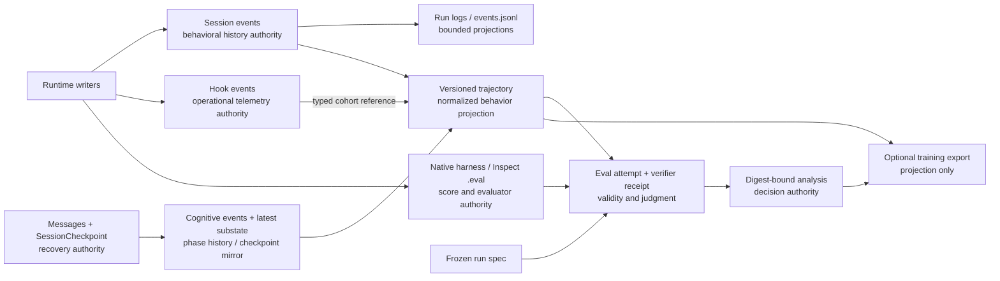

# Runtime debt and evidence modernization plan — 2026-08-19

> Status: **PLAN READY — implementation packages not yet claimed.**
>
> Planning base: `origin/develop@4247e790d02c835bfa51777d5de8b00bf118da92`
>
> This plan orders cleanup and evidence work. It does not override
> `docs/architecture/extensibility-roadmap.md` or authorize an unclaimed
> architecture package.

## Decision

Do not build a new agent-data platform, universal task ledger, or second
transcript. GEODE already has the necessary authorities:

- `sessions.db:session_events` owns chronological behavioral history;
- `sessions.db:hook_events` owns bounded operational and policy telemetry;
- `events.jsonl` and other run logs are bounded projections or domain logs,
  not competing history authorities;
- messages plus `SessionCheckpoint` own recovery; cognitive events own phase
  history and cognitive state owns the checkpoint-mirrored latest cognitive
  substate, not general session resume;
- `geode.trajectory@1` owns the normalized behavioral projection;
- native harness results and Inspect `.eval` files own evaluator-native facts;
- eval run specifications, attempt rows, verifier receipts, and analyses own
  preregistration, validity, judgment, and promotion decisions.

The work is therefore a sequence of deletions, dependency repairs, stricter
joins, and additive projections over those authorities. Reward modeling may
consume a digest-bound export later; it does not become a runtime writer now.

## Measured baseline

| Surface | Current observation | Consequence |
|---|---|---|
| Slop growth ratchet | `bypass_markers` grew 219 → 250 and duplicated signatures 73 → 83 since its 2026-07-02 introduction; growth was repeatedly accepted by restamping the baseline | The gate measures a line-count ceiling, not contribution. Retire it instead of lowering another arbitrary floor. |
| Ratchet implementation | `check_slop_ratchet.py`, its tests, and JSON baseline total 464 lines | Delete the mechanism and its promotion wiring. Keep the six-lens slop audit as diagnostic discovery only. |
| Test-count floor | The CI floor has been lowered repeatedly from 10,451 to 10,360 | Raw count rewards duplicated and shape-only tests. Remove the floor; keep coverage and behavior/contract gates. |
| Source-shape tests | 69 test files contain 170 `inspect.getsource()` / `getsourcelines()` calls | Keep only architecture/entrypoint tests that cannot be expressed behaviorally; migrate runtime wiring assertions to calls, outputs, state, and failure behavior. |
| Runtime compatibility candidates | No-op model-sync helpers, deprecated model slots, a permanently `not_evaluated` contract, and reserved fields are present | Delete only after complete caller/schema/persistence census; do not confuse internal dead slots with published compatibility facades. |
| Verify/cognitive wiring | Verify-failure continuation currently injects the same finding through both a reflection hint and `<verification_continuation>`; one rule-based miss is unreachable from the public finalizer | Keep confidence advisory and verifier authority separate; remove duplicate context and unreachable branches rather than inventing a combined score. |
| Cognitive evidence | `sessions.db:cognitive_events` and `cognitive_states` own the history/latest state but lack versioned event IDs, payload hashes, retention/redaction, and trajectory joins | Add identity and a digest reference at the existing rail; do not copy private hypotheses into public trajectories. |
| Trajectory | `geode.trajectory@1` already requires event IDs, ordinals, session/turn/call keys, integrity, replay completeness, privacy, provenance, and artifact digests | Evolve the existing schema and normalizer. Do not create another trajectory store. |
| Eval evidence | Run-spec/attempt/analysis v1 schemas already join on `run_id` and hashes; `.eval` is read through Inspect | Add missing attempt/episode joins and replay prerequisites at the projection boundary; never rewrite `.eval` as a GEODE-native format. |

## Authority and data flow



The boundaries are deliberate:

1. session events record behavioral chronology; hook events record operational
   telemetry, while run logs are bounded projections or domain logs;
2. trajectories normalize behavior without inventing scores;
3. `.eval` and native results retain evaluator ownership;
4. verifier receipts and analyses record judgment separately;
5. a future learning export selects immutable source digests and never writes
   back into runtime history.

## Scope and non-goals

### In scope

- remove proved no-op or test-only compatibility surfaces;
- replace source-shape tests with observable behavior tests where possible;
- re-audit and reconnect verify, cognitive-state, confidence, and termination
  consumers without introducing a second state machine;
- remove heuristic slop/test-count ratchets whose baselines are routinely
  rewritten;
- remove `core -> product/plugin` reverse dependencies through the already
  registered R1.2 package;
- evolve trajectory/eval projections with explicit identity, causality,
  replay, privacy, and source-digest contracts;
- make later reward/process-modeling exports reproducible and selection-bound.

### Out of scope

- a universal `TaskLedger`, generic event bus, or replacement transcript;
- rewriting historical logs or `.eval` archives in place;
- embedding reward into model-visible messages or runtime events;
- an RL trainer, replay daemon, feature store, vector database, or dashboard;
- retiring published `plugins.*` / self-improving compatibility facades before
  REL-002 and BND-007 authorize that removal;
- changing native benchmark score authority.

## Ordered work packages

Each package must merge independently. Parallel work is limited to read-only
research, disjoint tests, and branches whose authority does not overlap.

### P1 — retire ineffective count ratchets

Ordinary CI/tooling change; no architecture claim is required.

- delete `scripts/check_slop_ratchet.py`, its baseline, and its dedicated
  tests;
- remove the CI/preflight invocation and active documentation routing;
- remove the raw pytest collection-count floor;
- retain Ruff, format, mypy, deptry, import-linter, coverage, architecture,
  eval-contract, prompt-integrity, security, and full test execution;
- retain `scripts/slop_audit.py` as a non-gating candidate finder and update
  historical documents only with a supersession note, never rewritten history.

Acceptance:

- no active source references the retired gate or baseline;
- CI still executes the full suite with coverage and all deterministic gates;
- removing an obsolete test is judged by its surviving invariant, not a count;
- anti-deception checks find no skip, xfail, ignore, coverage, or workflow
  weakening hidden in the deletion.

### P2 — repair dependency direction through R1.2

This is the current earliest `READY` roadmap package and must follow the
roadmap-only claim protocol before code changes.

- remove the measured `core -> plugins` imports in the four R1.2 clusters;
- reuse provider/kernel helpers when the behavior is genuinely kernel-owned;
- otherwise pass narrow existing ports from outer composition;
- preserve public module strings and package data with thin forwarders only
  where the R1.1 migration map requires them;
- do not move durable state or begin the R1.5 self-improving relocation.

Acceptance is the existing BND-002 exit: zero reverse edges, unchanged public
commands/imports, product registration owned by composition, and cold-import
behavior preserved.

### P3 — delete internal compatibility debt and mature affected tests

Split by one causal family per PR after P2 stabilizes import ownership.

Candidate cleanup families:

1. first resolve the legacy `switch_model` tool, which currently updates
   settings and reports success while the settings-drift bridge is a no-op;
   then delete the automatic drift helpers and `disable_settings_drift`
   plumbing only after every retained command/restore path explicitly reaches
   the existing `update_model_async` mutation boundary;
2. keep `claim_grounded` as an explicit soft `not_evaluated` compatibility
   state while audit gates, attribution, archives, and summaries consume it;
   remove or replace it only in a versioned audit-contract migration;
3. remove private dead fields/constants (`WorkerRequest.isolation`,
   `PhaseCheckpoint.error`, `_BASH_NPROC_LIMIT`, and the seed-page
   `active_link`) with tolerant historical readers;
4. replace an exact duplicate canonical-JSON/hash or scalar-parse helper only
   when an existing same-layer owner already has the same responsibility;
   otherwise retain it rather than create a cross-layer utility;
5. source-string tests that can be replaced by behavior, output, or failure
   assertions.

`AutoresearchConfig.target_model` and `judge_model` are no-op fields but remain
v1.0.22 public configuration. They receive an explicit deprecation warning
and a v1.1.0 removal pledge; they are not silently removed in the patch line.

Deletion gate for every proposed deletion:

- no runtime, dynamic import, entrypoint, persisted schema, released API, or
  documented consumer remains;
- one surviving behavior or migration invariant is named;
- tests are migrated before or with production deletion, never merely removed
  to turn the suite green;
- full call graph, Ruff, mypy, targeted tests, and full non-live tests pass.

### P4 — freeze the coding-runtime authority contract (R9.1)

R9.1 remains `OPEN` and authorizes documentation only. After earlier READY
work no longer blocks scheduling and its `COLLAB-003` dependency is reconciled,
it needs separate readiness and claim PRs. Its output is the existing
eight-surface authority matrix, not runtime code.

The matrix decides which later verify/cognitive/confidence and evidence gaps
are residual. Existing checkpoint/session, Goal, collaboration, hook,
evaluation, and promotion owners remain authoritative unless a separately
registered migration proves otherwise.

The census must also dispose of the current write-only verify-state mirror:
`_persist_verify_state()` writes last-verdict columns, but production resume
does not call `get_verify_state()`. It must be deleted as a false authority or
assigned an explicit restore reader before any replan edge is persisted.

### P5 — verify, cognitive, and confidence residual

After P4, register only the residuals that its authority matrix confirms.
The items below are measured candidates, not a pre-authorized single package;
the matrix decides whether they form one repair or several independently
claimed gaps. None requires a new verifier or cognitive state machine:

1. remove duplicate verify-failure prompt injection while preserving
   verifier-over-confidence precedence; retain `model_action_required`
   behavior because public direct verifier callers exercise its hard-fail
   precedence even though the AgenticLoop finalizer does not reach it;
2. separate the ephemeral verify-fail replan arm from persisted
   `last_verify_should_retry` verdict telemetry, then consume only the arm when
   admitted so one stale failure cannot replan every later user turn; a newly
   recorded failure may arm exactly one new repair; P4 first decides whether
   the current write-only DB mirror is deleted or restored;
3. make `VerifyResult.effective_mode` default to the requested `mode`; only a
   real LLM-to-rule fallback may record different requested/effective modes;
4. thread the existing session/turn/generation identity into cognitive and
   `TURN_VERIFY_*` payloads; do not copy the currently unowned empty runtime
   `run_id` or claim it as complete;
5. distinguish a reflection phase boundary from an applied reflection and an
   actual confidence update; disabled, cadence-skipped, privacy-skipped,
   parse-failed, and adapter-error paths may not look like successful belief
   updates;
6. replace source-shape guards with transition/payload tests.

Acceptance:

- a two-turn cognitive fixture proves both hook/activity rows and persisted
  `sessions.db:cognitive_events` share one session with distinct turn IDs and
  the preserved session generation; the recorder must not discard those join
  keys when it stores the phase snapshot;
- verify fixtures prove root session/turn identity remains fixed while
  `verify_attempt` advances from 0 to 1;
- cognitive rows distinguish `applied` from bounded non-applied reasons and
  mark `confidence_updated` only when the value changes;
- mode-only `VerifyResult` construction preserves the requested mode, while a
  real fallback records both modes;
- one verify failure produces one repair edge across later user turns, planner
  failure does not re-arm it, and a newly recorded failure arms one new edge.
  Consuming the edge must not rewrite the persisted last verifier verdict;
- same-process next-turn and reopened-checkpoint fixtures separately prove the
  selected edge and telemetry semantics, with no write-only resume claim.

One policy choice is deliberately not smuggled into cleanup: verifier
exceptions currently degrade to `passed=True`. If P4 confirms exception
handling as a residual, register it separately; that contract must choose
fail-closed escalation or an explicit `unavailable/error` outcome. Such a row
can never be exported as a verified pass or positive reward.

### P6 — measured evidence residuals and replay contract

Register each residual only after P4 assigns its owner and a named producer,
consumer, failure, and independent exit test. Do not pre-claim a mega-schema
package. Reuse the current schema loader, trajectory builder, eval contract,
publication manifest, and artifact digest verification.

Measured defects that justify later registration are:

- repeated trajectory export from the same source can differ because capture
  time and missing event time fall back to the current clock;
- cognitive events lack stable turn joins, payload integrity, bounded
  redaction, and retention despite containing private state;
- Petri archive paths can overwrite different bytes with the same basename;
- seed-generation `.eval` export uses random IDs and score-shaped diagnostic
  projections, so it must remain non-authoritative and become byte-stable;
- external references can omit a resolvable path/digest and conflicting
  metadata is silently deduplicated;
- hook payload hashes are not revalidated on read and expired cohorts do not
  explicitly downgrade replay completeness.

The following identity graph is a **non-binding research hypothesis**. P4 and
the later registration must prove which identifiers already have authoritative
producers. Existing trajectory `ordinal` remains projection-order authority;
an attempt-local sequence is not introduced without a producer and consumer.

One candidate identity graph is:

```text
evaluation_run_id -> attempt_id -> workload_id / sample_id / epoch
attempt_id        -> execution_run_id -> session_id
session_id        -> turn_id -> operation_id -> event_id
operation_id      -> call_id (when the operation is a model/tool call)
attempt_id        -> predecessor_attempt_id (retry/resume lineage)
```

Names must not overload an evaluation run with a runtime execution. Every
producer either supplies its required key or declares a typed incompleteness;
empty strings may not masquerade as complete identity.

`trajectory_id` remains the stable semantic projection identifier used by
current producers. An episode identifier is introduced only when a producer
and consumer define episode boundaries. Artifact bytes are identified by the
publication manifest's current `entries[].sha256`; trajectory-release bundles
are anchored by their release-manifest SHA-256. A publication-manifest self-ID
is added only if the validated join requires it. Timestamp is descriptive, and
the existing trajectory `ordinal` remains the ordering field until a separately
owned execution sequence is proved necessary.

Evolve the existing `geode.eval-artifact-publication.v1` manifest when a
validated run-level join is required, and let `run-spec.artifacts` reference
it. Do not add a third evidence-manifest format or copy payloads and scores
into it. A later trajectory version remains a semantic projection and models
an episode only after episode boundaries have an authoritative producer and
consumer. Candidate contract properties, subject to the registration gate,
are listed below. The identifier and replay names are illustrative vocabulary,
not frozen JSON field names or permission to bump a schema:

- monotone event order and causal parent/span relationships; every completed
  operation has exactly one terminal state, while a started operation without
  a terminal is retained as explicit incompleteness and makes full replay
  false;
- code, harness, task/dataset, model route, policy/tool schema, environment,
  and seed digests needed to explain or reproduce a run;
- action/tool result pairing and terminal reason;
- source artifact hash, privacy class, redaction policy/version, and fidelity;
- separately declared `context_replay`, `simulation_replay`,
  `environment_replay`, and `live_rerun` support plus the exact reasons each
  level is unavailable or reduced;
- native outcome and verifier/reward references as external judgments, never
  fields that overwrite observed events.

Compatibility rules:

- v1 artifacts remain immutable and readable through the existing normalizer;
- v2 uses `additionalProperties: false` at stable boundaries and conditional
  requirements by event/reference kind;
- material optional evidence uses an explicit discriminated availability and
  redaction state rather than an ambiguous empty string or `null`; exact
  variants are fixed only at registration;
- migrations are read-side projections with `migrated_from_schema_id` and
  source digest; no historical artifact rewrite;
- one round-trip fixture proves canonical serialization and one replay fixture
  proves deterministic reconstruction from recorded results.

The score-authority fixture must reject both seed-generation's diagnostic
`.eval` projection and trajectory `outcome` as a primary metric source. Only a
digest-bound source explicitly classified as evaluator-native score authority
may satisfy it; the current analysis contract requires `native-result`.

If registered, the cognitive rail gains only fields its existing writer needs
for the proved join: schema version, stable event ID, payload hash, turn ID,
and declared retention/redaction. Trajectories reference a cohort digest;
exporting even a bounded confidence scalar waits for P5's applied/update
semantics plus a named privacy-reviewed consumer. Private goal/hypothesis text
remains in the cognitive authority.

### P7 — reward/process-modeling export, only with a real consumer

Do not add a reward store now. First ensure existing verifier/native receipts
can be referenced with a stable subject scope and provenance. When a concrete
trainer or analysis notebook is selected, use the list below as a consumer
requirements checklist—not a predeclared schema—and add one deterministic
exporter that emits only fields whose upstream authorities exist:

- source trajectory/eval/receipt digests;
- selection query and split identity;
- immutable event or span targets;
- separate outcome, process, preference, or verifier labels with labeler and
  policy provenance;
- missingness and exclusion reasons.

The export is rebuildable from authoritative artifacts. Seed-generation's
diagnostic `.eval` and trajectory `outcome` are not score authorities. Model
outputs never become ground truth merely because they are present, and
train/eval leakage is checked at workload/episode lineage rather than filename.

Three confidence domains remain separate:

- model self-confidence is an observed cognitive signal;
- verifier confidence is judgment provenance;
- promotion confidence is an analysis/policy decision.

Only a versioned transformation may derive reward from them. Process labels
attach to observable actions, tool results, checkpoints, or verifier
assertions—not hidden chain-of-thought—and carry source type, rubric/verifier
revision, evidence references, abstention, confidence, supersession,
consent/provenance, and training-allowed status.

## Verify, cognitive state, and confidence rewiring rules

The re-audit must follow the actual finalization path rather than field names:

```text
model/tool loop
  -> cognitive reflection updates advisory state
  -> confidence may request bounded replan
  -> built-in verifier produces immutable VerifyResult
  -> PostVerify policy may accept/revise/escalate
  -> terminal reason and evidence are persisted
```

- `CognitiveState.confidence` remains advisory; it may influence reflection or
  replan but cannot certify correctness.
- a `COGNITIVE_REFLECT` phase event is not a training label unless its applied
  status and producing turn are explicit.
- `VerifyResult` remains the built-in verification authority; no confidence
  field or model self-report bypasses it.
- PostVerify retains bounded continuation authority and must bind its decision
  to the verified candidate digest.
- a missing consumer is deleted or registered as a measured gap; it is not
  kept as a forward-stable stub.
- tests assert transitions, persistence, and precedence, not private method
  text or dataclass field counts.

## Research adoption boundary

The external comparison is used only to select data-contract properties:

| Reference | Adopt | Do not copy |
|---|---|---|
| [Codex App Server](https://github.com/openai/codex/blob/14a8ac89af0a3c9033c1fa4d747ec5d6333e9890/codex-rs/app-server/README.md) | stable thread/turn/item identity, authoritative started/completed item lifecycle, replayable model-visible state | its entire app-server protocol or a second session store |
| [Inspect AI logs](https://inspect.aisi.org.uk/eval-logs.html) | evaluator-native `.eval`, sample/epoch/event/span/tool/score separation, recorded configuration and attachments | a private GEODE fork of the `.eval` format |
| [Agent Lightning traces](https://microsoft.github.io/agent-lightning/stable/tutorials/traces/) | rollout/attempt/sequence identity and reward spans separate from agent execution | LightningStore, trainer, or RL proxy before a real consumer exists |
| [OpenTelemetry GenAI conventions](https://github.com/open-telemetry/semantic-conventions-genai/blob/a685613a207a580163353b8e48a7ad88967e7b42/docs/gen-ai/gen-ai-agent-spans.md) | trace/span causality and explicit provider/model/tool attributes where semantically stable | development-status attributes copied blindly into GEODE persistence |
| [Hermes trajectory format](https://github.com/NousResearch/hermes-agent/blob/0b879298a7885b62425e65500c85c584d7c516d5/website/docs/developer-guide/trajectory-format.md), [OpenClaw session model](https://github.com/openclaw/openclaw/blob/7bc994aee83169a9acc329c2aaaf8fc9504129fa/docs/reference/session-management-compaction.md), and [Cursor dynamic context](https://cursor.com/blog/dynamic-context-discovery) | tool-call pairing, append-only transcript ancestry, bounded context with retrievable references | their framework-specific storage, prompts, or gateway semantics without a GEODE owner |
| [InstructGPT](https://arxiv.org/abs/2203.02155) and [Let's Verify Step by Step / PRM800K](https://arxiv.org/abs/2305.20050) | keep human/preference outcome labels and step-level verifier labels distinct, with labeler and policy provenance | treating runtime confidence or hidden reasoning text as ground-truth reward |

## GitFlow and verification

Merge order:

1. this plan: `feature -> develop`;
2. P1 ordinary cleanup: `feature -> develop`;
3. R1.2 roadmap-only claim, then its implementation: `feature -> develop`;
4. P3 causal cleanup PRs;
5. R9.1 readiness, claim, and documentation-only implementation when eligible;
6. separately register and claim only the P5 verify/cognitive residuals that
   R9.1 confirms;
7. separately register and claim the smallest P6 evidence residual with a
   named producer, consumer, failure, and exit test;
8. add P7 only when a concrete trainer or analysis consumer exists;
9. after the series is integrated and CI-green, sync `main -> develop`, then
   merge `develop -> main`; clean worktrees with the repository hygiene helper.

Per functional package:

- targeted behavior/migration/replay tests first;
- Ruff check and format, mypy, deptry/import-linter when affected;
- architecture/eval schema generators and contract validators;
- full non-live pytest with coverage;
- site/docs generation only when public surfaces change;
- independent committed-diff review and anti-deception audit;
- `CHANGELOG.md` under `[Unreleased]` for functional changes.

Live model, benchmark, or paid evaluation runs are not required for P1–P5.
P6 uses deterministic export/replay fixtures first; a live run requires
separate approval and a frozen run spec.
