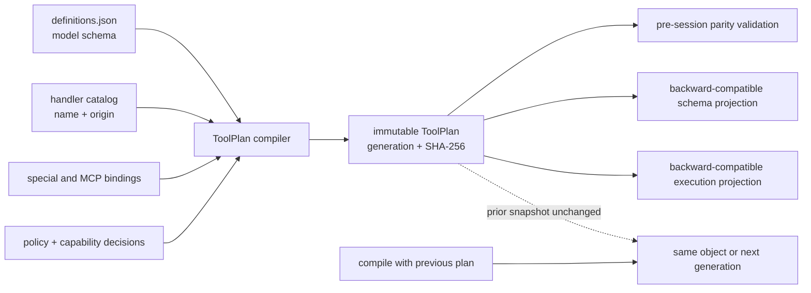

# R2.1 Capability and Tool Plan

Status: implementation authorized by roadmap claim [#3042](https://github.com/mangowhoiscloud/geode/pull/3042)

Base: `origin/develop@7161bb22f502d9c005f101bf987c60dc8b93b394`

GAPs: `CAP-001`, `CAP-002`

## Outcome

Compile the existing model-visible tool definitions and executable bindings into
one immutable, generation-aware `ToolPlan`, then fail before session construction
when that snapshot is inconsistent. Existing schema and execution consumers keep
their byte-compatible projections in R2.1; R2.3 moves them onto the plan.

This package does not add another mutable registry. It reuses the existing
definition loader, collision-checked handler composer, `ToolRegistry` extension
surface, MCP discovery, and provider adapters.

## Measured baseline

- `definitions.json`: 87 model-visible definitions.
- product-composed handler map: 82 handlers.
- special executor paths: 8 names.
- every definition has an execution path today, but the proof is assembled by a
  test from separate sets rather than owned by runtime composition.
- three execution-only internal routes (`computer`, `doctor_slack`,
  `recall_tool_result`) are not model-visible definitions and must stay outside
  the public plan.
- `GeodeRuntime.tool_registry` contains a separate 15-tool object catalog that
  is not the `SharedServices` schema/handler plane.
- Google OAuth owns eight frozen service bundles, while service implications,
  scopes, tool schemas, personal-data classification, and approval policy are
  spread across separate modules.

## Decision criteria

| Source | Adopt | Do not copy |
|---|---|---|
| Codex | one registration joins spec and executor; one router is frozen in step context | crate taxonomy, namespace/exposure hierarchy |
| Hermes Agent | monotonic generation, availability before snapshot, canonical capability hash | mutable global registry state, TTL grace, last-writer-wins override |
| OpenClaw | attempt-local policy-filtered catalog and collision evidence | catalog cache and object-identity fingerprint |
| Cursor | schema and execute live in one custom-tool contract; unknown/denied tools fail before use | opaque classifier policy or undocumented runtime assumptions |
| GoF | Command for execution, immutable Composite value for the plan, Strategy/Adapter only at existing provider seams | interfaces or factories with one implementation |

Pinned primary sources:

- [Codex ToolExecutor](https://github.com/openai/codex/blob/e3e5ad28470f6a225301518c30a66e749a880164/codex-rs/tools/src/tool_executor.rs#L91-L119), [ToolRegistry](https://github.com/openai/codex/blob/e3e5ad28470f6a225301518c30a66e749a880164/codex-rs/core/src/tools/registry.rs#L271-L383), and [StepContext](https://github.com/openai/codex/blob/e3e5ad28470f6a225301518c30a66e749a880164/codex-rs/core/src/session/step_context.rs#L13-L43)
- [Hermes ToolEntry](https://github.com/NousResearch/hermes-agent/blob/27562ad5f80e90f7d552f92dbd4af7f1f511c3c8/tools/registry.py#L204-L233), [generation/snapshot](https://github.com/NousResearch/hermes-agent/blob/27562ad5f80e90f7d552f92dbd4af7f1f511c3c8/tools/registry.py#L426-L484), and [capability hash](https://github.com/NousResearch/hermes-agent/blob/27562ad5f80e90f7d552f92dbd4af7f1f511c3c8/hermes_cli/plugin_capabilities.py#L66-L190)
- [OpenClaw tool registration](https://github.com/openclaw/openclaw/blob/ab7fc490d68bdd0dc89199ddc0898e590070e13d/src/plugins/registry-registrars-tools-hooks.ts#L223-L268), [attempt catalog](https://github.com/openclaw/openclaw/blob/ab7fc490d68bdd0dc89199ddc0898e590070e13d/src/agents/embedded-agent-runner/run/attempt-tool-catalog.ts#L1-L142), and [policy pipeline](https://github.com/openclaw/openclaw/blob/ab7fc490d68bdd0dc89199ddc0898e590070e13d/src/agents/tool-policy-pipeline.ts#L135-L228)
- [Cursor Python SDK](https://cursor.com/docs/sdk/python) and [tool approval](https://docs.cursor.com/context/model-context-protocol)

## Boundary

Dependency direction remains `geode_product -> core`. Product composition
supplies product handlers and descriptors; the neutral compiler has no product
imports and no process-global setter.

## Minimal records

Names may change while implementing, but these responsibilities stay separate.
The existing adapter `ToolSpec` moves to neutral ownership and remains re-exported
from its old import path; no second `ToolSpec` is introduced.

| Record | Current producer | Immediate consumer / boundary |
|---|---|---|
| `ToolSpec` | `definitions.json` and existing `ToolRegistry` objects | compiler plus the unchanged adapter re-export |
| `ExecutionBinding` | existing origin-aware handler catalog and special bindings | compiler parity validation and compatibility execution projection |
| `SafetyPolicy` | read-only snapshot of existing safety classifications | compiler decision result; no new tool-name list or approval engine |
| `CapabilityRequirement` | explicit registration input | compiler decision result; availability and policy denial stay distinct |
| `ToolRegistration` | declarative definitions plus the origin-aware product handler catalog | compiler input; no second mutable registrar |
| `ToolPlan` | pure compiler | pre-session validation and compatibility projections |
| `GoogleServiceDescriptor` | existing eight bundles plus implication/recommended data | existing OAuth compatibility view; tool association migrates in R2.2 |

The compiler hashes canonical stable metadata only. Raw callables remain in the
existing compatibility handler map until R2.3, outside plan identity. Hashes
also exclude secrets, ambient environment values, and timestamps. Resource-key
resolution remains owned by R2.4.

## Implementation order

1. Add behavior characterization for current schema/execution parity, duplicate
   failure, internal-only routes, Google bundle compatibility, and provider
   projection equality.
2. Add the neutral immutable records and pure compiler. Reuse the existing
   `ToolSpec`, `UniqueEntries`, origin-aware handler catalog, stdlib frozen
   dataclasses, tuples, `MappingProxyType`, canonical JSON, and SHA-256.
3. Compile at the existing product composition boundary and fail before session
   construction on duplicate, missing, or mismatched bindings. Keep current
   schema/execution projections byte-compatible; no global registry.
4. Keep the validated plan beside its compatibility handler map in the existing
   `SharedServices` composition owner. `compile(inputs, previous=None)` returns
   the same plan for identical stable metadata and generation + 1 for changed
   metadata, leaving the prior value unchanged.
5. Move the existing Google bundle data behind `GoogleServiceDescriptor` and
   retain the current OAuth import surface as a thin compatibility export.
6. Keep the public `ToolRegistry` API and its extension/benchmark compatibility
   role unchanged. R2.3 adapts dynamic registry and MCP snapshots when it moves
   live model/execution consumers; R2.1 does not create a parallel adapter.
7. Update `[Unreleased]`, architecture inventory, and directly affected public
   architecture docs; run generated-doc parity only after final source bytes.

## Explicit non-goals

- R2.2 Google policy/name-list consumer migration.
- R2.3 provider-specific schema convergence, live `AgenticLoop`/`ToolExecutor`
  plan consumption, worker/MCP root convergence, and CLI handler relocation.
- R3.1 full route/policy/trace `StepSnapshot`.
- plugin hot reload, trust lifecycle, catalog caching, or a second manifest.
- changing user-visible tool names, schemas, approval behavior, or provider
  payload bytes except to reject a previously hidden schema/executor mismatch.

## Acceptance

- duplicate names fail before a session starts and report both origins;
- model schema names and execution binding names are identical for every plan;
- unavailable capability and denied policy remain distinct machine-readable
  compiler outcomes without changing the current runtime denial path;
- two builds from identical inputs have identical content hash;
- identical content returns the same plan object and generation; a changed
  catalog increments generation and leaves the prior plan unchanged;
- the product-composed handler and special-binding sets cover every
  model-visible definition, while the three declared internal-only routes stay
  outside the plan; any unbound model-visible definition fails instead of being
  filtered away;
- current Anthropic/OpenAI wire payloads remain byte-equivalent before and
  after the neutral `ToolSpec` ownership move;
- the existing public `ToolRegistry` keeps its compatibility behavior, while
  the origin-aware product handler composition feeds lossless compiler inputs;
- existing Google bundle callers observe the same names, scopes, risks, and
  implications;
- targeted tests, ruff, format, mypy, import-linter, package/install smoke,
  architecture baseline, official-doc checks, and the full non-live suite pass.

## GitFlow

One functional PR from `feature/r2-1-capability-records` targets `develop` and
names both GAPs. After merge, a roadmap-only reconciliation moves both rows to
`IN_DEVELOP`, records one shared evidence row, removes the claim, and re-audits
the next package. Main promotion follows only after the ordinary main-to-develop
sync precondition.
