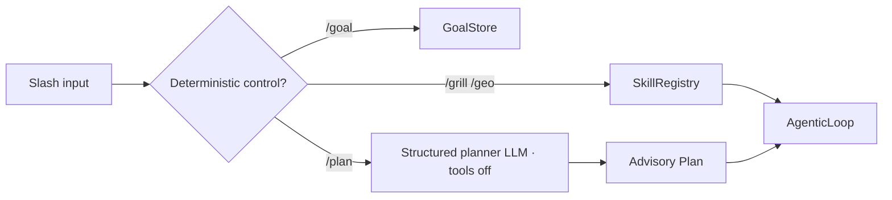

# Slash Goal/Plan/Grill/GEO implementation plan and GAP audit

작성: 2026-08-20
최초 기준 브랜치: `origin/develop@df920af79`
상태: implemented; verification evidence below

## 결정

`/goal`, `/plan`, `/grill`, `/geo`는 네 개의 새 실행 엔진이 아니다.

- `/goal [objective]`는 objective 전체를 그대로 저장하고, bare 명령은
  상태를 읽으며, 정확한 `/goal clear`만 `empty` 전이를 만든다.
- `/plan <task>`는 도구를 비활성화한 structured-output 호출로 후보 계획
  구조를 비교하고 선택된 advisory plan만 설치한다. 실행 권한은 얻지 않는다.
- `/grill`과 `/geo`는 기존 runtime skill을 로드해 같은 AgenticLoop로 보낸다.
  별도 argv 문법과 도메인 executor를 만들지 않는다.

## 충돌 순서

R1.3의 BND-003 core-only 배포 검증이 `develop`에 병합된 뒤 이 브랜치를
`origin/develop@4ff91e55a`로 fast-forward하고 변경을 재적용했다. 이후
roadmap lineage 정정과 R1.7 readiness 커밋까지
`origin/develop@df920af79`로 재동기화했다. 기능 코드
중첩은 없었고, `AGENTS.md`, `CHANGELOG.md`, 사이트 생성물만 재생성으로
합쳤다. `pyproject.toml`과 package artifact checker는 수정하지 않았다.
아키텍처 roadmap은 수동 상태를 건드리지 않고 표준 생성기가 소유한
inventory 블록만 현재 파일 수로 동기화했다.

병합 전 최종 기준 `origin/develop@9038d635d`에는 이 worktree 기준점 이후
17개 커밋이 있었다. 생성 블록과 파생 산출물은 최신 tree에서 표준 생성기로
재작성했다. 새 tool-plan 조립과 겹친 `geode_product/tool_handlers.py` 및
`tests/integration/test_product_composition.py`는 최신 `compose_tool_plan`을
보존하면서 product slash registry를 주입하도록 수동 병합했다. 새 파일 경로
중첩은 없으며, 최신 roadmap의 수기 상태는 변경하지 않았다.

## Codex grounding

| 계약 | Codex source | GEODE 적용 |
|---|---|---|
| slash command은 enum/registry에서 결정론적으로 분기 | `codex-rs/tui/src/slash_command.rs`, `chatwidget/slash_dispatch.rs` | process-neutral `core/slash_routing.py`의 `CommandSpec.location`으로 streaming과 RPC 분리 |
| `/plan`은 plan-and-execute가 아니라 collaboration mode | `chatwidget/slash_dispatch.rs`, `protocol/src/plan_tool.rs` | 도구 없는 planner call + advisory `Plan` |
| `/goal`은 view/set/clear와 실행 지속성을 분리 | `ext/goal/src/spec.rs`, `api.rs` | `GoalStore` 제어, 기존 continuation 재사용 |
| checklist는 실행기가 아님 | `core/src/tools/handlers/plan.rs` | 기존 `update_plan` 계약 유지 |

## Frontier research summary

| 근거 | 채택 | 거부/경계 |
|---|---|---|
| ToT, RAP, GoT, LATS | 질문 분기, prerequisite, 가지치기, backtrack 개념 | 범용 thought parser, 숨은 CoT 저장, 검증기 없는 MCTS/LATS |
| RE-TRAC | epoch마다 evidence, uncertainty, failure, unvisited lead 압축 | checkpoint를 사실 또는 영구 권위로 취급 |
| Codex/GPT-5.6 multi-agent | 독립 읽기 작업만 최대 3개, 부모가 join·합성·쓰기 | 공유 mutable state 병렬화, agent 수를 품질 지표로 사용 |
| OpenClaw | session/global lane, timeout, 취소, depth 제한 | GEO 전용 무제한 pool 또는 선제적 coordinator |
| autoresearch | 고정 예산, baseline, ledger, keep/discard, 실패 격리 | 구현되지 않은 병렬 아이디어를 현재 사실로 인용 |
| GEO KDD 2024 | fixed-context visibility 실험의 출발점 | 최대 41%를 organic discovery의 보편 lift로 일반화 |
| C-SEO Bench·SAGEO Arena | 재색인한 full pipeline, rank·multi-actor·stage-aware 평가 | body rewrite와 citation count를 단독 성공 지표로 사용 |

## Tree-of-Thought 경계

적용하는 부분은 부작용 전 구조 선택과 **검증 가능한 evidence frontier**다.
노드는 자유형 thought가 아니라 질문, 성공 조건, 의존성, 근거 locator,
지지/반증, 실패 이유, 불확실성, 미방문 lead, 합성 채택 여부만 가진다.
부모 AgenticLoop가 가장 값싼 결정론적 preflight를 먼저 실행하고, 독립적인
읽기 전용 축만 기존 `delegate_task`로 최대 3개 병렬화한 뒤 join·합성한다.
각 wave 뒤 checkpoint는 RE-TRAC식으로 압축하지만 새 primary evidence가
반박하면 폐기한다. 쓰기와 prerequisite branch는 부모가 직렬 수행한다.

적용하지 않는 부분은 별도 ToT/GoT/MCTS 실행기, 범용 coordinator, 같은
모델의 자기점수를 correctness gate로 쓰는 것, 공유 파일·shell·외부 상태의
병렬 trajectory다. 기존 runtime에 필요한 join/timeout/depth-one primitive가
이미 있으므로 skill contract 밖의 새 상태머신은 만들지 않는다.

## GAP audit

| GAP | 구현 전 | 조치 | 완료 증거 |
|---|---|---|---|
| `/goal` 사용자 surface | tool-only | view/set/clear slash + `empty` 상태 | store/dispatcher/E2E |
| `/plan` 사용자 surface | implicit decomposition/tool-only | no-tool structured planner slash | fake-model schema E2E |
| grill-me runtime 제공 | Codex-global skill만 존재 | bundled `grilling` skill + slash | loader + prompt E2E |
| GEO product identity | 문서상 명시적 non-goal | bundled `geo` skill + slash + benchmark profile | source-grounded audit E2E |
| streaming slash routing | enum만 있고 미구현 | `DAEMON_STREAM` IPC path 연결 | real slash input test |
| GEO discovery substrate | `llms*.txt`, JSON-LD; sitemap 없음 | exported sitemap 추가 | Next build + link/metadata checks |
| GEO measurement | citation count 중심 위험 | multistage visibility vector | `docs/eval/geo-visibility.md` |
| GEO 실행 topology | 단일 AgenticLoop가 모든 조사를 순차 수행 | 독립 evidence branch 최대 3개 + parent join/synthesis | runtime/scaffold skill + live receipt |
| GEO tool surface | runtime skill에 미등록 `read_file`, collaboration 도구 없음 | `read_document`와 기존 delegate/spawn lifecycle 명시 | loader contract test |
| sub-agent model route | built-in role도 generic task-type agent model로 덮여 parent subscription route 이탈 | explicit role은 explicit agent가 없으면 parent model/source 상속 | worker-request regression + live child receipt |
| sub-agent runtime root | isolated parent의 `GEODE_HOME`/`GEODE_STATE_ROOT`가 worker subprocess에서 탈락 | 공용 subprocess whitelist로 두 runtime root 전달 | whitelist regression + isolated live `lsof` receipt |
| GEO artifact publication | raw terminal transcript가 trajectory slot을 차지하고 `.eval`/normalized trajectory/public release 경계가 실행 문서에 없음 | Inspect-native `.eval`, `geode.trajectory@1`, withheld-private evidence, reviewed release를 분리하고 parent+child export/upload 계약 추가 | canonical eval profile + runtime/scaffold skill + 4-session export preflight |
| 장기 실행 상태 | 원시 로그가 context를 잠식할 위험 | evidence/uncertainty/failure/unvisited-lead checkpoint | skill/scaffold contract |

## 비목표

- 새 plan executor, Goal executor, TaskGraph 통합
- shared-state LATS/MCTS
- GEO 전용 coordinator, lane pool, graph/state parser
- 자연어를 세부 subcommand로 분해하는 parser
- `llms.txt` 또는 특정 rewrite의 순위 효과 주장
- 승인 없는 유료 commercial-engine benchmark

## GEO 실행/측정 계약

> Superseded 2026-08-24: the active runtime removed `offline_measure`; see
> `docs/plans/2026-08-24-geo-live-only-subscription.md`. The paragraph below
> remains the original design record.

`/geo`는 `preflight → offline_measure → live_observe → experiment` 순서의
evidence state machine이다. 결과는 `F,R,C,P,A,Q,O` 벡터로 보존하고,
prerequisite·승인·동결 workload·receipt가 없는 단계는 `not_measured`다.
0–100 단일 점수는 만들지 않는다.

실행 전략 벤치는 같은 모델·effort·frozen workload에서 다음만 비교한다.

- A: 순차 ReAct
- B: A + epoch evidence checkpoint
- C: B + 최대 3개 독립 read-only branch 병렬화

한 번의 smoke는 동작 증거일 뿐 우월성 증거가 아니다. 비교 주장은 전략당
최소 3회 반복 후 coverage, primary-source recall, citation precision,
contradiction resolution, unsupported-claim/forgotten-branch/duplicate-call,
propagated error, token/tool/wall time을 함께 보고할 때만 허용한다.

## 완료 증거

- 실제 Unix socket에서 `/goal`, `/plan`, bare `/plan`, `/grill`, `/geo`,
  `/goal clear`를 순서대로 입력한 E2E가 통과했다. 외부 비용 없이 같은
  IPC와 AgenticLoop 계약을 검증하기 위해 model adapter만 deterministic
  fake로 교체했다.
- `ruff check`, `ruff format --check`, `mypy`, import-linter 5개 계약,
  prompt integrity, architecture baseline, eval catalog, 전체 non-live pytest가
  코드 기준점 `origin/develop@4ff91e55a`에서 통과했다. 이후 docs-only
  커밋들을 `origin/develop@df920af79`까지 fast-forward하고 architecture
  baseline과 문서 생성물 검사를 다시 통과시켰다.
- Next.js는 238개 정적 페이지를 빌드했고 GEO preflight는 exported page와
  sitemap URL을 각각 77개로 확인했다. selection, citation, absorption,
  outcome은 live run 전까지 명시적으로 미측정이다.
- 2026-08-20 실제 `gpt-5.6-sol` subscription, effort `medium` CLI smoke에서
  `/goal`은 model/tool 0회, `/plan`은 model 1회, `/grill`은 model 18회,
  `/geo`는 model 51회로 종료했다. 네 slash surface 모두 통과했지만 당시
  `/geo`는 순차 실행이었으므로 병렬 전략의 품질 우월성을 주장하지 않는다.
  frozen run spec과 native receipt는
  `~/.geode/eval-runs/gpt56-sol-slash-smoke-20260820t051900z/`에 보존했다.
- 첫 병렬 진단은 explicit role보다 generic task-type model이 우선되어 세
  child가 Anthropic 경로로 이탈한 사실을 포착했다. 실패 시 부모가 추가
  delegate 없이 순차 fallback한 receipt를
  `~/.geode/eval-runs/gpt56-sol-geo-parallel-20260820t063800z/`에 보존했다.
- route 수정 뒤 한 batch의 세 child가 9ms 안에 시작해 3/3 완료했지만,
  worker가 격리 runtime root 대신 기본 사용자 root를 쓴다는 두 번째 공용
  결함을 발견했다. 해당 진단 receipt는
  `~/.geode/eval-runs/gpt56-sol-geo-parallel-fixed-20260820t064601z/`에 보존했다.
- 두 공용 결함 수정 뒤 strict isolated run은 실제 `/geo` 입력 한 번으로
  `repo_researcher` 세 개를 9ms 안에 시작했고 3/3 자연 종료했다. batch는
  347.59초, 확인된 3-way overlap은 226.6초였다. 부모와 모든 child가
  `gpt-5.6-sol`/OpenAI/subscription 경로를 사용했으며 격리 `sessions.db`와
  worker log를 열었다. 부모 8회와 child 39회, 합계 47 model call의 결과는
  F=partial offline, R/C/P/A/O=`not_measured`, Q=partial offline이고 실행 전후
  repository digest가 같았다. frozen spec, transcript, native results,
  verifier receipt, attempt ledger, analysis는
  `~/.geode/eval-runs/gpt56-sol-geo-parallel-isolated-20260820t070700z/`에 보존했다.
  단일 run은 병렬 전략의 품질 우월성 근거로 사용하지 않는다.
- 같은 strict isolated run의 canonical `sessions.db`에서 기존 exporter로
  parent와 세 child의 digest-content trajectory 후보 4개를 재구성했다.
  합계 549 event와 254/254 exact tool pair, orphan 0, scope-complete 4/4를
  검증했다. private payload를 digest로 대체했으므로 replay-complete는 0/4다.
  frozen privacy가 `internal`이어서 raw transcript와 runtime home은
  `withheld-private`이며, exact-byte privacy review와 content-addressed release
  gate 전에는 외부 artifact repository로 올리지 않는다. Inspect가 producer가
  아니므로 `.eval` 호환 파일도 만들지 않았다.
