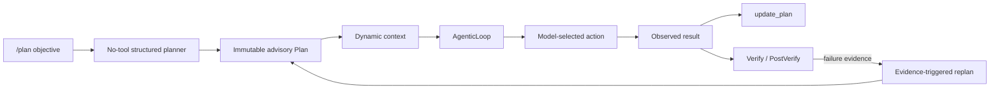

# Advisory Plan contract cleanup

작성: 2026-08-21
기준: `origin/develop@2704002ba0b3`
구현 브랜치: `codex/plan-contract-cleanup`
상태: scope frozen before implementation

## 1. 결과 계약

GEODE의 사용자 작업 계획은 하나의 **advisory Plan**만 가진다.

Plan은 미래 tool call이나 dependency graph를 실행하지 않는다. 각 step은
`description`과 관측 가능한 `expected_outcome`만 가진다. 실제 action은 매
round의 목표·관찰·이력·현재 step을 조건으로 AgenticLoop가 선택하고, tool은
기존 schema·policy·approval 경계를 통과한다.

## 2. 측정된 충돌

| ID | 현재 표면 | 판정 | 근거 |
|---|---|---|---|
| PLAN-C01 | 모든 compound user turn의 자동 `decompose_async` | 제거 | 명시적 `/plan`과 별개로 planner call을 만들고 관측 전 plan을 설치한다. |
| PLAN-C02 | decomposer prompt의 `depends_on`, one-step/one-tool, runtime argument fill | 제거 | `SubGoal` schema에는 `depends_on`이 없고 runtime argument fill executor도 없다. |
| PLAN-C03 | advisory `PlanStep.tool_name`·`tool_args` | 제거 | 실행되지 않는 metadata가 미래 action을 미리 고정하는 인상을 준다. |
| PLAN-C04 | cadence-based replan | 제거 | 새 evidence가 없어도 매 N round planner call을 발생시킨다. |
| PLAN-C05 | verify-fail·low-confidence replan | 유지 | 기존 Plan이 있을 때 관측된 failure/belief change로만 revision한다. |
| PLAN-C06 | `PlanMode`·`AnalysisPlan`·`PlanStore` | 제거 | advisory Plan과 별도인 dependency DAG·template·status store다. |
| PLAN-C07 | `create/approve/reject/modify/list_plan(s)` model tools | 제거 | approval이 tool execution authority와 결속되지 않은 중복 checkpoint다. |
| PLAN-C08 | SIL `decomposition` mutation target | 제거 | runtime reader 제거 뒤에는 효과 없는 mutation surface가 된다. |
| PLAN-C09 | `update_plan` checklist | 유지·단순화 | Codex와 같은 progress surface이며 step을 실행하지 않는다. |
| PLAN-C10 | `/plan` | 유지 | tools-off planner가 최대 8개의 advisory step 하나만 설치한다. |

## 3. 구현 범위

### Runtime

- `core.agent.plan.PlanStep`에서 `tool_name`과 `tool_args`를 삭제한다.
- `/plan`과 replan structured schema를 `id`, `description`,
  `expected_outcome`으로 제한한다.
- `SubGoal`, `DecompositionResult`, heuristic compound detection,
  `decompose_async`, `_planner_dispatch`와 AgenticLoop의 자동 decomposition
  호출·constructor flag를 삭제한다.
- cadence trigger와 `replan_interval` config/env/TOML surface를 삭제한다.
- verify-fail과 edge-triggered low-confidence revision, bounded abandon,
  immutable plan identity/revision, timeline events는 유지한다.

### Duplicate review-plan surface

- `core/orchestration/plan_mode.py`와 `plan_store.py`를 삭제한다.
- `create_plan`, `approve_plan`, `reject_plan`, `modify_plan`, `list_plans`
  definitions와 handlers를 삭제한다.
- CLI handler group에는 `update_plan`만 남긴다.
- 기존 사용자 plan-store 파일은 삭제하거나 마이그레이션하지 않는다. 새
  runtime이 더 이상 읽지 않는 inert data로 남겨 destructive migration을
  피한다.

### Prompt and self-improving surfaces

- `core/llm/prompts/decomposer.md`와 pinned hash를 삭제한다.
- `core.agent.decomposition_policy`와 product policy-source binding을
  삭제한다.
- SIL mutator의 `decomposition` target kind와 경로 상수를 삭제한다. 과거
  mutation row는 기록으로 남지만 새 mutation은 fail-closed reject된다.
- 현재 동작을 설명하는 config·runtime·portfolio 문서는 새 계약으로
  동기화한다. 역사적 CHANGELOG 본문과 과거 실험 결과는 다시 쓰지 않는다.

### Verification

- `/plan`은 model call 1회, tool call 0회로 Plan을 설치한다.
- 일반 compound prompt는 별도 planner call 없이 AgenticLoop로 바로 간다.
- advisory schema와 serialized event에 tool/dependency/argument field가 없다.
- `update_plan`은 관측된 completed prefix만 active Plan에 반영한다.
- verify failure와 low-confidence만 replan하며 round cadence는 replan하지 않는다.
- 제거된 review-plan tools가 provider-visible catalog와 executable handler
  map 양쪽에서 모두 사라진다.
- TaskGraph와 ToolPlan 회귀 테스트는 그대로 통과한다.

## 4. 비범위

- `core.orchestration.task_system.TaskGraph`: 사용자 task와 scheduler의 실제
  dependency-aware execution primitive다.
- `core.tools.plan.ToolPlan`·`BoundToolPlan`: model-facing tool schema와
  executable handler를 같은 hash에 묶는 catalog snapshot이다.
- Goal continuation, `/grill`, `/geo`, sub-agent scheduling.
- clone/rollback, branch value propagation, MCTS/LATS 또는 새 plan executor.
- historical SQLite/session event schema 제거. 기존 plan event는 계속 읽을 수
  있고 새 writer payload만 좁아진다.

이 작업은 extensibility roadmap의 R3 loop extraction이나 R2 tool-plan
package를 구현하지 않는다. 사용자-visible Plan의 기존 중복 기능을 삭제하는
bounded behavior cleanup이며 roadmap status는 변경하지 않는다.

## 5. Frontier grounding

| 시스템 | 관찰 | 적용 |
|---|---|---|
| Codex `main@daa48072f4f5` | `update_plan` payload는 step text와 `pending/in_progress/completed`뿐이며 handler는 event를 보낸다. tool/dependency executor가 아니다. | `update_plan`을 유일한 model-visible plan tool로 유지한다. |
| Codex Plan mode | collaboration mode와 TODO checklist를 구분하며 Plan mode 안에서는 `update_plan`도 실행하지 않는다. | GEODE `/plan`은 별도 executor가 아닌 tools-off structure call이라는 경계를 유지한다. |
| OpenClaw | deterministic routing/policy와 agent action selection의 control/execution plane을 분리한다. | tool admission은 harness에, 다음 semantic action은 AgenticLoop에 둔다. |
| autoresearch | 제한된 surface와 simplicity selection을 우선한다. | 사용되지 않는 DAG·store·mutation surface를 compatibility facade 없이 삭제한다. |

Codex primary source:

- `codex-rs/protocol/src/plan_tool.rs`
- `codex-rs/core/src/tools/handlers/plan.rs`
- `codex-rs/core/src/tools/handlers/plan_spec.rs`

## 6. 구현 순서와 충돌 경계

1. 이 문서만 먼저 커밋해 삭제 목록과 비범위를 고정한다.
2. runtime characterization tests를 새 계약으로 바꿔 제거 대상을 잠근다.
3. 자동 decomposition과 dependency/tool-bound plan schema를 삭제한다.
4. duplicate PlanMode/store/tool surface를 삭제하고 tool catalog parity를
   재생성한다.
5. SIL의 dead decomposition mutation surface와 현재 문서를 정리한다.
6. targeted → prompt/static → package/install → full non-live 순으로 검증한다.
7. committed diff를 독립 검토한 뒤 feature → develop → main으로 승격한다.

현재 `develop`의 R2.4 작업과는 파일 소유권이 겹치지 않는다. 다만 R2.3의
`ToolPlan`이 `core/tools/plan.py`와 tool handler catalog를 이미 바꿨으므로,
해당 snapshot/binding invariant를 보존하고 planning 이름이 같다는 이유로
수정하지 않는다.

## 7. Rollback과 완료 기준

기능 rollback은 이 feature commit의 revert로 충분하다. 사용자 plan-store
파일을 수정하지 않으므로 data rollback은 없다. 다음 조건을 모두 만족할 때만
완료로 본다.

- 코드·prompt·tool definition·handler·SIL target에서 legacy DAG authority가 0개다.
- `/plan`, bare `/plan`, `update_plan`, verify-triggered replan E2E가 통과한다.
- 일반 turn의 model call count에 hidden planner call이 추가되지 않는다.
- ToolPlan schema/execution hash parity와 TaskGraph suites가 통과한다.
- full non-live suite와 CI가 green이다.
- feature PR이 develop에, pass-through PR이 main에 병합되고 원격 main tree에서
  제거된 module/tool이 다시 나타나지 않는다.
