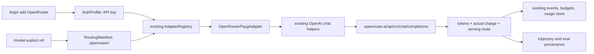

# OpenRouter provider integration plan

> [!NOTE]
> Design and research evidence only. This document does not enable a provider,
> perform a live request, or authorize spend. Implementation status belongs in
> the implementing PR and, if the architecture program adopts the work, its
> canonical roadmap ledger.

**Status:** Implemented and CI-verified in PR #3268; assigned to the v1.0.27 release train

**Research snapshot:** 2026-09-02

**Scope:** an explicit OpenRouter PAYG route for the GEODE runtime

## Decision

Add OpenRouter as an **optional inference router**, not as an alias for OpenAI
and not as a replacement for GEODE's direct Anthropic, OpenAI, Codex, or GLM
routes.

The smallest correct implementation is one `openrouter` provider composition
and one thin Chat Completions adapter built on GEODE's existing OpenAI-compatible
helpers. Do not add another registry, SDK, model-catalog service, OAuth flow, or
provider base class.

Before enabling the adapter, preserve two facts reported by the router through
GEODE's common response path:

1. the amount actually charged for the request; and
2. the model/provider that actually served it.

Without those facts, a dynamically routed model can be recorded as costing
`$0.00`, and a fallback can be attributed to the requested model rather than
the serving model. That would weaken runtime budget enforcement and evaluation
provenance.

## Official billing contract

OpenRouter's public contract is account-credit billing with model/provider
inference prices passed through. It says it does not add an inference markup,
but charges a fee when credits are purchased.

| Item | Public policy at the snapshot date | GEODE consequence |
|---|---|---|
| Shared-provider inference | The selected model/provider's published rate is charged. The final serving model determines fallback cost. | Do not maintain a second OpenRouter price table. Record the response charge. |
| Credit purchase | Standard PAYG card funding has a 5.5% platform fee, with an $0.80 minimum; crypto funding states a 5% fee. The terms currently set a $5 minimum purchase. | UI copy must distinguish inference cost from account-funding fees. |
| Credits and refunds | Credits are USD-denominated deposits deducted per request. Unused-credit refunds may be requested within 24 hours; platform fees are non-refundable and crypto payments are non-refundable. OpenRouter reserves the right to expire unused credits after one year. | Do not describe credits as permanent, cash, or a subscription allowance. |
| Free models | The free plan states 50 requests/day. The FAQ states 1,000 requests/day after purchasing at least $10 in credits. | `openrouter/free` is suitable for a smoke test, not a reliability or capacity promise. |
| PAYG catalogue | The pricing page currently advertises 500+ models and 80+ providers with high global limits. | Do not render the whole remote catalogue in the synchronous model picker. |
| Volume discounts | The FAQ says none are currently offered. | Do not promise volume pricing. |
| BYOK | The current policy is plan-dependent and measured by list-price inference cost: PAYG includes $25,000/month without a BYOK fee and Enterprise $200,000/month; usage above the allowance has a 5% fee. | Defer BYOK because upstream-key lifecycle and fallback are a separate credential feature, not part of a basic OpenRouter route. |
| Auto Router | The Auto Router documentation and the product-page overview say the response is priced at the routed model's rate. The same product-page FAQ currently calls Auto Router free. | The public page is internally inconsistent. Label it **variable cost** and treat per-response usage as charge authority. |

No stable dollar-denominated trial-credit grant is promised in the current
public pricing contract. The documented zero-cost test path is a free model or
`openrouter/free`, subject to its rate limits and provider data policy.

OpenRouter reports the total account charge in `usage.cost`, including the final
stream event, and exposes upstream inference cost in
`usage.cost_details.upstream_inference_cost`. It also reports reasoning and
cache-token details. GEODE must distinguish a missing cost (`None`) from an
observed zero charge (`0.0`). Static GEODE price estimates remain a fallback
only when the provider did not report a charge.

Provider routing is also part of the billing and reproducibility contract.
OpenRouter defaults to load balancing and permits fallbacks. Its request policy
can constrain provider order, allow/ignore lists, price ceilings, parameter
support, data collection, and Zero Data Retention (ZDR). A production-friendly
default is not automatically an evaluation-grade route:

- ordinary interactive use may allow router fallback and should display the
  model that actually served the call;
- official evaluations must pin the model and routing policy, require supported
  parameters, declare privacy constraints, and disable model fallback unless
  fallback is the measured treatment;
- `openrouter/openrouter/free` and `openrouter/openrouter/auto` must not produce an official fixed-model
  score.

OpenRouter says it retains basic request metadata but does not log prompt and
completion content by default. The selected upstream provider has its own data
policy, so account privacy settings, `data_collection`, and ZDR eligibility are
part of the route—not documentation decoration. A route that cannot satisfy a
declared privacy constraint must fail rather than silently relax it.

## Current GEODE boundary audit

```mermaid
flowchart LR
    UI["/login and /model"] --> Settings["Settings + AuthProfile"]
    Settings --> Manifest["RoutingManifest"]
    Manifest --> Registry["AdapterRegistry snapshot"]
    Registry --> Spec["ProviderSpec composition"]
    Spec --> Adapter["LLMAdapter"]
    Adapter --> Wire["Provider wire API"]
    Wire --> Result["AdapterCallResult"]
    Result --> Usage["ResponseUsage + TokenTracker"]
    Usage --> Events["diagnostics, budgets, artifacts"]
```

The apparent provider abstractions are not duplicate implementations:

| Owner | Existing responsibility | Verdict |
|---|---|---|
| `ProviderProfile` | model/provider identity and default-model key | Keep. |
| `CredentialRoute` | supported source, account selector, auth and billing identity | Keep. It declares a route; it does not own a secret. |
| `TransportSpec` | API shape, endpoint and transport capabilities | Keep. OpenRouter is a new composition, not a new abstraction. |
| `ProviderSpec` | immutable composition of those three records | Keep as the sole provider-variant catalogue. |
| `Plan` | operator-selected billing/endpoint bucket and mutable quota policy | Keep separate from provider declaration. |
| `AuthProfile` | credential material and credential lifecycle | Keep separate from both registries. |
| `LLMAdapter` plus optional protocols | normalized call contract and genuinely optional capabilities | Keep. Do not expand the base protocol for OpenRouter-only features. |
| `AdapterRegistry` | immutable generation-bound `(provider, source)` resolution | Keep. Its request/session `ContextVar` is scoped runtime state, not a service locator. |
| `ModelListingCapable` | optional remote catalogue discovery | Do not wire into the picker in V1. It is currently not a production UI dependency. |

### Planning-base measured gaps

1. `translate_chat_response()` retains token counts but drops OpenRouter's
   `usage.cost` and `cost_details`.
2. `TokenTracker` falls back to GEODE's static model-price table. An unknown
   OpenRouter model therefore records zero cost.
3. The current model picker is curated and synchronous. It does not consume
   `ModelListingCapable`, and it rejects an arbitrary typed model unless that
   model already appears in its profile rows.
4. `RoutingManifest` does not recognize the `openrouter/` namespace.
5. GEODE's provider fallback/equivalence logic and OpenRouter's internal
   routing are different authorities. Combining them would make route evidence
   ambiguous.

The implementation closes items 1–4 and preserves the separation in item 5.
It also aligns the exported compatibility inference helper with the manifest so
an `openrouter/...` model cannot be reclassified as its nested direct provider.

### Simplifications to preserve

- No `OpenRouterRegistry`, provider factory, or common router framework.
- No new Python dependency: the installed async OpenAI client already accepts a
  custom base URL, and the existing Chat Completions translation helpers cover
  the required wire shape.
- No bundled copy of OpenRouter's rapidly changing model/pricing catalogue.
- No OpenRouter entry in provider-equivalence groups. Direct providers must
  never silently cross into a third-party router.
- No inheritance from GEODE's OpenAI Responses adapter: doing so would falsely
  advertise OpenAI-hosted tools and Responses-specific behavior.
- No advanced routing form in the first UI. Request policy belongs in typed
  configuration and evaluation manifests until repeated interactive demand is
  measured.

## Frontier implementation evidence

| System | Current shape | Apply to GEODE |
|---|---|---|
| OpenClaw | Provider plugin over shared OpenAI Completions transport; API-key and OAuth onboarding; dynamic discovery with TTL and bundled fallback; provider-wide routing plus per-model overrides. | Adopt the explicit provider namespace and shared transport. Defer OAuth, dynamic catalogue, media, reasoning, and cache exceptions. |
| Pi | Small provider declaration with base URL, environment key, generated model list, and a shared OpenAI Completions API. | Closest V1 shape: explicit identity plus reused wire protocol. Do not add generated models yet. |
| OpenCode | Provider profile over a shared OpenAI Chat protocol, with a small provider-specific request/body layer. | Adopt the thin specialization; keep router options out of the generic adapter contract. |
| Hermes Agent | Provider plugin adds public catalogue caching, preferences, reasoning quirks, and session stickiness. | Treat accumulated exceptions as measured follow-ups, not V1 scaffolding. |
| Aider | Fetches and caches `/models`, strips the outer `openrouter/` name, and maps context/pricing into its existing model metadata. | Adopt only the outer-namespace rule. Defer eager catalogue caching and local pricing projection. |

The common pattern is not “OpenRouter is OpenAI.” It is “OpenRouter has its own
provider identity and policy, while reusing the OpenAI-compatible Chat
Completions wire protocol.”

## Target composition

### Responsibility split

| Concern | Owner | Rule |
|---|---|---|
| Provider selection | `RoutingManifest` | `openrouter/` resolves only to `openrouter`; unknown namespaces fail closed. |
| Secret | `AuthProfile` and existing credential resolution | Read `OPENROUTER_API_KEY`; do not place a key in provider metadata. |
| Endpoint and headers | `TransportSpec` plus adapter | Use OpenRouter's base URL and only documented attribution headers. |
| Wire translation | existing `_openai_common` helpers | Chat Completions only in V1. |
| Router-specific request options | adapter from `AdapterCallRequest.provider_options` | Validate an allowlist; never forward arbitrary configuration keys. |
| Actual charge | normalized usage | Provider-reported charge wins; static estimate is fallback. |
| Serving route | normalized result/diagnostic evidence | Preserve requested model, returned model, generation ID, and upstream provider when supplied. |
| Budget decision | existing tracker/limit code | Use the actual charge without creating an OpenRouter budget service. |
| Evaluation route policy | frozen evaluation manifest | Pin exact policy; do not rely on account defaults. |

### Model identity

GEODE's visible reference keeps the provider namespace:

| GEODE model reference | OpenRouter request model |
|---|---|
| `openrouter/anthropic/claude-...` | `anthropic/claude-...` |
| `openrouter/google/gemini-...` | `google/gemini-...` |
| `openrouter/openrouter/free` | `openrouter/free` |
| `openrouter/openrouter/auto` | `openrouter/auto` |

The adapter removes exactly one outer `openrouter/` namespace for ordinary
catalogue IDs. Router-owned IDs are preserved explicitly. This small mapping
must have a focused test; a generic model-ID normalization layer is not needed.

## UI plan

V1 uses the existing `/login` and `/model` surfaces.

1. `/login add` gains one PAYG choice: **OpenRouter**. It stores or discovers
   `OPENROUTER_API_KEY` through the existing API-key profile flow.
2. `/model` gains two curated rows:
   - `openrouter/openrouter/free` — labelled “free smoke; limited and dynamically routed”;
   - `openrouter/openrouter/auto` — labelled “dynamic route; variable cost.”
3. `/model` accepts an exact `openrouter/<provider>/<model>` reference without
   fetching hundreds of remote rows. Validation requires the registered
   namespace and a non-empty upstream model; typos must not fall back to
   OpenAI.
4. After a response, the bounded `LLM_CALL_ENDED` event records returned model,
   selected provider, routing strategy/attempt, and actual charge when supplied.
   A richer post-call status renderer remains deferred until an existing UI
   consumer needs those fields.
5. Advanced provider order, allow/ignore lists, ZDR, data-collection policy,
   price ceilings, and fallback toggles do not get a runtime form in V1.
   Ordinary use inherits the operator's OpenRouter account policy. Evaluation
   code may thread one validated, allowlisted policy into existing
   `provider_options`. Add persistent runtime config only when operators show a
   repeated need to override account policy.

Do not claim “free OpenRouter” globally. Only a zero-priced model/route or an
observed `usage.cost == 0` may be labelled free.

## Implementation sequence

| Order | GAP | Smallest change | Acceptance |
|---|---|---|---|
| P0-1 | Provider-reported cost is lost. | Add optional reported USD charge to normalized usage and let `TokenTracker` prefer it over static pricing. | `None` falls back; `0.0` remains zero; non-zero reported cost drives events, limits, and persisted usage. Existing providers are unchanged. |
| P0-2 | Serving-route evidence is lost. | Preserve only fields consumed by diagnostics/evaluation: requested model, returned model, generation ID, and upstream provider when supplied. | A fallback is attributable without exposing an unbounded raw response as artifact schema. |
| P0-3 | OpenRouter cannot resolve or authenticate. | Register one profile/credential/transport composition, one PAYG adapter, and `OPENROUTER_API_KEY`. Reuse the existing async client and Chat helpers. | Existing provider identities and wire-shape characterization remain green; missing credentials fail before network I/O. |
| P0-4 | Model namespace is absent. | Add explicit `openrouter/` routing and the focused model-ID mapping. | Unknown or malformed references fail closed; no OpenRouter equivalence/fallback into direct providers. |
| P1-1 | UI cannot select the provider. | Add `/login` choice, two curated `/model` rows, and exact-ref selection. | No catalogue network request is required to open the picker. Labels distinguish free smoke from variable cost. |
| P1-2 | Router policy is not frozen for evaluation. | **Partially implemented:** the adapter validates a bounded `provider_options["openrouter"]` allowlist and records the serving route. Wiring a specific evaluation manifest remains deferred until an evaluation consumer is selected. | Runtime calls fail closed on unknown policy keys. No `auto`/`free` result is published as a fixed-model score. |
| P2-1 | Remote catalogue convenience. | **Deferred.** Use `ModelListingCapable` only after measured demand for search, with TTL/cache/offline behavior. | Not a V1 dependency. |
| P2-2 | BYOK/OAuth and account quota UI. | **Deferred.** Establish upstream-key lifecycle, shared-capacity fallback, and billing tests first. | Not a V1 claim. |

P0-1 and P0-2 land before the provider is selectable. This prevents a period
where OpenRouter calls succeed but budgets or artifacts silently record the
wrong authority.

## Test and compatibility gates

The implementation PR must add focused, offline tests for:

- provider composition, route collision, source inference, and missing-key
  behavior;
- exact model-ID mapping including `openrouter/openrouter/free` and `openrouter/openrouter/auto`;
- request-body allowlisting and Chat Completions tool-call translation;
- non-streaming usage charge extraction (streaming is not advertised by the V1 adapter);
- `None`, zero, and non-zero provider-reported cost precedence;
- returned-model and fallback provenance;
- `/login` and `/model` selection, including malformed/unknown references;
- direct Anthropic/OpenAI/Codex/GLM regression characterization.

Then run the repository's ruff, format, mypy, import-contract, full non-live
pytest, and package/install gates. A free-model live smoke is optional and
requires explicit approval because it contacts an external service; it is not a
substitute for offline contract tests.

Local verification on 2026-09-02 passed the focused provider, auth, routing,
model-picker, usage, and event tests; the complete `scripts/preflight.sh` CI
mirror; and the 239-route static site build. No live OpenRouter request was
made. Such a request still requires an OpenRouter account and API key, even
when the selected route is zero-priced.

Rollback is bounded because OpenRouter is opt-in. Removing its registration and
UI rows must leave direct provider state and model references untouched. Stored
OpenRouter profiles should then fail with an explicit unsupported-provider
message rather than being interpreted as OpenAI profiles.

## Design gate

1. **What breaks without this?** OpenRouter is unavailable, and a naive adapter
   would mis-account dynamic-route spend and provenance.
2. **Can existing parts solve it?** Yes: existing provider composition,
   adapter registry, auth profiles, Chat helpers, UI, tracker, and artifacts.
   Only the measured gaps above need changes.
3. **Can fewer primitives solve it?** Yes. One provider composition and adapter
   are sufficient; a router framework or catalogue service is not.
4. **Will this behave differently from the apparent alternative?** Yes. A base
   URL override on the OpenAI Responses adapter would advertise the wrong API
   capabilities and erase OpenRouter's billing/routing identity.
5. **Is the pattern supported externally?** Yes. OpenClaw, Pi, OpenCode,
   Hermes, and Aider all preserve an OpenRouter provider identity while reusing
   an OpenAI-compatible transport.

## Primary sources

OpenRouter:

- [Pricing](https://openrouter.ai/pricing)
- [FAQ](https://openrouter.ai/docs/faq)
- [Terms of Service](https://openrouter.ai/terms)
- [PAYG fee and spend-control guide](https://openrouter.ai/blog/tutorials/team-spend-controls-setup/)
- [Usage accounting](https://openrouter.ai/docs/cookbook/administration/usage-accounting)
- [Model pricing fields](https://openrouter.ai/docs/guides/overview/models)
- [Provider routing](https://openrouter.ai/docs/guides/routing/provider-selection)
- [Model fallback](https://openrouter.ai/docs/guides/routing/model-fallbacks)
- [Auto Router](https://openrouter.ai/docs/guides/routing/routers/auto-router)
- [Auto Router announcement](https://openrouter.ai/blog/announcements/introducing-the-new-auto-router/)
- [BYOK](https://openrouter.ai/docs/guides/overview/auth/byok)
- [Guardrails](https://openrouter.ai/docs/guides/features/guardrails/overview)
- [Zero Data Retention](https://openrouter.ai/docs/guides/features/zdr)
- [Data collection policy](https://openrouter.ai/docs/guides/privacy/data-collection)
- [Free model variant](https://openrouter.ai/docs/guides/routing/model-variants/free)
- [Chat Completions API](https://openrouter.ai/docs/api/api-reference/chat/create-a-chat-completion)

Reference implementations:

- [OpenClaw provider guide](https://github.com/openclaw/openclaw/blob/main/docs/providers/openrouter.md)
- [OpenClaw provider catalogue](https://github.com/openclaw/openclaw/blob/main/extensions/openrouter/provider-catalog.ts)
- [Pi OpenRouter provider](https://github.com/earendil-works/pi/blob/main/packages/ai/src/providers/openrouter.ts)
- [OpenCode OpenRouter provider](https://github.com/anomalyco/opencode/blob/dev/packages/llm/src/providers/openrouter.ts)
- [Hermes Agent OpenRouter plugin](https://github.com/NousResearch/hermes-agent/blob/main/plugins/model-providers/openrouter/__init__.py)
- [Aider OpenRouter metadata loader](https://github.com/Aider-AI/aider/blob/main/aider/openrouter.py)
