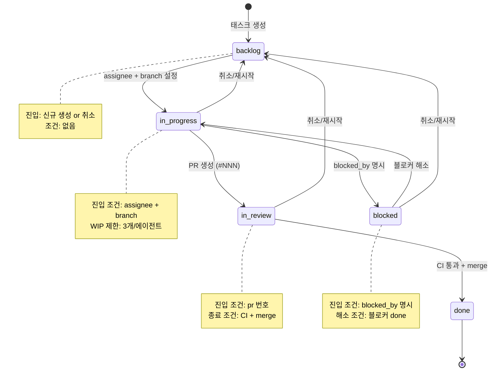
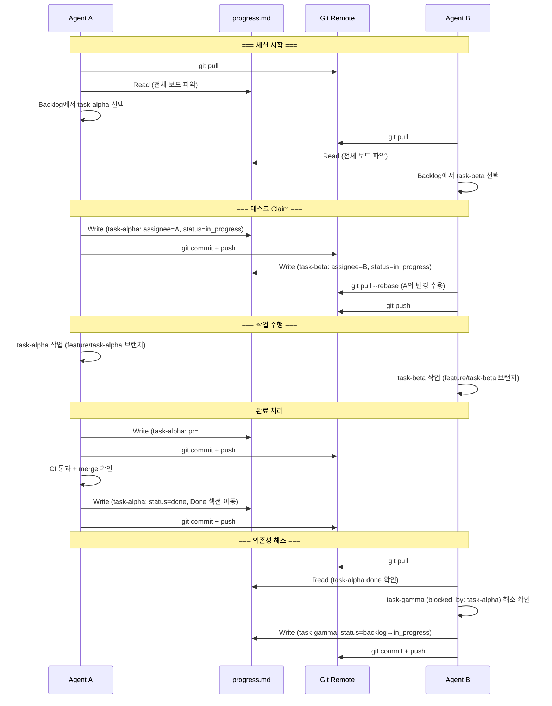

# 칸반 시스템 설계 — 멀티 에이전트 비동기 작업 조율

> 작성일: 2026-03-18
> 상태: Draft
> 관련: `docs/progress.md` (현행 칸반), `docs/plans/md-based-management-audit.md` (감사)

---

## 1. AS-IS 분석

멀티 에이전트 작업 관리에 사용되는 4가지 접근법을 비교한다.

### 1.1 Claude Code Tasks

Anthropic Claude Code의 내장 태스크 관리 시스템. API 기반 DAG.

```
TaskCreate(description, priority) → task_id
TaskUpdate(task_id, status, result) → ack
TaskGet(task_id) → TaskRecord
TaskList(filter) → TaskRecord[]
```

**구조**: 파일시스템 영속 (`.claude/tasks/`), DAG 의존성 관리, 세션 내 수명.

| 장점 | 한계 |
|------|------|
| API로 조작 → 프로그래밍 가능 | 세션 종료 시 상태 소실 |
| DAG 의존성 → 순서 보장 | 에이전트 간 공유 불가 (단일 세션) |
| 상태 전이가 코드로 강제 | 사람이 읽기 불편 (JSON) |

### 1.2 GEODE progress.md (현행)

Markdown 테이블 기반 칸반 보드. `docs/progress.md` 단일 파일.

```
## Kanban
### Backlog    → 대기 태스크
### In Progress → 진행 중 (assignee + branch)
### In Review   → PR 생성, CI 대기
### Done        → 완료 (PR merge)
### Blocked     → 블로커 발생
```

**현행 규칙** (progress.md 하단):
- task_id: 케밥 케이스, 고유, 변경 불가
- 상태 흐름: Backlog -> In Progress -> In Review -> Done
- 갱신 시점: 세션 시작 시 읽기, 세션 종료 시 쓰기

| 장점 | 한계 |
|------|------|
| 사람이 읽기 쉬움 (Markdown) | 상태 전이 규칙이 관례 수준 (강제 불가) |
| Git으로 변경 이력 추적 | 필드 스키마가 암묵적 (테이블 열 불일치 가능) |
| 세션 간 영속 | 충돌 해결이 수동 (merge conflict) |
| GAP Registry 통합 | 자동화 인터페이스 부재 |

### 1.3 tick-md

단일 Markdown 파일로 멀티 에이전트 비동기 조율. 파일 자체가 통신 채널.

```markdown
<!-- tick-md protocol -->
## Agent: researcher
Status: working
Current: Gathering data on topic X

## Agent: writer
Status: idle
Waiting-for: researcher

## Tasks
- [x] Define scope (@researcher, done)
- [ ] Gather data (@researcher, in-progress)
- [ ] Write draft (@writer, blocked-by: gather-data)
```

**핵심 아이디어**: 에이전트가 파일을 폴링하여 자신의 섹션을 갱신. 다른 에이전트의 섹션을 읽어 상태를 파악. 파일 잠금 대신 섹션 소유권으로 충돌 방지.

| 장점 | 한계 |
|------|------|
| 인프라 비용 0 (파일 1개) | 폴링 오버헤드 |
| 에이전트 간 암묵적 통신 | 스키마 강제 불가 |
| Git diff로 조율 이력 가시화 | 에이전트 수 증가 시 파일 비대 |

### 1.4 Agent Kanban

YAML frontmatter + 개별 태스크 파일 방식.

```
.agentkanban/
├── config.yaml          # 보드 설정 (컬럼, WIP 제한)
└── tasks/
    ├── task-001.md      # 개별 태스크 파일
    ├── task-002.md
    └── task-003.md
```

각 태스크 파일:
```yaml
---
id: task-001
title: "API 연동 구현"
status: in_progress
assignee: "@agent-alpha"
priority: P1
depends_on: []
created: 2026-03-15
---

# task-001: API 연동 구현

## Description
...

## Progress Log
- 2026-03-15: 스캐폴딩 완료
- 2026-03-16: 엔드포인트 3/5 구현
```

| 장점 | 한계 |
|------|------|
| 태스크별 상세 이력 기록 가능 | 파일 수 증가 → 관리 부담 |
| YAML frontmatter → 기계 파싱 용이 | 전체 보드 조망이 어려움 (N개 파일 순회) |
| Git diff가 태스크 단위로 깨끗 | SOT가 분산 → 일관성 유지 비용 |

### 1.5 비교 요약

| 속성 | Claude Code Tasks | progress.md | tick-md | Agent Kanban |
|------|:-----------------:|:-----------:|:-------:|:------------:|
| 영속성 | 세션 내 | 세션 간 | 세션 간 | 세션 간 |
| SOT 위치 | 메모리 + JSON | 단일 .md | 단일 .md | N개 .md |
| 사람 가독성 | 낮음 | 높음 | 중간 | 높음 |
| 기계 파싱 | API | 테이블 파싱 | 섹션 파싱 | YAML |
| 멀티 에이전트 | 불가 | 관례 | 설계됨 | 가능 |
| 상태 전이 강제 | API 수준 | 없음 | 없음 | config |
| 확장성 | 낮음 | 중간 | 낮음 | 높음 |

---

## 2. 설계 원칙 (Karpathy 패턴 적용)

### P1. 제약 기반 설계 — 상태 전이를 enum으로 제한

에이전트가 임의의 상태를 만들어내는 것을 원천 차단한다. 허용된 상태 5개, 허용된 전이 6개만 존재한다.

```python
# 허용된 상태 (이외의 값은 파싱 시 거부)
Status = Literal["backlog", "in_progress", "in_review", "done", "blocked"]

# 허용된 전이 (이외의 전이는 거부)
VALID_TRANSITIONS: dict[Status, set[Status]] = {
    "backlog":     {"in_progress"},
    "in_progress": {"in_review", "blocked"},
    "in_review":   {"done"},
    "blocked":     {"in_progress"},
    # 모든 상태에서 backlog로 복귀 (취소/재시작)
}
UNIVERSAL_FALLBACK = "backlog"
```

**위반 시**: 에이전트가 `status: wip` 같은 비표준 값을 쓰면, 다음 읽기 시 `backlog`로 자동 교정하고 경고를 남긴다.

### P2. 단일 파일 제약 — progress.md 1개가 SOT

Agent Kanban의 N개 파일 분산 방식을 명시적으로 거부한다. `progress.md` 1개 파일이 칸반 보드의 유일한 진실 원천(SOT)이다.

**근거**:
- 전체 보드를 한 번의 `Read`로 파악 (컨텍스트 효율)
- Git diff 1개로 보드 변경 전체를 추적
- 에이전트 간 동기화 지점이 1개 (충돌 표면 최소)
- 파일 수 증가에 따른 관리 부담 없음

**trade-off**: 태스크별 상세 이력은 `docs/plans/{task_id}.md` 또는 PR 본문에 기록한다. progress.md에는 현재 상태만.

### P7. program.md 인터페이스 — 보드 규칙은 설정 파일에

보드의 컬럼 구성, WIP 제한, 아카이브 정책 등의 규칙은 코드에 하드코딩하지 않는다. progress.md 하단의 `## 규칙` 섹션이 에이전트의 행동 지시서다.

```markdown
## 규칙

1. **task_id**: 케밥 케이스, 고유, 변경 불가
2. **상태 흐름**: backlog → in_progress → in_review → done
3. **전이 조건**: in_progress 시 assignee 필수, in_review 시 PR 필수
4. **WIP 제한**: In Progress 최대 3개 / 에이전트
5. **아카이브**: Done 항목은 30일 후 docs/progress-archive/ 이동
```

에이전트는 이 규칙 섹션을 읽고 준수한다. 규칙을 변경하려면 코드가 아닌 이 섹션을 수정한다.

### P8. Dumb Platform — 보드는 저장만

칸반 보드(progress.md)는 수동적 데이터스토어다. 보드 자체는 스케줄링, 알림, 자동 전이를 수행하지 않는다.

```
Dumb Platform (progress.md):
  - 태스크 목록 저장
  - 상태 값 보유
  - 규칙 텍스트 보유 (but 실행하지 않음)

Smart Agent (Claude Code / GEODE):
  - progress.md 읽기 → 현재 보드 파악
  - 규칙 해석 → 전이 조건 판단
  - 태스크 선택 → assignee 기록
  - 작업 완료 → 상태 갱신 + commit
```

**조율 로직은 보드가 아닌 에이전트의 프롬프트에 존재한다.** 보드는 읽기/쓰기 인터페이스만 제공한다.

### P10. Simplicity Selection — 필드 최소화

태스크 스키마에 "있으면 좋겠다" 수준의 필드를 추가하지 않는다. 실제로 에이전트가 매번 참조하는 필드만 유지한다.

**20% 규칙**: 전체 세션의 20% 이상에서 참조되지 않는 필드는 스키마에서 제거한다.

| 유지 (매 세션 참조) | 제거 후보 (간헐적) |
|:---:|:---:|
| task_id, subject, status | tags, labels |
| priority, assignee | estimated_hours |
| branch, pr | story_points |
| created, updated | due_date |

---

## 3. TO-BE 칸반 스키마

### 3.1 태스크 필드 정의

```yaml
# 필수 필드
task_id: kebab-case-unique-id     # 케밥 케이스, 생성 후 불변
subject: "작업 제목"               # 사람이 읽을 수 있는 1줄 설명
status: backlog                    # backlog | in_progress | in_review | done | blocked
priority: P1                      # P0 (긴급) | P1 (높음) | P2 (보통)
created: 2026-03-18               # 생성일 (YYYY-MM-DD)
updated: 2026-03-18               # 마지막 갱신일

# 조건부 필수 (상태 전이 시 필요)
assignee: "@github_username"       # in_progress 전이 시 필수
branch: "feature/xxx"              # in_progress 전이 시 필수
pr: "#NNN"                         # in_review 전이 시 필수
blocked_by:                        # blocked 전이 시 필수
  - other-task-id

# 선택 필드
plan: "docs/plans/{task_id}.md"    # 상세 설계 문서 경로
gap_id: "gap-xxx"                  # GAP Registry 연결
```

### 3.2 필드 제약

| 필드 | 타입 | 제약 |
|------|------|------|
| `task_id` | string | `^[a-z0-9]+(-[a-z0-9]+)*$` (케밥 케이스) |
| `status` | enum | 5개 값만 허용 |
| `priority` | enum | P0, P1, P2 |
| `assignee` | string | `^@[a-zA-Z0-9-]+$` (GitHub username) |
| `branch` | string | `^(feature|fix|hotfix)/` 접두사 |
| `pr` | string | `^#\d+$` |
| `blocked_by` | list[string] | 존재하는 task_id만 허용 |
| `gap_id` | string | GAP Registry에 존재하는 ID만 허용 |
| `created` | date | YYYY-MM-DD, 불변 |
| `updated` | date | YYYY-MM-DD, 갱신 시 자동 반영 |

---

## 4. 상태 전이 규칙

### 4.1 전이 테이블

| From | To | 전이 조건 | 부수 효과 |
|------|----|----------|----------|
| `backlog` | `in_progress` | `assignee` 필수, `branch` 필수 | `updated` 갱신 |
| `in_progress` | `in_review` | `pr` 필수 | `updated` 갱신 |
| `in_review` | `done` | CI 통과 + PR merge 확인 | `updated` 갱신, Done 섹션으로 이동 |
| `in_progress` | `blocked` | `blocked_by` 1개 이상 명시 | `updated` 갱신, Blocked 섹션으로 이동 |
| `blocked` | `in_progress` | `blocked_by` 태스크 모두 `done` | `blocked_by` 제거, `updated` 갱신 |
| `*` (any) | `backlog` | 사유 기록 (비고 컬럼) | 취소/재시작, `assignee`/`branch`/`pr` 초기화 |

### 4.2 금지 전이

다음 전이는 허용되지 않는다:

- `backlog` -> `in_review` (작업 시작 없이 리뷰 불가)
- `backlog` -> `done` (작업 없이 완료 불가)
- `done` -> `in_progress` (완료된 태스크 재개 불가 — 새 태스크 생성)
- `in_review` -> `in_progress` (리뷰 중 역행 불가 — blocked 경유)
- `blocked` -> `in_review` (블로커 해소 후 in_progress 경유 필수)

### 4.3 상태 전이 다이어그램



---

## 5. 멀티 에이전트 조율 프로토콜

### 5.1 프로토콜 개요

에이전트 간 조율은 progress.md 파일을 매개로 한 비동기 프로토콜이다. 직접적인 에이전트 간 통신은 없다.

```
Agent A                   progress.md                  Agent B
   │                          │                           │
   ├── Read ─────────────────►│                           │
   │   (보드 전체 파악)        │                           │
   │                          │                           │
   ├── Write (assignee=A) ───►│                           │
   │   (태스크 claim)          │                           │
   │                          │                           │
   ├── git commit + push ────►│                           │
   │                          │◄──────────── Read ────────┤
   │                          │      (A가 claim한 것 확인)  │
   │                          │                           │
   │   [A 작업 수행]           │       [B 다른 태스크 선택]  │
   │                          │                           │
   ├── Write (status=done) ──►│                           │
   ├── git commit + push ────►│                           │
   │                          │◄──────────── Read ────────┤
   │                          │    (A 완료 확인, 의존 해소)  │
```

### 5.2 세션 라이프사이클

#### 세션 시작

1. `progress.md` 읽기 → 현재 보드 상태 전체 파악
2. 자신에게 할당된 `in_progress` 태스크가 있으면 이어서 작업
3. 없으면 `backlog`에서 우선순위 높은 태스크 선택
4. `assignee` 설정 + `status` -> `in_progress` + `branch` 기록
5. `updated` 날짜 갱신
6. git commit: `"chore: claim task {task_id}"`

#### 작업 수행

1. 해당 브랜치에서 코드 작업 수행
2. 중간 진행 상황은 PR 본문 또는 `docs/plans/{task_id}.md`에 기록
3. progress.md는 상태 전이 시에만 갱신 (작업 중 불필요한 갱신 금지)

#### 작업 완료

1. PR 생성 -> `pr` 필드에 번호 기록
2. `status` -> `in_review`
3. CI 통과 + merge 확인
4. `status` -> `done` + Done 섹션으로 이동
5. git commit: `"chore: complete task {task_id}"`

#### 세션 종료

1. 현재 작업 상태를 progress.md에 반영
2. 미완료 태스크: `in_progress` 유지 (다음 세션에서 재개)
3. git commit + push

### 5.3 충돌 방지 규칙

| 규칙 | 설명 | 강제 수준 |
|------|------|:---------:|
| **소유권 존중** | `assignee`가 있는 태스크는 다른 에이전트가 수정하지 않음 | 관례 |
| **WIP 제한** | 에이전트당 `in_progress` 최대 3개 | 관례 |
| **Read-Before-Write** | 갱신 전 반드시 최신 progress.md를 읽음 | 필수 |
| **Atomic Commit** | progress.md 갱신은 단일 git commit으로 | 필수 |
| **Pull-Before-Push** | push 전 `git pull --rebase`로 원격과 동기화 | 필수 |
| **Conflict Resolution** | merge conflict 발생 시: 자신의 섹션만 유지, 상대 변경 수용 | 관례 |

### 5.4 멀티 에이전트 조율 시퀀스 다이어그램



---

## 6. GAP Registry 통합

### 6.1 GAP-태스크 연결 구조

GAP Registry는 progress.md 내에 동거한다 (단일 파일 SOT 원칙). 각 GAP은 `gap_id`로 식별되며, Backlog 태스크의 `gap_id` 필드로 1:1 또는 1:N 연결된다.

```
GAP Registry                        Kanban Backlog
┌────────────────────┐              ┌────────────────────────┐
│ gap-failover       │──────────────│ model-failover         │
│ gap-ctx-overflow   │──────────────│ context-overflow       │
│ gap-announce       │──────────────│ subagent-announce      │
│ gap-cost-approval  │──── (없음)    │                        │
└────────────────────┘              └────────────────────────┘
```

### 6.2 자동화 규칙

| 이벤트 | 동작 |
|--------|------|
| GAP 해소 (관련 PR merge) | GAP을 Resolved 섹션으로 이동, 해소 PR + 해소일 기록 |
| 신규 GAP 발견 | GAP Registry에 항목 추가 + Backlog에 태스크 자동 생성 |
| 태스크 done + gap_id 존재 | 해당 GAP의 Resolved 여부 확인 → 미해소 시 gap 상태 유지 |
| GAP 삭제 | 관련 Backlog 태스크의 `gap_id` 필드 제거 (태스크 자체는 유지) |

### 6.3 GAP 우선순위와 태스크 우선순위 정합

GAP의 P1/P2 분류와 태스크의 P0/P1/P2 분류는 독립적이다. 단, 다음 가이드라인을 따른다:

| GAP 우선순위 | 권장 태스크 우선순위 | 근거 |
|:---:|:---:|------|
| P1 (High) | P0 또는 P1 | 프론티어 대비 핵심 결함 |
| P2 (Medium) | P1 또는 P2 | 개선 사항 |
| Resolved | N/A | 태스크도 done |

---

## 7. Claude Code Tasks와의 상호운용

### 7.1 이중 레이어 구조

```
┌──────────────────────────────────────────────────────┐
│  세션 간 (Inter-session): progress.md                  │
│  ─ Markdown 칸반 보드                                  │
│  ─ 에이전트/세션 간 공유                                │
│  ─ Git으로 영속                                        │
│  ─ 사람이 읽고 편집 가능                                │
├──────────────────────────────────────────────────────┤
│  세션 내 (Intra-session): Claude Code Tasks            │
│  ─ API 기반 DAG                                       │
│  ─ 세션 내 태스크 분해 + 병렬 실행                      │
│  ─ 메모리 기반 (세션 종료 시 소멸)                      │
│  ─ 프로그래밍 가능                                     │
└──────────────────────────────────────────────────────┘
```

### 7.2 동기화 프로토콜

#### 세션 시작 시 (progress.md -> Tasks)

```
1. progress.md 읽기
2. 자신에게 할당된 in_progress 태스크 확인
3. 해당 태스크를 Claude Code Tasks에 TaskCreate
4. plan 문서가 있으면 세부 단계를 sub-task로 분해
```

#### 세션 종료 시 (Tasks -> progress.md)

```
1. 완료된 Tasks를 progress.md에 반영
   - TaskStatus.done → progress.md in_review 또는 done
   - PR 번호 기록
2. 미완료 Tasks → progress.md 상태 유지 (in_progress)
3. 새로 발견된 작업 → progress.md Backlog에 추가
4. git commit + push
```

#### 동기화 규칙

| 상황 | Tasks 상태 | progress.md 반영 |
|------|-----------|-----------------|
| PR 생성 완료 | done | `in_review` + pr 번호 |
| PR merge 완료 | done | `done` + Done 섹션 이동 |
| 작업 중단 (세션 종료) | in_progress | `in_progress` 유지 |
| 블로커 발견 | blocked | `blocked` + blocked_by |
| 새 작업 발견 | 신규 생성 | `backlog`에 추가 |

---

## 8. progress.md 실제 예시

```markdown
# GEODE Progress Board

> 멀티 에이전트 공유 칸반 보드. 모든 세션/에이전트가 이 파일을 읽고 갱신한다.
> 마지막 갱신: 2026-03-18

---

## Kanban

### Backlog

| task_id | subject | priority | plan | gap_id | 비고 |
|---------|---------|:--------:|------|--------|------|
| model-failover | Model Failover 자동화 — FALLBACK_CHAIN 자동 전환 | P1 | — | gap-failover | OpenClaw Failover 패턴 |
| context-overflow | Context Overflow Detection — Token 초과 자동 압축 | P1 | — | gap-ctx-overflow | Karpathy P6 |
| write-fallback | WRITE_TOOLS 거부 후 fallback 경로 | P2 | — | gap-write-fallback | Claude Code Permission 패턴 |

### In Progress

| task_id | subject | assignee | branch | created | updated | 비고 |
|---------|---------|----------|--------|---------|---------|------|
| subagent-announce | Sub-agent Announce — Parent 결과 자동 주입 | @mangowhoiscloud | feature/subagent-announce | 2026-03-18 | 2026-03-18 | OpenClaw Spawn+Announce |

### In Review

| task_id | subject | pr | assignee | CI | 비고 |
|---------|---------|-----|----------|-----|------|
| mcp-lifecycle | MCP Adapter Lifecycle — startup/shutdown hook | #260 | @mangowhoiscloud | pass | orphan 방지 |

### Done (2026-03-18)

| task_id | subject | pr | assignee | completed |
|---------|---------|-----|----------|-----------|
| nl-router-delete | nl_router.py 완전 삭제 + v0.19.1 릴리스 | #255->#256 | @mangowhoiscloud | 2026-03-18 |
| docs-sync-final | 문서 싱크 + README 수치 + progress.md | #251->#252 | @mangowhoiscloud | 2026-03-18 |

### Blocked

| task_id | subject | blocked_by | assignee | 사유 |
|---------|---------|-----------|----------|------|
| policy-6layer | 6-계층 Policy Chain 확대 | subagent-announce | @mangowhoiscloud | Announce 패턴 선행 필요 |

---

## GAP Registry

프론티어 대비 누적 GAP. 해소되면 Resolved로 이동.

### P1 (High)

| gap_id | 설명 | 출처 | 관련 task_id |
|--------|------|------|-------------|
| gap-failover | Model Failover 자동 전환 | OpenClaw | model-failover |
| gap-ctx-overflow | Token 초과 자동 압축 | OpenClaw + Karpathy P6 | context-overflow |

### P2 (Medium)

| gap_id | 설명 | 출처 | 관련 task_id |
|--------|------|------|-------------|
| gap-write-fallback | WRITE 거부 후 대안 경로 | Claude Code | write-fallback |

### Resolved

| gap_id | 해소 PR | 해소일 |
|--------|---------|--------|
| gap-gateway | #241->#242 | 2026-03-18 |
| gap-nl-router | #243->#244, #255->#256 | 2026-03-18 |

---

## Metrics

| 항목 | 값 | 갱신일 |
|------|-----|--------|
| Version | 0.19.1 | 2026-03-18 |
| Modules | 166 | 2026-03-18 |
| Tests | 2505 | 2026-03-18 |

---

## 규칙

1. **task_id**: 케밥 케이스, 고유, 변경 불가
2. **상태 흐름**: `backlog -> in_progress -> in_review -> done` (역방향 시 blocked 경유)
3. **전이 조건**: in_progress 시 assignee+branch 필수, in_review 시 PR 필수
4. **WIP 제한**: In Progress 최대 3개 / 에이전트
5. **담당**: GitHub 계정 (`@username`)
6. **갱신 시점**: 세션 시작 시 읽기, 세션 종료 시 쓰기
7. **plan 연결**: `docs/plans/{task_id}.md` 경로로 연결
8. **GAP 연결**: GAP Registry의 `gap_id`와 Backlog의 `task_id` 매핑
9. **Done 이력**: 날짜별 그룹핑, 30일 초과 시 아카이브 (`docs/progress-archive/`)
10. **충돌 방지**: assignee가 있는 태스크는 다른 에이전트가 수정하지 않음
```

---

## 9. 설계 판단 기록

### 9.1 왜 단일 파일인가 (vs Agent Kanban 분산 파일)

| 관점 | 단일 파일 (progress.md) | 분산 파일 (.agentkanban/tasks/*.md) |
|------|:---:|:---:|
| 전체 보드 조망 | 1회 Read | N회 Read (glob + parse) |
| Git diff 가독성 | 1파일 diff | N파일 diff |
| 충돌 표면적 | 1파일 (테이블 행 수준) | N파일 (파일 수준) |
| 태스크 상세 이력 | 별도 plan 문서 필요 | 파일 내 기록 가능 |
| 에이전트 컨텍스트 비용 | 낮음 (1회 Read) | 높음 (N회 Read) |
| 스케일링 한계 | ~50 태스크 (테이블 비대) | 수백 태스크 가능 |

**결정**: GEODE의 현재 규모(Backlog ~10개, In Progress ~3개)에서 단일 파일이 최적. 50개 이상으로 증가 시 아카이브 정책으로 대응.

### 9.2 왜 Markdown 테이블인가 (vs YAML frontmatter)

| 관점 | Markdown 테이블 | YAML frontmatter |
|------|:---:|:---:|
| 사람 가독성 | 높음 (GitHub 렌더링) | 중간 |
| 기계 파싱 | 가능 (정규식) | 용이 (표준 파서) |
| 편집 용이성 | 높음 (텍스트 에디터) | 높음 |
| Git diff | 행 단위 차이 명확 | 필드 단위 차이 명확 |

**결정**: GitHub에서 progress.md를 열면 바로 보드가 보이는 UX를 우선. Markdown 테이블 유지.

### 9.3 왜 강제가 아닌 관례인가

상태 전이 규칙을 코드로 강제(API 게이트)할 수 있으나, Dumb Platform 원칙(P8)에 따라 보드 자체는 검증하지 않는다. 에이전트가 규칙 섹션을 읽고 스스로 준수한다.

**trade-off**: 에이전트가 규칙을 위반할 수 있으나, 위반 시 다음 에이전트가 읽는 시점에 교정 가능. 검증 코드 복잡성 vs 실제 위반 빈도를 고려하면 관례 수준이 적절.

---

## 10. 향후 확장

| 단계 | 내용 | 시점 |
|------|------|------|
| Phase 1 | 현행 progress.md에 스키마 + 규칙 반영 | 즉시 |
| Phase 2 | 세션 시작/종료 시 자동 동기화 Hook | tasks API 안정화 후 |
| Phase 3 | progress.md 파서 + 검증기 (lint) | 태스크 30개 이상 시 |
| Phase 4 | 아카이브 자동화 (30일 초과 Done 이동) | 운영 안정화 후 |

---

## References

- `docs/progress.md` — 현행 칸반 보드 (이 설계의 적용 대상)
- `.claude/skills/karpathy-patterns/SKILL.md` — P1, P2, P7, P8, P10 원칙
- `.claude/skills/openclaw-patterns/SKILL.md` — Lane Queue, Coalescing 패턴
- `docs/plans/md-based-management-audit.md` — .md 기반 관리 체계 감사
- `docs/plans/geode-enhancement-plan.md` — 고도화 계획 (Workflow Persistence)
