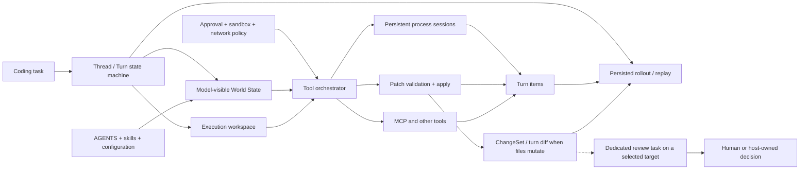

# Codex Runtime Evolution and GEODE Coding-Agent Modernization

- Date: 2026-08-15
- Status: RESEARCHED — design evidence, not an architecture execution SOT
- GEODE code baseline: `origin/develop@27f52ff06ce1957f46c63a40d3c718398f518e24`
- Codex source baseline: `openai/codex@23094236acac6fdc22f67a408ea8ccb8fac8e6e1`

## 1. Question and Decision Boundary

This note asks two separate questions:

1. Why is Codex currently more mature than GEODE as a coding-agent runtime?
2. Which systems are more mature than Codex on other agent-runtime axes, and
   what should GEODE adopt from each of them?

The answer is not that Codex has a better generic agent loop. Codex has spent
its development history turning a terminal coding loop into a **coding-task
operating substrate**: durable thread and turn state, execution workspaces,
process sessions, centralized approval and sandboxing, patch and diff
semantics, dedicated review tasks, and replayable model-visible world state.

GEODE has a different center of gravity. It is stronger as a
provider-agnostic autonomous-agent and evaluation harness: typed roles,
memory and compaction, append-only evidence, approval records, hooks,
preregistered evaluation, and explicit promotion authority. Those strengths
should remain authoritative rather than being replaced by a Codex clone.

The current perspective is therefore:

> Codex is the stronger coding execution plane. Claude Code is the stronger
> programmable governance surface. OpenClaw is the stronger always-on control
> plane. autoresearch is the clearer bounded optimization protocol. GEODE is
> the stronger measurement and promotion-provenance plane.

The cost of implementation is intentionally not used as a selection
criterion in this note. Dependency order, safety, reproducibility, and
coherent authority boundaries still constrain the design.

This document does not authorize implementation. Any runtime change described
here must follow the exact governance sequence in
[`docs/architecture/extensibility-roadmap.md`](../architecture/extensibility-roadmap.md):
a registration PR records the GAP without authorizing work, a later readiness
reconciliation marks a dependency-satisfied package `READY`, a separate claim
PR records ownership, and only then may its implementation worktree be
allocated.

## 2. Evidence Boundary

### Codex

- latest source inspected:
  [`23094236a`](https://github.com/openai/codex/commit/23094236acac6fdc22f67a408ea8ccb8fac8e6e1),
  2026-08-14
- latest stable release inspected:
  [`rust-v0.147.0`](https://github.com/openai/codex/releases/tag/rust-v0.147.0),
  2026-08-07
- locally installed CLI observed: `0.145.0`
- official product and protocol documentation:
  [App Server](https://learn.chatgpt.com/docs/app-server),
  [approvals and security](https://learn.chatgpt.com/docs/agent-approvals-security),
  [AGENTS.md](https://learn.chatgpt.com/docs/agent-configuration/agents-md),
  and [Git worktrees](https://learn.chatgpt.com/docs/environments/git-worktrees)

Source-head behavior is not claimed as behavior of the older local CLI.

### Other systems

- Claude Code claims use official product contracts rather than a source audit:
  [hooks](https://code.claude.com/docs/en/hooks),
  [permissions](https://code.claude.com/docs/en/permissions),
  [memory](https://code.claude.com/docs/en/memory), and
  [worktrees](https://code.claude.com/docs/en/worktrees).
- OpenClaw claims are pinned to
  [`621220aea`](https://github.com/openclaw/openclaw/commit/621220aea9baa22b002be1f4cd10230be2767f3d).
- autoresearch claims are pinned to
  [`228791fb`](https://github.com/karpathy/autoresearch/commit/228791fb499afffb54b46200aca536f79142f117).
- Traditional systems references are used as design lenses, not as claims
  that those systems are coding agents:
  [Temporal durable execution](https://docs.temporal.io/),
  [Bazel hermeticity](https://bazel.build/concepts/hermeticity),
  [Language Server Protocol](https://microsoft.github.io/language-server-protocol/),
  and the draft
  [Agent Host Protocol](https://microsoft.github.io/agent-host-protocol/specification/overview.html).

No live model, account, quota, or benchmark call was made for this research.

## 3. Codex Evolution: From Terminal Loop to Coding-Task Substrate

Codex did not become mature by adding sub-agents to a chat loop. Its decisive
changes progressively made execution state explicit and reusable across CLI,
server, desktop, review, and collaboration surfaces.

| Period | Structural change | Evidence | Interpretation |
|---|---|---|---|
| 2025-04-16 | Initial TypeScript/Ink CLI already included an agent loop, shell execution, `apply_patch`, Seatbelt sandboxing, approvals, and rollout persistence | [initial commit](https://github.com/openai/codex/commit/59a180ddec4adaf9760972cdb1eb89f06a81be8b) | The original product thesis was already `loop + tools + policy`, not chat-only code generation. |
| 2025-04-24 to 08-08 | Rust implementation entered eight days after launch, then gradually replaced TypeScript | [Rust import](https://github.com/openai/codex/commit/31d0d7a305305ad557035a2edcab60b6be5018d8), [TypeScript removal](https://github.com/openai/codex/commit/408c7ca142689136d887676def1bf41ea80bb2a9), [`v0.20.0`](https://github.com/openai/codex/tree/rust-v0.20.0), [official rewrite discussion](https://github.com/openai/codex/discussions/1174) | The stated rewrite goals were cross-platform stability, security, performance, and extensibility; the migration subsequently accumulated native sandbox and execution-policy machinery. |
| 2025-05 | Cloud Codex introduced isolated sandboxes, parallel tasks, and repository instructions | [Introducing Codex](https://openai.com/index/introducing-codex/) | Parallel work and repository-aware execution became product requirements before desktop. |
| 2025-08 to 09 | Turn-wide diff tracking, unified execution, and review became core runtime concepts | [turn diff](https://github.com/openai/codex/commit/1f3318c1c5b83e29b6d6e61eb2bf7d599581023e), [unified exec](https://github.com/openai/codex/commit/c09ed74a163ecea69c32d61ab2bfa1c8490eb611), [review core](https://github.com/openai/codex/commit/90a0fd342f5dc678b63d2b27faff7ace46d4af51) | Code mutation, process control, and review stopped being UI conventions and became reusable runtime services. |
| 2025-09 to 11 | MCP and App Server separated; Thread, Turn, streamed Item, approval, review, and diff became documented, client-facing App Server v2 types | [server split](https://github.com/openai/codex/commit/d9dbf4882879577ae8a9d81946994b325e359ed7), [Thread API](https://github.com/openai/codex/commit/2ab1650d4d73b789cdd5b76a0debb8d9d8f0e7d0), [Turn API](https://github.com/openai/codex/commit/6582554926e9c474afc287c091039fdaa2eacecd), [Item lifecycle](https://github.com/openai/codex/commit/e357fc723d144cbf8a79cc3f5e59b396ef2791bd), [command approval](https://github.com/openai/codex/commit/cecbd5b0212a2f849ea71f0f528950947bdf8156), [review](https://github.com/openai/codex/commit/8ddae8cde36443716e7db1e8fa57ef2b5e77882f), [patch approval](https://github.com/openai/codex/commit/d6c30ed25eb9667bb14eb8af20e7b712b25aee64), [turn diff](https://github.com/openai/codex/commit/caf2749d5b02a44bb0e5f48c59d86c990629adb8) | This was the largest architectural step: a coding session became a client-independent, protocol-addressable state machine rather than one CLI process. |
| 2026-01 to 03 | Collaboration grew into child-thread graphs with wait, roles, forked context, inter-agent messages, and typed results | [wait](https://github.com/openai/codex/commit/623707ab586e233247b267d8d6151c51313c3a22), [roles](https://github.com/openai/codex/commit/05b960671dcd3ab062a1214b93447851ea432636), [fork](https://github.com/openai/codex/commit/d3603ae5d38ab3addbf995ee8c51a22ceb068872), [structured output](https://github.com/openai/codex/commit/37ac0c093cb4be42f7812737366cab181b9d0417) | Multi-agent work reused the thread model. It did not introduce a separate orchestration universe. |
| 2026-02 | Processes could span turns and active work could be steered; the desktop app exposed parallel chats, worktrees, skills, and automations | [cross-turn process](https://github.com/openai/codex/commit/6cf61725d0c6a11ab887c0a7fd532d2b137f1708), [turn steer](https://github.com/openai/codex/commit/0d8b2b74c46aeb7c691fcaf96156ed7927ee1d16), [Codex app](https://openai.com/index/introducing-the-codex-app/) | The app productized the shared runtime through parallel coding-task and worktree surfaces; this chronology alone does not establish causality for later core changes. |
| 2026-03 to 04 | Guardian model review was layered on deterministic approval policy across core, App Server, and TUI | [Guardian MVP](https://github.com/openai/codex/commit/e84ee33cc02e693a3cf66204c72cb37e8dda3ed6), [integration](https://github.com/openai/codex/commit/bc24017d64829d0b97b8bc6ed529a389e1e8bc1b) | Learned risk review complements but does not replace deterministic policy. |
| 2026-06 to 07 | Environment context became serializable, persisted, replayed World State; extensions could contribute sections | [migration](https://github.com/openai/codex/commit/3b32d861c5ecc1e705812bc21177d0038e3c05ee), [serialization](https://github.com/openai/codex/commit/3e51b46eba036364a735f450c2bb4d7c35d48d2b), [persistence](https://github.com/openai/codex/commit/fa036d39aadb160f819198d512efd1a2151a761b), [replay](https://github.com/openai/codex/commit/a74771340db6eb81db39e81445a706346f14c139), [extension section](https://github.com/openai/codex/commit/c9e6d9783dfe99a819f00318f753b6f5cbcc38e8) | Resume and compaction can be tied to the state the model actually saw instead of reconstructing only from ambient configuration. |
| 2026-08 | Extensions can resolve approval reviews before Guardian | [current source head](https://github.com/openai/codex/commit/23094236acac6fdc22f67a408ea8ccb8fac8e6e1) | This was `main`-only at the audit pin and is not claimed for stable `0.147.0` or local `0.145.0`; it shows policy becoming an extensible runtime boundary. |

The compressed lineage is:

```text
terminal coding loop
  -> native safe-execution core
  -> reusable exec, diff, and review services
  -> App Server Thread/Turn/Item state machine
  -> child-thread collaboration graph
  -> desktop, worktree, and automation surfaces
  -> persisted and replayable World State
  -> extensible approval and plugin runtime
```

The main lesson for GEODE is that the App Server Thread/Turn contract preceded
local child-thread collaboration and the 2026 desktop surface. Cloud parallel
tasks existed earlier and are not used to claim that all multi-agent work
followed the local protocol. Copying the UI or adding more local agent roles
without an explicit state substrate would still invert the observed local
dependency.

## 4. Current Codex Architecture View

Codex is best understood as the following composition, not as a fixed
`analyze -> edit -> test` pipeline:



Primary source at the audit pin:

- task operations and turn admission/steering:
  [`protocol.rs`](https://github.com/openai/codex/blob/23094236acac6fdc22f67a408ea8ccb8fac8e6e1/codex-rs/protocol/src/protocol.rs#L541-L680)
  and
  [`turn_input.rs`](https://github.com/openai/codex/blob/23094236acac6fdc22f67a408ea8ccb8fac8e6e1/codex-rs/protocol/src/turn_input.rs#L115-L208);
- centralized tool policy and persistent processes:
  [`orchestrator.rs`](https://github.com/openai/codex/blob/23094236acac6fdc22f67a408ea8ccb8fac8e6e1/codex-rs/core/src/tools/orchestrator.rs#L39-L250)
  and
  [`process_manager.rs`](https://github.com/openai/codex/blob/23094236acac6fdc22f67a408ea8ccb8fac8e6e1/codex-rs/core/src/unified_exec/process_manager.rs#L421-L819);
- patch execution and committed turn diff:
  [`apply_patch.rs`](https://github.com/openai/codex/blob/23094236acac6fdc22f67a408ea8ccb8fac8e6e1/codex-rs/core/src/tools/runtimes/apply_patch.rs#L65-L211)
  and
  [`turn_diff_tracker.rs`](https://github.com/openai/codex/blob/23094236acac6fdc22f67a408ea8ccb8fac8e6e1/codex-rs/core/src/turn_diff_tracker.rs#L47-L115);
- procedural review separation:
  [`review.rs`](https://github.com/openai/codex/blob/23094236acac6fdc22f67a408ea8ccb8fac8e6e1/codex-rs/core/src/tasks/review.rs#L37-L140);
- hierarchical repository instructions:
  [`agents_md.rs`](https://github.com/openai/codex/blob/23094236acac6fdc22f67a408ea8ccb8fac8e6e1/codex-rs/core/src/agents_md.rs#L1-L268);
- sampling-step context and world-state snapshots:
  [`step_context.rs`](https://github.com/openai/codex/blob/23094236acac6fdc22f67a408ea8ccb8fac8e6e1/codex-rs/core/src/session/step_context.rs#L1-L50)
  and
  [`world_state/mod.rs`](https://github.com/openai/codex/blob/23094236acac6fdc22f67a408ea8ccb8fac8e6e1/codex-rs/core/src/context/world_state/mod.rs#L250-L401).

Important separations are preserved:

- the model chooses tools, but the runtime owns dispatch and permission;
- the workspace provides mutation context, but the thread owns interaction
  state;
- review is a procedurally separate task with approval set to `Never` and
  restricted tool surfaces; it may use the same model and pinned Codex core
  does not guarantee a read-only permission profile, so neither reviewer
  independence nor write denial should be inferred and GEODE's target below is
  deliberately stronger;
- sandboxing constrains execution, while approval determines whether a
  constrained or escalated action may run;
- replayable state records what the model saw, not merely the current config;
- desktop worktrees and parallel chats are client/control-plane uses of the
  shared runtime, not the definition of the core itself.

## 5. Maturity Is Multi-Dimensional

Calling Codex “the most mature agent” hides important counterexamples.

| Perspective | Most mature reference here | Why | GEODE direction |
|---|---|---|---|
| Coding execution and mutation | Codex | Thread/Turn protocol, persistent execution, patch/diff, sandbox/approval, review, world-state replay | Adopt as the execution-plane reference. |
| Programmable lifecycle and enterprise governance | Claude Code | Broad lifecycle hooks, managed settings, permission precedence, worktree boundary, MCP/tool-search policy | Adapt into typed GEODE hooks and effective-policy projections. |
| Always-on routing, tasks, automation, and recovery | OpenClaw | Authoritative gateway, hierarchical session routing, lane budgets, durable tasks, restart reconciliation, delivery state | Adopt as the control-plane reference. |
| Bounded autonomous improvement | autoresearch | Fixed wall-budget protocol, narrow declared mutable surface, declared-fixed evaluator and metric, baseline-first keep-or-reset ratchet; most mutation boundaries remain instruction-enforced | Keep the scientific protocol; enforce its declared constraints with GEODE isolation and receipts. |
| Evaluation, provenance, and promotion authority | GEODE | Preregistration, attempt lineage, immutable evidence, explicit authority, native receipt joins, noise-aware promotion | Preserve as GEODE's measurement plane. |
| Durable and replayable workflow state | Temporal | Event-history replay reconstructs deterministic workflow state after process failure; external activities still need idempotency and receipts | Reuse recorded results and reconcile uncertain effects rather than blindly replaying an agent turn. |
| Hermetic-action discipline | Bazel | Declared inputs, tools, and outputs plus strategy-dependent sandboxing expose hidden dependencies; Bazel use alone does not prove hermeticity | Use as a workspace and acceptance-identity lens; a write sandbox alone is insufficient. |
| Semantic code assistance | LSP | Capability-negotiated symbols, references, diagnostics, and workspace edits; the protocol grants no mutation authority or transaction guarantee | Normalize supported operations into the execution plane's ordinary permission and ChangeSet checks. |
| Agent-agnostic host interoperability | draft AHP | Synchronized session, turn, terminal, tool, and changeset concepts across agents and clients | Track as a possible adapter boundary; do not clone its draft protocol into GEODE core. |

### 5.1 Claude Code's mature axis

Claude Code is especially mature as a programmable governance contract. Its
official hook surface spans sessions, prompts, permissions, tool calls,
sub-agents, compaction, worktrees, and elicitation. Permission precedence is
runtime-enforced, and managed configuration can constrain lower-precedence
project or user settings. Its worktree documentation also treats isolation,
resume, locking, and cleanup as a product boundary.

Primary contracts:
[hooks](https://code.claude.com/docs/en/hooks),
[permissions](https://code.claude.com/docs/en/permissions),
[configuration](https://code.claude.com/docs/en/configuration), and
[worktrees](https://code.claude.com/docs/en/worktrees).

GEODE should adopt the breadth of observable lifecycle points and policy
precedence, but retain typed events and bounded handlers. A general shell hook
for every state transition would weaken GEODE's evidence model.

### 5.2 OpenClaw's mature axis

OpenClaw is more mature as an always-on operations system. Its gateway is the
authoritative control plane; hierarchical routing emits provenance; policy is
projected across profile, provider, global, agent, group, sender, sandbox, and
sub-agent layers; queues have foreground/background priority and recovery;
tasks distinguish execution state from delivery state; and scheduled jobs
have receipts, budgets, watchdogs, and restart reconciliation.

Primary source:
[gateway authority](https://github.com/openclaw/openclaw/blob/621220aea9baa22b002be1f4cd10230be2767f3d/docs/gateway/remote.md#L8-L14),
[route provenance](https://github.com/openclaw/openclaw/blob/621220aea9baa22b002be1f4cd10230be2767f3d/src/routing/resolve-route.ts#L649-L809),
[policy projection](https://github.com/openclaw/openclaw/blob/621220aea9baa22b002be1f4cd10230be2767f3d/src/agents/tool-policy-pipeline.ts#L39-L232),
[durable tasks](https://github.com/openclaw/openclaw/blob/621220aea9baa22b002be1f4cd10230be2767f3d/docs/automation/tasks.md#L15-L36), and
[TaskFlow](https://github.com/openclaw/openclaw/blob/621220aea9baa22b002be1f4cd10230be2767f3d/docs/automation/taskflow.md#L10-L64), and
[cron policy and recovery](https://github.com/openclaw/openclaw/blob/621220aea9baa22b002be1f4cd10230be2767f3d/docs/automation/cron-jobs.md#L215-L235).

GEODE should add a shared durable task identity and derived lookup projections,
while preserving existing Goal, Scheduler, Collaboration, and coding-task
authorities. Delivery needs its own state so retries do not rerun execution.
Leases, sticky cancellation, revision compare-and-swap, and restart
reconciliation belong above the coding loop and should not be hidden inside
sub-agent state. A new universal task store is explicitly out of scope.

### 5.3 autoresearch's mature axis

autoresearch has a stronger closed-loop optimization protocol than a general
coding assistant: fixed compute, one mutable surface, a frozen metric,
baseline-first execution, keep-or-reset decisions, and a simplicity
criterion. Its weakness is enforcement: several boundaries remain
instruction-level conventions.

Primary source:
[fixed evaluator and budget](https://github.com/karpathy/autoresearch/blob/228791fb499afffb54b46200aca536f79142f117/prepare.py#L26-L48)
and
[the experiment protocol](https://github.com/karpathy/autoresearch/blob/228791fb499afffb54b46200aca536f79142f117/program.md#L21-L112).

GEODE already has stronger evidence and promotion machinery. It should combine
that machinery with autoresearch's narrow objective loop: evaluator outside
the candidate workspace, raw-output digests, replicated measurements, noise
gates, and explicit monotone promotion.

### 5.4 GEODE's mature axis

GEODE should not discard the areas where it is already strong:

- append-only session timeline and evidence ledger;
- durable session checkpoints and explicit goal persistence;
- provider-agnostic AgenticLoop and provider-specific compaction;
- typed sub-agent roles and collaboration lineage;
- approval state and immutable decision records;
- hooks and observable lifecycle records;
- evaluation preregistration, attempt lineage, native receipt validation,
  artifact publication, and separated promotion authority.

Representative local anchors are
[`session_checkpoint.py`](../../core/memory/session_checkpoint.py),
[`session_timeline.py`](../../core/observability/session_timeline.py),
[`approval.py`](../../core/agent/approval.py),
[`sub_agent.py`](../../core/agent/sub_agent.py), and
[`compaction.py`](../../core/orchestration/compaction.py).

The modernization target is a composition of planes, not a replacement loop.
The planes are responsibility boundaries, not competing stores of truth:
`CodingTask` owns admitted intent, Thread/Turn owns interaction lifecycle,
existing Goal, Scheduler, and Collaboration records retain their domain state,
`SessionTimeline` remains append-only behavioral history, current session
messages/checkpoints retain recovery authority until an explicit migration,
delivery has its own state, and evaluation contracts and receipts alone own
promotion claims. A shared task index may project those records but cannot
become another authority.

## 6. GEODE GAP Audit

| Capability | Current GEODE state | Gap classification | Consequence |
|---|---|---|---|
| Agentic tool loop | `AgenticLoop` already owns `while tool_use` across providers | Existing | Do not replace it. |
| Session durability | checkpoint and append-only timeline exist | Partial | Session resume exists, but root Thread/Turn operations and exact expected-turn concurrency do not. |
| Durable coding task | task preflight, advisory plan, goals, and in-process TaskGraph exist | Partial | Brief, base SHA, scope, acceptance, workspace, and review policy are not one immutable runtime object. `task_create` is not durable across process restart. |
| Root steer, interrupt, and fork | child-agent follow-up and interruption exist | Absent at root | Active coding work cannot be safely redirected or forked through a first-class protocol. |
| Execution workspace | cwd isolation and workflow-owned worktrees exist | Partial | Repo/worktree identity, base/head, dirty baseline, roots, and ownership are not a runtime-bound object. |
| Persistent process session | `run_bash` has timeout and process-group termination | Absent | No PTY, write/poll cursor, reconnect, explicit process identity, or `LOST` recovery. |
| Permission and OS sandbox | approval FSM is strong; bash sandbox is optional and narrow | Partial | Coding mutations lack one fail-closed policy across shell, files, MCP, network, workspace, and escalated retry. |
| Patch and turn diff | exact string replace and full-file writes exist | Absent | No multi-file patch preflight, before hash, exact committed-delta reporting, or turn-wide net changeset. |
| Dedicated code review task | typed reviewer role and verify/repair exist | Partial | Review is not frozen to base/head/diff digests in a clean, approval-never, write-denied task. |
| Repository instruction chain | project memory, rules, GEODE.md, and skills exist | Partial | No root-to-cwd `AGENTS` precedence, byte budget, provenance, and snapshot bound to each turn. |
| Exact model-visible world state | capability graph, timeline, prompt assembly, and compaction artifacts exist | Partial | Resume reassembles ambient state rather than proving the exact workspace, instructions, tools, MCP epoch, permissions, and prompt state seen at each sampling step. |
| Multi-agent collaboration | typed roles, depth/cap limits, mailbox, and lineage exist | Existing/partial | Work ownership and worktree identity are not part of the child contract. |
| Always-on control plane | gateway, scheduler, and lane queue exist | Partial | No shared durable task identity and derived cross-domain lookup projection; delivery and restart recovery are also incomplete. A universal replacement ledger is not required. |
| Evaluation and promotion | strong preregistration, receipt, analysis, and publication surfaces | Existing | Preserve as authority; coding success must not bypass it. |

The earlier paired-coding decision remains valid: a same-task Codex–GEODE
comparison needs an instruction contract, not a new orchestrator. That narrow
statement does **not** imply runtime parity. A native GEODE coding product
requires the broader substrate described below.

## 7. Cost-Unconstrained Target Architecture

The target is five cooperating planes with explicit authority boundaries.

### 7.1 Execution plane

1. **CodingTaskEnvelope**
   - immutable canonical brief and revision history;
   - repository and base revision;
   - allowed, protected, and non-goal paths;
   - acceptance commands and live-call authority;
   - completion, review, and promotion policy.
2. **Root Thread/Turn runtime**
   - start, resume, steer, interrupt, fork, recover, archive;
   - one normal active turn per thread;
   - compare-and-swap on `expected_turn_id`;
   - typed streamed items and terminal reason.
3. **ExecutionWorkspace**
   - repository root, Git common directory, worktree identity, branch/ref,
     base/start/head SHA, dirty baseline digest, cwd, writable roots, and owner;
   - fork defaults to a new writable workspace or explicit read-only sharing;
   - drift detection before mutation, review, and promotion.
4. **ProcessSession**
   - PTY and non-PTY modes;
   - start, write, poll, resize, terminate, bounded output and cursor;
   - immutable executable/workspace/permission identity;
   - process-tree cleanup and `LOST` state after daemon restart when recovery
     cannot be proven.
5. **Patch and ChangeSet**
   - parse and preflight before dispatch;
   - expected-before content hash and allowed-path validation;
   - multi-file application with exact partial-failure evidence and actual
     filesystem/Git delta rather than a false all-or-nothing claim;
   - turn-wide net diff and content-addressed patch artifact.
6. **Semantic code tools**
   - capability-negotiated LSP symbol, reference, diagnostic, rename, and
     workspace-edit operations;
   - every returned workspace edit is normalized into the same path,
     preimage, drift, permission, and ChangeSet validation;
   - text patch remains a universal fallback, not the sole mutation model.

### 7.2 Governance plane

1. **PermissionProfile and PermissionLease**
   - one evaluation order across shell, file, network, MCP, browser, computer
     use, delegation, and workspace mutation;
   - decisions: forbidden, sandboxed, approval-required, allowed;
   - scoped, expiring, audited leases rather than ambient permanent grants;
   - no silent unsandboxed fallback in coding mode.
2. **EffectiveToolPolicy**
   - canonical projection of organization, profile, runtime mode, agent,
     workspace, node, and sub-agent restrictions;
   - source provenance and before/after policy receipt.
3. **Typed lifecycle middleware**
   - pre/post session, turn, compact, tool, permission, worktree, review,
     delivery, and recovery points;
   - command/HTTP/MCP/model handlers only through typed bounded adapters;
   - deterministic handlers before learned Guardian-style review.
4. **Repository instruction provenance**
   - root-to-cwd discovery with override/fallback precedence;
   - size budget, hashes, source paths, and effective-order receipt;
   - instruction snapshot included in World State.

### 7.3 Control plane

1. **Shared task identity and projections** across the existing Goal,
   Scheduler, Collaboration, coding-task, sub-agent, automation, and gateway
   records; do not replace their domain authorities with a universal ledger.
2. Separate **execution state** from **result-delivery state** so completed
   work can be retried for delivery without rerunning the task.
3. Lease, heartbeat, sticky cancellation, revision compare-and-swap,
   generation-fenced reset, lost-task reconciliation, and startup watchdog.
4. Hierarchical route provenance across account, peer, channel, thread,
   group, role, sender, and default bindings.
5. Foreground/background lane priority, group aggregate budgets,
   coalescing/steering policies, and stuck-run recovery.
6. Multiple clients connect through an agent-agnostic protocol adapter; track
   AHP, but keep GEODE's internal records independent of that draft wire
   format.

### 7.4 Measurement plane

1. Preserve the append-only session timeline as behavioral history. Phase 0
   must decide whether recovery/rollout authority remains with current
   messages and complete checkpoints or migrates to a hardened event history.
   Before any promotion, timeline writes must become fail-closed or explicitly
   invalidating, and replay, migration, retention, and projection rules must be
   frozen; checkpoints cannot be called projections before that migration.
2. Record content-addressed `WorldStateSnapshot` objects for each sampling
   step: workspace, instructions, tools, router, MCP epoch, permissions,
   model/provider, context, prompt, and compaction ancestry.
3. Bind process, patch, changeset, review, and acceptance receipts to task,
   thread, turn, workspace, source-event range, and artifact hashes.
4. Preserve raw rollout through compaction; link replacement artifacts to the
   exact source range and hash.
5. Keep reviewer, evaluator, and promotion authority distinct from the
   producing agent.
6. Keep secrets and machine identity out of public artifacts through typed
   redaction and release review, not post-hoc prose cleanup.

### 7.5 Optimization plane

1. Reuse GEODE's existing Crucible, self-improving, and evaluation contracts
   to freeze mutable surface, evaluator, budget, replication, noise policy,
   and selection rule; do not add a second promotion SOT.
2. Candidate workspaces cannot write evaluator or baseline state.
3. Every result joins raw output, source revision, environment, runtime,
   attempt lineage, and metric receipt.
4. Promotion is monotone only under the frozen decision rule; inconclusive
   results remain inconclusive.
5. Simplicity and scope discipline are explicit secondary objectives, while
   correctness remains primary.

## 8. Runtime Records and Events

The durable record vocabulary should be agreed before implementation. It does
not require adopting Codex's Rust type layout or App Server wire format.

| Record | Authority |
|---|---|
| `CodingTask` | immutable brief revisions, scope, checks, and authority |
| `Thread` | interaction lineage and current projection |
| `Turn` | one admitted unit of model/tool work and its terminal state |
| `ExecutionWorkspace` | repository and writable-environment identity |
| `ProcessSession` | one executable process lifecycle and output cursor |
| `PermissionLease` | scoped authorization and expiry |
| `ChangeSet` | actual mutation and turn-wide net diff |
| `ReviewTask` | frozen read-only review target and findings |
| `WorldStateSnapshot` | exact model-visible runtime state |
| `TaskDelivery` | result delivery attempts independent of execution |

Minimum event families:

- `task.admitted`, `task.revised`, `task.completed`, `task.rejected`;
- `workspace.bound`, `workspace.drifted`, `workspace.released`;
- `thread.forked`, `turn.started`, `turn.steered`, `turn.interrupted`,
  `turn.recovered`, `turn.completed`;
- `world_state.captured`, `world_state.refreshed`, `world_state.replayed`;
- `permission.evaluated`, `permission.granted`, `permission.denied`,
  `sandbox.started`, `sandbox.retried`;
- `process.started`, `process.output`, `process.exited`,
  `process.terminated`, `process.lost`;
- `patch.proposed`, `patch.applied`, `patch.failed`, `changeset.updated`,
  `changeset.frozen`;
- `review.started`, `review.finding`, `review.completed`, `review.aborted`;
- `compaction.replaced`, `delivery.attempted`, `delivery.completed`.

Large output, patch bodies, instruction bodies, and snapshots should be
content-addressed artifacts. Durable database rows should retain identity,
state, ordering, and hashes rather than duplicate unbounded payloads.

## 9. Affected GEODE Scope

This is a prospective impact map, not an approved diff.

| Area | Existing anchors | Expected impact | Primary risk |
|---|---|---|---|
| Task and plan admission | `core/agent/task_preflight.py`, `core/agent/plan.py`, `core/cli/session_state.py`, `core/cli/tool_handlers/task.py`, `core/orchestration/task_system.py` | High: introduce durable coding-task identity and remove the mismatch between “durable” task wording and ContextVar-only TaskGraph state | Competing task authorities |
| Session storage and events | `core/memory/session_manager.py`, `core/memory/session_checkpoint.py`, `core/observability/session_timeline.py`, `core/agent/evidence_ledger.py` | High: add thread/turn/workspace/process records and projection rules | Checkpoint versus event-log split brain |
| Root loop and IPC | `core/agent/loop/agent_loop.py`, `core/agent/loop/models.py`, `core/agent/loop/_lifecycle.py`, `core/server/ipc_server/poller.py`, `core/cli/ipc_client.py` | High: start/steer/interrupt/fork/recover protocol and typed streamed items | Ordering races and false resume |
| Workspace ownership | `core/agent/task_isolation.py`, `core/agent/worker.py`, `core/wiring/bootstrap.py`, worktree hygiene scripts | High: bind Git/worktree identity and ownership to every mutating action | Shared writable state and stale base |
| Process execution | `core/tools/bash_tool.py`, `core/tools/base.py`, tool definitions/registry/executor | High: replace one-shot-only execution with durable process sessions while retaining bounded one-shot convenience | Orphans and unbounded output |
| Sandbox and permissions | `core/agent/approval.py`, safety modules, `core/tools/bash_sandbox.py`, `core/tools/sandbox.py`, config | High: one fail-closed effective policy and scoped leases across all mutation surfaces | Platform differences and escalation leaks |
| Editing and diff | `core/tools/file_tools.py`, tool registry/definitions, executor, timeline | High: patch preflight, before hashes, exact partial-failure state, actual changeset, turn diff, semantic edits | TOCTOU and partial-write ambiguity |
| Instructions and context | `core/agent/system_prompt.py`, `core/memory/project.py`, `core/skills/skills.py`, context/compaction modules | Medium/high: hierarchical instruction provenance and exact world-state snapshots | Prompt injection, secret retention, oversized state |
| Review and collaboration | `core/agent/subagent_roles.py`, `core/agent/sub_agent.py`, `core/memory/collaboration.py`, `core/agent/verify.py` | Medium/high: frozen review task, work ownership, clean context, drift checks | Reviewer self-certification or target drift |
| Hooks and control plane | `core/hooks/system.py`, gateway, scheduler, orchestration, wiring | High: typed middleware, shared durable task identity, derived projections, separate delivery state, leases and recovery | Duplicate scheduling and incompatible event order |
| Evaluation and publication | existing eval contracts, receipt validators, publication tooling | Medium: consume coding-task and changeset receipts without weakening authority separation | Product success being mistaken for measured promotion |
| Tests and generated inventory | matching unit/integration suites, architecture baseline, public generated docs | High breadth: migrations, protocol compatibility, fault injection, sandbox, and cross-platform tests | False green from only happy-path unit tests |

Likely new bounded modules include workspace, process session, patch/changeset,
thread runtime, world state, repository instructions, and review task. Exact
module names should be chosen during roadmap GAP design; this research does not
pre-create interfaces for them.

## 10. Dependency-Ordered Implementation Program

Economics are not a gate, but implementing later layers before their authority
records would create irreversible ambiguity.

### Phase 0 — Architecture registration and vocabulary

- register independent GAPs and dependencies in the architecture roadmap;
- freeze record ownership, event ordering, projection rules, migration and
  compatibility policy;
- state which existing checkpoint, timeline, approval, and collaboration
  records remain authoritative.

Exit: one non-conflicting authority map and failure model.

### Phase 1 — Durable CodingTask, Thread, and Turn

- persist task/brief revisions and task authority;
- introduce root Thread/Turn lifecycle and typed streamed items;
- add start, steer, interrupt, fork, recover, and archive operations;
- migrate in-process TaskGraph claims to honest durable or explicitly
  ephemeral semantics.

Exit: crash/restart and concurrent-client tests prove ordered, non-duplicated
turn state.

### Phase 2 — ExecutionWorkspace, instructions, and World State

- bind every turn and mutating tool to a workspace identity;
- add hierarchical instruction discovery and provenance;
- snapshot exact model-visible world state per sampling step;
- make resume and compaction verify or explicitly refresh prior state.

Exit: two worktrees cannot leak roots or permissions, and replay reconstructs
the same instruction/tool/router/workspace identity.

### Phase 3 — Unified permissions and sandbox

- project one effective tool policy;
- cover shell, files, network, MCP, browser, computer use, delegation, and
  workspace mutation;
- add scoped permission leases and deterministic-before-learned review;
- prohibit silent unsandboxed fallback in coding mode.

Exit: sandbox escape, network, symlink, inherited-policy, and approval-race
tests pass on supported platforms.

### Phase 4 — Process sessions and changesets

- add persistent PTY/process operations and restart reconciliation;
- add patch preflight, before hashes, exact committed-delta reporting, actual
  diff, and turn-wide changeset;
- normalize advertised LSP semantic operations and workspace edits into the
  same permission and preflighted ChangeSet application.

Exit: interruption kills the process tree, partial patch failure reports exact
net state, and no mutation escapes the workspace or changeset.

### Phase 5 — Review and multi-agent work ownership

- introduce a first-class read-only ReviewTask frozen to base/head/diff;
- bind sub-agent tasks to explicit workspace and write-set ownership;
- add target drift rejection and structured finding disposition;
- retain human or evaluator promotion authority.

Exit: reviewer writes are denied, mid-review drift aborts, and hybrid work is
reverified in a fresh integration workspace.

### Phase 6 — Always-on control plane

- give CLI, gateway, scheduler, automation, and sub-agent records a shared task
  identity plus derived lookup projections while preserving each domain SOT;
- separate execution from delivery;
- add leases, heartbeats, cancellation, revision CAS, restart reconciliation,
  priority and group budgets;
- expose multi-client protocol adapters without making any draft external
  protocol the internal SOT.

Exit: daemon crash, duplicate delivery, stale lease, route conflict, and
multi-client ordering tests are deterministic.

### Phase 7 — Measured optimization and evaluator isolation

- reuse existing GEODE contracts to bind the declared-fixed evaluator, mutable
  surface, budget, repetitions, noise policy, baseline, and selection rule;
- isolate evaluator and baseline state from candidate workspaces;
- join results to raw output, runtime, source, workspace and attempt lineage;
- keep inconclusive and invalid states distinct from failure.

Exit: no candidate can alter its score authority, and promotion can be
reproduced from published receipts.

### Phase 8 — Client, interoperability, and cross-platform hardening

- align CLI, server, desktop/web, gateway, and external host adapters on the
  same runtime contract;
- test macOS, Linux, and Windows sandbox/process/workspace behavior;
- provide version negotiation and migration for protocol clients;
- evaluate an AHP adapter only after its draft stabilizes.

Exit: equivalent task state, permission outcome, changeset, and review result
are observable across supported clients and platforms.

## 11. Non-Negotiable Invariants

- A fork never silently shares a writable workspace.
- Thread rollback never claims filesystem rollback without a verified
  ChangeSet reversal.
- An interrupt reaches the process tree and records a terminal event.
- A patch with a mismatched preimage fails closed.
- Actual changed paths come from the filesystem/Git, not the agent report.
- A review target is content-addressed and aborts on drift.
- A permission lease is scoped, expiring, and auditable.
- Coding mode never falls back from requested sandboxing to unconfined
  execution without a new explicit decision.
- World-state replay either reproduces the prior state or records a refresh;
  it never silently substitutes ambient state.
- Compaction never destroys the source history designated by Phase 0; every
  replacement artifact references its exact source range and hash.
- Restart never reports an unproven live process as resumed.
- No public artifact contains raw credentials, home paths, or local identity.
- The producer cannot be its own final reviewer, evaluator, or promotion
  authority.
- Passing a product task does not imply evaluation promotion.

## 12. Verification Program

Verification must go beyond unit tests because the largest risks are ordering,
crash recovery, isolation, and authority confusion.

### Unit and property checks

- record transition and compare-and-swap rules;
- instruction precedence and budget;
- policy projection and lease expiry;
- patch parse, preimage, committed-delta, and partial-failure behavior;
- world-state canonicalization and secret redaction;
- changeset and review-target digest stability.

### Integration scenarios

- steer, interrupt, approval response, and tool completion racing in one turn;
- daemon crash during sampling, process execution, patch apply, and review;
- restart marks unprovable processes `LOST` and reconciles task leases;
- two worktrees execute concurrently without root, permission, or output
  leakage;
- multi-file patch failure leaves an exact recorded net diff;
- review aborts when base/head/diff changes;
- compaction and resume restore identical instruction, tool, router,
  permission, workspace, and model state;
- acceptance failure cannot become task success through model narration;
- delivery retry does not rerun completed execution;
- evaluator mutation and baseline leakage are rejected.

### Adversarial and fault-injection checks

- symlink and path traversal outside workspace;
- shell/network/Unix-socket sandbox escape;
- stale permission lease and confused-deputy escalation;
- process output flooding and orphan grandchildren;
- malformed or partial patch application;
- repository-instruction injection and precedence collision;
- MCP schema epoch drift during resume;
- provider tool-shape change during replay;
- multi-client duplicate command and out-of-order event delivery;
- public artifact secret and machine-path leakage.

### Compatibility and platform checks

- old session/checkpoint migration and deterministic readback;
- CLI/server/client protocol version negotiation;
- macOS/Linux/Windows process and sandbox semantics;
- clean install plus crash/restart E2E;
- content-hash ratchets for prompts, instructions, policies, and schemas.

## 13. Adopt, Adapt, and Reject

### Adopt

- Codex's Thread/Turn state model, centralized tool orchestration, persistent
  process abstraction, patch/diff separation, dedicated review, and
  model-visible World State principles;
- Claude Code's lifecycle coverage, permission precedence, managed-policy and
  worktree-boundary principles;
- OpenClaw's gateway authority, durable task/delivery separation, lane
  budgeting, leases, restart reconciliation, and route provenance;
- autoresearch's declared-fixed budget/evaluator/mutable-surface/ratchet
  protocol, externally enforced by GEODE;
- Temporal, Bazel, and LSP as correctness lenses under their stated
  determinism, sandbox-strategy, and capability limits.

### Adapt

- implement all of the above through GEODE's typed Python records, hooks,
  evidence ledger, provider adapters, and evaluation contracts;
- keep deterministic policy authoritative and make learned Guardian review an
  additional decision source;
- keep worktree creation as a host operation while making workspace identity,
  ownership, and drift a runtime contract;
- use text patch and LSP workspace edits as peers under one ChangeSet.

### Reject

- replacing `AgenticLoop` with a Codex-shaped loop;
- copying Codex's Rust crate taxonomy or App Server protocol wholesale;
- making `geode-mcp::run_agent` writable merely to imitate Codex;
- treating more sub-agent personas as a substitute for durable task state;
- treating a write sandbox as hermetic reproducibility;
- treating instruction-only evaluator protection as a security boundary;
- merging checkpoint and event history without choosing one authority;
- automatic promotion by the producing agent.

### Track

- AHP's state-synchronization problem framing and adapter boundary while the
  specification remains draft; make no ecosystem-maturity or wire-
  compatibility claim yet.

## 14. What Would Falsify This View

This perspective should change if evidence shows any of the following:

1. GEODE root turns already provide durable start/steer/interrupt/fork/recover
   with concurrency control.
2. GEODE TaskGraph survives process restart and has a single durable state
   authority.
3. Codex's Thread/Turn, execution, review, approval, and World State features
   exist only in the desktop client rather than the shared runtime.
4. Codex provides hermetic build identity, frozen evaluator authority, and
   promotion provenance comparable to GEODE's evaluation contracts.
5. A simpler existing GEODE primitive already supplies workspace, process,
   changeset, or review identity end to end.
6. Cross-platform tests show the proposed unified sandbox or process contract
   cannot be represented consistently without platform-specific authority
   models.

The present code and source audit support none of those counterclaims.

## 15. Next Governance Action

The next step is not implementation on this branch. It is a dedicated
architecture-roadmap registration PR that splits the program into dependency
ordered GAPs and identifies existing record authorities. Registration does not
authorize implementation; a dependency-satisfied package must later pass
readiness reconciliation and a separate claim PR before an implementation
worktree is allocated.

The paired Codex–GEODE workflow remains useful immediately as a manual
comparison and verification contract. It should be used to evaluate future
runtime packages, but it should not be mistaken for the native coding runtime
described here.

## 16. Research Verification Record

| Gate | Result |
|---|---|
| Codex source/version boundary | PASS — exact `23094236a` source pin, stable `0.147.0`, and local `0.145.0` are separated; uncertain source paths were verified at the pinned commit |
| GEODE code/path audit | PASS — direct source paths in the affected-scope map exist at the frozen GEODE baseline |
| Markdown render lint | PASS — both changed Markdown files passed the repository's `pymarkdown` configuration |
| Local links and whitespace | PASS — relative targets exist and no trailing whitespace remains |
| Workflow scaffold regression | PASS — `tests/test_workflow_scaffold.py`: 8 passed |
| Git diff check | PASS — `git diff --check` |
| Independent Codex history review | PASS — no residual P0/P1 after chronology, review-boundary, protocol, and diagram corrections |
| Independent cross-system maturity review | PASS — no residual P0/P1 after autoresearch, Temporal, Bazel, LSP, AHP, and authority-boundary corrections |
| Independent GEODE runtime/scope review | PASS — no residual P0/P1 after recovery-authority, task-projection, source-pin, and governance corrections |
| Live model or benchmark | NOT RUN — unnecessary for this source and design research; no runtime capability claim depends on a live call |
