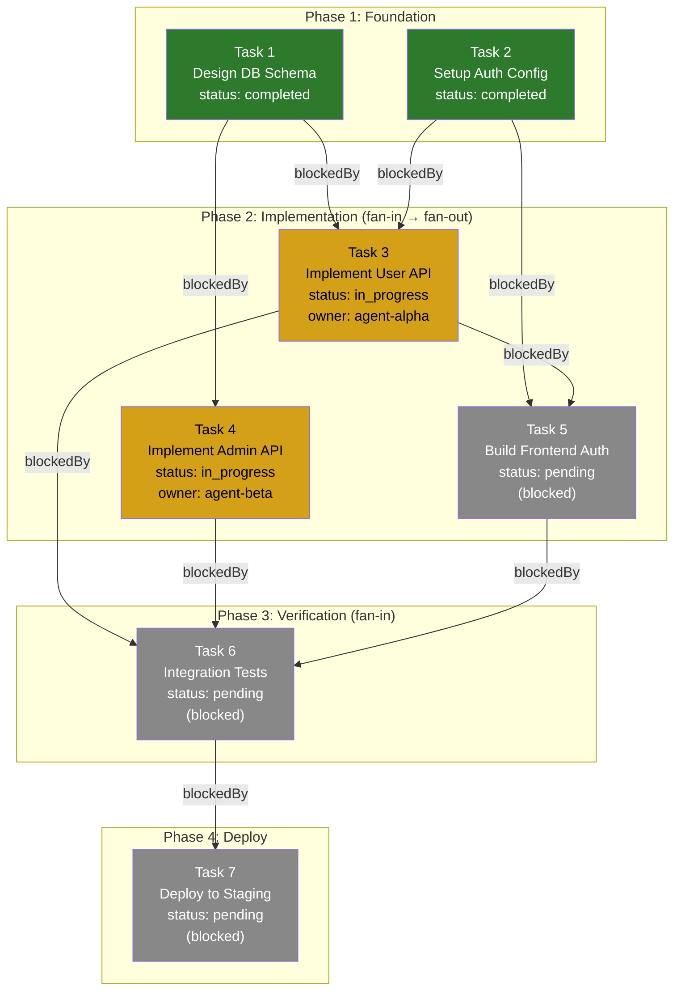
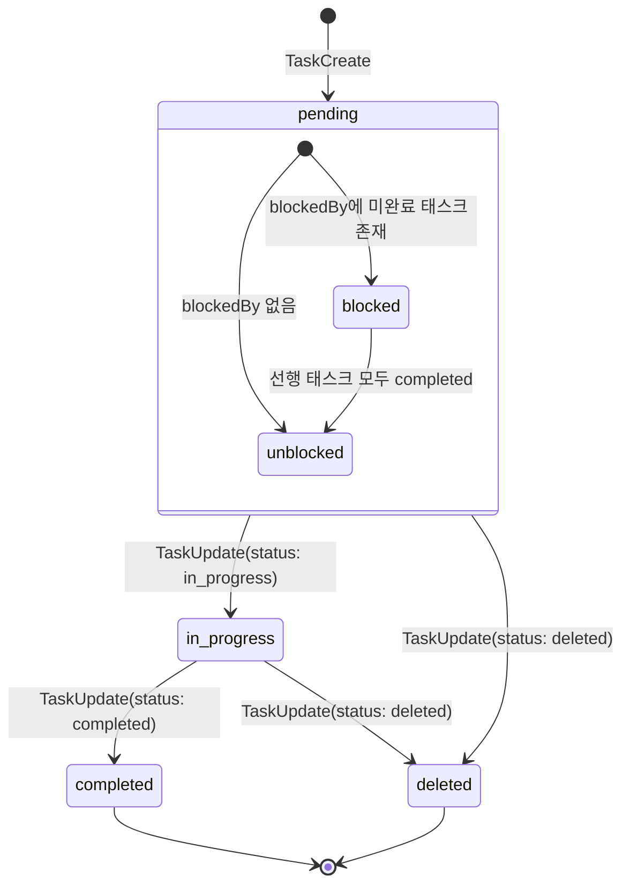

# Claude Code Tasks 시스템 DAG 리서치 리포트

> 작성일: 2026-03-18
> 대상 버전: Claude Code v2.1.16+ (2025-01-22 도입)
> 참조: GEODE `core/orchestration/task_system.py`, `core/cli/sub_agent.py`

---

## 1. 배경: Todo에서 Tasks로의 전환

### 1.1 Todo 시스템의 한계

Claude Code는 초기에 `TodoRead` / `TodoWrite` 도구로 작업을 추적했다. 이 시스템에는 구조적 한계가 있었다.

| 한계 | 설명 |
|------|------|
| **메모리 내 저장** | Todo 항목은 대화 컨텍스트에만 존재. 세션 종료 시 소멸 |
| **의존성 미지원** | 단순 체크리스트 구조. 태스크 간 선후 관계 표현 불가 |
| **세션 격리** | 다른 세션이나 서브에이전트와 상태 공유 불가 |
| **컨텍스트 소비** | Todo 전체가 컨텍스트 윈도우를 점유. `/compact` 시 유실 위험 |
| **확장 불가** | 메타데이터, 소유자 지정, 상태 머신 등 복잡한 워크플로우 불가 |

### 1.2 Tasks 시스템의 해결

2025년 1월 22일 v2.1.16에서 Anthropic은 Todo를 Tasks로 전환했다. Boris Cherny(Anthropic)의 공식 발표:

> "We're turning Todos into Tasks in Claude Code. Tasks are a new primitive that help Claude Code track and complete more complicated projects and collaborate on them across multiple sessions or subagents."

Tasks 시스템이 해결한 핵심 문제:

| 해결 | 메커니즘 |
|------|----------|
| **파일시스템 영속** | `~/.claude/tasks/` 디렉토리에 JSON 파일로 저장. 세션 종료 후에도 유지 |
| **DAG 의존성** | `addBlockedBy` / `addBlocks`로 방향성 비순환 그래프(DAG) 형성 |
| **세션 간 공유** | `CLAUDE_CODE_TASK_LIST_ID` 환경변수로 복수 세션이 동일 태스크 리스트 접근 |
| **컨텍스트 절약** | 계획이 디스크에 저장되므로 `/clear`나 `/compact` 후에도 로드맵 유지 |
| **소유권 관리** | `owner` 필드로 멀티 에이전트 환경에서 충돌 방지 |

---

## 2. Core API (5개 도구)

Tasks 시스템은 5개의 tool_use 도구로 구성된다.

### 2.1 TaskCreate

태스크를 생성한다. 생성 시 상태는 항상 `pending`.

**파라미터:**

| 파라미터 | 필수 | 타입 | 설명 |
|----------|------|------|------|
| `subject` | O | string | 명령형 동사로 시작 ("Implement X", "Fix Y") |
| `description` | O | string | 다른 에이전트가 이해할 수 있는 충분한 상세 |
| `activeForm` | X | string | `in_progress` 시 스피너에 표시할 현재진행형 텍스트 ("Fixing auth bug") |
| `metadata` | X | object | 임의 key-value. 기능 분류, 우선순위, 페이즈 번호 등 |
| `addBlockedBy` | X | string[] | 이 태스크가 의존하는 선행 태스크 ID 목록 |
| `addBlocks` | X | string[] | 이 태스크가 블로킹하는 후행 태스크 ID 목록 |

**호출 예시:**

```json
{
  "tool": "TaskCreate",
  "input": {
    "subject": "Design database schema",
    "description": "Create PostgreSQL schema for user auth tables with proper indices and constraints",
    "activeForm": "Designing database schema",
    "metadata": {
      "phase": 1,
      "feature": "auth",
      "priority": "high"
    }
  }
}
```

### 2.2 TaskUpdate

기존 태스크의 상태, 의존성, 소유자를 변경한다.

**파라미터:**

| 파라미터 | 필수 | 타입 | 설명 |
|----------|------|------|------|
| `taskId` | O | string | 갱신 대상 태스크 ID |
| `status` | X | enum | `pending`, `in_progress`, `completed`, `deleted` |
| `addBlockedBy` | X | string[] | 추가할 선행 의존 태스크 ID |
| `addBlocks` | X | string[] | 추가할 후행 블로킹 태스크 ID |
| `owner` | X | string | 소유 에이전트 이름 (충돌 방지) |

**호출 예시:**

```json
// 작업 시작
{
  "tool": "TaskUpdate",
  "input": {
    "taskId": "task-001",
    "status": "in_progress",
    "owner": "agent-alpha"
  }
}

// 작업 완료
{
  "tool": "TaskUpdate",
  "input": {
    "taskId": "task-001",
    "status": "completed"
  }
}

// 의존성 추가
{
  "tool": "TaskUpdate",
  "input": {
    "taskId": "task-003",
    "addBlockedBy": ["task-001", "task-002"]
  }
}
```

### 2.3 TaskGet

단일 태스크의 전체 상세 정보를 조회한다. `blocks`, `blockedBy` 관계가 포함된다.

**파라미터:**

| 파라미터 | 필수 | 타입 | 설명 |
|----------|------|------|------|
| `taskId` | O | string | 조회 대상 태스크 ID |

**시스템 프롬프트 주의사항:** TaskGet에는 "Staleness" 섹션이 포함되어 있어, TaskUpdate 전에 반드시 최신 상태를 TaskGet으로 확인하도록 유도한다. 이는 멀티 세션 환경에서 다른 에이전트가 상태를 변경했을 수 있기 때문이다.

**반환 예시:**

```json
{
  "taskId": "task-003",
  "subject": "Run integration tests",
  "description": "Execute full test suite and verify all endpoints",
  "status": "pending",
  "owner": null,
  "activeForm": "Running integration tests",
  "metadata": { "phase": 3 },
  "blockedBy": ["task-001", "task-002"],
  "blocks": ["task-004"]
}
```

### 2.4 TaskList

전체 태스크 목록의 요약 정보를 반환한다. **컨텍스트 절약을 위해 의도적으로 최소 필드만 반환**한다. `description`이나 `metadata`가 필요하면 개별 `TaskGet` 호출이 필요하다.

**파라미터:** 없음 (현재 활성 태스크 리스트 전체 반환)

**반환 필드:**

| 필드 | 설명 |
|------|------|
| `id` | 태스크 고유 ID |
| `subject` | 태스크 제목 |
| `status` | 현재 상태 |
| `owner` | 소유 에이전트 |
| `blockedBy` | 선행 의존 태스크 ID 목록 |

**시스템 프롬프트 지침:** TaskUpdate로 태스크를 resolve한 후 반드시 TaskList를 호출하여 다음 처리할 태스크를 확인하도록 권장한다.

### 2.5 TaskOutput

백그라운드 에이전트나 비동기 태스크의 결과를 조회한다.

**파라미터:**

| 파라미터 | 필수 | 타입 | 설명 |
|----------|------|------|------|
| `taskId` | O | string | 결과를 조회할 태스크 ID |
| `block` | X | boolean | `true` (기본값): 태스크 완료까지 대기. `false`: 현재 상태만 반환 |

**동작 모드:**

- **Blocking** (`block: true`): 태스크가 완료될 때까지 대기 후 결과 반환. 동기적 파이프라인에서 사용.
- **Non-blocking** (`block: false`): 현재 시점의 상태와 부분 결과만 반환. 폴링 패턴에서 사용.

**주의사항:** 복수의 백그라운드 에이전트에 대해 blocking TaskOutput을 동시에 호출하면 세션이 무한 대기 상태에 빠질 수 있다 (GitHub issue #17540). 에이전트는 결과를 `$CLAUDE_SCRATCHPAD_DIR`에 파일로 기록하고 `DONE|{path}` 형태로 반환하는 패턴을 사용하여 컨텍스트 고갈을 방지한다.

---

## 3. DAG 구조 상세

### 3.1 의존성 그래프 형성

`addBlockedBy`와 `addBlocks`는 태스크 간 **방향성 비순환 그래프(DAG)**를 형성한다. 두 파라미터는 동일한 관계의 양방향 표현이다.

```
addBlockedBy: "B는 A가 끝나야 시작 가능" → A → B (A가 B를 블로킹)
addBlocks:    "A는 B를 블로킹"             → A → B (동일 관계)
```

### 3.2 Mermaid DAG 다이어그램

아래는 전형적인 멀티스텝 프로젝트의 Tasks DAG 구조를 보여준다.



### 3.3 Fan-Out / Fan-In 패턴

Tasks DAG는 두 가지 핵심 분기 패턴을 지원한다.

**Fan-Out** (1:N): 하나의 선행 태스크 완료 후 N개의 독립 태스크가 병렬 실행 가능.

```json
// Task 1 완료 → Task 2, 3, 4 동시 시작 가능
TaskCreate({ subject: "Parse config",     id: "1" })
TaskCreate({ subject: "Build module A",   id: "2", addBlockedBy: ["1"] })
TaskCreate({ subject: "Build module B",   id: "3", addBlockedBy: ["1"] })
TaskCreate({ subject: "Build module C",   id: "4", addBlockedBy: ["1"] })
```

**Fan-In** (N:1): N개의 선행 태스크가 모두 완료되어야 후행 태스크가 시작 가능.

```json
// Task 2, 3, 4 모두 완료 → Task 5 시작 가능
TaskCreate({ subject: "Run full tests",   id: "5", addBlockedBy: ["2", "3", "4"] })
```

### 3.4 위상 정렬 기반 실행 순서

Tasks 시스템은 DAG의 위상 정렬(topological sort)로 실행 순서를 결정한다. 의존성이 없는 태스크들은 동일 배치(batch)에서 병렬 실행 가능하다.

```
Batch 0: [T1, T2]        ← 의존성 없음, 동시 실행
Batch 1: [T3, T4]        ← T1, T2 완료 후 실행
Batch 2: [T5]            ← T3 완료 후 실행
Batch 3: [T6]            ← T3, T4, T5 모두 완료 후 실행
Batch 4: [T7]            ← T6 완료 후 실행
```

이는 GEODE의 `TaskGraph.topological_order()` 구현과 동일한 원리다.

### 3.5 순환 의존 방지

DAG에서 순환 의존은 교착 상태를 유발한다. Tasks 시스템은 `addBlockedBy` / `addBlocks` 설정 시 순환을 탐지하여 거부한다.

```
금지: A → B → C → A  (순환)
허용: A → B → C      (비순환)
       ↘ D → C       (다중 경로, 비순환)
```

---

## 4. 세션 간 공유 메커니즘

### 4.1 CLAUDE_CODE_TASK_LIST_ID 환경변수

멀티 세션 조율의 핵심은 `CLAUDE_CODE_TASK_LIST_ID` 환경변수다. 이 변수를 설정하면 해당 ID의 태스크 리스트를 공유한다.

```bash
# 세션 A: 태스크 리스트 생성 + 작업
CLAUDE_CODE_TASK_LIST_ID=my-project claude

# 세션 B: 동일 태스크 리스트에 접근
CLAUDE_CODE_TASK_LIST_ID=my-project claude

# 세션 C: 또 다른 독립 태스크 리스트
CLAUDE_CODE_TASK_LIST_ID=other-project claude
```

저장 경로: `~/.claude/tasks/<CLAUDE_CODE_TASK_LIST_ID>/tasks.json`

### 4.2 멀티 세션 동시 접근

복수 세션이 동일 태스크 리스트에 접근할 때의 조율 메커니즘:

| 메커니즘 | 설명 |
|----------|------|
| **파일 기반 공유** | 모든 세션이 동일 JSON 파일을 읽고 쓴다. 한 세션의 변경이 즉시 다른 세션에 반영 |
| **owner 필드** | 태스크를 `in_progress`로 전환할 때 `owner`를 설정하여 다른 에이전트의 중복 작업 방지 |
| **TaskGet Staleness** | TaskUpdate 전 반드시 TaskGet으로 최신 상태 확인. 다른 세션의 변경 반영 |

```
Session A                          Session B
    │                                  │
    ├─ TaskList()                      │
    │  → [T1: pending, T2: pending]    │
    │                                  ├─ TaskList()
    │                                  │  → [T1: pending, T2: pending]
    ├─ TaskUpdate(T1, in_progress,     │
    │             owner: "A")          │
    │                                  ├─ TaskList()
    │                                  │  → [T1: in_progress/A, T2: pending]
    │                                  ├─ TaskUpdate(T2, in_progress,
    │                                  │             owner: "B")
    ├─ TaskUpdate(T1, completed)       │
    │                                  ├─ TaskUpdate(T2, completed)
    │                                  │
```

### 4.3 서브에이전트 조율

부모 에이전트와 자식 서브에이전트가 동일한 `CLAUDE_CODE_TASK_LIST_ID`를 공유하여 작업을 분배한다.

```
Parent Agent (CLAUDE_CODE_TASK_LIST_ID=project-x)
  │
  ├─ TaskCreate("Implement auth API")      → task-001
  ├─ TaskCreate("Build frontend", blockedBy: ["task-001"])  → task-002
  ├─ TaskCreate("Write tests", blockedBy: ["task-001"])     → task-003
  │
  ├─ spawn SubAgent-A (CLAUDE_CODE_TASK_LIST_ID=project-x)
  │     └─ TaskUpdate(task-001, in_progress, owner: "sub-A")
  │     └─ ... 작업 수행 ...
  │     └─ TaskUpdate(task-001, completed)
  │
  ├─ spawn SubAgent-B (CLAUDE_CODE_TASK_LIST_ID=project-x)
  │     └─ TaskUpdate(task-002, in_progress, owner: "sub-B")   ← task-001 완료 확인 후
  │
  ├─ spawn SubAgent-C (CLAUDE_CODE_TASK_LIST_ID=project-x)
  │     └─ TaskUpdate(task-003, in_progress, owner: "sub-C")   ← task-001 완료 확인 후
  │
  └─ TaskOutput(task-001, block: true)  → 결과 수집
```

---

## 5. 상태 머신

### 5.1 상태 전이 다이어그램



### 5.2 상태 설명

| 상태 | 설명 | 전이 조건 |
|------|------|----------|
| `pending` | 초기 상태. 모든 태스크는 이 상태로 생성 | TaskCreate 호출 시 |
| `pending (blocked)` | `blockedBy` 리스트에 미완료 태스크 존재 시 암시적 서브 상태 | 선행 태스크가 `completed`가 아닐 때 |
| `pending (unblocked)` | 모든 선행 태스크 완료. 실행 가능 상태 | 선행 태스크 모두 `completed` |
| `in_progress` | 에이전트가 작업 중. `activeForm` 텍스트가 스피너에 표시 | TaskUpdate로 명시적 전환 |
| `completed` | 작업 완료. 이 태스크에 의존하는 후행 태스크가 unblock | TaskUpdate로 명시적 전환 |
| `deleted` | 취소/삭제. 논리적 삭제로 DAG에서 제거 | TaskUpdate로 명시적 전환 |

### 5.3 GEODE TaskStatus와의 비교

| Claude Code Tasks | GEODE TaskSystem | 비고 |
|-------------------|------------------|------|
| `pending` | `PENDING` | 동일 |
| `pending (blocked)` | (의존성 미충족 시 PENDING 유지) | GEODE는 별도 서브 상태 없음 |
| — | `READY` | GEODE 고유. 의존성 충족 시 자동 전이 |
| `in_progress` | `RUNNING` | 동일 개념, 명칭 차이 |
| `completed` | `COMPLETED` | 동일 |
| `deleted` | `SKIPPED` | 유사. GEODE는 실패 전파로 SKIPPED 설정 |
| — | `FAILED` | GEODE 고유. Claude Code는 명시적 실패 상태 없음 |

---

## 6. AgenticLoop과의 통합

### 6.1 자동 TaskCreate 트리거

Claude Code의 AgenticLoop은 복잡한 멀티스텝 작업(3단계 이상)을 감지하면 자동으로 Tasks를 생성한다. 이는 시스템 프롬프트에 의해 유도된다.

```
사용자 요청: "auth 시스템 전체를 리팩터링해줘"

AgenticLoop 판단:
  1. 작업 규모 분석 → 3단계 이상 → TaskCreate 트리거
  2. 작업 분해:
     - Task 1: 현재 auth 코드 분석
     - Task 2: 새 스키마 설계
     - Task 3: 마이그레이션 코드 작성 (blockedBy: [1, 2])
     - Task 4: 테스트 작성 (blockedBy: [3])
     - Task 5: 문서 갱신 (blockedBy: [3])
  3. 각 태스크에 대해 TaskCreate 호출
  4. 의존성 설정 (addBlockedBy)
  5. 첫 번째 배치(T1, T2) 작업 시작
```

### 6.2 작업 진행 마킹

에이전트는 각 태스크 작업 시작 전 `in_progress`로 마킹하고, 완료 후 `completed`로 마킹한다. 이 패턴은 **스피너 UI**와 연동된다.

```
작업 흐름:
  TaskUpdate(T1, status: in_progress)    → 스피너: "Analyzing current auth code"
  ... 코드 분석 수행 ...
  TaskUpdate(T1, status: completed)      → 스피너 종료
  TaskList()                             → 다음 실행 가능 태스크 확인
  TaskUpdate(T2, status: in_progress)    → 스피너: "Designing new schema"
  ...
```

### 6.3 Plan Mode에서 Tasks로 변환

Claude Code의 Plan 모드(`/plan`)에서 생성한 계획을 Tasks로 변환할 수 있다. Plan이 구조화된 단계 목록을 제공하면, AgenticLoop이 이를 TaskCreate 호출 시퀀스로 변환한다.

```
/plan "Build a REST API with auth"

Plan Output:
  1. Design database schema
  2. Implement user model
  3. Create auth middleware
  4. Build API endpoints
  5. Write integration tests

→ AgenticLoop 변환:
  TaskCreate(subject: "Design database schema", ...)
  TaskCreate(subject: "Implement user model", addBlockedBy: [1])
  TaskCreate(subject: "Create auth middleware", addBlockedBy: [1])
  TaskCreate(subject: "Build API endpoints", addBlockedBy: [2, 3])
  TaskCreate(subject: "Write integration tests", addBlockedBy: [4])
```

### 6.4 컨텍스트 경제 (Context Economy)

Tasks의 가장 큰 이점은 **컨텍스트 경제**다. 계획이 디스크에 영속되므로 에이전트는 공격적으로 컨텍스트를 관리할 수 있다.

```
Before Tasks (Todo):
  컨텍스트 = [시스템 프롬프트 + 대화 이력 + Todo 전체 + 작업 중 코드]
  → /compact 시 Todo 유실 위험

After Tasks:
  컨텍스트 = [시스템 프롬프트 + 대화 이력 + 작업 중 코드]
  → /clear 후에도 TaskList()로 로드맵 복원
  → 토큰 절약 → 더 긴 작업 세션 가능
```

---

## 7. 설계 원칙

### 7.1 Karpathy P8 — Dumb Platform (멍청한 플랫폼)

Tasks 시스템은 **저장과 조회만 담당**한다. 어떤 태스크를 언제 실행할지, 어떤 순서로 처리할지의 **조율 로직은 전적으로 에이전트(LLM)**가 결정한다.

```
Tasks 시스템 (Dumb Platform):
  ├─ 저장: TaskCreate → JSON 파일에 기록
  ├─ 조회: TaskList/TaskGet → JSON 파일에서 읽기
  ├─ 갱신: TaskUpdate → JSON 파일 수정
  └─ 결과: TaskOutput → 백그라운드 태스크 결과 조회

에이전트 (Smart Agent):
  ├─ 작업 분해: 사용자 요청 → 태스크 목록 결정
  ├─ 의존성 설계: blockedBy/blocks 관계 설정
  ├─ 실행 전략: 병렬 가능 태스크 식별, 실행 순서 결정
  ├─ 오류 처리: 실패 시 대안 전략 수립
  └─ 완료 판단: 전체 프로젝트 완료 여부 판단
```

이는 GEODE의 `TaskGraph`가 DAG 자료구조와 상태 관리만 제공하고, 실행 전략은 `SubAgentManager`와 `AgenticLoop`에 위임하는 구조와 일치한다.

### 7.2 Karpathy P1 — 제약 기반 설계

Tasks의 상태(status)는 `pending`, `in_progress`, `completed`, `deleted`의 4개 enum으로 고정된다. 에이전트가 임의의 상태를 만들거나 상태 전이 규칙을 우회할 수 없다.

```
허용: pending → in_progress → completed
허용: pending → deleted
금지: completed → pending   (롤백 불가)
금지: deleted → in_progress (부활 불가)
금지: 임의 상태 "reviewing" (enum 외 불가)
```

이 제약은 시스템의 예측 가능성을 보장하고, 멀티 에이전트 환경에서 상태 불일치를 방지한다.

### 7.3 OpenClaw SubagentRunRecord와의 유사성

GEODE의 `SubagentRunRecord` (core/cli/sub_agent.py)와 Claude Code Tasks의 구조적 유사성:

| Claude Code Tasks | GEODE SubagentRunRecord | 공통 원칙 |
|-------------------|------------------------|----------|
| `taskId` | `task_id` | 고유 식별자 |
| `subject` | `description` | 작업 설명 |
| `status` (4종) | `status` (ok/error/timeout/partial) | 생명주기 상태 |
| `owner` | (SubAgentManager가 관리) | 실행 주체 추적 |
| `blockedBy` / `blocks` | `dependencies` (TaskGraph) | DAG 의존성 |
| `metadata` | `metadata` + `args` | 부가 정보 |
| 파일 영속 (`~/.claude/tasks/`) | 메모리 내 (세션 종료 시 소멸) | 저장 전략 차이 |

핵심 차이: Claude Code Tasks는 **파일시스템 영속**으로 세션 간 공유가 가능하지만, GEODE의 SubagentRunRecord는 **메모리 내**로 세션 내에서만 유효하다. 이는 GEODE가 단일 파이프라인 실행을 전제로 설계된 반면, Claude Code Tasks는 장기 실행 프로젝트를 대상으로 하기 때문이다.

### 7.4 GEODE TaskGraph와의 비교

GEODE의 `core/orchestration/task_system.py`는 Claude Code Tasks와 유사한 DAG 기반 태스크 시스템을 구현하고 있다.

| 기능 | Claude Code Tasks | GEODE TaskGraph |
|------|-------------------|-----------------|
| DAG 형성 | `addBlockedBy` / `addBlocks` | `Task.dependencies` 리스트 |
| 위상 정렬 | 에이전트가 수동 판단 | `topological_order()` 자동 배치 |
| 순환 탐지 | 시스템 레벨 거부 | `validate()` 메서드로 명시적 검증 |
| 실패 전파 | 에이전트가 판단 | `propagate_failure()` 자동 skip |
| 상태 enum | 4종 (pending/in_progress/completed/deleted) | 6종 (+READY, +FAILED, +SKIPPED) |
| 영속성 | 파일시스템 (`~/.claude/tasks/`) | 메모리 내 |
| 멀티 세션 | CLAUDE_CODE_TASK_LIST_ID로 공유 | 단일 세션 내 |

---

## 참고 자료

- [Claude Code 공식 문서 — How Claude Code Works](https://code.claude.com/docs/en/how-claude-code-works)
- [Claude Code 공식 Changelog](https://code.claude.com/docs/en/changelog)
- [Piebald-AI/claude-code-system-prompts — 시스템 프롬프트 아카이브](https://github.com/Piebald-AI/claude-code-system-prompts)
- [VentureBeat — Claude Code's Tasks update](https://venturebeat.com/orchestration/claude-codes-tasks-update-lets-agents-work-longer-and-coordinate-across)
- [Boris Cherny 공식 발표 (Threads)](https://www.threads.com/@boris_cherny/post/DT15_lHjmWS)
- [Claude Code Task Management Guide (claudefa.st)](https://claudefa.st/blog/guide/development/task-management)
- [Task Operations and Lifecycle (DeepWiki)](https://deepwiki.com/FlorianBruniaux/claude-code-ultimate-guide/8.2-task-operations-and-lifecycle)
- [Multi-Session Task Coordination (DeepWiki)](https://deepwiki.com/FlorianBruniaux/claude-code-ultimate-guide/8.4-multi-session-task-coordination)
- [Claude Code Todos to Tasks (Medium)](https://medium.com/@richardhightower/claude-code-todos-to-tasks-5a1b0e351a1c)
- [The Task Tool: Claude Code's Agent Orchestration System (DEV Community)](https://dev.to/bhaidar/the-task-tool-claude-codes-agent-orchestration-system-4bf2)
- GEODE 내부 참조: `core/orchestration/task_system.py`, `core/cli/sub_agent.py`
