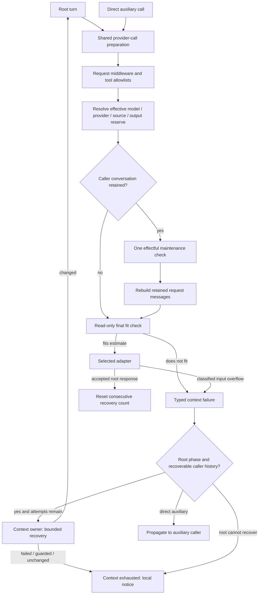

# Compaction / Context Exhaustion — source and recovery boundaries

Status: implementation candidate, pending final integrated verification and
merge. This record explains the proposed repository behavior; it does not claim
live provider acceptance, a completed release or a reproduced user incident.
The runtime contract is [Conversation Compaction](../architecture/context-compaction.md).

## Evidence scope and primary sources

The feature review uses a September 24, 2026 cutoff. Upstream source selection
used `2026-09-24T23:59:59Z`; retrieval was September 25 KST, including September
24 evening UTC. These are distinct dates, not a claim that every selected
commit existed before September 24 ended in Korea. Public documentation was
retrieved September 25; mutable pages do not establish their earlier contents.
The older September 17 Codex comparison remains a separate historical snapshot.

| Primary source, pinned where possible | Observed contract → GEODE decision |
|---|---|
| [Codex `549455f3ec5a7f2a0489894543a0e49f307142a6`](https://github.com/openai/codex/blob/549455f3ec5a7f2a0489894543a0e49f307142a6/codex-rs/core/src/session/context_window.rs), commit September 24 21:38:09 UTC | Distinguishes full-window fit from automatic-compaction scope. Bundled model defaults and effective-window policy are client behavior, not proof of an account's endpoint entitlement. |
| [Codex remote result owner](https://github.com/openai/codex/blob/549455f3ec5a7f2a0489894543a0e49f307142a6/codex-rs/core/src/compact_remote_v2.rs) | Requires a completed native result and preserves its continuity metadata. A text summary is not an interchangeable native checkpoint. |
| [Hermes `749220ef0007f8d87bd1531f1c24b0fe93816385`](https://github.com/NousResearch/hermes-agent/blob/749220ef0007f8d87bd1531f1c24b0fe93816385/agent/turn_overflow.py), commit September 24 20:17:16 UTC | Bounds provider-overflow recovery and distinguishes estimated progress from accepted continuation. Reuse GEODE's operation outcome instead of a removed-message count. |
| [Grok Build `f0e3be1100ef5252488e3be8bb0e91cf68d8c305`](https://github.com/xai-org/grok-build/blob/f0e3be1100ef5252488e3be8bb0e91cf68d8c305/crates/codegen/xai-grok-shell/src/session/compaction.rs), commit September 23 16:52:41 UTC | Checks cancellation and preserves current state across replacement. Its observer and persistence semantics are not automatically GEODE's contract. No upstream harness was executed here. |
| [OpenAI compaction guide](https://developers.openai.com/api/docs/guides/compaction) | Automatic context management and standalone compaction are different entry points. Standalone input must already fit; public availability does not implement a GEODE backend or authorize a subscription route. |
| Claude [threshold](https://platform.claude.com/docs/en/build-with-claude/compaction-threshold), [on-demand](https://platform.claude.com/docs/en/build-with-claude/compaction-on-demand), and [thinking-block](https://platform.claude.com/docs/en/build-with-claude/compaction-thinking-blocks) contracts | Native block placement, active-prefix interpretation and signed replay must survive. Keep the existing threshold backend; guard generic replacement after native compaction instead of inventing an on-demand backend. |
| [Z.AI error table](https://docs.z.ai/api-reference/api-code) | Code 1261 with the documented input-length message is context overflow. Generic 1210 and output-parameter errors are not. |
| OpenRouter [model metadata](https://openrouter.ai/docs/api/api-reference/models/list-all-models-and-their-properties) and [provider routing](https://openrouter.ai/docs/guides/routing/provider-selection) | Aggregate model metadata, selected endpoint limits and account access differ. Do not apply the largest aggregate value or a direct-provider name as an endpoint guarantee. |

The [provider refresh source inventories](provider-refresh-20260924.md)
own the broader model/API/subscription review. Context metadata retains its
origin: provider catalogue, bundled client default or fallback. Unknown input
caps remain unknown; response reserve uses the selected request's wire policy.
Codex's omitted Platform output parameter requires a local planning reserve.

The previous universal 200K rule conflated admission, pricing and maintenance.
[Claude's rate-limit documentation](https://platform.claude.com/docs/en/api/rate-limits)
and [OpenAI's pricing table](https://developers.openai.com/api/docs/pricing)
describe provider/model-specific constraints, not one shared 200K admission
boundary. The existing field remains a soft local maintenance preference.
This is not permission to send arbitrarily large requests.

Research also separates compression from task success. The authors of
[TRACE, 2608.06503v1](https://arxiv.org/abs/2608.06503v1) evaluate continuation
decisions, while [Compaction Cliff, 2608.22752v1](https://arxiv.org/abs/2608.22752v1)
examines repeated constraint retention. These motivate continuation and repeated
compaction oracles; their reported results are not GEODE measurements or a
ranking of current proprietary harnesses.

## Counterexample → owner change → regression boundary

Archived pre-fix probes exercised actual GEODE owners with a fake adapter or
summary, isolated temporary state and blocked operator credentials/network.
The root/auxiliary hook probe pins GEODE
`93532f82524b65172ed9ffe32e4c17435688c3e8`: one physical root request invoked
the soft-defer handler twice; the direct auxiliary control invoked it once.
Earlier recovery probes pin `1decea9ba3ed4c3081c9926907cda504516e90b4`.
They establish local counterexamples, not real endpoint overflow or an exact
historical user incident. Current regression files below own the candidate
fixes; final integrated results must be recorded separately.

| Counterexample | Candidate owner correction | Regression owner |
|---|---|---|
| Provider rejects input while local estimate is below warning; recovery does nothing. A useful summary can retain the same message count. | `_phases` bounds retries after classified rejection and consumes `ContextOperationResult.status`; the next accepted response resets the consecutive recovery count. | [Recovery](../../tests/core/agent/test_context_recovery.py) |
| GLM 1261 input-length rejection becomes generic `bad_request`. | `classify_llm_error` matches the bounded code/message combination without absorbing generic parameter errors. | [Error classification](../../tests/core/llm/test_classify_llm_error.py) |
| Root preparation and dispatch both run effectful pressure handling. A request transform can change the effective route or replace its conversation. | Shared preparation performs maintenance once after request middleware and allowlists, using the actual route. Replacement conversations cannot mutate original history; the final fit check stays read-only. | [Request admission](../../tests/core/agent/test_provider_context_admission.py), [recovery](../../tests/core/agent/test_context_recovery.py) |
| A `PreCompact` rewrite changes model/provider/hard for later handlers while execution uses the original values. | Public-hook validation accepts only `keep_recent`; a mixed read-only rewrite is rejected in full, audited, and leaves the original payload intact. | [Public hooks](../../tests/core/hooks/test_public_hooks.py) |
| Historical content before a successful native block inflates local pressure; generic text replacement could invalidate native continuity. | Estimate the active Anthropic PAYG suffix without changing stored bytes. Open client summaries for known compatible histories; guard unknown Anthropic models and native-block histories. | [Context estimates](../../tests/core/agent/test_context_monitor.py), [compaction phases](../../tests/core/orchestration/test_compaction_phases.py) |
| A recent original request falls outside the retained tail; summary awaits can race with history changes. | Retain the latest explicitly marked original input and causal tail. Adopt appended messages, reject an edited/replaced summarized prefix, and block nested compaction commits. | [Conversation provenance](../../tests/core/agent/test_conversation.py), [compaction phases](../../tests/core/orchestration/test_compaction_phases.py), [manager](../../tests/core/agent/test_context_manager.py) |
| `persisted` is mistaken for a full session checkpoint; a failed checkpoint can leave a summary artifact. | Preserve the existing artifact → replacement → optional commit → Post ordering and document each durability boundary. The remaining artifact is not fabricated checkpoint success. | [Manager](../../tests/core/agent/test_context_manager.py), [compaction phases](../../tests/core/orchestration/test_compaction_phases.py) |
| Exhaustion asks another configured model to claim the session reset; not all callers reset it. | Return a truthful local notice with the existing async interface and common history finalizer. No notice-only provider call or new usage schema. | [Terminal notice](../../tests/core/hooks/test_extract_learning_models_adapter.py), [auxiliary usage](../../tests/core/llm/test_auxiliary_usage.py) |

## Execution graph

Execution middleware wraps the final fit check and adapter. The graph does not
grant middleware a second mutable compaction pass. Automatic recovery belongs
to the root phase; sharing admission does not make every auxiliary caller an
automatic retry owner. Internal `can_recover_history` prevents request-local
replacement failures from summarizing another conversation. Public hook schema
versions remain unchanged.

Manual `/compact`, the `manage_context` tool and model-switch adaptation use
the same context owner. `/compact` supplies a strict checkpoint callback when
it owns a checkpoint; the tool/model-switch paths rely on their surrounding
turn's subsequent checkpoint. `PostCompact.persisted` describes only the
summary artifact. A failed callback can roll back the live list while leaving
that artifact. Post-handler failure cannot undo committed history; cancellation
still propagates. Cheap masking and pruning are separate operations, not
unreported successful summary attempts.

## Validation limits and acceptance

- Final verification must bind the integrated revision to its actual checks.
  This document contains no new test-pass totals or paid/live success claim.
- Estimated fit, a committed replacement, a provider-accepted next request and
  verifier-backed task completion are different outcomes. Test each boundary;
  do not substitute a shorter history or successful summary call for the last.
- A protected user/tool/native tail can still be too large. Failure remains
  explicit; preservation does not expand endpoint capacity.
- Local summaries do not prove semantic retention. Repeated compression needs
  next-action and constraint-retention evidence on fixed tasks and routes.
- No authenticated account limits, cache hits, subscription entitlements or
  real native acceptance were tested by this research. No new OpenAI native or
  Anthropic on-demand backend is introduced. Existing unsupported subscription
  routes remain guarded.
- Source comparisons explain mechanisms; they do not establish GEODE parity,
  superiority, benchmark results or private hosted-harness internals.
