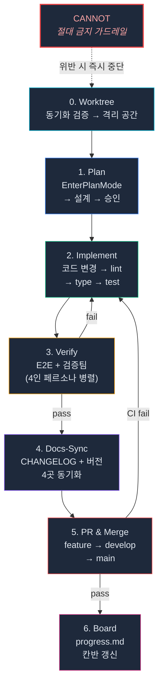

# GEODE Development Workflow

> [README](../README.md) | [Architecture](architecture.md) | **Workflow** | [Setup](setup.md)

## Overview

> **설계 원칙**: CANNOT(가드레일)이 CAN(자유도)보다 먼저 온다. 제약이 품질을 담보한다. (Karpathy P1)



---

## CANNOT -- 절대 금지 규칙

어떤 단계에서든 위반 불가. 위반 시 즉시 중단하고 수정.

| 영역 | 금지 사항 |
|------|----------|
| **Git** | worktree 없이 작업 시작 / main/develop 직접 push / 타 세션 worktree 삭제 / feature에서 progress.md 수정 / 동기화 미확인 상태에서 feature 생성 |
| **워크플로우** | Plan 없이 구현 착수 (단순 버그/문서 수정 제외) / 칸반 필수 컬럼 빈칸 기재 |
| **품질** | lint/type/test 실패 상태 커밋 / 테스트 수치 자리표시자(XXXX) / live 테스트 무단 실행 |
| **문서** | 코드 커밋에서 CHANGELOG 누락 / main에 `[Unreleased]` 잔류 / 버전 4곳 불일치 |
| **PR** | 인라인 `--body` 사용 / 변경 파일 Why 근거 누락 / HEREDOC 미사용 |

---

## CAN -- 허용된 자유도

CANNOT에 없는 것은 자유롭게 할 수 있다.

| 자유도 | 설명 |
|--------|------|
| 단순 버그/문서 수정 | Plan 생략, worktree에서 바로 구현 |
| 플랜에 없는 개선 발견 시 | 현재 작업 완료 후 다음 이터레이션에서 처리 |
| 테스트 선별 실행 | 변경 범위에 해당하는 테스트만 먼저 실행, 최종은 전체 |
| 커밋 메시지 언어 | 한글/영어 자유 (일관성만 유지) |
| 도구 선택 | 동일 결과면 더 빠른 도구 자유 선택 |

---

## Workflow Steps

| 단계 | 게이트 | 재귀 조건 |
|------|--------|-----------|
| **0. Worktree** | `git fetch` → main/develop 동기화 검증 → `git worktree add` + `.owner` | -- |
| **1. Plan** | EnterPlanMode → 설계 → ExitPlanMode → TaskCreate (칸반 연동) | -- |
| **2. Implement** | `ruff check` + `mypy` + `pytest` | 실패 시 수정 반복 |
| **3. Verify** | Mock E2E + CLI dry-run + 검증팀 4인 병렬 | 실패 시 2번 복귀 |
| **4. Docs-Sync** | CHANGELOG + 버전 4곳 + 수치 동기화 | -- |
| **5. PR & Merge** | feature → develop → main (GitFlow) | CI 실패 시 2번 복귀 |
| **6. Board** | `docs/progress.md` 칸반 갱신 (main에서만) | -- |

---

## GitFlow

```
feature/<task> ──PR──▸ develop ──PR──▸ main
                      (CI 필수)        (CI 필수)
```

### Worktree Lifecycle

```
alloc → own(.owner) → execute(isolated) → free(worktree remove)
```

```bash
# 1. Worktree 할당
git fetch origin
git worktree add .claude/worktrees/<task> -b feature/<branch> develop
echo "session=$(date -Iseconds) task_id=<task>" > .claude/worktrees/<task>/.owner

# 2. 작업 수행 (격리된 워킹 디렉토리)
# ... implement, test, commit ...

# 3. 작업 완료 후 정리
git push -u origin feature/<branch>
git worktree remove .claude/worktrees/<task>
```

### Branch Protection

- main/develop 직접 push 금지 -- PR + CI 필수
- hotfix도 feature → develop → main GitFlow 준수
- worktree 내 `git checkout` 전환 금지 (격리 유지)
- 타 세션 worktree 삭제 금지 (`.owner` 불일치)

---

## Kanban Board (`docs/progress.md`)

멀티 에이전트 공유 칸반. 모든 세션이 읽고 갱신합니다.

```
Backlog → In Progress → In Review → Done
```

| 규칙 | 설명 |
|------|------|
| **main-only** | progress.md는 main에서만 수정 (feature/develop 금지) |
| **3-Checkpoint** | alloc(Step 0) → free(PR merge 후) → session-start(교차 검증) |
| **필수 컬럼** | task_id/작업 내용은 모든 상태에서 필수. 빈칸 금지, "--" 허용 |
| **Task 연동** | TaskCreate subject ↔ 칸반 task_id 1:1 매핑 |

---

## Quality Gates

| 게이트 | 명령어 | 기준 |
|--------|--------|------|
| Lint | `uv run ruff check core/ tests/` | 0 errors |
| Type | `uv run mypy core/` | 0 errors |
| Test | `uv run pytest tests/ -q` | 3109+ pass |
| E2E | `uv run geode analyze "Cowboy Bebop" --dry-run` | A (68.4) |

---

## Docs-Sync

| 동기화 대상 | 검증 |
|-----------|------|
| 버전 4곳 | CHANGELOG, CLAUDE.md, README.md, pyproject.toml |
| 수치 | Tests, Modules, Commands -- 실측값 |

**버전업**: 새 기능 = MINOR, 버그 = PATCH, 문서만 = 안 함.

---

## Failure Modes

| 시나리오 | 감지 | 조치 |
|----------|------|------|
| 네트워크 다운 | `git fetch` 실패 | 작업 중단, 사용자에게 보고 |
| `.owner` 파일 부재 | worktree stat 실패 | 실행 거부 -- 격리 위반 |
| CI 30분+ 타임아웃 | `gh pr checks` 미응답 | 잡 취소, 테스트 진단 후 에스컬레이션 |
| 메모리 파일 부패 | 파싱 에러 | 해당 레코드 삭제 후 재실행 |
| Confidence 미달 (5회 반복) | loopback max 5 도달 | 사용자에게 에스컬레이션 -- 자율 override 금지 |
| LLM 프로바이더 전체 장애 | 3사 fallback chain 소진 | Degraded Response -- 파이프라인 중단 없음 |
| MCP 서버 스폰 실패 | subprocess 타임아웃 | 해당 MCP 없이 계속 (Graceful Degradation) |
